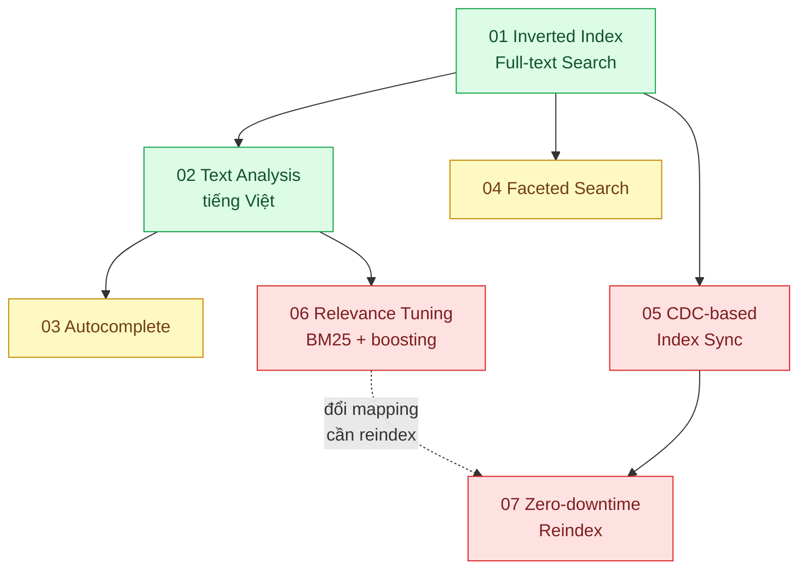

# 05 · Tìm kiếm (`backend / search`)

> **Phạm vi:** Tìm kiếm văn bản trong ứng dụng web: inverted index, phân tích tiếng Việt, gợi ý khi gõ,
> bộ lọc có số lượng, đồng bộ index với DB, xếp hạng, vận hành index. Dùng Elasticsearch/OpenSearch
> làm công cụ chính, PostgreSQL FTS làm phương án so sánh. Tìm kiếm vector thuộc scope 12;
> hybrid search cho RAG thuộc scope 10.
>
> **Câu hỏi trung tâm:** Tìm đúng thứ người dùng *muốn* (không chỉ thứ họ *gõ*) trên hàng triệu bản ghi,
> dưới 100 ms?

## Bản đồ pattern trong scope

## Danh sách bài toán

| # | Bài toán (pattern — triệu chứng) | Mức | Pattern gốc / nguồn | Trạng thái |
|---|---|---|---|---|
| 01 | [Inverted Index Full-text Search — Tìm "ao thun nam" bằng LIKE mất 8 giây và không ra "Áo Thun Nam"](./01-full-text-vs-like-tim-ao-thun-nam-mat-8-giay/) | 🟢 | Manning, Raghavan, Schütze, *Introduction to Information Retrieval* (2008) ch.1; PostgreSQL docs "Full Text Search"; Elasticsearch docs | 📋 |
| 02 | [Text Analysis for Vietnamese (tokenizer + folding) — Gõ "ha noi" không ra "Hà Nội", gõ "iphone15" không ra "iPhone 15"](./02-vietnamese-analyzer-tim-ha-noi-ra-ha-noi/) | 🟢 | Elasticsearch docs "Analysis", "ASCII folding token filter", ICU analysis plugin; PostgreSQL `unaccent` | 📋 |
| 03 | [Autocomplete / Search-as-you-type — Gợi ý sau 3 ký tự dưới 100 ms cho 2 triệu sản phẩm](./03-autocomplete-goi-y-khi-go-3-ky-tu/) | 🟡 | Elasticsearch docs "Completion suggester", "search_as_you_type", edge n-gram tokenizer | 📋 |
| 04 | [Faceted Search (aggregations) — Bộ lọc thương hiệu/giá/size phải hiện số lượng kết quả cho từng lựa chọn](./04-faceted-search-bo-loc-thuong-hieu-gia-size-kem-so-luong/) | 🟡 | Elasticsearch docs "Aggregations" (terms, range, post_filter); IIR (faceted navigation) | 📋 |
| 05 | [CDC-based Index Sync — Dữ liệu trong search lệch với DB sau mỗi lần sửa giá](./05-cdc-dong-bo-index-du-lieu-search-lech-db/) | 🔴 | Debezium docs; DDIA ch.11 "Stream Processing" (CDC); microservices.io CQRS; Transactional Outbox (scope 14) | 📋 |
| 06 | [Relevance Tuning (BM25 + boosting) — Sản phẩm bán chạy nhất nằm ở trang 3 kết quả](./06-relevance-tuning-san-pham-ban-chay-nam-trang-3/) | 🔴 | Robertson & Zaragoza, "The Probabilistic Relevance Framework: BM25 and Beyond" (2009); Elasticsearch docs "function_score", "Similarity module"; IIR ch.8 (đánh giá) | 📋 |
| 07 | [Zero-downtime Reindex (alias swap) — Đổi mapping bắt buộc reindex 50 triệu tài liệu mà search không được dừng](./07-zero-downtime-reindex-doi-mapping-50-trieu-doc/) | 🔴 | Elasticsearch docs "Aliases", "Reindex API"; Fowler "ParallelChange" (áp dụng cho index) | 📋 |

## Lộ trình đề xuất trong scope

1. **Inverted index** — hiểu vì sao LIKE không scale và inverted index làm gì; so sánh PostgreSQL FTS
   với Elasticsearch để biết khi nào chưa cần thêm hệ thống mới.
2. **Text analysis tiếng Việt** — bài đặc thù thị trường; không có bài này mọi bài sau đều "tìm không ra".
3. **Autocomplete → Faceted search** — hai tính năng người dùng thấy ngay.
4. **CDC sync** — bài hạ tầng dữ liệu; cần đọc Transactional Outbox ở scope 14.
5. **Relevance tuning** — cần bộ đánh giá (precision@k) để không "tune theo cảm giác".
6. **Zero-downtime reindex** — vận hành; làm cuối khi đã có index thật để đổi.

## Kiến thức nền cần có trước

- Khái niệm token, analyzer, inverted index, TF-IDF/BM25 ở mức trực giác.
- Đặc điểm tiếng Việt: dấu thanh, từ ghép, cách gõ không dấu phổ biến.
- Đọc `14-backend-queueing` bài 03 (Outbox) trước bài 05.

## Liên kết với scope khác

- `10-backend-ai-rag` bài 03 (Hybrid search) dùng BM25 từ scope này.
- `12-backend-database-vector` — tìm theo ngữ nghĩa bổ trợ cho tìm theo từ khóa.
- `14-backend-queueing` — CDC/outbox cho đồng bộ index.
- `23-backend-monitoring-benchmark` — đo p95 của truy vấn tìm kiếm.

## Nguồn tổng quan cho scope

- Manning, Raghavan, Schütze, *Introduction to Information Retrieval* — https://nlp.stanford.edu/IR-book/
- Elasticsearch Guide — https://www.elastic.co/guide/
- PostgreSQL docs, chương "Full Text Search".
