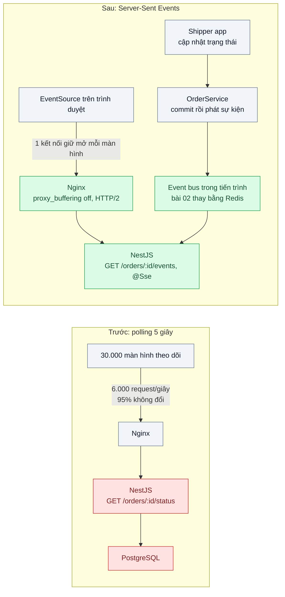
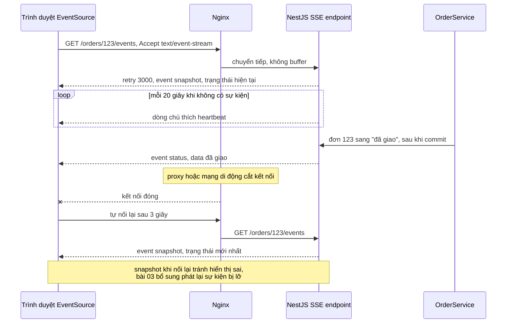

# SSE vs WebSocket vs Polling — Khách muốn thấy trạng thái đơn đổi ngay, app hiện hỏi server mỗi 5 giây

| Scope | Mức độ | Trạng thái | Pattern gốc | Cập nhật |
|---|---|---|---|---|
| 06 · frontend / backend / realtime | 🟢 Cơ bản | 📋 Kế hoạch | Server-Sent Events — HTML Living Standard "Server-sent events"; RFC 6455 (WebSocket, 2011) | 2026-10-06 |

> **Một câu tóm tắt:** Thay việc trình duyệt hỏi "có gì mới không" mỗi 5 giây bằng một kết nối HTTP giữ mở mà server đẩy sự kiện xuống khi trạng thái đơn đổi (Server-Sent Events), và chỉ dùng WebSocket khi thật sự cần hai chiều.

## 1. Bài toán thực tế (What)

**Bối cảnh** *(doanh nghiệp giả định, số liệu minh họa)*
Công ty logistics giao hàng chặng cuối cho các sàn TMĐT, khoảng 200.000 đơn đang giao mỗi ngày. Trang theo dõi đơn (Next.js) và app khách gọi `GET /orders/:id/status` mỗi 5 giây khi màn hình mở. Giờ cao điểm có khoảng 30.000 màn hình theo dõi mở cùng lúc; backend NestJS chạy một instance lớn sau Nginx.

**Triệu chứng người kinh doanh nhìn thấy**
- Khách thấy "đang giao" trong khi shipper đã bấm "giao thành công" vài giây trước, rồi gọi tổng đài hỏi; tổng đài nhận nhiều cuộc gọi kiểu này mỗi buổi tối.
- Chi phí máy chủ và băng thông cho tính năng theo dõi đơn lớn hơn cả luồng đặt đơn, dù hơn 95% câu trả lời là "không có gì thay đổi".
- Đội sản phẩm muốn giảm chu kỳ hỏi xuống 1 giây cho "cảm giác realtime" nhưng đội hạ tầng ước tính tải tăng 5 lần.

**Nguyên nhân kỹ thuật**
Polling định kỳ buộc client chọn giữa độ trễ và chi phí: chu kỳ 5 giây nghĩa là trễ trung bình 2,5 giây và tối đa 5 giây, trong khi 30.000 màn hình tạo khoảng 6.000 request mỗi giây, mỗi request đi qua xác thực, truy vấn DB và serialize chỉ để trả lời "như cũ". Giảm chu kỳ làm tải tăng tuyến tính. Bản chất nhu cầu là *một chiều*: server biết khi nào trạng thái đổi, client chỉ cần được báo.

**Ràng buộc**
- Độ trễ từ lúc trạng thái đổi tới lúc màn hình cập nhật p95 dưới 1 giây.
- Phải đi qua hạ tầng HTTP sẵn có (Nginx, CDN, proxy doanh nghiệp của khách) và cơ chế xác thực cookie hiện tại.
- Bài này chỉ một instance backend; chạy nhiều instance là bài 02, nối lại không mất sự kiện là bài 03.

## 2. Vì sao dùng pattern này (Why)

**Nguyên nhân gốc mà pattern nhắm vào:** client phải chủ động hỏi về một thay đổi mà chỉ server biết thời điểm xảy ra.

**Pattern giải quyết thế nào:** Server-Sent Events (HTML Living Standard) là một response HTTP kiểu `text/event-stream` không kết thúc; server ghi từng sự kiện dạng dòng văn bản (`event:`, `data:`, `id:`, `retry:`) khi có thay đổi. Phía trình duyệt, `EventSource` tự mở kết nối, tự nối lại khi rớt theo khoảng `retry`, và tự gửi `Last-Event-ID` khi nối lại (bài 03 khai thác). Vì vẫn là HTTP, SSE đi qua proxy, dùng cookie, chạy tốt trên HTTP/2 nơi nhiều luồng chia một kết nối TCP. WebSocket (RFC 6455) nâng cấp kết nối thành kênh hai chiều dạng frame, cần khi client gửi dữ liệu liên tục (chat, kéo thả cộng tác); với theo dõi đơn, chiều client → server hầu như không có nên WebSocket là thừa. Long polling giữ làm phương án dự phòng cho môi trường chặn stream.

**Lựa chọn khác đã cân nhắc**

| Lựa chọn | Giải quyết được gì | Vì sao không chọn (ở bài này) |
|---|---|---|
| Giữ nguyên + tối ưu nhỏ (ETag/304, cache trạng thái ở Redis, chu kỳ hỏi tăng dần) | Giảm chi phí mỗi request | Vẫn trễ theo chu kỳ; số request vẫn tỷ lệ với số màn hình |
| Long polling | Server trả lời ngay khi có thay đổi, chạy mọi nơi | Mỗi sự kiện là một request mới, phải tự xử lý nối lại và mất sự kiện giữa hai request |
| WebSocket (Socket.IO hoặc `ws`) | Hai chiều, độ trễ thấp | Thêm giao thức riêng qua proxy, tự lo nối lại và xác thực; không cần chiều client → server |
| Web Push / thông báo đẩy của app | Báo cả khi màn hình đóng | Bổ trợ chứ không thay thế cập nhật trên màn hình đang mở |
| Server-Sent Events (chọn) | Đẩy một chiều qua HTTP thường, tự nối lại, đơn giản | Mỗi màn hình giữ một kết nối; HTTP/1.1 bị giới hạn số kết nối mỗi tên miền |

## 3. Thiết kế hệ thống (How)

### 3.1 Kiến trúc trước và sau



### 3.2 Luồng chính



### 3.3 Thành phần và trách nhiệm

| Thành phần | Trách nhiệm | Quyết định thiết kế đáng chú ý |
|---|---|---|
| `useOrderEvents` (React hook) | Mở `EventSource`, cập nhật state, đóng khi rời trang | Không tự viết vòng nối lại: `EventSource` đã làm; chỉ xử lý sự kiện `snapshot` và `status` |
| `OrderEventsController` | Endpoint `@Sse()` trả `Observable` các sự kiện của một đơn | Kiểm tra quyền xem đơn trước khi mở stream; gửi `snapshot` đầu tiên |
| Event bus trong tiến trình | Phân phát sự kiện "đơn đổi trạng thái" tới các stream đang mở | Phát *sau khi commit*; một instance nên dùng RxJS `Subject` là đủ |
| Heartbeat | Ghi dòng chú thích định kỳ | Giữ kết nối qua proxy có idle timeout; giúp phát hiện client đã đi |
| Nginx | Reverse proxy cho stream | Tắt buffering cho đường dẫn SSE, tăng `proxy_read_timeout`, bật HTTP/2 phía client |
| Polling dự phòng | Chu kỳ 15 giây khi `EventSource` lỗi liên tục | Phát hiện qua sự kiện `error` lặp lại, không bật mặc định |

### 3.4 Điểm dễ sai khi triển khai
- Proxy buffer response: sự kiện dồn lại và tới cùng lúc sau nhiều giây. Tắt `proxy_buffering` cho đường dẫn SSE hoặc trả header `X-Accel-Buffering: no`, tắt nén cho `text/event-stream`.
- HTTP/1.1 giới hạn khoảng 6 kết nối mỗi tên miền mỗi trình duyệt: khách mở 7 tab theo dõi thì tab thứ 7 treo. Bật HTTP/2 giữa trình duyệt và Nginx.
- Phát sự kiện trước khi transaction commit: client nhận "đã giao" rồi tải lại trang lại thấy "đang giao". Luôn phát sau commit.
- Không gửi heartbeat: load balancer cắt kết nối im lặng sau 60 giây, client nối lại liên tục.
- Quên dọn subscription khi client đóng kết nối: rò rỉ bộ nhớ theo số lần mở trang; kiểm bằng số subscriber sau khi đóng 1.000 kết nối.

## 4. Tech stack và tác động (Impact techstack)

| Lớp | Công nghệ chọn | Vì sao chọn | Thay thế tương đương |
|---|---|---|---|
| Frontend | Next.js (App Router), `EventSource` của trình duyệt | API chuẩn, tự nối lại, không cần thư viện | `@microsoft/fetch-event-source` khi cần header tùy biến (cần xác minh) |
| Backend | NestJS 10, decorator `@Sse()` với RxJS | Hỗ trợ SSE có sẵn trong framework | Fastify ghi `reply.raw` trực tiếp |
| Phân phát nội bộ | RxJS `Subject` trong tiến trình | Đủ cho một instance; bài 02 thay bằng Redis Pub/Sub | Node `EventEmitter` |
| Proxy | Nginx với HTTP/2 | Kiểm soát buffering và timeout cho stream | Caddy, HAProxy |
| So sánh | Socket.IO 4 cho biến thể WebSocket | Đo chênh lệch tài nguyên và độ phức tạp trên cùng kịch bản | `ws` thuần |
| Đo | k6 (baseline polling), script Node mở N kết nối SSE bằng `undici`, Chrome DevTools | k6 cho request/giây; script đo số kết nối và độ trễ sự kiện; DevTools xem tab EventStream | Artillery |

**Thay đổi so với hệ thống hiện tại:** thêm endpoint SSE và event bus nội bộ, chỉnh cấu hình Nginx cho đường dẫn stream, đổi hook frontend; giữ endpoint polling làm dự phòng. Đội vận hành học thêm: theo dõi số kết nối đang mở, bộ nhớ theo kết nối, timeout của proxy.

## 5. Kết quả đầu ra và cách đo (Output impact)

| Chỉ số | Trước (minh họa) | Mục tiêu khi thực hành | Cách đo |
|---|---|---|---|
| Độ trễ đổi trạng thái tới màn hình, p95 | khoảng 5000 ms | < 1000 ms | Script ghi thời điểm cập nhật ở server và thời điểm nhận sự kiện ở client, 1.000 lần |
| Request/giây cho tính năng theo dõi ở 5.000 màn hình (thu nhỏ) | khoảng 1.000 | gần 0 ngoài lúc mở kết nối | k6 cho polling; log Nginx đếm request khi chạy SSE |
| Bộ nhớ backend mỗi 1.000 kết nối SSE | không áp dụng | ghi số thật, dùng để ước lượng 30.000 kết nối | `process.memoryUsage()` và metric Prometheus trước/sau khi mở kết nối |
| CPU backend ở cùng số màn hình | 70% (minh họa) | < 20% | `docker stats`, Prometheus `process_cpu_seconds_total` |
| Kết nối bị proxy cắt mỗi giờ | không áp dụng | 0 khi có heartbeat | Đếm sự kiện `error` phía client và log đóng kết nối phía server |
| Subscription còn sót sau khi đóng 1.000 kết nối | không áp dụng | 0 | Test tích hợp đọc số subscriber của event bus |

> Số "trước" là minh họa để hình dung bài toán. Số "mục tiêu" chỉ được coi là đạt khi có số đo thật
> ở mục 8 kèm môi trường đo.

**Tác động nghiệp vụ mong đợi:** khách thấy "đã giao" gần như cùng lúc shipper bấm, giảm cuộc gọi hỏi trạng thái; chi phí hạ tầng cho theo dõi đơn không còn tăng theo tần suất hỏi.

## 6. Đánh đổi và khi KHÔNG nên dùng

**Đánh đổi**
- Mỗi màn hình mở là một kết nối dài: cần đo bộ nhớ theo kết nối và cấu hình giới hạn file descriptor.
- Kết nối dài làm deploy phức tạp hơn: mọi client nối lại cùng lúc khi instance khởi động lại.
- Chỉ một chiều và chỉ văn bản UTF-8; dữ liệu nhị phân phải mã hóa.

**Không nên dùng khi**
- Client gửi dữ liệu liên tục và cần độ trễ thấp cả hai chiều (chat, game, bảng trắng cộng tác): dùng WebSocket.
- Dữ liệu đổi hiếm (vài lần mỗi ngày) và người dùng không ngồi chờ: polling thưa hoặc thông báo đẩy rẻ hơn giữ kết nối.
- Môi trường proxy doanh nghiệp không cho stream dài và không đổi được cấu hình: long polling là phương án an toàn hơn.

**Liên quan**
- [`../02-pubsub-fanout-3-server-socket-nguoi-a-khong-thay-nguoi-b/`](../02-pubsub-fanout-3-server-socket-nguoi-a-khong-thay-nguoi-b/) — khi chạy nhiều instance backend.
- [`../03-reconnect-resume-mat-mang-10-giay-mat-thong-bao/`](../03-reconnect-resume-mat-mang-10-giay-mat-thong-bao/) — dùng `id` và `Last-Event-ID` để không mất sự kiện khi nối lại.
- [`../../04-frontend-cache/03-stale-while-revalidate-quay-lai-trang-lai-thay-loading/`](../../04-frontend-cache/03-stale-while-revalidate-quay-lai-trang-lai-thay-loading/) — làm mới dữ liệu phía client khi chưa cần realtime.
- [`../../18-backend-scale/01-stateless-session-externalized-login-server-a-server-b-khong-biet/`](../../18-backend-scale/01-stateless-session-externalized-login-server-a-server-b-khong-biet/) — kết nối dài và trạng thái theo instance.

## 7. Cơ sở tham khảo

- WHATWG, HTML Living Standard, "Server-sent events" — https://html.spec.whatwg.org/multipage/server-sent-events.html — định dạng `text/event-stream`, các trường `event`, `data`, `id`, `retry`, hành vi nối lại của `EventSource`.
- IETF RFC 6455, "The WebSocket Protocol", 2011 — bắt tay nâng cấp, khung dữ liệu hai chiều, ping/pong; cơ sở để so sánh với SSE.
- MDN Web Docs, "Using server-sent events" — https://developer.mozilla.org/docs/Web/API/Server-sent_events/Using_server-sent_events — ví dụ phía client và lưu ý giới hạn số kết nối khi không dùng HTTP/2.
- NestJS docs, "Server-Sent Events" — https://docs.nestjs.com/techniques/server-sent-events — decorator `@Sse()` và cách trả `Observable`.
- NGINX docs, module `ngx_http_proxy_module` (`proxy_buffering`, `proxy_read_timeout`) — https://nginx.org/en/docs/ — cấu hình proxy cho stream dài.

## 8. Kế hoạch thực hành

- [ ] Bước 1: Docker Compose PostgreSQL 16 + NestJS + Nginx (HTTP/2, chứng chỉ tự ký); trang Next.js theo dõi một đơn; script giả lập shipper đổi trạng thái ngẫu nhiên.
- [ ] Bước 2: đo "trước": polling 5 giây với 5.000 màn hình giả lập bằng k6; ghi request/giây, CPU, độ trễ hiển thị.
- [ ] Bước 3: áp dụng pattern: endpoint `@Sse()` có kiểm quyền, sự kiện `snapshot` đầu tiên, heartbeat, phát sau commit; cấu hình Nginx; hook `useOrderEvents`; biến thể Socket.IO để so sánh.
- [ ] Bước 4: đo "sau" với script mở 5.000 kết nối SSE; ghi độ trễ p95, bộ nhớ mỗi 1.000 kết nối, CPU vào mục 5 kèm môi trường.
- [ ] Bước 5: viết test: (a) sự kiện tới client dưới 1 giây sau commit; (b) không phát khi transaction rollback; (c) đóng kết nối thì subscription được dọn; (d) nối lại nhận `snapshot` mới nhất.

**Cấu trúc code dự kiến**
```text
src/
  api/truoc/order-status.controller.ts     # polling, tái hiện triệu chứng
  api/sau/order-events.controller.ts       # [PATTERN] @Sse, snapshot, heartbeat
  api/sau/order-event-bus.ts               # Subject trong tiến trình, phát sau commit
  api/sau/socketio-variant.gateway.ts      # biến thể WebSocket để so sánh
  web/hooks/use-order-events.ts            # EventSource phía client
infra/nginx.conf                           # proxy_buffering off cho /events
test/
  event-arrives-within-1-second.test.ts
  rollback-emits-no-event.test.ts
  disconnect-cleans-up-subscription.test.ts
bench/
  polling.k6.js
  open-sse-connections.ts
docker-compose.yml
```

**Cách chạy** *(điền khi bắt đầu code)*
```bash
docker compose up -d
pnpm install && pnpm test
k6 run bench/polling.k6.js && pnpm tsx bench/open-sse-connections.ts --n 5000
```
