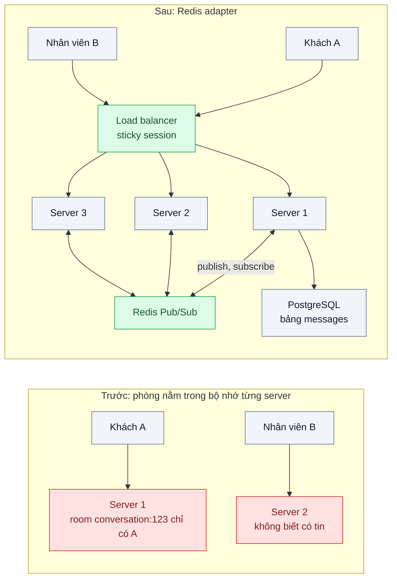
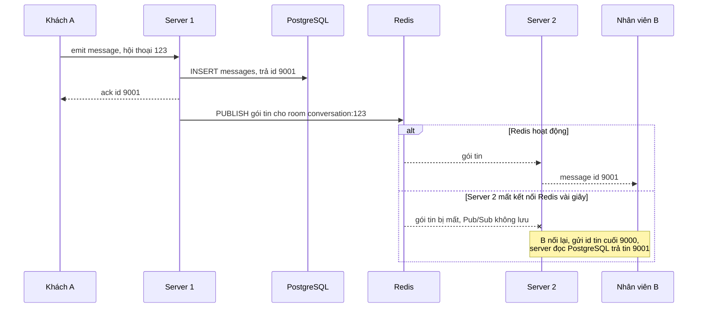

# Pub/Sub Fan-out (Redis adapter) — Chạy 3 server WebSocket, tin nhắn của A ở server 1 không tới B ở server 2

| Scope | Mức độ | Trạng thái | Pattern gốc | Cập nhật |
|---|---|---|---|---|
| 06 · frontend / backend / realtime | 🟡 Trung bình | 📋 Kế hoạch | Publisher-Subscriber fan-out — Azure Architecture Center "Publisher-Subscriber"; Socket.IO docs "Redis adapter" | 2026-10-06 |

> **Một câu tóm tắt:** Mỗi server realtime chỉ biết các kết nối của chính nó; thêm một kênh publish/subscribe chung (Redis) để sự kiện phát ở một server được chuyển tới mọi server, và mỗi server tự đẩy xuống các kết nối cục bộ thuộc đúng phòng.

## 1. Bài toán thực tế (What)

**Bối cảnh** *(doanh nghiệp giả định, số liệu minh họa)*
SaaS B2B cung cấp CRM có tính năng chat hỗ trợ giữa nhân viên chăm sóc khách hàng của doanh nghiệp và khách của họ; khoảng 400 tenant, 25.000 kết nối WebSocket đồng thời giờ cao điểm. Backend NestJS dùng Socket.IO, ban đầu chạy một instance. Khi tải tăng, đội tăng lên 3 instance sau load balancer, không đổi code.

**Triệu chứng người kinh doanh nhìn thấy**
- Khách nhắn "tôi cần hỗ trợ đơn 123" nhưng nhân viên không thấy tin cho tới khi tải lại trang; khoảng hai phần ba tin nhắn "biến mất" tạm thời.
- Chỉ báo "nhân viên đang trả lời" và thông báo phân công hội thoại lúc có lúc không, tùy may rủi.
- Một tenant lớn dọa chấm dứt hợp đồng vì thời gian phản hồi khách tăng gấp đôi sau ngày "nâng cấp hệ thống".

**Nguyên nhân kỹ thuật**
Socket.IO lưu danh sách kết nối và phòng (room) trong bộ nhớ của từng tiến trình. Khi A kết nối vào server 1 và B vào server 2, lệnh `io.to("conversation:123").emit(...)` trên server 1 chỉ duyệt các socket mà server 1 đang giữ; server 2 không bao giờ biết có tin nhắn. Với 3 instance và phân phối ngẫu nhiên, xác suất hai người cùng server chỉ khoảng một phần ba. Ngoài ra transport long polling mặc định của Socket.IO gửi nhiều request HTTP liên tiếp cho cùng một phiên, nếu load balancer chia chúng sang các server khác nhau thì phiên bị lỗi.

**Ràng buộc**
- Tin nhắn phải tới mọi người trong hội thoại, bất kể họ kết nối vào instance nào; p95 dưới 300 ms.
- Số instance thay đổi theo tải (scale ngang); không cấu hình tay danh sách server.
- PostgreSQL là nơi lưu tin nhắn; kênh realtime chỉ là đường thông báo.

## 2. Vì sao dùng pattern này (Why)

**Nguyên nhân gốc mà pattern nhắm vào:** trạng thái "ai đang nghe phòng nào" bị phân mảnh theo instance, và không có kênh để một instance thông báo cho các instance khác.

**Pattern giải quyết thế nào:** Publisher-Subscriber tách bên phát khỏi bên nhận qua một kênh trung gian: bên phát không cần biết có bao nhiêu bên nhận. Socket.IO hiện thực bằng *adapter*: với Redis adapter, mỗi lần server phát vào một phòng, adapter vừa đẩy xuống socket cục bộ vừa publish gói tin lên Redis; mọi server khác đã subscribe sẽ nhận và tự đẩy xuống các socket cục bộ thuộc phòng đó. Thêm instance mới chỉ cần nó subscribe cùng kênh. Thứ tự đúng của luồng là: lưu tin nhắn vào PostgreSQL (nguồn sự thật) rồi mới phát; Redis Pub/Sub chỉ giao "tối đa một lần" nên bên nhận lỡ tin sẽ lấy lại từ DB (bài 03). Sticky session ở load balancer giữ các request long polling của cùng một phiên về cùng một server.

**Lựa chọn khác đã cân nhắc**

| Lựa chọn | Giải quyết được gì | Vì sao không chọn (ở bài này) |
|---|---|---|
| Giữ nguyên + tối ưu nhỏ (quay về một instance lớn hơn) | Hết lỗi ngay | Không scale ngang, một điểm hỏng duy nhất, deploy làm rớt mọi kết nối |
| Định tuyến theo hội thoại (mọi người cùng hội thoại vào cùng server) | Không cần kênh chung | Một người ở nhiều hội thoại cùng lúc; tenant lớn dồn vào một server |
| PostgreSQL `LISTEN/NOTIFY` làm kênh chung | Không thêm Redis | Payload giới hạn kích thước, mỗi instance giữ một kết nối DB lắng nghe; hợp tải nhỏ |
| Message broker (NATS, RabbitMQ) | Định tuyến linh hoạt, có tùy chọn bền vững | Thêm hệ thống mới; Redis đã có sẵn cho cache và session |
| Socket.IO Redis adapter + sticky session (chọn) | Fan-out giữa các instance, adapter chính thức, Redis đã có | Giao tối đa một lần; Redis thành phụ thuộc của luồng realtime |

## 3. Thiết kế hệ thống (How)

### 3.1 Kiến trúc trước và sau



### 3.2 Luồng chính



### 3.3 Thành phần và trách nhiệm

| Thành phần | Trách nhiệm | Quyết định thiết kế đáng chú ý |
|---|---|---|
| `ChatGateway` (NestJS + Socket.IO) | Xác thực khi kết nối, join room theo hội thoại và theo tenant | Tên room có tiền tố tenant để không phát nhầm tenant |
| Redis adapter | Đẩy gói tin phát vào room tới mọi instance | Hai kết nối Redis riêng cho publish và subscribe theo tài liệu adapter |
| `MessageService` | Lưu tin vào PostgreSQL rồi mới phát | Trả `id` tăng dần cho client để phát hiện thiếu tin |
| Load balancer (Nginx) | Phân phối kết nối, sticky session cho long polling | Có thể bỏ sticky nếu chỉ cho phép transport WebSocket |
| Endpoint lấy tin bị lỡ | `GET /conversations/:id/messages?after=` | Lưới an toàn cho giao tối đa một lần, làm sâu ở bài 03 |
| Metric | Số kết nối mỗi instance, số gói tin publish, độ trễ đầu cuối | Phát hiện instance mất kết nối Redis |

### 3.4 Điểm dễ sai khi triển khai
- Không cấu hình sticky session trong khi vẫn bật long polling: lỗi kết nối ngẫu nhiên, khó tái hiện trên máy dev một instance.
- Dùng chung một kết nối Redis cho publish và subscribe: kết nối ở chế độ subscribe không chạy được lệnh khác.
- Coi Redis Pub/Sub là bền vững: instance mất kết nối Redis vài giây là mất gói tin trong khoảng đó; phải có đường lấy lại từ DB.
- Phát tới room chung quá rộng (mọi nhân viên của tenant) cho mọi sự kiện nhỏ như "đang gõ": lưu lượng Redis và client tăng theo cấp số; chọn room hẹp nhất đủ dùng.
- Test bằng một instance: lỗi chỉ lộ khi có từ hai instance trở lên. Docker Compose của bài luôn chạy 3 instance.

## 4. Tech stack và tác động (Impact techstack)

| Lớp | Công nghệ chọn | Vì sao chọn | Thay thế tương đương |
|---|---|---|---|
| Realtime server | NestJS 10 + Socket.IO 4 | Room, ack, nối lại có sẵn; trùng stack | `ws` thuần với tự xây room |
| Kênh fan-out | Redis 7 Pub/Sub qua `@socket.io/redis-adapter` | Adapter chính thức, Redis đã có trong hệ thống | `@socket.io/redis-streams-adapter` khi cần chịu được Redis gián đoạn (cần xác minh), adapter cho Redis sharded Pub/Sub (cần xác minh) |
| Lưu trữ | PostgreSQL 16 | Nguồn sự thật của tin nhắn, có id tăng dần | — |
| Load balancer | Nginx với `ip_hash` hoặc cookie | Sticky session theo hướng dẫn của Socket.IO | HAProxy, sticky của dịch vụ cloud |
| Frontend | Next.js + `socket.io-client` | Tự nối lại, ack | — |
| Đo | Script Node dùng `socket.io-client` kết nối thẳng từng instance, Toxiproxy, Prometheus | Bố trí người gửi và người nhận ở instance khác nhau có chủ đích; Toxiproxy cắt Redis của một instance mà không động tới các instance khác | Artillery có engine Socket.IO |

**Thay đổi so với hệ thống hiện tại:** thêm adapter và hai kết nối Redis mỗi instance, bật sticky session, thêm endpoint lấy tin bị lỡ. Redis trở thành phụ thuộc của luồng chat: đội vận hành phải giám sát nó như một phần đường đi realtime.

## 5. Kết quả đầu ra và cách đo (Output impact)

| Chỉ số | Trước (minh họa) | Mục tiêu khi thực hành | Cách đo |
|---|---|---|---|
| Tỷ lệ tin tới người nhận ở instance khác | khoảng 33% | 100% trên 10.000 tin | Script gửi tin có id, người nhận rải đều 3 instance, đối chiếu tập id nhận |
| Độ trễ đầu cuối p95 | không đo | < 300 ms | Dấu thời gian gửi trong payload, tính ở người nhận |
| Tin mất khi một instance mất Redis 5 giây | không áp dụng | 0 sau khi client lấy lại từ DB | Test: Toxiproxy cắt kết nối Redis của riêng server 2 trong 5 giây, kiểm tập tin sau khi nối lại |
| Lỗi kết nối do thiếu sticky session | có | 0 | Log lỗi handshake của Socket.IO khi bật long polling |
| Gói tin publish mỗi giây và CPU Redis ở 25.000 kết nối giả lập | không áp dụng | ghi số thật | Redis `INFO stats`, `INFO commandstats`, `docker stats` |

> Số "trước" là minh họa để hình dung bài toán. Số "mục tiêu" chỉ được coi là đạt khi có số đo thật
> ở mục 8 kèm môi trường đo.

**Tác động nghiệp vụ mong đợi:** nhân viên thấy tin của khách ngay, bất kể hạ tầng chạy bao nhiêu server; đội có thể scale ngang theo tải mà không đánh đổi độ tin cậy của chat.

## 6. Đánh đổi và khi KHÔNG nên dùng

**Đánh đổi**
- Mọi gói tin phát vào room đi qua Redis tới *mọi* instance, kể cả instance không có người nghe; lưu lượng Redis tăng theo số instance.
- Redis là điểm phụ thuộc mới; Redis chậm thì realtime chậm.
- Giao tối đa một lần: vẫn cần đường lấy lại từ DB.

**Không nên dùng khi**
- Chỉ một instance và không có kế hoạch scale ngang: adapter là thừa.
- Cần đảm bảo giao ít nhất một lần cho từng sự kiện quan trọng (thanh toán, khóa tài khoản): dùng hàng đợi hoặc stream bền vững, không dùng Pub/Sub.
- Số instance rất lớn và mỗi room chỉ có người ở vài instance: cân nhắc định tuyến theo room hoặc Redis sharded Pub/Sub thay vì broadcast mọi nơi.

**Liên quan**
- [`../01-sse-vs-websocket-vs-polling-theo-doi-trang-thai-don/`](../01-sse-vs-websocket-vs-polling-theo-doi-trang-thai-don/) — chọn giao thức trước khi scale.
- [`../03-reconnect-resume-mat-mang-10-giay-mat-thong-bao/`](../03-reconnect-resume-mat-mang-10-giay-mat-thong-bao/) — lấy lại sự kiện bị lỡ khi Pub/Sub làm mất gói tin.
- [`../04-presence-ai-dang-online-ai-dang-go/`](../04-presence-ai-dang-online-ai-dang-go/) — trạng thái online dùng chung kênh fan-out.
- [`../../18-backend-scale/01-stateless-session-externalized-login-server-a-server-b-khong-biet/`](../../18-backend-scale/01-stateless-session-externalized-login-server-a-server-b-khong-biet/) — đưa trạng thái ra khỏi instance, cùng gốc vấn đề.

## 7. Cơ sở tham khảo

- Microsoft Azure Architecture Center, "Publisher-Subscriber pattern" — https://learn.microsoft.com/azure/architecture/patterns/publisher-subscriber — tách bên phát và bên nhận qua kênh trung gian, các vấn đề về thứ tự và giao lặp.
- Socket.IO docs, "Redis adapter" và "Using multiple nodes" — https://socket.io/docs/v4/redis-adapter/ — cơ chế adapter, yêu cầu hai kết nối Redis, khi nào cần sticky session.
- Redis docs, "Redis Pub/Sub" — https://redis.io/docs/ — ngữ nghĩa giao tối đa một lần, subscriber mất kết nối thì mất tin.
- Gregor Hohpe & Bobby Woolf, *Enterprise Integration Patterns*, 2003, "Publish-Subscribe Channel" — https://www.enterpriseintegrationpatterns.com/patterns/messaging/ — định nghĩa gốc của kênh phát cho nhiều bên nhận.

## 8. Kế hoạch thực hành

- [ ] Bước 1: Docker Compose gồm 3 instance NestJS + Socket.IO, Nginx, Redis 7, PostgreSQL 16; trang Next.js chat tối giản.
- [ ] Bước 2: đo "trước": không adapter, script gửi 10.000 tin với người nhận rải 3 instance; ghi tỷ lệ tin tới và lỗi handshake khi tắt sticky.
- [ ] Bước 3: áp dụng pattern: Redis adapter, sticky session, lưu tin trước khi phát, id tăng dần, endpoint lấy tin bị lỡ phía client.
- [ ] Bước 4: đo "sau" cùng kịch bản và kịch bản ngắt Redis của một instance; ghi tỷ lệ tới, p95, chỉ số Redis vào mục 5 kèm môi trường.
- [ ] Bước 5: viết test: (a) A ở server 1, B ở server 2 nhận tin; (b) room có tiền tố tenant không lọt tin sang tenant khác; (c) instance mất Redis rồi nối lại, client lấy đủ tin từ DB.

**Cấu trúc code dự kiến**
```text
src/
  chat/chat.gateway.ts                  # join room theo tenant và hội thoại
  chat/message.service.ts               # lưu PostgreSQL rồi phát
  chat/redis-io.adapter.ts              # [PATTERN] Redis adapter cho Socket.IO
  chat/missed-messages.controller.ts    # lấy tin sau id cuối
  web/hooks/use-chat.ts
infra/nginx.conf                        # sticky session
test/
  recipient-on-other-server-receives.test.ts
  no-message-leaks-across-tenants.test.ts
  redis-loss-recovers-from-db.test.ts
bench/fanout-delivery.ts
docker-compose.yml                      # 3 instance app, nginx, redis, toxiproxy, postgres
```

**Cách chạy** *(điền khi bắt đầu code)*
```bash
docker compose up -d --scale app=3
pnpm install && pnpm test
pnpm tsx bench/fanout-delivery.ts --messages 10000
```
