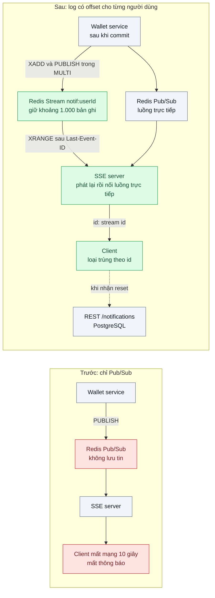
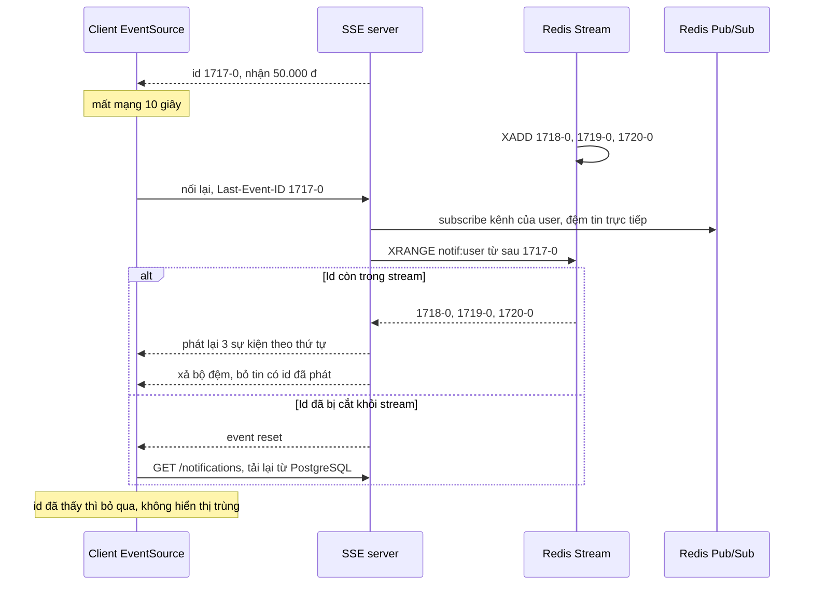

# Reconnect & Resume (Last-Event-ID / sequence) — Mất mạng 10 giây là mất thông báo trong khoảng đó

| Scope | Mức độ | Trạng thái | Pattern gốc | Cập nhật |
|---|---|---|---|---|
| 06 · frontend / backend / realtime | 🟡 Trung bình | 📋 Kế hoạch | Resumable event stream (offset trong log) — HTML Living Standard SSE `Last-Event-ID`; Redis Streams; Kleppmann, *DDIA* (2017) ch.11 | 2026-10-06 |

> **Một câu tóm tắt:** Gắn cho mỗi sự kiện một id tăng dần và giữ các sự kiện gần nhất trong một log có thứ tự, để client nối lại chỉ cần nói "tôi đã nhận tới id X" và server phát lại đúng phần bị lỡ trước khi tiếp tục luồng trực tiếp.

## 1. Bài toán thực tế (What)

**Bối cảnh** *(doanh nghiệp giả định, số liệu minh họa)*
Ví điện tử có khoảng 1,2 triệu người dùng hoạt động mỗi ngày; web và app hiển thị thông báo realtime khi nhận tiền, thanh toán thành công, hoàn tiền. Kênh hiện tại là SSE như bài 01, phát qua Redis Pub/Sub giữa các instance như bài 02. Phần lớn người dùng ở trên mạng di động, chuyển giữa Wi-Fi và 4G, vào thang máy, tắt màn hình.

**Triệu chứng người kinh doanh nhìn thấy**
- Người bán hàng rong nhận tiền khách chuyển nhưng không thấy thông báo "đã nhận 50.000 đ", bắt khách chuyển lại; sau đó phải làm thủ tục hoàn tiền.
- Tổng đài nhận nhiều cuộc gọi "tiền đã trừ mà không thấy báo thành công", phần lớn rơi vào lúc mạng chập chờn.
- Khi thử "gửi lại tất cả thông báo lúc nối lại", người dùng thấy cùng một thông báo hai ba lần và hoảng vì tưởng bị trừ tiền nhiều lần.

**Nguyên nhân kỹ thuật**
`EventSource` tự nối lại sau khi mất mạng, nhưng server không biết client đã nhận tới đâu, nên chỉ tiếp tục phát sự kiện *mới*. Redis Pub/Sub không lưu tin: sự kiện phát ra trong 10 giây client mất kết nối không còn ở đâu để gửi lại. Cách vá "gửi lại 20 thông báo gần nhất" không có mốc nên vừa thiếu (nếu lỡ nhiều hơn 20) vừa trùng (nếu không lỡ gì).

**Ràng buộc**
- Không mất sự kiện khi gián đoạn tới 5 phút; không hiển thị trùng.
- Gián đoạn dài hơn hoặc client mới mở app: lấy trạng thái đầy đủ qua REST từ PostgreSQL thay vì phát lại vô hạn.
- Không giữ một kết nối Redis chặn (blocking) cho mỗi kết nối SSE; giữ được hàng chục nghìn kết nối mỗi instance.

## 2. Vì sao dùng pattern này (Why)

**Nguyên nhân gốc mà pattern nhắm vào:** kênh realtime không có khái niệm "vị trí": cả server lẫn client không có mốc để biết phần nào đã được giao.

**Pattern giải quyết thế nào:** DDIA ch.11 mô tả log có thứ tự với offset: bên đọc tự nhớ offset, đọc lại từ offset sau khi gián đoạn. Bài này áp dụng cho từng người dùng: mỗi thông báo được ghi vào Redis Stream `notif:<userId>` (giới hạn khoảng 1.000 bản ghi gần nhất), id do Redis sinh, tăng dần trong stream. Server gửi id đó trong trường `id:` của SSE; theo HTML Living Standard, khi nối lại `EventSource` tự gửi header `Last-Event-ID` chứa id cuối đã nhận. Server dùng `XRANGE` lấy các bản ghi *sau* id đó, phát lại, rồi chuyển sang luồng trực tiếp qua Pub/Sub. Nếu id đã bị cắt khỏi stream (gián đoạn quá dài), server gửi sự kiện `reset` để client tải trạng thái đầy đủ từ PostgreSQL. Client loại trùng theo id, vì giao "ít nhất một lần" là cái giá của không mất.

**Lựa chọn khác đã cân nhắc**

| Lựa chọn | Giải quyết được gì | Vì sao không chọn (ở bài này) |
|---|---|---|
| Giữ nguyên + tối ưu nhỏ (khi nối lại, client gọi REST lấy 20 thông báo gần nhất) | Che được phần lớn gián đoạn ngắn | Không có mốc: vừa thiếu vừa trùng; mỗi lần nối lại là một truy vấn DB |
| Đọc lại từ bảng `notifications` trong PostgreSQL theo id | Bền vững, không cần Redis Streams | Mỗi lần nối lại của hàng chục nghìn client là truy vấn vào DB nghiệp vụ, dồn lúc mạng phục hồi hàng loạt |
| Socket.IO "Connection state recovery" | Phát lại tự động trong một khoảng thời gian | Gắn với Socket.IO và adapter hỗ trợ (cần xác minh adapter nào hỗ trợ); bài này giữ SSE từ bài 01 |
| Thông báo đẩy của hệ điều hành cho mọi sự kiện | Tới cả khi app đóng | Không đảm bảo giao, có độ trễ; dùng bổ trợ chứ không thay luồng trong app |
| Redis Streams + `Last-Event-ID` + `reset` (chọn) | Phát lại chính xác phần lỡ, rẻ, giới hạn bộ nhớ | Thêm một cấu trúc dữ liệu phải giới hạn kích thước; client phải loại trùng |

## 3. Thiết kế hệ thống (How)

### 3.1 Kiến trúc trước và sau



### 3.2 Luồng chính



### 3.3 Thành phần và trách nhiệm

| Thành phần | Trách nhiệm | Quyết định thiết kế đáng chú ý |
|---|---|---|
| `NotificationPublisher` | Ghi thông báo vào PostgreSQL, rồi `XADD` vào stream và `PUBLISH` id mới | `XADD` và `PUBLISH` gói trong `MULTI`; `MAXLEN ~ 1000` để cắt gần đúng, rẻ hơn cắt chính xác |
| `NotificationStreamController` | Endpoint SSE: đọc `Last-Event-ID`, phát lại, rồi phát trực tiếp | Subscribe *trước* khi `XRANGE`, đệm tin trực tiếp, xả sau khi phát lại để không có khe hở |
| Redis Stream theo người dùng | Bộ đệm phát lại ngắn hạn | Không phải nguồn sự thật; PostgreSQL mới là nơi lưu lâu dài |
| Sự kiện `reset` | Báo client rằng phần lỡ quá dài để phát lại | So id yêu cầu với id đầu tiên còn trong stream (`XINFO STREAM` hoặc `XRANGE` lấy 1 bản ghi) |
| `useNotifications` (client) | Loại trùng theo id, lưu id cuối vào `sessionStorage` | Khi tải lại trang (EventSource mới, không có header), gửi id cuối qua query string |
| Lưới an toàn REST | `GET /notifications?after=` từ PostgreSQL | Dùng khi `reset` hoặc khi app mở lần đầu |

### 3.4 Điểm dễ sai khi triển khai
- `XRANGE` trước rồi mới subscribe: sự kiện xảy ra giữa hai lệnh bị lỡ. Subscribe trước, đệm, phát lại, rồi xả đệm bỏ id đã phát.
- Tin cậy `Last-Event-ID` khi tải lại trang: header chỉ được gửi khi chính `EventSource` đó tự nối lại; trang mới phải tự mang id cuối.
- Dùng `XREAD BLOCK` cho từng kết nối: mỗi kết nối chiếm một kết nối Redis, không scale tới hàng chục nghìn; dùng Pub/Sub cho luồng trực tiếp.
- Không loại trùng ở client: phát lại và luồng trực tiếp chồng nhau là bình thường, phải xử lý bằng id.
- Stream không giới hạn: bộ nhớ Redis tăng theo số người dùng nhân số thông báo; luôn đặt `MAXLEN` hoặc `MINID`.
- Id do ứng dụng tự sinh theo đồng hồ từng instance: không đảm bảo tăng dần; để Redis sinh id trong stream.

## 4. Tech stack và tác động (Impact techstack)

| Lớp | Công nghệ chọn | Vì sao chọn | Thay thế tương đương |
|---|---|---|---|
| Kênh realtime | SSE với `id:` và `Last-Event-ID` (tiếp bài 01) | Cơ chế nối lại và gửi id có sẵn trong chuẩn | WebSocket với số thứ tự tự quản lý |
| Bộ đệm phát lại | Redis 7 Streams (`XADD`, `XRANGE`, `MAXLEN`) | Id tăng dần trong stream, đọc theo khoảng, cắt theo kích thước | Kafka (nặng cho bài này), bảng PostgreSQL có index theo người dùng |
| Luồng trực tiếp | Redis Pub/Sub (tiếp bài 02) | Một subscriber mỗi instance thay vì một kết nối chặn mỗi client | — |
| Nguồn sự thật | PostgreSQL 16 bảng `notifications` | Lịch sử đầy đủ, phục vụ `reset` | — |
| Backend / Frontend | NestJS 10, Next.js | Trùng stack | Fastify |
| Tiêm lỗi và đo | Toxiproxy, Chrome DevTools chế độ offline, Vitest, Prometheus | Cắt kết nối có kiểm soát; đếm sự kiện mất và trùng | `tc netem` |

**Thay đổi so với hệ thống hiện tại:** publisher ghi thêm vào stream; endpoint SSE thêm bước phát lại có đệm; client lưu id cuối và loại trùng; thêm sự kiện `reset`. Đội vận hành theo dõi thêm bộ nhớ Redis của stream và tỷ lệ `reset`.

## 5. Kết quả đầu ra và cách đo (Output impact)

| Chỉ số | Trước (minh họa) | Mục tiêu khi thực hành | Cách đo |
|---|---|---|---|
| Sự kiện mất sau gián đoạn 10 giây | mọi sự kiện trong khoảng gián đoạn | 0 trên 1.000 lần gián đoạn | Test tích hợp: Toxiproxy cắt kết nối, phát sự kiện có id, đối chiếu tập id client nhận |
| Sự kiện hiển thị trùng | có khi dùng "gửi lại 20 tin" | 0 | Cùng test, đếm id hiển thị nhiều hơn một lần |
| Thời gian bắt kịp sau khi nối lại, p95 | không áp dụng | < 1 giây với 50 sự kiện bị lỡ | Dấu thời gian nối lại và thời điểm nhận sự kiện lỡ cuối cùng |
| Truy vấn PostgreSQL mỗi lần nối lại | 1 | 0 (trừ khi `reset`) | `pg_stat_statements` trong lúc mô phỏng 5.000 client nối lại cùng lúc |
| Bộ nhớ Redis cho 100.000 stream người dùng | không áp dụng | ghi số thật, dùng để ước lượng 1,2 triệu | Redis `MEMORY USAGE` mẫu và `INFO memory` |
| Tỷ lệ `reset` với gián đoạn dưới 5 phút | không áp dụng | 0 | Metric đếm sự kiện `reset` theo độ dài gián đoạn |

> Số "trước" là minh họa để hình dung bài toán. Số "mục tiêu" chỉ được coi là đạt khi có số đo thật
> ở mục 8 kèm môi trường đo.

**Tác động nghiệp vụ mong đợi:** người nhận tiền luôn thấy thông báo dù mạng chập chờn, giảm chuyển tiền lặp và thủ tục hoàn tiền; tổng đài bớt cuộc gọi "không thấy báo".

## 6. Đánh đổi và khi KHÔNG nên dùng

**Đánh đổi**
- Thêm một bản sao dữ liệu ngắn hạn trong Redis phải giới hạn và giám sát bộ nhớ.
- Luồng nối lại phức tạp hơn (subscribe, đệm, phát lại, xả); cần test kỹ khe hở thời gian.
- Client phải loại trùng; mọi màn hình tiêu thụ sự kiện cần tuân thủ.

**Không nên dùng khi**
- Sự kiện chỉ có giá trị tức thời (giá đang nhảy, vị trí xe mỗi giây): sự kiện mới thay thế sự kiện cũ, chỉ cần gửi trạng thái mới nhất khi nối lại.
- Màn hình có thể dựng lại hoàn toàn từ một truy vấn REST rẻ: snapshot khi nối lại (bài 01) là đủ.
- Cần lưu và phát lại dài hạn (ngày, tuần) cho nhiều consumer: dùng log bền vững như Kafka hoặc bảng sự kiện, không dùng bộ đệm ngắn hạn.

**Liên quan**
- [`../01-sse-vs-websocket-vs-polling-theo-doi-trang-thai-don/`](../01-sse-vs-websocket-vs-polling-theo-doi-trang-thai-don/) — SSE và snapshot khi nối lại.
- [`../02-pubsub-fanout-3-server-socket-nguoi-a-khong-thay-nguoi-b/`](../02-pubsub-fanout-3-server-socket-nguoi-a-khong-thay-nguoi-b/) — luồng trực tiếp giữa các instance.
- [`../05-server-side-ordering-dau-gia-hai-nguoi-bid-cung-luc/`](../05-server-side-ordering-dau-gia-hai-nguoi-bid-cung-luc/) — số thứ tự do server cấp, dùng để phát hiện khe hở.
- [`../../14-backend-queueing/04-idempotent-consumer-event-den-hai-lan-tru-kho-hai-lan/`](../../14-backend-queueing/04-idempotent-consumer-event-den-hai-lan-tru-kho-hai-lan/) — loại trùng ở phía tiêu thụ.

## 7. Cơ sở tham khảo

- WHATWG, HTML Living Standard, "Server-sent events" — https://html.spec.whatwg.org/multipage/server-sent-events.html — trường `id`, bộ đệm last event ID và header `Last-Event-ID` khi `EventSource` nối lại.
- Redis docs, "Redis Streams" (`XADD` với `MAXLEN`, `XRANGE` khoảng loại trừ, định dạng id) — https://redis.io/docs/ — cấu trúc log có id tăng dần dùng làm bộ đệm phát lại.
- Martin Kleppmann, *DDIA*, 2017, ch.11 "Stream Processing", phần log-based message broker và consumer offset — nền của việc bên đọc tự giữ vị trí và đọc lại sau gián đoạn.
- Redis docs, "Redis Pub/Sub" — https://redis.io/docs/ — ngữ nghĩa giao tối đa một lần, lý do cần bộ đệm phát lại.
- Socket.IO docs, "Connection state recovery" — https://socket.io/docs/v4/ — phương án tương đương cho hệ thống dùng Socket.IO (cần xác minh giới hạn theo adapter).

## 8. Kế hoạch thực hành

- [ ] Bước 1: dùng lại Docker Compose bài 02 (3 instance, Redis, PostgreSQL), thêm Toxiproxy giữa client giả lập và Nginx; script phát thông báo ngẫu nhiên cho 1.000 người dùng.
- [ ] Bước 2: đo "trước": chỉ Pub/Sub; cắt kết nối 10 giây 1.000 lần, đếm sự kiện mất; thử cách "gửi lại 20 tin", đếm trùng.
- [ ] Bước 3: áp dụng pattern: `XADD` + `PUBLISH` trong `MULTI`, endpoint SSE phát lại có đệm, sự kiện `reset`, client loại trùng và lưu id cuối.
- [ ] Bước 4: đo "sau" cùng kịch bản và kịch bản 5.000 client nối lại cùng lúc; ghi số thật và môi trường vào mục 5.
- [ ] Bước 5: viết test: (a) gián đoạn 10 giây không mất sự kiện; (b) sự kiện phát đúng lúc đang phát lại không mất và không trùng; (c) id đã bị cắt thì nhận `reset`; (d) tải lại trang vẫn phát lại từ id lưu trong `sessionStorage`.

**Cấu trúc code dự kiến**
```text
src/
  api/notification.publisher.ts             # PostgreSQL, rồi XADD + PUBLISH trong MULTI
  api/notification-stream.controller.ts     # [PATTERN] Last-Event-ID, subscribe, XRANGE, xả đệm
  api/replay-buffer.ts                      # [PATTERN] đệm tin trực tiếp, bỏ id đã phát
  api/notifications.controller.ts           # REST lấy lại khi reset
  web/hooks/use-notifications.ts            # loại trùng, lưu id cuối
test/
  10-second-outage-loses-nothing.test.ts
  replay-to-live-handoff-has-no-gap.test.ts
  trimmed-id-receives-reset.test.ts
  page-reload-still-replays.test.ts
docker-compose.yml
```

**Cách chạy** *(điền khi bắt đầu code)*
```bash
docker compose up -d
pnpm install && pnpm test
```
