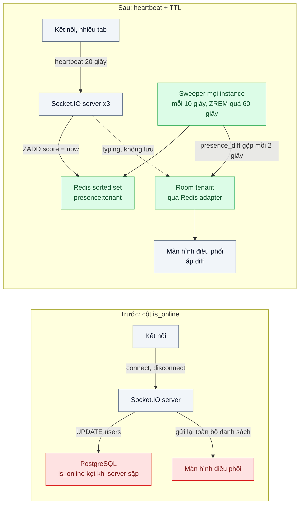
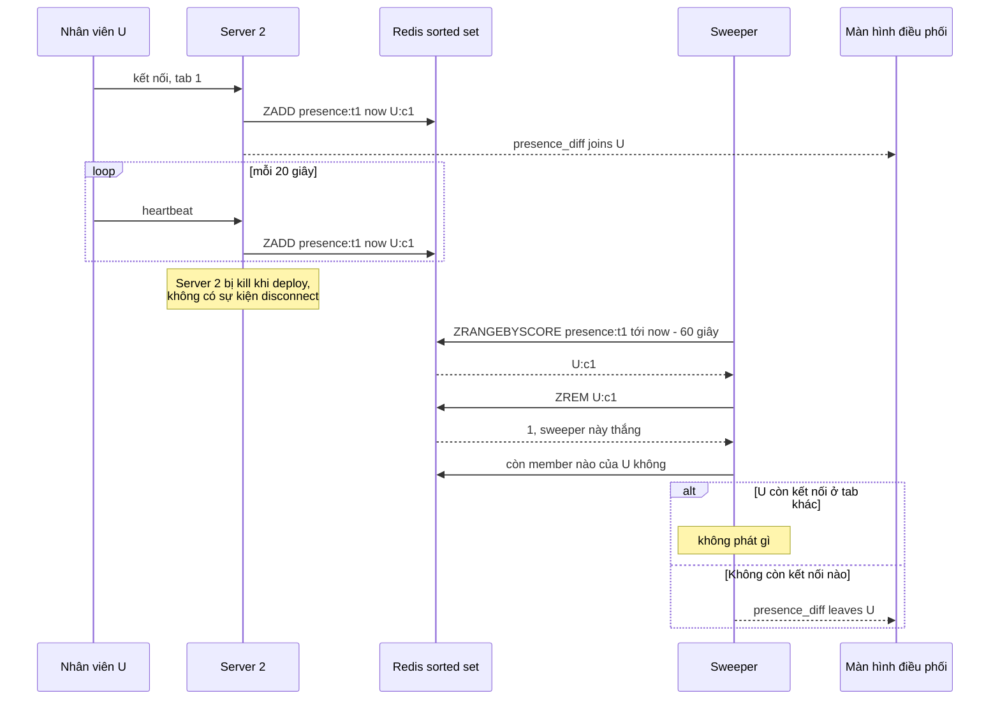

# Presence (heartbeat + TTL) — Hiển thị "đang online / đang gõ" cho 50k người dùng đồng thời

| Scope | Mức độ | Trạng thái | Pattern gốc | Cập nhật |
|---|---|---|---|---|
| 06 · frontend / backend / realtime | 🟡 Trung bình | 📋 Kế hoạch | Presence (heartbeat + TTL) — Phoenix.Presence docs; Redis docs (EXPIRE, sorted set, keyspace notifications) | 2026-10-06 |

> **Một câu tóm tắt:** Coi "đang online" là một lời khẳng định có hạn dùng mà client phải gia hạn bằng heartbeat; ai ngừng gia hạn thì tự hết hạn, nên người dùng mất mạng hay server sập đều không để lại "online ma", và chỉ phát phần thay đổi thay vì cả danh sách.

## 1. Bài toán thực tế (What)

**Bối cảnh** *(doanh nghiệp giả định, số liệu minh họa)*
SaaS B2B CRM ở bài 02: chat hỗ trợ giữa nhân viên của 400 tenant và khách của họ, giờ cao điểm khoảng 50.000 người dùng đồng thời trên 3 instance Socket.IO. Màn hình điều phối hiển thị nhân viên nào đang online để chia hội thoại; khung chat hiển thị "khách đang gõ...". Trạng thái online hiện là cột `users.is_online` trong PostgreSQL, bật khi kết nối, tắt khi ngắt.

**Triệu chứng người kinh doanh nhìn thấy**
- Hệ thống chia hội thoại cho nhân viên "đang online" đã về nhà từ chiều; khách chờ 20 phút không ai trả lời.
- Sau mỗi lần deploy hoặc một server khởi động lại, hàng trăm nhân viên hiện online vĩnh viễn cho tới khi đội vận hành chạy câu SQL sửa tay.
- Mở màn hình điều phối của tenant lớn làm trình duyệt giật vì danh sách 2.000 nhân viên được gửi lại toàn bộ mỗi khi có người vào hoặc ra.

**Nguyên nhân kỹ thuật**
Trạng thái online được cập nhật theo sự kiện `connect`/`disconnect`. Khi server sập hoặc bị kill trong lúc deploy, sự kiện `disconnect` không bao giờ chạy, cột `is_online` kẹt ở `true`. Khi mạng của người dùng mất mà không đóng TCP, server chỉ biết sau khi hết thời gian ping. Mỗi lần vào ra là một lệnh ghi vào DB nghiệp vụ, và mỗi thay đổi kích hoạt phát lại toàn bộ danh sách cho mọi người trong tenant: chi phí tăng theo bình phương số người.

**Ràng buộc**
- Người dùng mất kết nối hoặc server sập: hiện offline trong tối đa khoảng 60–90 giây.
- Nhiều tab, nhiều thiết bị của cùng một người: chỉ offline khi *mọi* kết nối đều đã mất.
- "Đang gõ" không cần lưu, không cần chính xác tuyệt đối, nhưng không được kẹt.
- Không ghi trạng thái phù du (ephemeral) vào PostgreSQL.

## 2. Vì sao dùng pattern này (Why)

**Nguyên nhân gốc mà pattern nhắm vào:** trạng thái online được coi là sự thật vĩnh viễn chỉ đổi khi có sự kiện, trong khi sự kiện "rời đi" có thể không bao giờ tới.

**Pattern giải quyết thế nào:** Presence đảo cách nghĩ: online là lời khẳng định *có hạn dùng*. Mỗi kết nối gửi heartbeat định kỳ (ví dụ 20 giây); server ghi vào Redis một sorted set theo tenant, member là `userId:connectionId`, score là thời điểm heartbeat cuối. Một người online khi còn ít nhất một member có score mới hơn 60 giây. Mọi instance chạy cùng một sweeper định kỳ xóa member quá hạn bằng `ZREM`; vì `ZREM` trả về số phần tử thực sự bị xóa, chỉ một sweeper "thắng" và phát sự kiện rời đi, không cần khóa. Phoenix.Presence giải cùng bài toán theo hướng khác (CRDT nhân bản giữa các node, không kho trung tâm) nhưng dùng chung hai ý: heartbeat để phát hiện rời đi, và phát `presence_diff` (ai vào, ai ra) thay vì cả danh sách. "Đang gõ" là sự kiện phát thẳng qua room, client nhận tự ẩn sau 5 giây nếu không được làm mới.

**Lựa chọn khác đã cân nhắc**

| Lựa chọn | Giải quyết được gì | Vì sao không chọn (ở bài này) |
|---|---|---|
| Giữ nguyên + tối ưu nhỏ (cột `last_seen_at` cập nhật định kỳ, job dọn mỗi 5 phút) | Hết "online ma" vĩnh viễn | Ghi liên tục vào DB nghiệp vụ; trễ phát hiện tới 5 phút |
| Mỗi kết nối một key Redis với `EXPIRE`, nghe keyspace notification khi hết hạn | Redis tự xóa | Sự kiện hết hạn không phát đúng lúc TTL mà khi key được truy cập hoặc bị tiến trình nền tìm thấy; Pub/Sub của notification cũng có thể mất |
| Phoenix.Presence hoặc dịch vụ realtime có sẵn presence | Đã giải sẵn, nhân bản CRDT | Khác stack (Elixir) hoặc thêm nhà cung cấp; mục tiêu bài là hiểu cơ chế |
| Sorted set theo tenant + heartbeat + sweeper + diff (chọn) | Phát hiện rời đi có giới hạn thời gian, đa thiết bị, chịu được server sập | Thêm heartbeat định kỳ (tải Redis tăng theo số kết nối) |

## 3. Thiết kế hệ thống (How)

### 3.1 Kiến trúc trước và sau



### 3.2 Luồng chính



### 3.3 Thành phần và trách nhiệm

| Thành phần | Trách nhiệm | Quyết định thiết kế đáng chú ý |
|---|---|---|
| Heartbeat | Gia hạn presence của từng kết nối | Chu kỳ 20 giây, hạn 60 giây: chịu được mất hai heartbeat liên tiếp |
| Sorted set `presence:<tenantId>` | Lưu kết nối đang sống theo tenant | Member theo kết nối chứ không theo người để xử lý nhiều tab; score là mili-giây |
| Sweeper | Xóa member quá hạn, phát sự kiện rời đi | Chạy ở mọi instance; dựa vào kết quả `ZREM` để chỉ một bên phát, không cần khóa |
| Bộ gộp diff | Gom joins/leaves của một tenant, phát mỗi 2 giây | Tenant 2.000 nhân viên nhận vài gói nhỏ thay vì danh sách đầy đủ mỗi lần |
| Sự kiện `typing` | Phát thẳng vào room hội thoại | Client gửi tối đa 1 lần mỗi 3 giây; bên nhận tự ẩn sau 5 giây |
| Snapshot khi vào màn hình | Trả danh sách online đầy đủ một lần | Sau đó chỉ áp diff; nối lại thì lấy snapshot mới |

### 3.4 Điểm dễ sai khi triển khai
- Dựa vào `disconnect` để đặt offline: server sập thì không có sự kiện. Hạn dùng là cơ chế chính, `disconnect` chỉ để phát hiện sớm hơn.
- Theo dõi theo người thay vì theo kết nối: đóng một tab làm người đó offline dù tab khác còn mở.
- Tin vào keyspace notification `expired` để biết đúng thời điểm hết hạn: Redis chỉ đảm bảo sự kiện phát khi key bị xóa, có thể trễ.
- Heartbeat của tất cả client cùng nhịp sau khi deploy (mọi người nối lại cùng lúc): thêm độ lệch ngẫu nhiên vào chu kỳ.
- Phát "đang gõ" ở mỗi phím bấm: lưu lượng tăng vọt; throttle phía client.
- Đồng hồ các instance lệch nhau khiến score sai: dùng thời gian của Redis (`TIME`) hoặc chấp nhận lệch nhỏ so với hạn 60 giây.

## 4. Tech stack và tác động (Impact techstack)

| Lớp | Công nghệ chọn | Vì sao chọn | Thay thế tương đương |
|---|---|---|---|
| Kênh realtime | Socket.IO 4 + Redis adapter (bài 02) | Room theo tenant và hội thoại đã có | SSE cho màn hình chỉ xem |
| Kho presence | Redis 7 sorted set (`ZADD`, `ZRANGEBYSCORE`, `ZREM`) | Lọc theo thời gian bằng score, nguyên tử, nhanh | Key theo kết nối với `EXPIRE` + quét định kỳ |
| Sweeper | Timer trong mỗi instance NestJS | Không cần thêm tiến trình; an toàn khi chạy đồng thời | Job riêng có khóa phân tán |
| Frontend | Next.js, store presence áp snapshot + diff | Cập nhật cục bộ, không vẽ lại toàn bộ danh sách | — |
| Đo | Script Node giả lập 50.000 kết nối (hoặc 5.000 nếu máy yếu), Prometheus, Redis `INFO commandstats` | Đo tải heartbeat và thời gian phát hiện offline | Artillery |

**Thay đổi so với hệ thống hiện tại:** bỏ cột `is_online` khỏi luồng realtime (giữ `last_seen_at` cập nhật thưa cho báo cáo), thêm heartbeat, sorted set theo tenant, sweeper, bộ gộp diff và sự kiện `typing`. Đội vận hành theo dõi thêm thời gian phát hiện offline và tải Redis theo số kết nối.

## 5. Kết quả đầu ra và cách đo (Output impact)

| Chỉ số | Trước (minh họa) | Mục tiêu khi thực hành | Cách đo |
|---|---|---|---|
| "Online ma" 2 phút sau khi kill một instance | hàng trăm, kẹt vĩnh viễn | 0 | Test tích hợp: `docker kill` instance, sau 120 giây đếm member quá hạn và người hiện online |
| Thời gian phát hiện offline khi mất mạng không đóng TCP, p95 | không xác định | ≤ 70 giây | Toxiproxy treo kết nối, đo tới khi nhận `presence_diff` leaves |
| Lệnh ghi PostgreSQL cho presence mỗi phút | khoảng 3.000 | 0 | `pg_stat_statements` |
| Byte presence gửi tới màn hình điều phối của tenant 2.000 người mỗi phút | khoảng 2 MB | < 100 KB | Đếm byte gói tin ở client giả lập |
| Lệnh Redis mỗi giây cho 50.000 kết nối | không áp dụng | khoảng 2.500 (heartbeat) + sweeper, ghi số thật | Redis `INFO commandstats` |
| "Đang gõ" kẹt quá 5 giây sau khi ngừng gõ | có | 0 | Test client: ngừng gửi `typing`, kiểm chỉ báo ẩn |

> Số "trước" là minh họa để hình dung bài toán. Số "mục tiêu" chỉ được coi là đạt khi có số đo thật
> ở mục 8 kèm môi trường đo.

**Tác động nghiệp vụ mong đợi:** hội thoại chỉ được chia cho nhân viên thật sự đang làm việc, giảm thời gian khách chờ; deploy không còn để lại trạng thái sai phải sửa tay.

## 6. Đánh đổi và khi KHÔNG nên dùng

**Đánh đổi**
- Heartbeat tạo tải nền tỷ lệ với số kết nối, kể cả khi không ai làm gì.
- Phát hiện offline có độ trễ bằng hạn dùng; muốn nhanh hơn thì heartbeat dày hơn, tốn hơn.
- Presence là gần đúng theo thiết kế; không dùng làm căn cứ cho quyết định cần chính xác (chấm công).

**Không nên dùng khi**
- Chỉ cần "lần cuối hoạt động" hiển thị thưa (trang hồ sơ): cột `last_seen_at` cập nhật vài phút một lần là đủ.
- Quy mô vài chục người dùng nội bộ một instance: lưu trong bộ nhớ tiến trình là đủ, chưa cần Redis.
- Cần biết chính xác ai đã *xem* tin nhắn: đó là xác nhận đã đọc (read receipt) lưu bền vững, không phải presence.

**Liên quan**
- [`../02-pubsub-fanout-3-server-socket-nguoi-a-khong-thay-nguoi-b/`](../02-pubsub-fanout-3-server-socket-nguoi-a-khong-thay-nguoi-b/) — kênh fan-out để phát `presence_diff`.
- [`../06-backpressure-throttle-bang-gia-200-cap-nhat-giay/`](../06-backpressure-throttle-bang-gia-200-cap-nhat-giay/) — gộp và giới hạn tốc độ sự kiện, cùng ý với bộ gộp diff.
- [`../07-crdt-nhieu-nguoi-cung-sua-mot-bao-gia/`](../07-crdt-nhieu-nguoi-cung-sua-mot-bao-gia/) — awareness (con trỏ, ai đang sửa) là presence trong tài liệu cộng tác.
- [`../../03-backend-cache/06-distributed-lock-hai-worker-cung-chay-mot-job/`](../../03-backend-cache/06-distributed-lock-hai-worker-cung-chay-mot-job/) — phương án sweeper có khóa, và vì sao bài này tránh được khóa.

## 7. Cơ sở tham khảo

- Phoenix docs, "Phoenix.Presence" — https://hexdocs.pm/phoenix/Phoenix.Presence.html — presence theo từng kết nối, sự kiện `presence_state` và `presence_diff`, nhân bản giữa node không cần kho trung tâm.
- Redis docs, "EXPIRE" và "Redis keyspace notifications" (mục về thời điểm phát sự kiện `expired`) — https://redis.io/docs/ — lý do không dựa vào sự kiện hết hạn để phát hiện offline đúng lúc.
- Redis docs, "Sorted sets" (`ZADD`, `ZRANGEBYSCORE`, `ZREM`) — https://redis.io/docs/ — cấu trúc lưu kết nối theo thời điểm heartbeat.
- Socket.IO docs, tùy chọn server `pingInterval`, `pingTimeout` và "Rooms" — https://socket.io/docs/v4/ — heartbeat có sẵn của Socket.IO và cách phát theo room.

## 8. Kế hoạch thực hành

- [ ] Bước 1: dùng lại Docker Compose bài 02 (3 instance, Redis, PostgreSQL); script giả lập 5.000 kết nối thuộc 20 tenant, một tenant 2.000 người; màn hình điều phối Next.js.
- [ ] Bước 2: đo "trước": cột `is_online`; kill một instance, đếm "online ma"; đo byte gửi tới màn hình điều phối và số lệnh ghi DB.
- [ ] Bước 3: áp dụng pattern: heartbeat có độ lệch ngẫu nhiên, sorted set theo tenant, sweeper dựa vào kết quả `ZREM`, bộ gộp diff 2 giây, snapshot khi vào màn hình, `typing` có throttle.
- [ ] Bước 4: đo "sau" cùng kịch bản kill instance và treo mạng bằng Toxiproxy; ghi số thật và môi trường vào mục 5.
- [ ] Bước 5: viết test: (a) kill instance, người dùng thành offline trong 90 giây; (b) đóng một trong hai tab vẫn online; (c) hai sweeper chạy cùng lúc chỉ phát một `leaves`; (d) `typing` tự ẩn sau 5 giây.

**Cấu trúc code dự kiến**
```text
src/
  truoc/online-flag.listener.ts         # UPDATE is_online, tái hiện triệu chứng
  sau/presence.service.ts               # [PATTERN] ZADD theo kết nối, kiểm còn kết nối
  sau/presence-sweeper.ts               # [PATTERN] ZRANGEBYSCORE + ZREM, ai xóa được thì phát
  sau/presence-diff.batcher.ts          # gộp joins/leaves mỗi 2 giây
  sau/typing.gateway.ts                 # sự kiện phù du, không lưu
  web/stores/presence-store.ts          # áp snapshot + diff
test/
  killed-instance-marks-user-offline.test.ts
  closing-one-tab-stays-online.test.ts
  two-sweepers-emit-one-leaves.test.ts
  typing-auto-expires.test.ts
bench/presence-connections.ts
docker-compose.yml
```

**Cách chạy** *(điền khi bắt đầu code)*
```bash
docker compose up -d --scale app=3
pnpm install && pnpm test
```
