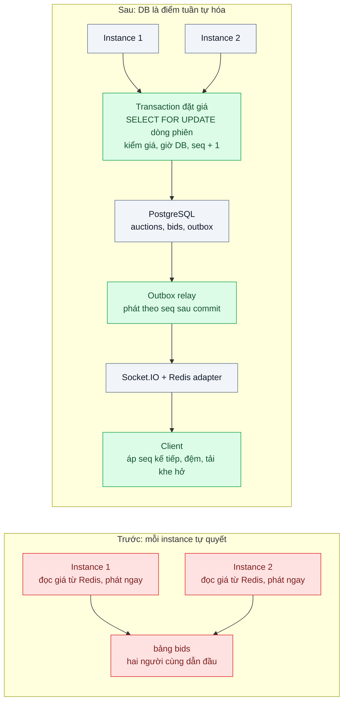
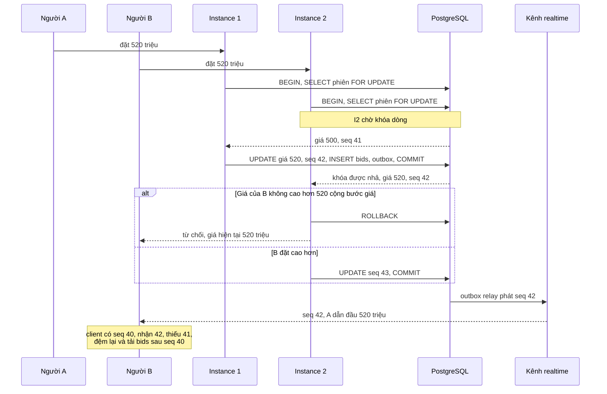

# Server-side Ordering — Hai người đặt giá đấu cùng một mili-giây: ai thắng, và mọi màn hình thấy cùng một kết quả

| Scope | Mức độ | Trạng thái | Pattern gốc | Cập nhật |
|---|---|---|---|---|
| 06 · frontend / backend / realtime | 🔴 Nâng cao | 📋 Kế hoạch | Single sequencer / total order — Kleppmann, *DDIA* (2017) ch.9; Fowler, *PoEAA* (2002) Optimistic/Pessimistic Offline Lock | 2026-10-06 |

> **Một câu tóm tắt:** Để database là nơi duy nhất quyết định thứ tự các lượt đặt giá của một phiên (khóa dòng và số thứ tự tăng dần trong cùng transaction), rồi phát sự kiện kèm số thứ tự đó để mọi màn hình áp dụng theo cùng một thứ tự và tự phát hiện khi thiếu.

## 1. Bài toán thực tế (What)

**Bối cảnh** *(doanh nghiệp giả định, số liệu minh họa)*
Sàn đấu giá trực tuyến xe đã qua sử dụng và đồ sưu tầm, khoảng 400 phiên mỗi ngày. Phiên hot có 300 người theo dõi và 50 lượt đặt giá trong 10 giây cuối. Backend NestJS chạy 3 instance, kênh realtime Socket.IO với Redis adapter (bài 02). Mỗi instance nhận lượt đặt giá, so với giá hiện tại đọc từ Redis, ghi bảng `bids` rồi phát ngay cho mọi người.

**Triệu chứng người kinh doanh nhìn thấy**
- Hai người cùng đặt 520 triệu ở giây cuối, cả hai đều thấy "Bạn đang dẫn đầu"; sau phiên một người bị báo thua và khiếu nại, có trường hợp dọa kiện.
- Màn hình của người xem ở Hà Nội và ở TP.HCM hiển thị giá cuối khác nhau trong vài giây, video quay màn hình bị đăng lên mạng xã hội như "bằng chứng gian lận".
- Đội vận hành mất nhiều giờ đối chiếu log ba server để xác định người thắng thật sự.

**Nguyên nhân kỹ thuật**
Hai instance cùng đọc giá hiện tại 500 triệu, cùng thấy 520 triệu hợp lệ, cùng ghi và cùng phát: không có điểm nào trong hệ thống *tuần tự hóa* các lượt đặt giá của một phiên. Thứ tự được suy ra từ thời gian client gửi hoặc thời gian của từng server, vốn không đồng bộ. Sự kiện được phát trước khi transaction commit và đi qua các đường khác nhau (instance khác nhau, Redis), nên mỗi màn hình nhận theo thứ tự khác nhau và áp dụng "cái tới sau cùng".

**Ràng buộc**
- Mọi lượt đặt giá được chấp nhận phải cao hơn giá trước đó ít nhất một bước giá; không bao giờ có hai người cùng dẫn đầu.
- Mọi màn hình cuối cùng hiển thị cùng một chuỗi lượt đặt giá theo cùng thứ tự.
- Quy tắc "ai trước" phải giải thích được với khách hàng và cơ quan quản lý; giờ đóng phiên theo giờ server.
- p95 đặt giá dưới 200 ms ngay cả khi 200 người cùng đặt vào một phiên.

## 2. Vì sao dùng pattern này (Why)

**Nguyên nhân gốc mà pattern nhắm vào:** quyết định thứ tự bị phân tán cho nhiều instance và nhiều đồng hồ, trong khi bài toán đòi một thứ tự toàn phần cho mỗi phiên.

**Pattern giải quyết thế nào:** DDIA ch.9 chỉ ra rằng thứ tự toàn phần đáng tin nhất đến từ một điểm tuần tự hóa duy nhất (single leader), và đồng hồ vật lý không dùng được để quyết định "ai trước". Ở đây điểm đó là dòng `auctions` trong PostgreSQL: mỗi lượt đặt giá chạy một transaction `SELECT ... FOR UPDATE` dòng phiên, kiểm tra giá và giờ đóng bằng giờ của DB, tăng cột `seq` của phiên, ghi `bids` và một bản ghi outbox, rồi commit. Hai lượt đến cùng lúc bị xếp hàng ở khóa dòng; lượt thứ hai thấy giá đã thay đổi và bị từ chối hoặc được chấp nhận với `seq` kế tiếp. Sự kiện chỉ được phát sau commit, mang `seq`; client chỉ áp dụng `seq = lastSeq + 1`, đệm sự kiện tới sớm và tải phần thiếu khi thấy khe hở. "Ai trước" được định nghĩa rõ là *thứ tự commit*, không phải thời gian bấm.

**Lựa chọn khác đã cân nhắc**

| Lựa chọn | Giải quyết được gì | Vì sao không chọn (ở bài này) |
|---|---|---|
| Giữ nguyên + tối ưu nhỏ (đồng bộ NTP chặt hơn, so thời gian client) | Giảm lệch giờ giữa server | Đồng hồ không bao giờ đủ chính xác để phân xử cùng mili-giây; thời gian client giả mạo được |
| Optimistic lock: `UPDATE ... WHERE seq = $expected` | Không giữ khóa, đọc không bị chặn | Khi 200 người cùng đặt, phần lớn bị xung đột và phải thử lại; hợp khi tranh chấp thấp, giữ làm biến thể so sánh |
| Khóa phân tán trên Redis theo phiên | Tuần tự hóa ngoài DB | Thêm một nguồn sự thật thứ hai; khóa hết hạn khi tiến trình dừng giữa chừng gây ghi đôi |
| Actor/hàng đợi một consumer cho mỗi phiên | Thông lượng cao, không tranh chấp khóa DB | Hạ tầng phức tạp (định tuyến theo phiên, chuyển giao khi consumer chết); quá mức cho 50 lượt/10 giây |
| Khóa dòng PostgreSQL + `seq` theo phiên + outbox (chọn) | Thứ tự toàn phần theo phiên, nguyên tử với dữ liệu, client phát hiện khe hở | Tuần tự hóa giới hạn thông lượng mỗi phiên; khóa giữ trong thời gian transaction |

## 3. Thiết kế hệ thống (How)

### 3.1 Kiến trúc trước và sau



### 3.2 Luồng chính



### 3.3 Thành phần và trách nhiệm

| Thành phần | Trách nhiệm | Quyết định thiết kế đáng chú ý |
|---|---|---|
| `PlaceBidService` | Transaction đặt giá: khóa dòng, kiểm quy tắc, tăng `seq`, ghi `bids` và outbox | Giờ đóng phiên so bằng `now()` của DB; transaction ngắn, không gọi dịch vụ ngoài khi giữ khóa |
| Cột `auctions.seq` | Số thứ tự liên tục theo phiên | Không dùng `SEQUENCE` toàn cục vì sequence của PostgreSQL có thể để khe hở khi rollback, client không phân biệt được khe hở thật |
| Ràng buộc `UNIQUE (auction_id, seq)` | Lưới an toàn nếu logic khóa bị sửa sai | Lỗi vi phạm là tín hiệu bug, không phải luồng bình thường |
| Outbox relay | Đọc outbox theo thứ tự, phát lên kênh realtime | Phát *sau commit*, không mất khi instance chết giữa chừng |
| `AuctionFeed` (client) | Áp sự kiện theo `seq`, đệm khi tới sớm, bỏ khi trùng | Thấy khe hở quá 2 giây thì gọi `GET /auctions/:id/bids?afterSeq=` |

### 3.4 Điểm dễ sai khi triển khai
- Phát sự kiện trước commit: client thấy lượt đặt giá mà transaction sau đó rollback. Chỉ phát từ outbox sau commit.
- Kiểm giá trên dữ liệu đọc *trước* khi lấy khóa (từ cache hoặc từ câu `SELECT` không khóa): vẫn hai người cùng thắng. Mọi kiểm tra phải nằm sau `FOR UPDATE` trong cùng transaction.
- Dùng giờ của client hoặc của instance để đóng phiên: lượt đặt giá "lọt" sau giờ đóng ở instance có đồng hồ chậm.
- Giữ khóa trong lúc gọi dịch vụ ngoài (kiểm tra ví đặt cọc qua HTTP): độ trễ dịch vụ ngoài thành thời gian chờ khóa của mọi người.
- Client áp dụng "sự kiện tới sau cùng": hai đường giao khác nhau làm màn hình nhảy lùi. Luôn so `seq`.

## 4. Tech stack và tác động (Impact techstack)

| Lớp | Công nghệ chọn | Vì sao chọn | Thay thế tương đương |
|---|---|---|---|
| Điểm tuần tự hóa | PostgreSQL 16 (`SELECT ... FOR UPDATE`, cột `seq`, ràng buộc unique) | Nguồn sự thật đã có, khóa dòng nguyên tử với dữ liệu | Biến thể optimistic với cột phiên bản |
| Phát sự kiện | Transactional outbox + relay đọc theo thứ tự | Không phát trước commit, không mất khi instance chết | Debezium đọc outbox (scope 14) |
| Kênh realtime | Socket.IO 4 + Redis adapter (bài 02) | Room theo phiên, đã có hạ tầng | SSE cho người chỉ xem |
| Backend / Frontend | NestJS 10, Next.js | Trùng stack | Fastify |
| Đo | k6 (200 VU cùng một phiên), script N client so chuỗi `seq`, `pg_stat_activity`, `log_lock_waits` | Tái hiện tranh chấp và kiểm tính hội tụ | — |

**Thay đổi so với hệ thống hiện tại:** bỏ việc đọc giá hiện tại từ Redis khi đặt giá, đưa toàn bộ kiểm tra vào một transaction có khóa; thêm cột `seq`, bảng outbox và relay; client đổi sang áp dụng theo `seq`. Điều khoản phiên đấu giá ghi rõ "thứ tự do hệ thống ghi nhận" là căn cứ phân xử.

## 5. Kết quả đầu ra và cách đo (Output impact)

| Chỉ số | Trước (minh họa) | Mục tiêu khi thực hành | Cách đo |
|---|---|---|---|
| Lượt đặt giá được chấp nhận vi phạm quy tắc bước giá dưới 200 lượt đồng thời | 3–5 mỗi lần chạy | 0 | k6 200 VU cùng phiên, sau đó SQL kiểm `bids` theo `seq` tăng dần và giá tăng nghiêm ngặt |
| Phiên có màn hình hiển thị người dẫn đầu cuối khác nhau | có | 0 trên 100 phiên × 50 client | Script client ghi chuỗi `seq` nhận được, so chuỗi cuối cùng giữa các client |
| p95 đặt giá khi 200 người cùng đặt một phiên | 120 ms (nhưng sai) | < 200 ms | k6 `http_req_duration` p(95) |
| Thời gian chờ khóa p95 | không áp dụng | < 50 ms | `log_lock_waits` với `deadlock_timeout` thấp trong môi trường thử, `pg_stat_activity` |
| Commit tới mọi client nhận, p95 | không áp dụng | < 500 ms | Dấu thời gian trong outbox so với thời điểm client nhận |
| Tỷ lệ xung đột của biến thể optimistic ở cùng tải | không áp dụng | ghi số thật để so sánh | Đếm số lần `UPDATE` trả 0 dòng |

> Số "trước" là minh họa để hình dung bài toán. Số "mục tiêu" chỉ được coi là đạt khi có số đo thật
> ở mục 8 kèm môi trường đo.

**Tác động nghiệp vụ mong đợi:** không còn phiên có hai người cùng dẫn đầu; khiếu nại về kết quả có câu trả lời bằng chuỗi `seq` trong DB thay vì đối chiếu log nhiều giờ, giữ uy tín của sàn.

## 6. Đánh đổi và khi KHÔNG nên dùng

**Đánh đổi**
- Mọi lượt đặt giá của một phiên đi qua một khóa: thông lượng mỗi phiên bị giới hạn bởi thời gian transaction.
- Thêm outbox và relay: một tiến trình nữa phải vận hành và giám sát độ trễ.
- Client phức tạp hơn (đệm, phát hiện khe hở, tải bù).

**Không nên dùng khi**
- Thông lượng mỗi khóa vượt xa khả năng một dòng DB (hàng nghìn lệnh mỗi giây trên một mã như sàn chứng khoán): cần bộ khớp lệnh chuyên dụng trong bộ nhớ với log riêng.
- Thứ tự không ảnh hưởng kết quả (đếm lượt thích, lượt xem): dùng phép cộng giao hoán, không cần tuần tự hóa.
- Tranh chấp hầu như không có (mỗi phiên vài lượt mỗi giờ): optimistic lock đơn giản hơn và đủ.

**Liên quan**
- [`../03-reconnect-resume-mat-mang-10-giay-mat-thong-bao/`](../03-reconnect-resume-mat-mang-10-giay-mat-thong-bao/) — tải phần thiếu khi client phát hiện khe hở `seq`.
- [`../../02-backend-database/02-optimistic-lock-hai-nhan-vien-cung-sua-mot-don/`](../../02-backend-database/02-optimistic-lock-hai-nhan-vien-cung-sua-mot-don/) — biến thể optimistic lock.
- [`../../14-backend-queueing/03-transactional-outbox-ghi-don-xong-crash-mat-event/`](../../14-backend-queueing/03-transactional-outbox-ghi-don-xong-crash-mat-event/) — outbox và relay.

## 7. Cơ sở tham khảo

- Martin Kleppmann, *Designing Data-Intensive Applications*, O'Reilly, 2017, ch.9 "Consistency and Consensus", phần "Ordering Guarantees" (sequence number ordering, total order broadcast) — vì sao cần một điểm tuần tự hóa và không dựa vào đồng hồ.
- Martin Fowler, *PoEAA*, 2002, "Pessimistic Offline Lock" và "Optimistic Offline Lock" — https://martinfowler.com/eaaCatalog/ — hai cách kiểm soát tranh chấp, căn cứ cho lựa chọn và biến thể so sánh.
- PostgreSQL docs, "Explicit Locking" (`FOR UPDATE`), "Transaction Isolation" và "Sequence Manipulation Functions" (sequence không quay lui khi rollback) — https://www.postgresql.org/docs/ — cơ chế khóa dòng và lý do không dùng sequence toàn cục cho `seq`.
- Chris Richardson, microservices.io, "Transactional outbox" — https://microservices.io/patterns/data/transactional-outbox.html — phát sự kiện nguyên tử với thay đổi dữ liệu.

## 8. Kế hoạch thực hành

- [ ] Bước 1: Docker Compose PostgreSQL 16, Redis 7, 3 instance NestJS + Socket.IO; seed 100 phiên; trang Next.js xem phiên và đặt giá.
- [ ] Bước 2: đo "trước": bản đọc giá từ Redis và phát ngay; k6 200 VU đặt giá cùng phiên, 50 client so chuỗi hiển thị; ghi số vi phạm và số phiên lệch.
- [ ] Bước 3: áp dụng pattern: transaction khóa dòng với `seq`, outbox và relay, client `AuctionFeed` áp theo `seq` có đệm và tải khe hở; thêm biến thể optimistic.
- [ ] Bước 4: đo "sau" cùng kịch bản; ghi p95, thời gian chờ khóa, độ trễ phát và tỷ lệ xung đột của biến thể vào mục 5 kèm môi trường.
- [ ] Bước 5: viết test: (a) 200 lượt đồng thời, giá tăng nghiêm ngặt theo `seq`; (b) lượt sau giờ đóng theo giờ DB bị từ chối; (c) rollback không phát sự kiện; (d) client nhận 42 trước 41 vẫn hiển thị đúng thứ tự.

**Cấu trúc code dự kiến**
```text
src/
  truoc/place-bid.naive.ts              # đọc giá từ Redis, phát ngay, tái hiện triệu chứng
  sau/place-bid.service.ts              # [PATTERN] FOR UPDATE, kiểm quy tắc, seq + 1, outbox
  sau/place-bid.optimistic.ts           # biến thể UPDATE ... WHERE seq = $expected
  sau/outbox-relay.ts                   # phát theo thứ tự sau commit
  web/lib/auction-feed.ts               # [PATTERN] áp seq kế tiếp, đệm, tải khe hở
migrations/001-auctions-bids-outbox.sql
test/
  concurrent-bids-strictly-increase.test.ts
  bid-after-close-rejected.test.ts
  rollback-publishes-nothing.test.ts
  out-of-order-client-still-correct.test.ts
bench/bid-contention.k6.js
docker-compose.yml
```

**Cách chạy** *(điền khi bắt đầu code)*
```bash
docker compose up -d
pnpm install && pnpm migrate && pnpm test
k6 run bench/bid-contention.k6.js
```
