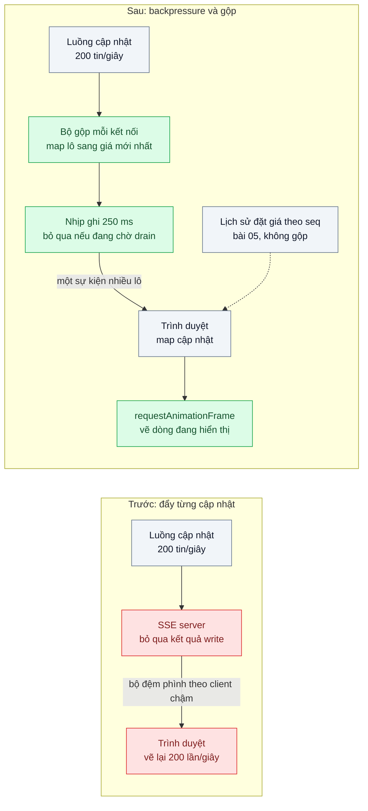
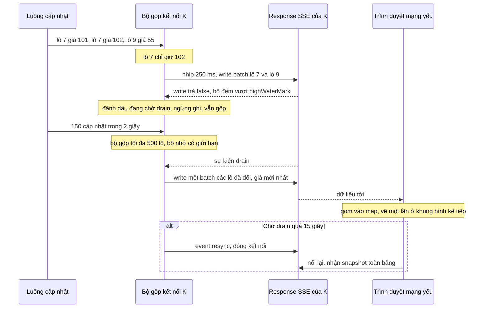

# Backpressure & Batching — Bảng giá đấu giá nhận 200 cập nhật/giây, trình duyệt đơ

| Scope | Mức độ | Trạng thái | Pattern gốc | Cập nhật |
|---|---|---|---|---|
| 06 · frontend / backend / realtime | 🔴 Nâng cao | 📋 Kế hoạch | Backpressure — Reactive Streams specification; WHATWG Streams; Node.js docs "Stream" | 2026-10-06 |

> **Một câu tóm tắt:** Cho tốc độ đẩy dữ liệu theo khả năng tiêu thụ của từng client: server gộp các cập nhật của cùng một lô thành giá mới nhất và chỉ ghi khi kết nối còn nhận được, trình duyệt gom cập nhật và vẽ tối đa một lần mỗi khung hình.

## 1. Bài toán thực tế (What)

**Bối cảnh** *(doanh nghiệp giả định, số liệu minh họa)*
Sàn đấu giá ở bài 05 tổ chức "ngày hội đấu giá" với 500 lô mở cùng lúc. Bảng giá tổng hợp hiển thị giá hiện tại, người dẫn đầu và thời gian còn lại của mọi lô; giờ cao điểm có khoảng 200 cập nhật mỗi giây (đặt giá, gia hạn giờ, số người theo dõi). Server SSE đẩy nguyên từng cập nhật tới khoảng 8.000 người xem, nhiều người dùng điện thoại tầm trung trên 4G.

**Triệu chứng người kinh doanh nhìn thấy**
- Trên điện thoại, bảng giá đơ vài giây rồi nhảy một loạt; người dùng bấm "đặt giá" nhưng nút không phản hồi và lỡ lô muốn mua.
- Người xem trên mạng yếu thấy giá trễ 20–30 giây so với thực tế; vài người đặt giá theo con số đã lỗi thời và bị từ chối liên tục.
- Trong ngày hội, bộ nhớ server realtime tăng dần tới khi tiến trình bị kill, mọi người xem mất kết nối cùng lúc.

**Nguyên nhân kỹ thuật**
Phía trình duyệt, mỗi cập nhật kích hoạt một lần cập nhật state và vẽ lại bảng 500 dòng; 200 lần vẽ mỗi giây vượt xa 60 khung hình mỗi giây mà màn hình hiển thị được, main thread bị chiếm bởi các tác vụ dài, sự kiện chạm không được xử lý. Phía server, khi client đọc chậm hơn tốc độ đẩy, dữ liệu dồn vào bộ đệm ghi của từng kết nối; `res.write()` báo "đầy" nhưng code bỏ qua, bộ đệm phình theo thời gian. Phần lớn cập nhật trung gian vô nghĩa với người xem: chỉ giá *mới nhất* của mỗi lô là quan trọng.

**Ràng buộc**
- Bảng giá mượt trên điện thoại tầm trung; nút đặt giá luôn phản hồi.
- Giá hiển thị không trễ quá khoảng nửa giây với mạng bình thường; với mạng yếu được bỏ giá trung gian nhưng phải hiện giá mới nhất.
- Bộ nhớ server cho mỗi kết nối có giới hạn trên, bất kể client chậm tới đâu.
- Lịch sử đặt giá của một lô (bài 05) vẫn phải đầy đủ, không được bỏ sự kiện.

## 2. Vì sao dùng pattern này (Why)

**Nguyên nhân gốc mà pattern nhắm vào:** bên phát đẩy theo tốc độ của mình mà không nghe tín hiệu "chậm lại" từ bên nhận, và gửi mọi trạng thái trung gian dù bên nhận chỉ cần trạng thái cuối.

**Pattern giải quyết thế nào:** Backpressure là cơ chế bên nhận báo cho bên phát biết mình nhận được bao nhiêu. Reactive Streams biến nó thành giao thức nhu cầu tường minh (`request(n)`); WHATWG Streams và Node.js stream hiện thực bằng ngưỡng bộ đệm `highWaterMark`: `writable.write()` trả `false` khi vượt ngưỡng và phát sự kiện `drain` khi có thể ghi tiếp. Bài này dùng chính tín hiệu đó trên response SSE: mỗi kết nối có một *bộ gộp* (map lô → cập nhật mới nhất); cứ 250 ms, nếu kết nối không đang chờ `drain`, server ghi một sự kiện chứa mọi lô đã đổi. Khi `write()` trả `false`, server ngừng ghi nhưng vẫn gộp; bộ gộp có kích thước tối đa bằng số lô nên bộ nhớ có giới hạn. Phía trình duyệt, cập nhật vào map và được vẽ trong `requestAnimationFrame`, chỉ cho các dòng đang hiển thị. Gộp là *mất dữ liệu có chủ đích* chỉ áp cho bảng giá; luồng lịch sử đặt giá giữ nguyên `seq` của bài 05.

**Lựa chọn khác đã cân nhắc**

| Lựa chọn | Giải quyết được gì | Vì sao không chọn (ở bài này) |
|---|---|---|
| Giữ nguyên + tối ưu nhỏ (memo hóa component, debounce ở client) | Giảm chi phí mỗi lần vẽ | Server vẫn đẩy 200 tin/giây; client chậm vẫn làm phình bộ đệm server |
| Throttle cố định ở server (mỗi lô tối đa 1 tin/giây) | Giảm lưu lượng đều | Không phản ứng theo từng client; client nhanh bị trễ vô lý, client chậm vẫn bị dồn |
| Hàng đợi không giới hạn cho từng client | Không mất cập nhật nào | Đúng nguyên nhân làm server hết bộ nhớ |
| Cắt kết nối client chậm | Bảo vệ server | Người dùng mạng yếu không xem được gì; chỉ dùng như biện pháp cuối |
| Gộp theo lô + ghi theo tín hiệu `drain` + vẽ theo khung hình (chọn) | Tốc độ theo từng client, bộ nhớ có giới hạn, giá luôn là mới nhất | Bỏ giá trung gian; chỉ hợp cho dữ liệu dạng "trạng thái mới nhất" |

## 3. Thiết kế hệ thống (How)

### 3.1 Kiến trúc trước và sau



### 3.2 Luồng chính



### 3.3 Thành phần và trách nhiệm

| Thành phần | Trách nhiệm | Quyết định thiết kế đáng chú ý |
|---|---|---|
| `ConflatingSink` (mỗi kết nối) | Gộp cập nhật theo lô, ghi theo nhịp, tôn trọng `drain` | Kích thước tối đa bằng số lô; kiểm `writableNeedDrain` trước khi ghi |
| Nhịp ghi | Gom cập nhật trong 250 ms thành một sự kiện | Đánh đổi giữa độ trễ và số sự kiện; chỉnh theo đo đạc |
| Ngưỡng chờ `drain` | Phát hiện client quá chậm | Quá 15 giây thì gửi `resync`, đóng, để client lấy snapshot khi nối lại |
| Kênh lịch sử đặt giá | Gửi đủ mọi lượt đặt giá của lô đang mở chi tiết | Không đi qua bộ gộp; dùng `seq` của bài 05 |
| `PriceBoardStore` (client) | Ghi cập nhật vào map, đánh dấu dòng bẩn | Không gọi `setState` cho từng tin |
| Vòng vẽ `requestAnimationFrame` | Áp dòng bẩn vào DOM tối đa một lần mỗi khung hình | Kết hợp danh sách ảo hóa để chỉ vẽ khoảng 30 dòng đang thấy |

### 3.4 Điểm dễ sai khi triển khai
- Bỏ qua giá trị trả về của `write()`: không có backpressure, chỉ có bộ đệm vô hạn.
- Gộp nhầm loại dữ liệu cần đủ (lượt đặt giá, giao dịch): mất sự kiện có ý nghĩa pháp lý. Chỉ gộp dữ liệu dạng "trạng thái mới nhất".
- Gộp theo thời gian nhưng không theo khóa: batch vẫn chứa 50 giá trung gian của cùng một lô.
- Throttle ở client bằng `setTimeout` thay vì `requestAnimationFrame`: vẫn vẽ lệch nhịp màn hình và vẽ cả khi tab bị ẩn.
- Một bộ gộp dùng chung cho mọi kết nối: client chậm nhất kéo tốc độ của tất cả. Bộ gộp phải theo từng kết nối.
- Nén response SSE bằng proxy mà không flush: batch bị giữ lại, mất ý nghĩa nhịp 250 ms.

## 4. Tech stack và tác động (Impact techstack)

| Lớp | Công nghệ chọn | Vì sao chọn | Thay thế tương đương |
|---|---|---|---|
| Kênh realtime | SSE trên NestJS 10, ghi trực tiếp lên response Node | Truy cập trực tiếp `write()`, `drain`, `writableNeedDrain` của Node stream | WebSocket `ws` với `bufferedAmount` |
| Nguồn cập nhật | Redis Pub/Sub (bài 02), một subscriber mỗi instance | Tách nguồn khỏi tốc độ của từng client | — |
| Frontend | Next.js, store tự viết + `requestAnimationFrame` | Kiểm soát nhịp vẽ rõ ràng để học cơ chế | Zustand với cập nhật theo lô |
| Danh sách | TanStack Virtual | Chỉ vẽ dòng đang hiển thị | `react-window` |
| Tiêm mạng yếu | Toxiproxy giới hạn băng thông | Tái hiện client đọc chậm có kiểm soát | `tc netem` |
| Đo | Chrome DevTools Performance (giảm tốc CPU 4x), Long Tasks API, Prometheus | Long task và khung hình phía client; bộ nhớ mỗi kết nối phía server | Lighthouse cho chỉ số tổng quát |

**Thay đổi so với hệ thống hiện tại:** endpoint bảng giá chuyển sang `ConflatingSink`; client chuyển từ "mỗi tin một lần setState" sang store + vòng vẽ theo khung hình; thêm sự kiện `resync`. Đội cần thống nhất với nghiệp vụ danh sách dữ liệu được phép gộp.

## 5. Kết quả đầu ra và cách đo (Output impact)

| Chỉ số | Trước (minh họa) | Mục tiêu khi thực hành | Cách đo |
|---|---|---|---|
| Long task trên 50 ms mỗi phút, CPU giảm tốc 4x | khoảng 120 | < 5 | `PerformanceObserver` loại `longtask` ghi về server; DevTools Performance |
| Thời gian phản hồi khi bấm "đặt giá" trong lúc cao điểm | 1.500 ms | < 100 ms | Event Timing trong DevTools; Playwright đo từ click tới khi nút đổi trạng thái |
| Sự kiện tới client mỗi giây | 200 | ≤ 4 batch | Đếm sự kiện ở client giả lập |
| Bộ nhớ server cho một client đọc chậm sau 10 phút | tăng không giới hạn | < 1 MB và ổn định | Toxiproxy giới hạn băng thông, đo `process.memoryUsage()` và `writableLength` |
| Độ trễ giá mới nhất tới màn hình, p95, mạng bình thường | 300 ms khi không đơ, vài giây khi đơ | < 500 ms | Dấu thời gian cập nhật ở nguồn so với thời điểm vẽ |
| Lượt đặt giá bị thiếu trong lịch sử lô | không áp dụng | 0 | Test so chuỗi `seq` nhận được với DB |

> Số "trước" là minh họa để hình dung bài toán. Số "mục tiêu" chỉ được coi là đạt khi có số đo thật
> ở mục 8 kèm môi trường đo.

**Tác động nghiệp vụ mong đợi:** người dùng điện thoại đặt giá được ngay cả lúc sôi động nhất, giảm lượt đặt giá theo con số lỗi thời; server không còn sập giữa ngày hội vì client chậm.

## 6. Đánh đổi và khi KHÔNG nên dùng

**Đánh đổi**
- Bỏ giá trung gian: người xem không thấy mọi bước nhảy giá trên bảng tổng hợp.
- Thêm độ trễ tối đa bằng nhịp ghi; nhịp quá dài làm bảng có cảm giác chậm.
- Logic theo từng kết nối phức tạp hơn đẩy thẳng; cần test với client chậm có kiểm soát.

**Không nên dùng khi**
- Mỗi sự kiện đều có ý nghĩa và phải được thấy (giao dịch, tin nhắn, lượt đặt giá): cần giao đủ có thứ tự, không gộp.
- Tốc độ cập nhật thấp (vài tin mỗi giây): đẩy thẳng là đủ, bộ gộp chỉ thêm độ trễ.
- Client cần dựng lại đồ thị đầy đủ từng tick (biểu đồ nến chứng khoán): gửi dữ liệu đã tổng hợp theo khung thời gian thay vì gộp theo khóa.

**Liên quan**
- [`../05-server-side-ordering-dau-gia-hai-nguoi-bid-cung-luc/`](../05-server-side-ordering-dau-gia-hai-nguoi-bid-cung-luc/) — luồng lịch sử đặt giá phải giữ đủ theo `seq`.
- [`../01-sse-vs-websocket-vs-polling-theo-doi-trang-thai-don/`](../01-sse-vs-websocket-vs-polling-theo-doi-trang-thai-don/) — SSE và cấu hình proxy không buffer.
- [`../../18-backend-scale/05-load-shedding-qua-tai-thi-tu-choi-mot-phan-thay-vi-sap-het/`](../../18-backend-scale/05-load-shedding-qua-tai-thi-tu-choi-mot-phan-thay-vi-sap-het/) — chủ động bỏ bớt việc khi quá tải ở phía server.
- [`../../04-frontend-cache/04-optimistic-ui-bam-thich-cho-mot-giay/`](../../04-frontend-cache/04-optimistic-ui-bam-thich-cho-mot-giay/) — giữ giao diện phản hồi ngay khi người dùng thao tác.

## 7. Cơ sở tham khảo

- Reactive Streams, "Reactive Streams Specification for the JVM" — https://www.reactive-streams.org/ — định nghĩa backpressure bằng nhu cầu tường minh (`request(n)`) giữa bên phát và bên nhận.
- WHATWG, "Streams Standard" — https://streams.spec.whatwg.org/ — hàng đợi nội bộ, `highWaterMark`, `desiredSize` và cách tín hiệu backpressure lan ngược trong chuỗi stream.
- Node.js docs, "Stream" (`writable.write()` trả `false`, sự kiện `drain`, `writableNeedDrain`, `highWaterMark`) và hướng dẫn "Backpressuring in Streams" — https://nodejs.org/docs/ — cơ chế dùng trực tiếp trên response SSE.
- MDN Web Docs, "Window: requestAnimationFrame()" và "PerformanceLongTaskTiming" — https://developer.mozilla.org/ — vẽ theo nhịp màn hình và đo tác vụ dài ở client.

## 8. Kế hoạch thực hành

- [ ] Bước 1: Docker Compose Redis 7, NestJS SSE, Toxiproxy; script phát 200 cập nhật/giây cho 500 lô; trang Next.js bảng giá 500 dòng.
- [ ] Bước 2: đo "trước": đẩy từng cập nhật, client `setState` mỗi tin; ghi long task (CPU 4x), thời gian phản hồi nút, bộ nhớ server với một client bị giới hạn băng thông.
- [ ] Bước 3: áp dụng pattern: `ConflatingSink` theo kết nối với nhịp 250 ms và `drain`, sự kiện `resync`, store + `requestAnimationFrame` + danh sách ảo hóa; giữ kênh lịch sử theo `seq`.
- [ ] Bước 4: đo "sau" cùng kịch bản; thử nhịp 100, 250, 500 ms; ghi số thật và môi trường vào mục 5.
- [ ] Bước 5: viết test: (a) 100 cập nhật cùng lô trong một nhịp chỉ ra một giá trị, là giá mới nhất; (b) khi `write()` trả `false` không ghi thêm cho tới `drain`; (c) bộ nhớ bộ gộp không vượt số lô; (d) lịch sử đặt giá không mất `seq` nào.

**Cấu trúc code dự kiến**
```text
src/
  api/truoc/push-every-update.ts         # đẩy từng tin, bỏ qua write(), tái hiện triệu chứng
  api/sau/conflating-sink.ts             # [PATTERN] gộp theo lô, nhịp ghi, tôn trọng drain
  api/sau/price-board.controller.ts      # SSE bảng giá, resync khi quá chậm
  web/lib/price-board-store.ts           # map cập nhật, đánh dấu dòng bẩn
  web/lib/frame-scheduler.ts             # [PATTERN] vẽ trong requestAnimationFrame
  web/app/price-board.tsx                # danh sách ảo hóa
test/
  conflation-keeps-latest-price.test.ts
  no-write-while-awaiting-drain.test.ts
  conflater-memory-is-bounded.test.ts
  price-history-keeps-every-seq.test.ts
bench/update-firehose.ts
docker-compose.yml
```

**Cách chạy** *(điền khi bắt đầu code)*
```bash
docker compose up -d
pnpm install && pnpm test
pnpm tsx bench/update-firehose.ts --rate 200 --lots 500
```
