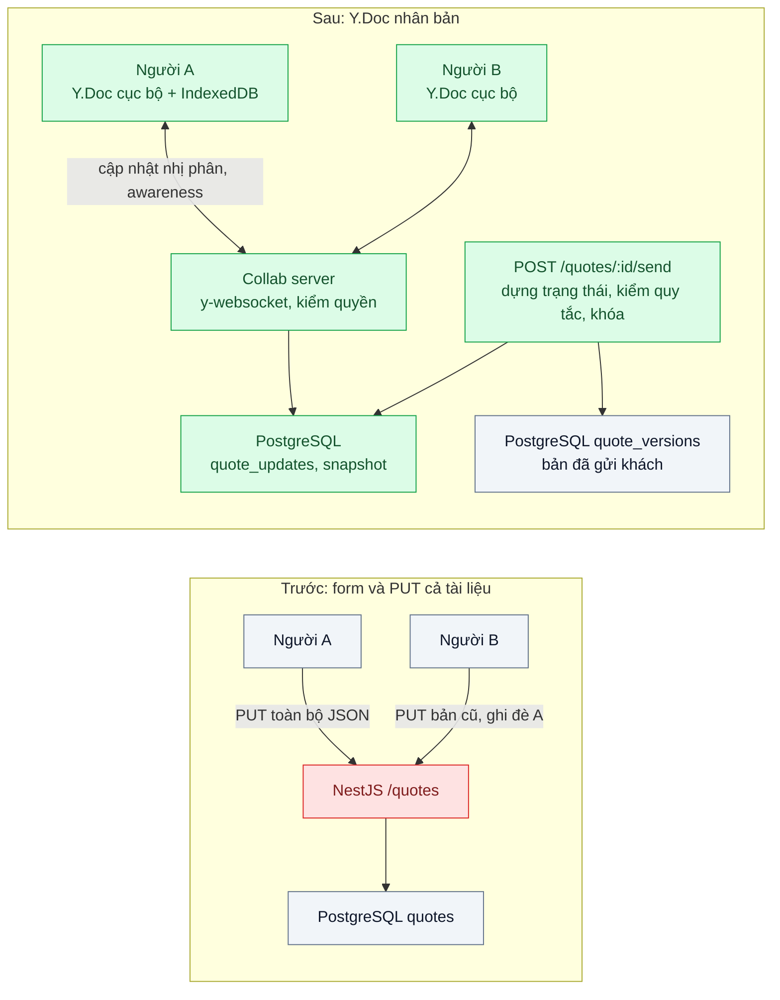
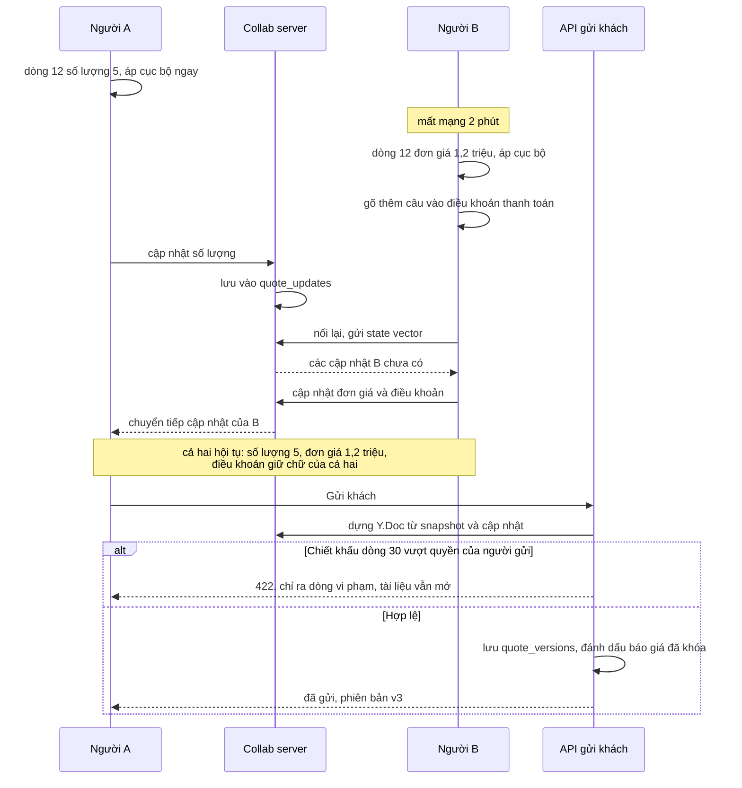

# Collaborative Editing (CRDT / OT) — Nhiều người cùng sửa một báo giá, thay đổi của nhau ghi đè

| Scope | Mức độ | Trạng thái | Pattern gốc | Cập nhật |
|---|---|---|---|---|
| 06 · frontend / backend / realtime | 🔴 Nâng cao | 📋 Kế hoạch | CRDT — Shapiro, Preguiça, Baquero, Zawirski (2011); OT — Ellis & Gibbs (1989); Yjs docs | 2026-10-06 |

> **Một câu tóm tắt:** Biểu diễn báo giá bằng kiểu dữ liệu nhân bản không xung đột (CRDT) để mỗi người sửa bản cục bộ ngay lập tức, các thay đổi đồng thời được trộn tự động và mọi bản hội tụ cùng một trạng thái; các quy tắc nghiệp vụ được kiểm ở bước chốt báo giá trên server.

## 1. Bài toán thực tế (What)

**Bối cảnh** *(doanh nghiệp giả định, số liệu minh họa)*
SaaS B2B CRM có module báo giá: một báo giá gồm thông tin khách, 10–80 dòng sản phẩm (số lượng, đơn giá, chiết khấu), ghi chú và điều khoản. Với khách lớn, nhân viên kinh doanh, trưởng nhóm và bộ phận kỹ thuật cùng sửa một báo giá trong lúc họp trực tuyến với khách. Hiện màn hình là form: bấm "Lưu" gửi toàn bộ JSON báo giá bằng `PUT /quotes/:id`.

**Triệu chứng người kinh doanh nhìn thấy**
- Kỹ thuật vừa sửa cấu hình dòng 12, trưởng nhóm bấm "Lưu" phần chiết khấu từ bản mở 10 phút trước: cấu hình dòng 12 quay về như cũ, báo giá gửi khách bị sai và phải xin lỗi.
- Sau khi thêm optimistic lock, người dùng liên tục gặp "Báo giá đã được người khác sửa, vui lòng tải lại" và mất đoạn ghi chú vừa gõ; đội kinh doanh quay lại sửa trên bảng tính rồi dán vào.
- Không ai biết đồng nghiệp đang sửa ô nào, hai người cùng gõ một điều khoản.

**Nguyên nhân kỹ thuật**
Mỗi lần lưu ghi đè cả tài liệu bằng bản mà client đang giữ: đó là last-write-wins ở mức toàn tài liệu, mọi thay đổi đồng thời của người khác bị mất (DDIA ch.5 gọi đây là cách giải xung đột làm mất dữ liệu). Optimistic lock phát hiện được xung đột nhưng chỉ biết từ chối, không biết trộn, vì đơn vị xung đột là cả báo giá thay vì từng ô, từng ký tự. Hai người sửa hai dòng khác nhau vẫn bị coi là xung đột.

**Ràng buộc**
- Hai người sửa hai chỗ khác nhau: cả hai thay đổi đều được giữ. Cùng gõ một đoạn văn: cả hai phần chữ đều còn.
- Mất mạng vài phút vẫn sửa được, nối lại thì tự hợp nhất.
- Quy tắc nghiệp vụ (chiết khấu tối đa theo cấp, số lượng dương, tổng tiền) phải đúng tại thời điểm *gửi khách*; sau khi gửi, báo giá bị khóa.
- Lưu được lịch sử để kiểm toán phiên bản đã gửi khách.

## 2. Vì sao dùng pattern này (Why)

**Nguyên nhân gốc mà pattern nhắm vào:** đơn vị đồng bộ là cả tài liệu và cách giải xung đột là "bản sau thắng", nên thay đổi đồng thời không thể cùng tồn tại.

**Pattern giải quyết thế nào:** Có hai họ giải pháp cho cùng sửa. OT (Ellis & Gibbs) biến đổi các thao tác đồng thời với nhau để áp theo thứ tự nào cũng ra cùng kết quả, thường cần server trung tâm sắp thứ tự. CRDT (Shapiro et al.) thiết kế kiểu dữ liệu sao cho mọi cập nhật đồng thời giao hoán: các bản nhận cùng tập cập nhật, theo bất kỳ thứ tự nào, đều hội tụ về cùng trạng thái mà không cần điều phối. Bài này dùng Yjs (một hiện thực CRDT): báo giá là một `Y.Doc` gồm `Y.Map` cho thông tin chung, `Y.Array` các `Y.Map` cho dòng sản phẩm, `Y.Text` cho ghi chú và điều khoản. Mỗi ô là một đơn vị trộn riêng, nên sửa hai dòng khác nhau không còn xung đột; cùng gõ một đoạn thì ký tự của hai người được đan xen theo vị trí. Server chỉ chuyển tiếp và lưu cập nhật nhị phân; awareness của Yjs hiển thị ai đang ở ô nào. Quy tắc nghiệp vụ không ép được bên trong CRDT, nên được kiểm ở thao tác "Gửi khách": server dựng trạng thái, kiểm tra, chụp phiên bản và khóa tài liệu.

**Lựa chọn khác đã cân nhắc**

| Lựa chọn | Giải quyết được gì | Vì sao không chọn (ở bài này) |
|---|---|---|
| Giữ nguyên + tối ưu nhỏ (optimistic lock, tự lưu nháp mỗi 30 giây) | Không ghi đè im lặng nữa | Xung đột vẫn ở mức cả báo giá; người dùng mất công nhập lại khi bị từ chối |
| Khóa theo dòng hoặc theo ô (pessimistic, "đang được A sửa") | Đơn giản, dễ hiểu, không cần trộn | Không sửa được khi mất mạng; khóa treo khi người dùng đóng tab; không giải được cùng gõ một đoạn văn |
| OT với server trung tâm | Mô hình đã dùng lâu trong trình soạn thảo cộng tác | Thuật toán biến đổi phức tạp cho dữ liệu có cấu trúc lồng nhau; ít thư viện TypeScript cho cấu trúc ngoài văn bản |
| CRDT (Yjs) + kiểm tra khi chốt (chọn) | Trộn tự động tới từng ô và ký tự, sửa ngoại tuyến, có awareness | Tài liệu lớn dần theo lịch sử; quy tắc nghiệp vụ phải kiểm ngoài CRDT |

## 3. Thiết kế hệ thống (How)

### 3.1 Kiến trúc trước và sau



### 3.2 Luồng chính



### 3.3 Thành phần và trách nhiệm

| Thành phần | Trách nhiệm | Quyết định thiết kế đáng chú ý |
|---|---|---|
| Lược đồ `Y.Doc` báo giá | `meta` (Y.Map), `lines` (Y.Array các Y.Map có `id` ổn định), `notes`, `terms` (Y.Text) | Không lưu trường dẫn xuất (thành tiền, tổng) trong CRDT; tính khi hiển thị và khi chốt |
| Collab server | Xác thực, kiểm quyền theo báo giá, chuyển tiếp cập nhật và awareness | Từ chối kết nối ghi khi báo giá đã khóa |
| Lưu trữ cập nhật | Ghi nối tiếp `quote_updates`, gộp định kỳ thành snapshot | Snapshot bằng `Y.encodeStateAsUpdate`; nạp lại = snapshot + cập nhật sau đó |
| Awareness | Hiển thị ai đang ở ô nào, con trỏ trong điều khoản | Trạng thái phù du, không lưu (cùng ý tưởng presence ở bài 04) |
| API "Gửi khách" | Dựng trạng thái, kiểm quy tắc nghiệp vụ, lưu phiên bản, khóa | Dùng optimistic lock trên trạng thái báo giá để hai người không cùng gửi hai phiên bản |

### 3.4 Điểm dễ sai khi triển khai
- Lưu tổng tiền trong CRDT: hai người đổi hai dòng, mỗi người tính lại tổng, kết quả trộn ra một tổng không khớp dòng nào. Trường dẫn xuất luôn tính lại.
- Nhận diện dòng bằng chỉ số mảng trong logic nghiệp vụ: chèn và xóa đồng thời làm chỉ số trượt. Mỗi dòng có `id` riêng.
- Cùng sửa *một* ô số (chiết khấu) đồng thời: CRDT chọn một giá trị theo quy tắc xác định, giá trị kia không được giữ; cần awareness để người dùng thấy và quy trình chốt để kiểm.
- Tin rằng CRDT đảm bảo quy tắc nghiệp vụ: "hội tụ" không có nghĩa "hợp lệ". Kiểm ở bước chốt, không ở từng cập nhật.
- Chỉ kiểm quyền lúc mở trang mà không kiểm ở collab server: ai có id báo giá cũng gửi được cập nhật.

## 4. Tech stack và tác động (Impact techstack)

| Lớp | Công nghệ chọn | Vì sao chọn | Thay thế tương đương |
|---|---|---|---|
| CRDT | Yjs (`Y.Map`, `Y.Array`, `Y.Text`, awareness) | Hiện thực CRDT phổ biến cho JavaScript, hỗ trợ dữ liệu có cấu trúc, cập nhật nhị phân gọn | Automerge (cần xác minh API cho bài này) |
| Đồng bộ | `y-websocket` (provider client và server tham chiếu) | Giao thức đồng bộ theo state vector có sẵn | Hocuspocus làm collab server có hook xác thực và lưu trữ (cần xác minh) |
| Lưu cục bộ | `y-indexeddb` (cần xác minh) | Sửa ngoại tuyến, nối lại tự hợp nhất | — |
| Lưu trữ server | PostgreSQL 16, cột `bytea` cho cập nhật và snapshot | Một DB, có transaction cho bước chốt | Object storage cho snapshot lớn |
| API nghiệp vụ | NestJS 10 cho "Gửi khách", kiểm quy tắc | Trùng stack; dùng lại logic chiết khấu sẵn có | Fastify |
| Frontend | Next.js, binding Yjs vào form và trình soạn thảo văn bản | Mỗi ô đọc ghi trực tiếp `Y.Map` | — |
| Test | Vitest + fast-check, Playwright hai trình duyệt | Kiểm hội tụ với thứ tự cập nhật ngẫu nhiên; kiểm trải nghiệm thật | — |

**Thay đổi so với hệ thống hiện tại:** thêm collab server WebSocket, hai bảng lưu cập nhật và snapshot, đổi màn hình báo giá từ form sang binding Yjs, tách thao tác "Gửi khách" thành API có kiểm tra và khóa. Đội học thêm mô hình dữ liệu CRDT và quy trình gộp snapshot.

## 5. Kết quả đầu ra và cách đo (Output impact)

| Chỉ số | Trước (minh họa) | Mục tiêu khi thực hành | Cách đo |
|---|---|---|---|
| Thay đổi bị mất khi hai người sửa hai chỗ khác nhau | mọi thay đổi của người lưu trước | 0 trên 500 kịch bản | Vitest + fast-check: 2–3 `Y.Doc` sinh thao tác ngẫu nhiên, trao đổi cập nhật theo thứ tự ngẫu nhiên, so trạng thái |
| Các bản hội tụ cùng trạng thái sau khi trao đổi đủ cập nhật | không áp dụng | 100% kịch bản | Cùng test, so `toJSON()` của mọi bản |
| Lần gặp "đã có người sửa, vui lòng tải lại" mỗi buổi họp | khoảng 6 | 0 | Đếm lỗi 409 trong log API trước và sau |
| Độ trễ đồng bộ giữa hai trình duyệt, p95 | không áp dụng | < 300 ms | Playwright: gõ ở trình duyệt A, đo tới khi trình duyệt B hiển thị |
| Hợp nhất sau 2 phút ngoại tuyến | mất dữ liệu | đúng trên 50 kịch bản | Playwright chế độ offline, sửa ở cả hai phía rồi nối lại |
| Kích thước tài liệu sau 10.000 thao tác, trước và sau gộp snapshot | không áp dụng | ghi số thật | `Y.encodeStateAsUpdate(doc).byteLength`, số dòng `quote_updates` |

> Số "trước" là minh họa để hình dung bài toán. Số "mục tiêu" chỉ được coi là đạt khi có số đo thật
> ở mục 8 kèm môi trường đo.

**Tác động nghiệp vụ mong đợi:** nhiều bộ phận cùng hoàn thiện báo giá ngay trong buổi họp với khách mà không mất công sức của nhau; báo giá gửi đi luôn qua kiểm tra quy tắc và có phiên bản để kiểm toán.

## 6. Đánh đổi và khi KHÔNG nên dùng

**Đánh đổi**
- Tài liệu giữ metadata lịch sử nên lớn dần; cần gộp snapshot và theo dõi kích thước.
- Dữ liệu nằm ở dạng nhị phân CRDT: báo cáo và tìm kiếm cần bản chiếu (projection) sang bảng thường.
- Quy tắc nghiệp vụ tách khỏi lúc sửa: người dùng có thể làm việc trên trạng thái chưa hợp lệ cho tới khi chốt.

**Không nên dùng khi**
- Mỗi bản ghi thường chỉ một người sửa tại một thời điểm: optimistic lock rẻ hơn rất nhiều.
- Dữ liệu là số dư, tồn kho, giao dịch: cần một nguồn sự thật tuần tự (bài 05), không phải trộn tự động.
- Form ngắn, có cấu trúc, không có văn bản dài và không cần ngoại tuyến: PATCH theo trường + optimistic lock theo trường là đủ.

**Liên quan**
- [`../04-presence-ai-dang-online-ai-dang-go/`](../04-presence-ai-dang-online-ai-dang-go/) — awareness là presence ở mức tài liệu.
- [`../05-server-side-ordering-dau-gia-hai-nguoi-bid-cung-luc/`](../05-server-side-ordering-dau-gia-hai-nguoi-bid-cung-luc/) — cách ngược lại: một điểm tuần tự hóa thay vì trộn.
- [`../../02-backend-database/02-optimistic-lock-hai-nhan-vien-cung-sua-mot-don/`](../../02-backend-database/02-optimistic-lock-hai-nhan-vien-cung-sua-mot-don/) — phương án đủ dùng khi ít người cùng sửa.
- [`../../02-backend-database/04-audit-log-ai-doi-gia-hop-dong-luc-nao/`](../../02-backend-database/04-audit-log-ai-doi-gia-hop-dong-luc-nao/) — lưu vết phiên bản đã gửi khách.

## 7. Cơ sở tham khảo

- Marc Shapiro, Nuno Preguiça, Carlos Baquero, Marek Zawirski, "Conflict-free Replicated Data Types", SSS 2011 — định nghĩa CRDT và điều kiện để các bản hội tụ mà không cần điều phối.
- C. A. Ellis & S. J. Gibbs, "Concurrency control in groupware systems", SIGMOD 1989 — nền của Operational Transformation, phương án so sánh.
- Yjs docs — https://docs.yjs.dev/ — shared types (`Y.Map`, `Y.Array`, `Y.Text`), cập nhật tài liệu và state vector, awareness, provider `y-websocket`.
- Martin Kleppmann, *DDIA*, 2017, ch.5 "Replication", phần "Handling Write Conflicts" — vì sao last-write-wins làm mất dữ liệu và các hướng tự giải xung đột.
- Martin Fowler, *PoEAA*, 2002, "Optimistic Offline Lock" — https://martinfowler.com/eaaCatalog/optimisticOfflineLock.html — phương án hiện tại và cách dùng lại ở bước chốt báo giá.

## 8. Kế hoạch thực hành

- [ ] Bước 1: Docker Compose PostgreSQL 16, NestJS API, collab server `y-websocket`; seed 50 báo giá; tái hiện form `PUT` cả tài liệu trong `truoc/`.
- [ ] Bước 2: đo "trước": Playwright hai trình duyệt sửa đồng thời 50 kịch bản; đếm thay đổi mất và số lần 409 khi bật optimistic lock.
- [ ] Bước 3: áp dụng pattern: lược đồ `Y.Doc` báo giá, binding form và trình soạn thảo, collab server có kiểm quyền, lưu cập nhật + gộp snapshot, API "Gửi khách" có kiểm tra và khóa.
- [ ] Bước 4: đo "sau" cùng kịch bản và kịch bản ngoại tuyến; ghi độ trễ, kích thước tài liệu vào mục 5 kèm môi trường.
- [ ] Bước 5: viết test: (a) fast-check hội tụ với thứ tự cập nhật ngẫu nhiên; (b) chèn và xóa dòng đồng thời không làm sai dòng theo `id`; (c) báo giá đã khóa từ chối cập nhật; (d) chiết khấu vượt quyền bị chặn ở bước gửi.

**Cấu trúc code dự kiến**
```text
src/
  truoc/quote-form.put.ts               # PUT cả tài liệu, tái hiện ghi đè
  sau/quote-doc.schema.ts               # [PATTERN] cấu trúc Y.Doc: meta, lines, notes, terms
  sau/collab-server.ts                  # y-websocket + kiểm quyền + từ chối khi khóa
  sau/update-store.ts                   # quote_updates, gộp snapshot
  sau/send-quote.service.ts             # dựng trạng thái, kiểm quy tắc, lưu phiên bản, khóa
  web/hooks/use-quote-doc.ts            # binding Yjs, awareness
test/
  converges-under-random-order.test.ts
  concurrent-line-insert-delete.test.ts
  locked-quote-rejects-updates.test.ts
  over-limit-discount-blocked.test.ts
e2e/two-browsers-edit-concurrently.spec.ts
docker-compose.yml
```

**Cách chạy** *(điền khi bắt đầu code)*
```bash
docker compose up -d
pnpm install && pnpm test && pnpm e2e
```
