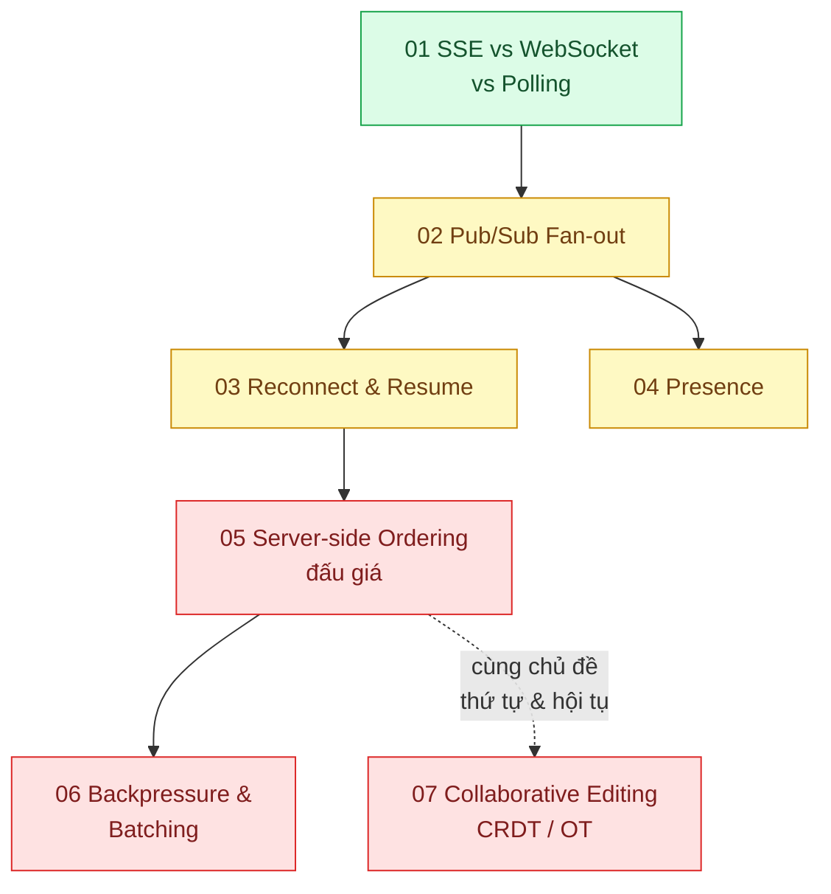

# 06 · Thời gian thực (`frontend / backend / realtime`)

> **Phạm vi:** Đẩy thay đổi từ server tới client (và ngược lại) với độ trễ thấp: chọn giao thức,
> fan-out khi server chạy nhiều bản, nối lại không mất dữ liệu, hiện diện, thứ tự sự kiện trong đấu
> giá, kiểm soát luồng, cùng sửa một tài liệu. Message queue nội bộ thuộc scope 14.
>
> **Câu hỏi trung tâm:** Đẩy thay đổi tới đúng người, đúng thứ tự, kể cả khi họ mất mạng và server
> chạy nhiều bản?

## Bản đồ pattern trong scope

## Danh sách bài toán

| # | Bài toán (pattern — triệu chứng) | Mức | Pattern gốc / nguồn | Trạng thái |
|---|---|---|---|---|
| 01 | [SSE vs WebSocket vs Polling — Khách muốn thấy trạng thái đơn đổi ngay, app hiện hỏi server mỗi 5 giây](./01-sse-vs-websocket-vs-polling-theo-doi-trang-thai-don/) | 🟢 | HTML Living Standard "Server-sent events"; RFC 6455 (WebSocket); MDN | 📋 |
| 02 | [Pub/Sub Fan-out (Redis adapter) — Chạy 3 server WebSocket, tin nhắn của A ở server 1 không tới B ở server 2](./02-pubsub-fanout-3-server-socket-nguoi-a-khong-thay-nguoi-b/) | 🟡 | Socket.IO docs "Redis adapter"; Redis docs "Pub/Sub"; Azure "Publisher-Subscriber" | 📋 |
| 03 | [Reconnect & Resume (Last-Event-ID / sequence) — Mất mạng 10 giây là mất thông báo trong khoảng đó](./03-reconnect-resume-mat-mang-10-giay-mat-thong-bao/) | 🟡 | HTML spec SSE `Last-Event-ID`; Redis docs "Streams" (`XREAD` theo id); DDIA ch.11 (log offset) | 📋 |
| 04 | [Presence (heartbeat + TTL) — Hiển thị "đang online / đang gõ" cho 50k người dùng đồng thời](./04-presence-ai-dang-online-ai-dang-go/) | 🟡 | Phoenix.Presence docs (hexdocs); Redis docs (EXPIRE, keyspace notifications) | 📋 |
| 05 | [Server-side Ordering — Hai người đặt giá đấu cùng một mili-giây: ai thắng, và mọi màn hình thấy cùng một kết quả](./05-server-side-ordering-dau-gia-hai-nguoi-bid-cung-luc/) | 🔴 | DDIA ch.9 "Consistency and Consensus" (ordering, total order broadcast); Fowler *PoEAA* Optimistic Offline Lock; PostgreSQL docs (sequence, `FOR UPDATE`) | 📋 |
| 06 | [Backpressure & Batching — Bảng giá đấu giá nhận 200 cập nhật/giây, trình duyệt đơ](./06-backpressure-throttle-bang-gia-200-cap-nhat-giay/) | 🔴 | Reactive Streams specification; WHATWG Streams; Node.js docs "Stream" (backpressure) | 📋 |
| 07 | [Collaborative Editing (CRDT / OT) — Nhiều người cùng sửa một báo giá, thay đổi của nhau ghi đè](./07-crdt-nhieu-nguoi-cung-sua-mot-bao-gia/) | 🔴 | Shapiro et al., "Conflict-free Replicated Data Types" (2011); Ellis & Gibbs, OT (1989); Yjs docs | 📋 |

## Lộ trình đề xuất trong scope

1. **Chọn giao thức** — SSE đủ cho 80% nhu cầu một chiều; biết khi nào mới cần WebSocket.
2. **Fan-out** — vấn đề đầu tiên khi chạy hơn một server.
3. **Reconnect & resume** — biến "realtime" thành "đáng tin": không mất sự kiện khi mất mạng.
4. **Presence** — bài về trạng thái phù du (ephemeral) và TTL.
5. **Ordering trong đấu giá** — kết hợp DB (nguồn sự thật) với kênh realtime (thông báo).
6. **Backpressure** — khi tốc độ sự kiện vượt khả năng vẽ của trình duyệt.
7. **CRDT/OT** — bài khó nhất; chỉ cần nếu sản phẩm có cùng-sửa thật.

## Kiến thức nền cần có trước

- HTTP keep-alive, HTTP/2; khác biệt kết nối một chiều và hai chiều.
- Redis Pub/Sub và Streams.
- Khái niệm at-least-once, idempotency (scope 14 bài 04) để xử lý sự kiện lặp khi resume.

## Liên kết với scope khác

- `14-backend-queueing` — nguồn sự kiện phía server thường là queue/stream.
- `02-backend-database` bài 02 — optimistic lock dùng trong bài đấu giá.
- `18-backend-scale` bài 01 — stateless + sticky session cho WebSocket.
- `04-frontend-cache` — realtime thay cho polling/refetch của client cache.

## Nguồn tổng quan cho scope

- HTML Living Standard, "Server-sent events"; RFC 6455.
- Martin Kleppmann, *DDIA* ch.9 và ch.11.
- Socket.IO documentation (adapter, rooms).
