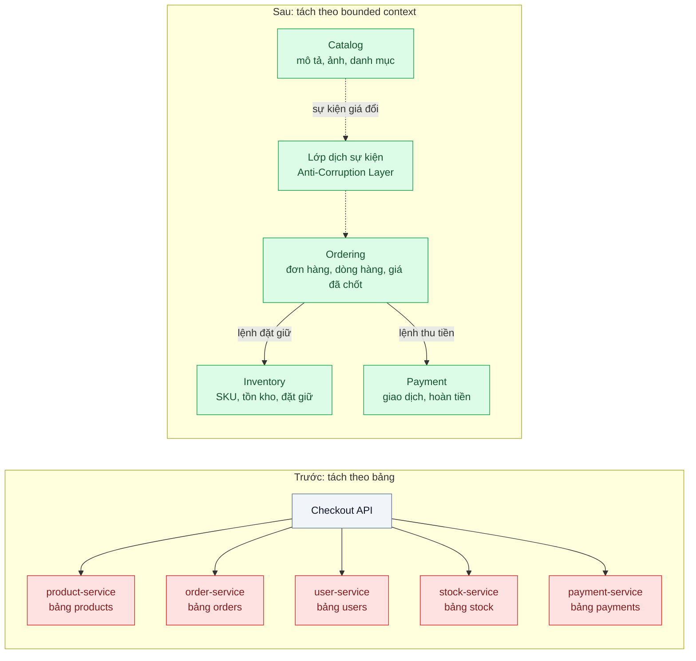
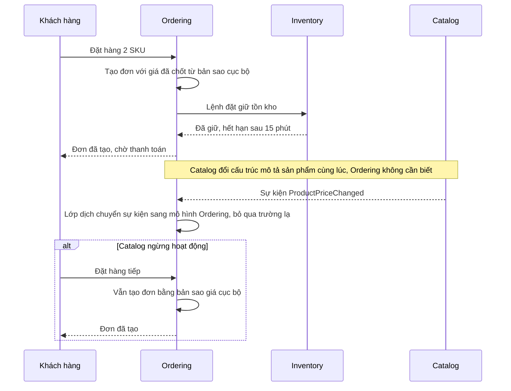

# Decompose by Bounded Context — Tách service theo nghiệp vụ (đơn hàng, kho, thanh toán) thay vì theo bảng

| Scope | Mức độ | Trạng thái | Pattern gốc | Cập nhật |
|---|---|---|---|---|
| 07 · backend / microservices | 🟢 Cơ bản | 📋 Kế hoạch | Bounded Context — Evans, *Domain-Driven Design* (2003); Decompose by subdomain — Richardson, microservices.io (2018) | 2026-10-06 |

> **Một câu tóm tắt:** Chia hệ thống theo *ranh giới nghiệp vụ* (mỗi context có mô hình và ngôn ngữ riêng) thay vì theo *bảng dữ liệu*, để một quy trình kinh doanh chỉ chạm vào một hoặc hai service và một đội có thể đổi mô hình của mình mà không kéo đội khác theo.

## 1. Bài toán thực tế (What)

**Bối cảnh** *(doanh nghiệp giả định, số liệu minh họa)*
Sàn thương mại điện tử tầm trung, 25 kỹ sư chia 4 đội, khoảng 40.000 đơn/ngày. Năm trước đội kỹ thuật tách monolith thành 6 service theo bảng dữ liệu lớn nhất: `product-service` quản bảng `products`, `order-service` quản bảng `orders`, `user-service`, `stock-service`, `payment-service`, `promotion-service`. Mỗi service về bản chất là một lớp CRUD mỏng bọc một bảng.

**Triệu chứng người kinh doanh nhìn thấy**
- Tính năng "đặt trước hàng sắp về" mất 6 tuần vì phải sửa 4 service của 3 đội và phối hợp 3 lịch deploy khác nhau.
- Một lần `product-service` bị chậm, toàn bộ luồng đặt hàng dừng dù khách chỉ cần giá đã chốt trong giỏ; doanh thu buổi tối hôm đó mất khoảng 30 phút.
- Đội kho muốn đổi cách lưu "tồn kho theo kho hàng" nhưng không dám, vì 5 service khác đang đọc trực tiếp cấu trúc cũ.

**Nguyên nhân kỹ thuật**
Tách theo bảng tạo ra các "entity service": mỗi service sở hữu *dữ liệu* nhưng không sở hữu *quy tắc nghiệp vụ*. Quy tắc "đặt hàng" bị trải trên 5 service nên mỗi request đặt hàng cần 9 lần gọi mạng tuần tự, mỗi thay đổi nghiệp vụ là thay đổi ở nhiều đội, và mọi service đều phụ thuộc vào mọi service khác. Khái niệm "sản phẩm" bị ép thành *một* mô hình dùng chung cho mọi nơi, dù Catalog cần mô tả và ảnh, Kho cần SKU và số lượng, Đơn hàng chỉ cần tên và giá tại thời điểm mua.

**Ràng buộc**
- Không thể dừng hệ thống để tách lại; phải đi từng bước trên hệ đang chạy.
- Mỗi đội 5–7 người, muốn deploy độc lập; hạ tầng hiện có là Docker trên VM, chưa có Kubernetes.
- Ngân sách kỹ thuật cho việc tái cấu trúc là một quý, song song với tính năng mới.

## 2. Vì sao dùng pattern này (Why)

**Nguyên nhân gốc mà pattern nhắm vào:** ranh giới service được vẽ theo *dữ liệu* (danh từ) thay vì theo *nghiệp vụ và ngôn ngữ* của từng nhóm người dùng, nên không có service nào tự hoàn thành được một quy trình.

**Pattern giải quyết thế nào:** Evans gọi mỗi vùng nghiệp vụ có mô hình và ngôn ngữ nhất quán là một *Bounded Context*. Cùng một từ "sản phẩm" được phép có mô hình khác nhau trong Catalog, Inventory và Ordering; ranh giới giữa chúng được vẽ tường minh trên *Context Map*, với quan hệ rõ ràng (ai là upstream, ai phải dịch dữ liệu qua Anti-Corruption Layer). Richardson đưa ý này vào microservices dưới tên "Decompose by subdomain": một service cho một subdomain, service sở hữu cả dữ liệu lẫn quy tắc, giao tiếp bằng lệnh và sự kiện ở ranh giới. Kết quả là luồng đặt hàng nằm gọn trong Ordering, chỉ gọi Inventory để đặt giữ và Payment để thu tiền; Catalog thay đổi mô hình tùy ý vì Ordering giữ bản sao giá đã chốt.

**Lựa chọn khác đã cân nhắc**

| Lựa chọn | Giải quyết được gì | Vì sao không chọn (ở bài này) |
|---|---|---|
| Giữ nguyên + tối ưu nhỏ (cache giữa service, gọi song song) | Giảm độ trễ của 9 lần gọi | Không đổi số đội phải sửa cho một tính năng; rủi ro domino khi một service hỏng vẫn còn |
| Tách theo lớp kỹ thuật (api-service, business-service, data-service) | Rõ ràng về mặt kỹ thuật | Mỗi tính năng vẫn đi qua mọi lớp, tức mọi đội; đây là biến thể tệ hơn của tách theo bảng |
| Gộp lại thành modular monolith trước (`08` bài 05) | Tìm ranh giới nghiệp vụ với chi phí thấp, không cần mạng | Là lựa chọn rất đáng; ở bài này giả định đã tách và cần vẽ lại ranh giới trên hệ đang chạy, nhưng mục 8 vẫn dùng module hóa làm bước trung gian |
| Decompose by Bounded Context (chọn) | Mỗi quy trình thuộc một chủ sở hữu; mô hình và ngôn ngữ độc lập theo context | Đòi phân tích nghiệp vụ, nhưng là cách duy nhất giải quyết nguyên nhân gốc |

## 3. Thiết kế hệ thống (How)

### 3.1 Kiến trúc trước và sau



### 3.2 Luồng chính



### 3.3 Thành phần và trách nhiệm

| Thành phần | Trách nhiệm | Quyết định thiết kế đáng chú ý |
|---|---|---|
| Ordering | Vòng đời đơn hàng, giỏ hàng, giá đã chốt; điều phối đặt giữ và thu tiền | Giữ bản sao tên và giá sản phẩm tại thời điểm mua; không join sang Catalog |
| Catalog | Mô tả, ảnh, danh mục, giá niêm yết | Là upstream của Ordering; phát sự kiện khi giá đổi, không biết ai tiêu thụ |
| Inventory | Tồn kho theo kho hàng, đặt giữ có hạn | Khái niệm "sản phẩm" ở đây là SKU và số lượng, khác hẳn Catalog |
| Payment | Thu tiền, hoàn tiền, đối soát | Chỉ nhận lệnh từ Ordering kèm mã đơn; không đọc bảng đơn hàng |
| Anti-Corruption Layer trong Ordering | Dịch sự kiện và dữ liệu từ context khác sang mô hình của Ordering | Mỗi context dịch ở phía *nhận*, nên upstream đổi mô hình chỉ cần sửa lớp dịch |
| Context Map (tài liệu) | Ghi quan hệ upstream/downstream giữa các context | Là hợp đồng giữa các đội; cập nhật trước khi đổi ranh giới |

### 3.4 Điểm dễ sai khi triển khai
- **Tách theo danh từ.** Thấy bảng `products` là tạo `product-service`. Dấu hiệu: service chỉ có CRUD, không có quy tắc nghiệp vụ nào. Cách tránh: liệt kê *quy trình* (đặt hàng, nhập kho, hoàn tiền) rồi hỏi "ai sở hữu quy tắc này".
- **Một mô hình "sản phẩm" dùng chung** qua thư viện chia sẻ. Thư viện chung biến mọi context thành một context lớn ngụy trang. Cách tránh: mỗi context tự định nghĩa kiểu của mình; chỉ chia sẻ hợp đồng sự kiện.
- **Context quá nhỏ.** Tách "giỏ hàng" và "đơn hàng" thành hai service khi chúng luôn thay đổi cùng nhau tạo ra gọi mạng vô nghĩa. Dấu hiệu: hai service luôn deploy cùng lúc.
- **Bỏ qua Context Map.** Không ghi ai upstream của ai dẫn tới sửa một sự kiện làm hỏng ba consumer. Cách tránh: mỗi sự kiện có chủ sở hữu và phiên bản (xem `13` bài 02).
- **Nhảy thẳng sang mạng.** Vẽ lại ranh giới trong một codebase (module) trước, rồi mới tách tiến trình khi ranh giới đã ổn vài tháng.

## 4. Tech stack và tác động (Impact techstack)

| Lớp | Công nghệ chọn | Vì sao chọn | Thay thế tương đương |
|---|---|---|---|
| Ngôn ngữ | TypeScript strict, Node 20+ | Trùng stack của repo; kiểu dữ liệu riêng từng context lộ rõ qua type | Go, Java |
| Ứng dụng | NestJS, một ứng dụng cho mỗi context trong `apps/` | Module và DI của NestJS ép ranh giới qua `exports`; dễ chạy riêng từng app | Fastify thuần |
| Dữ liệu | PostgreSQL 16, một schema cho mỗi context, role riêng | Tái hiện "dữ liệu riêng" mà vẫn một máy chủ cho bài thực hành (xem bài 02) | Một database riêng cho mỗi context |
| Sự kiện giữa context | PGMQ | Hàng đợi trong Postgres, không thêm hạ tầng; đủ cho sự kiện giá đổi | NATS JetStream, RabbitMQ |
| Ranh giới code | ESLint `no-restricted-imports` theo đường dẫn context | Chặn import chéo ngay lúc lint, không cần công cụ mới | dependency-cruiser, Nx module boundaries |
| Hạ tầng local | Docker Compose | Một lệnh dựng Postgres và 4 app | — |
| Test và đo | Vitest, k6, log có correlation id | Vitest cho hành vi; k6 đo độ trễ đặt hàng; correlation id đếm số service một request đi qua | OpenTelemetry + Jaeger |

**Thay đổi so với hệ thống hiện tại:** gộp 6 entity service thành 4 context theo nghiệp vụ; mỗi context nhận lại quy tắc của mình từ Checkout API; thêm lớp dịch sự kiện ở phía nhận; đội vận hành phải quen với việc dữ liệu được nhân bản có chủ đích (giá đã chốt trong Ordering) và học đọc Context Map khi điều tra sự cố.

## 5. Kết quả đầu ra và cách đo (Output impact)

| Chỉ số | Trước (minh họa) | Mục tiêu khi thực hành | Cách đo |
|---|---|---|---|
| Số service một request đặt hàng đi qua | 5 | ≤ 3 (Ordering, Inventory, Payment) | Đếm service xuất hiện trong log có cùng correlation id |
| Số lần gọi mạng tuần tự cho một lần đặt hàng | 9 | ≤ 3 | Đếm dòng log outbound theo correlation id; k6 ghi độ trễ |
| p95 độ trễ đặt hàng ở 50 request/giây | 1.400 ms | ≤ 400 ms | k6, kịch bản 5 phút, cùng máy, ghi môi trường |
| Tỷ lệ đặt hàng thành công khi Catalog bị tắt | 0 % | 100 % | Test tích hợp: dừng container Catalog, chạy kịch bản đặt hàng |
| Số import chéo giữa các context | không đo được | 0 | ESLint `no-restricted-imports` chạy trong CI |

> Số "trước" là minh họa để hình dung bài toán. Số "mục tiêu" chỉ được coi là đạt khi có số đo thật
> ở mục 8 kèm môi trường đo.

**Tác động nghiệp vụ mong đợi:** một tính năng về đơn hàng chỉ cần một đội và một lịch deploy; sự cố ở Catalog không làm mất doanh thu đặt hàng; đội kho được tự do đổi mô hình tồn kho.

## 6. Đánh đổi và khi KHÔNG nên dùng

**Đánh đổi**
- Dữ liệu nhân bản có chủ đích (giá, tên sản phẩm trong Ordering) nghĩa là chấp nhận nhất quán cuối; phải có cơ chế sự kiện và xử lý trùng (`14` bài 04).
- Phân tích nghiệp vụ tốn thời gian và cần người hiểu nghiệp vụ ngồi cùng; ranh giới sai lần đầu là bình thường, cần sẵn sàng vẽ lại.
- Nhiều ứng dụng hơn để vận hành so với một monolith; chi phí này chỉ hợp lý khi đội đủ lớn để sở hữu từng context.

**Không nên dùng khi**
- Đội dưới 8 người hoặc nghiệp vụ còn thay đổi hằng tuần: ranh giới chưa ổn thì tách tiến trình chỉ nhân đôi công sửa. Dùng modular monolith (`08` bài 05).
- Hệ thống chủ yếu là CRUD mỏng trên vài bảng, không có quy trình nhiều bước: không có gì để "sở hữu" ngoài bảng.
- Không có khả năng chạy hạ tầng sự kiện và quan sát (log tập trung, correlation id): tách context mà không thấy được luồng là tự làm khó khi sự cố.

**Liên quan**
- Đọc trước: `../../08-backend-monolith/05-modular-monolith-team-15-nguoi-dung-nhau-trong-mot-codebase/` — vẽ ranh giới trong một codebase trước khi tách.
- Đọc sau: `../02-database-per-service-hai-service-cung-sua-mot-bang/` — dữ liệu riêng cho từng context; `../07-saga-dat-hang-tru-kho-thanh-toan-hoan-tien-khi-loi/` — quy trình xuyên context khi một bước lỗi.
- Cùng chủ đề: `../../13-backend-transporter/02-schema-evolution-them-field-lam-sap-consumer-cu/` — tiến hóa hợp đồng sự kiện giữa context.

## 7. Cơ sở tham khảo

- Eric Evans, *Domain-Driven Design*, Addison-Wesley, 2003 — phần IV "Strategic Design": định nghĩa Bounded Context, Context Map, Anti-Corruption Layer; là nguồn gốc của ý "một từ, nhiều mô hình".
- Chris Richardson, "Pattern: Decompose by subdomain" và "Decompose by business capability", microservices.io — https://microservices.io/patterns/decomposition/decompose-by-subdomain.html — cách áp Bounded Context vào việc chia service, kèm nhược điểm cần tránh.
- Sam Newman, *Building Microservices*, 2nd ed., O'Reilly, 2021 — chương về mô hình hóa microservices: information hiding, coupling và cohesion làm tiêu chí vẽ ranh giới.
- Microsoft Azure Architecture Center, "Anti-Corruption Layer pattern" — https://learn.microsoft.com/azure/architecture/patterns/anti-corruption-layer — lớp dịch ở phía nhận dùng trong mục 3.
- NestJS docs, "Modules" — https://docs.nestjs.com/modules — cơ chế `exports` dùng để ép ranh giới trong code.

## 8. Kế hoạch thực hành

- [ ] Bước 1: dựng 6 entity service tối giản (NestJS, mỗi service một bảng) và một Checkout API gọi tuần tự; Docker Compose với Postgres và PGMQ.
- [ ] Bước 2: đo "trước": k6 đặt hàng 50 request/giây trong 5 phút; đếm service và số lần gọi theo correlation id; tắt `product-service` và ghi tỷ lệ thành công.
- [ ] Bước 3: viết Context Map (file Markdown trong bài), gộp lại thành 4 context, chuyển quy tắc đặt hàng vào Ordering, thêm bản sao giá và lớp dịch sự kiện từ Catalog qua PGMQ; bật ESLint chặn import chéo.
- [ ] Bước 4: đo "sau" cùng kịch bản, ghi số thật kèm môi trường vào mục 5.
- [ ] Bước 5: test chứng minh: (a) tắt Catalog vẫn đặt hàng được; (b) đổi tên trường trong sự kiện Catalog không làm Ordering lỗi; (c) lint fail khi Ordering import kiểu từ Catalog.

**Cấu trúc code dự kiến**
```text
apps/
  truoc/              # 6 entity service + checkout-api tái hiện triệu chứng
  ordering/           # context Ordering: đơn hàng, giá đã chốt, lớp dịch sự kiện
  catalog/
  inventory/
  payment/
docs/context-map.md   # quan hệ upstream/downstream giữa 4 context
test/
  order-placed-while-catalog-down.test.ts
  catalog-event-field-rename-tolerated.test.ts
bench/place-order.k6.js
docker-compose.yml
```

**Cách chạy** *(điền khi bắt đầu code)*
```bash
docker compose up -d
pnpm install && pnpm test
```
