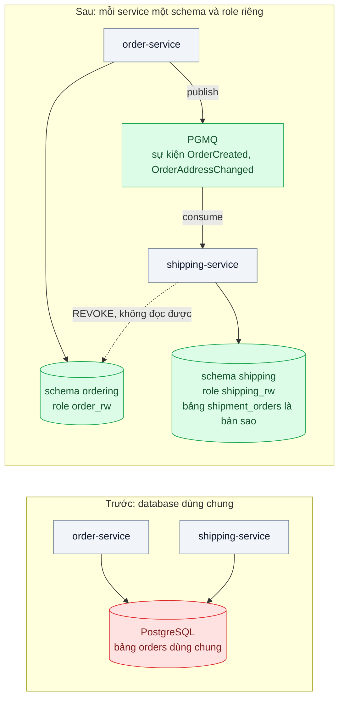
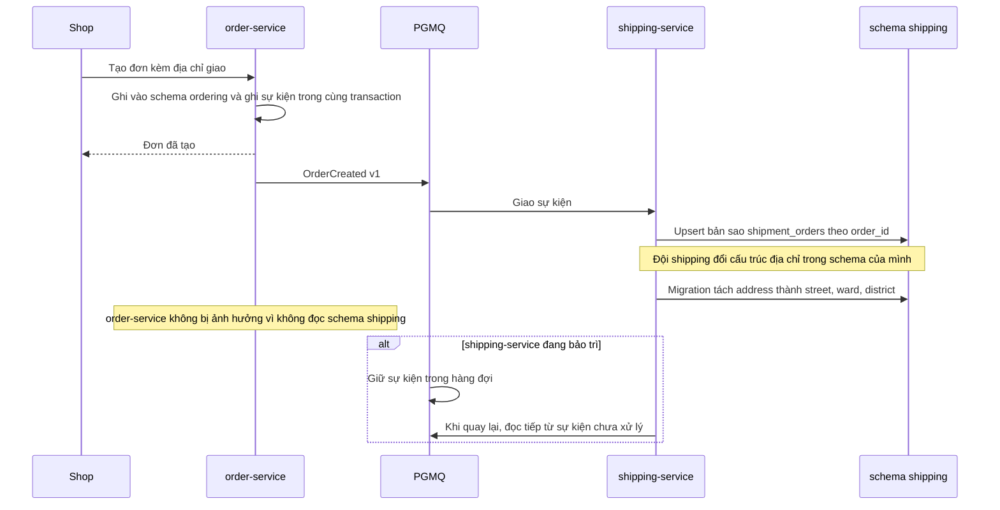

# Database per Service — Hai service cùng ghi vào một bảng, đổi schema một bên làm hỏng bên kia

| Scope | Mức độ | Trạng thái | Pattern gốc | Cập nhật |
|---|---|---|---|---|
| 07 · backend / microservices | 🟢 Cơ bản | 📋 Kế hoạch | Database per Service — Richardson, microservices.io / *Microservices Patterns* (2018); tách DB — Newman, *Monolith to Microservices* (2019) | 2026-10-06 |

> **Một câu tóm tắt:** Mỗi service sở hữu riêng dữ liệu của mình (ít nhất là schema và quyền truy cập riêng); service khác chỉ lấy dữ liệu qua API hoặc sự kiện, nên đổi cấu trúc bảng ở một bên không còn làm sập bên kia.

## 1. Bài toán thực tế (What)

**Bối cảnh** *(doanh nghiệp giả định, số liệu minh họa)*
Công ty logistics giao hàng chặng cuối, khoảng 60.000 vận đơn/ngày. Hệ thống đã tách thành `order-service` (nhận đơn từ sàn và shop) và `shipping-service` (điều phối tài xế, cập nhật trạng thái giao), nhưng cả hai vẫn đọc và ghi trực tiếp vào cùng bảng `orders` trong một database PostgreSQL dùng chung, kèm 4 bảng phụ cũng dùng chung.

**Triệu chứng người kinh doanh nhìn thấy**
- Đội shipping đổi cột `address` thành ba cột `street`, `ward`, `district` để tối ưu chia tuyến; sau khi chạy migration, `order-service` lỗi 500 trong 40 phút, shop không tạo được đơn vào giờ cao điểm.
- Báo cáo tỷ lệ giao thành công của đội shipping chạy mỗi giờ khóa bảng `orders`, thời gian tạo đơn tăng từ dưới 1 giây lên 6–8 giây đúng lúc chạy báo cáo.
- Mọi thay đổi cấu trúc dữ liệu phải họp ba đội, chờ nhau hai tuần; không ai dám xóa cột cũ nên bảng có 14 cột không còn ai dùng.

**Nguyên nhân kỹ thuật**
Database dùng chung là một kênh ghép nối ngầm: hợp đồng giữa hai service chính là cấu trúc bảng, nhưng hợp đồng đó không được khai báo, không có phiên bản, không có test. Khi một bên đổi schema, bên kia vỡ ngay lúc chạy. Tải truy vấn của hai service cũng cạnh tranh cùng khóa và cùng tài nguyên, nên báo cáo của một đội làm chậm giao dịch của đội khác.

**Ràng buộc**
- Không được dừng nhận đơn; mọi bước tách phải chạy song song với hệ đang hoạt động.
- Ngân sách hạ tầng không cho phép mỗi service một cụm database riêng ngay; chấp nhận cùng máy chủ nhưng phải cách ly được.
- Đội shipping cần một số trường của đơn hàng (mã đơn, địa chỉ, khung giờ giao) để vận hành, không thể bỏ hoàn toàn việc đọc dữ liệu đơn.

## 2. Vì sao dùng pattern này (Why)

**Nguyên nhân gốc mà pattern nhắm vào:** hai service ghép nối qua cấu trúc bảng chung — hợp đồng ngầm, không phiên bản, không kiểm tra được.

**Pattern giải quyết thế nào:** Richardson mô tả ba mức cách ly: bảng riêng cho mỗi service, schema riêng cho mỗi service, và database server riêng. Ở mọi mức, dữ liệu của một service là *riêng tư*: service khác không được truy vấn trực tiếp mà phải đi qua API của chủ sở hữu hoặc nhận bản sao qua sự kiện. Hợp đồng chuyển từ "cấu trúc bảng" sang "API và sự kiện" — thứ có thể khai báo, đánh phiên bản, test. Newman mô tả lộ trình tách database từng bước trên hệ đang chạy: tách schema, chuyển quyền sở hữu dữ liệu, đồng bộ dữ liệu trong ứng dụng, rồi mới tách máy chủ. Ở bài này chọn mức *schema riêng + role riêng* trên cùng máy chủ PostgreSQL: cách ly được quyền truy cập (bên kia không thể đọc bảng của mình) với chi phí hạ tầng bằng không, và shipping giữ một bản sao các trường cần thiết được nuôi bằng sự kiện từ order.

**Lựa chọn khác đã cân nhắc**

| Lựa chọn | Giải quyết được gì | Vì sao không chọn (ở bài này) |
|---|---|---|
| Giữ nguyên + tối ưu nhỏ (quy ước "chỉ thêm cột, không đổi cột", Expand/Contract `02` bài 08) | Giảm sự cố do đổi schema | Hợp đồng vẫn ngầm; tải báo cáo vẫn cạnh tranh với giao dịch; dựa vào kỷ luật người |
| Database View cho shipping đọc | Che cấu trúc thật của bảng `orders` | Chỉ giải quyết đọc; shipping vẫn ghi vào bảng chung; Newman coi đây là bước tạm |
| Database server riêng cho mỗi service ngay lập tức | Cách ly hoàn toàn tài nguyên và quyền | Chi phí hạ tầng và vận hành tăng ngay; chưa cần ở quy mô này, có thể nâng sau khi schema đã tách |
| Schema riêng + role riêng + bản sao qua sự kiện (chọn) | Cách ly quyền truy cập và hợp đồng; vẫn một máy chủ | Chấp nhận nhất quán cuối cho dữ liệu đơn hàng ở phía shipping |

## 3. Thiết kế hệ thống (How)

### 3.1 Kiến trúc trước và sau



### 3.2 Luồng chính



### 3.3 Thành phần và trách nhiệm

| Thành phần | Trách nhiệm | Quyết định thiết kế đáng chú ý |
|---|---|---|
| Schema `ordering` + role `order_rw` | Dữ liệu đơn hàng, chỉ `order-service` có quyền | `REVOKE ALL` với mọi role khác; test tích hợp kiểm tra bị từ chối quyền |
| Schema `shipping` + role `shipping_rw` | Vận đơn, tuyến, tài xế và bản sao `shipment_orders` | Bản sao chỉ chứa trường shipping cần; không có trường giá, thanh toán |
| Sự kiện `OrderCreated`, `OrderAddressChanged` | Hợp đồng công khai giữa hai service | Có phiên bản (`v1`), chỉ thêm trường, không đổi nghĩa trường cũ (xem `13` bài 02) |
| PGMQ | Chuyển sự kiện tin cậy, giữ lại khi consumer tắt | Nằm trong cùng Postgres nên ghi sự kiện và ghi đơn chung một transaction |
| Consumer trong `shipping-service` | Dịch sự kiện sang bản sao cục bộ, upsert theo `order_id` | Idempotent theo `order_id` và `event_id` (xem `14` bài 04) |
| API `GET /orders/:id` của order-service | Đường lấy dữ liệu đơn khi shipping cần trường ngoài bản sao | Dùng cho tra cứu lẻ, không dùng để join hàng loạt |

### 3.4 Điểm dễ sai khi triển khai
- **Tách schema nhưng vẫn cấp quyền chéo "cho tiện".** Chỉ cần một câu `GRANT SELECT` là hợp đồng ngầm quay lại. Cách tránh: quyền do migration quản lý, test tích hợp khẳng định bị từ chối.
- **Bản sao chứa quá nhiều trường.** Sao cả bảng `orders` sang shipping biến bản sao thành database dùng chung phiên bản hai. Chỉ sao trường shipping thực sự dùng.
- **Publish sự kiện ngoài transaction.** Ghi đơn xong, crash trước khi publish là mất sự kiện; đây là bài Transactional Outbox (`14` bài 03). Với PGMQ cùng database, enqueue trong cùng transaction là đủ.
- **Join chéo qua API cho báo cáo.** Báo cáo cần dữ liệu cả hai bên nên dùng bản sao hoặc kho dữ liệu báo cáo, không gọi API theo từng dòng.
- **Quên xóa cột cũ.** Sau khi shipping không còn đọc `orders.address`, phải có bước "contract" xóa cột để ngăn người sau dùng lại.

## 4. Tech stack và tác động (Impact techstack)

| Lớp | Công nghệ chọn | Vì sao chọn | Thay thế tương đương |
|---|---|---|---|
| Ngôn ngữ, ứng dụng | TypeScript strict, NestJS, hai app `order-service` và `shipping-service` | Trùng stack repo; DI tách rõ repository của mỗi service | Fastify |
| Dữ liệu | PostgreSQL 16, hai schema, hai role, hai connection string | Cách ly quyền bằng chính DB, không dựa kỷ luật người | Hai database riêng, hai máy chủ riêng |
| Truy vấn | Kysely | Type-safe theo schema từng service, lộ lỗi khi trường không tồn tại | Prisma, TypeORM |
| Sự kiện | PGMQ | Cùng Postgres nên có transaction chung với ghi đơn; không thêm hạ tầng | NATS JetStream, RabbitMQ, Kafka |
| Migration | SQL thuần theo thư mục từng service | Mỗi service tự chạy migration của schema mình | Kysely migrator |
| Hạ tầng local | Docker Compose | Một Postgres có PGMQ, hai app | — |
| Test, đo | Vitest, k6 | Vitest cho quyền và idempotency; k6 đo tạo đơn khi shipping chạy báo cáo | — |

**Thay đổi so với hệ thống hiện tại:** thêm hai schema và hai role, chuyển bảng về chủ sở hữu, thêm hàng đợi sự kiện và consumer ở shipping, thêm bản sao `shipment_orders`; đội vận hành phải theo dõi độ trễ hàng đợi (consumer lag) như một chỉ số mới và chấp nhận dữ liệu đơn ở shipping trễ vài giây.

## 5. Kết quả đầu ra và cách đo (Output impact)

| Chỉ số | Trước (minh họa) | Mục tiêu khi thực hành | Cách đo |
|---|---|---|---|
| Số bảng được hơn một service ghi | 5 | 0 | Truy vấn `information_schema.role_table_grants`, so với danh sách chủ sở hữu |
| Lỗi ở `order-service` khi shipping đổi schema | 500 trong 40 phút | 0 lỗi | Test tích hợp: chạy migration shipping trong khi k6 tạo đơn liên tục |
| p95 tạo đơn khi shipping chạy báo cáo nặng | 6.000 ms | ≤ 300 ms | k6 tạo đơn 30 request/giây, đồng thời chạy báo cáo trên schema shipping |
| Độ trễ từ tạo đơn tới khi bản sao ở shipping có dữ liệu | — | p95 ≤ 2 giây | Timestamp sự kiện so với timestamp upsert, ghi log có correlation id |
| Quyền truy cập chéo | có | bị từ chối | Test tích hợp dùng role `shipping_rw` đọc `ordering.orders`, kỳ vọng lỗi quyền |

> Số "trước" là minh họa để hình dung bài toán. Số "mục tiêu" chỉ được coi là đạt khi có số đo thật
> ở mục 8 kèm môi trường đo.

**Tác động nghiệp vụ mong đợi:** đội shipping đổi mô hình dữ liệu theo nhịp của mình mà không gây sự cố nhận đơn; báo cáo không còn làm chậm việc tạo đơn; thời gian họp phối hợp đổi schema giữa các đội giảm.

## 6. Đánh đổi và khi KHÔNG nên dùng

**Đánh đổi**
- Mất khả năng join và transaction xuyên service; truy vấn tổng hợp phải qua bản sao, API Composition (bài 05) hoặc CQRS (`02` bài 06).
- Dữ liệu nhân bản có độ trễ; phải có xử lý trùng và thứ tự sự kiện (`14` bài 04, 06).
- Nhiều schema, nhiều migration pipeline hơn để vận hành; cần quy ước đặt tên và quyền rõ ràng.

**Không nên dùng khi**
- Hai "service" thực ra luôn thay đổi cùng nhau: đó là một service bị cắt đôi, nên gộp lại (bài 01).
- Nghiệp vụ đòi tính nhất quán mạnh giữa hai tập dữ liệu trong mọi truy vấn và không chấp nhận độ trễ: giữ chung database và chung service cho phần đó.
- Đội nhỏ chưa có hạ tầng sự kiện và quan sát: chi phí vận hành bản sao vượt lợi ích.

**Liên quan**
- Đọc trước: `../01-decomposition-bounded-context-tach-service-theo-nghiep-vu/` — ranh giới đúng rồi mới tách dữ liệu.
- Đọc sau: `../../14-backend-queueing/03-transactional-outbox-ghi-don-xong-crash-mat-event/`, `../../14-backend-queueing/04-idempotent-consumer-event-den-hai-lan-tru-kho-hai-lan/`.
- Cùng chủ đề: `../../02-backend-database/08-expand-contract-doi-ten-cot-100-trieu-dong/` — đổi schema an toàn trong một service; `../05-api-composition-man-hinh-don-hang-can-du-lieu-4-service/` — ghép dữ liệu khi không còn join.

## 7. Cơ sở tham khảo

- Chris Richardson, "Pattern: Database per service", microservices.io — https://microservices.io/patterns/data/database-per-service.html — ba mức cách ly (bảng, schema, server), lợi ích và hậu quả cho truy vấn và transaction.
- Chris Richardson, *Microservices Patterns*, Manning, 2018 — chương về quản lý dữ liệu phân tán, lý do dữ liệu riêng là điều kiện để service tiến hóa độc lập.
- Sam Newman, *Monolith to Microservices*, O'Reilly, 2019 — chương "Decomposing the Database": Shared Database, Database View, Synchronize Data in Application, Split Table; lộ trình tách từng bước trên hệ đang chạy.
- PostgreSQL docs, "Schemas" và "GRANT" — https://www.postgresql.org/docs/ — cơ chế cách ly quyền dùng ở mục 3.
- PGMQ — https://github.com/pgmq/pgmq — hàng đợi trong Postgres cho sự kiện giữa hai service.

## 8. Kế hoạch thực hành

- [ ] Bước 1: dựng Postgres có PGMQ, hai NestJS app cùng ghi bảng `orders` chung; seed 100.000 đơn; viết báo cáo nặng ở shipping.
- [ ] Bước 2: đo "trước": k6 tạo đơn 30 request/giây trong khi chạy báo cáo; chạy migration đổi cột `address` ở shipping và ghi số lỗi của order-service.
- [ ] Bước 3: tạo schema `ordering`, `shipping` và hai role; chuyển bảng; thêm sự kiện `OrderCreated` qua PGMQ trong cùng transaction; viết consumer upsert `shipment_orders`; `REVOKE` quyền chéo.
- [ ] Bước 4: đo "sau" cùng kịch bản; ghi số thật và môi trường vào mục 5.
- [ ] Bước 5: test: (a) role shipping đọc schema ordering bị từ chối; (b) migration shipping không gây lỗi order; (c) sự kiện tới hai lần chỉ upsert một bản sao; (d) consumer tắt rồi mở lại vẫn nhận đủ sự kiện.

**Cấu trúc code dự kiến**
```text
apps/
  order-service/
    src/ migrations/        # schema ordering, publish sự kiện
  shipping-service/
    src/ migrations/        # schema shipping, consumer, bản sao shipment_orders
truoc/                      # hai app dùng chung bảng orders để tái hiện sự cố
test/
  cross-schema-access-denied.test.ts
  shipping-migration-does-not-break-orders.test.ts
  duplicate-event-upserts-once.test.ts
bench/orders-during-report.k6.js
docker-compose.yml
```

**Cách chạy** *(điền khi bắt đầu code)*
```bash
docker compose up -d
pnpm install && pnpm test
```
