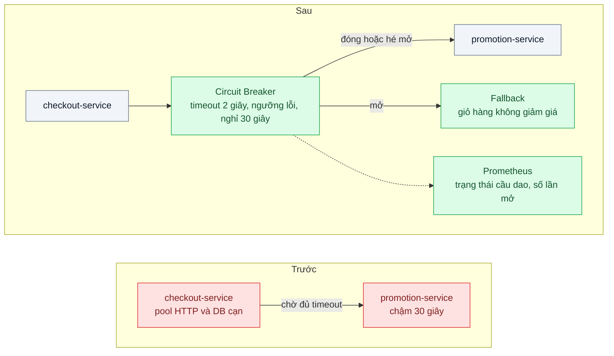
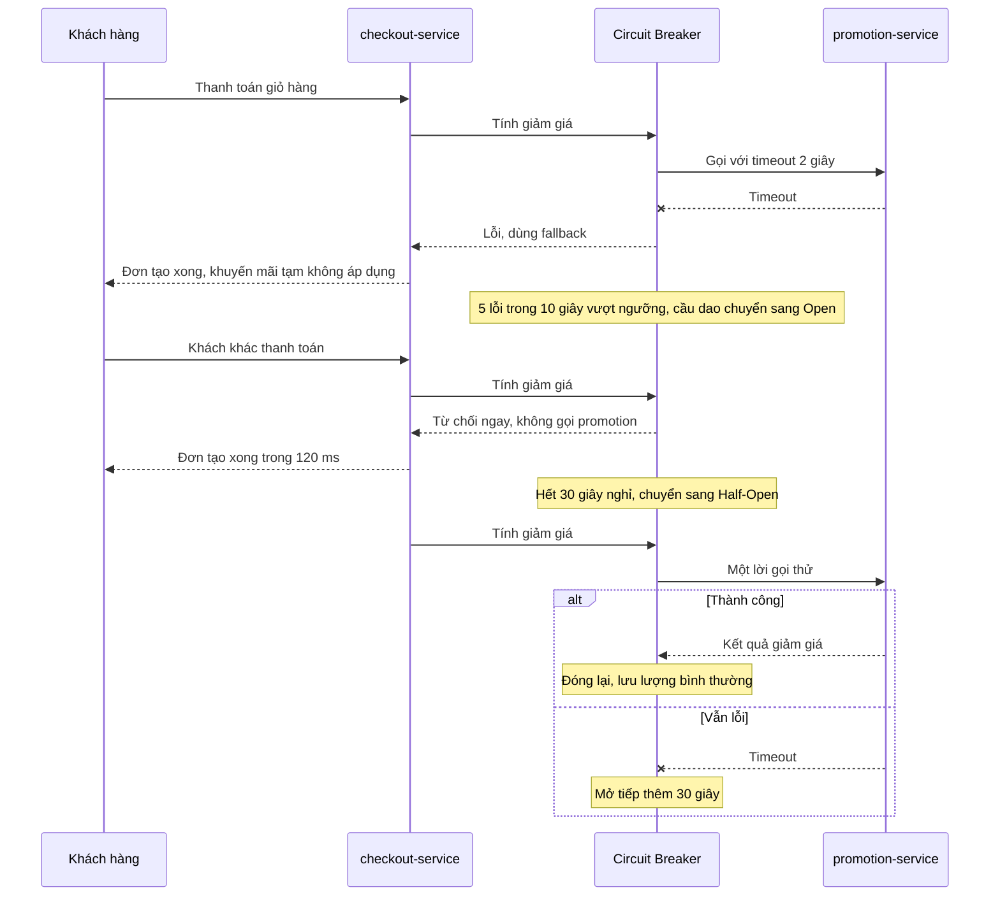
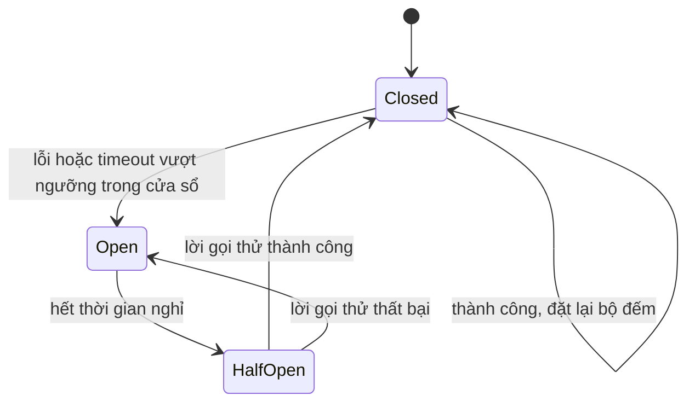

# Circuit Breaker — Service khuyến mãi chậm 30 giây kéo sập toàn bộ checkout

| Scope | Mức độ | Trạng thái | Pattern gốc | Cập nhật |
|---|---|---|---|---|
| 07 · backend / microservices | 🟡 Trung bình | 📋 Kế hoạch | Circuit Breaker — Nygard, *Release It!* (2007/2018) | 2026-10-06 |

> **Một câu tóm tắt:** Bọc lời gọi sang service khuyến mãi bằng một "cầu dao": khi lỗi hoặc timeout vượt ngưỡng, cầu dao mở và checkout trả lời ngay bằng phương án dự phòng (không giảm giá) thay vì chờ 30 giây và kéo cạn tài nguyên của chính mình.

## 1. Bài toán thực tế (What)

**Bối cảnh** *(doanh nghiệp giả định, số liệu minh họa)*
Sàn thương mại điện tử, khoảng 1.500 lượt checkout/phút giờ cao điểm. `checkout-service` gọi đồng bộ `promotion-service` để tính giảm giá cho mỗi giỏ hàng, kể cả giỏ không có mã khuyến mãi. `promotion-service` đọc PostgreSQL riêng; trong chiến dịch lớn, một truy vấn kiểm tra điều kiện mã bị chậm vì thiếu index.

**Triệu chứng người kinh doanh nhìn thấy**
- Trong 25 phút, gần như không có đơn nào hoàn tất; doanh thu buổi tối về 0 dù chỉ phần "khuyến mãi" có vấn đề.
- Khách thấy nút "Thanh toán" quay 30 giây rồi lỗi; nhiều người bấm lại, tải tăng thêm.
- Đội vận hành phải khởi động lại `checkout-service` ba lần; mỗi lần đỡ được vài phút rồi lại treo.

**Nguyên nhân kỹ thuật**
Mỗi lời gọi tới `promotion-service` chờ đủ 30 giây timeout. Ở 1.500 request/phút, số kết nối chờ trong `checkout-service` tăng tới giới hạn pool HTTP và pool database chỉ sau vài chục giây; mọi request mới — kể cả giỏ không cần khuyến mãi — xếp hàng chờ tài nguyên và cũng timeout. Lỗi ở một phụ thuộc không quan trọng lan thành lỗi toàn phần ở service quan trọng: đây là *cascading failure*, và các lời gọi liên tục đổ vào `promotion-service` còn cản nó tự hồi phục.

**Ràng buộc**
- Nghiệp vụ chấp nhận checkout tạm *không áp dụng khuyến mãi* trong vài phút, kèm thông báo rõ cho khách; không chấp nhận checkout thất bại.
- Không được sửa `promotion-service` trong bài này (đội khác sở hữu); giải pháp nằm ở phía gọi.
- Phải quan sát được trạng thái cầu dao để vận hành biết khi nào đang chạy chế độ dự phòng.

## 2. Vì sao dùng pattern này (Why)

**Nguyên nhân gốc mà pattern nhắm vào:** phía gọi tiếp tục gọi và chờ một phụ thuộc đã hỏng, tiêu hết tài nguyên của mình và không cho phụ thuộc thời gian hồi phục.

**Pattern giải quyết thế nào:** Nygard mô tả Circuit Breaker như cầu dao điện. Bình thường cầu dao *đóng* (Closed): lời gọi đi qua, bộ đếm theo dõi lỗi và timeout trong cửa sổ gần nhất. Vượt ngưỡng, cầu dao *mở* (Open): mọi lời gọi bị từ chối ngay lập tức, không tốn kết nối, không chờ; checkout dùng phương án dự phòng. Sau một khoảng nghỉ, cầu dao *hé mở* (Half-Open): cho một vài lời gọi thử đi qua; thành công thì đóng lại, thất bại thì mở tiếp. Fowler nhấn mạnh phần thường bị bỏ quên: mọi lần đổi trạng thái phải được ghi log và đo, vì cầu dao mở là tín hiệu vận hành quan trọng. Pattern luôn đi cùng timeout ngắn (bài 04): không có timeout thì không có "lỗi" để đếm.

**Lựa chọn khác đã cân nhắc**

| Lựa chọn | Giải quyết được gì | Vì sao không chọn (ở bài này) |
|---|---|---|
| Giữ nguyên + tối ưu nhỏ (thêm index ở promotion, tăng pool ở checkout) | Hết sự cố lần này | Không sửa được ở phía gọi; phụ thuộc kế tiếp chậm sẽ lặp lại đúng kịch bản; không được sửa promotion theo ràng buộc |
| Chỉ đặt timeout ngắn (2 giây) | Giảm thời gian treo mỗi request | Cần nhưng chưa đủ: mỗi request vẫn chờ 2 giây và vẫn đổ tải vào service đang hỏng |
| Retry khi lỗi | Vượt qua lỗi thoáng qua | Làm tình hình tệ hơn khi phụ thuộc đang quá tải (bài 04) |
| Bulkhead: pool riêng cho lời gọi promotion (bài 08) | Cách ly tài nguyên, checkout không cạn pool | Bổ trợ tốt; nhưng request vẫn chờ timeout, không có fail-fast và dự phòng |
| Tính khuyến mãi bất đồng bộ hoặc cache sẵn | Bỏ hẳn lời gọi đồng bộ | Thay đổi nghiệp vụ (giá hiển thị có thể lệch); để làm sau khi đã có cầu dao |
| Circuit Breaker + timeout + fallback (chọn) | Fail-fast, giữ checkout sống, cho promotion thời gian hồi phục, quan sát được | Thêm một trạng thái phải vận hành; cần chọn ngưỡng đúng |

## 3. Thiết kế hệ thống (How)

### 3.1 Kiến trúc trước và sau



### 3.2 Luồng chính



### 3.3 Vòng đời cầu dao



### 3.4 Thành phần và trách nhiệm

| Thành phần | Trách nhiệm | Quyết định thiết kế đáng chú ý |
|---|---|---|
| Circuit Breaker (một instance cho mỗi phụ thuộc) | Đếm lỗi theo cửa sổ, chuyển trạng thái, từ chối nhanh khi mở | Ngưỡng theo *tỷ lệ* lỗi kèm số request tối thiểu, tránh mở vì 1 lỗi lúc tải thấp |
| Timeout 2 giây | Biến "chậm" thành "lỗi" để cầu dao đếm được | Đặt theo p99 bình thường của promotion nhân khoảng 2–3 |
| Fallback | Trả giỏ hàng không giảm giá, gắn cờ `promotionUnavailable` | Nghiệp vụ duyệt trước; giao diện hiển thị thông báo, không im lặng |
| Metrics và log | Phơi trạng thái cầu dao, số lần mở, số lần dùng fallback | Cảnh báo khi cầu dao mở quá 2 phút hoặc tỷ lệ fallback cao |
| k6 + công cụ tiêm lỗi | Tái hiện promotion chậm 30 giây có kiểm soát | Tiêm độ trễ ở tầng mạng để không phải sửa code promotion |

### 3.5 Điểm dễ sai khi triển khai
- **Không có timeout.** Cầu dao chỉ đếm lỗi; lời gọi treo vô hạn không bao giờ thành lỗi. Timeout là điều kiện tiên quyết.
- **Ngưỡng theo số tuyệt đối.** "5 lỗi thì mở" sẽ mở nhầm lúc nửa đêm tải thấp. Dùng tỷ lệ lỗi trong cửa sổ kèm số request tối thiểu.
- **Một cầu dao cho mọi phụ thuộc.** Payment lỗi làm cầu dao của promotion mở theo. Mỗi phụ thuộc, mỗi cầu dao.
- **Fallback gọi lại chính phụ thuộc đang hỏng** hoặc gọi một phụ thuộc khác chưa được bảo vệ. Fallback phải rẻ và cục bộ.
- **Trạng thái cầu dao ở từng instance** của checkout: 10 instance là 10 cầu dao độc lập, mở không cùng lúc. Chấp nhận được, nhưng dashboard phải tổng hợp theo instance.
- **Không test chế độ Half-Open.** Lỗi hay gặp là cho quá nhiều lời gọi thử đi qua cùng lúc, tạo đợt tải mới lên service vừa hồi phục.

## 4. Tech stack và tác động (Impact techstack)

| Lớp | Công nghệ chọn | Vì sao chọn | Thay thế tương đương |
|---|---|---|---|
| Ngôn ngữ, ứng dụng | TypeScript strict, NestJS cho hai service | Trùng stack repo; interceptor của NestJS gói lời gọi gọn | Fastify |
| Circuit breaker | `opossum` | Thư viện Node.js chuyên cho pattern này: trạng thái, ngưỡng theo tỷ lệ, fallback, sự kiện để đo | `cockatiel` (có cả retry, timeout, bulkhead), tự viết khoảng 100 dòng |
| HTTP client | `undici` với timeout tường minh | Timeout headers và body tách bạch, mặc định của Node | axios |
| Tiêm lỗi | Toxiproxy | Thêm độ trễ 30 giây giữa hai container mà không sửa code promotion | `tc netem`, cờ chậm trong code promotion |
| Đo | Prometheus + `prom-client`, k6 | Gauge trạng thái cầu dao, counter số lần mở và số fallback; k6 đo p99 checkout | Grafana để vẽ |
| Hạ tầng local | Docker Compose | Dựng hai service, Toxiproxy, Prometheus | — |

**Thay đổi so với hệ thống hiện tại:** thêm một lớp bọc lời gọi ở checkout, một fallback đã được nghiệp vụ duyệt, ba metric mới và một cảnh báo; đội vận hành phải hiểu ba trạng thái cầu dao và biết đọc dashboard để trả lời "có đang chạy chế độ không khuyến mãi không".

## 5. Kết quả đầu ra và cách đo (Output impact)

| Chỉ số | Trước (minh họa) | Mục tiêu khi thực hành | Cách đo |
|---|---|---|---|
| p99 checkout khi promotion chậm 30 giây | 30.000 ms | ≤ 500 ms sau khi cầu dao mở | k6 25 request/giây trong 5 phút, Toxiproxy thêm độ trễ 30 giây ở phút thứ 1 |
| Tỷ lệ checkout thành công trong sự cố | ≈ 0 % | ≥ 99 % (ở dạng không giảm giá) | k6 `checks` theo mã trả về và cờ `promotionUnavailable` |
| Thời gian từ khi promotion hỏng tới khi cầu dao mở | không có | ≤ 10 giây | Log đổi trạng thái có timestamp, so với thời điểm bật Toxiproxy |
| Số lời gọi tới promotion trong khi cầu dao mở | 1.500/phút | chỉ lời gọi thử ở Half-Open | Counter request ở promotion, hoặc log Toxiproxy |
| Thời gian hồi phục sau khi promotion khỏe lại | phải khởi động lại checkout | ≤ 1 chu kỳ nghỉ, 30 giây | Log chuyển Half-Open sang Closed |

> Số "trước" là minh họa để hình dung bài toán. Số "mục tiêu" chỉ được coi là đạt khi có số đo thật
> ở mục 8 kèm môi trường đo.

**Tác động nghiệp vụ mong đợi:** sự cố ở khuyến mãi chỉ làm mất phần giảm giá trong vài phút thay vì mất toàn bộ doanh thu checkout; đội vận hành thấy ngay dịch vụ nào đang bị ngắt.

## 6. Đánh đổi và khi KHÔNG nên dùng

**Đánh đổi**
- Fallback là một hành vi nghiệp vụ mới (khách không được giảm giá dù có mã) — cần thỏa thuận trước và hiển thị minh bạch.
- Ngưỡng và thời gian nghỉ là tham số phải chỉnh theo thực tế; đặt sai gây mở nhầm hoặc mở quá muộn.
- Thêm trạng thái trong tiến trình; với nhiều instance, hành vi không đồng nhất tức thời.

**Không nên dùng khi**
- Phụ thuộc là *bắt buộc* và không có fallback có nghĩa (ví dụ xác nhận thanh toán): cầu dao mở chỉ đổi cách thất bại; khi đó cần bulkhead, timeout và hàng đợi hơn.
- Lời gọi hiếm (vài lần một phút): bộ đếm không đủ mẫu, cầu dao gần như vô dụng; chỉ cần timeout.
- Lỗi do chính request sai (400) chứ không do phụ thuộc hỏng: không được đếm vào ngưỡng, nếu không một client gửi sai sẽ mở cầu dao cho tất cả.

**Liên quan**
- Đọc trước: `../04-timeout-retry-backoff-jitter-retry-dong-loat-tao-bao-moi/` — timeout là tiền đề của cầu dao.
- Đọc sau: `../08-bulkhead-mot-tenant-lon-chiem-het-thread-pool/` — cách ly tài nguyên bổ trợ cho fail-fast.
- Cùng chủ đề: `../../18-backend-scale/05-load-shedding-qua-tai-thi-tu-choi-mot-phan-thay-vi-sap-het/` — từ chối có chủ đích ở phía nhận; `../../23-backend-monitoring-benchmark/06-alerting-symptom-not-cause-50-alert-moi-dem-khong-ai-doc/` — cảnh báo khi cầu dao mở.

## 7. Cơ sở tham khảo

- Michael Nygard, *Release It!*, 2nd ed., Pragmatic Bookshelf, 2018 — phần Stability Patterns: Circuit Breaker, Timeouts, Fail Fast; mô tả cascading failure và vì sao cầu dao bảo vệ cả phía gọi lẫn phía được gọi.
- Martin Fowler, "CircuitBreaker", bliki, 2014 — https://martinfowler.com/bliki/CircuitBreaker.html — ba trạng thái Closed/Open/Half-Open, ví dụ code và nhấn mạnh việc giám sát đổi trạng thái.
- Microsoft Azure Architecture Center, "Circuit Breaker pattern" — https://learn.microsoft.com/azure/architecture/patterns/circuit-breaker — các vấn đề cần cân nhắc: ngưỡng, ghi log, kiểm tra thủ công, phân loại lỗi.
- opossum — https://github.com/nodeshift/opossum — thư viện circuit breaker cho Node.js dùng ở mục 4, tài liệu tham số và sự kiện.
- Prometheus docs — https://prometheus.io/docs/ — cách phơi gauge và counter cho trạng thái cầu dao.

## 8. Kế hoạch thực hành

- [ ] Bước 1: dựng `checkout-service` gọi `promotion-service` qua Toxiproxy; Docker Compose kèm Prometheus; k6 kịch bản 25 request/giây.
- [ ] Bước 2: đo "trước": bật độ trễ 30 giây ở Toxiproxy ở phút thứ 1, ghi p99 và tỷ lệ thành công checkout trong 5 phút.
- [ ] Bước 3: bọc lời gọi bằng `opossum` với timeout 2 giây, ngưỡng tỷ lệ lỗi 50 % trên tối thiểu 10 request trong 10 giây, nghỉ 30 giây; thêm fallback và metric.
- [ ] Bước 4: đo "sau" cùng kịch bản; ghi số thật và môi trường vào mục 5; chụp dashboard trạng thái.
- [ ] Bước 5: test: (a) sau N lỗi cầu dao mở và lời gọi tiếp theo không chạm promotion; (b) hết thời gian nghỉ chỉ một lời gọi thử đi qua; (c) lỗi 400 không làm mở cầu dao; (d) fallback trả giỏ hàng có cờ `promotionUnavailable`.

**Cấu trúc code dự kiến**
```text
src/
  checkout/
    checkout.service.ts          # luồng thanh toán
    promotion.client.ts          # [PATTERN] opossum + timeout + fallback
    metrics.ts                   # gauge trạng thái, counter mở/fallback
  promotion/                     # service tối giản, có cờ làm chậm để test đơn vị
test/
  opens-after-n-failures.test.ts
  half-open-allows-single-probe.test.ts
  client-error-does-not-open-breaker.test.ts
bench/checkout-with-slow-promotion.k6.js
docker-compose.yml               # checkout, promotion, toxiproxy, prometheus
```

**Cách chạy** *(điền khi bắt đầu code)*
```bash
docker compose up -d
pnpm install && pnpm test
```
