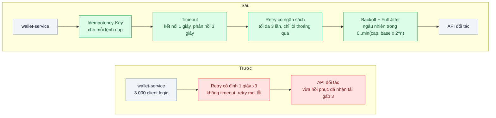
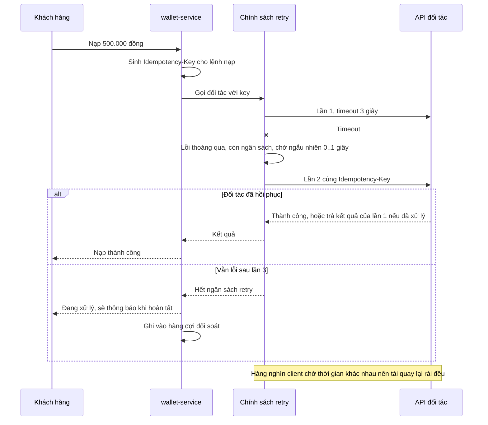

# Timeouts, Retries, Backoff with Jitter — Retry đồng loạt sau sự cố tạo cơn bão request thứ hai

| Scope | Mức độ | Trạng thái | Pattern gốc | Cập nhật |
|---|---|---|---|---|
| 07 · backend / microservices | 🟡 Trung bình | 📋 Kế hoạch | Exponential Backoff and Jitter — Marc Brooker, AWS (2015); Timeouts, retries, backoff — Amazon Builders' Library; Retry — Azure Cloud Design Patterns | 2026-10-06 |

> **Một câu tóm tắt:** Đặt timeout tường minh, chỉ retry có giới hạn cho thao tác an toàn, và giãn các lần retry theo cấp số nhân *cộng ngẫu nhiên* để hàng nghìn client không cùng gõ cửa đúng một thời điểm khi đối tác vừa hồi phục.

## 1. Bài toán thực tế (What)

**Bối cảnh** *(doanh nghiệp giả định, số liệu minh họa)*
Ví điện tử, khoảng 3.000 lượt nạp tiền/phút giờ cao điểm. `wallet-service` gọi API của đối tác ngân hàng để xác nhận nạp tiền. HTTP client dùng timeout mặc định của thư viện (không giới hạn với một số thao tác) và retry 3 lần, cách nhau cố định 1 giây, cho mọi loại lỗi.

**Triệu chứng người kinh doanh nhìn thấy**
- Đối tác ngân hàng gặp sự cố 20 giây; phía ví điện tử mất 25 phút mới hồi phục, dù đối tác đã khỏe lại từ lâu.
- Khách thấy "đang xử lý" rồi lỗi, bấm lại; tổng đài nhận 400 cuộc gọi trong một giờ về nạp tiền chưa vào ví.
- Một số giao dịch được đối tác ghi nhận hai lần vì request đầu thực ra đã thành công nhưng phản hồi về trễ, hệ thống retry và nạp lại.

**Nguyên nhân kỹ thuật**
Ba lỗi cộng dồn. (1) Không có timeout: kết nối treo giữ tài nguyên của `wallet-service` hàng chục giây. (2) Retry cố định và đồng bộ: 3.000 request thất bại cùng lúc đều retry sau đúng 1 giây, tạo một đợt tải gấp 3–4 lần bình thường đổ vào đối tác đúng lúc nó vừa hồi phục, làm nó ngã lần nữa — "cơn bão request thứ hai", lặp lại nhiều chu kỳ. (3) Retry thao tác không idempotent: cùng một lệnh nạp tiền được gửi lại mà không có khóa chống trùng.

**Ràng buộc**
- Không kiểm soát được phía đối tác; chỉ sửa được phía gọi.
- Nghiệp vụ cho phép trả "đang xử lý" và hoàn tất sau bằng đối soát, nhưng không cho phép nạp trùng.
- Độ trễ chấp nhận cho một lần nạp là 5 giây ở p99 trong điều kiện bình thường.

## 2. Vì sao dùng pattern này (Why)

**Nguyên nhân gốc mà pattern nhắm vào:** phía gọi phản ứng với sự cố theo cách *đồng bộ và không giới hạn*: chờ vô hạn, retry cùng nhịp, retry mọi thứ.

**Pattern giải quyết thế nào:** Bộ ba kỹ thuật được Amazon Builders' Library mô tả cùng nhau. *Timeout* biến "chậm vô hạn" thành lỗi có giới hạn, giải phóng tài nguyên. *Retry có giới hạn* chỉ dành cho lỗi thoáng qua và thao tác idempotent, với *ngân sách retry* để tổng lượng retry không vượt một phần nhỏ lưu lượng. *Exponential backoff* giãn các lần thử (1, 2, 4, 8 giây) để giảm tải lên phụ thuộc đang yếu; nhưng Brooker chỉ ra rằng backoff thuần vẫn làm các client thử lại *cùng thời điểm*, nên cần *jitter*: thêm ngẫu nhiên vào thời gian chờ. Phương án "Full Jitter" — chờ ngẫu nhiên trong khoảng từ 0 tới giới hạn backoff hiện tại — trong mô phỏng của Brooker giảm cả tổng số lần gọi lẫn thời gian hoàn tất so với backoff không jitter. Kết hợp với Idempotency Key (`01` bài 03) để retry thao tác ghi an toàn.

**Lựa chọn khác đã cân nhắc**

| Lựa chọn | Giải quyết được gì | Vì sao không chọn (ở bài này) |
|---|---|---|
| Giữ nguyên + tối ưu nhỏ (tăng timeout, thêm instance wallet) | Chịu được lâu hơn trước khi cạn tài nguyên | Không đổi hình dạng đợt retry; thêm instance nghĩa là bão lớn hơn |
| Bỏ hẳn retry | Hết bão retry | Lỗi thoáng qua vài phần trăm trở thành lỗi người dùng; đối tác thường có lỗi lẻ |
| Retry cố định nhanh hơn | Hồi phục nhanh với lỗi rất ngắn | Chính là nguyên nhân của bão; tệ hơn ở sự cố dài |
| Circuit Breaker (bài 03) | Ngừng gọi hẳn khi đối tác hỏng lâu | Bổ trợ, không thay thế: cầu dao không giải quyết lỗi lẻ và không giãn retry |
| Chuyển sang xử lý bất đồng bộ qua hàng đợi (`13` bài 05) | Tách người dùng khỏi độ trễ đối tác | Đổi trải nghiệm người dùng; làm sau khi đã có timeout/retry đúng ở worker |
| Timeout + retry giới hạn + backoff với jitter + idempotency (chọn) | Giải quyết đủ ba nguyên nhân với thay đổi khoanh vùng ở client | Phải chọn tham số và phân loại lỗi cẩn thận |

## 3. Thiết kế hệ thống (How)

### 3.1 Kiến trúc trước và sau



### 3.2 Luồng chính



### 3.3 Thành phần và trách nhiệm

| Thành phần | Trách nhiệm | Quyết định thiết kế đáng chú ý |
|---|---|---|
| Timeout hai lớp | Giới hạn thời gian kết nối và thời gian nhận phản hồi | Đặt theo p99 bình thường của đối tác nhân 2–3; tổng thời gian kể cả retry không vượt 5 giây theo ràng buộc |
| Bộ phân loại lỗi | Quyết định lỗi nào được retry | Retry: timeout, 503, 429 có `Retry-After`, lỗi kết nối. Không retry: 4xx khác, lỗi nghiệp vụ |
| Chính sách retry | Giới hạn số lần và ngân sách retry toàn tiến trình | Ngân sách kiểu token bucket: tổng retry không quá 10 % lưu lượng, hết thì fail-fast |
| Backoff với Full Jitter | Tính thời gian chờ mỗi lần | `sleep = random(0, min(cap, base * 2^attempt))`, base 200 ms, cap 2 giây |
| Idempotency-Key | Cho phép retry thao tác ghi mà không nạp trùng | Key sinh một lần cho mỗi lệnh nạp, gửi lại nguyên key ở mọi lần retry |
| Hàng đợi đối soát | Hoàn tất lệnh "đang xử lý" sau khi hết ngân sách | Worker hỏi trạng thái giao dịch theo key, không gửi lệnh mới |

### 3.4 Điểm dễ sai khi triển khai
- **Retry ở nhiều tầng.** Client retry 3, gateway retry 3, SDK retry 3 là 27 lần gọi cho một lỗi. Quy ước: retry ở *một* tầng, thường là tầng gần người dùng nhất có đủ ngữ cảnh.
- **Jitter "một chút".** Thêm ±100 ms không phá được sự đồng bộ. Full Jitter chọn ngẫu nhiên trên cả khoảng.
- **Retry không idempotent.** Retry lệnh nạp tiền mà không có key là nguồn nạp trùng; phía đối tác phải hỗ trợ key hoặc phải hỏi trạng thái trước khi gửi lại.
- **Timeout tổng lớn hơn timeout của người gọi mình.** Nếu API Gateway cắt ở 5 giây mà wallet retry tới 9 giây, kết quả thành công bị bỏ rơi. Timeout phải co lại theo tầng.
- **Đếm retry là thành công.** Retry che lỗi khỏi dashboard; phải có counter retry theo nguyên nhân để thấy đối tác đang yếu.
- **Retry lỗi 429 ngay.** Khi đối tác bảo "chậm lại", tôn trọng `Retry-After` thay vì tự tính backoff.

## 4. Tech stack và tác động (Impact techstack)

| Lớp | Công nghệ chọn | Vì sao chọn | Thay thế tương đương |
|---|---|---|---|
| Ngôn ngữ, ứng dụng | TypeScript strict, NestJS | Trùng stack repo | Fastify |
| Chính sách retry/timeout | `cockatiel` | Có sẵn retry với exponential backoff kèm jitter, timeout, và kết hợp chính sách; tránh tự viết sai | `p-retry` + timeout tay; tự viết khoảng 80 dòng để hiểu cơ chế |
| HTTP client | `undici` | Tách timeout kết nối, headers, body; là client chuẩn của Node | axios |
| Mô phỏng tranh chấp | Script Node mô phỏng 1.000 client, theo cách của Brooker | Cho thấy tổng số lần gọi và thời gian hoàn tất theo từng chiến lược jitter mà không cần hạ tầng | — |
| Tiêm lỗi | Toxiproxy | Tạo sự cố 20 giây có kiểm soát giữa wallet và đối tác giả | Cờ lỗi trong đối tác giả |
| Đo | k6, Prometheus + `prom-client` | k6 đo đỉnh request/giây tới đối tác và thời gian hồi phục; counter retry theo nguyên nhân | Grafana |
| Hạ tầng local | Docker Compose | wallet, đối tác giả, Toxiproxy, Prometheus | — |

**Thay đổi so với hệ thống hiện tại:** thay HTTP client có timeout và chính sách retry tập trung; thêm Idempotency-Key vào hợp đồng với đối tác; thêm hàng đợi đối soát cho lệnh chưa xác định; đội vận hành theo dõi thêm counter retry và tỷ lệ "đang xử lý".

## 5. Kết quả đầu ra và cách đo (Output impact)

| Chỉ số | Trước (minh họa) | Mục tiêu khi thực hành | Cách đo |
|---|---|---|---|
| Đỉnh request/giây tới đối tác trong 10 giây sau khi hồi phục, so với bình thường | gấp 3,5 lần | ≤ 1,3 lần | Counter request ở đối tác giả theo giây; Toxiproxy tạo sự cố 20 giây |
| Thời gian hệ thống hồi phục sau sự cố 20 giây | 25 phút | ≤ 1 phút | k6 chạy liên tục, thời điểm tỷ lệ thành công quay về ≥ 99 % |
| Request treo quá 5 giây | nhiều | 0 | Histogram độ trễ ở wallet, bucket > 5 giây |
| Tỷ lệ thành công khi đối tác lỗi lẻ 5 % | 95 % | ≥ 99,5 % | k6 với đối tác giả trả 503 ngẫu nhiên 5 % |
| Giao dịch nạp trùng | có | 0 | Test tích hợp: đối tác giả ghi lại key, đếm giao dịch theo key |
| Tổng số lần gọi trong mô phỏng 1.000 client tranh chấp | backoff không jitter | Full Jitter thấp hơn rõ, số đo thật ghi lại | Script mô phỏng in tổng lần gọi và thời gian hoàn tất theo chiến lược |

> Số "trước" là minh họa để hình dung bài toán. Số "mục tiêu" chỉ được coi là đạt khi có số đo thật
> ở mục 8 kèm môi trường đo.

**Tác động nghiệp vụ mong đợi:** sự cố ngắn của đối tác chỉ gây gián đoạn ngắn tương ứng; không còn nạp trùng; tổng đài không bị quá tải vì lỗi dây chuyền.

## 6. Đánh đổi và khi KHÔNG nên dùng

**Đánh đổi**
- Backoff làm tăng độ trễ của request bị lỗi; phải cân với ràng buộc 5 giây bằng cap và số lần retry.
- Cần đối tác hỗ trợ idempotency hoặc API hỏi trạng thái; không có thì chỉ retry được thao tác đọc.
- Nhiều tham số (timeout, base, cap, số lần, ngân sách) cần ghi tài liệu và xem lại định kỳ.

**Không nên dùng khi**
- Thao tác không idempotent và không thể hỏi lại trạng thái: retry tạo trùng, chỉ nên fail và đối soát.
- Lỗi là *xác định* (400, 401, dữ liệu sai): retry chỉ lặp lại lỗi và tốn tài nguyên.
- Phụ thuộc đang quá tải kéo dài: retry dù có jitter vẫn thêm tải; khi đó cần cầu dao (bài 03) hoặc load shedding (`18` bài 05).

**Liên quan**
- Đọc trước: `../../01-frontend-backend-transporter/03-idempotency-key-bam-thanh-toan-hai-lan/` — điều kiện để retry thao tác ghi.
- Đọc sau: `../03-circuit-breaker-service-khuyen-mai-cham-lam-sap-checkout/` — ngừng gọi khi lỗi kéo dài.
- Cùng chủ đề: `../../13-backend-transporter/05-async-request-reply-xu-ly-30-giay-http-timeout/`; `../../13-backend-transporter/04-webhook-delivery-doi-tac-down-5-phut-mat-su-kien/` — retry ở chiều ngược lại.

## 7. Cơ sở tham khảo

- Marc Brooker, "Timeouts, retries, and backoff with jitter", Amazon Builders' Library — https://aws.amazon.com/builders-library/timeouts-retries-and-backoff-with-jitter/ — bộ ba kỹ thuật, retry ở một tầng, giới hạn retry bằng token bucket.
- Marc Brooker, "Exponential Backoff And Jitter", AWS Architecture Blog, 2015 — https://aws.amazon.com/blogs/architecture/exponential-backoff-and-jitter/ — mô phỏng so sánh No Jitter, Full Jitter, Equal Jitter, Decorrelated Jitter; cơ sở cho script mô phỏng ở mục 8.
- Microsoft Azure Architecture Center, "Retry pattern" — https://learn.microsoft.com/azure/architecture/patterns/retry — phân loại lỗi nên và không nên retry, cân nhắc về idempotency.
- Amazon Builders' Library, "Making retries safe with idempotent APIs" — vì sao retry thao tác ghi cần khóa chống trùng.
- cockatiel — https://github.com/connor4312/cockatiel — thư viện chính sách retry, timeout dùng ở mục 4.
- k6 docs — https://grafana.com/docs/k6/ — kịch bản tải và `checks` dùng để đo.

## 8. Kế hoạch thực hành

- [ ] Bước 1: viết đối tác giả (Fastify) có cờ sự cố và counter request theo giây; wallet-service với HTTP client mặc định và retry cố định; Toxiproxy ở giữa; Docker Compose.
- [ ] Bước 2: đo "trước": k6 50 request/giây trong 3 phút, Toxiproxy cắt kết nối 20 giây ở phút 1; ghi đỉnh request tới đối tác sau hồi phục và thời gian hồi phục. Chạy script mô phỏng 1.000 client để có số tổng lần gọi với backoff không jitter.
- [ ] Bước 3: thay bằng `undici` có timeout, `cockatiel` retry 3 lần với Full Jitter và ngân sách; phân loại lỗi; thêm Idempotency-Key và hàng đợi đối soát.
- [ ] Bước 4: đo "sau" cùng kịch bản; ghi số thật và môi trường vào mục 5; so sánh các chiến lược jitter bằng script mô phỏng.
- [ ] Bước 5: test: (a) lỗi 400 không retry; (b) 503 retry tối đa 3 lần với thời gian chờ nằm trong khoảng kỳ vọng; (c) hai lần gửi cùng key chỉ tạo một giao dịch ở đối tác giả; (d) hết ngân sách thì trả "đang xử lý" và ghi hàng đợi đối soát.

**Cấu trúc code dự kiến**
```text
src/
  wallet/
    bank.client.ts            # [PATTERN] undici timeout + cockatiel retry/backoff/jitter
    error-classifier.ts       # lỗi nào được retry
    retry-budget.ts           # token bucket cho retry
    reconcile.worker.ts       # hỏi trạng thái theo Idempotency-Key
  fake-bank/                  # đối tác giả, ghi key, counter theo giây
sim/
  jitter-simulation.ts        # 1.000 client tranh chấp, so sánh chiến lược
test/
  400-error-not-retried.test.ts
  same-key-one-transaction.test.ts
bench/topup-during-partner-outage.k6.js
docker-compose.yml
```

**Cách chạy** *(điền khi bắt đầu code)*
```bash
docker compose up -d
pnpm install && pnpm test
```
