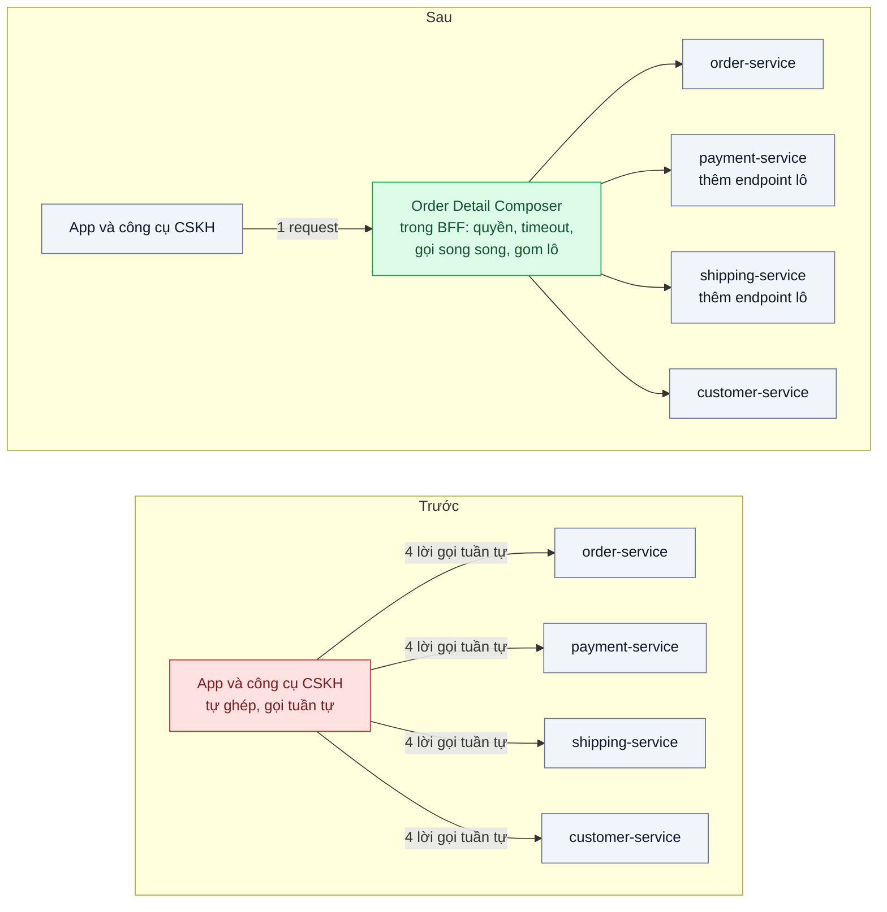
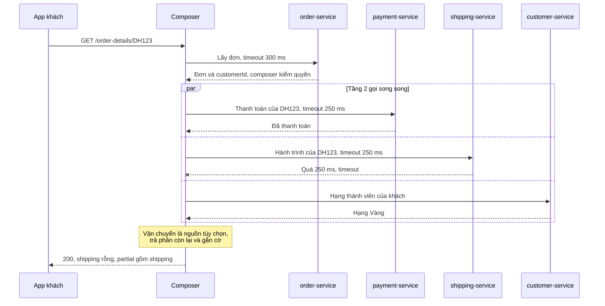

# API Composition — Màn hình chi tiết đơn cần dữ liệu từ 4 service, ghép ở đâu?

| Scope | Mức độ | Trạng thái | Pattern gốc | Cập nhật |
|---|---|---|---|---|
| 07 · backend / microservices | 🟡 Trung bình | 📋 Kế hoạch | API Composition — Richardson, microservices.io / *Microservices Patterns* (2018) | 2026-10-06 |

> **Một câu tóm tắt:** Đặt một API Composer gọi song song các service sở hữu dữ liệu (đơn, thanh toán, vận chuyển, khách hàng), mỗi lời gọi có timeout riêng, ghép kết quả trong bộ nhớ và trả phản hồi một phần khi nguồn phụ trợ lỗi — thay vì để app tự gọi bốn lần hoặc quay lại join chéo database.

## 1. Bài toán thực tế (What)

**Bối cảnh** *(doanh nghiệp giả định, số liệu minh họa)*
Sàn thương mại điện tử vừa tách hệ thống theo bài 01–02 thành `order-service`, `payment-service`, `shipping-service`, `customer-service`, mỗi service có dữ liệu riêng. Màn hình "Chi tiết đơn" trên app khách và trên công cụ chăm sóc khách hàng (CSKH) cần cùng lúc: thông tin đơn và dòng hàng, trạng thái thanh toán, hành trình giao hàng, hạng thành viên. Giờ cao điểm có khoảng 300 lượt mở màn hình mỗi phút.

**Triệu chứng người kinh doanh nhìn thấy**
- App di động gọi lần lượt 4 API, trên 4G mất 2–3 giây mới hiện đủ; nhân viên CSKH để khách chờ máy trong lúc màn hình tải.
- Mỗi lần `shipping-service` deploy, cả màn hình trắng vì app coi một lỗi là lỗi toàn trang; khách gọi tổng đài hỏi "đơn của tôi mất rồi à".
- Màn hình danh sách 20 đơn gửi 61 request (1 lấy danh sách + 3 lời gọi cho mỗi đơn).
- Web, mobile và công cụ CSKH tự ghép theo cách riêng; cùng một đơn có lúc hiện "đã thanh toán" ở web nhưng "chờ thanh toán" ở app.

**Nguyên nhân kỹ thuật**
Sau khi tách dữ liệu, câu JOIN cũ không còn; logic ghép bị đẩy ra client. Client gọi tuần tự vì lời gọi sau cần `customerId` từ lời gọi trước, không có timeout riêng cho từng nguồn, không có quy tắc "nguồn nào lỗi thì vẫn hiển thị được". Màn hình danh sách gọi provider theo từng phần tử — N+1 phiên bản xuyên service.

**Ràng buộc**
- Không đọc chéo database của service khác (giữ nguyên quyết định ở bài 02); quyền xem đơn kiểm ở một chỗ thống nhất.
- Trạng thái thanh toán phải là dữ liệu mới nhất vì CSKH dùng nó để trả lời khách; không chấp nhận trễ vài phút.
- Khách chỉ xem đơn của mình, CSKH xem mọi đơn; mục tiêu p95 phía server ≤ 400 ms (minh họa).

## 2. Vì sao dùng pattern này (Why)

**Nguyên nhân gốc mà pattern nhắm vào:** dữ liệu của một màn hình nằm ở nhiều service và không có thành phần nào chịu trách nhiệm ghép nó lại một cách nhất quán.

**Pattern giải quyết thế nào:** Richardson mô tả API Composition gồm một *API composer* gọi các *provider service* — những service sở hữu dữ liệu — rồi thực hiện *in-memory join*. Composer có thể nằm ở API gateway, trong BFF hoặc là một service riêng. Lời gọi không phụ thuộc nhau được gửi song song; lời gọi phụ thuộc được xếp theo tầng: tầng 1 lấy đơn (có `customerId`), tầng 2 gọi song song thanh toán, vận chuyển, khách hàng. Độ trễ khi đó xấp xỉ "đơn + nguồn chậm nhất ở tầng 2" thay vì tổng bốn lời gọi. Azure gọi cùng ý tưởng ở tầng gateway là *Gateway Aggregation*: giảm số lượt client nói chuyện với backend. Mỗi nguồn được phân loại *bắt buộc* (đơn lỗi thì cả màn hình lỗi) hoặc *tùy chọn* (vận chuyển lỗi thì trả phần còn lại kèm cờ). Với màn hình danh sách, provider cung cấp endpoint lô (`?orderIds=`) và composer gom lô để tránh N+1.

**Lựa chọn khác đã cân nhắc**

| Lựa chọn | Giải quyết được gì | Vì sao không chọn (ở bài này) |
|---|---|---|
| Giữ nguyên + tối ưu nhỏ (client gọi song song 4 API) | Giảm thời gian chờ trên web | Vẫn 4 round-trip trên mạng di động; logic ghép, quyền và xử lý lỗi lặp lại ở 3 client |
| Đọc chéo database bằng view join sang schema service khác | Một câu SQL, nhanh | Phá Database per Service; đổi schema một bên làm hỏng màn hình (đúng triệu chứng bài 02) |
| CQRS: bảng đọc tổng hợp cập nhật qua event | Đọc nhanh, lọc và sắp xếp xuyên service được | Dữ liệu trễ theo event trong khi thanh toán phải mới; thêm consumer, bảng, quy trình dựng lại — để dành cho màn hình tìm kiếm và báo cáo |
| API Composition trong BFF (chọn) | Một round-trip, ghép nhất quán, xử lý lỗi và quyền ở một chỗ, dữ liệu luôn mới | Thêm một thành phần phải vận hành; độ trễ phụ thuộc nguồn chậm nhất; lọc xuyên service kém |

## 3. Thiết kế hệ thống (How)

### 3.1 Kiến trúc trước và sau



### 3.2 Luồng chính



### 3.3 Thành phần và trách nhiệm

| Thành phần | Trách nhiệm | Quyết định thiết kế đáng chú ý |
|---|---|---|
| Order Detail Composer (trong BFF) | Gọi provider theo đồ thị phụ thuộc, ghép, đổi hình dạng cho từng client | Chỉ ghép và đổi hình dạng; quy tắc nghiệp vụ nằm ở provider |
| Bảng phân loại nguồn | Khai báo nguồn bắt buộc / tùy chọn và timeout từng nguồn | Timeout theo p99 bình thường của từng provider, không dùng một timeout chung |
| Endpoint lô ở provider + bộ gom lô | `GET /payments?orderIds=...`; composer gom yêu cầu cùng tick thành một lời gọi | Giới hạn kích thước lô (ví dụ 50); cache theo request, không cache chéo người dùng |
| Lớp phân quyền | Kiểm khách có quyền xem đơn trước khi gọi tầng 2 | Provider vẫn kiểm token dịch vụ; không tin tuyệt đối composer |
| Correlation id và metrics | Gắn một id cho mọi lời gọi xuống provider; histogram từng nguồn | Cho thấy nguồn nào đang kéo dài p95 màn hình |

### 3.4 Điểm dễ sai khi triển khai
- **`await` lần lượt trong composer.** Độ trễ cộng dồn y như client cũ. Vẽ đồ thị phụ thuộc trước, chỉ tuần tự ở chỗ thật sự cần dữ liệu của bước trước.
- **Dùng `Promise.all` thay vì `Promise.allSettled`.** Một nguồn tùy chọn lỗi làm hỏng cả phản hồi — đúng triệu chứng màn hình trắng.
- **Không có timeout từng nguồn.** Composer treo theo service chậm nhất và kéo cạn kết nối của chính mình; kết hợp bài 04 và bài 03.
- **N+1 ở màn hình danh sách.** Composer gọi provider cho từng đơn; phải có endpoint lô và bộ gom lô.
- **Composer phình thành "service thần".** Khi composer bắt đầu tự suy ra trạng thái đơn từ thanh toán và vận chuyển, nó đã giữ quy tắc nghiệp vụ; trả quy tắc đó về provider sở hữu.

## 4. Tech stack và tác động (Impact techstack)

| Lớp | Công nghệ chọn | Vì sao chọn | Thay thế tương đương |
|---|---|---|---|
| Ngôn ngữ, ứng dụng | TypeScript strict, NestJS cho BFF; 4 provider tối giản | Trùng stack repo; module của NestJS tách composer theo màn hình | Fastify |
| HTTP client | `undici` với `AbortSignal.timeout()` cho từng lời gọi | Timeout tường minh theo nguồn, không phụ thuộc thư viện ngoài | axios, got |
| Song song và lỗi một phần | `Promise.allSettled` + kiểu kết quả `{ data, partial }` | Type ép người viết xử lý từng nguồn lỗi | `cockatiel` (timeout + fallback) |
| Gom lô | `dataloader` | Gom yêu cầu cùng tick thành một lời gọi lô, có cache theo request | Tự viết gom lô theo id |
| Dữ liệu | PostgreSQL 16, 4 schema và 4 role như bài 02 | Tái hiện dữ liệu riêng từng service trên một máy | 4 database riêng |
| Tiêm lỗi, hạ tầng local | Toxiproxy trước `shipping-service`, tất cả trong Docker Compose | Tạo chậm và timeout có kiểm soát mà không sửa code; một lệnh dựng môi trường | Cờ làm chậm trong service |
| Đo | k6, Prometheus + `prom-client`, log có correlation id | Histogram theo nguồn; đếm request xuống provider | OpenTelemetry + Jaeger |

**Thay đổi so với hệ thống hiện tại:** thêm một module composer trong BFF, thêm endpoint lô ở hai provider, chuyển logic ghép khỏi ba client; client phải hiểu trường `partial` để hiển thị trạng thái "đang cập nhật" thay vì lỗi toàn trang; đội vận hành theo dõi thêm histogram độ trễ theo từng nguồn.

## 5. Kết quả đầu ra và cách đo (Output impact)

| Chỉ số | Trước (minh họa) | Mục tiêu khi thực hành | Cách đo |
|---|---|---|---|
| Số round-trip từ app cho màn hình chi tiết | 4, tuần tự | 1 | Đếm request theo correlation id trong log BFF |
| p95 phía server màn hình chi tiết | 900 ms (tổng 4 lời gọi) | ≤ 400 ms | k6 30 request/giây trong 5 phút, histogram Prometheus |
| Tỷ lệ màn hình hiển thị được khi shipping lỗi | 0 % | ≥ 99 % ở dạng phản hồi một phần | k6 `checks` theo mã 200 và trường `partial`; Toxiproxy làm shipping timeout |
| Số request xuống provider cho danh sách 20 đơn | 61 | ≤ 4 (1 danh sách + 3 lô) | Counter request ở từng provider |

> Số "trước" là minh họa để hình dung bài toán. Số "mục tiêu" chỉ được coi là đạt khi có số đo thật
> ở mục 8 kèm môi trường đo.

**Tác động nghiệp vụ mong đợi:** CSKH trả lời khách nhanh hơn vì màn hình hiện đủ trong một lượt; sự cố ở dịch vụ vận chuyển chỉ làm mờ một ô thông tin thay vì khiến khách nghĩ đơn đã mất.

## 6. Đánh đổi và khi KHÔNG nên dùng

**Đánh đổi**
- Composer là thêm một thành phần phải deploy và giám sát; composer down thì màn hình down. Độ trễ bị chặn dưới bởi nguồn chậm nhất; khả dụng của màn hình là tích khả dụng các nguồn bắt buộc.
- Các nguồn được đọc ở những thời điểm hơi khác nhau, không có ảnh chụp nhất quán như một transaction; client phải hiểu phản hồi một phần — một hợp đồng API mới.

**Không nên dùng khi**
- Màn hình cần lọc, sắp xếp, phân trang theo trường của nhiều service: dùng bảng đọc CQRS.
- Dữ liệu vẫn nằm chung một service và một database: một câu JOIN đơn giản và nhanh hơn.
- Báo cáo khối lượng lớn: kéo hàng nghìn bản ghi qua HTTP để join trong RAM là sai công cụ; dùng reporting database.

**Liên quan**
- Đọc trước: `../02-database-per-service-hai-service-cung-sua-mot-bang/` — vì sao không còn JOIN. Nơi đặt composer: `../../01-frontend-backend-transporter/04-bff-web-mobile-can-du-lieu-khac-nhau/`, `../../01-frontend-backend-transporter/05-api-gateway-mobile-goi-bay-service/`.
- Phương án so sánh: `../../02-backend-database/06-cqrs-man-hinh-tong-hop-join-9-bang/`.
- Bảo vệ lời gọi xuống provider: `../04-timeout-retry-backoff-jitter-retry-dong-loat-tao-bao-moi/`, `../03-circuit-breaker-service-khuyen-mai-cham-lam-sap-checkout/`; tìm nguồn chậm: `../../23-backend-monitoring-benchmark/03-distributed-tracing-otel-request-qua-6-service-cham-o-dau/`.

## 7. Cơ sở tham khảo

- Chris Richardson, "Pattern: API Composition", microservices.io — https://microservices.io/patterns/data/api-composition.html — định nghĩa composer, provider, in-memory join và các hạn chế (độ trễ, khả dụng, thiếu nhất quán giao dịch).
- Chris Richardson, *Microservices Patterns*, Manning, 2018 — chương về truy vấn trong kiến trúc microservices: khi nào API Composition đủ, khi nào phải chuyển sang CQRS.
- Microsoft Azure Architecture Center, "Gateway Aggregation pattern" — https://learn.microsoft.com/azure/architecture/patterns/gateway-aggregation — gom nhiều lời gọi backend thành một ở gateway, cân nhắc timeout và phản hồi một phần.
- Sam Newman, "Pattern: Backends For Frontends", 2015 — https://samnewman.io/patterns/architectural/bff/ — lý do đặt composer theo từng loại client.
- DataLoader — https://github.com/graphql/dataloader — cơ chế gom lô và cache theo request dùng cho màn hình danh sách.

## 8. Kế hoạch thực hành

- [ ] Bước 1: dựng 4 provider tối giản (mỗi service một schema, seed 10.000 đơn) và client giả lập gọi tuần tự 4 API; Toxiproxy đặt trước `shipping-service`.
- [ ] Bước 2: đo "trước": k6 30 request/giây cho luồng gọi tuần tự, ghi p95, số request cho danh sách 20 đơn, tỷ lệ thành công khi shipping timeout.
- [ ] Bước 3: viết composer trong BFF: tầng 1 lấy đơn, kiểm quyền, tầng 2 `Promise.allSettled` có timeout từng nguồn; thêm endpoint lô ở payment, shipping và `dataloader` cho danh sách.
- [ ] Bước 4: đo "sau" cùng kịch bản, ghi số thật và môi trường vào mục 5.
- [ ] Bước 5: test: (a) shipping timeout vẫn trả 200 kèm `partial`; (b) order lỗi trả lỗi toàn phần; (c) danh sách 20 đơn chỉ tạo đúng 1 lời gọi lô mỗi provider; (d) khách A không xem được đơn của khách B qua composer.

**Cấu trúc code dự kiến**
```text
src/
  bff/
    order-detail.composer.ts     # [PATTERN] đồ thị phụ thuộc, allSettled, partial
    provider-clients.ts          # undici + timeout từng nguồn
    batch-loaders.ts             # dataloader cho màn hình danh sách
  providers/                     # order, payment, shipping, customer tối giản
test/
  shipping-timeout-returns-partial.test.ts
  order-failure-fails-whole-response.test.ts
  list-uses-one-batch-call-per-provider.test.ts
bench/order-detail.k6.js
docker-compose.yml               # postgres, toxiproxy, bff, 4 provider
```

**Cách chạy** *(điền khi bắt đầu code)*
```bash
docker compose up -d
pnpm install && pnpm test
```
