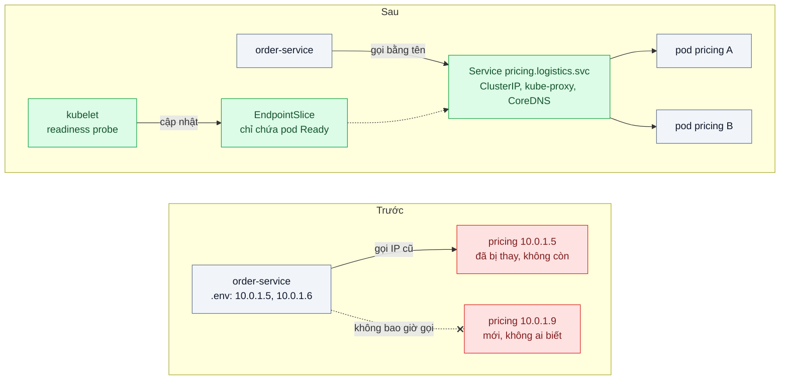
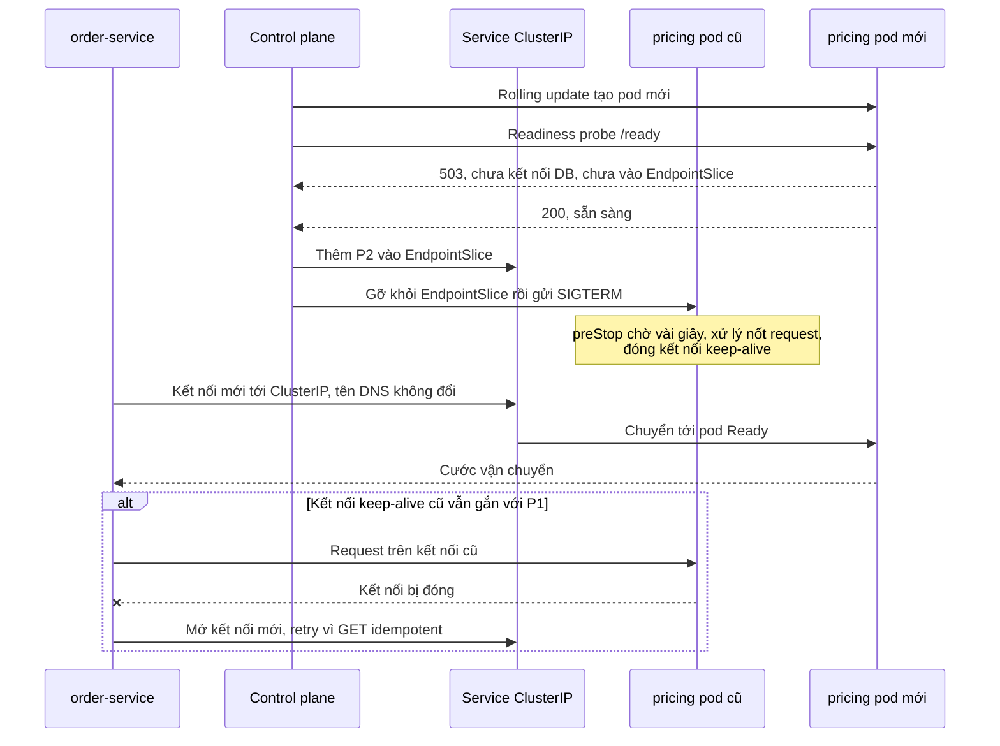

# Service Discovery — Service deploy lại đổi IP, các service khác gọi vào địa chỉ cũ

| Scope | Mức độ | Trạng thái | Pattern gốc | Cập nhật |
|---|---|---|---|---|
| 07 · backend / microservices | 🟡 Trung bình | 📋 Kế hoạch | Service Registry, Client-side / Server-side Discovery — Richardson, microservices.io | 2026-10-06 |

> **Một câu tóm tắt:** Thay danh sách IP cứng trong file cấu hình bằng cơ chế discovery: instance được đăng ký và gỡ tự động theo health check, phía gọi dùng một tên ổn định (Kubernetes Service DNS) — để deploy và scale không còn cần ai sửa cấu hình bằng tay.

## 1. Bài toán thực tế (What)

**Bối cảnh** *(doanh nghiệp giả định, số liệu minh họa)*
Công ty logistics có 9 service chạy bằng Docker trên máy ảo, deploy bằng script. `order-service` gọi `pricing-service` (tính cước) và `tracking-service` qua danh sách IP ghi trong `.env`. Mỗi tuần 10–15 lần deploy; mùa cao điểm cuối năm thêm máy ảo cho `tracking-service`. Công ty đang chuyển dần sang Kubernetes.

**Triệu chứng người kinh doanh nhìn thấy**
- Sau mỗi lần deploy `pricing-service`, 3–5 phút đơn mới báo "không tính được cước" cho tới khi có người sửa IP và khởi động lại phía gọi; vì vậy deploy phải làm ngoài giờ và cần hai người.
- Thêm 2 máy cho `tracking-service` mùa cao điểm nhưng máy mới không nhận request nào vì không ai cập nhật danh sách ở phía gọi.
- Một máy chết lúc 2 giờ sáng, phía gọi vẫn chia request vào nó: cứ 3 request có 1 lỗi cho tới khi trực ca thức dậy.

**Nguyên nhân kỹ thuật**
Vị trí mạng (IP:port) của instance là động — đổi khi deploy, scale, hỏng — nhưng phía gọi coi nó là cấu hình tĩnh. Không có nguồn sự thật về "instance nào đang sống và sẵn sàng". Thêm một lớp khó thấy: kết nối HTTP keep-alive và cache DNS phía client tiếp tục trỏ vào instance cũ ngay cả khi địa chỉ đã được cập nhật ở nơi khác.

**Ràng buộc**
- Không sửa code nghiệp vụ của từng service; chỉ đổi cách phân giải địa chỉ, health endpoint và cấu hình.
- Instance đang khởi động hoặc đang tắt không được nhận request.
- Trong giai đoạn chuyển đổi, vài service còn chạy trên máy ảo nhưng phía gọi phải dùng chung một kiểu tên.
- Đội vận hành 4 người, không muốn vận hành thêm một cụm registry riêng nếu nền tảng đã có sẵn.

## 2. Vì sao dùng pattern này (Why)

**Nguyên nhân gốc mà pattern nhắm vào:** phía gọi tự giữ thông tin vị trí của phía được gọi, trong khi thông tin đó thay đổi liên tục và chỉ nền tảng triển khai mới biết chính xác.

**Pattern giải quyết thế nào:** microservices.io tách bài toán thành hai nửa. *Service Registry* là cơ sở dữ liệu các instance đang sống; instance được đưa vào bằng *self registration* (tự đăng ký và gửi heartbeat) hoặc *3rd party registration* (nền tảng đăng ký thay, dựa trên health check). Phía gọi tìm instance bằng *client-side discovery* (hỏi registry rồi tự cân bằng tải) hoặc *server-side discovery* (gọi một địa chỉ ổn định, router tra registry thay). Kubernetes có sẵn cả hai nửa: EndpointSlice là registry, kubelet cùng readiness probe là đăng ký bên thứ ba, Service ClusterIP với kube-proxy là server-side discovery, CoreDNS cấp tên ổn định `pricing.logistics.svc.cluster.local`; headless Service trả thẳng danh sách IP pod cho client-side discovery khi cần (kết nối HTTP/2, gRPC lâu dài).

**Lựa chọn khác đã cân nhắc**

| Lựa chọn | Giải quyết được gì | Vì sao không chọn (ở bài này) |
|---|---|---|
| Giữ nguyên + tối ưu nhỏ (script deploy tự sửa `.env` và khởi động lại phía gọi) | Bớt thao tác tay | Khởi động lại dây chuyền mỗi lần deploy; vẫn không phát hiện instance chết |
| Load balancer cố định (NGINX) trước mỗi service | Một địa chỉ ổn định cho phía gọi | Vẫn phải cập nhật upstream khi đổi; tự cấu hình health check; thêm một hop |
| Registry riêng (Consul) + client-side discovery | Chạy cả máy ảo lẫn container, health check phong phú | Thêm một cụm phải vận hành; dư thừa khi đã lên Kubernetes — giữ làm phương án cho phần còn ở máy ảo |
| Kubernetes Service + DNS + readiness probe (chọn) | Đăng ký và gỡ tự động theo probe, tên ổn định, cân bằng tải sẵn | Chỉ trong cluster; kết nối lâu dài cần xử lý riêng; probe phải viết đúng |

## 3. Thiết kế hệ thống (How)

### 3.1 Kiến trúc trước và sau



### 3.2 Luồng chính



### 3.3 Thành phần và trách nhiệm

| Thành phần | Trách nhiệm | Quyết định thiết kế đáng chú ý |
|---|---|---|
| EndpointSlice (registry) | Danh sách IP pod đang Ready của mỗi Service | Không ai sửa tay; nguồn sự thật do control plane giữ |
| kubelet + readiness probe | Đăng ký bên thứ ba: chỉ đưa pod vào khi `/ready` trả 200 | `/ready` kiểm kết nối DB của chính service, không kiểm phụ thuộc downstream |
| Service ClusterIP + kube-proxy + CoreDNS | Server-side discovery: một tên DNS và một IP ảo, chia kết nối tới pod Ready | Phía gọi chỉ biết tên; cân bằng theo *kết nối*, không theo request |
| Headless Service | Trả danh sách IP pod cho client-side discovery | Dùng cho kết nối HTTP/2 lâu dài cần cân bằng theo request |
| preStop + `terminationGracePeriodSeconds` | Gỡ êm: chờ EndpointSlice lan tới mọi node trước khi tắt | Phối hợp với graceful shutdown ở ứng dụng |

### 3.4 Điểm dễ sai khi triển khai
- **Readiness kiểm quá ít hoặc quá nhiều.** Chỉ trả 200 khi process sống thì pod nhận traffic trước khi kết nối DB; kiểm cả phụ thuộc downstream thì một phụ thuộc chậm làm mọi pod bị gỡ cùng lúc.
- **Gộp liveness với readiness.** Liveness fail thì pod bị khởi động lại; dùng nhầm sẽ biến "tạm quá tải" thành "khởi động lại dây chuyền".
- **Không có preStop.** Pod tắt ngay khi nhận SIGTERM, trước khi mọi node cập nhật EndpointSlice: vài giây request rơi vào pod đã chết.
- **Kết nối lâu dài.** kube-proxy chia theo kết nối, nên pod mới scale ra không nhận tải từ client đang giữ keep-alive hay HTTP/2; giới hạn tuổi kết nối, dùng headless Service với cân bằng phía client, hoặc dùng mesh.
- **Cache DNS ở thư viện.** `dns.lookup` của Node.js dùng bộ phân giải hệ điều hành mỗi lần gọi, nhưng một số thư viện hoặc agent tự cache; kiểm tra trước khi tin rằng "DNS đã đổi".

## 4. Tech stack và tác động (Impact techstack)

| Lớp | Công nghệ chọn | Vì sao chọn | Thay thế tương đương |
|---|---|---|---|
| Nền tảng | Kubernetes chạy local bằng kind hoặc k3d | Registry, đăng ký theo probe, Service, DNS có sẵn — không thêm cụm riêng | Nomad + Consul |
| Ứng dụng | TypeScript strict, Fastify cho `order-service` và `pricing-service` tối giản | Bài nhỏ, chỉ cần health endpoint và một API | NestJS + `@nestjs/terminus` |
| HTTP client | `undici` Agent, giới hạn thời gian giữ kết nối idle (tùy chọn cụ thể cần xác minh) | Giúp pod mới nhận tải khi client giữ keep-alive | `http.Agent` của Node |
| Phần còn ở máy ảo | Service không selector + EndpointSlice khai báo tay | Phía gọi dùng cùng kiểu tên DNS trong giai đoạn chuyển đổi | Consul + consul-k8s |
| Tải và sự cố | k6 chạy liên tục trong lúc `kubectl rollout restart`, scale, làm readiness fail bằng cờ | Đo lỗi đúng lúc deploy và khi pod hỏng | Chaos Mesh |
| Đo | Prometheus + `prom-client`, log có correlation id và IP pod đích | Thấy phân bố request trên pod và lỗi theo thời điểm | Metrics của Linkerd hoặc Istio |

**Thay đổi so với hệ thống hiện tại:** mỗi service có `/ready` và `/live` tách biệt, preStop và graceful shutdown; mọi cấu hình địa chỉ đổi sang tên Service; script deploy không còn bước sửa `.env`. Đội vận hành phải học đọc EndpointSlice và trạng thái probe khi điều tra "vì sao pod không nhận traffic".

## 5. Kết quả đầu ra và cách đo (Output impact)

| Chỉ số | Trước (minh họa) | Mục tiêu khi thực hành | Cách đo |
|---|---|---|---|
| Số request 5xx trong một lần deploy | 3–5 phút lỗi liên tục | 0 trong lúc `rollout restart` | k6 20 request/giây liên tục, đếm mã lỗi theo thời điểm |
| Thời gian từ khi instance hỏng tới khi ngừng nhận request | tới khi có người sửa | ≤ `periodSeconds × failureThreshold` của probe | Bật cờ làm `/ready` trả 503, so thời điểm với request cuối trong log pod |
| Thời gian pod mới bắt đầu nhận tải sau khi scale | không bao giờ | ≤ 30 giây sau khi Ready | Counter request theo IP pod trong Prometheus |
| Chênh lệch tải giữa các pod khi client dùng keep-alive | — | ≤ 20 % sau 5 phút | Counter request theo pod, so trước/sau khi giới hạn tuổi kết nối |
| Thao tác tay mỗi lần deploy | 2 người, sửa nhiều file | 0 | Đếm bước trong runbook deploy |

> Số "trước" là minh họa để hình dung bài toán. Số "mục tiêu" chỉ được coi là đạt khi có số đo thật
> ở mục 8 kèm môi trường đo.

**Tác động nghiệp vụ mong đợi:** deploy trong giờ hành chính không làm gián đoạn tính cước; máy thêm vào mùa cao điểm gánh tải ngay; một instance hỏng ban đêm không còn làm lỗi một phần ba đơn.

## 6. Đánh đổi và khi KHÔNG nên dùng

**Đánh đổi**
- Phụ thuộc vào control plane và DNS của cluster; CoreDNS quá tải thì mọi lời gọi chậm theo. Thêm lớp mạng ảo (kube-proxy với iptables hoặc IPVS) — gỡ rối khó hơn gọi IP trực tiếp.
- Probe cấu hình sai có thể gỡ hàng loạt pod cùng lúc — một chế độ lỗi mới.

**Không nên dùng khi**
- Vài service cố định trên vài máy hiếm khi đổi: DNS nội bộ hoặc load balancer tĩnh là đủ.
- Chưa có nền tảng điều phối: dựng Consul hay Eureka chỉ để thay một file `.env` cho ba service là quá tay.
- Gọi ra đối tác bên ngoài: discovery nội bộ không áp dụng; dùng DNS công khai, timeout và retry.

**Liên quan**
- Đọc cùng: `../../16-backend-k8s/01-probes-rolling-update-deploy-moi-nhan-traffic-khi-chua-san-sang/`, `../../16-backend-k8s/02-graceful-shutdown-prestop-deploy-lam-rot-request-dang-xu-ly/`.
- Cách khác để "tìm nhau": `../../13-backend-transporter/06-nats-request-reply-moleculer-transporter-service-goi-nhau-qua-broker/`; cân bằng theo request cho kết nối lâu dài: `../../13-backend-transporter/07-service-mesh-mtls-retry-tracing-khong-sua-code/`; thuật toán chia tải: `../../18-backend-scale/03-load-balancing-mot-server-qua-tai-cac-server-khac-ranh/`.

## 7. Cơ sở tham khảo

- Chris Richardson, "Pattern: Service registry", microservices.io — https://microservices.io/patterns/service-registry.html — registry, self registration và 3rd party registration.
- Chris Richardson, "Pattern: Client-side service discovery" — https://microservices.io/patterns/client-side-discovery.html — và "Pattern: Server-side service discovery" — https://microservices.io/patterns/server-side-discovery.html — hai cách tìm instance và đánh đổi của mỗi cách.
- Kubernetes docs, "Service" — https://kubernetes.io/docs/concepts/services-networking/service/ — ClusterIP, headless Service, Service không selector, EndpointSlice.
- Kubernetes docs, "DNS for Services and Pods" — https://kubernetes.io/docs/concepts/services-networking/dns-pod-service/ — quy tắc đặt tên DNS ổn định trong cluster.
- Kubernetes docs, "Configure Liveness, Readiness and Startup Probes" — https://kubernetes.io/docs/tasks/configure-pod-container/configure-liveness-readiness-startup-probes/ — pod chỉ nhận traffic khi Ready.
- Node.js docs, module `dns` — https://nodejs.org/api/dns.html — khác biệt giữa `dns.lookup` và `dns.resolve`, lưu ý khi triển khai.

## 8. Kế hoạch thực hành

- [ ] Bước 1: phiên bản "trước" bằng Docker Compose (IP tĩnh qua `ipv4_address`): `order-service` gọi 2 `pricing-service` qua IP ghi trong `.env`; script "deploy" tạo lại container với IP mới.
- [ ] Bước 2: đo "trước": k6 20 request/giây trong lúc deploy, thêm instance và tắt một instance; ghi số lỗi và thời gian.
- [ ] Bước 3: chuyển lên kind: Deployment có readiness, liveness, preStop; Service ClusterIP và headless; `order-service` gọi qua tên DNS; EndpointSlice cho service giả lập còn ở máy ảo.
- [ ] Bước 4: đo "sau": k6 trong lúc `rollout restart`, scale 2 lên 5, bật cờ readiness fail; ghi số thật và môi trường vào mục 5.
- [ ] Bước 5: test: (a) pod chưa Ready không nhận request; (b) `rollout restart` không sinh 5xx; (c) pod mới nhận request trong 30 giây dù client dùng keep-alive; (d) headless Service trả đủ IP pod Ready.

**Cấu trúc code dự kiến**
```text
src/
  pricing/server.ts                # /ready kiểm DB, /live chỉ kiểm process
  order/pricing-client.ts          # [PATTERN] gọi qua tên Service, giới hạn tuổi kết nối
  order/server.ts
k8s/
  pricing-deployment.yaml          # readiness, liveness, preStop
  pricing-service.yaml             # ClusterIP + headless
  legacy-vm-endpointslice.yaml     # service còn ở máy ảo
test/
  rollout-has-no-5xx.test.ts
  unready-pod-gets-no-traffic.test.ts
bench/rollout-during-load.k6.js
docker-compose.yml                 # phiên bản "trước" với IP cứng
```

**Cách chạy** *(điền khi bắt đầu code)*
```bash
docker compose up -d                      # phiên bản "trước"
kind create cluster && kubectl apply -f k8s/
pnpm install && pnpm test
```
