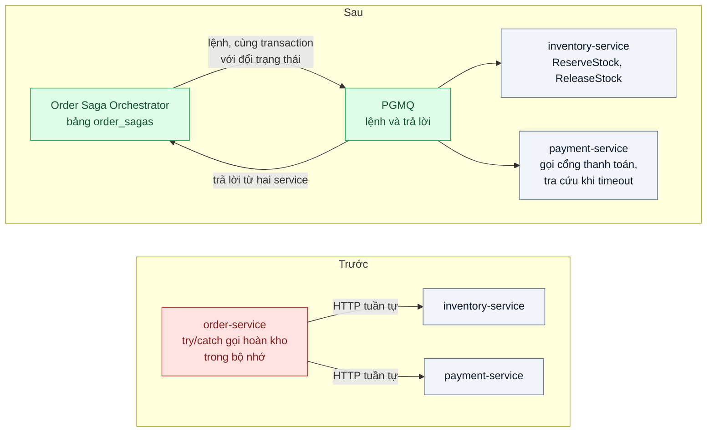
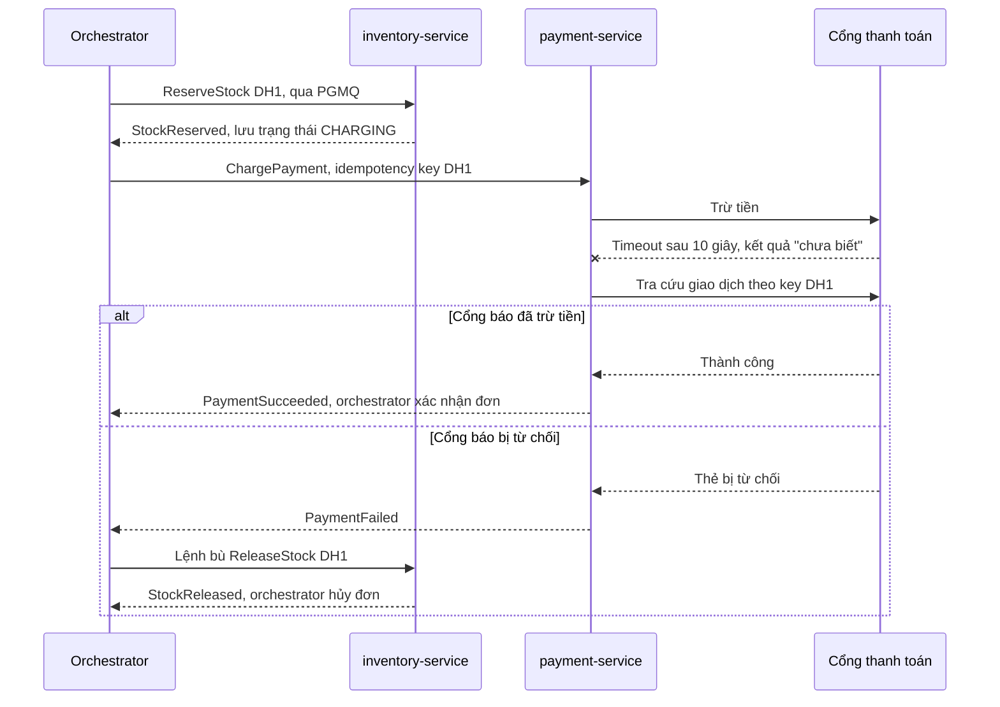
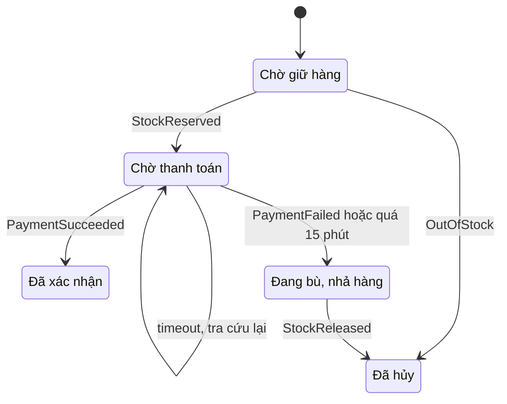

# Saga (choreography vs orchestration) — Đặt hàng → trừ kho → thanh toán: bước 3 lỗi thì hoàn kho thế nào khi không còn transaction chung

| Scope | Mức độ | Trạng thái | Pattern gốc | Cập nhật |
|---|---|---|---|---|
| 07 · backend / microservices | 🔴 Nâng cao | 📋 Kế hoạch | Saga — Garcia-Molina & Salem, SIGMOD 1987; Richardson, *Microservices Patterns* (2018) | 2026-10-06 |

> **Một câu tóm tắt:** Chia quy trình đặt hàng thành chuỗi transaction cục bộ ở từng service, mỗi bước có bước bù; một orchestrator lưu trạng thái saga trong database, gửi lệnh qua hàng đợi cùng transaction với việc đổi trạng thái, và khi thanh toán thất bại thì chạy bù theo thứ tự ngược — thay cho transaction phân tán không còn khả thi.

## 1. Bài toán thực tế (What)

**Bối cảnh** *(doanh nghiệp giả định, số liệu minh họa)*
Sàn thương mại điện tử đã tách `order-service`, `inventory-service`, `payment-service`, mỗi service một database (bài 01–02). Khoảng 40.000 đơn/ngày, đỉnh 30 đơn/giây lúc flash sale. Quy trình: tạo đơn → giữ hàng → trừ tiền qua cổng thanh toán → xác nhận đơn. Hiện `order-service` gọi HTTP tuần tự và "cố gắng" gọi API hoàn kho trong khối `catch` khi có lỗi.

**Triệu chứng người kinh doanh nhìn thấy**
- Mỗi tuần vài chục đơn "treo": hàng đã giữ nhưng thanh toán lỗi và không ai nhả; sản phẩm hiện "hết hàng" trong khi kho thật còn.
- Có đơn bị trừ tiền nhưng hiện "thất bại": cổng thanh toán trả timeout, hệ thống coi là lỗi, hủy đơn và nhả hàng; khách mất tiền, CSKH đối soát tay, mỗi sáng đội vận hành chạy script SQL sửa đơn lệch giữa ba database.

**Nguyên nhân kỹ thuật**
Không còn transaction ACID chung giữa ba database, và two-phase commit không khả thi vì cổng thanh toán bên ngoài không tham gia. Logic bù kiểu "try/catch rồi gọi hoàn kho" chỉ nằm trong bộ nhớ: nếu `order-service` crash giữa chừng hoặc chính lời gọi hoàn kho lỗi, không ai nhớ phải bù. Timeout bị coi là thất bại dù kết quả thật chưa biết.

**Ràng buộc**
- Không bao giờ trừ tiền mà không có đơn hợp lệ; hàng giữ quá 15 phút chưa thanh toán phải được nhả. Cổng thanh toán hỗ trợ idempotency key và API tra cứu trạng thái giao dịch.
- Mỗi service giữ database riêng, giao tiếp bất đồng bộ qua PGMQ đã có; phải trả lời được "đơn X đang ở bước nào, vì sao" trong 1 phút.

## 2. Vì sao dùng pattern này (Why)

**Nguyên nhân gốc mà pattern nhắm vào:** quy trình nghiệp vụ đi qua nhiều database nhưng không có nơi bền vững ghi nhớ đã làm tới đâu và phải hoàn tác gì khi bước sau thất bại.

**Pattern giải quyết thế nào:** Garcia-Molina và Salem định nghĩa saga là chuỗi transaction T1…Tn, mỗi Ti có bước bù Ci: hoặc mọi Ti hoàn tất, hoặc T1…Tj chạy rồi Cj…C1 hoàn tác. Richardson áp dụng cho microservices: mỗi bước là transaction cục bộ trong một service, các bước nối nhau bằng message. Có hai kiểu điều phối: *choreography* (mỗi service nghe event và tự quyết bước tiếp) và *orchestration* (một orchestrator gửi lệnh, nhận trả lời, giữ trạng thái). Richardson phân loại bước: *compensatable* (giữ hàng — có bù), *pivot* (trừ tiền thành công — điểm không quay lại), *retriable* (xác nhận đơn — chắc chắn thành công nếu thử lại). Saga thiếu tính cô lập nên cần *countermeasure*, ví dụ *semantic lock*: đơn ở trạng thái `PENDING` để mọi thao tác khác biết đơn đang dở. Bài chọn orchestration vì quy trình có luồng bù và yêu cầu trả lời "đơn đang ở đâu": trạng thái tập trung một chỗ dễ quan sát hơn chuỗi event rải ở ba service.

**Lựa chọn khác đã cân nhắc**

| Lựa chọn | Giải quyết được gì | Vì sao không chọn (ở bài này) |
|---|---|---|
| Giữ nguyên + tối ưu nhỏ (try/catch gọi hoàn kho, script sửa mỗi sáng) | Không thêm thành phần | Crash giữa chừng vẫn quên bù; timeout vẫn bị coi là lỗi; công sửa tay tăng theo số đơn. |
| Saga choreography | Không có điều phối trung tâm | Luồng bù rải ở ba service, khó trả lời "đơn đang ở đâu"; thêm bước dễ tạo vòng event |
| Saga orchestration bằng Temporal | Workflow bền vững, retry và timer có sẵn | Thêm một cụm phải vận hành và che mất cơ chế cần học; làm ở bước tùy chọn để so sánh |
| Saga orchestration tự viết trên PostgreSQL + PGMQ (chọn) | Trạng thái một chỗ, chạy tiếp sau crash, dùng lại outbox và idempotent consumer | Thêm code phải test kỹ luồng bù; thiếu cô lập phải xử lý bằng countermeasure |

## 3. Thiết kế hệ thống (How)

### 3.1 Kiến trúc trước và sau



### 3.2 Luồng chính



### 3.3 Vòng đời saga



### 3.4 Thành phần và trách nhiệm

| Thành phần | Trách nhiệm | Quyết định thiết kế đáng chú ý |
|---|---|---|
| Orchestrator + bảng `order_sagas` | Máy trạng thái: nhận trả lời, quyết định lệnh tiếp theo hoặc lệnh bù; một câu SQL trả lời "đơn X đang ở đâu" | Cột `version` chặn hai trả lời trùng cùng đẩy trạng thái; lưu lịch sử chuyển trạng thái kèm lý do |
| Gửi lệnh | Đổi trạng thái và gửi lệnh trong cùng một transaction | Lab dùng chung một PostgreSQL nên `pgmq.send` trong transaction là đủ; database tách máy thì cần outbox + relay (14/03) |
| Participant handler | Thực thi bước hoặc bước bù, trả lời kết quả | Idempotent theo `sagaId` + loại lệnh (14/04); payment chỉ trả `PaymentFailed` khi cổng xác nhận từ chối |
| Hạn 15 phút | Message trễ kích hoạt bù nếu saga còn ở `CHARGING` | Kiểm trạng thái khi tới hạn, không hủy mù (14/07) |

### 3.5 Điểm dễ sai khi triển khai
- **Coi timeout là thất bại rồi bù.** Đây là nguồn gốc "trừ tiền mà đơn hủy". Timeout phải dẫn tới tra cứu hoặc retry cùng idempotency key.
- **Bước bù không idempotent.** `ReleaseStock` tới hai lần nhả gấp đôi; bù theo `reservationId`, ghi nhận lệnh đã xử lý.
- **Bước bù được phép thất bại.** Về nghiệp vụ, bù phải hoàn tất: retry có backoff; lỗi vĩnh viễn vào DLQ kèm cảnh báo người xử lý (14/05).
- **Đặt pivot quá sớm.** Trừ tiền trước khi giữ hàng biến lỗi "hết hàng" thành hoàn tiền; đặt bước khó bù càng muộn càng tốt. Bù cũng không phải rollback: email "đặt hàng thành công" chỉ gửi khi saga ở `CONFIRMED`.

## 4. Tech stack và tác động (Impact techstack)

| Lớp | Công nghệ chọn | Vì sao chọn | Thay thế tương đương |
|---|---|---|---|
| Ngôn ngữ, ứng dụng | TypeScript strict, NestJS cho 3 service; orchestrator là module trong `order-service` | Trùng stack repo | Fastify |
| Trạng thái saga | PostgreSQL 16, bảng `order_sagas` + `order_saga_transitions` | Khóa lạc quan theo version; lịch sử chuyển trạng thái để điều tra | — |
| Hàng đợi | PGMQ (`inventory_commands`, `payment_commands`, `saga_replies`) | Gửi trong cùng transaction; visibility timeout cho retry; message trễ cho hạn 15 phút | RabbitMQ hoặc NATS JetStream kèm outbox |
| Workflow engine (tùy chọn) | Temporal TypeScript SDK | So sánh với orchestrator tự viết: workflow tuần tự, timer, retry bền vững | AWS Step Functions, Camunda |
| Test, đo, hạ tầng | Cổng thanh toán giả (Fastify: idempotency key, tra cứu, chế độ timeout và từ chối); Vitest test tích hợp bắn lỗi có chủ ý, k6, script đối soát 3 database; Docker Compose | Tái hiện "chưa biết kết quả" có kiểm soát; chứng minh không còn đơn lệch | WireMock cho cổng giả |

**Thay đổi so với hệ thống hiện tại:** `POST /orders` trả `202` và trạng thái `PENDING` thay vì chờ cả quy trình; thêm orchestrator, ba hàng đợi, handler idempotent ở kho và thanh toán; giao diện hiển thị "đang xử lý". Đội vận hành thay script sửa tay bằng truy vấn `order_sagas` và theo dõi số saga kẹt quá 15 phút.

## 5. Kết quả đầu ra và cách đo (Output impact)

| Chỉ số | Trước (minh họa) | Mục tiêu khi thực hành | Cách đo |
|---|---|---|---|
| Đơn lệch giữa 3 database sau 10.000 đơn (5 % bị từ chối, 2 % timeout) | vài chục mỗi tuần | 0 | Script đối soát: đơn hủy mà kho còn giữ; đơn hủy mà cổng giả có giao dịch thành công |
| Saga chạy tới trạng thái cuối sau khi kill orchestrator giữa chừng | không có cơ chế | 100 % | Test tích hợp `docker kill` ở bước ngẫu nhiên rồi khởi động lại |
| Thời gian từ `PaymentFailed` tới khi hàng được nhả | không xác định | p95 ≤ 5 giây | Timestamp trong `order_saga_transitions` |
| p95 `POST /orders` tới khi trả 202 | 2,5 giây (chờ cả quy trình) | ≤ 200 ms | k6 30 đơn/giây trong 5 phút |

> Số "trước" là minh họa để hình dung bài toán. Số "mục tiêu" chỉ được coi là đạt khi có số đo thật
> ở mục 8 kèm môi trường đo.

**Tác động nghiệp vụ mong đợi:** không còn khách bị trừ tiền cho đơn đã hủy; hàng bị giữ oan được nhả trong vài giây nên không mất doanh thu "hết hàng ảo"; đội vận hành bỏ được việc sửa dữ liệu mỗi sáng.

## 6. Đánh đổi và khi KHÔNG nên dùng

**Đánh đổi**
- Thiếu cô lập: người khác có thể thấy trạng thái trung gian; phải thiết kế countermeasure và giao diện "đang xử lý". Nhất quán sau cùng thay cho nhất quán tức thì: nghiệp vụ chấp nhận vài giây "chưa biết".
- Lượng code và test tăng mạnh: mỗi bước cần bước bù, mỗi bước bù cần test lỗi; orchestrator là thêm một thành phần phải theo dõi.

**Không nên dùng khi**
- Các bước nằm trong một database: dùng transaction thường.
- Chỉ có hai bước và bù đơn giản: outbox + idempotent consumer là đủ; đội chưa có hai thứ đó chạy ổn thì saga dựng trên nền lỏng sẽ lệch dữ liệu theo cách khó tìm hơn.
- Không có bước bù có nghĩa cho một bước giữa chuỗi: xem lại thứ tự bước hoặc ranh giới service trước.

**Liên quan**
- Đọc trước: `../../14-backend-queueing/03-transactional-outbox-ghi-don-xong-crash-mat-event/`, `../../14-backend-queueing/04-idempotent-consumer-event-den-hai-lan-tru-kho-hai-lan/`, `../02-database-per-service-hai-service-cung-sua-mot-bang/`.
- Dùng trong bài: `../../14-backend-queueing/05-dead-letter-queue-mot-message-loi-chan-ca-hang-doi/`, `../../14-backend-queueing/07-delayed-message-huy-don-chua-thanh-toan-sau-15-phut/`, `../../01-frontend-backend-transporter/03-idempotency-key-bam-thanh-toan-hai-lan/`; quan sát: `../../23-backend-monitoring-benchmark/03-distributed-tracing-otel-request-qua-6-service-cham-o-dau/`.

## 7. Cơ sở tham khảo

- Hector Garcia-Molina & Kenneth Salem, "Sagas", SIGMOD 1987 — định nghĩa gốc: chuỗi transaction có bước bù thay cho transaction dài.
- Chris Richardson, "Pattern: Saga", microservices.io — https://microservices.io/patterns/data/saga.html — choreography và orchestration, vấn đề cập nhật trạng thái và gửi message nguyên tử.
- Chris Richardson, *Microservices Patterns*, Manning, 2018, chương 4 về quản lý transaction bằng saga — phân loại compensatable / pivot / retriable, thiếu cô lập và các countermeasure như semantic lock.
- Microsoft Azure Architecture Center, "Compensating Transaction pattern" — https://learn.microsoft.com/azure/architecture/patterns/compensating-transaction — bước bù phải idempotent, có thể thất bại và cần retry.
- Temporal docs — https://docs.temporal.io/ — workflow bền vững, activity retry, timer cho bước so sánh.

## 8. Kế hoạch thực hành

- [ ] Bước 1: dựng 3 service tối giản và cổng thanh toán giả; phiên bản "trước" gọi HTTP tuần tự với try/catch hoàn kho.
- [ ] Bước 2: đo "trước": 10.000 đơn với 5 % từ chối, 2 % timeout, kill `order-service` ngẫu nhiên 3 lần; chạy script đối soát, ghi số đơn lệch.
- [ ] Bước 3: viết orchestrator, bảng `order_sagas`, ba hàng đợi PGMQ, handler idempotent, tra cứu khi timeout, hạn 15 phút bằng message trễ.
- [ ] Bước 4: đo "sau" cùng kịch bản, ghi số thật và môi trường vào mục 5; (tùy chọn) viết lại saga bằng Temporal và so số dòng code, cách quan sát.
- [ ] Bước 5: test: (a) thanh toán bị từ chối thì hàng được nhả và đơn hủy; (b) timeout dẫn tới tra cứu, không bù khi cổng báo thành công; (c) kill orchestrator giữa chừng, saga vẫn kết thúc đúng; (d) `ReleaseStock` hai lần chỉ nhả một lần.

**Cấu trúc code dự kiến**
```text
src/
  order/order-saga.orchestrator.ts   # [PATTERN] máy trạng thái, gửi lệnh cùng transaction
  inventory/inventory.handlers.ts    # ReserveStock, ReleaseStock idempotent
  payment/payment.handlers.ts        # Charge, tra cứu khi timeout; kèm cổng giả
  temporal/order.workflow.ts         # (tùy chọn) cùng saga bằng Temporal
test/
  payment-failure-releases-stock.test.ts
  payment-timeout-queries-before-compensating.test.ts
  orchestrator-crash-resumes-saga.test.ts
scripts/reconcile-three-databases.ts
docker-compose.yml
```

**Cách chạy** *(điền khi bắt đầu code)*
```bash
docker compose up -d
pnpm install && pnpm test
```
