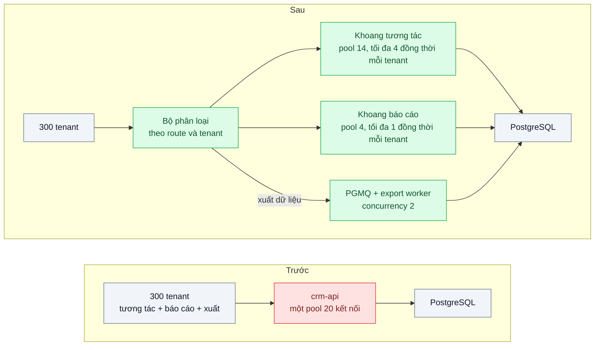
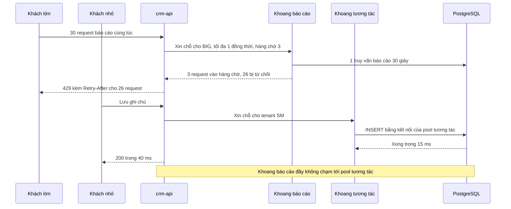

# Bulkhead — Một khách hàng lớn chiếm hết pool kết nối, mọi khách khác bị lỗi theo

| Scope | Mức độ | Trạng thái | Pattern gốc | Cập nhật |
|---|---|---|---|---|
| 07 · backend / microservices | 🔴 Nâng cao | 📋 Kế hoạch | Bulkhead — Nygard, *Release It!* (2007/2018); Azure "Bulkhead" | 2026-10-06 |

> **Một câu tóm tắt:** Chia tài nguyên dùng chung (pool kết nối database, số request đồng thời, worker, nhóm instance) thành các khoang riêng theo loại tải và theo tenant, để một khách lớn chạy báo cáo nặng chỉ làm đầy khoang của chính nó — các khách khác vẫn được phục vụ bình thường.

## 1. Bài toán thực tế (What)

**Bối cảnh** *(doanh nghiệp giả định, số liệu minh họa)*
SaaS B2B bán phần mềm CRM cho 300 công ty, tất cả dùng chung cụm `crm-api` gồm 6 instance Node.js; mỗi instance có một pool 20 kết nối PostgreSQL. Một khách doanh nghiệp lớn (khoảng 35 % dữ liệu toàn hệ thống) có tích hợp gọi API xuất danh bạ và báo cáo pipeline vào đầu giờ sáng.

**Triệu chứng người kinh doanh nhìn thấy**
- 8–9 giờ sáng thứ Hai, mọi khách báo "CRM quay mãi, không lưu được ghi chú" trong khoảng 20 phút; đội hỗ trợ nhận hàng trăm ticket.
- Chỉ một khách đang xuất dữ liệu lớn nhưng 299 khách còn lại chịu lỗi; khách nhỏ dọa hủy hợp đồng vì "trả tiền mà không dùng được".
- Tăng pool lên 50 kết nối thì PostgreSQL chạm `max_connections` và chậm toàn bộ.

**Nguyên nhân kỹ thuật**
Mọi loại tải (thao tác ngắn, báo cáo dài, xuất dữ liệu) và mọi tenant dùng chung một pool. Mỗi truy vấn báo cáo của khách lớn giữ kết nối 20–40 giây; khi 20 truy vấn như vậy chạy cùng lúc trên một instance, pool cạn, request ngắn của khách khác xếp hàng chờ kết nối rồi timeout. Node.js đơn luồng nên "thread pool" ở đây chính là pool kết nối và số request đồng thời — tài nguyên hữu hạn dùng chung không có vách ngăn biến tải của một khách thành sự cố của tất cả (*noisy neighbor*).

**Ràng buộc**
- Không dựng hạ tầng riêng cho từng khách vì chi phí; được phép có khoang riêng cho nhóm khách lớn.
- Khách lớn vẫn phải xuất được dữ liệu, chấp nhận chậm hơn hoặc xếp hàng.
- Tổng kết nối tới PostgreSQL không vượt ngưỡng an toàn (ví dụ 200); thao tác tương tác p99 ≤ 500 ms kể cả khi có báo cáo lớn (minh họa).

## 2. Vì sao dùng pattern này (Why)

**Nguyên nhân gốc mà pattern nhắm vào:** tài nguyên hữu hạn được dùng chung mà không có vách ngăn giữa các nhóm tải, nên nhóm tiêu thụ nhiều nhất quyết định trải nghiệm của mọi nhóm khác.

**Pattern giải quyết thế nào:** Nygard mượn hình ảnh vách ngăn khoang tàu: thủng một khoang, tàu không chìm. Azure mô tả Bulkhead là phân vùng instance và tài nguyên (pool kết nối, tiến trình, hàng đợi) thành các nhóm theo tải và yêu cầu khả dụng của người dùng. Bài áp dụng ba lớp. (1) Theo *loại tải*: pool riêng cho thao tác tương tác và cho báo cáo; truy vấn dài không chạm kết nối của request ngắn. (2) Theo *tenant*: giới hạn số request đồng thời của mỗi tenant trong mỗi khoang, có hàng chờ ngắn; vượt thì trả 429 kèm `Retry-After` — chỉ tenant gây quá tải bị ảnh hưởng. (3) Theo *hạng khách*: tenant lớn có thể được định tuyến sang nhóm instance riêng khi hai lớp trên chưa đủ. Xuất dữ liệu chuyển sang worker qua hàng đợi với concurrency cố định. Khác với rate limiting (giới hạn số request trong một khoảng thời gian), bulkhead giới hạn số request *đang chiếm* tài nguyên cùng lúc.

**Lựa chọn khác đã cân nhắc**

| Lựa chọn | Giải quyết được gì | Vì sao không chọn (ở bài này) |
|---|---|---|
| Giữ nguyên + tối ưu nhỏ (tăng pool, thêm index cho báo cáo) | Đỡ được một thời gian | PostgreSQL chạm `max_connections`; báo cáo nặng hơn là lặp lại; không có giới hạn theo tenant |
| Rate limiting theo API key | Chặn số request mỗi giây | Báo cáo gửi ít request nhưng mỗi request giữ kết nối 30 giây; tốc độ thấp vẫn cạn pool |
| Read replica cho báo cáo | Tách tải đọc khỏi primary | Bổ trợ tốt nhưng tranh chấp pool trong ứng dụng và giữa tenant trên replica vẫn còn |
| Hạ tầng riêng cho mỗi tenant | Cách ly tuyệt đối | Chi phí nhân 300 lần, vận hành nặng |
| Bulkhead: pool theo loại tải + giới hạn đồng thời theo tenant + nhóm instance cho khách lớn (chọn) | Sự cố bị nhốt trong khoang của tenant gây ra | Thêm tham số phải chỉnh; dung lượng chia nhỏ có thể bị bỏ phí lúc thấp tải |

## 3. Thiết kế hệ thống (How)

### 3.1 Kiến trúc trước và sau



### 3.2 Luồng chính



### 3.3 Thành phần và trách nhiệm

| Thành phần | Trách nhiệm | Quyết định thiết kế đáng chú ý |
|---|---|---|
| Bộ phân loại request | Gắn request vào khoang theo route và tenant | Tenant lấy từ token đã xác thực, không tin header client gửi |
| Pool kết nối theo khoang | `pg.Pool` riêng cho tương tác và báo cáo | Tổng kích thước pool × số instance tối đa ≤ ngưỡng an toàn của PostgreSQL |
| Giới hạn đồng thời theo tenant | Semaphore theo cặp (khoang, tenant) với hàng chờ ngắn | Hàng chờ có giới hạn và timeout; đầy thì 429 kèm `Retry-After` |
| `statement_timeout` theo khoang | Chặn truy vấn chạy quá lâu giữ kết nối | Tương tác 2 giây, báo cáo 60 giây; đặt theo role database hoặc theo kết nối |
| Export worker | Xử lý xuất dữ liệu qua PGMQ với concurrency cố định | Việc dài ra khỏi request; khách nhận file khi xong |
| Nhóm instance cho khách lớn | Deployment riêng nhận tenant hạng enterprise, định tuyến ở gateway | Chỉ làm khi hai lớp trên chưa đủ |

### 3.4 Điểm dễ sai khi triển khai
- **Tổng pool vượt `max_connections` khi autoscale.** 6 instance × 18 kết nối là 108; scale lên 12 instance thành 216. Tính theo số instance tối đa; cân nhắc PgBouncer.
- **Hàng chờ không giới hạn.** Khoang không bao giờ "đầy" mà chỉ chậm dần và tốn bộ nhớ; hàng chờ phải có kích thước và thời gian chờ tối đa.
- **Giới hạn tenant đếm ở từng instance.** 6 instance × 1 = 6 truy vấn báo cáo đồng thời thực tế; chấp nhận và tính vào kích thước pool, hoặc dùng bộ đếm phân tán trên Redis với chi phí độ trễ.
- **Quên trả chỗ khi lỗi hoặc timeout.** Khoang rò rỉ dần tới đầy; bọc bằng `try/finally` và viết test cho đường lỗi.
- **Client hủy nhưng truy vấn vẫn chạy.** Kết nối bị giữ dù không ai chờ kết quả; cần `statement_timeout` và hủy truy vấn khi client ngắt.
- **Chia khoang trước khi đo.** Khoang quá nhỏ gây từ chối oan và lãng phí lúc thấp tải; lấy số từ `pg_stat_activity` và metrics trước khi chốt.

## 4. Tech stack và tác động (Impact techstack)

| Lớp | Công nghệ chọn | Vì sao chọn | Thay thế tương đương |
|---|---|---|---|
| Ứng dụng | TypeScript strict, NestJS (`crm-api`) | Guard và interceptor gắn khoang theo route | Fastify |
| Pool kết nối | `pg` (node-postgres), một `Pool` cho mỗi khoang | Pool là đơn vị cách ly rõ nhất, cấu hình kích thước và timeout riêng | PgBouncer với pool theo user hoặc database |
| Giới hạn đồng thời | Bulkhead policy của `cockatiel` (giới hạn thực thi + hàng chờ) | Có sẵn hàng chờ giới hạn và lỗi rõ khi đầy | `p-limit` + hàng chờ tự viết; semaphore trên Redis cho giới hạn toàn cụm |
| Việc dài | PGMQ + export worker | Xuất dữ liệu ra khỏi request, concurrency cố định | BullMQ |
| Database | PostgreSQL 16 | `statement_timeout`, `max_connections`, `pg_stat_activity` để quan sát | — |
| Tải | k6 hai kịch bản song song: khách lớn bắn báo cáo, 50 khách nhỏ thao tác ngắn | Tái hiện noisy neighbor có kiểm soát | Gatling |
| Đo, hạ tầng | Prometheus + `prom-client`; Docker Compose | Gauge chỗ đang dùng và hàng chờ, counter từ chối theo tenant; cảnh báo theo khoang, không chỉ theo tổng | Grafana để vẽ |

**Thay đổi so với hệ thống hiện tại:** `crm-api` có hai pool và lớp giới hạn đồng thời theo tenant; xuất dữ liệu thành tác vụ nền trả file sau; khách lớn có thể nhận 429 nên tài liệu API và hợp đồng phải ghi rõ giới hạn. Đội vận hành theo dõi metrics theo khoang và học cách chỉnh kích thước khoang từ số đo.

## 5. Kết quả đầu ra và cách đo (Output impact)

| Chỉ số | Trước (minh họa) | Mục tiêu khi thực hành | Cách đo |
|---|---|---|---|
| p99 thao tác tương tác của khách nhỏ khi khách lớn chạy báo cáo | 30.000 ms (timeout) | ≤ 500 ms | k6 hai kịch bản song song, histogram theo khoang |
| Tỷ lệ lỗi của khách nhỏ trong lúc đó | 40 % | ≤ 0,1 % | k6 `checks` theo mã trả về của kịch bản khách nhỏ |
| Số kết nối PostgreSQL cao nhất | chạm `max_connections` | ≤ ngưỡng đặt (ví dụ 200) | Lấy mẫu `pg_stat_activity` mỗi giây |
| Báo cáo của khách lớn hoàn tất | treo, bị hủy | 100 % hoàn tất (xếp hàng và retry theo `Retry-After`) | Đếm kết quả báo cáo ở kịch bản khách lớn |
| Thời gian chờ chỗ trong khoang tương tác | — | p99 ≤ 20 ms | Histogram thời gian chờ semaphore |

> Số "trước" là minh họa để hình dung bài toán. Số "mục tiêu" chỉ được coi là đạt khi có số đo thật
> ở mục 8 kèm môi trường đo.

**Tác động nghiệp vụ mong đợi:** một khách dùng nặng không còn làm 299 khách khác mất khả năng làm việc; khách lớn vẫn có dữ liệu, chỉ chậm hơn và được báo trước bằng giới hạn rõ ràng.

## 6. Đánh đổi và khi KHÔNG nên dùng

**Đánh đổi**
- Dung lượng bị chia: lúc thấp tải, khoang báo cáo rảnh nhưng request tương tác không dùng được phần đó.
- Thêm tham số (kích thước pool, giới hạn tenant, hàng chờ) phải chỉnh theo dữ liệu; đặt sai thì từ chối oan. Khách lớn thấy 429 — cần hợp đồng nói rõ, và client của họ phải retry đúng cách.

**Không nên dùng khi**
- Một loại tải, tenant đồng đều, tài nguyên còn dư: chia khoang chỉ làm lãng phí.
- Nguyên nhân là truy vấn tệ (thiếu index, N+1): sửa truy vấn trước.
- Hệ thống nhỏ một instance: một giới hạn đồng thời toàn cục kèm timeout thường đã đủ.

**Liên quan**
- Đọc trước: `../03-circuit-breaker-service-khuyen-mai-cham-lam-sap-checkout/` — bộ ba stability patterns; `../../02-backend-database/03-connection-pool-200-pod-dap-postgres/`.
- Cùng chủ đề: `../../13-backend-transporter/03-rate-limiting-mot-khach-api-goi-10k-req-s/` — giới hạn theo thời gian; `../../02-backend-database/07-multi-tenant-saas-300-cong-ty-chung-mot-db/`; `../../18-backend-scale/05-load-shedding-qua-tai-thi-tu-choi-mot-phan-thay-vi-sap-het/`; đưa việc dài ra hàng đợi: `../../14-backend-queueing/01-work-queue-gui-100k-email-lam-treo-api/`; tách tải đọc: `../../02-backend-database/05-read-replica-bao-cao-cuoi-thang-lam-cham-tao-don/`.

## 7. Cơ sở tham khảo

- Michael Nygard, *Release It!*, 2nd ed., Pragmatic Bookshelf, 2018 — Stability Patterns: Bulkheads; cách chia tài nguyên để một phần hỏng không kéo theo toàn hệ thống.
- Microsoft Azure Architecture Center, "Bulkhead pattern" — https://learn.microsoft.com/azure/architecture/patterns/bulkhead — phân vùng instance và pool theo người dùng, các vấn đề cần cân nhắc khi chọn độ mịn.
- Microsoft, "Architect multitenant solutions on Azure" — https://learn.microsoft.com/azure/architecture/guide/multitenant/overview — vấn đề noisy neighbor và các mức cách ly trong hệ đa tenant.
- node-postgres docs, "Pool" — https://node-postgres.com/apis/pool — cấu hình kích thước pool và thời gian chờ kết nối.
- cockatiel — https://github.com/connor4312/cockatiel — bulkhead policy với giới hạn thực thi và hàng chờ dùng ở mục 4.
- PostgreSQL docs, "Client Connection Defaults" — https://www.postgresql.org/docs/16/runtime-config-client.html — `statement_timeout`.

## 8. Kế hoạch thực hành

- [ ] Bước 1: dựng `crm-api` một pool chung, seed 300 tenant (một tenant chiếm 35 % dữ liệu), endpoint ghi chú và báo cáo pipeline chậm có chủ đích.
- [ ] Bước 2: đo "trước": k6 hai kịch bản song song trong 10 phút; ghi p99 và tỷ lệ lỗi của khách nhỏ, số kết nối PostgreSQL cao nhất.
- [ ] Bước 3: thêm bộ phân loại, hai pool, bulkhead theo (khoang, tenant) có hàng chờ, `statement_timeout`, chuyển xuất dữ liệu sang PGMQ worker.
- [ ] Bước 4: đo "sau" cùng kịch bản, ghi số thật và môi trường vào mục 5; thử tăng số instance để kiểm tổng kết nối.
- [ ] Bước 5: test: (a) khoang báo cáo đầy không làm chậm request tương tác; (b) tenant vượt giới hạn nhận 429 kèm `Retry-After`, tenant khác không bị; (c) lỗi và timeout luôn trả chỗ trong khoang; (d) tổng kết nối không vượt ngưỡng cấu hình.

**Cấu trúc code dự kiến**
```text
src/
  crm-api/
    compartment.classifier.ts      # gắn request vào khoang theo route và tenant
    tenant-bulkhead.ts             # [PATTERN] semaphore theo (khoang, tenant), hàng chờ giới hạn
    db-pools.ts                    # pool tương tác và pool báo cáo
    notes.controller.ts, reports.controller.ts
  export-worker/worker.ts          # PGMQ, concurrency cố định
test/
  full-report-compartment-does-not-slow-notes.test.ts
  tenant-over-limit-gets-429.test.ts
  slot-released-on-error.test.ts
bench/noisy-neighbor.k6.js
docker-compose.yml
```

**Cách chạy** *(điền khi bắt đầu code)*
```bash
docker compose up -d
pnpm install && pnpm test
```
