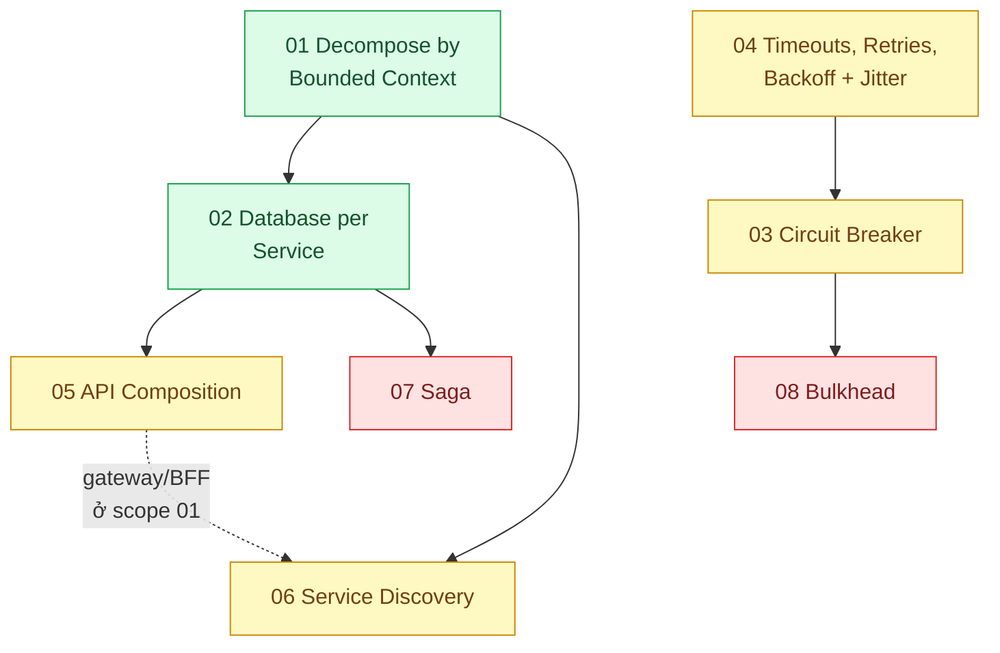

# 07 · Microservices (`backend / microservices`)

> **Phạm vi:** Khi hệ thống đã (hoặc buộc phải) tách thành nhiều service: tách theo gì, dữ liệu của ai,
> gọi nhau an toàn ra sao, quy trình nhiều bước giữ đúng thế nào, cách ly lỗi, tìm nhau. Giao thức
> và serialization thuộc scope 13; hàng đợi thuộc scope 14; tách dần từ monolith thuộc scope 08.
>
> **Câu hỏi trung tâm:** Khi một quy trình nghiệp vụ trải qua nhiều service, làm sao vẫn đúng khi một
> service hỏng?

## Bản đồ pattern trong scope

## Danh sách bài toán

| # | Bài toán (pattern — triệu chứng) | Mức | Pattern gốc / nguồn | Trạng thái |
|---|---|---|---|---|
| 01 | [Decompose by Bounded Context — Tách service theo nghiệp vụ (đơn hàng, kho, thanh toán) thay vì theo bảng](./01-decomposition-bounded-context-tach-service-theo-nghiep-vu/) | 🟢 | Evans, *Domain-Driven Design* (2003) — Bounded Context; microservices.io "Decompose by business capability / subdomain"; Newman, *Building Microservices* | 📋 |
| 02 | [Database per Service — Hai service cùng ghi vào một bảng, đổi schema một bên làm hỏng bên kia](./02-database-per-service-hai-service-cung-sua-mot-bang/) | 🟢 | microservices.io "Database per service"; Newman, *Monolith to Microservices* (2019) ch. tách DB | 📋 |
| 03 | [Circuit Breaker — Service khuyến mãi chậm 30 giây kéo sập toàn bộ checkout](./03-circuit-breaker-service-khuyen-mai-cham-lam-sap-checkout/) | 🟡 | Nygard, *Release It!* (2018); Fowler bliki "CircuitBreaker" (2014); Azure "Circuit Breaker" | 📋 |
| 04 | [Timeouts, Retries, Backoff with Jitter — Retry đồng loạt sau sự cố tạo cơn bão request thứ hai](./04-timeout-retry-backoff-jitter-retry-dong-loat-tao-bao-moi/) | 🟡 | Amazon Builders' Library "Timeouts, retries, and backoff with jitter"; Marc Brooker, "Exponential Backoff And Jitter" (2015); Azure "Retry" | 📋 |
| 05 | [API Composition — Màn hình chi tiết đơn cần dữ liệu từ 4 service, ghép ở đâu?](./05-api-composition-man-hinh-don-hang-can-du-lieu-4-service/) | 🟡 | microservices.io "API Composition"; Azure "Gateway Aggregation"; CQRS (scope 02) là phương án so sánh | 📋 |
| 06 | [Service Discovery — Service deploy lại đổi IP, các service khác gọi vào địa chỉ cũ](./06-service-discovery-service-moi-deploy-doi-ip/) | 🟡 | microservices.io "Service registry", "Client-side / Server-side discovery"; Kubernetes docs "Service" (DNS) | 📋 |
| 07 | [Saga (choreography vs orchestration) — Đặt hàng → trừ kho → thanh toán: bước 3 lỗi thì hoàn kho thế nào khi không còn transaction chung](./07-saga-dat-hang-tru-kho-thanh-toan-hoan-tien-khi-loi/) | 🔴 | Garcia-Molina & Salem, "Sagas" (SIGMOD 1987); microservices.io "Saga"; Richardson, *Microservices Patterns* ch.4; Temporal docs; Azure "Compensating Transaction" | 📋 |
| 08 | [Bulkhead — Một khách hàng lớn chiếm hết pool kết nối, mọi khách khác bị lỗi theo](./08-bulkhead-mot-tenant-lon-chiem-het-thread-pool/) | 🔴 | Nygard, *Release It!*; Azure "Bulkhead" | 📋 |

## Lộ trình đề xuất trong scope

1. **Bounded context → Database per service** — hai quyết định nền; làm sai thì mọi pattern sau chỉ chữa cháy.
2. **Timeouts/retry/jitter → Circuit breaker → Bulkhead** — bộ ba "stability patterns" theo Nygard,
   theo đúng thứ tự tăng dần độ phức tạp.
3. **API composition, Service discovery** — hai bài về "gọi nhau".
4. **Saga** — bài tổng hợp: cần outbox và idempotent consumer từ scope 14.

## Kiến thức nền cần có trước

- DDD cơ bản: bounded context, aggregate.
- HTTP client có timeout; khái niệm at-least-once.
- Đọc `14-backend-queueing` bài 03 và 04 trước bài Saga.

## Liên kết với scope khác

- `08-backend-monolith` — Modular monolith và Strangler Fig là đường đi *tới* microservices.
- `13-backend-transporter` — giao thức gọi nhau (gRPC/REST/broker).
- `14-backend-queueing` — Outbox, Idempotent Consumer, DLQ phục vụ Saga.
- `23-backend-monitoring-benchmark` bài 03 — distributed tracing là điều kiện vận hành microservices.

## Nguồn tổng quan cho scope

- Chris Richardson, *Microservices Patterns* (2018) — https://microservices.io/patterns/
- Sam Newman, *Building Microservices* (2nd ed., 2021).
- Michael Nygard, *Release It!* (2nd ed., 2018).
