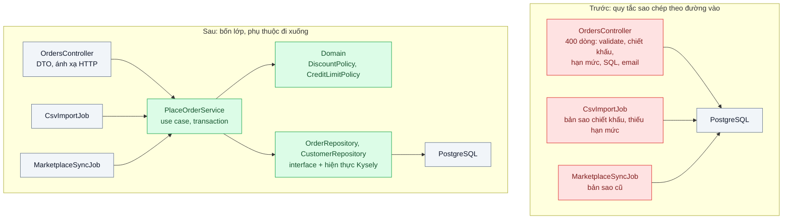
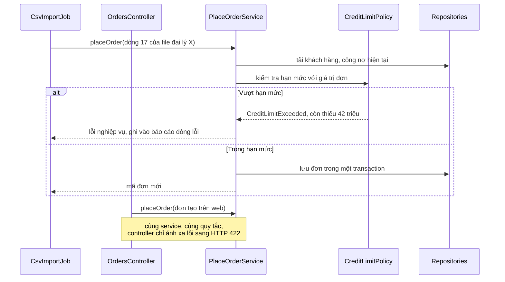

# Layered Architecture — Logic nghiệp vụ nằm trong controller, không test được, sửa một chỗ hỏng ba chỗ

| Scope | Mức độ | Trạng thái | Pattern gốc | Cập nhật |
|---|---|---|---|---|
| 08 · backend / monolithics | 🟢 Cơ bản | ✅ Hoàn thành | Layering, Service Layer, Repository — Fowler, *PoEAA* (2002) | 2026-10-07 |

> **Một câu tóm tắt:** Tách ứng dụng thành các lớp có trách nhiệm rõ (nhận request, điều phối use case, quy tắc nghiệp vụ, truy cập dữ liệu) với phụ thuộc chỉ đi một chiều, để mỗi quy tắc nằm đúng một chỗ, mọi đường vào (HTTP, import file, job) dùng chung nó và test được không cần HTTP hay DB.

## 1. Bài toán thực tế (What)

**Bối cảnh** *(doanh nghiệp giả định, số liệu minh họa)*
Công ty phân phối vật tư dùng hệ thống CRM và quản lý đơn hàng tự xây bằng NestJS từ 4 năm trước, khoảng 120.000 dòng TypeScript, 6 kỹ sư. Đơn đến từ ba đường: nhân viên tạo trên web, đại lý tải file CSV, và một job đồng bộ từ sàn TMĐT. Phương thức `OrdersController.create()` dài khoảng 400 dòng: validate body, tính chiết khấu theo hạng khách, kiểm hạn mức công nợ bằng SQL viết tay, ghi đơn, gửi email.

**Triệu chứng người kinh doanh nhìn thấy**
- Đơn nhập từ CSV của đại lý không bị kiểm hạn mức công nợ; quý trước phát sinh nợ khó đòi vì một đại lý đặt vượt hạn mức nhiều lần.
- Phòng kinh doanh đổi chính sách chiết khấu hạng Vàng; web áp dụng ngay, file CSV và đơn từ sàn vẫn tính theo chính sách cũ suốt hai tuần.
- Mỗi lần sửa quy tắc giá, đội QA phải kiểm tay lại toàn bộ luồng đặt hàng trong 2 ngày vì "không biết còn chỗ nào dùng".

**Nguyên nhân kỹ thuật**
Quy tắc nghiệp vụ nằm trong controller, trộn với việc đọc request và câu SQL. Khi cần cùng quy tắc ở đường vào khác (job import, job đồng bộ), cách nhanh nhất là sao chép đoạn code; ba bản sao trôi dần khỏi nhau. Muốn test quy tắc chiết khấu phải dựng HTTP server và database, nên gần như không có test tự động; test duy nhất là test e2e chậm. Không có quy ước nào ngăn controller gọi thẳng DB hay job gọi vào controller.

**Ràng buộc**
- Không viết lại hệ thống; refactor từng luồng trong khi vẫn phát hành hằng tuần.
- Giữ NestJS và PostgreSQL; không thêm hạ tầng.
- Hành vi của luồng đặt hàng qua web không đổi (trừ lỗi đã biết), có bằng chứng bằng test.

## 2. Vì sao dùng pattern này (Why)

**Nguyên nhân gốc mà pattern nhắm vào:** không có ranh giới giữa "cách nhận yêu cầu" và "quy tắc nghiệp vụ", nên quy tắc bị nhân bản theo số đường vào và không tách ra để test được.

**Pattern giải quyết thế nào:** Fowler mô tả Layering như việc chia hệ thống thành các lớp chồng lên nhau, lớp trên dùng lớp dưới, lớp dưới không biết lớp trên. Bài này dùng bốn lớp: *presentation* (controller, DTO, ánh xạ lỗi sang HTTP), *service layer* (mỗi use case một service như `PlaceOrderService`, định ranh giới transaction và điều phối), *domain* (quy tắc chiết khấu, hạn mức là hàm hoặc lớp thuần, không biết NestJS hay SQL), *data source* (Repository: interface ở phía domain, hiện thực bằng Kysely). Service Layer theo PoEAA là "ranh giới ứng dụng": mọi đường vào, dù là HTTP, CSV hay job, đều gọi cùng một service, nên quy tắc chỉ tồn tại một nơi. Hướng phụ thuộc được kiểm tự động trong CI bằng dependency-cruiser, không dựa vào lời dặn.

**Lựa chọn khác đã cân nhắc**

| Lựa chọn | Giải quyết được gì | Vì sao không chọn (ở bài này) |
|---|---|---|
| Giữ nguyên + tối ưu nhỏ (gom đoạn trùng vào file `utils/pricing.ts`) | Giảm trùng lặp nhanh | Không có ranh giới: helper vẫn gọi DB, controller vẫn chứa phần còn lại; không ngăn sao chép lần sau |
| Hexagonal (bài 04) ngay từ đầu | Cô lập mọi phụ thuộc ngoài | Nhiều khái niệm mới cùng lúc cho đội; lớp và hướng phụ thuộc là bước đầu cần có trước |
| Viết lại module đơn hàng | Thiết kế sạch | Rủi ro cao, dừng phát hành; mất các quy tắc ngầm chỉ code cũ biết |
| Layering + Service Layer + Repository, refactor theo luồng (chọn) | Một chỗ cho mỗi quy tắc, test được, áp dần | Thêm vài file mỗi use case; cần kỷ luật và công cụ kiểm hướng phụ thuộc |

## 3. Thiết kế hệ thống (How)

### 3.1 Kiến trúc trước và sau



### 3.2 Luồng chính



### 3.3 Thành phần và trách nhiệm

| Thành phần | Trách nhiệm | Quyết định thiết kế đáng chú ý |
|---|---|---|
| Controller, job, CLI | Đọc đầu vào, validate hình dạng (DTO), gọi service, ánh xạ kết quả | Không import repository hay DB client; không chứa `if` nghiệp vụ |
| `PlaceOrderService` | Một use case: tải dữ liệu, gọi domain, lưu trong một transaction, phát việc phụ (email) | Ranh giới transaction nằm ở đây; trả lỗi nghiệp vụ có kiểu, không trả mã HTTP |
| Domain policy | Quy tắc chiết khấu, hạn mức công nợ | Hàm thuần nhận dữ liệu, trả kết quả; test không cần mock |
| Repository | Truy cập dữ liệu theo khái niệm nghiệp vụ (`findCustomerWithDebt`) | Interface đặt cạnh service; hiện thực Kysely ở thư mục `infrastructure` |
| Quy tắc dependency-cruiser | Cấm controller import `infrastructure`, cấm domain import NestJS hoặc Kysely | Chạy trong CI, báo lỗi có tên file và luật bị vi phạm |

### 3.4 Điểm dễ sai khi triển khai
- Service "mỏng như giấy" chỉ chuyển tiếp xuống repository, còn quy tắc vẫn nằm trong controller: có lớp nhưng không có ranh giới.
- Repository trả về kiểu của ORM hoặc query builder (`Selectable<OrdersTable>`) lên tận controller: lớp dưới rò ra lớp trên. Trả kiểu dữ liệu của domain hoặc DTO.
- Ném `HttpException` từ service: job CSV nhận lỗi HTTP vô nghĩa. Service ném lỗi nghiệp vụ, lớp presentation ánh xạ.
- Refactor mà không có test đặc tả hành vi cũ: "sạch hơn" nhưng đổi hành vi âm thầm.

**Gặp thật khi làm lab:**
- *DI chạy trong test nhưng có thể hỏng khi chạy app.* Đã kiểm trong lab: dưới Vitest 5 (transform oxc), `Reflect.getMetadata('design:paramtypes', ...)` trả về kiểu tham số constructor; dưới `tsx` (esbuild) thì trả `undefined`. Constructor không có `@Inject(...)` vì vậy được tiêm đúng trong test nhưng không được tiêm khi chạy `pnpm dev`. Lab ghi `@Inject(...)` tường minh cho mọi tham số; interface (repository, mailer) thì đằng nào cũng cần token `Symbol` vì interface không tồn tại lúc chạy.
- *Cổng CI "xanh giả" của dependency-cruiser.* Với `--output-type json`, lệnh thoát mã 0 dù báo 7 vi phạm; với reporter mặc định (`err`) thì thoát mã 7, bằng số lỗi. Cổng CI (`pnpm depcruise`) dùng reporter mặc định; JSON chỉ để lấy số liệu.
- *Đường dẫn gói npm dưới pnpm.* dependency-cruiser phân giải `kysely` thành `node_modules/.pnpm/kysely@0.29.6/node_modules/kysely/...`, nên luật cấm thư viện viết theo đoạn `(^|/)node_modules/(kysely|pg)/` chứ không neo `^node_modules/kysely`.
- *Luật phụ thuộc chỉ thấy import, không thấy logic.* Bản "trước" có 7 vi phạm, nhưng lỗi nghiệp vụ nặng nhất (job CSV không kiểm hạn mức) không phải một import nào cả. Luật phụ thuộc giữ cho kiến trúc không trôi; còn việc "mọi đường vào dùng chung một quy tắc" phải được chứng minh bằng test chạy qua từng đường vào.

## 4. Tech stack và tác động (Impact techstack)

| Lớp | Công nghệ chọn | Vì sao chọn | Thay thế tương đương |
|---|---|---|---|
| Ứng dụng | TypeScript 5 strict, NestJS 10 (module, controller, provider, DI) | Stack hiện tại; DI giúp thay repository bằng bản giả trong test | Fastify + tự ghép phụ thuộc |
| Truy cập dữ liệu | Kysely trên PostgreSQL 16 | Query builder có type, SQL tường minh, dễ đặt sau interface repository | Prisma, TypeORM |
| Kiểm hướng phụ thuộc | dependency-cruiser | Khai báo luật theo đường dẫn, chạy trong CI, xuất đồ thị | `eslint-plugin-boundaries`, Nx module boundaries |
| Test | Vitest (unit, service), Supertest (ít e2e) | Nhanh; test domain không cần container | Jest |
| Đo độ phức tạp | ESLint `max-lines-per-function`, `complexity` | Phát hiện controller phình lại | SonarQube |

**Khi thực hành:** dùng đúng NestJS 10 (10.4.22, `@nestjs/platform-express`) vì module, provider và DI chính là nội dung bài, không thay bằng Fastify thuần như các lab scope 02. Một app chạy cả hai bản (`POST /truoc/orders` và `POST /sau/orders`) trên cùng PostgreSQL 16 để so trên cùng tiến trình. Lệch so với các lab trước: TypeScript 5.9.3 thay vì 7, vì `typescript-eslint` 8.71 chỉ nhận TypeScript `<6.1`; dependency-cruiser 17.4.3 thay vì 18, vì bản 18 đòi Node ≥ 22 còn máy đo chạy Node 20. ESLint 10 chỉ bật hai luật `max-lines-per-function` (30) và `complexity` (10). Không dùng `class-validator`: body được kiểm bằng hàm viết tay để giữ nguyên từng thông báo lỗi của bản cũ (test đặc tả so body lỗi của hai bản) và để không phụ thuộc metadata của decorator. Mọi tham số constructor có `@Inject(...)` tường minh (xem mục 3.4).

**Thay đổi so với hệ thống hiện tại:** mỗi use case thêm một service và một hoặc hai repository; controller và job được cắt mỏng; thêm cấu hình dependency-cruiser vào CI. Đội cần thống nhất quy ước thư mục và học viết test đặc tả trước khi refactor.

## 5. Kết quả đầu ra và cách đo (Output impact)

| Chỉ số | Trước (minh họa) | Mục tiêu khi thực hành | Cách đo |
|---|---|---|---|
| Số nơi hiện thực quy tắc chiết khấu và hạn mức | 3 | 1 | Tìm kiếm mã nguồn theo tên quy tắc; review danh sách nơi gọi `DiscountPolicy` |
| Vi phạm hướng phụ thuộc | không kiểm, ước tính hàng chục | 0 | Báo cáo dependency-cruiser trong CI |
| Thời gian chạy bộ test quy tắc đặt hàng | 6 phút (e2e, cần DB) | < 10 giây | Vitest cho domain và service, đo thời gian trong CI |
| Độ phủ test của service và domain đặt hàng | khoảng 5% | ≥ 80% | Vitest coverage (v8) |
| Số dòng lớn nhất của một hàm trong controller | 400 | ≤ 30 | ESLint `max-lines-per-function` |
| Đơn từ CSV vượt hạn mức được chấp nhận | có | 0 | Test service với dữ liệu vượt hạn mức qua cả ba đường vào |

> Số "trước" là minh họa để hình dung bài toán. Số "mục tiêu" chỉ được coi là đạt khi có số đo thật;
> số đã đo nằm ở mục 5.1 bên dưới, kèm môi trường đo.

### 5.1 Số đã đo

**Môi trường:** MacBook Apple M1 Pro (8 nhân: 6 hiệu năng + 2 tiết kiệm điện; macOS 26.6.2 / Darwin 25.6.0); Docker 28.5.1, 8 CPU, khoảng 7,6 GB RAM; PostgreSQL 16.15 trong container `postgres:16`; Node v20.19.6, pnpm 10.32.0; NestJS 10.4.22, Kysely 0.29.6, Vitest 5.0.3, ESLint 10.12.0, dependency-cruiser 17.4.3, k6 v1.4.2. Máy chạy cùng lúc các container của dự án khác (MySQL, RabbitMQ) và ứng dụng desktop. Số thô ở `bench/results/main/` (không commit); lượt chạy lại từ volume sạch ở `bench/results/recheck/`. Codebase của lab nhỏ hơn bối cảnh ở mục 1 rất nhiều (vài trăm dòng so với 120.000 dòng), và bản "trước" do chính lab viết để tái hiện triệu chứng: độ trôi giữa các bản sao (job CSV thiếu bước kiểm hạn mức; job sàn thiếu khoản cộng 1% cho đơn lớn và quên cộng công nợ) là dựng có chủ đích, không đo từ hệ thống thật. Thứ được đo là hệ quả của hai cách đặt quy tắc trên cùng một bộ quy tắc.

**Chỉ số về code** (`pnpm bench:metrics` → `code-metrics.json`; số dòng của ESLint bỏ dòng trống và comment; "nơi đặt quy tắc" đếm bằng ba mẫu regex trong `bench/code-metrics.ts`, danh sách file:dòng nằm trong file thô):

| Chỉ số | Trước (`src/truoc`) | Sau (`src/sau`) |
|---|---|---|
| Số file / số dòng mã | 4 / 316 | 12 / 385 |
| Hàm dài nhất trong controller | `create`: 99 dòng | `create`: 6 dòng |
| Hàm dài nhất cả bản | 99 dòng (`create`) | 27 dòng (`KyselyOrderRepository.insert`) |
| Độ phức tạp (cyclomatic) lớn nhất | 16 (`create`) | 6 (`parsePlaceOrderBody`) |
| Số hàm dài hơn 30 dòng / phức tạp hơn 10 | 6 / 4 | 0 / 0 |
| Nơi đặt tỉ lệ chiết khấu hạng Vàng | 3: controller, job CSV, job sàn | 1: `domain/discount-policy.ts` |
| Nơi so với hạn mức công nợ | 2: controller, job sàn (quên cộng công nợ); job CSV không có | 1: `domain/credit-limit-policy.ts` |
| Nơi đặt ngưỡng đơn lớn 50 triệu | 2: controller, job CSV; job sàn không có | 1 |
| Vi phạm hướng phụ thuộc (dependency-cruiser) | 7: 6 × `entry-point-not-to-data-access`, 1 × `entry-point-not-to-entry-point` | 0 |

**Diễn tập đổi chính sách hạng Vàng 5 % → 7 %** (`pnpm bench:drills` → `drills/mutation-drills.json`): script sửa mã nguồn, chạy test e2e đặt cùng một đơn Vàng 10 triệu qua cả ba đường vào trên PostgreSQL với kỳ vọng 7 %, rồi khôi phục file.

| Bản | Sửa ở đâu | Số file sửa | Đường vào áp chính sách mới | Test còn ghim 5 % chuyển đỏ |
|---|---|---|---|---|
| Sau | `TIER_DISCOUNT_BPS.gold` trong DiscountPolicy | 1 | 3/3 | 14/33 test unit |
| Trước | chỉ controller, chỗ dễ thấy nhất | 1 | 1/3: web; CSV và sàn vẫn 5 % | không chạy |
| Trước | cả ba bản sao | 3 | 3/3 | 7/17 ca của bảng quy tắc qua HTTP |

**Đơn vượt hạn mức được nhận** (`pnpm bench:over-limit` → `over-limit.json`): mỗi đường vào 100 đơn, mỗi đơn một khách hạng Vàng mới, đơn 30 × 1 triệu = 28,5 triệu sau chiết khấu. 50 đơn nhóm "nợ cũ + đơn mới" (hạn mức 100 triệu, đang nợ 80 triệu), 50 đơn nhóm "riêng đơn đã vượt" (hạn mức 20 triệu, không nợ). Số đơn được nhận khớp với số đơn đếm lại bằng SQL.

| Bản | Web | CSV đại lý | Sàn TMĐT |
|---|---|---|---|
| Trước | 0/100 | 100/100, tổng vượt hạn mức 850 triệu đồng | 50/100: nhận cả 50 đơn nhóm "nợ cũ + đơn mới" (tổng vượt 425 triệu), từ chối 50 đơn nhóm còn lại |
| Sau | 0/100 | 0/100 | 0/100 |

**Thời gian chạy test** (`pnpm bench:test-time` → `test-time.json`; một vòng khởi động không tính, rồi 5 vòng, thứ tự xoay giữa các vòng; số là trung vị, trong ngoặc là thấp nhất – cao nhất). "Thời gian thực" tính từ lúc gọi tới lúc tiến trình Vitest thoát; "tổng thời gian test" là tổng thời lượng từng test theo JSON reporter, không gồm `beforeAll` (dựng app NestJS). Test e2e còn cần container PostgreSQL: `pnpm db:up` từ volume sạch mất 3,24 s (một lần đo, `env.txt`).

| Bộ test | Cần DB | Số test | Thời gian thực | Tổng thời gian test |
|---|---|---|---|---|
| 17 ca quy tắc qua `PlaceOrderService` (sau) | không | 17 | 0,47 s (0,47 – 0,50) | 5,4 ms (5,2 – 5,4) |
| Cùng 17 ca qua HTTP + PostgreSQL (trước) | có | 17 | 0,93 s (0,86 – 1,41) | 193,1 ms (162,5 – 229,2) |
| Toàn bộ test unit | không | 33 | 0,73 s (0,72 – 0,76) | 31,8 ms (30,7 – 34,2) |
| Toàn bộ test e2e | có | 56 | 2,03 s (1,89 – 2,44) | 549,4 ms (465,7 – 736,6) |

**Độ phủ** (Vitest coverage v8; phần trăm làm tròn từ phân số trong `coverage-*/coverage-summary.json`, báo cáo dạng text của Vitest cắt bớt chữ số nên có chỗ thấp hơn 0,01). Khi chỉ chạy unit, 17/22 dòng chưa chạy của `src/sau/orders` nằm ở lớp infrastructure (lớp này do test e2e chạy qua), 5 dòng còn lại là nhánh lỗi ở presentation:

| Phạm vi | Bộ test | Dòng | Nhánh | Hàm |
|---|---|---|---|---|
| application + domain của bản sau | unit (không DB) | 100 % (48/48) | 100 % (14/14) | 100 % (14/14) |
| toàn bộ `src/sau/orders` | unit (không DB) | 81,36 % (96/118) | 72,34 % (34/47) | 69,23 % (27/39) |
| `src/truoc` | unit (không DB) | 0 % (0/146) | 0 % (0/79) | 0 % (0/19) |
| `src/truoc` | e2e (HTTP + DB) | 92,47 % (135/146) | 75,95 % (60/79) | 94,74 % (18/19) |

**Độ trễ HTTP của luồng đặt hàng web** (`pnpm bench:http` → `http-overhead.json`, `http/*.json`): một tiến trình API (`node --import tsx src/main.ts`) phục vụ cả hai bản; k6 10 người dùng ảo × 20 giây mỗi lượt, mỗi request 1–5 dòng hàng ngẫu nhiên trên 1.000 khách và 200 sản phẩm của seed; khởi động 10 giây mỗi bản; 5 vòng, thứ tự hai bản đảo giữa các vòng; xóa bảng đơn trước mỗi lượt. Hai bản chạy đúng 7 câu SQL mỗi đơn (`sql-per-order.json`: `begin`, khóa khách, đọc sản phẩm, tính công nợ, ghi đơn, ghi dòng hàng, `commit`; khác nhau ở chỗ bản trước ghi dòng hàng bằng `unnest`, bản sau bằng `VALUES` nhiều dòng). 0 request lỗi.

| Bản | Trung vị | p95 | p99 | Request/giây |
|---|---|---|---|---|
| Trước | 5,34 ms (5,14 – 6,33) | 10,1 ms (8,6 – 12,7) | 19,5 ms (14,6 – 27,2) | 1.598 (1.364 – 1.693) |
| Sau | 5,83 ms (5,26 – 5,92) | 10,6 ms (7,7 – 13,2) | 15,6 ms (10,9 – 30,5) | 1.520 (1.372 – 1.756) |

Chênh lệch (sau − trước) theo từng vòng: trung vị +0,172 / −0,395 / −0,477 / +0,687 / +0,583 ms (trung vị của 5 vòng +0,172 ms); p95 −0,532 / −5,020 / +1,160 / +1,935 / +0,778 ms (trung vị +0,778 ms). Load average 1 phút của macOS đọc ngay trước mỗi lượt là 15,6 – 23,8, phần lớn do chính lượt trước (k6, API, máy ảo Docker); khi đã đo xong máy báo khoảng 12 trong lúc CPU rảnh khoảng 75 %, nên con số này không đọc thẳng được thành mức tranh CPU.

**Phép thử âm:**
- Gỡ phép kiểm hạn mức trong `CreditLimitPolicy` của bản sau (thêm `&& false` vào điều kiện): 9/33 test unit đỏ (gồm ba test chạy cả ba đường vào qua module NestJS không DB) và 6/56 test e2e đỏ (ba đường vào trên PostgreSQL và ba ca từ chối của bảng quy tắc). Khôi phục thì xanh lại.
- Thêm `import { KyselyOrderRepository } from '../infrastructure/kysely-order-repository'` vào controller của bản sau: `pnpm depcruise` báo 1 lỗi `entry-point-not-to-data-access` và thoát mã 1.
- Fixture `test/fixtures/bad-layering/` (controller import repository Kysely, domain import `@nestjs/common`): test kiến trúc bắt được cả hai luật `entry-point-not-to-data-access` và `domain-stays-pure`.

**So với mục tiêu:**
- Số nơi hiện thực quy tắc: từ 3 bản sao chiết khấu và 2 bản hạn mức (một bản sai, một đường vào thiếu) xuống 1 cho mỗi quy tắc. Đạt. Đổi chính sách ở bản sau sửa 1 file và cả 3 đường vào đổi theo; bản trước phải sửa 3 file.
- Vi phạm hướng phụ thuộc: 0 ở bản sau. Đạt. Bản trước có 7.
- Thời gian bộ test quy tắc: 0,47 s, không cần DB. Đạt mục tiêu < 10 giây. Ở lab này, cùng bộ ca qua HTTP + DB cũng chỉ mất 0,93 s (cộng 3,24 s dựng DB), nên con số "6 phút" ở mục 1 không tái hiện được ở quy mô lab. Tổng thời gian test chênh khoảng 36 lần (193,1 so với 5,4 ms), còn thời gian thực chỉ chênh khoảng 2 lần vì phần lớn là thời gian khởi động Vitest.
- Độ phủ service và domain: 100 % dòng và nhánh, chỉ bằng test unit. Đạt mục tiêu ≥ 80 %.
- Hàm dài nhất trong controller: 6 dòng ở bản sau. Đạt mục tiêu ≤ 30. Bản trước 99 dòng (bối cảnh minh họa là 400).
- Đơn CSV vượt hạn mức được nhận: 0/100 ở bản sau. Đạt. Bản trước 100/100, và job sàn nhận 50/100.
- Độ trễ HTTP: chênh trung vị và p95 giữa hai bản nhỏ hơn dao động giữa các vòng của cùng một bản (p95 của bản trước từ 8,6 đến 12,7 ms), nên chỉ kết luận được "không thấy overhead của phân lớp vượt mức nhiễu".

**Hạn chế:** xem cuối README, mục "Bài học sau khi làm".

**Tác động nghiệp vụ mong đợi:** chính sách giá và công nợ áp dụng đồng nhất cho mọi kênh đặt hàng ngay khi phát hành; thời gian kiểm thử mỗi lần đổi chính sách giảm từ ngày xuống giờ.

## 6. Đánh đổi và khi KHÔNG nên dùng

**Đánh đổi**
- Nhiều file và lớp gián tiếp hơn; thay đổi nhỏ có thể chạm ba file.
- Dễ biến thành nghi thức: lớp tồn tại nhưng không mang trách nhiệm thật.

**Không nên dùng khi**
- Ứng dụng CRUD mỏng, hầu như không có quy tắc (trang quản trị danh mục): controller gọi repository là đủ, service chỉ là chuyển tiếp.
- Script dùng một lần hoặc nguyên mẫu để thử ý tưởng: cấu trúc lớp làm chậm việc học từ người dùng.

**Liên quan**
- [`../02-background-job-trong-monolith-xuat-excel-lam-treo-web/`](../02-background-job-trong-monolith-xuat-excel-lam-treo-web/) — job là một đường vào nữa, gọi cùng service.
- [`../03-domain-model-vs-transaction-script-tinh-phi-bao-hiem-1200-dong/`](../03-domain-model-vs-transaction-script-tinh-phi-bao-hiem-1200-dong/) — khi lớp domain cần mô hình giàu hơn hàm thuần.
- [`../04-hexagonal-architecture-doi-cong-thanh-toan-phai-sua-20-file/`](../04-hexagonal-architecture-doi-cong-thanh-toan-phai-sua-20-file/) — đảo phụ thuộc với dịch vụ ngoài.
- [`../../09-backend-monorepo/04-module-boundaries-frontend-import-thang-vao-repository-backend/`](../../09-backend-monorepo/04-module-boundaries-frontend-import-thang-vao-repository-backend/) — kiểm ranh giới bằng công cụ ở mức repo.

## 7. Cơ sở tham khảo

- Martin Fowler, *Patterns of Enterprise Application Architecture*, Addison-Wesley, 2002, ch.1 "Layering" — https://martinfowler.com/eaaCatalog/ — lý do phân lớp, ba lớp chính và quy tắc lớp dưới không biết lớp trên.
- Martin Fowler, *PoEAA*, "Service Layer" — https://martinfowler.com/eaaCatalog/serviceLayer.html — ranh giới ứng dụng dùng chung cho nhiều loại client, nơi điều phối transaction.
- Martin Fowler, *PoEAA*, "Repository" — https://martinfowler.com/eaaCatalog/repository.html — truy cập dữ liệu qua giao diện dạng tập hợp theo khái niệm nghiệp vụ.
- NestJS docs, "Controllers", "Providers", "Modules" — https://docs.nestjs.com/ — cách hiện thực các lớp và tiêm phụ thuộc trong framework đang dùng.
- dependency-cruiser docs — https://github.com/sverweij/dependency-cruiser — khai báo và kiểm luật phụ thuộc giữa thư mục trong CI.

## 8. Kế hoạch thực hành

- [x] Bước 1: dựng app NestJS 10 + PostgreSQL 16 bằng Docker Compose với luồng đặt hàng "kiểu cũ": `create()` của controller 99 dòng (không phải 400 như bối cảnh minh họa), job CSV và job đồng bộ sàn chứa bản sao quy tắc đã trôi.
- [x] Bước 2: đo "trước": test đặc tả hành vi luồng web (e2e, 17 ca quy tắc + 7 đầu vào sai), dependency-cruiser ở chế độ báo cáo (7 vi phạm), thời gian test và độ phủ; tái hiện lỗi CSV vượt hạn mức.
- [x] Bước 3: áp dụng pattern: tách `DiscountPolicy`, `CreditLimitPolicy`, `PlaceOrderService`, repository + unit of work; chuyển ba đường vào sang gọi service; luật dependency-cruiser và ESLint làm cổng CI.
- [x] Bước 4: đo "sau": độ phủ, thời gian test, số vi phạm, số dòng hàm lớn nhất, số đơn vượt hạn mức được nhận, diễn tập đổi chính sách, độ trễ HTTP; số thật ở mục 5.1.
- [x] Bước 5: test: (a) đơn vượt hạn mức bị từ chối qua cả web, CSV và job đồng bộ; (b) đổi chính sách chiết khấu một chỗ, cả ba đường vào áp dụng (diễn tập bằng `bench/mutation-drills.ts`); (c) controller import repository làm `pnpm depcruise` thất bại (fixture trong test và diễn tập trên file thật).

**Cấu trúc code**
```text
src/
  truoc/orders.controller.ts        # create(): body, SQL viết tay, chiết khấu, hạn mức, ghi đơn, email
  truoc/csv-import.job.ts           # bản sao chiết khấu, KHÔNG kiểm hạn mức (lỗi của bài)
  truoc/marketplace-sync.job.ts     # bản sao cũ: thiếu +1% đơn lớn, quên cộng công nợ; import từ controller
  sau/orders/presentation/          # orders.controller.ts (mỏng), place-order.dto.ts, order-error.filter.ts (lỗi → 404/422),
                                    # csv-import.job.ts, marketplace-sync.job.ts: ba đường vào gọi cùng service
  sau/orders/application/place-order.service.ts  # [PATTERN] Service Layer, ranh giới transaction
  sau/orders/application/order-repository.ts     # interface repository + unit of work, token DI
  sau/orders/domain/                # [PATTERN] discount-policy.ts, credit-limit-policy.ts: quy tắc thuần; order.ts
  sau/orders/infrastructure/kysely-order-repository.ts  # [PATTERN] Repository + unit of work bằng Kysely
  sau/orders/orders.module.ts       # nơi duy nhất ghép interface với hiện thực
  shared/, app.module.ts, main.ts   # Kysely, mailer ghi lại, định dạng CSV/feed; một app chạy cả hai bản, cổng 3100
test/
  unit/                             # domain, service với repository giả, 17 ca quy tắc, cả module NestJS không DB
  e2e/                              # web-order-rules (đặc tả luồng web), over-credit-limit-rejected-on-every-entry,
                                    # discount-policy-changed-in-one-place: HTTP + PostgreSQL, cả hai bản
  architecture/                     # dependency-cruiser (sau 0, trước 7, fixture bị bắt), ESLint (độ dài, độ phức tạp)
  fixtures/bad-layering/, support/  # phép thử âm cho luật phụ thuộc; repository giả, bảng ca quy tắc, dựng app
bench/                              # code-metrics, test-time, over-limit-scenario, mutation-drills (sửa tạm rồi khôi phục),
                                    # sql-per-order, http-overhead + place-order.k6.js
db/init.sql, db/seed.sql            # schema dùng chung; 200 sản phẩm + 1.000 khách cho bench:http
.dependency-cruiser.cjs             # [PATTERN] luật hướng phụ thuộc
eslint.config.js                    # max-lines-per-function 30, complexity 10
docker-compose.yml                  # postgres:16, cổng 55432
```

**Cách chạy**
```bash
cd 08-backend-monolith/01-layered-architecture-logic-nam-trong-controller
pnpm install
pnpm db:up                       # PostgreSQL 16 ở cổng 55432 (cần cho test e2e và bench)
pnpm typecheck && pnpm lint && pnpm depcruise   # cổng CI: tsc, ESLint, luật hướng phụ thuộc
pnpm depcruise:truoc             # báo 7 vi phạm của bản "trước" và thoát mã 7 (đúng như mong đợi)
pnpm test:unit                   # 33 test không cần DB
pnpm test                        # 94 test: unit + kiến trúc + e2e (HTTP + PostgreSQL)
pnpm coverage                    # độ phủ từ test unit
pnpm db:seed                     # dữ liệu cho bench:http
RUN=main pnpm bench:metrics && RUN=main pnpm bench:sql   # kết quả ghi vào bench/results/$RUN/
RUN=main ROUNDS=5 pnpm bench:test-time
RUN=main PER_GROUP=50 pnpm bench:over-limit
RUN=main pnpm bench:drills       # sửa mã nguồn tạm thời rồi khôi phục; đừng sửa code khi đang chạy
RUN=main ROUNDS=5 DURATION=20s WARMUP=10s VUS=10 pnpm bench:http   # tự bật/tắt API, xóa bảng đơn giữa các lượt
pnpm dev                         # API ở http://127.0.0.1:3100: POST /truoc/orders, POST /sau/orders
pnpm db:reset                    # docker compose down -v
```

Dừng `pnpm dev` bằng Ctrl+C. Nếu chạy nền thì `pkill -f "tsx src/main.ts"` chỉ tắt tiến trình tsx bên ngoài, tiến trình `node ... src/main.ts` bên trong vẫn giữ cổng 3100; dùng `pkill -f "src/main.ts"` rồi kiểm `lsof -nP -iTCP:3100 -sTCP:LISTEN`.

## Bài học sau khi làm

- **Lỗi nghiệp vụ được sửa nhờ dùng chung service, không nhờ thêm lớp.** Job CSV của bản trước nhận 100/100 đơn vượt hạn mức, job sàn nhận 50/100; bản sau từ chối 0/100 ở cả ba đường vào. Lý do là cả ba đường vào gọi cùng `PlaceOrderService`, nên chỉ có một quy tắc để đúng hoặc sai. Diễn tập đổi chính sách cho thấy cùng điều đó: bản sau sửa 1 file và cả 3 đường vào đổi theo; bản trước sửa ở controller (chỗ dễ thấy nhất) thì chỉ web đổi, phải tìm và sửa đủ 3 file.
- **Test đặc tả trước khi refactor đáng giá hơn tưởng tượng.** Bảng 17 ca quy tắc và 7 đầu vào sai chạy cho cả hai bản xác nhận luồng web giữ nguyên hành vi, kể cả mã HTTP, body lỗi và số câu SQL (7 câu mỗi đơn). Muốn vậy, bản sau phải giữ đúng từng thông báo lỗi cũ; đây là lý do lab kiểm body bằng hàm viết tay thay vì `class-validator`.
- **"Không test được" thật ra là "chỉ test được qua HTTP + DB, từng đường vào một".** Test e2e vẫn phủ 92,47 % dòng của bản trước, nhưng 0 % nếu không có DB, và test e2e của web không nói gì về job CSV: lỗi hạn mức của CSV chỉ lộ khi có test riêng cho đường vào đó. Ở bản sau, application và domain được phủ 100 % bằng bộ unit chạy dưới 1 giây, không cần container, và cả ba đường vào được thử không cần DB nhờ `overrideProvider(ORDER_UNIT_OF_WORK)`.
- **Ở quy mô lab, test không DB nhanh hơn ít hơn ta tưởng.** Tổng thời gian các test chênh khoảng 36 lần (5,4 so với 193,1 ms), nhưng thời gian thực chỉ chênh khoảng 2 lần (0,47 so với 0,93 s) vì khởi động Vitest chiếm phần lớn; e2e còn cần 3,24 s dựng DB. "6 phút" ở mục 1 là chi phí của codebase lớn, không tái hiện được ở đây.
- **Cái giá của phân lớp đo được.** Từ 4 lên 12 file, từ 316 lên 385 dòng mã (khoảng +22 %). Khi đổi chính sách, 14/33 test unit còn ghim tỉ lệ cũ chuyển đỏ và phải sửa kỳ vọng. Đó là điều nên có (test bắt được thay đổi), nhưng là công việc thật. Độ trễ HTTP không thấy khác vượt mức nhiễu giữa các vòng đo.
- **Luật phụ thuộc giữ kiến trúc, không giữ nghiệp vụ.** dependency-cruiser bắt được 7 vi phạm import của bản trước và bắt ngay một import sai lớp trong phép thử âm. Nhưng lỗi nặng nhất (job CSV thiếu kiểm hạn mức) không phải một import; nó chỉ lộ ra nhờ test chạy qua từng đường vào. Gỡ phép kiểm hạn mức ở bản sau thì 9 test unit và 6 test e2e đỏ, nên lớp bảo vệ thật là test; luật phụ thuộc giữ cho domain và service không import Kysely, là điều kiện để các test đó chạy được không cần DB.
- **Lỗi gặp khi làm:** constructor không có `@Inject(...)` được tiêm đúng dưới Vitest nhưng không được tiêm dưới `tsx`, vì esbuild không phát metadata kiểu tham số (đã kiểm bằng `Reflect.getMetadata`); dependency-cruiser với `--output-type json` thoát mã 0 dù có vi phạm; `typescript-eslint` 8.71 không nhận TypeScript 7 và dependency-cruiser 18 đòi Node ≥ 22, nên lab dùng TypeScript 5.9.3 và dependency-cruiser 17.4.3; `pkill -f "tsx src/main.ts"` để sót tiến trình `node` con giữ cổng 3100; báo cáo text của Vitest coverage cắt bớt phần trăm (92,46 thay vì 92,47 cho 135/146), nên số ở mục 5.1 tính lại từ phân số.
- **Hạn chế của số đo:** codebase vài trăm dòng và bản trước được dựng có chủ đích để tái hiện triệu chứng; "nơi đặt quy tắc" đếm bằng regex cho ba quy tắc; thời gian test đo trên laptop, không phải trong CI; đo HTTP chung máy với container và ứng dụng khác, 5 vòng × 20 giây; thời gian dựng DB đo một lần. Lượt chạy lại từ volume sạch (`bench/results/recheck/`, 2 vòng thời gian test, 1 vòng HTTP) cho cùng số vi phạm, cùng chỉ số code, cùng số đơn vượt hạn mức được nhận và cùng kết quả diễn tập.
