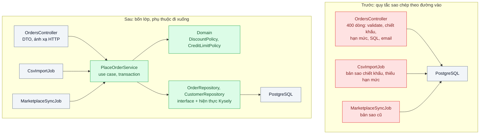
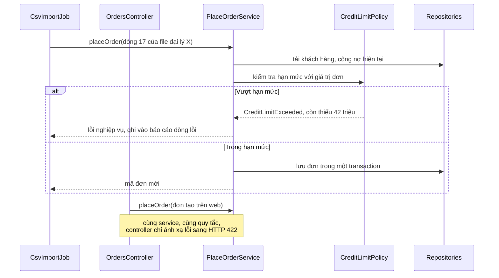

# Layered Architecture — Logic nghiệp vụ nằm trong controller, không test được, sửa một chỗ hỏng ba chỗ

| Scope | Mức độ | Trạng thái | Pattern gốc | Cập nhật |
|---|---|---|---|---|
| 08 · backend / monolithics | 🟢 Cơ bản | 📋 Kế hoạch | Layering, Service Layer, Repository — Fowler, *PoEAA* (2002) | 2026-10-06 |

> **Một câu tóm tắt:** Tách ứng dụng thành các lớp có trách nhiệm rõ (nhận request, điều phối use case, quy tắc nghiệp vụ, truy cập dữ liệu) với phụ thuộc chỉ đi một chiều, để mỗi quy tắc nằm đúng một chỗ, mọi đường vào (HTTP, import file, job) dùng chung nó và test được không cần HTTP hay DB.

## 1. Bài toán thực tế (What)

**Bối cảnh** *(doanh nghiệp giả định, số liệu minh họa)*
Công ty phân phối vật tư dùng hệ thống CRM và quản lý đơn hàng tự xây bằng NestJS từ 4 năm trước, khoảng 120.000 dòng TypeScript, 6 kỹ sư. Đơn đến từ ba đường: nhân viên tạo trên web, đại lý tải file CSV, và một job đồng bộ từ sàn TMĐT. Phương thức `OrdersController.create()` dài khoảng 400 dòng: validate body, tính chiết khấu theo hạng khách, kiểm hạn mức công nợ bằng SQL viết tay, ghi đơn, gửi email.

**Triệu chứng người kinh doanh nhìn thấy**
- Đơn nhập từ CSV của đại lý không bị kiểm hạn mức công nợ; quý trước phát sinh nợ khó đòi vì một đại lý đặt vượt hạn mức nhiều lần.
- Phòng kinh doanh đổi chính sách chiết khấu hạng Vàng; web áp dụng ngay, file CSV và đơn từ sàn vẫn tính theo chính sách cũ suốt hai tuần.
- Mỗi lần sửa quy tắc giá, đội QA phải kiểm tay lại toàn bộ luồng đặt hàng trong 2 ngày vì "không biết còn chỗ nào dùng".

**Nguyên nhân kỹ thuật**
Quy tắc nghiệp vụ nằm trong controller, trộn với việc đọc request và câu SQL. Khi cần cùng quy tắc ở đường vào khác (job import, job đồng bộ), cách nhanh nhất là sao chép đoạn code; ba bản sao trôi dần khỏi nhau. Muốn test quy tắc chiết khấu phải dựng HTTP server và database, nên gần như không có test tự động; test duy nhất là test e2e chậm. Không có quy ước nào ngăn controller gọi thẳng DB hay job gọi vào controller.

**Ràng buộc**
- Không viết lại hệ thống; refactor từng luồng trong khi vẫn phát hành hằng tuần.
- Giữ NestJS và PostgreSQL; không thêm hạ tầng.
- Hành vi của luồng đặt hàng qua web không đổi (trừ lỗi đã biết), có bằng chứng bằng test.

## 2. Vì sao dùng pattern này (Why)

**Nguyên nhân gốc mà pattern nhắm vào:** không có ranh giới giữa "cách nhận yêu cầu" và "quy tắc nghiệp vụ", nên quy tắc bị nhân bản theo số đường vào và không tách ra để test được.

**Pattern giải quyết thế nào:** Fowler mô tả Layering như việc chia hệ thống thành các lớp chồng lên nhau, lớp trên dùng lớp dưới, lớp dưới không biết lớp trên. Bài này dùng bốn lớp: *presentation* (controller, DTO, ánh xạ lỗi sang HTTP), *service layer* (mỗi use case một service như `PlaceOrderService`, định ranh giới transaction và điều phối), *domain* (quy tắc chiết khấu, hạn mức là hàm hoặc lớp thuần, không biết NestJS hay SQL), *data source* (Repository: interface ở phía domain, hiện thực bằng Kysely). Service Layer theo PoEAA là "ranh giới ứng dụng": mọi đường vào, dù là HTTP, CSV hay job, đều gọi cùng một service, nên quy tắc chỉ tồn tại một nơi. Hướng phụ thuộc được kiểm tự động trong CI bằng dependency-cruiser, không dựa vào lời dặn.

**Lựa chọn khác đã cân nhắc**

| Lựa chọn | Giải quyết được gì | Vì sao không chọn (ở bài này) |
|---|---|---|
| Giữ nguyên + tối ưu nhỏ (gom đoạn trùng vào file `utils/pricing.ts`) | Giảm trùng lặp nhanh | Không có ranh giới: helper vẫn gọi DB, controller vẫn chứa phần còn lại; không ngăn sao chép lần sau |
| Hexagonal (bài 04) ngay từ đầu | Cô lập mọi phụ thuộc ngoài | Nhiều khái niệm mới cùng lúc cho đội; lớp và hướng phụ thuộc là bước đầu cần có trước |
| Viết lại module đơn hàng | Thiết kế sạch | Rủi ro cao, dừng phát hành; mất các quy tắc ngầm chỉ code cũ biết |
| Layering + Service Layer + Repository, refactor theo luồng (chọn) | Một chỗ cho mỗi quy tắc, test được, áp dần | Thêm vài file mỗi use case; cần kỷ luật và công cụ kiểm hướng phụ thuộc |

## 3. Thiết kế hệ thống (How)

### 3.1 Kiến trúc trước và sau



### 3.2 Luồng chính



### 3.3 Thành phần và trách nhiệm

| Thành phần | Trách nhiệm | Quyết định thiết kế đáng chú ý |
|---|---|---|
| Controller, job, CLI | Đọc đầu vào, validate hình dạng (DTO), gọi service, ánh xạ kết quả | Không import repository hay DB client; không chứa `if` nghiệp vụ |
| `PlaceOrderService` | Một use case: tải dữ liệu, gọi domain, lưu trong một transaction, phát việc phụ (email) | Ranh giới transaction nằm ở đây; trả lỗi nghiệp vụ có kiểu, không trả mã HTTP |
| Domain policy | Quy tắc chiết khấu, hạn mức công nợ | Hàm thuần nhận dữ liệu, trả kết quả; test không cần mock |
| Repository | Truy cập dữ liệu theo khái niệm nghiệp vụ (`findCustomerWithDebt`) | Interface đặt cạnh service; hiện thực Kysely ở thư mục `infrastructure` |
| Quy tắc dependency-cruiser | Cấm controller import `infrastructure`, cấm domain import NestJS hoặc Kysely | Chạy trong CI, báo lỗi có tên file và luật bị vi phạm |

### 3.4 Điểm dễ sai khi triển khai
- Service "mỏng như giấy" chỉ chuyển tiếp xuống repository, còn quy tắc vẫn nằm trong controller: có lớp nhưng không có ranh giới.
- Repository trả về kiểu của ORM hoặc query builder (`Selectable<OrdersTable>`) lên tận controller: lớp dưới rò ra lớp trên. Trả kiểu dữ liệu của domain hoặc DTO.
- Ném `HttpException` từ service: job CSV nhận lỗi HTTP vô nghĩa. Service ném lỗi nghiệp vụ, lớp presentation ánh xạ.
- Refactor mà không có test đặc tả hành vi cũ: "sạch hơn" nhưng đổi hành vi âm thầm.

## 4. Tech stack và tác động (Impact techstack)

| Lớp | Công nghệ chọn | Vì sao chọn | Thay thế tương đương |
|---|---|---|---|
| Ứng dụng | TypeScript 5 strict, NestJS 10 (module, controller, provider, DI) | Stack hiện tại; DI giúp thay repository bằng bản giả trong test | Fastify + tự ghép phụ thuộc |
| Truy cập dữ liệu | Kysely trên PostgreSQL 16 | Query builder có type, SQL tường minh, dễ đặt sau interface repository | Prisma, TypeORM |
| Kiểm hướng phụ thuộc | dependency-cruiser | Khai báo luật theo đường dẫn, chạy trong CI, xuất đồ thị | `eslint-plugin-boundaries`, Nx module boundaries |
| Test | Vitest (unit, service), Supertest (ít e2e) | Nhanh; test domain không cần container | Jest |
| Đo độ phức tạp | ESLint `max-lines-per-function`, `complexity` | Phát hiện controller phình lại | SonarQube |

**Thay đổi so với hệ thống hiện tại:** mỗi use case thêm một service và một hoặc hai repository; controller và job được cắt mỏng; thêm cấu hình dependency-cruiser vào CI. Đội cần thống nhất quy ước thư mục và học viết test đặc tả trước khi refactor.

## 5. Kết quả đầu ra và cách đo (Output impact)

| Chỉ số | Trước (minh họa) | Mục tiêu khi thực hành | Cách đo |
|---|---|---|---|
| Số nơi hiện thực quy tắc chiết khấu và hạn mức | 3 | 1 | Tìm kiếm mã nguồn theo tên quy tắc; review danh sách nơi gọi `DiscountPolicy` |
| Vi phạm hướng phụ thuộc | không kiểm, ước tính hàng chục | 0 | Báo cáo dependency-cruiser trong CI |
| Thời gian chạy bộ test quy tắc đặt hàng | 6 phút (e2e, cần DB) | < 10 giây | Vitest cho domain và service, đo thời gian trong CI |
| Độ phủ test của service và domain đặt hàng | khoảng 5% | ≥ 80% | Vitest coverage (v8) |
| Số dòng lớn nhất của một hàm trong controller | 400 | ≤ 30 | ESLint `max-lines-per-function` |
| Đơn từ CSV vượt hạn mức được chấp nhận | có | 0 | Test service với dữ liệu vượt hạn mức qua cả ba đường vào |

> Số "trước" là minh họa để hình dung bài toán. Số "mục tiêu" chỉ được coi là đạt khi có số đo thật
> ở mục 8 kèm môi trường đo.

**Tác động nghiệp vụ mong đợi:** chính sách giá và công nợ áp dụng đồng nhất cho mọi kênh đặt hàng ngay khi phát hành; thời gian kiểm thử mỗi lần đổi chính sách giảm từ ngày xuống giờ.

## 6. Đánh đổi và khi KHÔNG nên dùng

**Đánh đổi**
- Nhiều file và lớp gián tiếp hơn; thay đổi nhỏ có thể chạm ba file.
- Dễ biến thành nghi thức: lớp tồn tại nhưng không mang trách nhiệm thật.

**Không nên dùng khi**
- Ứng dụng CRUD mỏng, hầu như không có quy tắc (trang quản trị danh mục): controller gọi repository là đủ, service chỉ là chuyển tiếp.
- Script dùng một lần hoặc nguyên mẫu để thử ý tưởng: cấu trúc lớp làm chậm việc học từ người dùng.

**Liên quan**
- [`../02-background-job-trong-monolith-xuat-excel-lam-treo-web/`](../02-background-job-trong-monolith-xuat-excel-lam-treo-web/) — job là một đường vào nữa, gọi cùng service.
- [`../03-domain-model-vs-transaction-script-tinh-phi-bao-hiem-1200-dong/`](../03-domain-model-vs-transaction-script-tinh-phi-bao-hiem-1200-dong/) — khi lớp domain cần mô hình giàu hơn hàm thuần.
- [`../04-hexagonal-architecture-doi-cong-thanh-toan-phai-sua-20-file/`](../04-hexagonal-architecture-doi-cong-thanh-toan-phai-sua-20-file/) — đảo phụ thuộc với dịch vụ ngoài.
- [`../../09-backend-monorepo/04-module-boundaries-frontend-import-thang-vao-repository-backend/`](../../09-backend-monorepo/04-module-boundaries-frontend-import-thang-vao-repository-backend/) — kiểm ranh giới bằng công cụ ở mức repo.

## 7. Cơ sở tham khảo

- Martin Fowler, *Patterns of Enterprise Application Architecture*, Addison-Wesley, 2002, ch.1 "Layering" — https://martinfowler.com/eaaCatalog/ — lý do phân lớp, ba lớp chính và quy tắc lớp dưới không biết lớp trên.
- Martin Fowler, *PoEAA*, "Service Layer" — https://martinfowler.com/eaaCatalog/serviceLayer.html — ranh giới ứng dụng dùng chung cho nhiều loại client, nơi điều phối transaction.
- Martin Fowler, *PoEAA*, "Repository" — https://martinfowler.com/eaaCatalog/repository.html — truy cập dữ liệu qua giao diện dạng tập hợp theo khái niệm nghiệp vụ.
- NestJS docs, "Controllers", "Providers", "Modules" — https://docs.nestjs.com/ — cách hiện thực các lớp và tiêm phụ thuộc trong framework đang dùng.
- dependency-cruiser docs — https://github.com/sverweij/dependency-cruiser — khai báo và kiểm luật phụ thuộc giữa thư mục trong CI.

## 8. Kế hoạch thực hành

- [ ] Bước 1: dựng app NestJS + PostgreSQL 16 bằng Docker Compose với luồng đặt hàng "kiểu cũ": controller 400 dòng, job CSV và job đồng bộ chứa bản sao quy tắc.
- [ ] Bước 2: đo "trước": viết test đặc tả hành vi luồng web (e2e), chạy dependency-cruiser ở chế độ báo cáo, đo thời gian test và độ phủ; ghi lại lỗi CSV vượt hạn mức.
- [ ] Bước 3: áp dụng pattern: tách `DiscountPolicy`, `CreditLimitPolicy`, `PlaceOrderService`, repository; chuyển ba đường vào sang gọi service; bật luật dependency-cruiser chặn trong CI.
- [ ] Bước 4: đo "sau": độ phủ, thời gian test, số vi phạm, số dòng hàm lớn nhất; ghi số thật và môi trường vào mục 5.
- [ ] Bước 5: viết test: (a) đơn vượt hạn mức bị từ chối qua cả web, CSV và job đồng bộ; (b) đổi chính sách chiết khấu một chỗ, cả ba đường vào áp dụng; (c) controller import repository làm CI thất bại.

**Cấu trúc code dự kiến**
```text
src/
  truoc/orders.controller.ts                 # 400 dòng, tái hiện triệu chứng
  truoc/csv-import.job.ts
  sau/orders/presentation/orders.controller.ts
  sau/orders/presentation/csv-import.job.ts
  sau/orders/application/place-order.service.ts    # [PATTERN] Service Layer, transaction
  sau/orders/domain/discount-policy.ts             # [PATTERN] quy tắc thuần
  sau/orders/domain/credit-limit-policy.ts
  sau/orders/application/order-repository.ts       # interface
  sau/orders/infrastructure/kysely-order-repository.ts
test/
  over-credit-limit-rejected-on-every-entry.test.ts
  discount-policy-changed-in-one-place.test.ts
  place-order.service.test.ts
.dependency-cruiser.cjs                      # [PATTERN] luật hướng phụ thuộc
docker-compose.yml
```

**Cách chạy** *(điền khi bắt đầu code)*
```bash
docker compose up -d
pnpm install && pnpm test && pnpm depcruise
```
