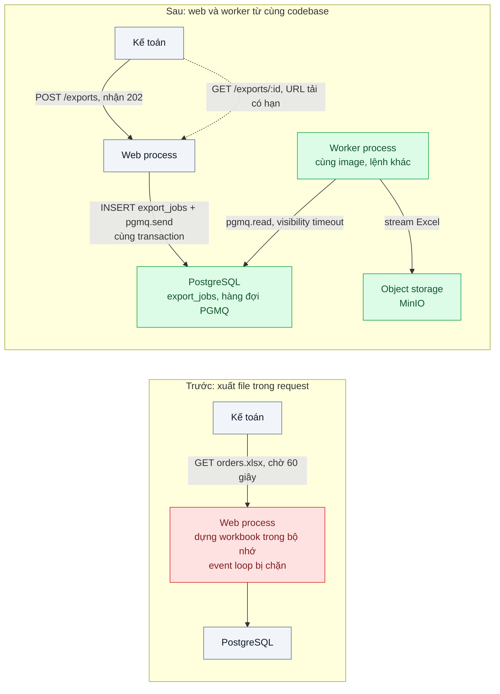
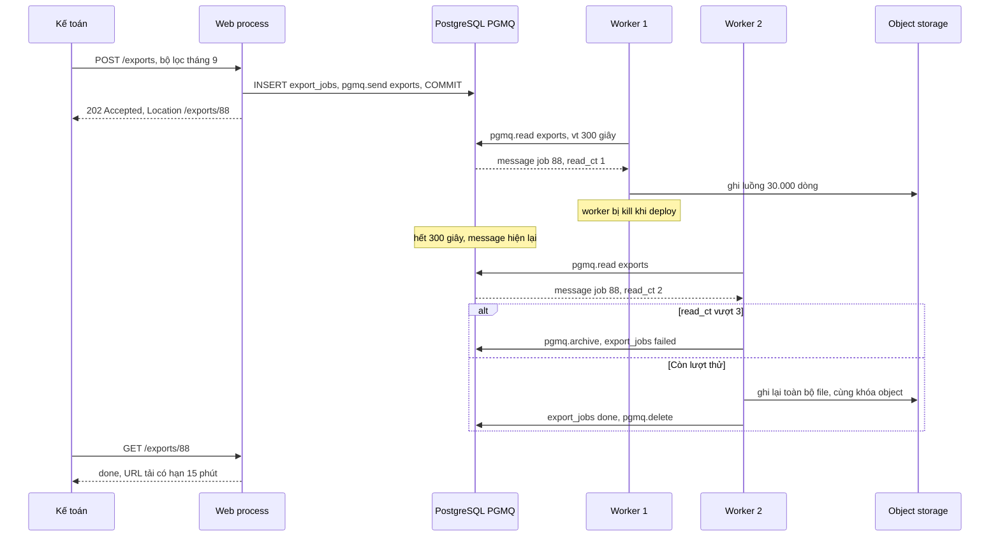

# Background Jobs in a Monolith — Xuất Excel 50k dòng làm treo tiến trình web

| Scope | Mức độ | Trạng thái | Pattern gốc | Cập nhật |
|---|---|---|---|---|
| 08 · backend / monolithics | 🟢 Cơ bản | 📋 Kế hoạch | Asynchronous Request-Reply — Azure Architecture Center; process types — *The Twelve-Factor App* (2011) | 2026-10-06 |

> **Một câu tóm tắt:** Đưa việc nặng (xuất Excel) ra khỏi request web: API ghi một job vào hàng đợi trong cùng database rồi trả `202 Accepted` ngay, một tiến trình worker chạy từ cùng codebase lấy job, tạo file theo luồng và báo khi xong, nên web không bao giờ bị chặn.

## 1. Bài toán thực tế (What)

**Bối cảnh** *(doanh nghiệp giả định, số liệu minh họa)*
SaaS B2B quản lý bán hàng cho chuỗi cửa hàng, khoảng 300 doanh nghiệp khách hàng, monolith NestJS chạy 2 instance sau load balancer, PostgreSQL 16. Kế toán của khách thường xuất báo cáo đơn hàng tháng ra Excel, 20.000–50.000 dòng. Endpoint `GET /reports/orders.xlsx` đọc toàn bộ dòng vào bộ nhớ, dựng workbook rồi trả file trong cùng request.

**Triệu chứng người kinh doanh nhìn thấy**
- Ngày cuối tháng, khi vài kế toán cùng xuất báo cáo, toàn bộ hệ thống chậm hoặc treo: nhân viên bán hàng ở cửa hàng không tạo được đơn trong vài phút.
- File lớn thường lỗi "504 Gateway Timeout" sau 60 giây; kế toán bấm lại nhiều lần, làm tình hình tệ hơn.
- Có lúc instance bị khởi động lại giữa chừng vì health check thất bại, mọi người dùng đang thao tác trên instance đó mất phiên làm việc.

**Nguyên nhân kỹ thuật**
Node.js xử lý mọi request trên một event loop. Dựng workbook 50.000 dòng là công việc CPU đồng bộ kéo dài vài giây mỗi lần, trong thời gian đó event loop không phục vụ được request nào khác, kể cả health check. Toàn bộ dữ liệu và workbook nằm trong bộ nhớ, đẩy heap lên hơn 1 GB. Request dài hơn timeout của load balancer bị cắt dù server vẫn tiếp tục làm, nên mỗi lần bấm lại là thêm một lần tốn tài nguyên vô ích.

**Ràng buộc**
- Không tách thành microservice; worker là một tiến trình khác của cùng codebase và cùng image.
- Không thêm hạ tầng hàng đợi mới nếu PostgreSQL đáp ứng được.
- Kế toán phải biết tiến độ và tải được file khi xong, kể cả khi đóng trình duyệt rồi mở lại.
- Bấm "Xuất" hai lần với cùng bộ lọc không tạo hai job.

## 2. Vì sao dùng pattern này (Why)

**Nguyên nhân gốc mà pattern nhắm vào:** việc nặng và dài chạy trong cùng tiến trình và cùng vòng đời với request web, nên chiếm tài nguyên dành cho mọi người dùng khác.

**Pattern giải quyết thế nào:** Asynchronous Request-Reply (Azure) tách yêu cầu khỏi kết quả: client gửi yêu cầu, server ghi nhận và trả `202 Accepted` kèm header `Location` trỏ tới endpoint trạng thái; client hỏi trạng thái (hoặc nhận thông báo) và tải kết quả khi xong. Twelve-Factor App gọi các tiến trình như `web` và `worker` là các *process type* của cùng một ứng dụng, scale độc lập bằng số tiến trình. Ghép lại: API ghi dòng `export_jobs` và gửi message vào hàng đợi PGMQ *trong cùng một transaction*, nên không có job "ma" hoặc job bị mất. Worker đọc message với visibility timeout; nếu worker chết giữa chừng, message tự hiện lại cho worker khác. Worker đọc dữ liệu theo cursor và ghi Excel theo luồng ra object storage, bộ nhớ không phụ thuộc số dòng.

**Lựa chọn khác đã cân nhắc**

| Lựa chọn | Giải quyết được gì | Vì sao không chọn (ở bài này) |
|---|---|---|
| Giữ nguyên + tối ưu nhỏ (tăng timeout lên 5 phút, tăng RAM) | File lớn không còn 504 | Event loop vẫn bị chặn, các người dùng khác vẫn treo |
| `worker_threads` trong tiến trình web | Không chặn event loop | Vẫn chia CPU và bộ nhớ với web; mất job khi instance khởi động lại; không có hàng đợi, không giới hạn đồng thời |
| BullMQ trên Redis | Thư viện job giàu tính năng (tiến độ, retry, lịch) | Thêm Redis vào hạ tầng; không ghi job nguyên tử cùng transaction PostgreSQL; là phương án thay thế tốt nếu đã có Redis |
| PGMQ + process type `worker` + 202 Accepted (chọn) | Web không bị chặn, job bền vững, ghi nguyên tử với dữ liệu, không thêm hạ tầng | Worker hỏi hàng đợi định kỳ; thông lượng hàng đợi giới hạn bởi PostgreSQL |

## 3. Thiết kế hệ thống (How)

### 3.1 Kiến trúc trước và sau



### 3.2 Luồng chính



### 3.3 Thành phần và trách nhiệm

| Thành phần | Trách nhiệm | Quyết định thiết kế đáng chú ý |
|---|---|---|
| `ExportsController` | `POST /exports` trả 202 + `Location`; `GET /exports/:id` trả trạng thái và URL tải | Không làm việc nặng nào trong request |
| Bảng `export_jobs` | Trạng thái job (queued, running, done, failed), bộ lọc, khóa object | Unique một phần theo người dùng + hash bộ lọc khi đang queued/running để chặn job trùng |
| Hàng đợi PGMQ `exports` | Giao job cho worker, tự hiện lại khi worker chết | Gửi trong cùng transaction với `export_jobs`; `read_ct` để giới hạn số lần thử |
| Worker process | Đọc job, đọc dữ liệu theo cursor, ghi Excel theo luồng, upload | Cùng image với web, lệnh khởi động khác; giới hạn số job đồng thời mỗi worker |
| Object storage | Lưu file kết quả, cấp URL tải có hạn | Khóa object theo id job để chạy lại thì ghi đè, không sinh file rác |

### 3.4 Điểm dễ sai khi triển khai
- Gửi message *sau* khi commit bằng một lệnh riêng: tiến trình chết giữa hai bước để lại job "queued" vĩnh viễn. PGMQ cho phép gửi trong cùng transaction, hãy dùng.
- Visibility timeout ngắn hơn thời gian xử lý thật: job đang chạy hiện lại và worker thứ hai làm trùng. Đặt theo p99 thời gian xử lý và gia hạn nếu cần.
- Vẫn dựng toàn bộ workbook trong bộ nhớ ở worker: chỉ dời vấn đề sang chỗ khác. Đọc theo cursor, ghi theo luồng.
- Không giới hạn đồng thời: 50 kế toán cùng xuất là 50 truy vấn quét lớn đồng thời vào DB; giới hạn số worker và cân nhắc dùng read replica.

## 4. Tech stack và tác động (Impact techstack)

| Lớp | Công nghệ chọn | Vì sao chọn | Thay thế tương đương |
|---|---|---|---|
| Ứng dụng | TypeScript strict, NestJS 10; hai entrypoint `main.web.ts` và `main.worker.ts` | Cùng module, cùng service, khác process type | Fastify |
| Hàng đợi | PGMQ (extension PostgreSQL) | Gửi job nguyên tử với dữ liệu, visibility timeout, archive; không thêm hạ tầng | BullMQ trên Redis 7 |
| Đọc dữ liệu | Kysely + cursor phía server của PostgreSQL | Bộ nhớ không tăng theo số dòng | `pg-cursor` |
| Ghi Excel | ExcelJS chế độ streaming writer (cần xác minh API) | Ghi từng dòng ra stream thay vì giữ cả workbook | Xuất CSV khi khách chấp nhận |
| Lưu file | MinIO (API S3) + presigned URL | Không giữ file trên đĩa của container | S3, GCS |
| Đo | k6, metric event loop lag của `prom-client`, `process.memoryUsage()` | Chứng minh web không còn bị chặn khi có export | Clinic.js |
| Hạ tầng local | Docker Compose: PostgreSQL có PGMQ, MinIO, web, worker | Một lệnh dựng đủ | — |

**Thay đổi so với hệ thống hiện tại:** thêm bảng `export_jobs`, hàng đợi PGMQ, entrypoint worker và MinIO; đổi UI từ "bấm là tải" sang "bấm, chờ, tải". Vận hành thêm một process type phải deploy, scale và giám sát (độ dài hàng đợi, số job failed).

## 5. Kết quả đầu ra và cách đo (Output impact)

| Chỉ số | Trước (minh họa) | Mục tiêu khi thực hành | Cách đo |
|---|---|---|---|
| p95 các API khác khi 5 export 50.000 dòng chạy cùng lúc | 8.000 ms, có timeout | < 200 ms (như lúc không có export) | k6 gọi `POST /orders` liên tục trong khi kích hoạt 5 export |
| Event loop lag p99 của web process khi có export | vài giây | < 50 ms | Metric event loop lag của `prom-client`, Prometheus |
| Bộ nhớ đỉnh khi xuất 50.000 dòng | 1,5 GB ở web process | < 200 MB ở worker | `process.memoryUsage().rss` lấy mẫu mỗi giây |
| Tỷ lệ export lỗi 504 | khoảng 30% file lớn | 0 | Log load balancer, trạng thái `export_jobs` |
| Job trùng khi bấm "Xuất" 5 lần liên tiếp | 5 | 1 | Test tích hợp đếm dòng `export_jobs` |
| Job hoàn thành sau khi worker bị kill giữa chừng | mất | 100% sau khi thử lại | Test: `docker kill` worker, chờ visibility timeout, kiểm trạng thái done |

> Số "trước" là minh họa để hình dung bài toán. Số "mục tiêu" chỉ được coi là đạt khi có số đo thật
> ở mục 8 kèm môi trường đo.

**Tác động nghiệp vụ mong đợi:** ngày chốt sổ cuối tháng không còn làm treo bán hàng ở cửa hàng; kế toán nhận file chắc chắn thay vì thử lại nhiều lần.

## 6. Đánh đổi và khi KHÔNG nên dùng

**Đánh đổi**
- Trải nghiệm đổi từ đồng bộ sang bất đồng bộ: cần UI trạng thái và thông báo.
- Thêm một process type, thêm một nơi có thể hỏng (worker dừng thì hàng đợi dồn).
- Job phải idempotent vì có thể chạy lại.

**Không nên dùng khi**
- Việc xong dưới vài trăm mili-giây và không chặn event loop: làm thẳng trong request đơn giản hơn.
- Người dùng cần kết quả ngay để làm bước tiếp theo trong cùng màn hình (tính giá giỏ hàng): tối ưu truy vấn thay vì đẩy ra nền.
- Lượng job rất lớn (hàng nghìn mỗi giây) hoặc cần định tuyến phức tạp: hàng đợi trên PostgreSQL thành điểm nghẽn, cân nhắc broker riêng (scope 14).

**Liên quan**
- [`../01-layered-architecture-logic-nam-trong-controller/`](../01-layered-architecture-logic-nam-trong-controller/) — worker là một đường vào gọi cùng service.
- [`../../14-backend-queueing/01-work-queue-gui-100k-email-lam-treo-api/`](../../14-backend-queueing/01-work-queue-gui-100k-email-lam-treo-api/) — work queue và competing consumers sâu hơn.
- [`../../13-backend-transporter/05-async-request-reply-xu-ly-30-giay-http-timeout/`](../../13-backend-transporter/05-async-request-reply-xu-ly-30-giay-http-timeout/) — cùng pattern ở biên API.
- [`../../15-backend-storage/02-presigned-url-valet-key-upload-500mb-qua-api-lam-nghen/`](../../15-backend-storage/02-presigned-url-valet-key-upload-500mb-qua-api-lam-nghen/) — URL tải có hạn cho file kết quả.

## 7. Cơ sở tham khảo

- Microsoft Azure Architecture Center, "Asynchronous Request-Reply pattern" — https://learn.microsoft.com/azure/architecture/patterns/async-request-reply — `202 Accepted`, header `Location`, endpoint trạng thái và cách client hỏi kết quả.
- Adam Wiggins, *The Twelve-Factor App*, "VI. Processes" và "VIII. Concurrency", 2011 — https://12factor.net/ — process type `web` và `worker` của cùng một ứng dụng, scale bằng số tiến trình.
- PGMQ docs — https://github.com/pgmq/pgmq — `send`, `read` với visibility timeout, `read_ct`, `archive`, `delete`.
- Node.js docs, hướng dẫn "Don't Block the Event Loop (or the Worker Pool)" — https://nodejs.org/docs/ — vì sao tác vụ CPU đồng bộ làm treo mọi request khác.
- BullMQ docs — https://docs.bullmq.io/ — phương án thay thế khi hệ thống đã có Redis.

## 8. Kế hoạch thực hành

- [ ] Bước 1: Docker Compose PostgreSQL 16 có PGMQ, MinIO, app NestJS; seed 50.000 đơn cho một tenant; endpoint xuất Excel đồng bộ trong `truoc/`.
- [ ] Bước 2: đo "trước": k6 gọi API tạo đơn liên tục, đồng thời kích hoạt 5 export; ghi p95, event loop lag, bộ nhớ, số 504.
- [ ] Bước 3: áp dụng pattern: `export_jobs` + `pgmq.send` cùng transaction, `POST /exports` trả 202, worker entrypoint đọc cursor và ghi luồng lên MinIO, giới hạn số lần thử, chặn job trùng.
- [ ] Bước 4: đo "sau" cùng kịch bản; ghi số thật và môi trường vào mục 5.
- [ ] Bước 5: viết test: (a) bấm 5 lần chỉ một job; (b) kill worker giữa chừng, job vẫn hoàn thành; (c) quá 3 lần lỗi thì job failed và message được archive; (d) rollback transaction thì không có message.

**Cấu trúc code dự kiến**
```text
src/
  main.web.ts
  main.worker.ts                           # [PATTERN] process type worker, cùng codebase
  truoc/orders-xlsx.controller.ts          # xuất trong request, tái hiện triệu chứng
  sau/exports/exports.controller.ts        # [PATTERN] 202 Accepted + Location
  sau/exports/create-export.service.ts     # INSERT export_jobs + pgmq.send cùng transaction
  sau/exports/export.worker.ts             # pgmq.read, cursor, ghi luồng, archive khi quá lượt
  sau/exports/xlsx-stream.writer.ts
test/
  repeated-clicks-create-one-job.test.ts
  job-completes-after-worker-kill.test.ts
  exhausted-retries-mark-job-failed.test.ts
  rollback-leaves-no-message.test.ts
bench/export-while-ordering.k6.js
docker-compose.yml
```

**Cách chạy** *(điền khi bắt đầu code)*
```bash
docker compose up -d
pnpm install && pnpm test
k6 run bench/export-while-ordering.k6.js
```
