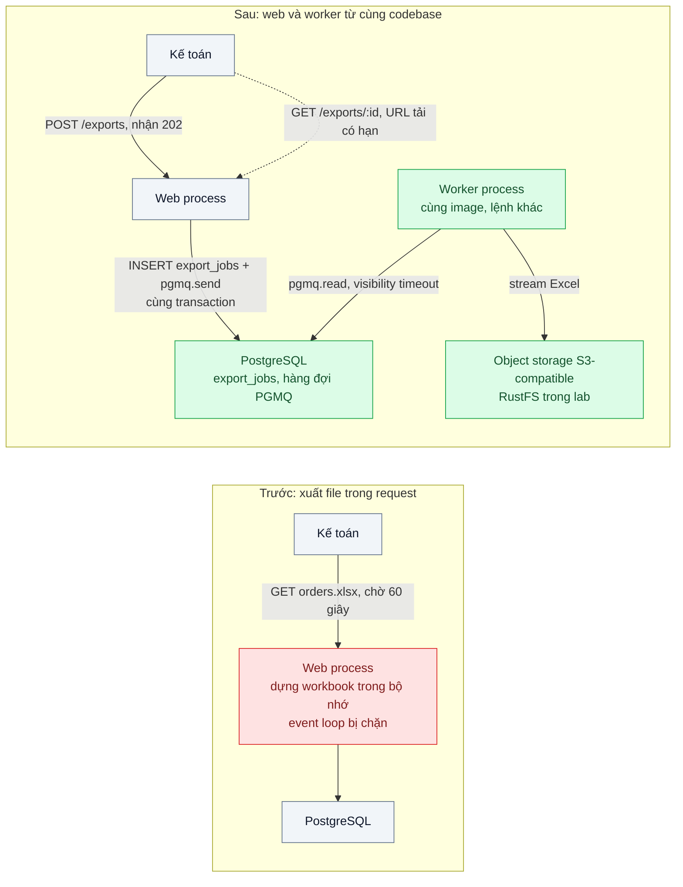
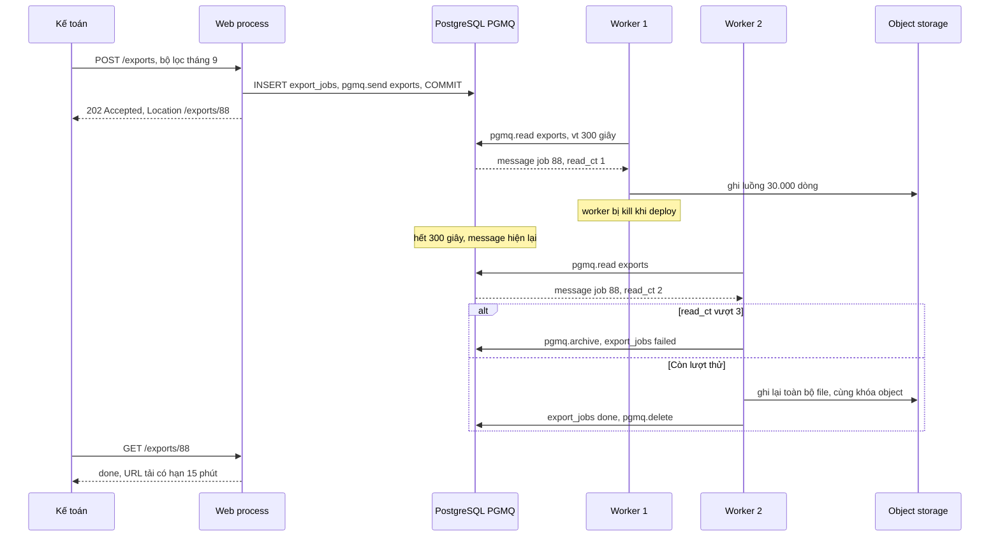

# Background Jobs in a Monolith — Xuất Excel 50k dòng làm treo tiến trình web

| Scope | Mức độ | Trạng thái | Pattern gốc | Cập nhật |
|---|---|---|---|---|
| 08 · backend / monolithics | 🟢 Cơ bản | ✅ Hoàn thành | Asynchronous Request-Reply — Azure Architecture Center; process types — *The Twelve-Factor App* (2011) | 2026-10-07 |

> **Một câu tóm tắt:** Đưa việc nặng (xuất Excel) ra khỏi request web: API ghi một job vào hàng đợi trong cùng database rồi trả `202 Accepted` ngay, một tiến trình worker chạy từ cùng codebase lấy job, tạo file theo luồng và báo khi xong, nên web không bao giờ bị chặn.

## 1. Bài toán thực tế (What)

**Bối cảnh** *(doanh nghiệp giả định, số liệu minh họa)*
SaaS B2B quản lý bán hàng cho chuỗi cửa hàng, khoảng 300 doanh nghiệp khách hàng, monolith NestJS chạy 2 instance sau load balancer, PostgreSQL 16. Kế toán của khách thường xuất báo cáo đơn hàng tháng ra Excel, 20.000–50.000 dòng. Endpoint `GET /reports/orders.xlsx` đọc toàn bộ dòng vào bộ nhớ, dựng workbook rồi trả file trong cùng request.

**Triệu chứng người kinh doanh nhìn thấy**
- Ngày cuối tháng, khi vài kế toán cùng xuất báo cáo, toàn bộ hệ thống chậm hoặc treo: nhân viên bán hàng ở cửa hàng không tạo được đơn trong vài phút.
- File lớn thường lỗi "504 Gateway Timeout" sau 60 giây; kế toán bấm lại nhiều lần, làm tình hình tệ hơn.
- Có lúc instance bị khởi động lại giữa chừng vì health check thất bại, mọi người dùng đang thao tác trên instance đó mất phiên làm việc.

**Nguyên nhân kỹ thuật**
Node.js xử lý mọi request trên một event loop. Dựng workbook 50.000 dòng là công việc CPU đồng bộ kéo dài vài giây mỗi lần, trong thời gian đó event loop không phục vụ được request nào khác, kể cả health check. Toàn bộ dữ liệu và workbook nằm trong bộ nhớ, đẩy heap lên hơn 1 GB. Request dài hơn timeout của load balancer bị cắt dù server vẫn tiếp tục làm, nên mỗi lần bấm lại là thêm một lần tốn tài nguyên vô ích.

**Ràng buộc**
- Không tách thành microservice; worker là một tiến trình khác của cùng codebase và cùng image.
- Không thêm hạ tầng hàng đợi mới nếu PostgreSQL đáp ứng được.
- Kế toán phải biết tiến độ và tải được file khi xong, kể cả khi đóng trình duyệt rồi mở lại.
- Bấm "Xuất" hai lần với cùng bộ lọc không tạo hai job.

## 2. Vì sao dùng pattern này (Why)

**Nguyên nhân gốc mà pattern nhắm vào:** việc nặng và dài chạy trong cùng tiến trình và cùng vòng đời với request web, nên chiếm tài nguyên dành cho mọi người dùng khác.

**Pattern giải quyết thế nào:** Asynchronous Request-Reply (Azure) tách yêu cầu khỏi kết quả: client gửi yêu cầu, server ghi nhận và trả `202 Accepted` kèm header `Location` trỏ tới endpoint trạng thái; client hỏi trạng thái (hoặc nhận thông báo) và tải kết quả khi xong. Twelve-Factor App gọi các tiến trình như `web` và `worker` là các *process type* của cùng một ứng dụng, scale độc lập bằng số tiến trình. Ghép lại: API ghi dòng `export_jobs` và gửi message vào hàng đợi PGMQ *trong cùng một transaction*, nên không có job "ma" hoặc job bị mất. Worker đọc message với visibility timeout; nếu worker chết giữa chừng, message tự hiện lại cho worker khác. Worker đọc dữ liệu theo cursor và ghi Excel theo luồng ra object storage, bộ nhớ không phụ thuộc số dòng.

**Lựa chọn khác đã cân nhắc**

| Lựa chọn | Giải quyết được gì | Vì sao không chọn (ở bài này) |
|---|---|---|
| Giữ nguyên + tối ưu nhỏ (tăng timeout lên 5 phút, tăng RAM) | File lớn không còn 504 | Event loop vẫn bị chặn, các người dùng khác vẫn treo |
| `worker_threads` trong tiến trình web | Không chặn event loop | Vẫn chia CPU và bộ nhớ với web; mất job khi instance khởi động lại; không có hàng đợi, không giới hạn đồng thời |
| BullMQ trên Redis | Thư viện job giàu tính năng (tiến độ, retry, lịch) | Thêm Redis vào hạ tầng; không ghi job nguyên tử cùng transaction PostgreSQL; là phương án thay thế tốt nếu đã có Redis |
| PGMQ + process type `worker` + 202 Accepted (chọn) | Web không bị chặn, job bền vững, ghi nguyên tử với dữ liệu, không thêm hạ tầng | Worker hỏi hàng đợi định kỳ; thông lượng hàng đợi giới hạn bởi PostgreSQL |

## 3. Thiết kế hệ thống (How)

### 3.1 Kiến trúc trước và sau



### 3.2 Luồng chính



### 3.3 Thành phần và trách nhiệm

| Thành phần | Trách nhiệm | Quyết định thiết kế đáng chú ý |
|---|---|---|
| `ExportsController` | `POST /exports` trả 202 + `Location`; `GET /exports/:id` trả trạng thái và URL tải | Không làm việc nặng nào trong request |
| Bảng `export_jobs` | Trạng thái job (queued, running, done, failed), bộ lọc, khóa object | Unique một phần theo người dùng + hash bộ lọc khi đang queued/running để chặn job trùng |
| Hàng đợi PGMQ `exports` | Giao job cho worker, tự hiện lại khi worker chết | Gửi trong cùng transaction với `export_jobs`; `read_ct` để giới hạn số lần thử |
| Worker process | Đọc job, đọc dữ liệu theo cursor, ghi Excel theo luồng, upload | Cùng image với web, lệnh khởi động khác; giới hạn số job đồng thời mỗi worker |
| Object storage | Lưu file kết quả, cấp URL tải có hạn | Khóa object theo id job để chạy lại thì ghi đè, không sinh file rác |

### 3.4 Điểm dễ sai khi triển khai
- Gửi message *sau* khi commit bằng một lệnh riêng: tiến trình chết giữa hai bước để lại job "queued" vĩnh viễn. PGMQ cho phép gửi trong cùng transaction, hãy dùng.
- Visibility timeout ngắn hơn thời gian xử lý thật: job đang chạy hiện lại và worker thứ hai làm trùng. Đặt theo p99 thời gian xử lý và gia hạn nếu cần.
- Vẫn dựng toàn bộ workbook trong bộ nhớ ở worker: chỉ dời vấn đề sang chỗ khác. Đọc theo cursor, ghi theo luồng.
- Không giới hạn đồng thời: 50 kế toán cùng xuất là 50 truy vấn quét lớn đồng thời vào DB; giới hạn số worker và cân nhắc dùng read replica.

**Gặp thật khi làm lab:**
- *Đo event loop từ trong chính tiến trình bị chặn thì đo sai.* Bản đầu của test "trước" dựng web trong cùng tiến trình với Vitest. Khi event loop bị chặn, vòng lặp gọi `GET /health` của test cũng đứng theo, nên lúc lần, lúc không bắt được lúc treo (một lần đo chỉ thấy 75 ms). Test và script đo vì vậy bật web và worker thành tiến trình riêng, lấy RSS bằng `ps` từ bên ngoài.
- *p99 của `monitorEventLoopDelay` che mất lúc bị chặn.* Timer 10 ms ghi khoảng 100 mẫu mỗi giây lúc rảnh, còn một lần bị chặn 3 giây chỉ thành một mẫu. Ở bản trước, p99 chỉ 86 – 136 ms trong khi giá trị lớn nhất là 1,7 – 4,4 s. Cần nhìn giá trị lớn nhất cùng độ trễ của request thật. Giá trị thô còn gồm cả chu kỳ 10 ms (lúc rảnh p50 khoảng 10,5 ms). Thử riêng: chặn 500 ms ngay trong callback vừa gọi `reset()` thì histogram không ghi lần chặn đó (lớn nhất 11,3 ms); chặn 100 ms sau `reset()` thì ghi 506 ms. Script đo reset trước khi bấm xuất nên không bị ảnh hưởng.
- *Heartbeat không phải tùy chọn khi job có thể dài hơn visibility timeout.* Gỡ `pgmq.set_vt` thì một job 3 giây với vt 2 giây bị worker thứ hai đọc lại và làm song song (`attempts` = 2). Kết quả cuối vẫn đúng vì cùng khóa object và cập nhật `done` idempotent, nhưng tốn gấp đôi. Có heartbeat thì visibility timeout không cần dài bằng job, và nên ngắn vì nó quyết định thời gian phục hồi: diễn tập kill với vt 10 giây mất 10,56 s mới xong, nên với 300 giây như cấu hình mặc định thì kế toán chờ thêm 5 phút.
- *`pgmq.pop` là at-most-once.* Lấy message bằng `pop` (đọc và xóa luôn) thì kill worker là mất job ngay, job kẹt ở `running` mãi mãi.
- *Event loop bị chặn làm hỏng cả kết nối, không chỉ làm chậm.* 2 trong 3 lượt đo bản trước có 112 và 121 request tạo đơn bị `connection reset by peer`, lượt còn lại không có; lượt chạy lại có 170 (thêm `dial: i/o timeout`). Lỗi này chỉ thấy khi tải mở có đủ VU: với `preAllocatedVUs` 50, lượt thử (`bench/results/trial/`) bị k6 bỏ 134 lượt (`dropped_iterations`) vì tạo VU giữa chừng không kịp, tức tải gửi tới server ít hơn lịch. Script đặt sẵn 400 VU.
- *Cả 5 export của bản trước xong cùng lúc ở giây thứ 13.* Request xen kẽ nhau trên một event loop nên không ai xong sớm. Bản sau với 1 worker cho file đầu sau khoảng 1,1 s.

## 4. Tech stack và tác động (Impact techstack)

| Lớp | Công nghệ chọn | Vì sao chọn | Thay thế tương đương |
|---|---|---|---|
| Ứng dụng | TypeScript strict, NestJS 10; hai entrypoint `main.web.ts` và `main.worker.ts` | Cùng module, cùng service, khác process type | Fastify |
| Hàng đợi | PGMQ (extension PostgreSQL) | Gửi job nguyên tử với dữ liệu, visibility timeout, archive; không thêm hạ tầng | BullMQ trên Redis 7 |
| Đọc dữ liệu | Kysely + cursor phía server của PostgreSQL | Bộ nhớ gần như không tăng theo số dòng (đo ở 5.1) | `pg-cursor` |
| Ghi Excel | ExcelJS 4.4.0 `stream.xlsx.WorkbookWriter` (`addRow(...).commit()`, `commit()`; đã kiểm trong lab) | Ghi từng dòng ra stream thay vì giữ cả workbook | Xuất CSV khi khách chấp nhận |
| Lưu file | Object storage có API S3 + presigned URL; lab dùng RustFS 1.0.1 thay MinIO | Không giữ file trên đĩa của container | S3, GCS, MinIO |
| Đo | k6 (mô hình mở), `perf_hooks.monitorEventLoopDelay`, RSS lấy bằng `ps` | Chứng minh web không còn bị chặn khi có export | `prom-client` + Prometheus, Clinic.js |
| Hạ tầng local | Docker Compose: PostgreSQL 16 có PGMQ, RustFS; web và worker chạy trên host | Một lệnh dựng đủ | — |

**Khi thực hành (lệch so với bảng trên):**
- *PostgreSQL có PGMQ:* image `ghcr.io/pgmq/pg16-pgmq:v1.13.0` của chính dự án PGMQ, dựng trên `postgres:16` (PostgreSQL 16.15, Debian), có bản arm64; `CREATE EXTENSION pgmq` cho bản 1.13.0. Danh sách tag lấy từ API registry của GHCR (14 tag, `v1.5.1` tới `v1.13.0` và `latest`); lab ghim `v1.13.0` thay vì `latest`. Chọn image có sẵn vì nó chạy được ngay trên máy arm64; cách cài PGMQ dạng SQL-only lên `postgres:16` không thử (chưa kiểm).
- *S3-compatible thay MinIO:* `minio/minio` trên Docker Hub trả "denied", `quay.io/minio/minio` không còn tag nào (người điều phối kiểm ngày 2026-10-06). Lab dùng RustFS 1.0.1 (`rustfs/rustfs:1.0.1`, tag ổn định mới nhất trên Docker Hub lúc làm lab, cập nhật ngày 2026-10-03, có arm64), một container, khóa truy cập qua `RUSTFS_ACCESS_KEY` / `RUSTFS_SECRET_KEY`, cổng host 59000, healthcheck `GET /health`. `bench/s3-compat-check.ts` chạy thật các thao tác bài cần bằng `@aws-sdk/client-s3`, `lib-storage` và `s3-request-presigner` 3.1147.0 với cấu hình checksum mặc định (kết quả ở mục 5.1). Phải bật `forcePathStyle`, vì RustFS chỉ nhận virtual-hosted-style khi cấu hình `RUSTFS_SERVER_DOMAINS`. Lý do chọn RustFS giữa các image kéo được, cùng những gì chưa kiểm, ghi ở `docs/nhat-ky-quyet-dinh.md`.
- *Đọc dữ liệu:* `.stream(1000)` của Kysely 0.29.6, cần truyền `cursor: Cursor` (`pg-cursor` 2.22.1) vào `PostgresDialect`. Đây là portal phía server của giao thức PostgreSQL, không phải `DECLARE CURSOR`.
- *Đo event loop:* không dùng `prom-client` và Prometheus. Web có endpoint nội bộ `GET /internal/runtime` đọc trực tiếp `perf_hooks.monitorEventLoopDelay` (resolution 10 ms) của Node. RSS của web và worker lấy bằng `ps` mỗi 200 ms từ tiến trình đo, để không phụ thuộc event loop của tiến trình đang bị đo.
- *Không có load balancer:* client hủy request sau 60 giây và tính là 504. Health check 2 lần/giây, timeout 2 giây là kịch bản k6 chạy song song với tải tạo đơn.
- *Process type:* web (`src/main.web.ts`) và worker (`src/main.worker.ts`) là hai tiến trình Node trên host, cùng codebase và cùng `SharedModule`, chỉ khác lệnh khởi động. Lab không đóng image; "cùng image" ở bảng trên là cách deploy, chưa làm ở đây. Worker chạy là NestJS application context (`createApplicationContext`), không mở cổng HTTP.
- *Phiên bản:* NestJS 10.4.22 như bài 08/01, TypeScript 5.9.3 cho đồng bộ với bài đó (bài này không dùng ESLint), `@Inject(...)` tường minh cho mọi tham số constructor (nhật ký quyết định, bài 08/01). AWS SDK v3 in cảnh báo: các bản phát hành sau tuần đầu tháng 1/2027 sẽ đòi Node ≥ 22. Lab ghim 3.1147.0, chạy được trên Node 20.19.6.
- *Thêm so với kế hoạch:* worker gia hạn visibility timeout bằng `pgmq.set_vt` (heartbeat, mỗi vt/3) trong lúc làm, nên job dài hơn visibility timeout không bị worker khác nhận làm trùng. Lỗi trong lúc làm thì job trở về `queued`, message hiện lại sau `min(vt, 2^read_ct)` giây. Kế toán xem tiến độ qua `rows_written`, cập nhật mỗi 1.000 dòng.

**Thay đổi so với hệ thống hiện tại:** thêm bảng `export_jobs`, hàng đợi PGMQ, entrypoint worker và object storage có API S3; đổi UI từ "bấm là tải" sang "bấm, chờ, tải". Vận hành thêm một process type phải deploy, scale và giám sát (độ dài hàng đợi, số job failed).

## 5. Kết quả đầu ra và cách đo (Output impact)

| Chỉ số | Trước (minh họa) | Mục tiêu khi thực hành | Cách đo |
|---|---|---|---|
| p95 các API khác khi 5 export 50.000 dòng chạy cùng lúc | 8.000 ms, có timeout | < 200 ms (như lúc không có export) | k6 gọi `POST /orders` liên tục trong khi kích hoạt 5 export |
| Event loop lag p99 của web process khi có export | vài giây | < 50 ms | Metric event loop lag của `prom-client`, Prometheus |
| Bộ nhớ đỉnh khi xuất 50.000 dòng | 1,5 GB ở web process | < 200 MB ở worker | `process.memoryUsage().rss` lấy mẫu mỗi giây |
| Tỷ lệ export lỗi 504 | khoảng 30% file lớn | 0 | Log load balancer, trạng thái `export_jobs` |
| Job trùng khi bấm "Xuất" 5 lần liên tiếp | 5 | 1 | Test tích hợp đếm dòng `export_jobs` |
| Job hoàn thành sau khi worker bị kill giữa chừng | mất | 100% sau khi thử lại | Test: `docker kill` worker, chờ visibility timeout, kiểm trạng thái done |

> Số "trước" là minh họa để hình dung bài toán. Số "mục tiêu" chỉ được coi là đạt khi có số đo thật;
> số đã đo nằm ở mục 5.1 bên dưới, kèm môi trường đo.

### 5.1 Số đã đo

**Môi trường:** MacBook Apple M1 Pro (8 nhân: 6 hiệu năng + 2 tiết kiệm điện, 16 GB RAM; macOS 26.6.2 / Darwin 25.6.0); Docker 28.5.1, 8 CPU, khoảng 7,6 GB RAM; PostgreSQL 16.15 + PGMQ 1.13.0 (`ghcr.io/pgmq/pg16-pgmq:v1.13.0`); RustFS 1.0.1; Node v20.19.6, pnpm 10.32.0; NestJS 10.4.22, Kysely 0.29.6, pg-cursor 2.22.1, ExcelJS 4.4.0, AWS SDK v3 3.1147.0, Vitest 5.0.3, k6 v1.4.2. Web, worker, k6 và script đo chạy trên host; PostgreSQL và RustFS chạy trong Docker; cùng lúc máy còn chạy container của dự án khác (MySQL, RabbitMQ) và ứng dụng desktop. Load average 1 phút của macOS đọc trước mỗi lượt là 3,73 – 8,91; CPU bận của máy ảo Docker trong lượt đo là 2,5 – 3,3 %. Seed: tenant 1 có 50.000 đơn tháng 9/2026 và 5 kế toán (đúng quy mô mục 1); đơn mới khi đo ghi vào tenant 2. Số thô ở `bench/results/main/` (không commit), lượt chạy lại từ volume sạch ở `bench/results/recheck/`.

**Tải nền + 5 export cùng lúc** (`pnpm bench:load` → `load-summary.json`, `load/<biến thể>-r<n>.json`, `load/*-k6.json`). k6 mô hình mở: 50 đơn/giây `POST /orders` và 2 health check/giây (timeout 2 s) trong 50 giây. Ở giây thứ 10, 5 kế toán cùng bấm xuất. Mỗi lượt bật tiến trình mới và xuất nóng một lần trước khi đo. 3 vòng, thứ tự ba biến thể xoay giữa các vòng. "Cửa sổ" là từ lúc bấm xuất tới lúc file cuối cùng tải xong; với `baseline` (không ai xuất) là 30 giây từ giây thứ 10. Độ trễ tính lại từ từng request bắt đầu trong cửa sổ, chỉ tính request thành công; request lỗi đếm riêng. Event loop delay là giá trị thô của `monitorEventLoopDelay`, gồm cả chu kỳ 10 ms của timer, nên lúc rảnh p50 khoảng 10,4 – 10,5 ms. Số là trung vị của 3 vòng, trong ngoặc là thấp nhất – cao nhất.

| Chỉ số trong cửa sổ | Không có export | Trước: xuất trong request | Sau: 202 + worker |
|---|---|---|---|
| Độ dài cửa sổ | 30 s | 13,01 s (12,98 – 13,68) | 4,12 s (4,11 – 4,93) |
| `POST /orders`: số request bắt đầu trong cửa sổ | 1.500 | 651 (649 – 684) | 206 (205 – 246) |
| `POST /orders` p50 | 4,67 ms (4,23 – 4,71) | 18,0 ms (12,2 – 155,7) | 1,85 ms (1,83 – 2,42) |
| `POST /orders` p95 | 10,34 ms (10,06 – 10,42) | 7.161 ms (6.888 – 7.299) | 5,15 ms (4,17 – 16,47) |
| `POST /orders` p99 | 15,07 ms (13,89 – 16,57) | 7.518 ms (7.323 – 7.691) | 6,23 ms (5,99 – 38,69) |
| `POST /orders` chậm nhất | 36,2 ms (20,8 – 90,6) | 7.842 ms (7.661 – 8.093) | 23,6 ms (8,0 – 44,2) |
| `POST /orders` thành công nhưng quá 1 s | 0 | 147 (144 – 153) | 0 |
| `POST /orders` lỗi kết nối (k6 `1220`, connection reset by peer) | 0 | 112 (0 – 121): 0, 112, 121 | 0 |
| Health check quá 2 s / tổng | 0/60 | 10/26 (9/26 – 10/28) | 0/9 – 0/10 |
| Health check lỗi liên tiếp dài nhất | 0 | 6 (2 – 9) | 0 |
| Event loop delay p99 của web | 13,62 ms (13,05 – 14,06) | 107,7 ms (86,4 – 136,2) | 11,59 ms (11,55 – 16,75) |
| Event loop delay lớn nhất của web | 29,0 ms (22,2 – 64,8) | 3.295 ms (1.653 – 4.421) | 12,35 ms (11,84 – 43,42) |
| RSS đỉnh của web | 122,6 MB (121,3 – 149,6) | 1.640 MB (1.586 – 1.835) | 118,9 MB (110,5 – 120,9) |
| RSS đỉnh của worker | — | — | 174,7 MB (168,8 – 201,8) |
| Thời gian từ lúc bấm tới khi có file (15 export mỗi bản) | — | 12,75 – 13,68 s, cả 5 file xong gần như cùng lúc | file đầu 1,07 – 1,09 s, file thứ năm 4,11 – 4,93 s |
| `POST /exports` trả 202 | — | — | 10 – 31 ms |
| Export quá 60 s (tính là 504) | — | 0/15 | 0/15 |

Ở bản trước, 5 request xuất chạy xen kẽ trên cùng một event loop. Một lần xuất riêng lẻ mất khoảng 2,6 – 2,7 s (`worker-kill.json`, `memory.json`), nhưng khi chạy chung thì không file nào xong trước giây thứ 12,7: mọi kế toán chờ nhau. Bản sau dùng 1 worker xử lý 1 job một lúc, nên 5 job chạy lần lượt, mỗi job khoảng 0,75 s. Ở bản sau, độ trễ tạo đơn trong cửa sổ còn thấp hơn lúc không có export (p95 5,15 so với 10,34 ms). Ngoài cửa sổ, cùng lượt đó cho p95 9,25 – 10,47 ms, ngang `baseline`. Nguyên nhân chưa tách riêng được; cửa sổ chỉ dài khoảng 4 giây, khoảng 206 request. Request lỗi kết nối ở bản trước chỉ xuất hiện khi event loop bị chặn và nhiều kết nối mới dồn tới cùng lúc. Máy đo có `kern.ipc.somaxconn` = 128, nên nghi là hàng đợi accept bị đầy; chưa kiểm riêng.

**Bộ nhớ và thời gian một lần xuất, không tải nền** (`pnpm bench:memory` → `memory.json`; 3 lần mỗi ô, mỗi lần một tiến trình mới đã xuất nóng 100 dòng; RSS lấy bằng `ps` mỗi 100 ms; "tăng thêm" là đỉnh trừ RSS ngay trước khi bấm). Thời gian của bản trước là cả request; của bản sau là `finished_at − started_at` của job.

| Số dòng | Trước: RSS đỉnh web | Trước: tăng thêm | Trước: thời gian | Sau: RSS đỉnh worker | Sau: tăng thêm | Sau: thời gian job |
|---|---|---|---|---|---|---|
| 10.000 | 259 MB (242 – 267) | 95 MB | 632 ms | 168,6 MB (130,5 – 184,3) | 10,8 MB | 231 ms |
| 50.000 | 848 MB (845 – 848) | 684 MB | 2.703 ms | 181,8 MB (178,1 – 193,4) | 18,2 MB | 834 ms |
| 200.000 | 2.164 MB (2.035 – 2.335) | 2.000 MB | 13.150 ms | 250,7 MB (247,7 – 282,0) | 87,6 MB | 3.161 ms |

Khi worker rảnh (đã xuất nóng), RSS khoảng 120 – 168 MB, chủ yếu là NestJS, AWS SDK và loader `tsx`. Phần một job 50.000 dòng thêm vào khoảng 17 – 30 MB ở lượt chính. Đo thêm 5 lần ô 50.000 dòng (`bench/results/extra-memory/memory.json`): worker 195,5 MB (176,7 – 202,3), tăng thêm 31,2 MB (15 – 36); web của bản trước 859 MB (803 – 900). RSS đỉnh của worker vẫn tăng khi số dòng tăng (thêm 87,6 MB ở 200.000 dòng), dù chậm hơn bản trước rất nhiều. Chưa tách riêng được phần nào là bộ đệm stream/upload (lib-storage giữ tối đa 2 part × 5 MiB), phần nào là rác GC chưa thu. File của bản sau lớn hơn khoảng 22 % (3,97 so với 3,26 MB ở 50.000 dòng), vì writer luồng tắt shared strings; nội dung giống hệt (test `export-file-content`).

**Bấm "Xuất" 5 lần cùng lúc, cùng người, cùng bộ lọc** (`pnpm bench:clicks` → `repeated-clicks.json`): bản trước dựng và trả 5 file đầy đủ (5 × 3,26 MB, xong sau 12,6 s); bản sau trả 5 phản hồi 202 cùng một job id, chỉ 1 phản hồi `created: true`, 1 dòng `export_jobs`, 1 message trong hàng đợi.

**Tiến trình chết giữa chừng** (`pnpm bench:kill` → `worker-kill.json`; SIGKILL như `docker kill`; 5 lần mỗi bản; worker dùng visibility timeout 10 giây thay vì 300 để diễn tập nhanh):
- Trước: kill web sau 1,31 – 1,34 s (khoảng nửa thời gian một lần xuất), cả 5 lần client nhận `fetch failed (other side closed)`, không có file: **0/5**.
- Sau: kill worker khi job đã ghi 25.000/50.000 dòng, bật worker mới ngay. Cả 5 job xong với `attempts` = 2, file tải về có đủ 50.000 dòng, hàng đợi trống: **5/5**. Từ lúc kill tới lúc xong mất 10,56 s (10,54 – 10,65), tức khoảng 10 giây visibility timeout cộng một lần xuất lại từ đầu. Lúc kill, job mới chạy chưa tới 1 giây, trước lần heartbeat đầu tiên (chu kỳ vt/3 ≈ 3,3 s), nên message hiện lại khoảng 10 giây sau lần đọc.

**Dịch vụ S3-compatible** (`pnpm bench:s3` → `s3-compat.json`): RustFS 1.0.1 đạt 13/13 thao tác. Gồm: tạo bucket idempotent; PutObject với checksum mặc định của SDK; upload stream qua `lib-storage` (1 MiB một part, 12 MiB multipart với ETag hậu tố `-3`); presigned GET tải bằng curl khớp sha256 và trả `Content-Disposition` theo `ResponseContentDisposition`. Với TTL 5 s, URL còn hạn ở giây thứ 3 và hết hạn ở giây thứ 7 (403 `AccessDenied`, "Request has expired"). Chữ ký bị sửa và ký bằng secret sai đều trả 403 `SignatureDoesNotMatch`. Ghi đè cùng khóa và presigned PUT bằng curl đều đạt; tải sau `DeleteObject` trả 404 `NoSuchKey`.

**Test và phép thử âm:** `pnpm test` có 13 test trong 6 file, chạy trên PostgreSQL và RustFS thật, khoảng 29 giây. `pnpm bench:drills` (→ `negative-drills.json`) sửa tạm mã nguồn rồi chạy file test tương ứng. Trước khi sửa và sau khi khôi phục, file test đều xanh; nội dung file khôi phục khớp sha256.

| Gỡ phần nào của pattern | Test đỏ | Lý do đỏ |
|---|---|---|
| Khóa chống trùng (mỗi lần bấm một `filter_hash` khác) | 1/4 | 5 job thay vì 1 |
| Gửi message trong transaction (`pgmq.send` trên kết nối riêng) | 1/3 | COMMIT thất bại vẫn để lại 1 message mồ côi |
| Visibility timeout (`pgmq.pop` thay `pgmq.read`) | 2/2 | kill worker thì message mất ngay, job kẹt `running` |
| Heartbeat gia hạn visibility timeout | 1/2 | job 3 giây với vt 2 giây bị đọc 2 lần, hai worker cùng làm |
| Giới hạn số lần thử theo `read_ct` | 1/1 | job không bao giờ `failed`, thử lại mãi tới khi test hết 30 giây |

Cặp test `web-not-blocked-during-export` là phép so trước/sau trên cùng dữ liệu 50.000 dòng: health check của bản trước chờ hơn 500 ms; bản sau dưới 200 ms trong suốt lúc worker xuất.

**So với mục tiêu:**
- p95 các API khác khi có 5 export: 5,15 ms (4,17 – 16,47) ở bản sau. Đạt mục tiêu < 200 ms và không chậm hơn lúc không có export (10,34 ms). Bản trước 7.161 ms, kèm 0 – 121 request lỗi kết nối mỗi lượt.
- Event loop p99 của web: 11,59 ms (11,55 – 16,75) ở bản sau. Đạt mục tiêu < 50 ms; giá trị lớn nhất 12,35 ms (11,84 – 43,42). Bản trước p99 chỉ 107,7 ms nhưng lớn nhất 3.295 ms: p99 của histogram này che mất lúc bị chặn (xem mục 3.4).
- Bộ nhớ đỉnh khi xuất 50.000 dòng: worker 181,8 MB (178,1 – 193,4) khi xuất một mình ở lượt chính; 174,7 MB (168,8 – 201,8) khi 5 job chạy lần lượt dưới tải. Tính cả lượt đo thêm và lượt chạy lại, 2/9 lần xuất một mình (202,3 và 223,6 MB) và 2/4 lượt dưới tải (201,8 và 212 MB) vượt 200 MB. Không đạt chắc chắn: số nằm sát ngưỡng, và phần lớn là RSS nền của tiến trình (NestJS, AWS SDK, `tsx`), không phải của job. Web của bản trước 848 MB khi xuất một file, 1.640 MB khi 5 file cùng lúc.
- Export lỗi 504: 0/15 ở cả hai bản. Ở quy mô lab, 5 export đồng thời xong trong khoảng 13 s, chưa chạm mốc 60 s, nên tỉ lệ 504 của mục 1 không tái hiện được. Thứ tái hiện được là health check quá 2 s, tới 9 lần liên tiếp.
- Job trùng khi bấm 5 lần: 1. Đạt. Bản trước chạy đủ 5 lần xuất.
- Job hoàn thành sau khi worker bị kill: 5/5 (100 %). Đạt. Bản trước 0/5.

**Chạy lại từ volume sạch** theo "Cách chạy" (`docker compose down -v` rồi từ `pnpm install`; số ở `bench/results/recheck/`):
- `pnpm db:up` mất 3,3 s; `pnpm test` 13/13 xanh (32,6 s); `bench:s3` 13/13 đạt; `bench:drills` cho đúng 5 kết quả như bảng trên.
- `bench:load` một vòng. Không có export: p95 10,61 ms. Bản trước: p95 8.992 ms, 170 request lỗi (121 `read: connection reset by peer` mã 1220, 49 `dial: i/o timeout` mã 1211), 13/32 health check quá 2 s, 10 lần liên tiếp, event loop lớn nhất 5.918 ms, web 1.713 MB, 5 file xong sau 15,9 s. Bản sau: p95 6,33 ms, 0 lỗi, 0/10 health check lỗi, event loop p99 11,91 ms và lớn nhất 14,19 ms, worker 212 MB, file thứ năm xong sau 4,6 s.
- `bench:memory` 50.000 dòng, một lần: web của bản trước 874 MB, 3.394 ms; worker 223,6 MB (tăng 88,5 MB từ 135,1 MB), 915 ms. `bench:kill` 2 lần: trước 0/2, sau 2/2, từ lúc kill tới lúc xong 10,65 và 10,96 s. `bench:clicks`: 5 file so với 1 job.
- `pnpm dev:web` + `pnpm dev:worker` + hai lệnh `curl` ở mục 8: 202 + `Location`, job xong sau khoảng 1 s, tải 3.973.105 byte qua presigned URL. Hạn chế của số đo: cuối README.

**Tác động nghiệp vụ mong đợi:** ngày chốt sổ cuối tháng không còn làm treo bán hàng ở cửa hàng; kế toán nhận file chắc chắn thay vì thử lại nhiều lần.

## 6. Đánh đổi và khi KHÔNG nên dùng

**Đánh đổi**
- Trải nghiệm đổi từ đồng bộ sang bất đồng bộ: cần UI trạng thái và thông báo.
- Thêm một process type, thêm một nơi có thể hỏng (worker dừng thì hàng đợi dồn).
- Job phải idempotent vì có thể chạy lại.

**Không nên dùng khi**
- Việc xong dưới vài trăm mili-giây và không chặn event loop: làm thẳng trong request đơn giản hơn.
- Người dùng cần kết quả ngay để làm bước tiếp theo trong cùng màn hình (tính giá giỏ hàng): tối ưu truy vấn thay vì đẩy ra nền.
- Lượng job rất lớn (hàng nghìn mỗi giây) hoặc cần định tuyến phức tạp: hàng đợi trên PostgreSQL thành điểm nghẽn, cân nhắc broker riêng (scope 14).

**Liên quan**
- [`../01-layered-architecture-logic-nam-trong-controller/`](../01-layered-architecture-logic-nam-trong-controller/) — worker là một đường vào gọi cùng service.
- [`../../14-backend-queueing/01-work-queue-gui-100k-email-lam-treo-api/`](../../14-backend-queueing/01-work-queue-gui-100k-email-lam-treo-api/) — work queue và competing consumers sâu hơn.
- [`../../13-backend-transporter/05-async-request-reply-xu-ly-30-giay-http-timeout/`](../../13-backend-transporter/05-async-request-reply-xu-ly-30-giay-http-timeout/) — cùng pattern ở biên API.
- [`../../15-backend-storage/02-presigned-url-valet-key-upload-500mb-qua-api-lam-nghen/`](../../15-backend-storage/02-presigned-url-valet-key-upload-500mb-qua-api-lam-nghen/) — URL tải có hạn cho file kết quả.

## 7. Cơ sở tham khảo

- Microsoft Azure Architecture Center, "Asynchronous Request-Reply pattern" — https://learn.microsoft.com/azure/architecture/patterns/async-request-reply — `202 Accepted`, header `Location`, endpoint trạng thái và cách client hỏi kết quả.
- Adam Wiggins, *The Twelve-Factor App*, "VI. Processes" và "VIII. Concurrency", 2011 — https://12factor.net/ — process type `web` và `worker` của cùng một ứng dụng, scale bằng số tiến trình.
- PGMQ docs — https://github.com/pgmq/pgmq — `send`, `read` với visibility timeout, `read_ct`, `archive`, `delete`.
- Node.js docs, hướng dẫn "Don't Block the Event Loop (or the Worker Pool)" — https://nodejs.org/docs/ — vì sao tác vụ CPU đồng bộ làm treo mọi request khác.
- BullMQ docs — https://docs.bullmq.io/ — phương án thay thế khi hệ thống đã có Redis.
- Node.js docs, "Performance measurement APIs" (`perf_hooks.monitorEventLoopDelay`) — https://nodejs.org/api/perf_hooks.html — histogram độ trễ event loop dùng để đo trong lab.
- k6 docs, open và closed model (executor `constant-arrival-rate`) — https://grafana.com/docs/k6/ — tải theo lịch, không giảm theo tốc độ phản hồi khi server treo.
- ExcelJS — https://github.com/exceljs/exceljs — streaming writer `stream.xlsx.WorkbookWriter` và workbook trong bộ nhớ dùng ở hai bản.

## 8. Kế hoạch thực hành

- [x] Bước 1: Docker Compose có PostgreSQL 16 + PGMQ (`ghcr.io/pgmq/pg16-pgmq:v1.13.0`) và RustFS thay MinIO (xem mục 4); app NestJS 10; seed 50.000 đơn cho một tenant; endpoint xuất Excel đồng bộ trong `truoc/`.
- [x] Bước 2: đo "trước": k6 tạo đơn 50/giây và health check, 5 export cùng lúc; ghi p95, event loop delay, bộ nhớ, số export quá 60 s, health check lỗi.
- [x] Bước 3: áp dụng pattern: `export_jobs` + `pgmq.send` cùng transaction, `POST /exports` trả 202 + `Location`, worker entrypoint đọc cursor và ghi luồng lên S3-compatible, heartbeat `set_vt`, giới hạn số lần thử, chặn job trùng.
- [x] Bước 4: đo "sau" cùng kịch bản, thêm bộ nhớ theo số dòng và diễn tập kill; số thật và môi trường ở mục 5.1.
- [x] Bước 5: test (a) bấm 5 lần chỉ một job; (b) kill worker giữa chừng, job vẫn hoàn thành; (c) quá 3 lần lỗi thì job failed và message được archive; (d) rollback / COMMIT thất bại thì không có message. Thêm: heartbeat chống làm trùng, nội dung file luồng giống file trong bộ nhớ, URL tải hết hạn, cặp health check trước/sau; phép thử âm bằng `bench/negative-drills.ts`.

**Cấu trúc code**
```text
src/
  main.web.ts, main.worker.ts              # [PATTERN] hai process type, cùng codebase, cùng SharedModule (web.module.ts, worker.module.ts)
  truoc/orders-xlsx.controller.ts          # GET /truoc/reports/orders.xlsx: dựng workbook trong request (tái hiện triệu chứng)
  sau/exports/exports.controller.ts        # [PATTERN] POST /exports → 202 + Location; GET /exports/:id → trạng thái, presigned URL
  sau/exports/create-export.service.ts     # [PATTERN] INSERT export_jobs (chống trùng) + pgmq.send cùng transaction
  sau/exports/export.worker.ts             # [PATTERN] pgmq.read + visibility timeout, heartbeat set_vt, archive khi quá lượt
  sau/exports/xlsx-stream.writer.ts        # [PATTERN] ExcelJS WorkbookWriter ghi luồng; export-queue.ts: lớp mỏng trên SQL của PGMQ
  shared/                                  # config, Kysely + pg-cursor, object storage S3, truy vấn báo cáo,
                                           # POST /orders + GET /health, GET /internal/runtime (event loop, bộ nhớ)
db/init.sql, db/seed.sql                   # schema + pgmq; 50.000 đơn tháng 9/2026 (-v rows=...), 5 kế toán, chạy lại được
test/                                      # repeated-clicks-create-one-job, rollback-leaves-no-message, job-completes-after-worker-kill,
                                           # exhausted-retries-mark-job-failed, export-file-content, web-not-blocked-during-export;
                                           # support/lab.ts: dựng web/worker (trong tiến trình hoặc tiến trình riêng), tenant và hàng đợi riêng
bench/                                     # export-while-ordering.ts + .k6.js (kịch bản chính), export-memory, worker-kill, repeated-clicks,
                                           # negative-drills (phép thử âm), s3-compat-check, lib.ts (tiến trình, RSS bằng ps, phân vị)
docker-compose.yml                         # postgres (PGMQ) 55432, s3 (RustFS) 59000
```

**Cách chạy**
```bash
cd 08-backend-monolith/02-background-job-trong-monolith-xuat-excel-lam-treo-web
pnpm install
pnpm db:up                      # PostgreSQL 16 + PGMQ ở 55432, RustFS ở 59000 (chờ healthy)
pnpm db:seed                    # 50.000 đơn tháng 9/2026 cho tenant 1, 5 kế toán (user id 1..5)
pnpm typecheck && pnpm test     # 13 test trên PostgreSQL và RustFS thật, khoảng 30 giây
RUN=main pnpm bench:s3          # kiểm thao tác S3 trên RustFS → bench/results/$RUN/s3-compat.json
RUN=main ROUNDS=3 pnpm bench:load                       # khoảng 10 phút; tự bật/tắt web và worker ở cổng 3100
RUN=main SIZES=10000,50000,200000 REPS=3 pnpm bench:memory
RUN=main TRIALS=5 VT=10 pnpm bench:kill && RUN=main CLICKS=5 pnpm bench:clicks
RUN=main pnpm bench:drills      # sửa mã nguồn tạm thời rồi khôi phục; đừng sửa code khi đang chạy
pnpm dev:web                    # web ở http://127.0.0.1:3100; terminal khác: pnpm dev:worker
curl -i -X POST -H 'x-user-id: 1' -H 'content-type: application/json' -d '{"month":"2026-09"}' http://127.0.0.1:3100/exports
curl -s -H 'x-user-id: 1' http://127.0.0.1:3100/exports/<id>   # id trong phản hồi 202; hỏi lại tới khi done, rồi mở downloadUrl
pnpm db:reset                   # docker compose down -v
```

Dừng `pnpm dev:web` / `pnpm dev:worker` bằng Ctrl+C. Nếu chạy nền thì dùng `pkill -f "src/main.web.ts"` và `pkill -f "src/main.worker.ts"` (tắt cả tiến trình `node` con của `tsx`), rồi kiểm `lsof -nP -iTCP:3100 -sTCP:LISTEN`. Mọi lệnh `bench:*` cần cổng 3100 trống. Code không đọc file `.env`; cấu hình qua biến môi trường, mặc định như `.env.example`.

## Bài học sau khi làm

- **Event loop bị chặn là vấn đề của mọi người dùng, không riêng người xuất file.** Ở bản trước, 5 lần xuất 50.000 dòng làm p95 tạo đơn của người khác lên 7,2 s (lúc bình thường 10 ms; lượt chạy lại 9,0 s). 3/4 lượt có hơn 100 request lỗi kết nối, và 9 – 10 trên 26 – 28 health check quá 2 s, có lượt 9 lần liên tiếp: load balancer dùng ngưỡng 3 lần liên tiếp sẽ rút instance ra khỏi vòng quay. Bản sau không chỉ "nhanh hơn": số đo của web trong lúc có export không phân biệt được với lúc không có.
- **Ghi theo luồng nhanh hơn, không chỉ nhẹ hơn.** Không có tải nền, một job 50.000 dòng ở worker mất khoảng 0,8 s (đọc DB, ghi Excel, upload). Dựng workbook trong bộ nhớ rồi trả về mất khoảng 2,7 s. Dưới tải, 5 file xong sau 4,1 s ở bản sau, so với 13 s ở bản trước, nơi 5 request chia nhau một event loop nên xong cùng lúc. Chưa tách riêng được phần chênh nào do writer luồng (không shared strings), phần nào do dựng cả workbook trong bộ nhớ. Con số 0,8 s chưa tính lúc job chờ trong hàng đợi; dưới tải với 1 worker, job thứ năm chờ khoảng 3 s.
- **"Bộ nhớ không phụ thuộc số dòng" chỉ đúng gần đúng.** Bản trước tăng khoảng 684 MB cho 50.000 dòng và 2 GB cho 200.000 dòng. Worker tăng 18 MB và 88 MB: chậm hơn hàng chục lần nhưng không phẳng. Mục tiêu "< 200 MB" không đạt chắc chắn: số nằm sát ngưỡng (176,7 – 223,6 MB khi xuất một mình, 168,8 – 212 MB dưới tải), và phần lớn là RSS nền của tiến trình (NestJS, AWS SDK, `tsx`). Muốn giữ ngưỡng thật thì phải đo bản build JS chạy bằng `node`, không qua `tsx`, và theo dõi heap thay vì chỉ RSS.
- **Nguyên tử giữa dòng job và message là thứ PGMQ cho mà broker ngoài không cho.** Test COMMIT thất bại (constraint trigger hoãn tới lúc commit) chứng minh: gửi trong cùng transaction thì không còn gì; chuyển `pgmq.send` sang kết nối riêng thì còn một message mồ côi trỏ tới job không tồn tại. Với broker ngoài DB, cần Transactional Outbox (bài 14/03) để có cùng tính chất.
- **Ba núm của hàng đợi phải đi cùng nhau.** Visibility timeout (không mất job khi worker chết), heartbeat (không làm trùng khi job dài hơn vt) và giới hạn `read_ct` (không thử lại mãi). Gỡ từng cái thì đúng test tương ứng đỏ (mục 5.1). Gộp lại, thời gian phục hồi sau khi worker chết xấp xỉ visibility timeout (diễn tập với 10 s mất 10,56 s). Khi đã có heartbeat, nên cân nhắc giá trị ngắn hơn 300 s của kế hoạch.
- **Chống trùng nằm ở database, không ở UI.** Unique index một phần `(requested_by, filter_hash) WHERE status IN ('queued','running')` cộng `ON CONFLICT DO NOTHING` cho 5 lần bấm đồng thời ra 1 job, không cần khóa trong ứng dụng; khi job cũ xong, bấm lại tạo job mới.
- **Lỗi gặp khi làm:** test "trước" dựng web chung tiến trình với Vitest nên lúc bắt được lúc không (event loop của client đứng theo server), phải tách web ra tiến trình riêng; seed bị `integer out of range` khi nhân `generate_series` kiểu `int`, và dòng cuối rơi đúng 00:00 ngày 1/10 nên lọt khỏi tháng 9 (sửa thành `(g - 1) / rows`); lượt thử đầu của k6 với 50 VU cấp sẵn bỏ 134 lượt; p99 event loop thấp đánh lừa (mục 3.4). MinIO không có image dùng được, chuyển sang RustFS (mục 4).
- **Hạn chế của số đo:** chạy chung một laptop với container của dự án khác; web, worker, k6 và script đo cùng máy; 3 vòng cho kịch bản chính, 3 lần cho bộ nhớ, 5 lần cho diễn tập kill. Cửa sổ của bản sau chỉ khoảng 4 giây, khoảng 206 request. Không có load balancer thật: 504 và health check là mô phỏng phía client. Worker chạy trên host bằng `tsx`, không đóng image; RSS nền gồm cả loader `tsx`, chưa đo bản build JS. Visibility timeout 10 s trong diễn tập kill, 2 s trong test. Chưa thử nhiều worker, read replica hay hàng nghìn job.

