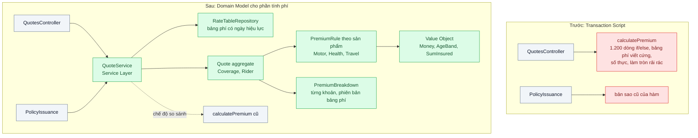
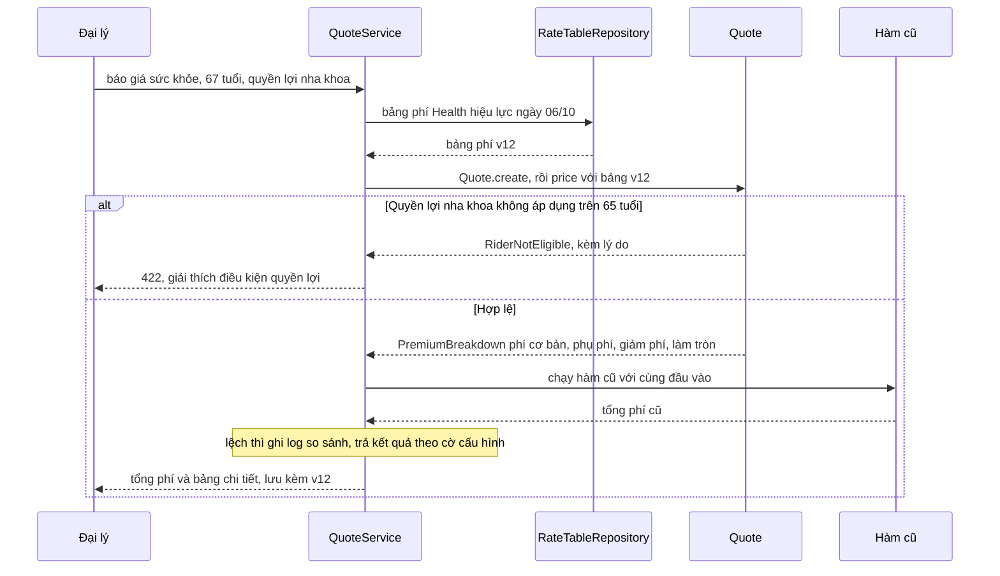

# Transaction Script vs Domain Model — Hàm tính phí bảo hiểm 1.200 dòng if/else không ai dám sửa

| Scope | Mức độ | Trạng thái | Pattern gốc | Cập nhật |
|---|---|---|---|---|
| 08 · backend / monolithics | 🟡 Trung bình | 📋 Kế hoạch | Transaction Script, Domain Model, Money — Fowler, *PoEAA* (2002); Value Object, Aggregate — Evans, *DDD* (2003) | 2026-10-06 |

> **Một câu tóm tắt:** Thay một hàm thủ tục khổng lồ bằng mô hình miền gồm các đối tượng mang tên nghiệp vụ (báo giá, quyền lợi, bảng phí, tiền) và các quy tắc tính phí tách theo sản phẩm, để mỗi thay đổi của phòng định phí chạm đúng một chỗ, có test và có bảng giải thích từng khoản phí.

## 1. Bài toán thực tế (What)

**Bối cảnh** *(doanh nghiệp giả định, số liệu minh họa)*
Công ty bảo hiểm phi nhân thọ bán bảo hiểm xe cơ giới, sức khỏe và du lịch qua website, app và 2.000 đại lý; khoảng 15.000 báo giá mỗi ngày. Toàn bộ việc tính phí nằm trong hàm `calculatePremium(input)` của monolith NestJS: 1.200 dòng if/else lồng nhau theo sản phẩm, tuổi, vùng, loại xe, 30 quyền lợi bổ sung, hệ số giảm phí và quy tắc làm tròn. Bảng phí được viết cứng trong code.

**Triệu chứng người kinh doanh nhìn thấy**
- Phòng định phí cần 3 tuần để thay bảng phí sức khỏe mới vì kỹ sư phải dò từng nhánh; trong thời gian đó công ty bán theo giá cũ.
- Phí trên báo giá và trên hợp đồng phát hành lệch vài nghìn đồng ở một số trường hợp; đại lý phải giải thích với khách, kiểm toán nội bộ yêu cầu làm rõ.
- Khách hỏi "vì sao phí của tôi cao hơn bạn tôi", tổng đài không trả lời được vì hệ thống chỉ trả một con số.

**Nguyên nhân kỹ thuật**
Transaction Script (một thủ tục xử lý trọn một nghiệp vụ) hợp với logic đơn giản, nhưng ở đây mọi khái niệm nghiệp vụ (quyền lợi, đối tượng được bảo hiểm, bảng phí, tiền) chỉ tồn tại dưới dạng biến cục bộ và nhánh `if`. Quy tắc của các sản phẩm đan xen trong cùng hàm nên sửa nhánh xe có thể đổi kết quả sức khỏe. Tiền được tính bằng số thực và làm tròn ở nhiều chỗ khác nhau; luồng phát hành hợp đồng gọi một bản sao cũ của hàm. Không có test vì không ai liệt kê được hết các nhánh.

**Ràng buộc**
- Kết quả phí mới phải khớp hàm cũ trên dữ liệu lịch sử, trừ các sai lệch đã được phòng định phí xác nhận là lỗi.
- Bảng phí là dữ liệu có ngày hiệu lực, phòng định phí cập nhật được mà không cần sửa code tính toán.
- Mỗi báo giá lưu bảng chi tiết các khoản phí và phiên bản bảng phí đã dùng, phục vụ kiểm toán.
- Phần còn lại của hệ thống (CRUD đại lý, danh mục) giữ cách viết hiện tại.

## 2. Vì sao dùng pattern này (Why)

**Nguyên nhân gốc mà pattern nhắm vào:** độ phức tạp của nghiệp vụ tính phí vượt khả năng biểu đạt của một thủ tục; các khái niệm nghiệp vụ không có chỗ để sống trong code.

**Pattern giải quyết thế nào:** Fowler đặt Transaction Script và Domain Model ở hai đầu: Transaction Script rẻ khi logic ít, Domain Model tốn công dựng nhưng chịu được logic phức tạp và thay đổi thường xuyên. Bài này chỉ chuyển *phần tính phí* sang Domain Model: `Money` (pattern Money của PoEAA, số nguyên đồng, một chính sách làm tròn duy nhất), các Value Object (`AgeBand`, `SumInsured`, `CoveragePeriod`), aggregate `Quote` chứa `Coverage` và `Rider`, mỗi sản phẩm một `PremiumRule` (xe, sức khỏe, du lịch), bảng phí là dữ liệu có phiên bản đọc qua repository. `Quote.price(rateTable)` trả `PremiumBreakdown` liệt kê từng khoản. Service Layer chỉ điều phối: tải bảng phí hiệu lực, dựng báo giá, gọi tính phí, lưu. Ngôn ngữ trong code trùng với ngôn ngữ của phòng định phí (Ubiquitous Language theo Evans). Để chuyển an toàn, hàm cũ và mô hình mới chạy song song trên cùng đầu vào và so kết quả, theo tinh thần Parallel Run của Newman.

**Lựa chọn khác đã cân nhắc**

| Lựa chọn | Giải quyết được gì | Vì sao không chọn (ở bài này) |
|---|---|---|
| Giữ nguyên + tối ưu nhỏ (tách hàm con theo sản phẩm, thêm comment) | Dễ đọc hơn một chút | Vẫn là biến cục bộ và nhánh; tiền vẫn là số thực; không có bảng phí dạng dữ liệu |
| Rule engine (bảng quyết định cấu hình bởi nghiệp vụ) | Nghiệp vụ tự sửa quy tắc | Thêm hệ thống và ngôn ngữ cấu hình mới; khó test và kiểm soát phiên bản; cân nhắc sau khi đã có mô hình rõ |
| Viết lại toàn bộ hệ thống theo DDD | Mô hình nhất quán khắp nơi | Phần lớn hệ thống là CRUD, Transaction Script vẫn hợp; rủi ro cao |
| Domain Model cho riêng phần tính phí + so song song với hàm cũ (chọn) | Quy tắc có chỗ ở, test được, giải thích được, đổi bảng phí không sửa code | Tốn công dựng mô hình và bộ so sánh; đội phải học Value Object, Aggregate |

## 3. Thiết kế hệ thống (How)

### 3.1 Kiến trúc trước và sau



### 3.2 Luồng chính



### 3.3 Thành phần và trách nhiệm

| Thành phần | Trách nhiệm | Quyết định thiết kế đáng chú ý |
|---|---|---|
| `Money` | Số tiền bằng số nguyên đồng, phép nhân với tỷ lệ, một chính sách làm tròn | Phép nhân tỷ lệ dùng thư viện thập phân; làm tròn chỉ ở một bước cuối có tên |
| Value Object khác | `AgeBand`, `SumInsured`, `CoveragePeriod`, `Rate` | Bất biến, tự kiểm hợp lệ khi tạo; so sánh theo giá trị |
| `Quote` (aggregate) | Giữ đối tượng được bảo hiểm, coverage, rider; tính phí, kiểm điều kiện | Mọi thay đổi đi qua phương thức của `Quote`, không sửa trực tiếp mảng rider |
| `PremiumRule` theo sản phẩm | Quy tắc tính phí cơ bản và phụ phí của một sản phẩm | Thêm sản phẩm là thêm một lớp, không sửa lớp khác |
| `RateTableRepository` | Đọc bảng phí theo sản phẩm và ngày hiệu lực | Bảng phí là dữ liệu có phiên bản; báo giá lưu phiên bản đã dùng |
| `QuoteService` | Điều phối, transaction, chế độ so sánh với hàm cũ | Cờ cấu hình chọn trả kết quả cũ hay mới trong giai đoạn chuyển |

### 3.4 Điểm dễ sai khi triển khai
- Mô hình "thiếu máu": lớp `Quote` chỉ có getter/setter, logic vẫn ở service; có tên đẹp nhưng vẫn là Transaction Script.
- Dùng số thực cho tiền và làm tròn ở mỗi bước: tổng các khoản không bằng tổng phí; luôn tính trên số nguyên hoặc thập phân và làm tròn đúng một lần theo quy định.
- Đưa cả bảng phí vào code dưới dạng lớp: phòng định phí lại phải chờ kỹ sư. Bảng phí là dữ liệu.
- Refactor trước, viết bộ so sánh sau: không chứng minh được hành vi không đổi. Dựng bộ so sánh trên dữ liệu lịch sử trước khi sửa dòng nào.
- Áp Domain Model cho mọi màn hình CRUD "cho đồng bộ": tốn công vô ích; giữ Transaction Script nơi logic đơn giản.

## 4. Tech stack và tác động (Impact techstack)

| Lớp | Công nghệ chọn | Vì sao chọn | Thay thế tương đương |
|---|---|---|---|
| Ngôn ngữ | TypeScript 5 strict | Class, readonly, union type cho lỗi miền | — |
| Ứng dụng | NestJS 10 cho Service Layer; mô hình miền là TypeScript thuần | Mô hình không phụ thuộc framework, test không cần DI | Fastify |
| Số thập phân | `decimal.js` cho phép nhân tỷ lệ | Tránh sai số số thực khi nhân tỷ lệ phí | `big.js`, số nguyên với tỷ lệ phần vạn |
| Bảng phí | PostgreSQL 16 bảng `rate_tables` (sản phẩm, phiên bản, ngày hiệu lực, dữ liệu) | Có phiên bản, truy vấn theo ngày, phòng định phí cập nhật qua công cụ nội bộ | File cấu hình có phiên bản trong Git |
| Test | Vitest, fast-check (property-based) | Test từng quy tắc; thuộc tính như "phí không giảm khi số tiền bảo hiểm tăng" | Jest |
| Đo | ESLint `complexity`, Vitest coverage, script so sánh trên 10.000 hồ sơ | Đo độ phức tạp và tỷ lệ khớp trước/sau | SonarQube |

**Thay đổi so với hệ thống hiện tại:** thêm thư mục `pricing/domain` thuần TypeScript, bảng `rate_tables`, `QuoteService` dùng chung cho báo giá và phát hành; giữ hàm cũ ở chế độ so sánh cho tới khi tỷ lệ khớp đạt yêu cầu, sau đó xóa. Phòng định phí tham gia đặt tên khái niệm và duyệt danh sách sai lệch.

## 5. Kết quả đầu ra và cách đo (Output impact)

| Chỉ số | Trước (minh họa) | Mục tiêu khi thực hành | Cách đo |
|---|---|---|---|
| Độ phức tạp cyclomatic lớn nhất trong mã tính phí | khoảng 180 | ≤ 10 mỗi hàm | ESLint rule `complexity` |
| Tỷ lệ khớp phí mới và cũ trên 10.000 hồ sơ lịch sử | chưa có bộ so sánh | 100% trừ sai lệch đã được xác nhận là lỗi | Script so sánh, xuất danh sách lệch kèm đầu vào |
| Số file phải sửa để thêm một quyền lợi bổ sung | khoảng 6 file, chạm hàm 1.200 dòng | 1 lớp quy tắc + 1 dòng đăng ký + test | `git diff --stat` của thay đổi thử nghiệm |
| Độ phủ nhánh của mã tính phí | 0% | ≥ 90% | Vitest coverage (v8), chỉ số branches |
| Báo giá có bảng chi tiết từng khoản và phiên bản bảng phí | 0% | 100% | Test tích hợp kiểm dữ liệu lưu cùng báo giá |
| Lệch phí giữa báo giá và phát hành hợp đồng | có | 0 | Test gọi hai luồng với cùng đầu vào |

> Số "trước" là minh họa để hình dung bài toán. Số "mục tiêu" chỉ được coi là đạt khi có số đo thật
> ở mục 8 kèm môi trường đo.

**Tác động nghiệp vụ mong đợi:** thay đổi bảng phí và sản phẩm đưa ra thị trường nhanh hơn, ít lỗi hơn; đại lý và tổng đài giải thích được phí cho khách; kiểm toán có dấu vết phiên bản bảng phí.

## 6. Đánh đổi và khi KHÔNG nên dùng

**Đánh đổi**
- Nhiều lớp và khái niệm hơn; người mới cần thời gian hiểu mô hình.
- Ánh xạ giữa mô hình miền và bảng dữ liệu tốn công viết và bảo trì.
- Giai đoạn chạy song song tốn tài nguyên và cần người xử lý danh sách sai lệch.

**Không nên dùng khi**
- Logic chủ yếu là lưu và đọc lại dữ liệu, vài quy tắc kiểm hợp lệ: Transaction Script rõ ràng và rẻ hơn.
- Quy tắc ổn định, hiếm khi đổi và đã có test đầy đủ: lợi ích của mô hình không bù chi phí chuyển đổi.
- Đội không có người hiểu nghiệp vụ để cùng đặt tên khái niệm: mô hình sẽ phản ánh suy đoán của kỹ sư.

**Liên quan**
- [`../01-layered-architecture-logic-nam-trong-controller/`](../01-layered-architecture-logic-nam-trong-controller/) — lớp domain và service layer, đọc trước.
- [`../04-hexagonal-architecture-doi-cong-thanh-toan-phai-sua-20-file/`](../04-hexagonal-architecture-doi-cong-thanh-toan-phai-sua-20-file/) — cô lập mô hình miền khỏi dịch vụ ngoài.
- [`../06-feature-toggle-branch-by-abstraction-refactor-lon-van-release-hang-tuan/`](../06-feature-toggle-branch-by-abstraction-refactor-lon-van-release-hang-tuan/) — cờ chuyển giữa hàm cũ và mô hình mới.
- [`../../02-backend-database/04-audit-log-ai-doi-gia-hop-dong-luc-nao/`](../../02-backend-database/04-audit-log-ai-doi-gia-hop-dong-luc-nao/) — lưu vết thay đổi bảng phí.

## 7. Cơ sở tham khảo

- Martin Fowler, *PoEAA*, 2002, "Transaction Script" và "Domain Model" — https://martinfowler.com/eaaCatalog/ — tiêu chí chọn giữa hai cách tổ chức logic theo độ phức tạp nghiệp vụ.
- Martin Fowler, *PoEAA*, "Money" và "Service Layer" — https://martinfowler.com/eaaCatalog/ — biểu diễn tiền và làm tròn; lớp điều phối mỏng phía trên mô hình miền.
- Eric Evans, *Domain-Driven Design*, Addison-Wesley, 2003 — Value Object, Aggregate, Ubiquitous Language; cách đặt ranh giới `Quote` và đặt tên theo ngôn ngữ của phòng định phí.
- Sam Newman, *Monolith to Microservices*, O'Reilly, 2019, "Parallel Run" — chạy cách cũ và cách mới song song, so kết quả trước khi chuyển.
- ESLint docs, rule `complexity` — https://eslint.org/docs/latest/rules/complexity — đo độ phức tạp cyclomatic dùng ở mục 5.

## 8. Kế hoạch thực hành

- [ ] Bước 1: dựng app NestJS + PostgreSQL 16; viết phiên bản thu nhỏ của hàm cũ (khoảng 300 dòng, 3 sản phẩm, 8 quyền lợi) trong `truoc/`; sinh 10.000 hồ sơ đầu vào đa dạng.
- [ ] Bước 2: đo "trước": độ phức tạp bằng ESLint, độ phủ, và ghi kết quả hàm cũ cho 10.000 hồ sơ làm golden master.
- [ ] Bước 3: áp dụng pattern: `Money`, Value Object, `Quote`, `PremiumRule` theo sản phẩm, bảng phí trong `rate_tables`, `QuoteService` với chế độ so sánh.
- [ ] Bước 4: đo "sau": tỷ lệ khớp, độ phức tạp, độ phủ, số file khi thêm một quyền lợi mới; ghi số thật và môi trường vào mục 5.
- [ ] Bước 5: viết test: (a) mô hình khớp golden master; (b) fast-check: phí không giảm khi số tiền bảo hiểm tăng; (c) tổng các khoản bằng tổng phí sau làm tròn; (d) quyền lợi không đủ điều kiện trả lỗi có lý do.

**Cấu trúc code dự kiến**
```text
src/
  truoc/calculate-premium.ts               # hàm thủ tục, tái hiện triệu chứng
  sau/pricing/domain/money.ts              # [PATTERN] Money, một chính sách làm tròn
  sau/pricing/domain/value-objects.ts      # AgeBand, SumInsured, CoveragePeriod, Rate
  sau/pricing/domain/quote.ts              # [PATTERN] aggregate Quote
  sau/pricing/domain/rules/health-premium-rule.ts
  sau/pricing/domain/rules/motor-premium-rule.ts
  sau/pricing/domain/premium-breakdown.ts
  sau/pricing/application/quote.service.ts # điều phối, chế độ so sánh
  sau/pricing/infrastructure/rate-table.repository.ts
test/
  matches-golden-master.test.ts
  premium-never-drops-as-sum-insured-rises.property.test.ts
  line-items-sum-to-total-premium.test.ts
  ineligible-benefit-returns-reason.test.ts
docker-compose.yml
```

**Cách chạy** *(điền khi bắt đầu code)*
```bash
docker compose up -d
pnpm install && pnpm golden:record && pnpm test
```
