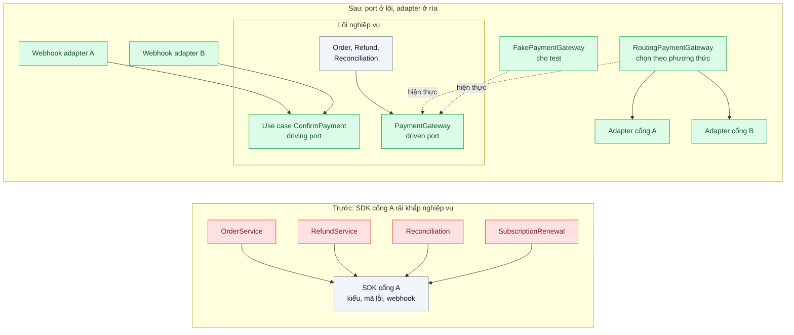
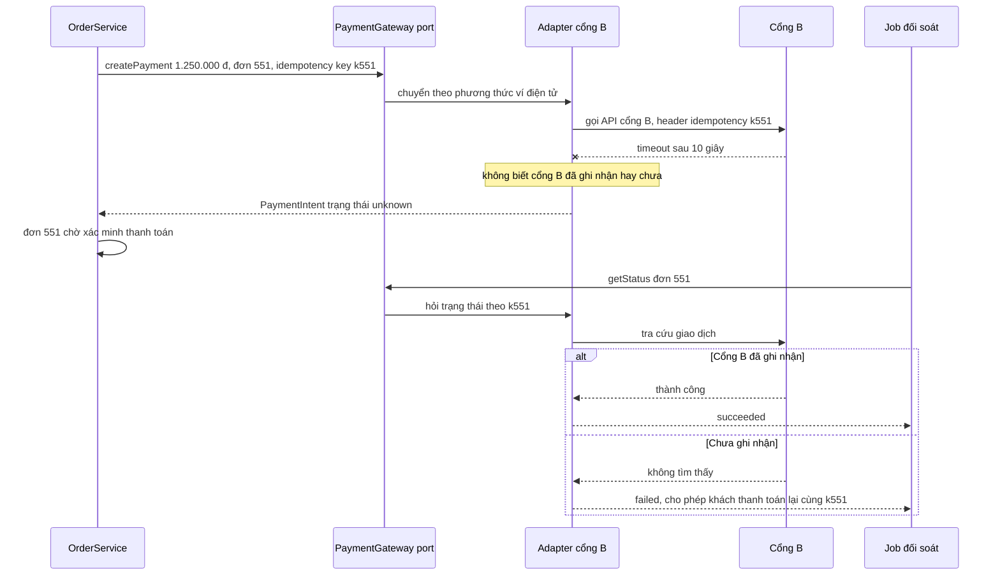

# Hexagonal Architecture (Ports & Adapters) — Đổi cổng thanh toán phải sửa 20 file nghiệp vụ

| Scope | Mức độ | Trạng thái | Pattern gốc | Cập nhật |
|---|---|---|---|---|
| 08 · backend / monolithics | 🟡 Trung bình | 📋 Kế hoạch | Hexagonal Architecture — Alistair Cockburn (2005); dependency rule — Robert C. Martin, *Clean Architecture* (2017) | 2026-10-06 |

> **Một câu tóm tắt:** Để phần lõi nghiệp vụ định nghĩa "cổng" (port) bằng ngôn ngữ của chính nó, ví dụ "tạo thanh toán", "hoàn tiền", và đẩy mọi chi tiết của từng nhà cung cấp vào adapter ở rìa, để đổi hoặc thêm cổng thanh toán là viết một adapter mới chứ không sửa nghiệp vụ.

## 1. Bài toán thực tế (What)

**Bối cảnh** *(doanh nghiệp giả định, số liệu minh họa)*
Sàn TMĐT đồ gia dụng, khoảng 8.000 đơn mỗi ngày, monolith NestJS. Từ đầu hệ thống tích hợp với "cổng thanh toán A" qua SDK của họ. Kiểu dữ liệu và client của SDK được import thẳng vào service đặt hàng, hoàn tiền, đối soát cuối ngày, gia hạn gói thành viên, webhook và trang quản trị. Test thanh toán dựng bằng cách giả lập HTTP của cổng A.

**Triệu chứng người kinh doanh nhìn thấy**
- Cổng B đề nghị phí thấp hơn đáng kể cho ví điện tử; ước tính tiết kiệm mỗi tháng rất rõ, nhưng đội kỹ thuật báo cần 6 tuần và phải sửa khoảng 20 file nghiệp vụ.
- Lần cổng A đổi phiên bản API, luồng hoàn tiền hỏng 2 ngày vì một chỗ dùng trường cũ bị bỏ sót.
- Bộ test thanh toán chạy 4 phút và hay đỏ ngẫu nhiên khi sandbox của cổng A chậm, nên đội thường bỏ qua.

**Nguyên nhân kỹ thuật**
Nghiệp vụ phụ thuộc trực tiếp vào chi tiết kỹ thuật của một nhà cung cấp: tên trường, mã trạng thái, kiểu lỗi, định dạng webhook của cổng A rải khắp các service. Hướng phụ thuộc đi từ lõi ra ngoài, nên mọi thay đổi ở ngoài lan vào trong. Không có chỗ nào định nghĩa "thanh toán" theo nghĩa của doanh nghiệp, nên không có gì để thay thế hay giả lập ngoài chính SDK.

**Ràng buộc**
- Chạy song song hai cổng: ví điện tử qua cổng B, thẻ quốc tế vẫn qua cổng A, chọn theo phương thức thanh toán.
- Không đổi hành vi nghiệp vụ hiện có (trạng thái đơn, quy tắc hoàn tiền, đối soát).
- Xử lý đúng trường hợp cổng trả lời mập mờ (timeout sau khi đã gửi yêu cầu) bằng idempotency key và đối soát.

## 2. Vì sao dùng pattern này (Why)

**Nguyên nhân gốc mà pattern nhắm vào:** phụ thuộc trỏ từ nghiệp vụ ra công nghệ bên ngoài, nên nghiệp vụ phải thay đổi mỗi khi công nghệ bên ngoài thay đổi.

**Pattern giải quyết thế nào:** Cockburn đặt ứng dụng ở trung tâm, giao tiếp với thế giới bên ngoài chỉ qua các port gắn với *mục đích* (cần thu tiền, cần thông báo), và mỗi công nghệ cụ thể là một adapter cắm vào port. Port phía bị gọi (driven) ở đây là `PaymentGateway` với các thao tác `createPayment`, `refund`, `getStatus`, nhận và trả kiểu của lõi (`Money`, `PaymentIntent`, `PaymentStatus`). Port phía gọi vào (driving) là use case `ConfirmPayment`, được adapter webhook của từng cổng gọi sau khi xác thực chữ ký và dịch payload. Martin gọi đây là quy tắc phụ thuộc: mã nguồn chỉ được phụ thuộc hướng vào trong. Mỗi adapter làm nhiệm vụ của một Gateway (PoEAA) kiêm lớp chống ăn mòn: dịch mô hình, ánh xạ lỗi, ẩn SDK. Một bộ contract test chạy chung cho mọi adapter, kể cả adapter giả trong bộ nhớ, đảm bảo chúng thay được cho nhau.

**Lựa chọn khác đã cân nhắc**

| Lựa chọn | Giải quyết được gì | Vì sao không chọn (ở bài này) |
|---|---|---|
| Giữ nguyên + tối ưu nhỏ (thêm `if (provider === 'B')` ở 20 chỗ) | Ra mắt cổng B nhanh nhất về lịch | Mỗi cổng mới nhân đôi số nhánh; lỗi sót chỗ như lần đổi API trước |
| Bọc SDK cổng A bằng một service `PaymentService` nhưng giữ kiểu của SDK | Gom lời gọi về một chỗ | Kiểu và mã lỗi của cổng A vẫn rò ra nghiệp vụ; cổng B phải giả làm cổng A |
| Port `PaymentGateway` + adapter từng cổng + contract test (chọn) | Nghiệp vụ không biết cổng nào, thêm cổng là thêm adapter, test không cần mạng | Thêm một lớp trừu tượng và công dịch mô hình; phải thiết kế port đủ chung |

## 3. Thiết kế hệ thống (How)

### 3.1 Kiến trúc trước và sau



### 3.2 Luồng chính



### 3.3 Thành phần và trách nhiệm

| Thành phần | Trách nhiệm | Quyết định thiết kế đáng chú ý |
|---|---|---|
| Port `PaymentGateway` | Thao tác thanh toán theo ngôn ngữ của lõi | Kiểu trả về có trạng thái `unknown` tường minh cho trường hợp mập mờ; không có kiểu nào của SDK |
| Use case `ConfirmPayment` | Nhận xác nhận thanh toán, cập nhật đơn | Idempotent theo mã giao dịch; không quan tâm webhook đến từ cổng nào |
| Adapter cổng A, cổng B | Gọi SDK, dịch mô hình, ánh xạ lỗi, gửi idempotency key | Lỗi mạng và timeout ánh xạ thành `unknown`, lỗi từ chối thẻ thành `failed` có lý do |
| `RoutingPaymentGateway` | Chọn adapter theo phương thức thanh toán và cấu hình | Đổi tuyến bằng cấu hình, không deploy code nghiệp vụ |
| Contract test chung | Cùng bộ test chạy với adapter A, B (sandbox) và adapter giả | Đảm bảo các adapter thay được cho nhau; adapter giả không được "dễ dãi" hơn adapter thật |

### 3.4 Điểm dễ sai khi triển khai
- Port sao chép nguyên API của cổng A (`createCharge(params: GatewayAChargeParams)`): đổi tên nhưng vẫn khóa vào một nhà cung cấp. Thiết kế port từ nhu cầu của lõi.
- Adapter nuốt lỗi hoặc ánh xạ timeout thành "thất bại": khách bị trừ tiền mà đơn báo lỗi. Trường hợp mập mờ phải là trạng thái riêng, đi kèm đối soát.
- Logic nghiệp vụ trượt vào adapter (tính phí, quyết định hoàn tiền một phần): adapter chỉ dịch.
- Adapter giả trong test luôn thành công: test xanh nhưng không đại diện cho thực tế. Adapter giả phải qua cùng contract test và giả lập được lỗi.

## 4. Tech stack và tác động (Impact techstack)

| Lớp | Công nghệ chọn | Vì sao chọn | Thay thế tương đương |
|---|---|---|---|
| Ứng dụng | TypeScript 5 strict, NestJS 10 custom provider (`useFactory`, injection token) | Gắn adapter vào port bằng cấu hình module | Fastify + container DI nhẹ |
| Adapter | SDK hoặc HTTP client của từng cổng, đặt trong `adapters/payment/<cổng>` | Cô lập hoàn toàn phụ thuộc bên ngoài | `undici` gọi REST trực tiếp |
| Kiểm ranh giới | dependency-cruiser: SDK chỉ được import từ thư mục adapter | Luật chạy trong CI, không dựa vào review | `eslint-plugin-boundaries` |
| Test | Vitest: contract test chung, test nghiệp vụ dùng adapter giả | Test nghiệp vụ chạy không cần mạng | Jest |
| Giả lập cổng cho môi trường local | WireMock hoặc server Fastify nhỏ đóng vai cổng A, B | Chạy contract test và tái hiện timeout có kiểm soát | Sandbox thật của cổng |

**Thay đổi so với hệ thống hiện tại:** thêm port, hai adapter, adapter giả, router và webhook adapter; sửa các service nghiệp vụ một lần để chỉ phụ thuộc port (đây là lần cuối phải sửa 20 file). Đội học khái niệm port, adapter và viết contract test.

## 5. Kết quả đầu ra và cách đo (Output impact)

| Chỉ số | Trước (minh họa) | Mục tiêu khi thực hành | Cách đo |
|---|---|---|---|
| Số file nghiệp vụ phải sửa để thêm một cổng mới | khoảng 20 | 0 (chỉ adapter mới + đăng ký) | `git diff --stat` của thay đổi thêm adapter cổng C giả định |
| Import SDK cổng thanh toán ngoài thư mục adapter | khoảng 30 chỗ | 0 | Báo cáo dependency-cruiser trong CI |
| Thời gian chạy test nghiệp vụ thanh toán | 4 phút, hay đỏ ngẫu nhiên | < 10 giây, ổn định | Vitest, đo trong CI qua 20 lần chạy liên tiếp |
| Contract test đạt cho mọi adapter | không có | 100% cho A, B và adapter giả | Vitest chạy bộ contract với từng hiện thực |
| Đơn kẹt sai trạng thái khi cổng timeout | có | 0 | Test: giả lập timeout, kiểm đơn ở trạng thái chờ xác minh rồi được đối soát đúng |

> Số "trước" là minh họa để hình dung bài toán. Số "mục tiêu" chỉ được coi là đạt khi có số đo thật
> ở mục 8 kèm môi trường đo.

**Tác động nghiệp vụ mong đợi:** doanh nghiệp đàm phán và đổi nhà cung cấp thanh toán theo chi phí mà không bị khóa bởi công sức kỹ thuật; thay đổi API của nhà cung cấp chỉ ảnh hưởng một adapter.

## 6. Đánh đổi và khi KHÔNG nên dùng

**Đánh đổi**
- Thêm lớp gián tiếp và công dịch mô hình; đọc luồng phải nhảy qua port và adapter.
- Port thiết kế quá hẹp theo cổng đầu tiên thì cổng sau không vừa; thiết kế quá rộng thì thành mẫu số chung nghèo nàn.

**Không nên dùng khi**
- Phụ thuộc gần như chắc chắn không đổi và chỉ dùng ở một chỗ: bọc thêm port chỉ là chi phí.
- Ứng dụng nhỏ, logic chủ yếu là gọi qua lại API bên ngoài: phần "lõi" quá mỏng để đáng bảo vệ.

**Liên quan**
- [`../01-layered-architecture-logic-nam-trong-controller/`](../01-layered-architecture-logic-nam-trong-controller/) — phân lớp là nền trước khi đảo phụ thuộc.
- [`../06-feature-toggle-branch-by-abstraction-refactor-lon-van-release-hang-tuan/`](../06-feature-toggle-branch-by-abstraction-refactor-lon-van-release-hang-tuan/) — port chính là lớp trừu tượng để chuyển dần giữa hai hiện thực.
- [`../07-strangler-fig-tach-thanh-toan-ra-khoi-monolith-khong-dung-he-thong/`](../07-strangler-fig-tach-thanh-toan-ra-khoi-monolith-khong-dung-he-thong/) — khi thanh toán tách thành service, adapter đổi thành HTTP client.
- [`../../01-frontend-backend-transporter/03-idempotency-key-bam-thanh-toan-hai-lan/`](../../01-frontend-backend-transporter/03-idempotency-key-bam-thanh-toan-hai-lan/) — idempotency key cho trường hợp timeout mập mờ.

## 7. Cơ sở tham khảo

- Alistair Cockburn, "Hexagonal architecture", 2005 — https://alistair.cockburn.us/hexagonal-architecture/ — ứng dụng ở trung tâm, port theo mục đích, adapter theo công nghệ, phía gọi vào và phía bị gọi.
- Robert C. Martin, *Clean Architecture*, Prentice Hall, 2017 — quy tắc phụ thuộc hướng vào trong và ranh giới giữa chính sách nghiệp vụ với chi tiết kỹ thuật.
- Martin Fowler, *PoEAA*, 2002, "Gateway" — https://martinfowler.com/eaaCatalog/gateway.html — đối tượng bọc truy cập hệ thống bên ngoài, vai trò của từng adapter.
- Microsoft Azure Architecture Center, "Anti-Corruption Layer pattern" — https://learn.microsoft.com/azure/architecture/patterns/anti-corruption-layer — dịch mô hình của hệ thống ngoài để không làm "ô nhiễm" mô hình lõi.
- NestJS docs, "Custom providers" — https://docs.nestjs.com/fundamentals/custom-providers — injection token và `useFactory` để gắn adapter vào port.

## 8. Kế hoạch thực hành

- [ ] Bước 1: dựng monolith NestJS thu nhỏ với 4 service dùng thẳng client cổng A; server giả lập cổng A và B (có chế độ timeout); Docker Compose với PostgreSQL 16.
- [ ] Bước 2: đo "trước": thử thêm cổng B theo kiểu `if`, ghi `git diff --stat`; đo thời gian và độ ổn định bộ test; đếm import SDK.
- [ ] Bước 3: áp dụng pattern: port `PaymentGateway`, adapter A, B, adapter giả, `RoutingPaymentGateway`, webhook adapter, use case `ConfirmPayment`, luật dependency-cruiser.
- [ ] Bước 4: đo "sau": thêm adapter cổng C giả định, ghi số file sửa; thời gian test; ghi số thật và môi trường vào mục 5.
- [ ] Bước 5: viết test: (a) contract test chung cho mọi adapter; (b) timeout ánh xạ thành `unknown` và được đối soát; (c) đổi cấu hình tuyến không cần sửa nghiệp vụ; (d) import SDK trong service làm CI thất bại.

**Cấu trúc code dự kiến**
```text
src/
  truoc/order.service.ts                         # dùng thẳng SDK cổng A
  sau/payments/core/payment-gateway.port.ts      # [PATTERN] driven port
  sau/payments/core/confirm-payment.use-case.ts  # [PATTERN] driving port
  sau/payments/adapters/gateway-a.adapter.ts
  sau/payments/adapters/gateway-b.adapter.ts
  sau/payments/adapters/routing-payment.gateway.ts # chọn adapter theo phương thức
  sau/payments/payments.module.ts                # gắn adapter vào port
test/
  payment-gateway.contract.ts                    # bộ contract dùng chung
  timeout-becomes-unknown-then-reconciled.test.ts
  rerouting-needs-no-domain-change.test.ts
tools/fake-gateways/                             # server giả lập cổng A, B
.dependency-cruiser.cjs
docker-compose.yml
```

**Cách chạy** *(điền khi bắt đầu code)*
```bash
docker compose up -d
pnpm install && pnpm test && pnpm depcruise
```
