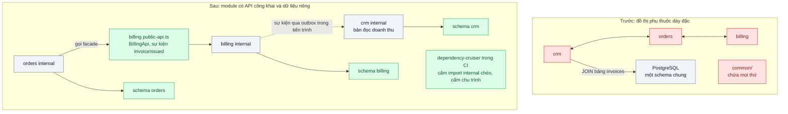
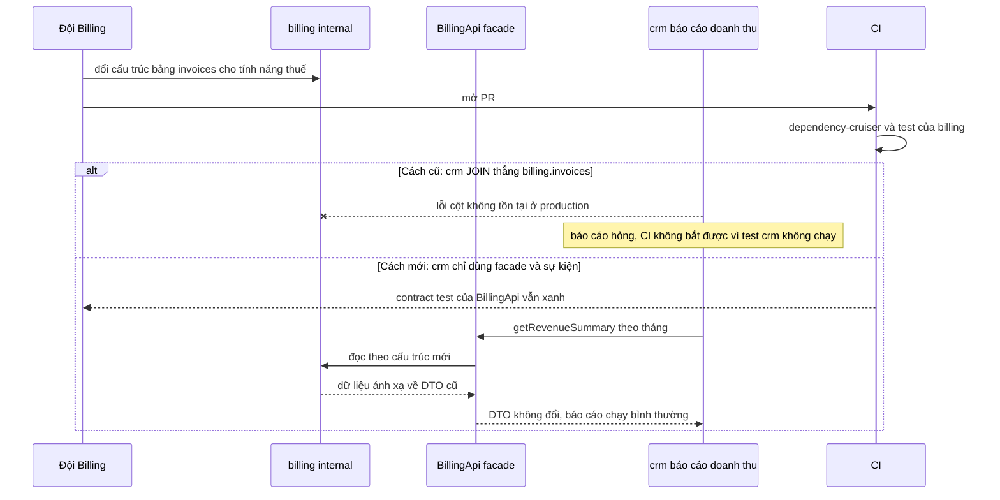

# Modular Monolith — 15 người cùng sửa một codebase, module nào cũng import module nào

| Scope | Mức độ | Trạng thái | Pattern gốc | Cập nhật |
|---|---|---|---|---|
| 08 · backend / monolithics | 🟡 Trung bình | 📋 Kế hoạch | Modular Monolith — Kamil Grzybek (2019); Simon Brown, "Modular Monoliths"; Bounded Context — Evans, *DDD* (2003) | 2026-10-06 |

> **Một câu tóm tắt:** Chia monolith thành các module theo năng lực nghiệp vụ, mỗi module có API công khai, dữ liệu riêng và phần bên trong không ai khác được chạm; ranh giới được công cụ kiểm trong CI, nên các đội làm việc độc lập trong cùng một lần deploy.

## 1. Bài toán thực tế (What)

**Bối cảnh** *(doanh nghiệp giả định, số liệu minh họa)*
SaaS B2B CRM có khoảng 250.000 dòng TypeScript trong một monolith NestJS, một PostgreSQL. 15 kỹ sư chia ba đội: CRM (khách hàng, cơ hội bán hàng), Orders (đơn, giao hàng), Billing (hóa đơn, thanh toán, gói thuê bao). Thư mục `modules/` có sẵn nhưng chỉ là quy ước: `orders` import entity của `billing`, báo cáo của CRM `JOIN` thẳng bảng `invoices`, thư mục `common/` phình thành nơi chứa mọi thứ.

**Triệu chứng người kinh doanh nhìn thấy**
- Đội Billing đổi cấu trúc bảng hóa đơn cho tính năng thuế mới; báo cáo doanh thu của CRM hỏng ngay ngày phát hành, đội kinh doanh không có số liệu họp tuần.
- Ước lượng của mọi tính năng đều kèm "tùy có đụng module khác không"; thời gian giao tính năng kéo dài dù tuyển thêm người.
- Ban lãnh đạo hỏi có nên chuyển sang microservices; đội kỹ thuật không trả lời được vì không ai vẽ được ranh giới giữa các phần.

**Nguyên nhân kỹ thuật**
Không có ranh giới được thực thi: mọi lớp đều public, mọi bảng đều đọc ghi được từ mọi nơi. Phụ thuộc giữa các thư mục tạo thành đồ thị dày đặc với nhiều chu trình, nên thay đổi bên trong một module lan ra module khác. Dữ liệu dùng chung qua `JOIN` và khóa ngoại chéo khiến không đội nào sở hữu thật sự bảng của mình. CI chạy toàn bộ test 35 phút cho mọi PR vì không biết thay đổi ảnh hưởng tới đâu.

**Ràng buộc**
- Giữ một codebase, một lần deploy, một PostgreSQL; không tách service trong bài này.
- Chuyển dần từng module, vẫn phát hành hằng tuần.
- Ranh giới phải được kiểm tự động; vi phạm mới làm CI đỏ, vi phạm cũ được liệt kê và giảm dần.
- Ranh giới phải đủ rõ để nếu sau này cần, một module tách được thành service (bài 07).

## 2. Vì sao dùng pattern này (Why)

**Nguyên nhân gốc mà pattern nhắm vào:** module tồn tại trên sơ đồ thư mục nhưng không tồn tại trong code: không có đóng gói, không có sở hữu dữ liệu, không có công cụ thực thi.

**Pattern giải quyết thế nào:** Grzybek định nghĩa modular monolith là một hệ thống deploy một khối nhưng gồm các module độc lập, mỗi module chứa mọi thứ cần cho một năng lực nghiệp vụ và chỉ lộ ra một giao diện được định nghĩa rõ. Ranh giới module trùng với Bounded Context theo Evans: cùng một từ ("khách hàng") có thể mang nghĩa khác ở CRM và Billing, và mỗi bên giữ mô hình riêng. Cụ thể: mỗi module có `public-api.ts` (facade, DTO, sự kiện) và thư mục `internal/` cấm import từ ngoài; mỗi module sở hữu một schema PostgreSQL riêng, không `JOIN` hay khóa ngoại chéo schema; module khác lấy dữ liệu qua facade hoặc qua sự kiện để dựng bản đọc của mình. Luật được viết bằng dependency-cruiser và chạy trong CI. Simon Brown nhấn mạnh rằng nếu không dựng được monolith có module tốt thì microservices chỉ chuyển cùng mớ rối sang mạng; Fowler ("MonolithFirst") cũng xem đây là bước trước khi tách.

**Lựa chọn khác đã cân nhắc**

| Lựa chọn | Giải quyết được gì | Vì sao không chọn (ở bài này) |
|---|---|---|
| Giữ nguyên + tối ưu nhỏ (tài liệu quy ước, review kỹ hơn) | Không tốn công cấu trúc | Quy ước không được thực thi sẽ bị phá dưới áp lực thời hạn; review không bắt được mọi import |
| Tách microservices ngay | Ranh giới cứng bằng mạng | Chưa biết ranh giới đúng; thêm độ trễ mạng, giao dịch phân tán và vận hành nhiều service cho đội 15 người |
| Tách thành nhiều package trong monorepo (scope 09) | Ranh giới bằng package và build | Bổ trợ tốt, là bước kế tiếp; cần công cụ monorepo, làm sau khi ranh giới logic đã ổn |
| Modular monolith: facade + schema riêng + luật CI (chọn) | Ranh giới thực thi được, giữ một deploy, sẵn sàng tách sau | Thêm công dịch dữ liệu qua facade, bỏ được `JOIN` tiện lợi; phải dọn dần vi phạm cũ |

## 3. Thiết kế hệ thống (How)

### 3.1 Kiến trúc trước và sau



### 3.2 Luồng chính



### 3.3 Thành phần và trách nhiệm

| Thành phần | Trách nhiệm | Quyết định thiết kế đáng chú ý |
|---|---|---|
| Module theo năng lực nghiệp vụ | `crm`, `orders`, `billing`, `catalog`; mỗi module một NestJS module | Ranh giới theo nghiệp vụ, không theo lớp kỹ thuật (không có module "repositories") |
| `public-api.ts` | Facade, DTO, sự kiện mà module cho phép bên ngoài dùng | Chỉ export interface và kiểu dữ liệu ổn định; có contract test riêng |
| `internal/` | Domain, repository, controller của module | Cấm import từ module khác bằng luật CI |
| Schema PostgreSQL theo module | Dữ liệu thuộc sở hữu duy nhất của một module | Không khóa ngoại và không `JOIN` chéo schema; có thể cấp role DB riêng cho mỗi module |
| Sự kiện tích hợp trong tiến trình | Báo thay đổi cho module khác (hóa đơn đã phát hành) | Ghi outbox cùng transaction, dispatcher trong tiến trình; đổi sang broker được khi tách service |
| Luật dependency-cruiser + CODEOWNERS | Thực thi ranh giới, chỉ định người duyệt theo module | Vi phạm cũ ghi vào danh sách cho phép tạm thời, giảm dần theo từng sprint |

### 3.4 Điểm dễ sai khi triển khai
- Chia module theo lớp kỹ thuật (controllers, services, entities): mọi tính năng chạm mọi module, ranh giới vô nghĩa.
- `common/` tiếp tục chứa logic nghiệp vụ dùng chung: thành module thứ năm mà ai cũng phụ thuộc. Chỉ để tiện ích kỹ thuật trong đó.
- Facade lộ entity hoặc kiểu ORM của module: bên ngoài lại phụ thuộc cấu trúc bên trong. Facade trả DTO.
- Tách schema nhưng vẫn để role DB chung đọc mọi schema: ranh giới dữ liệu chỉ còn là quy ước.
- Bật luật ở chế độ chặn với hàng trăm vi phạm cũ: CI đỏ mãi, đội tắt luật. Bắt đầu bằng danh sách cho phép và chỉ chặn vi phạm mới.

## 4. Tech stack và tác động (Impact techstack)

| Lớp | Công nghệ chọn | Vì sao chọn | Thay thế tương đương |
|---|---|---|---|
| Ứng dụng | TypeScript 5 strict, NestJS 10 module | Module của NestJS khớp với module nghiệp vụ, kiểm soát provider được export | Fastify plugin theo module |
| Kiểm ranh giới | dependency-cruiser (luật theo đường dẫn, cấm chu trình, báo cáo vi phạm) | Chạy trong CI, có chế độ danh sách vi phạm đã biết | `eslint-plugin-boundaries`, Nx module boundaries |
| Dữ liệu | PostgreSQL 16, schema và role theo module | Sở hữu dữ liệu rõ ràng trong cùng một DB | DB riêng mỗi module khi chuẩn bị tách |
| Sự kiện nội bộ | Bảng outbox + dispatcher trong tiến trình | Nguyên tử với dữ liệu, cùng hợp đồng khi chuyển sang broker | `@nestjs/event-emitter` cho sự kiện không cần bền vững |
| Sở hữu code | GitHub CODEOWNERS theo thư mục module | Mỗi PR có người duyệt của module bị chạm | — |
| Đo | dependency-cruiser, script phân tích `git log`, `pg_stat_statements` | Đếm vi phạm, PR chạm nhiều module, truy vấn chéo schema | madge cho chu trình |

**Thay đổi so với hệ thống hiện tại:** sắp xếp lại thư mục theo module có `public-api.ts` và `internal/`, chuyển bảng vào schema theo module, thay các `JOIN` chéo bằng facade hoặc bản đọc dựng từ sự kiện, thêm luật CI và CODEOWNERS. Các đội học cách thiết kế và giữ ổn định API của module mình.

## 5. Kết quả đầu ra và cách đo (Output impact)

| Chỉ số | Trước (minh họa) | Mục tiêu khi thực hành | Cách đo |
|---|---|---|---|
| Import vi phạm ranh giới module | khoảng 340 | 0 vi phạm mới; danh sách cũ giảm về 0 | Báo cáo dependency-cruiser trong CI |
| Chu trình phụ thuộc giữa module | 12 | 0 | Luật `no-circular` của dependency-cruiser |
| Truy vấn SQL chạm bảng của hai module | khoảng 25 | 0 | Rà `pg_stat_statements` theo tên schema; test tích hợp với role DB riêng từng module |
| PR chạm nhiều hơn một module | 45% | < 15% | Script phân tích `git log --name-only` theo thư mục module |
| Thời gian CI cho PR chỉ chạm một module | 35 phút | < 10 phút | Chạy test của module bị ảnh hưởng và module phụ thuộc, đo trong CI |
| Đổi schema bên trong billing làm hỏng module khác | có | 0 | Kịch bản thử: đổi bảng nội bộ billing, chạy toàn bộ test |

> Số "trước" là minh họa để hình dung bài toán. Số "mục tiêu" chỉ được coi là đạt khi có số đo thật
> ở mục 8 kèm môi trường đo.

**Tác động nghiệp vụ mong đợi:** mỗi đội giao tính năng trong phần của mình mà không làm hỏng phần khác; câu hỏi "có nên tách microservices" có câu trả lời dựa trên ranh giới đã chạy thật.

## 6. Đánh đổi và khi KHÔNG nên dùng

**Đánh đổi**
- Mất sự tiện lợi của `JOIN` và import tự do; báo cáo chéo module cần bản đọc riêng.
- Thiết kế API module tốn công và cần giữ tương thích như API công khai.
- Chọn sai ranh giới thì phải dời code giữa các module, tốn công hơn khi chưa có ranh giới.

**Không nên dùng khi**
- Đội 2–3 người, codebase nhỏ: phân lớp (bài 01) là đủ, chi phí ranh giới lớn hơn lợi ích.
- Nghiệp vụ còn đang tìm hướng, mô hình đổi hằng tuần: ranh giới sớm sẽ sai; chờ khi các khái niệm ổn định.
- Hệ thống đã là microservices với ranh giới đúng: bài toán là ở chỗ khác (scope 07).

**Liên quan**
- [`../04-hexagonal-architecture-doi-cong-thanh-toan-phai-sua-20-file/`](../04-hexagonal-architecture-doi-cong-thanh-toan-phai-sua-20-file/) — cô lập phụ thuộc ngoài bên trong từng module.
- [`../07-strangler-fig-tach-thanh-toan-ra-khoi-monolith-khong-dung-he-thong/`](../07-strangler-fig-tach-thanh-toan-ra-khoi-monolith-khong-dung-he-thong/) — tách một module có ranh giới tốt thành service.
- [`../../09-backend-monorepo/04-module-boundaries-frontend-import-thang-vao-repository-backend/`](../../09-backend-monorepo/04-module-boundaries-frontend-import-thang-vao-repository-backend/) — thực thi ranh giới ở mức package.

## 7. Cơ sở tham khảo

- Kamil Grzybek, "Modular Monolith: A Primer", 2019 — https://www.kamilgrzybek.com/blog/posts/modular-monolith-primer — định nghĩa module độc lập, có giao diện rõ, và các tiêu chí đánh giá mức độ module hóa.
- Simon Brown, "Modular Monoliths" (bài nói) — https://simonbrown.je/ (cần xác minh URL slide) — lập luận rằng cần làm tốt module hóa trong monolith trước khi nghĩ tới microservices.
- Kirsten Westeinde, "Deconstructing the Monolith: Designing Software that Maximizes Developer Productivity", Shopify Engineering, 2019 — case study tổ chức lại một monolith lớn thành các component có ranh giới.
- Eric Evans, *Domain-Driven Design*, 2003 — Bounded Context và Ubiquitous Language, căn cứ để vẽ ranh giới module theo nghiệp vụ.
- Martin Fowler, "MonolithFirst", bliki, 2015 — https://martinfowler.com/bliki/MonolithFirst.html — quan điểm bắt đầu bằng monolith và tách khi ranh giới đã rõ.
- dependency-cruiser docs — https://github.com/sverweij/dependency-cruiser — luật phụ thuộc theo đường dẫn, cấm chu trình, danh sách vi phạm đã biết.

## 8. Kế hoạch thực hành

- [ ] Bước 1: dựng monolith NestJS thu nhỏ với 4 module "kiểu cũ" (import chéo, `JOIN` chéo bảng, chu trình), PostgreSQL 16 một schema; Docker Compose.
- [ ] Bước 2: đo "trước": báo cáo dependency-cruiser, đếm chu trình, liệt kê truy vấn chéo bảng; chạy kịch bản đổi bảng nội bộ billing và ghi những gì hỏng.
- [ ] Bước 3: áp dụng pattern: `public-api.ts` và `internal/` cho từng module, schema và role riêng, thay `JOIN` bằng facade hoặc bản đọc từ sự kiện, luật CI với danh sách vi phạm cũ, CODEOWNERS.
- [ ] Bước 4: đo "sau": vi phạm, chu trình, truy vấn chéo, thời gian CI cho PR một module; ghi số thật và môi trường vào mục 5.
- [ ] Bước 5: viết test: (a) import `billing/internal` từ `orders` làm CI thất bại; (b) role DB của crm không đọc được schema billing; (c) đổi bảng nội bộ billing, test của crm vẫn xanh; (d) contract test của `BillingApi`.

**Cấu trúc code dự kiến**
```text
src/
  truoc/                                   # cùng chức năng, import chéo tự do
  sau/modules/billing/public-api.ts        # [PATTERN] facade, DTO, sự kiện
  sau/modules/billing/internal/
  sau/modules/orders/public-api.ts
  sau/modules/orders/internal/
  sau/modules/crm/internal/revenue-read-model.ts   # bản đọc dựng từ sự kiện
  sau/shared/outbox-dispatcher.ts
migrations/                                # schema crm, orders, billing và role riêng
test/
  cross-module-internal-import-blocked.test.ts
  crm-role-cannot-read-billing-schema.test.ts
  billing-api.contract.test.ts
.dependency-cruiser.cjs                    # [PATTERN] luật ranh giới module
CODEOWNERS
docker-compose.yml
```

**Cách chạy** *(điền khi bắt đầu code)*
```bash
docker compose up -d
pnpm install && pnpm migrate && pnpm test && pnpm depcruise
```
