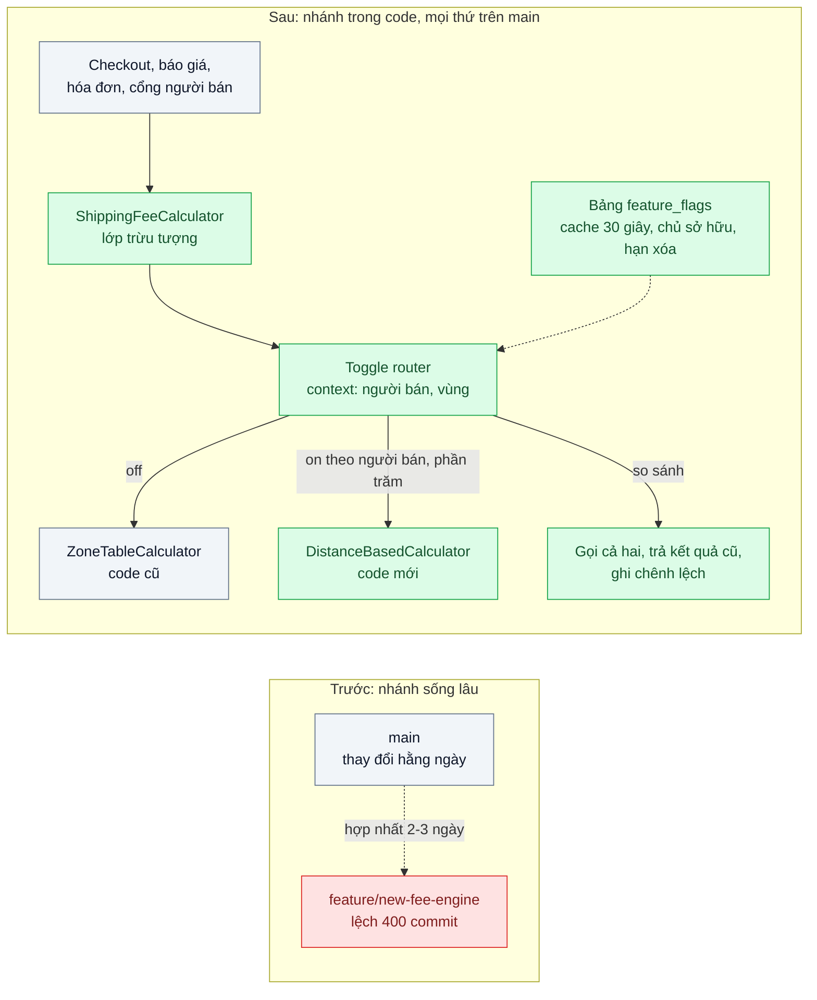
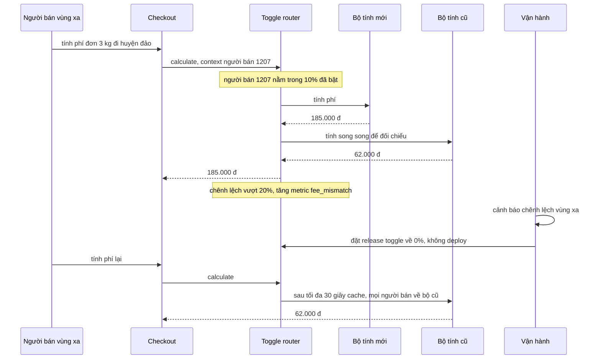

# Feature Toggle & Branch by Abstraction — Refactor lớn kéo dài 2 tháng nhưng vẫn phải release hằng tuần

| Scope | Mức độ | Trạng thái | Pattern gốc | Cập nhật |
|---|---|---|---|---|
| 08 · backend / monolithics | 🔴 Nâng cao | 📋 Kế hoạch | Feature Toggles — Pete Hodgson (martinfowler.com, 2017); BranchByAbstraction — Fowler bliki (2014) | 2026-10-06 |

> **Một câu tóm tắt:** Thay vì làm refactor lớn trên một nhánh sống hai tháng, đặt một lớp trừu tượng trước code cũ, xây code mới phía sau nó ngay trên nhánh chính, và dùng toggle để chọn cách cũ hay mới theo từng khách, so sánh song song, bật dần, tắt ngay khi lỗi mà không cần deploy.

## 1. Bài toán thực tế (What)

**Bối cảnh** *(doanh nghiệp giả định, số liệu minh họa)*
Công ty logistics giao hàng cho khoảng 3.000 người bán, monolith NestJS, 10 kỹ sư, phát hành mỗi thứ Năm. Phí vận chuyển đang tính bằng bảng vùng viết cứng; công ty cần bộ tính phí mới theo khoảng cách thực, khung cân nặng và phụ phí vùng xa. Đội ước tính hai tháng và mở nhánh `feature/new-fee-engine`, trong khi nhánh chính vẫn nhận thay đổi hằng ngày về hợp đồng người bán và khuyến mãi.

**Triệu chứng người kinh doanh nhìn thấy**
- Sau 5 tuần, nhánh tính phí mới lệch hơn 400 commit so với nhánh chính; mỗi lần hợp nhất mất 2–3 ngày, hai lần làm trễ bản phát hành hằng tuần.
- Phòng kinh doanh không thử được bộ tính phí mới với vài người bán thân thiết trước khi áp cho tất cả; chỉ có lựa chọn "bật cho mọi người trong một đêm".
- Lần thử phát hành sớm một phần, phí vùng xa sai; để quay lại phải deploy lại bản cũ mất 40 phút, trong lúc đó người bán phàn nàn về phí hiển thị.

**Nguyên nhân kỹ thuật**
Nhánh sống lâu gom rủi ro hợp nhất về cuối: càng lâu càng nhiều xung đột, và code mới không được chạy với dữ liệu thật cho tới ngày hợp nhất. Lời gọi tính phí rải ở checkout, API báo giá, hóa đơn và cổng người bán, nên thay thế đòi hỏi sửa tất cả cùng lúc. "Bật" và "deploy" là một thao tác, nên không có cách bật cho một nhóm nhỏ hay tắt nhanh mà không triển khai lại.

**Ràng buộc**
- Phát hành mỗi thứ Năm không được gián đoạn trong suốt quá trình.
- Bật bộ tính phí mới theo từng người bán hoặc phần trăm; tắt về cách cũ trong dưới một phút.
- Trước khi bật cho khách, so được kết quả cũ và mới trên lưu lượng thật.
- Sau khi chuyển xong, xóa code cũ và toggle; không để toggle sống mãi.

## 2. Vì sao dùng pattern này (Why)

**Nguyên nhân gốc mà pattern nhắm vào:** thay đổi lớn được cô lập bằng nhánh mã nguồn thay vì bằng cấu trúc code, nên không thể vừa tích hợp liên tục vừa kiểm soát việc bật cho khách.

**Pattern giải quyết thế nào:** Branch by Abstraction (Fowler, và Newman trong *Monolith to Microservices*) thay nhánh trong Git bằng "nhánh" trong code: (1) tạo lớp trừu tượng `ShippingFeeCalculator` trước code cũ; (2) chuyển dần mọi nơi gọi sang lớp trừu tượng, mỗi bước là một PR nhỏ vào nhánh chính; (3) xây hiện thực mới phía sau, chưa ai dùng; (4) chuyển dần sang hiện thực mới; (5) xóa hiện thực cũ và lớp trừu tượng nếu không cần. Việc "chuyển dần" do feature toggle đảm nhiệm. Hodgson phân loại toggle theo thời gian sống và mức động: release toggle (ngắn hạn, cho việc chuyển này), ops toggle (công tắc ngắt khi sự cố), experiment và permission toggle; và tách ba vai: *toggle point* (chỗ code rẽ nhánh), *toggle router* (quyết định), *toggle context* (người bán, vùng). Bài này đặt toggle point duy nhất ở chỗ chọn hiện thực, router đọc cấu hình từ PostgreSQL có cache ngắn, kèm chế độ so sánh: gọi cả hai, trả kết quả cũ, ghi chênh lệch, theo tinh thần Parallel Run.

**Lựa chọn khác đã cân nhắc**

| Lựa chọn | Giải quyết được gì | Vì sao không chọn (ở bài này) |
|---|---|---|
| Giữ nguyên + tối ưu nhỏ (rebase nhánh tính năng hằng ngày) | Giảm kích thước mỗi lần hợp nhất | Vẫn không chạy code mới với dữ liệu thật; vẫn bật toàn bộ một lần |
| Tạm dừng phát hành tới khi refactor xong | Không phải hợp nhất liên tục | Vi phạm cam kết hằng tuần với người bán |
| Chỉ dùng feature toggle, không có lớp trừu tượng | Bật tắt được | `if (flag)` rải ở mọi nơi gọi, toggle khó xóa và dễ sót chỗ |
| Canary ở tầng deploy (scope 16) | Chuyển lưu lượng theo phần trăm phiên bản | Theo instance chứ không theo người bán; vẫn gắn bật với deploy |
| Branch by Abstraction + release toggle theo người bán + chế độ so sánh (chọn) | Tích hợp hằng ngày, bật theo khách, tắt tức thì, so trên lưu lượng thật | Code cũ và mới cùng tồn tại một thời gian; cần kỷ luật dọn toggle |

## 3. Thiết kế hệ thống (How)

### 3.1 Kiến trúc trước và sau



### 3.2 Luồng chính



### 3.3 Thành phần và trách nhiệm

| Thành phần | Trách nhiệm | Quyết định thiết kế đáng chú ý |
|---|---|---|
| `ShippingFeeCalculator` (interface) | Lớp trừu tượng mọi nơi gọi phụ thuộc vào | Tạo và chuyển nơi gọi *trước* khi viết dòng code mới nào |
| `ZoneTableCalculator`, `DistanceBasedCalculator` | Hai hiện thực cùng tồn tại | Hiện thực mới được merge vào main từng phần, chưa được gọi |
| Toggle router | Chọn hiện thực theo người bán, vùng, phần trăm | Toggle point duy nhất trong factory; không có `if (flag)` ở nơi gọi |
| Chế độ so sánh | Gọi cả hai, trả kết quả cũ hoặc mới theo cấu hình, ghi chênh lệch | Chỉ bật cho thao tác không có tác dụng phụ (tính phí là hàm thuần) |
| Bảng `feature_flags` | Lưu trạng thái toggle, phần trăm, danh sách người bán, chủ sở hữu, hạn xóa | Cache trong tiến trình 30 giây; thay đổi có audit log |
| Kiểm tra toggle quá hạn | CI thất bại khi toggle quá hạn xóa | Biến nợ toggle thành việc phải làm, không phải lời hứa |

### 3.4 Điểm dễ sai khi triển khai
- Viết code mới trước, tạo lớp trừu tượng sau: lại thành một PR khổng lồ. Thứ tự đúng là trừu tượng, chuyển nơi gọi, rồi mới xây mới.
- Rải `if (isEnabled('new-fee'))` ở nhiều chỗ: tổ hợp trạng thái tăng nhanh, test không phủ hết, xóa toggle dễ sót.
- Chia phần trăm theo request thay vì theo người bán: cùng một người bán thấy hai mức phí khác nhau giữa hai lần tải trang. Băm theo id người bán để ổn định.
- Chạy chế độ so sánh cho thao tác có tác dụng phụ (ghi DB, gọi đối tác): làm hai lần. Chỉ so sánh hàm thuần hoặc tách phần đọc.
- Không có hạn xóa: sau một năm hệ thống có hàng chục toggle không ai dám động, đúng loại nợ mà Hodgson cảnh báo.

## 4. Tech stack và tác động (Impact techstack)

| Lớp | Công nghệ chọn | Vì sao chọn | Thay thế tương đương |
|---|---|---|---|
| Ứng dụng | TypeScript 5 strict, NestJS 10 (`useFactory` chọn hiện thực) | Toggle point gói gọn trong provider factory | Fastify |
| Lưu toggle | PostgreSQL 16 bảng `feature_flags` + cache trong tiến trình | Không thêm hạ tầng; đủ cho vài chục toggle | Unleash, flagd qua OpenFeature SDK (cần xác minh) |
| Băm ổn định | Hàm băm id người bán sang 0–99 | Cùng người bán luôn cùng nhóm | Thư viện băm có sẵn của nhà cung cấp toggle |
| Quan sát | Prometheus: counter chênh lệch theo vùng, tỷ lệ dùng hiện thực mới | Quyết định tăng phần trăm dựa trên số đo | Grafana để vẽ |
| CI | Script kiểm toggle quá hạn, test cả hai trạng thái toggle | Chặn nợ toggle, đảm bảo cả hai nhánh đều chạy | — |
| Test | Vitest | Test router, test so sánh, test cả hai hiện thực qua cùng interface | Jest |

**Thay đổi so với hệ thống hiện tại:** bỏ nhánh tính năng sống lâu; thêm interface, router, bảng toggle, chế độ so sánh và metric; mọi PR của refactor vào thẳng nhánh chính. Đội và phòng kinh doanh thống nhất quy trình bật dần và ai được quyền bật, tắt.

## 5. Kết quả đầu ra và cách đo (Output impact)

| Chỉ số | Trước (minh họa) | Mục tiêu khi thực hành | Cách đo |
|---|---|---|---|
| Tuổi nhánh dài nhất trong lúc refactor | 60 ngày | ≤ 2 ngày | Script `git for-each-ref` theo ngày tạo nhánh và lần merge |
| Bản phát hành hằng tuần bị trễ trong 8 tuần refactor | 2 | 0 | Log phát hành |
| Thời gian từ phát hiện lỗi tới khi khách về cách cũ | 40 phút (deploy lại) | < 1 phút | Diễn tập: đổi toggle, đo tới khi request đầu tiên dùng bộ cũ |
| Tỷ lệ chênh lệch cũ và mới ở chế độ so sánh trước khi bật | không đo được | < 0,5% và mọi chênh lệch có giải thích | Counter Prometheus `fee_mismatch_total` chia tổng lời gọi |
| Người bán thấy hai mức phí khác nhau cho cùng đơn trong cùng ngày | không áp dụng | 0 | Test băm ổn định; log theo người bán |
| Toggle quá hạn xóa | không quản lý | 0 | Script CI đọc bảng hoặc file đăng ký toggle |

> Số "trước" là minh họa để hình dung bài toán. Số "mục tiêu" chỉ được coi là đạt khi có số đo thật
> ở mục 8 kèm môi trường đo.

**Tác động nghiệp vụ mong đợi:** thay đổi lớn về cách tính phí ra mắt dần với người bán thân thiết trước, có số liệu so sánh; sự cố được dập trong vài chục giây; nhịp phát hành hằng tuần không bị hy sinh.

## 6. Đánh đổi và khi KHÔNG nên dùng

**Đánh đổi**
- Code cũ và mới cùng tồn tại; mỗi toggle nhân đôi số trạng thái phải test.
- Cấu hình toggle trở thành một phần của trạng thái production, cần quyền và audit như code.
- Chế độ so sánh tốn gấp đôi tài nguyên cho thao tác được so.

**Không nên dùng khi**
- Thay đổi nhỏ, làm xong trong một hai ngày: một PR bình thường đơn giản hơn.
- Thay đổi schema dữ liệu không tương thích: cần expand–contract ở tầng DB, toggle không che được.
- Đội không có kỷ luật dọn toggle và không có công cụ nhắc: toggle sẽ thành nợ lớn hơn nhánh sống lâu.

**Liên quan**
- [`../04-hexagonal-architecture-doi-cong-thanh-toan-phai-sua-20-file/`](../04-hexagonal-architecture-doi-cong-thanh-toan-phai-sua-20-file/) — port là lớp trừu tượng có sẵn cho Branch by Abstraction.
- [`../07-strangler-fig-tach-thanh-toan-ra-khoi-monolith-khong-dung-he-thong/`](../07-strangler-fig-tach-thanh-toan-ra-khoi-monolith-khong-dung-he-thong/) — dùng cùng kỹ thuật để chuyển lời gọi nội bộ sang service mới.
- [`../../09-backend-monorepo/05-trunk-based-development-branch-song-3-tuan-merge-hell/`](../../09-backend-monorepo/05-trunk-based-development-branch-song-3-tuan-merge-hell/) — quy trình nhánh ngắn trên trunk.
- [`../../02-backend-database/08-expand-contract-doi-ten-cot-100-trieu-dong/`](../../02-backend-database/08-expand-contract-doi-ten-cot-100-trieu-dong/) — phần thay đổi dữ liệu mà toggle không giải được.

## 7. Cơ sở tham khảo

- Pete Hodgson, "Feature Toggles (aka Feature Flags)", martinfowler.com, 2017 — https://martinfowler.com/articles/feature-toggles.html — phân loại toggle, toggle point, toggle router, toggle context và cách quản lý nợ toggle.
- Martin Fowler, "BranchByAbstraction", bliki, 2014 — https://martinfowler.com/bliki/BranchByAbstraction.html — các bước tạo lớp trừu tượng, chuyển nơi gọi, thay hiện thực trên nhánh chính.
- Paul Hammant, *Trunk Based Development*, mục "Branch by Abstraction" và "Feature Flags" — https://trunkbaseddevelopment.com/ — đặt hai kỹ thuật trong quy trình làm việc trên trunk.
- Sam Newman, *Monolith to Microservices*, O'Reilly, 2019, "Branch by Abstraction" và "Parallel Run" — áp dụng khi thay thế chức năng trong monolith và so sánh cũ mới trên lưu lượng thật.

## 8. Kế hoạch thực hành

- [ ] Bước 1: dựng monolith NestJS + PostgreSQL 16 với 4 nơi gọi thẳng `ZoneTableCalculator`; seed 3.000 người bán, bảng vùng và dữ liệu khoảng cách giả.
- [ ] Bước 2: đo "trước": mô phỏng nhánh tính năng sống lâu bằng script sinh commit song song, đo kích thước xung đột khi hợp nhất; đo thời gian quay lại bằng deploy lại.
- [ ] Bước 3: áp dụng pattern theo đúng thứ tự: interface, chuyển 4 nơi gọi, hiện thực mới, router với băm ổn định, chế độ so sánh, bảng toggle có hạn xóa, metric.
- [ ] Bước 4: đo "sau": chạy chế độ so sánh trên tải mô phỏng, bật 10%, 50%, 100%; diễn tập tắt khẩn cấp; ghi số thật và môi trường vào mục 5.
- [ ] Bước 5: viết test: (a) cùng người bán luôn cùng nhánh; (b) toggle về 0% thì sau thời gian cache mọi request dùng bộ cũ; (c) chế độ so sánh trả kết quả cũ và ghi chênh lệch; (d) toggle quá hạn làm CI thất bại.

**Cấu trúc code dự kiến**
```text
src/
  shipping/shipping-fee-calculator.ts          # [PATTERN] lớp trừu tượng
  shipping/zone-table.calculator.ts            # hiện thực cũ
  shipping/distance-based.calculator.ts        # hiện thực mới
  shipping/fee-calculator.factory.ts           # [PATTERN] toggle point duy nhất
  toggles/toggle-router.ts                     # [PATTERN] context, băm ổn định
  toggles/comparing-calculator.ts              # chế độ so sánh, metric chênh lệch
  toggles/feature-flag.repository.ts           # bảng feature_flags + cache 30 giây
scripts/check-expired-toggles.ts
test/
  same-seller-same-branch.test.ts
  toggle-off-reverts-to-legacy.test.ts
  compare-mode-returns-legacy-result.test.ts
  expired-toggle-fails-ci.test.ts
docker-compose.yml
```

**Cách chạy** *(điền khi bắt đầu code)*
```bash
docker compose up -d
pnpm install && pnpm test && pnpm toggles:check
```
