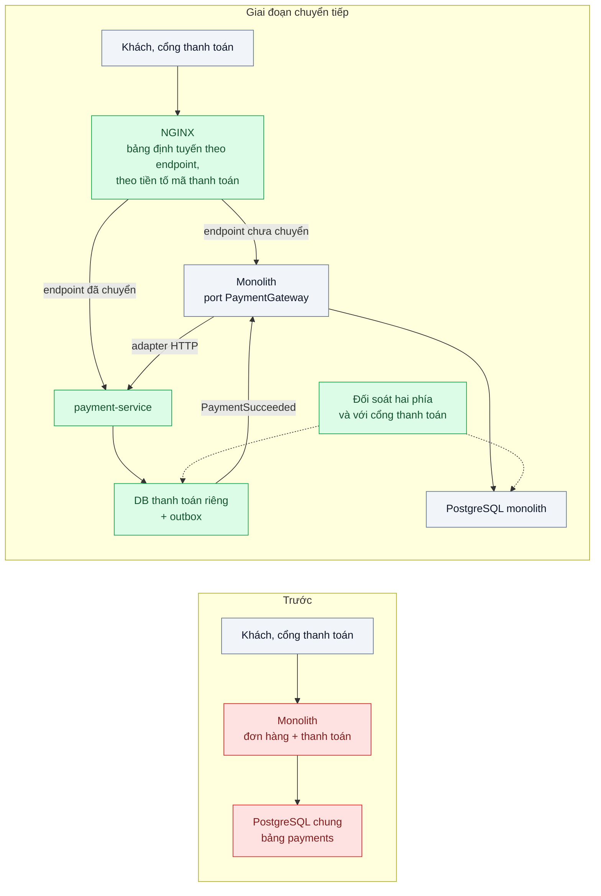
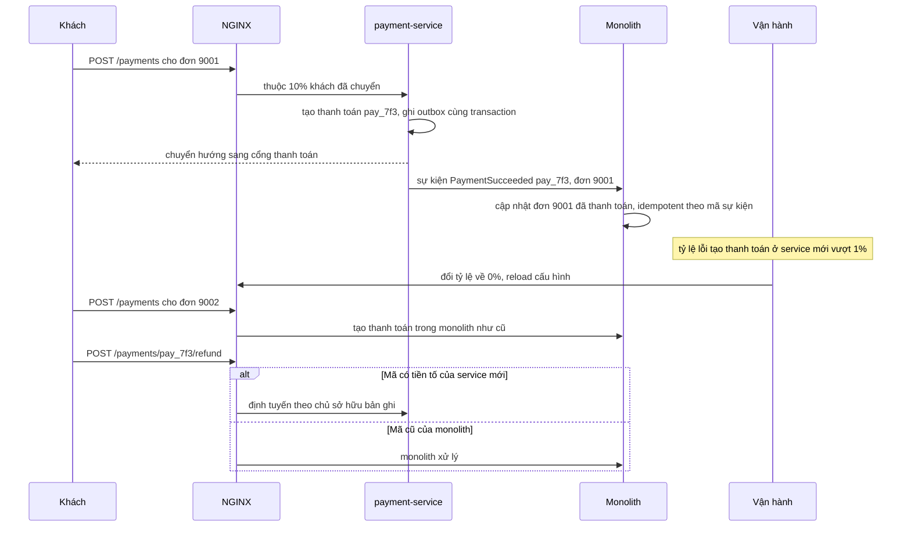

# Strangler Fig — Tách module thanh toán ra khỏi monolith mà không dừng hệ thống

| Scope | Mức độ | Trạng thái | Pattern gốc | Cập nhật |
|---|---|---|---|---|
| 08 · backend / monolithics | 🔴 Nâng cao | 📋 Kế hoạch | Strangler Fig — Fowler bliki "StranglerFigApplication" (2004); Newman, *Monolith to Microservices* (2019) | 2026-10-06 |

> **Một câu tóm tắt:** Đặt một lớp định tuyến trước monolith, xây service thanh toán mới bên cạnh, rồi chuyển từng endpoint và từng phần dữ liệu sang service mới theo từng bước nhỏ có thể quay lại, cho tới khi phần thanh toán trong monolith không còn ai gọi và được xóa.

## 1. Bài toán thực tế (What)

**Bối cảnh** *(doanh nghiệp giả định, số liệu minh họa)*
Sàn TMĐT ở bài 04, khoảng 8.000 đơn mỗi ngày, đỉnh gấp 10 lần vào các đợt sale. Module thanh toán đã được tách sau port ở bài 04 và có ranh giới module ở bài 05, nhưng vẫn chạy trong monolith NestJS, dùng chung PostgreSQL. Ba lý do khiến doanh nghiệp muốn tách: phạm vi kiểm toán bảo mật thanh toán đang bao trùm cả monolith; thanh toán cần scale riêng trong đợt sale; đội thanh toán muốn phát hành theo nhịp riêng.

**Triệu chứng người kinh doanh nhìn thấy**
- Mỗi kỳ kiểm toán bảo mật thanh toán phải rà toàn bộ monolith, tốn vài tuần của cả đội kỹ thuật và chi phí tư vấn.
- Trong đợt sale, phải scale cả monolith (nặng, khởi động chậm) chỉ vì luồng thanh toán quá tải.
- Kế hoạch "viết lại thanh toán thành service mới rồi chuyển một đêm" bị ban lãnh đạo bác vì rủi ro mất tiền và dừng bán hàng.

**Nguyên nhân kỹ thuật**
Thanh toán gắn với monolith ở ba mức: endpoint (khách và cổng thanh toán gọi vào monolith), lời gọi nội bộ (đặt hàng, hoàn tiền gọi code thanh toán trong tiến trình), và dữ liệu (bảng `payments` nằm cùng DB, được các module khác đọc). Chuyển một lần nghĩa là đổi cả ba mức cùng lúc, không có cách thử từng phần với lưu lượng thật và không có đường lui nếu sai.

**Ràng buộc**
- Không có thời gian dừng; không mất hoặc trùng giao dịch; mọi giao dịch đối soát được với cổng thanh toán.
- Mỗi bước chuyển phải quay lại được trong vài phút.
- Tại mọi thời điểm, mỗi bản ghi thanh toán chỉ có *một* bên được ghi.
- Monolith vẫn cần biết trạng thái thanh toán để cập nhật đơn hàng.

## 2. Vì sao dùng pattern này (Why)

**Nguyên nhân gốc mà pattern nhắm vào:** thay thế được hình dung như một lần cắt chuyển toàn bộ, trong khi hệ thống cần tiếp tục phục vụ và rủi ro chỉ chấp nhận được khi chia nhỏ.

**Pattern giải quyết thế nào:** Fowler lấy hình ảnh cây đa bóp cổ: cây mới mọc quanh cây cũ cho tới khi cây cũ không còn cần thiết. Newman chi tiết hóa cho việc tách monolith: đặt một lớp chặn (ở đây là NGINX) trước monolith; xây chức năng ở service mới; chuyển định tuyến từng endpoint, bắt đầu từ endpoint chỉ đọc; với lời gọi *bên trong* monolith thì dùng Branch by Abstraction (port `PaymentGateway` của bài 04 đổi adapter từ gọi trong tiến trình sang HTTP client); với dữ liệu thì đồng bộ có chủ đích và chuyển quyền ghi theo từng giai đoạn; với thao tác rủi ro thì Parallel Run để so kết quả. Service mới phát sự kiện `PaymentSucceeded` qua outbox để monolith cập nhật đơn mà không đọc DB của service. Mỗi bước chỉ là đổi tuyến, nên quay lại là đổi tuyến ngược.

**Lựa chọn khác đã cân nhắc**

| Lựa chọn | Giải quyết được gì | Vì sao không chọn (ở bài này) |
|---|---|---|
| Giữ nguyên + tối ưu nhỏ (scale monolith, khoanh vùng kiểm toán bằng tài liệu) | Không tốn công tách | Không thu hẹp được phạm vi kiểm toán thật; scale vẫn phải kéo cả monolith |
| Viết lại và chuyển một lần (big bang) | Kết thúc nhanh trên giấy | Không thử được với lưu lượng thật; không có đường lui; rủi ro mất tiền |
| Strangler Fig theo từng endpoint + Branch by Abstraction + outbox (chọn) | Từng bước nhỏ, có số đo, quay lại được, kết thúc bằng việc xóa code cũ | Giai đoạn chuyển tiếp dài với hai hệ thống, đồng bộ dữ liệu và định tuyến phức tạp |

## 3. Thiết kế hệ thống (How)

### 3.1 Kiến trúc trước và sau



### 3.2 Luồng chính



### 3.3 Thành phần và trách nhiệm

| Thành phần | Trách nhiệm | Quyết định thiết kế đáng chú ý |
|---|---|---|
| NGINX (lớp chặn) | Định tuyến theo endpoint, theo phần trăm khách, theo tiền tố mã thanh toán | Tạo mới chia theo phần trăm khách ổn định; thao tác trên bản ghi có sẵn đi theo bên sở hữu bản ghi |
| `payment-service` | Chức năng thanh toán mới, DB riêng, outbox | Mã thanh toán có tiền tố riêng để định tuyến không cần tra cứu |
| Port `PaymentGateway` trong monolith | Branch by Abstraction cho lời gọi nội bộ | Đổi adapter trong tiến trình sang HTTP client theo toggle (bài 06) |
| Sự kiện qua outbox | Báo monolith trạng thái thanh toán | Monolith tiêu thụ idempotent, không đọc DB của service |
| Đồng bộ dữ liệu lịch sử | Sao chép thanh toán cũ sang DB mới cho tra cứu và hoàn tiền | Chỉ chuyển quyền ghi của bản ghi cũ ở giai đoạn cuối, sau khi đối soát khớp |
| Đối soát | So hai phía và với báo cáo của cổng thanh toán | Chạy hằng ngày và sau mỗi bước chuyển; là điều kiện để tăng phần trăm |

### 3.4 Điểm dễ sai khi triển khai
- Ghi kép một bản ghi ở cả hai hệ thống "cho chắc": hai nguồn sự thật lệch nhau, không biết tin bên nào. Mỗi bản ghi chỉ một bên ghi tại một thời điểm.
- Chia phần trăm theo request cho thao tác trên bản ghi có sẵn: hoàn tiền của thanh toán tạo ở service mới bị gửi vào monolith, nơi không có bản ghi đó.
- Chuyển webhook của cổng thanh toán quá sớm: webhook của giao dịch tạo ở monolith tới service mới. Webhook phải định tuyến theo chủ sở hữu giao dịch.
- Bỏ qua đường lui cho dữ liệu: đổi tuyến về monolith nhưng thanh toán đã tạo ở service mới vẫn cần được phục vụ; thiết kế định tuyến theo chủ sở hữu ngay từ đầu.
- Không bao giờ tới bước cuối: hai hệ thống sống song song mãi. Đặt mốc xóa code thanh toán trong monolith và đo số dòng còn lại.

## 4. Tech stack và tác động (Impact techstack)

| Lớp | Công nghệ chọn | Vì sao chọn | Thay thế tương đương |
|---|---|---|---|
| Lớp chặn | NGINX: `location` theo endpoint, `split_clients` theo id khách, `map` theo tiền tố mã | Đổi tuyến bằng reload cấu hình, không ngắt kết nối đang có | API gateway (Kong, Envoy), định tuyến trong ứng dụng |
| Service mới | TypeScript strict, NestJS 10, PostgreSQL 16 riêng | Trùng stack, tái dùng mô hình từ bài 03–04 | Fastify |
| Sự kiện | Transactional outbox + relay, hàng đợi PGMQ phía monolith | Nguyên tử với dữ liệu thanh toán, không cần broker mới | Kafka khi đã có |
| Lời gọi nội bộ | Adapter HTTP sau port `PaymentGateway`, chọn bằng toggle | Chuyển dần không đổi code nghiệp vụ | — |
| Đồng bộ lịch sử | Script sao chép theo lô + đối soát | Đơn giản, chạy lại được | CDC với Debezium (scope 05, 14) |
| Đo | k6 chạy liên tục, Prometheus theo tuyến, log NGINX, `cloc` | Bằng chứng không dừng, so lỗi và độ trễ hai tuyến, theo dõi phần code còn lại | Grafana |

**Thay đổi so với hệ thống hiện tại:** thêm NGINX phía trước, một service và DB mới, outbox và relay, adapter HTTP trong monolith, job đối soát. Đội vận hành học thêm quy trình đổi tuyến từng bước và runbook quay lại; đội thanh toán sở hữu service và DB riêng.

## 5. Kết quả đầu ra và cách đo (Output impact)

| Chỉ số | Trước (minh họa) | Mục tiêu khi thực hành | Cách đo |
|---|---|---|---|
| Request lỗi trong mỗi lần đổi tuyến | không áp dụng | 0 | k6 chạy liên tục 50 req/s, `http_req_failed` quanh thời điểm reload NGINX |
| Tỷ lệ lưu lượng thanh toán qua service mới | 0% | 0% → 10% → 50% → 100% theo kế hoạch | Metric request theo upstream từ log NGINX |
| Tỷ lệ lỗi và p95 theo tuyến | một tuyến | tuyến mới không kém tuyến cũ | Prometheus nhãn theo upstream; so ở mỗi bước |
| Giao dịch lệch giữa hai phía và với cổng thanh toán | không đối soát tự động | 0 | Job đối soát sau mỗi bước và hằng ngày |
| Thời gian quay lại một bước | không có đường lui | < 1 phút | Diễn tập đổi tuyến ngược, đo bằng log k6 |
| Dòng code thanh toán còn trong monolith | khoảng 9.000 | 0 khi kết thúc | `cloc` thư mục thanh toán của monolith theo từng mốc |

> Số "trước" là minh họa để hình dung bài toán. Số "mục tiêu" chỉ được coi là đạt khi có số đo thật
> ở mục 8 kèm môi trường đo.

**Tác động nghiệp vụ mong đợi:** phạm vi kiểm toán thanh toán thu về một service nhỏ; thanh toán scale riêng trong đợt sale; việc tách diễn ra trong khi vẫn bán hàng, với khả năng quay lại ở mọi bước.

## 6. Đánh đổi và khi KHÔNG nên dùng

**Đánh đổi**
- Giai đoạn chuyển tiếp dài: hai hệ thống, định tuyến theo chủ sở hữu, đồng bộ và đối soát đều tốn công vận hành.
- Thêm độ trễ mạng và lỗi mạng cho lời gọi trước đây nằm trong tiến trình.
- Giao dịch xuyên hệ thống (thanh toán và đơn hàng) chuyển từ một transaction sang nhất quán cuối cùng qua sự kiện.

**Không nên dùng khi**
- Module chưa có ranh giới rõ trong monolith (chưa làm bài 04–05): tách ra chỉ chuyển mớ rối sang mạng.
- Không có lý do kinh doanh cụ thể để tách (kiểm toán, scale, đội): modular monolith là đủ.

**Liên quan**
- [`../04-hexagonal-architecture-doi-cong-thanh-toan-phai-sua-20-file/`](../04-hexagonal-architecture-doi-cong-thanh-toan-phai-sua-20-file/) — port thanh toán là điểm cắt cho lời gọi nội bộ.
- [`../06-feature-toggle-branch-by-abstraction-refactor-lon-van-release-hang-tuan/`](../06-feature-toggle-branch-by-abstraction-refactor-lon-van-release-hang-tuan/) — toggle và Branch by Abstraction dùng trong từng bước.
- [`../../07-backend-microservices/02-database-per-service-hai-service-cung-sua-mot-bang/`](../../07-backend-microservices/02-database-per-service-hai-service-cung-sua-mot-bang/) — vì sao service mới phải có DB riêng.
- [`../../14-backend-queueing/03-transactional-outbox-ghi-don-xong-crash-mat-event/`](../../14-backend-queueing/03-transactional-outbox-ghi-don-xong-crash-mat-event/) — outbox cho sự kiện thanh toán.

## 7. Cơ sở tham khảo

- Martin Fowler, "StranglerFigApplication", bliki, 2004 — https://martinfowler.com/bliki/StranglerFigApplication.html — ý tưởng thay thế dần hệ thống cũ bằng hệ thống mới mọc quanh nó.
- Sam Newman, *Monolith to Microservices*, O'Reilly, 2019 — ch.3 (Strangler Fig, Branch by Abstraction, Parallel Run) và ch.4 (tách và đồng bộ dữ liệu) — các bước cụ thể cho endpoint, lời gọi nội bộ và dữ liệu.
- Microsoft Azure Architecture Center, "Strangler Fig pattern" và "Anti-Corruption Layer pattern" — https://learn.microsoft.com/azure/architecture/patterns/ — lớp facade định tuyến, các vấn đề cần cân nhắc khi chuyển dần.
- Chris Richardson, microservices.io, "Transactional outbox" — https://microservices.io/patterns/data/transactional-outbox.html — phát sự kiện thanh toán nguyên tử với dữ liệu.
- NGINX docs, `ngx_http_split_clients_module` và `ngx_http_map_module` — https://nginx.org/en/docs/ — chia lưu lượng theo phần trăm ổn định và định tuyến theo giá trị trong request.

## 8. Kế hoạch thực hành

- [ ] Bước 1: dựng monolith từ bài 04 (có port thanh toán), NGINX phía trước, server giả lập cổng thanh toán; Docker Compose với hai PostgreSQL.
- [ ] Bước 2: đo "trước": k6 chạy liên tục qua NGINX trỏ hết vào monolith; ghi tỷ lệ lỗi, p95 làm mốc; đếm dòng code thanh toán.
- [ ] Bước 3: áp dụng pattern theo giai đoạn: (a) `GET /payments/:id` sang service mới với Parallel Run; (b) tạo thanh toán theo phần trăm khách, mã có tiền tố, outbox về monolith; (c) hoàn tiền và webhook theo chủ sở hữu; (d) sao chép lịch sử, chuyển quyền ghi; (e) xóa code cũ.
- [ ] Bước 4: đo "sau" ở mỗi giai đoạn với k6 chạy liên tục và diễn tập quay lại; ghi số thật và môi trường vào mục 5.
- [ ] Bước 5: viết test: (a) đổi tuyến khi đang có tải không làm lỗi request; (b) hoàn tiền của mã `pay_` luôn tới service mới; (c) sự kiện lặp không cập nhật đơn hai lần; (d) đối soát phát hiện giao dịch lệch được tiêm vào.

**Cấu trúc code dự kiến**
```text
apps/
  monolith/src/payments/adapters/http-payment.gateway.ts   # [PATTERN] Branch by Abstraction
  monolith/src/orders/payment-events.consumer.ts           # tiêu thụ PaymentSucceeded idempotent
  payment-service/src/payments/create-payment.service.ts   # ghi thanh toán + outbox
  payment-service/src/outbox/outbox-relay.ts
infra/nginx/strangler.conf          # [PATTERN] location, split_clients, map theo tiền tố
scripts/backfill-payments.ts
scripts/reconcile-payments.ts
test/
  rerouting-under-load-has-no-errors.test.ts
  refund-routes-to-owning-service.test.ts
  duplicate-event-updates-once.test.ts
  reconciliation-detects-mismatch.test.ts
bench/continuous-payments.k6.js
docker-compose.yml
```

**Cách chạy** *(điền khi bắt đầu code)*
```bash
docker compose up -d
pnpm install && pnpm test
k6 run bench/continuous-payments.k6.js # đổi infra/nginx/strangler.conf rồi nginx -s reload trong lúc chạy
```
