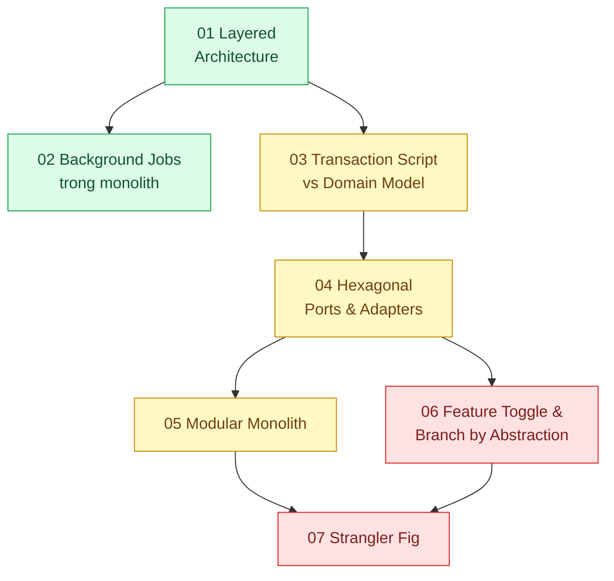

# 08 · Monolith (`backend / monolithics`)

> **Phạm vi:** Giữ một codebase lớn vẫn khỏe: phân lớp, mô hình miền, module hóa, cô lập phụ thuộc
> ngoài, refactor lớn mà vẫn release, tách dần khi cần. Quan điểm của scope: monolith được thiết kế
> tốt là lựa chọn mặc định hợp lý (Fowler, "MonolithFirst"); microservices là bước sau, không phải
> điểm xuất phát.
>
> **Câu hỏi trung tâm:** Giữ một codebase lớn vẫn dễ sửa, dễ test, dễ tách sau này, không cần
> microservices sớm?

## Bản đồ pattern trong scope

## Danh sách bài toán

| # | Bài toán (pattern — triệu chứng) | Mức | Pattern gốc / nguồn | Trạng thái |
|---|---|---|---|---|
| 01 | [Layered Architecture — Logic nghiệp vụ nằm trong controller, không test được, sửa một chỗ hỏng ba chỗ](./01-layered-architecture-logic-nam-trong-controller/) | 🟢 | Fowler, *PoEAA* (2002): Layering, Service Layer, Repository; NestJS docs (module/controller/provider) | 📋 |
| 02 | [Background Jobs in a Monolith — Xuất Excel 50k dòng làm treo tiến trình web](./02-background-job-trong-monolith-xuat-excel-lam-treo-web/) | 🟢 | 12factor.net "Processes", "Concurrency"; Azure "Asynchronous Request-Reply"; BullMQ / PGMQ docs | 📋 |
| 03 | [Transaction Script vs Domain Model — Hàm tính phí bảo hiểm 1.200 dòng if/else không ai dám sửa](./03-domain-model-vs-transaction-script-tinh-phi-bao-hiem-1200-dong/) | 🟡 | Fowler, *PoEAA*: Transaction Script, Domain Model, Service Layer; Evans, *DDD* (Value Object, Aggregate) | 📋 |
| 04 | [Hexagonal Architecture (Ports & Adapters) — Đổi cổng thanh toán phải sửa 20 file nghiệp vụ](./04-hexagonal-architecture-doi-cong-thanh-toan-phai-sua-20-file/) | 🟡 | Alistair Cockburn, "Hexagonal architecture" (2005); Robert C. Martin, *Clean Architecture* (2017) | 📋 |
| 05 | [Modular Monolith — 15 người cùng sửa một codebase, module nào cũng import module nào](./05-modular-monolith-team-15-nguoi-dung-nhau-trong-mot-codebase/) | 🟡 | Simon Brown, "Modular Monoliths"; Kamil Grzybek, "Modular Monolith: A Primer" (2019); Shopify Engineering, "Deconstructing the Monolith" (2019) | 📋 |
| 06 | [Feature Toggle & Branch by Abstraction — Refactor lớn kéo dài 2 tháng nhưng vẫn phải release hằng tuần](./06-feature-toggle-branch-by-abstraction-refactor-lon-van-release-hang-tuan/) | 🔴 | Pete Hodgson, "Feature Toggles" (martinfowler.com, 2017); Fowler bliki "BranchByAbstraction" (2014) | 📋 |
| 07 | [Strangler Fig — Tách module thanh toán ra khỏi monolith mà không dừng hệ thống](./07-strangler-fig-tach-thanh-toan-ra-khoi-monolith-khong-dung-he-thong/) | 🔴 | Fowler bliki "StranglerFigApplication" (2004); Newman, *Monolith to Microservices* (2019); Azure "Strangler Fig" | 📋 |

## Lộ trình đề xuất trong scope

1. **Layered** — kỷ luật tối thiểu; nền của mọi bài.
2. **Background jobs** — việc đầu tiên monolith cần tách ra khỏi request, không cần service mới.
3. **Transaction Script vs Domain Model** — bài về *khi nào* mô hình miền đáng giá.
4. **Hexagonal** — cô lập phụ thuộc ngoài; điều kiện để test và để thay thế.
5. **Modular monolith** — ranh giới module bằng công cụ (lint, package) thay vì bằng lời dặn.
6. **Feature toggle / Branch by abstraction → Strangler fig** — kỹ thuật thay đổi lớn an toàn.

## Kiến thức nền cần có trước

- Dependency injection; interface trong TypeScript.
- Test unit vs integration.
- Đọc scope 09 bài 03 (module boundaries) song song với bài 05 ở đây.

## Liên kết với scope khác

- `07-backend-microservices` — điểm đến của Strangler Fig; bounded context dùng chung.
- `09-backend-monorepo` — công cụ enforce ranh giới module.
- `14-backend-queueing` — hạ tầng cho background jobs.
- `16-backend-k8s` bài 06 — canary/blue-green là hạ tầng cho feature toggle ở mức deploy.

## Nguồn tổng quan cho scope

- Martin Fowler, *Patterns of Enterprise Application Architecture* (2002), phần I.
- Sam Newman, *Monolith to Microservices* (2019).
- Kamil Grzybek, "Modular Monolith: A Primer" — https://www.kamilgrzybek.com/blog/posts/modular-monolith-primer
