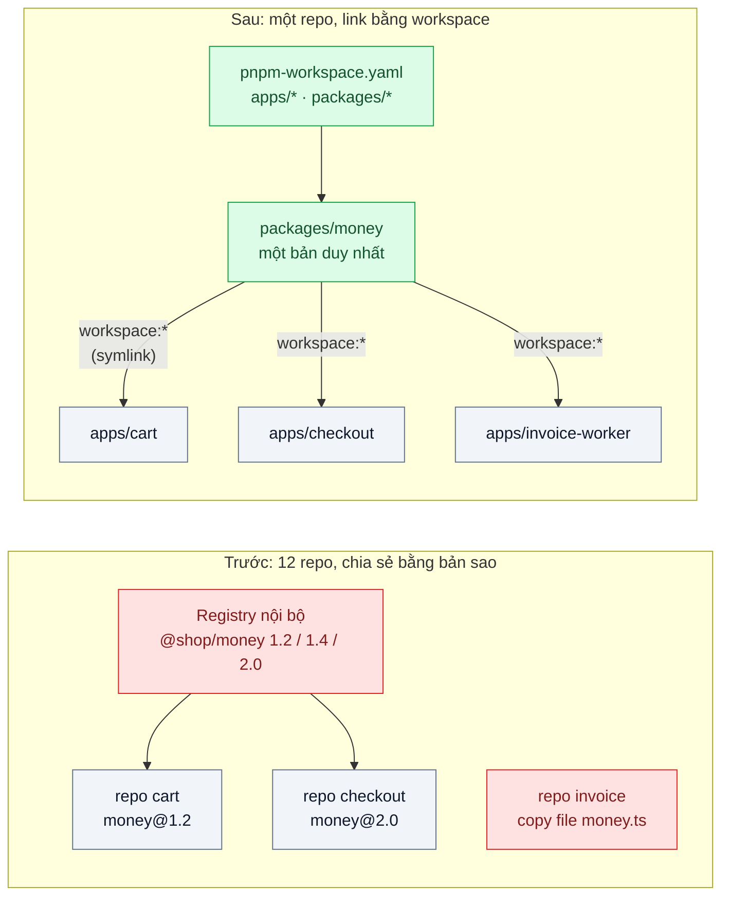
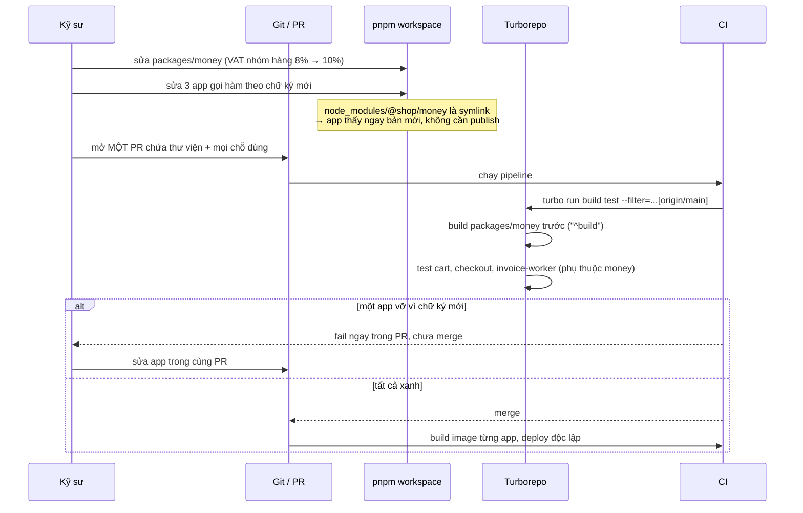

# Workspaces & Shared Packages — Sửa một hàm trong thư viện chung phải mở 12 PR ở 12 repo

| Scope | Mức độ | Trạng thái | Pattern gốc | Cập nhật |
|---|---|---|---|---|
| 09 · backend / monorepo | 🟢 Cơ bản | 📋 Kế hoạch | Workspaces & Shared Packages — pnpm docs "Workspaces"; Potvin & Levenberg, CACM 2016 | 2026-10-06 |

> **Một câu tóm tắt:** Gom 12 service và thư viện dùng chung vào một repo, để trình quản lý gói *link* thư viện thay vì *cài bản sao*, nhờ đó một thay đổi ở thư viện chung đi kèm mọi chỗ dùng nó trong đúng một commit.

## 1. Bài toán thực tế (What)

**Bối cảnh** *(doanh nghiệp giả định, số liệu minh họa)*
Một sàn thương mại điện tử có 12 service Node/TypeScript (giỏ hàng, thanh toán, hóa đơn, khuyến mãi, kho...), mỗi service một repo Git riêng. Thư viện `@shop/money` (tính VAT, làm tròn tiền, định dạng VND) được publish lên registry nội bộ; mỗi service ghim một phiên bản khác nhau, có service còn copy hẳn file vào `src/utils`.

**Triệu chứng người kinh doanh nhìn thấy**
- Khi quy định thuế đổi (một nhóm hàng từ VAT 8% sang 10%), kế toán yêu cầu sửa "một hàm" — đội kỹ thuật mất 2 tuần, 12 PR, 12 lần CI, 12 lần review mới lan ra hết hệ thống.
- Khách thấy tổng tiền ở trang giỏ hàng lệch vài trăm đồng so với trang thanh toán, vì hai service đang chạy hai bản `@shop/money` làm tròn khác nhau.
- Kỹ sư mới mất 3 ngày chỉ để clone 12 repo, cài 12 bộ phụ thuộc và xin quyền 12 lần.

**Nguyên nhân kỹ thuật**
Code dùng chung đang được chia sẻ bằng *bản sao* (publish phiên bản hoặc copy file). Mỗi service có vòng đời phụ thuộc riêng nên không có "một nguồn sự thật" về phiên bản đang chạy. Một thay đổi cần đi cùng ở thư viện và ở 12 nơi dùng không thể biểu diễn bằng một commit; test cũng không bao giờ chạy trên trạng thái "tất cả đã cập nhật".

**Ràng buộc**
- Mỗi service vẫn deploy độc lập; không được ép cả 12 service release cùng lúc.
- CI không được chậm hơn hiện tại (xem bài 03 về affected graph).
- Lịch sử Git của từng repo phải giữ được khi gom.

## 2. Vì sao dùng pattern này (Why)

**Nguyên nhân gốc mà pattern nhắm vào:** ranh giới *repo* đang trùng với ranh giới *deploy*, trong khi thứ cần chia sẻ (code) lại nằm chéo qua ranh giới đó.

**Pattern giải quyết thế nào:** một repo chứa nhiều package (`apps/*`, `packages/*`), khai báo trong `pnpm-workspace.yaml`. Package nội bộ phụ thuộc nhau qua giao thức `workspace:*`; `pnpm install` tạo symlink thay vì tải từ registry, nên app luôn thấy *đúng* bản thư viện trong cùng commit. Sửa `@shop/money` và sửa 12 chỗ gọi nằm trong một PR; CI chạy test của mọi package bị ảnh hưởng trên trạng thái cuối cùng. Potvin & Levenberg gọi đây là lợi ích "thay đổi atomic" và "một nguồn sự thật", đồng thời tránh được "diamond dependency" (hai bản khác nhau của cùng thư viện trong một hệ thống).

**Lựa chọn khác đã cân nhắc**

| Lựa chọn | Giải quyết được gì | Vì sao không chọn (ở bài này) |
|---|---|---|
| Giữ nguyên + tối ưu nhỏ: bot tự mở 12 PR nâng phiên bản (Renovate/Dependabot) | Bớt thao tác tay | Vẫn 12 PR, 12 CI; thay đổi không atomic; service chậm cập nhật vẫn chạy bản cũ |
| Git submodule cho thư viện chung | Chia sẻ source không qua registry | Submodule ghim commit, vẫn phải cập nhật 12 nơi; trải nghiệm Git khó cho cả đội |
| Gộp 12 service thành một monolith | Hết vấn đề chia sẻ | Đổi kiến trúc *runtime* chỉ để giải bài tổ chức *code* là quá tay; monorepo tách hai ranh giới này |
| Publish lên registry với SemVer chặt (bài 06) | Kiểm soát phiên bản rõ | Phù hợp khi người dùng ở *ngoài* repo; bên trong repo nó là chi phí thừa |

## 3. Thiết kế hệ thống (How)

### 3.1 Kiến trúc trước và sau



### 3.2 Luồng chính



### 3.3 Thành phần và trách nhiệm

| Thành phần | Trách nhiệm | Quyết định thiết kế đáng chú ý |
|---|---|---|
| `pnpm-workspace.yaml` | Khai báo thư mục package (`apps/*`, `packages/*`) | Chỉ hai nhóm; không lồng sâu để graph dễ đọc |
| `packages/money` | Thư viện chung: `vat()`, `round()`, `formatVnd()` | `exports` trỏ vào `dist`; không phụ thuộc runtime nào ngoài TypeScript |
| `apps/*` | Service NestJS, web Next.js, worker | Khai báo `"@shop/money": "workspace:*"`; không import đường dẫn tương đối sang package khác |
| `turbo.json` | Pipeline `build` / `test` / `lint`, `dependsOn: ["^build"]` | Bảo đảm thư viện build trước app phụ thuộc |
| `tsconfig.base.json` | Cấu hình TS strict dùng chung | App chỉ `extends`, không tự chỉnh `paths` sang `src` của package khác |
| `package.json` gốc | `packageManager: pnpm@10`, `engines` | Dùng corepack để mọi máy cùng phiên bản pnpm |

### 3.4 Điểm dễ sai khi triển khai
- Khai báo phụ thuộc bằng `file:../packages/money` hoặc đường dẫn tương đối thay cho `workspace:*` → pnpm *copy* thay vì link, lại thành bản sao.
- Thư viện chưa build mà app đã build → "Cannot find module @shop/money" trên CI dù local chạy được (local còn `dist` cũ). Cần `dependsOn: ["^build"]`.
- Package chung phình thành `utils` chứa mọi thứ → mọi app phụ thuộc mọi thứ, affected graph (bài 03) mất ý nghĩa. Tách theo nghiệp vụ, ranh giới ở bài 04.
- pnpm không hoist "phantom dependency": code đang import gói không khai báo sẽ lỗi sau khi gom. Đó là lỗi tốt — khai báo cho đúng, đừng bật `shamefully-hoist`.
- Thiếu `packageManager` + corepack → mỗi máy một phiên bản pnpm, lockfile đổi qua lại.

## 4. Tech stack và tác động (Impact techstack)

| Lớp | Công nghệ chọn | Vì sao chọn | Thay thế tương đương |
|---|---|---|---|
| Trình quản lý gói | pnpm 10 | Giao thức `workspace:`, store nội dung-địa chỉ tiết kiệm đĩa, `node_modules` strict không hoist phantom deps | npm workspaces, Yarn workspaces |
| Điều phối task | Turborepo | Hiểu graph phụ thuộc giữa package, `--filter`, cache (nền cho bài 03) | Nx |
| Ngôn ngữ / runtime | TypeScript strict, Node 20+ | Trùng stack sản phẩm; type lộ ngay chỗ gọi vỡ khi đổi chữ ký | — |
| App mẫu | NestJS (`apps/api`), Next.js (`apps/web`) | Hai kiểu app phổ biến nhất cùng dùng một thư viện | Fastify, Remix |
| Test | Vitest | Nhanh, ESM tốt, chạy được ở từng package | Jest |
| Container | Docker multi-stage (scope 17 bài 01) | Build image từng app từ monorepo | — |

**Thay đổi so với hệ thống hiện tại:** 12 repo gộp thành một (giữ lịch sử bằng `git subtree`/`git filter-repo`); `@shop/money` không publish nữa mà nằm trong `packages/`; CI chuyển sang chạy theo graph; đội vận hành phải học `pnpm --filter`, cách build image cho một app trong monorepo.

## 5. Kết quả đầu ra và cách đo (Output impact)

| Chỉ số | Trước (minh họa) | Mục tiêu khi thực hành | Cách đo |
|---|---|---|---|
| Số PR cho một thay đổi ở thư viện chung | 12 | 1 | Đếm PR/merge commit liên quan (`git log --merges --grep`) trên bản mô phỏng |
| Số phiên bản `@shop/money` chạy đồng thời | 3–4 | 1 | `pnpm ls -r --depth 0 @shop/money` chỉ ra một bản, nguồn `link:` |
| Thời gian từ sửa thư viện tới mọi app dùng bản mới | ~2 tuần | Ngay khi merge (cùng commit) | So timestamp commit thư viện với commit nâng phiên bản ở từng app; sau: một commit |
| Thời gian dựng môi trường dev từ máy sạch | 12 lần `npm install`, ~40 phút | 1 lần `pnpm install` | `time pnpm install` với store rỗng (`pnpm store path` rồi xóa), ghi máy/mạng |
| Dung lượng `node_modules` tổng | 12 × ~300 MB | Một store dùng chung | `du -sh node_modules` từng app + `du -sh $(pnpm store path)` |

> Số "trước" là minh họa để hình dung bài toán. Số "mục tiêu" chỉ được coi là đạt khi có số đo thật
> ở mục 8 kèm môi trường đo.

**Tác động nghiệp vụ mong đợi:** thay đổi quy định thuế đi vào mọi service trong một lần release thay vì hai tuần, và không còn hai cách làm tròn tiền cùng tồn tại trên sàn.

## 6. Đánh đổi và khi KHÔNG nên dùng

**Đánh đổi**
- Repo lớn hơn: clone lâu hơn (cần shallow/partial clone), IDE index nặng hơn, một lần `pnpm install` lỗi chặn mọi người.
- CI phải thông minh hơn (affected + cache, bài 03) nếu không sẽ chậm hơn 12 repo cộng lại.
- Cần quy ước ranh giới (bài 04) và sở hữu code (bài 02); không có hai thứ đó, monorepo biến thành "mọi người sửa mọi thứ".

**Không nên dùng khi**
- Các service do đội/công ty tách biệt hoàn toàn sở hữu, với chính sách truy cập và chu kỳ release khác nhau.
- Thư viện cần publish cho người dùng *ngoài* repo (SDK công khai) — khi đó cần bài 06.
- Đội 2–3 người với 1–2 service: không có vấn đề để giải, chi phí tooling không bù lại.

**Liên quan**
- [03 — Affected Graph & Remote Cache](../03-affected-graph-ci-chay-40-phut-cho-moi-commit/) — làm CI không chậm sau khi gom.
- [04 — Enforced Module Boundaries](../04-module-boundaries-frontend-import-thang-vao-repository-backend/) — ranh giới khi mọi thứ "cùng repo".
- [06 — Independent Versioning](../06-versioning-release-xuat-ban-package-noi-bo-theo-changeset/) — khi vẫn cần publish ra ngoài.
- [17-01 — Multi-stage Build](../../17-backend-docker/01-multi-stage-build-image-1-8gb-deploy-10-phut/) — build image một app từ monorepo.
- [08-05 — Modular Monolith](../../08-backend-monolith/05-modular-monolith-team-15-nguoi-dung-nhau-trong-mot-codebase/) — ranh giới ở mức module trong một app.

## 7. Cơ sở tham khảo

- pnpm docs, "Workspaces" — https://pnpm.io/workspaces — cơ chế `pnpm-workspace.yaml`, giao thức `workspace:` và cách nó được thay bằng phiên bản thật khi publish.
- Potvin & Levenberg, "Why Google Stores Billions of Lines of Code in a Single Repository", CACM 59(7), 2016 — https://cacm.acm.org/research/why-google-stores-billions-of-lines-of-code-in-a-single-repository/ — lợi ích thay đổi atomic, một nguồn sự thật, tránh diamond dependency; chi phí tooling đi kèm.
- Winters, Manshreck, Wright (eds.), *Software Engineering at Google*, O'Reilly, 2020, ch.16 "Version Control and Branch Management" — https://abseil.io/resources/swe-book — lập luận "One-Version Rule": mỗi thư viện chỉ một bản trong hệ thống.
- Turborepo docs — https://turborepo.com/docs — quy ước `apps/` · `packages/`, `dependsOn: ["^build"]`, `--filter`.
- TypeScript Handbook, "Project References" — https://www.typescriptlang.org/docs/handbook/project-references.html — build tăng dần nhiều package TypeScript trong một repo.

## 8. Kế hoạch thực hành

- [ ] Bước 1: Dựng "trước" — ba thư mục `truoc/repo-cart`, `truoc/repo-checkout`, `truoc/repo-invoice`, mỗi cái một bản `money.ts` lệch nhau một chút (làm tròn khác); test chỉ ra tổng tiền lệch giữa hai "repo".
- [ ] Bước 2: Đo "trước" — script đếm số chỗ phải sửa cho một thay đổi VAT (`grep -rn vat truoc/`), `time npm install` ×3 từ máy sạch.
- [ ] Bước 3: Áp dụng — `pnpm-workspace.yaml`, `packages/money`, `apps/api` (NestJS), `apps/web` (Next.js), `apps/invoice-worker` dùng `workspace:*`; `turbo.json` với `build.dependsOn = ["^build"]`.
- [ ] Bước 4: Đo "sau" — `pnpm ls -r --depth 0 @shop/money`, `time pnpm install`, ghi vào mục 5 kèm máy và phiên bản pnpm.
- [ ] Bước 5: Test — Vitest trong `packages/money` cho `vat()`/`round()`; test ở gốc kiểm tra mọi app resolve `@shop/money` về cùng một đường dẫn trong `packages/money`.

**Cấu trúc code dự kiến**
```text
truoc/                      # 3 "repo" giả lập, mỗi cái một bản money.ts
pnpm-workspace.yaml
turbo.json
package.json                # packageManager: pnpm@10
tsconfig.base.json
apps/
  api/                      # NestJS: endpoint tính tổng đơn
  web/                      # Next.js: trang giỏ hàng hiển thị tiền
  invoice-worker/           # worker sinh hóa đơn
packages/
  money/                    # @shop/money: vat(), round(), formatVnd()
test/
  one-version.test.ts       # mọi app resolve cùng một bản @shop/money
```

**Cách chạy** *(điền khi bắt đầu code)*
```bash
pnpm install
pnpm turbo run build test
pnpm ls -r --depth 0 @shop/money   # mong đợi: một phiên bản, nguồn link workspace
```
