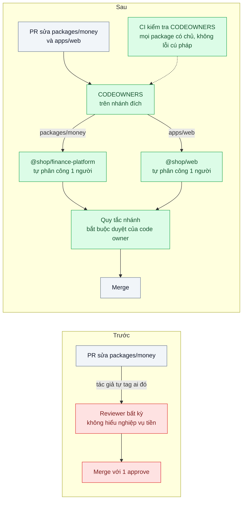
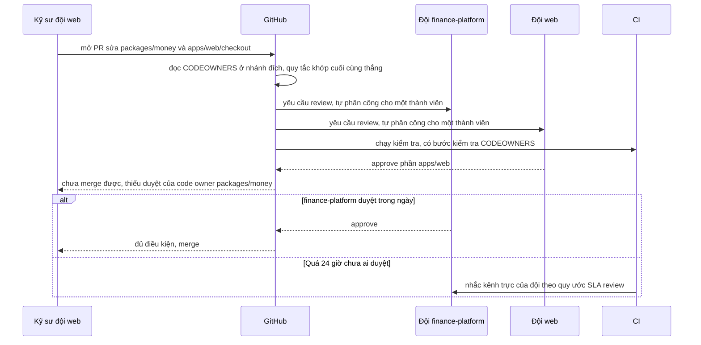

# Code Ownership & Review Routing — 60 người trong một repo, không biết ai phải review thư mục nào

| Scope | Mức độ | Trạng thái | Pattern gốc | Cập nhật |
|---|---|---|---|---|
| 09 · backend / monorepo | 🟢 Cơ bản | 📋 Kế hoạch | Code Ownership & Review Routing — GitHub Docs "About code owners"; *Software Engineering at Google* (2020) ch.9 Code Review | 2026-10-06 |

> **Một câu tóm tắt:** Ghi rõ đội nào sở hữu thư mục nào trong file `CODEOWNERS`, để mỗi PR tự động gọi đúng người review và không thể merge phần code quan trọng khi chủ sở hữu chưa duyệt.

## 1. Bài toán thực tế (What)

**Bối cảnh** *(doanh nghiệp giả định, số liệu minh họa)*
Sàn thương mại điện tử vừa gom 12 repo vào một monorepo (bài 01): 14 app, 20 package, 60 kỹ sư chia 7 đội (thanh toán, giỏ hàng, kho, web, mobile BFF, nền tảng, dữ liệu). Quy tắc review hiện tại: "cần 1 approve của bất kỳ ai". Khoảng 25 PR mỗi ngày.

**Triệu chứng người kinh doanh nhìn thấy**
- Một PR sửa hàm làm tròn tiền trong `packages/money` được đồng nghiệp đội web approve; hóa đơn của một ngày bị lệch, kế toán phải xuất lại hơn 3.000 hóa đơn.
- PR trung bình chờ gần 2 ngày mới có người review vì tác giả không biết hỏi ai; tính năng trễ hẹn với đội kinh doanh.
- Ba kỹ sư lâu năm bị tag vào gần như mọi PR, thành nút cổ chai và kiệt sức.

**Nguyên nhân kỹ thuật**
Ranh giới sở hữu từng trùng với ranh giới repo: ai có quyền ghi repo `payment` thì là người hiểu code thanh toán. Gom vào một repo xóa mất ranh giới đó, nhưng chưa có gì thay thế. Không có thông tin máy đọc được về "thư mục này thuộc đội nào", nên GitHub không gợi ý được người review và nhánh chính không đòi hỏi duyệt của người hiểu code.

**Ràng buộc**
- Không tách repo trở lại; vẫn giữ lợi ích thay đổi atomic của bài 01.
- Không làm PR chậm hơn: không được biến một đội thành người duyệt bắt buộc của mọi PR.
- Quy tắc sở hữu phải tự kiểm tra được trong CI, không chỉ nằm trong wiki.

## 2. Vì sao dùng pattern này (Why)

**Nguyên nhân gốc mà pattern nhắm vào:** quyền sở hữu code tồn tại trong đầu người, không ở dạng mà công cụ review có thể thực thi.

**Pattern giải quyết thế nào:** *Software Engineering at Google* (ch.9) mô tả mỗi thay đổi ở Google cần ba loại chấp thuận: một người kiểm tra tính đúng (LGTM), **chủ sở hữu** của thư mục bị sửa (ghi trong file OWNERS đặt theo thư mục) và người duyệt về readability. Ở GitHub, file `CODEOWNERS` đóng vai trò OWNERS: mỗi dòng là một mẫu đường dẫn và các chủ sở hữu (người hoặc đội); khi PR chạm file khớp mẫu, GitHub tự yêu cầu review từ chủ sở hữu. Bật quy tắc bảo vệ nhánh "Require review from Code Owners" thì PR không thể merge khi chủ sở hữu của phần bị sửa chưa duyệt. Kết hợp với cài đặt review của đội (tự phân công trong đội theo vòng tròn hoặc cân bằng tải), yêu cầu review đi tới *một* người của đúng đội thay vì cả đội hay ba người lâu năm.

**Lựa chọn khác đã cân nhắc**

| Lựa chọn | Giải quyết được gì | Vì sao không chọn (ở bài này) |
|---|---|---|
| Giữ nguyên + tối ưu nhỏ (bảng "ai sở hữu gì" trong wiki, nhắc trong PR template) | Có thông tin để tra | Không ai buộc phải tra; không chặn được merge sai người |
| Bắt buộc 2 approve của bất kỳ ai | Thêm một lớp kiểm tra | Hai người không hiểu code vẫn approve được; PR chậm thêm |
| Tách lại thành nhiều repo theo đội | Ranh giới sở hữu rõ | Mất thay đổi atomic và một phiên bản thư viện (bài 01) |
| Bot tự viết định tuyến review (Danger hoặc GitHub Action riêng) | Linh hoạt tùy ý | Tự duy trì logic mà GitHub đã có sẵn; vẫn cần chặn merge bằng quy tắc nhánh |
| `CODEOWNERS` theo package + quy tắc nhánh + tự phân công trong đội (chọn) | Gọi đúng đội, chặn merge sai, chia tải trong đội | Phải giữ file đúng khi cấu trúc repo đổi |

## 3. Thiết kế hệ thống (How)

### 3.1 Kiến trúc trước và sau



### 3.2 Luồng chính



### 3.3 Thành phần và trách nhiệm

| Thành phần | Trách nhiệm | Quyết định thiết kế đáng chú ý |
|---|---|---|
| `.github/CODEOWNERS` | Ánh xạ đường dẫn tới đội | Chủ sở hữu là *đội* (`@shop/finance-platform`), không phải cá nhân; mức chi tiết theo package |
| Quy tắc bảo vệ nhánh / ruleset trên `main` | Bắt buộc duyệt của code owner | Áp dụng cho mọi người, kể cả admin, để quy tắc có ý nghĩa |
| Cài đặt review của đội | Tự phân công một người trong đội | Thuật toán cân bằng tải để tránh dồn vào một người |
| Bước CI `codeowners-check` | Mọi thư mục trong `apps/*`, `packages/*` có chủ; không có lỗi cú pháp | Đọc danh sách lỗi CODEOWNERS từ GitHub REST API (cần xác minh endpoint) + script so khớp `git ls-files` |
| File chung của repo | `pnpm-lock.yaml`, `turbo.json`, `.github/` | Lockfile *không* gán cho đội nền tảng, nếu không mọi PR thêm thư viện đều chờ họ |
| SLA review | Quy ước thời gian phản hồi | Nhắc tự động sau 24 giờ; số liệu PR chờ hiển thị trên dashboard |

### 3.4 Điểm dễ sai khi triển khai
- **Thứ tự dòng.** Quy tắc khớp *cuối cùng* thắng; đặt `*` mặc định ở cuối file sẽ ghi đè mọi quy tắc cụ thể phía trên.
- **Đội không có quyền ghi repo.** GitHub bỏ qua chủ sở hữu không đủ quyền và chỉ báo lỗi trong giao diện file; CI phải đọc lỗi này.
- **Cú pháp không giống hoàn toàn `.gitignore`.** Một số cú pháp như phủ định `!` hay dải ký tự `[ ]` không được hỗ trợ; đừng chép nguyên `.gitignore`.
- **Chủ sở hữu là cá nhân.** Người nghỉ phép hoặc nghỉ việc làm PR kẹt; luôn dùng đội.
- **Gán quá rộng.** Một đội sở hữu `packages/**` thành nút cổ chai mới; chia theo package và nghiệp vụ.
- **Sửa CODEOWNERS ngay trong PR để tự né.** GitHub đọc file ở nhánh đích, nhưng file `CODEOWNERS` cũng phải có chủ sở hữu (đội nền tảng) để thay đổi được duyệt.

## 4. Tech stack và tác động (Impact techstack)

| Lớp | Công nghệ chọn | Vì sao chọn | Thay thế tương đương |
|---|---|---|---|
| Nền tảng Git | GitHub: `CODEOWNERS`, protected branches / rulesets, team review assignment | Có sẵn, tích hợp vào PR, không thêm hệ thống | GitLab Code Owners (có section và số người duyệt), Gerrit |
| Monorepo | pnpm 10 workspaces + Turborepo (từ bài 01) | Cấu trúc `apps/*`, `packages/*` cho mức chi tiết sở hữu theo package | Nx (có thể sinh CODEOWNERS từ metadata dự án, cần xác minh) |
| Kiểm tra trong CI | Script Node 20+ TypeScript strict + GitHub Actions | Kiểm tra mọi package có chủ, đọc lỗi CODEOWNERS, chạy trên mỗi PR | — |
| Đo | GitHub REST API (pulls, reviews) + script tổng hợp | Thời gian chờ review, phân bố tải review theo người | GitHub Insights |

**Thay đổi so với hệ thống hiện tại:** thêm file `CODEOWNERS`, bật quy tắc nhánh và tự phân công cho 7 đội, thêm bước CI kiểm tra; quy trình tạo package mới phải khai báo đội sở hữu. Trưởng nhóm phải thống nhất ranh giới sở hữu — phần khó nhất là con người, không phải cấu hình.

## 5. Kết quả đầu ra và cách đo (Output impact)

| Chỉ số | Trước (minh họa) | Mục tiêu khi thực hành | Cách đo |
|---|---|---|---|
| Thời gian từ mở PR tới review đầu tiên | p50 ≈ 2 ngày | p50 ≤ 4 giờ | GitHub REST API: `created_at` của PR so với `submitted_at` của review đầu tiên, trên repo mô phỏng |
| PR chạm package quan trọng merge không có duyệt của chủ sở hữu | thường xuyên | 0 | Script đối chiếu file thay đổi, CODEOWNERS và danh sách review đã duyệt |
| Tỷ lệ thư mục `apps/*`, `packages/*` có chủ sở hữu | 0 % | 100 % | Bước CI `codeowners-check` |
| Tỷ trọng review dồn vào 3 người nhiều nhất | 60 % | ≤ 25 % | Đếm review theo người trong 2 tuần mô phỏng |
| Lỗi trong file CODEOWNERS | chưa kiểm | 0 | GitHub REST API danh sách lỗi CODEOWNERS (cần xác minh) |

> Số "trước" là minh họa để hình dung bài toán. Số "mục tiêu" chỉ được coi là đạt khi có số đo thật
> ở mục 8 kèm môi trường đo.

**Tác động nghiệp vụ mong đợi:** thay đổi ở code tiền, thuế, kho luôn được người hiểu nghiệp vụ duyệt trước khi tới khách; PR không còn chờ vô chủ nên tính năng ra đúng hẹn hơn.

## 6. Đánh đổi và khi KHÔNG nên dùng

**Đánh đổi**
- PR chạm nhiều thư mục cần nhiều đội duyệt; thay đổi xuyên suốt (đổi tên hàm dùng ở 14 app) chậm hơn.
- File `CODEOWNERS` phải được giữ đúng khi tái cấu trúc thư mục; sai là chặn merge hoặc lọt kiểm tra.
- Có thể tạo văn hóa "không phải code của tôi" nếu sở hữu bị hiểu là độc quyền thay vì trách nhiệm.

**Không nên dùng khi**
- Đội nhỏ (dưới khoảng 8 người) cùng làm mọi thứ: chỉ thêm thủ tục.
- Repo chỉ có một đội sở hữu toàn bộ: quy tắc "1 approve" là đủ.
- Chưa thống nhất được ranh giới nghiệp vụ giữa các đội: viết CODEOWNERS lúc này chỉ đóng băng ranh giới sai.

**Liên quan**
- Đọc trước: [01 — Workspaces & Shared Packages](../01-workspace-sua-shared-lib-phai-mo-12-pr/).
- Đọc sau: [04 — Enforced Module Boundaries](../04-module-boundaries-frontend-import-thang-vao-repository-backend/) — sở hữu ai *duyệt*, ranh giới ai được *import*; [05 — Trunk-based Development](../05-trunk-based-development-branch-song-3-tuan-merge-hell/) — review nhanh là điều kiện của nhánh ngắn.
- Cùng chủ đề: [08-05 — Modular Monolith](../../08-backend-monolith/05-modular-monolith-team-15-nguoi-dung-nhau-trong-mot-codebase/) — sở hữu module trong một ứng dụng.

## 7. Cơ sở tham khảo

- GitHub Docs, "About code owners" — https://docs.github.com/articles/about-code-owners — vị trí file, cú pháp, quy tắc khớp cuối cùng thắng, yêu cầu quyền ghi, cú pháp không được hỗ trợ.
- GitHub Docs, "About protected branches" (Require review from Code Owners) và "Managing code review settings for your team" — https://docs.github.com/ — chặn merge khi thiếu duyệt của chủ sở hữu; tự phân công trong đội.
- Winters, Manshreck, Wright (eds.), *Software Engineering at Google*, O'Reilly, 2020, ch.9 "Code Review" — https://abseil.io/resources/swe-book — ba loại chấp thuận (LGTM, owners, readability) và file OWNERS theo thư mục.
- Potvin & Levenberg, "Why Google Stores Billions of Lines of Code in a Single Repository", CACM 2016 — https://cacm.acm.org/research/why-google-stores-billions-of-lines-of-code-in-a-single-repository/ — vai trò của quyền sở hữu thư mục khi mọi người cùng một repo.

## 8. Kế hoạch thực hành

- [ ] Bước 1: dựng monorepo mô phỏng (từ bài 01) trên một tổ chức GitHub thử nghiệm với 3 đội; tái hiện hiện trạng "1 approve bất kỳ".
- [ ] Bước 2: đo "trước": script sinh 30 PR mô phỏng chạm các package khác nhau, đo thời gian chờ review và tỷ lệ merge không có chủ sở hữu duyệt.
- [ ] Bước 3: viết `CODEOWNERS` theo package, bật quy tắc nhánh "Require review from Code Owners", bật tự phân công trong đội, thêm bước CI `codeowners-check`.
- [ ] Bước 4: đo "sau" với cùng bộ PR; ghi số thật và môi trường vào mục 5.
- [ ] Bước 5: test cho script kiểm tra: (a) package mới không có chủ làm CI đỏ; (b) dòng `*` đặt sai vị trí bị cảnh báo; (c) đối chiếu đúng chủ sở hữu cho file khớp nhiều mẫu.

**Cấu trúc code dự kiến**
```text
.github/
  CODEOWNERS                     # [PATTERN] đường dẫn → đội
  workflows/codeowners-check.yml
tools/codeowners-check/
  src/parse-codeowners.ts        # [PATTERN] quy tắc khớp cuối cùng thắng
  src/check-coverage.ts          # mọi apps/*, packages/* có chủ
  src/review-latency-report.ts   # thời gian chờ review từ GitHub REST API
  test/
    last-match-wins.test.ts
    every-package-has-owner.test.ts
apps/ packages/                  # monorepo mô phỏng từ bài 01
```

**Cách chạy** *(điền khi bắt đầu code)*
```bash
pnpm install
pnpm --filter codeowners-check test
pnpm --filter codeowners-check start -- --repo <org>/<repo>
```
