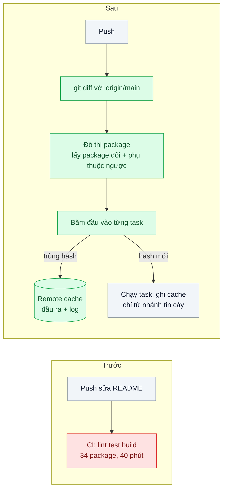
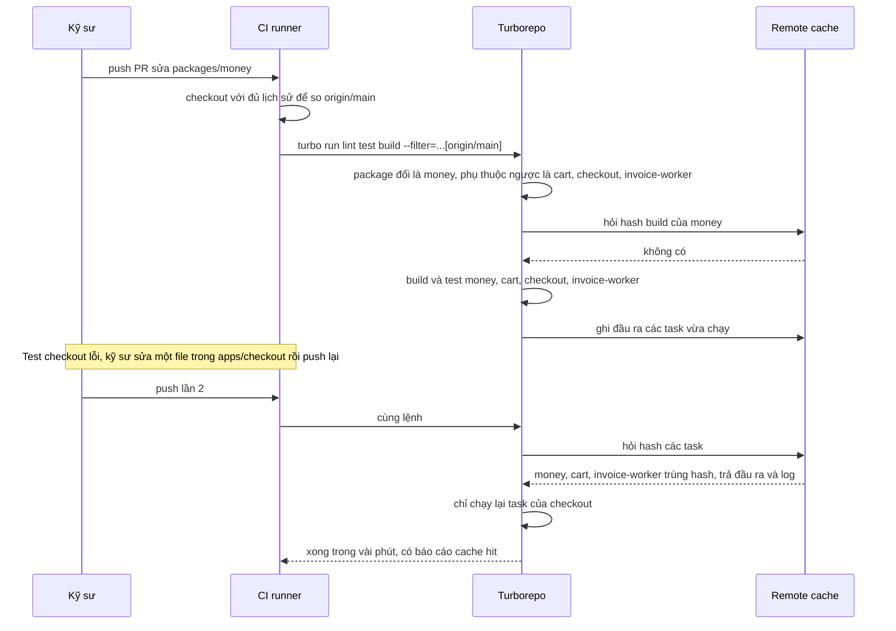

# Affected Graph & Remote Cache — CI chạy 40 phút cho mỗi commit dù chỉ sửa một README

| Scope | Mức độ | Trạng thái | Pattern gốc | Cập nhật |
|---|---|---|---|---|
| 09 · backend / monorepo | 🟡 Trung bình | 📋 Kế hoạch | Affected Graph & Remote Cache — Turborepo docs "Caching", "Filtering"; Nx docs "Affected" | 2026-10-06 |

> **Một câu tóm tắt:** CI chỉ chạy task của những package bị thay đổi và những package phụ thuộc vào chúng, còn task nào có đầu vào y hệt lần trước thì lấy kết quả từ cache dùng chung thay vì chạy lại — để thời gian CI tỷ lệ với *thay đổi* chứ không với *kích thước repo*.

## 1. Bài toán thực tế (What)

**Bối cảnh** *(doanh nghiệp giả định, số liệu minh họa)*
Monorepo của sàn thương mại điện tử (bài 01): 14 app (NestJS, Next.js, worker), 20 package dùng chung, pnpm workspaces + Turborepo nhưng CI vẫn chạy `pnpm -r run lint test build` cho mọi package ở mỗi lần push. Khoảng 25 PR mỗi ngày, mỗi PR trung bình 4 lần push. Máy CI thuê theo phút.

**Triệu chứng người kinh doanh nhìn thấy**
- Mỗi lần push chờ CI khoảng 40 phút, kể cả khi chỉ sửa một dòng tài liệu; sửa lỗi gấp trên production mất hơn một giờ mới qua được CI.
- Chi phí máy CI tăng gấp ba trong sáu tháng, song song với số package chứ không với số tính năng.
- Kỹ sư gom nhiều thay đổi vào một PR lớn để "đỡ chờ CI", PR khó review hơn và lỗi lọt nhiều hơn.

**Nguyên nhân kỹ thuật**
CI coi repo là một khối: không biết package nào bị ảnh hưởng bởi thay đổi nên chạy tất cả. Kết quả của một task (build `packages/money`, test `apps/cart`) không được tái sử dụng dù đầu vào không đổi so với lần chạy trước — trên chính nhánh đó, trên nhánh `main`, hay trên máy của kỹ sư khác. Mỗi lần push là làm lại từ đầu 34 package × 3 task.

**Ràng buộc**
- Không được bỏ sót: thay đổi ở package chung phải kích hoạt test của mọi app phụ thuộc.
- Cache không được trả kết quả sai (ví dụ build với biến môi trường cũ) — thà chậm còn hơn deploy bản sai.
- PR từ fork hoặc từ người ngoài không được ghi vào cache dùng chung.

## 2. Vì sao dùng pattern này (Why)

**Nguyên nhân gốc mà pattern nhắm vào:** CI không dùng hai thông tin mà monorepo đã có sẵn — đồ thị phụ thuộc giữa package và việc phần lớn đầu vào không đổi giữa các lần chạy.

**Pattern giải quyết thế nào:** hai cơ chế bổ trợ. (1) **Affected graph:** từ danh sách file đổi so với nhánh gốc, xác định package bị đổi, rồi đi ngược đồ thị phụ thuộc để lấy thêm mọi package phụ thuộc vào chúng; chỉ chạy task trên tập đó. Turborepo biểu diễn bằng bộ lọc `--filter=...[origin/main]` (dấu `...` phía trước lấy cả package phụ thuộc vào package bị đổi); Nx gọi là `nx affected`. (2) **Task cache theo nội dung:** mỗi task được băm từ đầu vào khai báo — file nguồn, hash của task phụ thuộc, lockfile, biến môi trường được khai báo, cấu hình task. Trùng hash thì khôi phục đầu ra và log từ cache thay vì chạy. **Remote cache** đặt kho đó ở nơi mọi máy CI và máy kỹ sư cùng đọc, nên task đã chạy ở `main` hoặc ở lần push trước không bao giờ phải chạy lại.

**Lựa chọn khác đã cân nhắc**

| Lựa chọn | Giải quyết được gì | Vì sao không chọn (ở bài này) |
|---|---|---|
| Giữ nguyên + tối ưu nhỏ (máy CI mạnh hơn, chia matrix song song) | Rút thời gian chờ | Tổng phút máy không giảm, chi phí còn tăng |
| Bộ lọc đường dẫn của CI (`paths:` trong workflow) | Bỏ qua job khi không chạm thư mục | Không hiểu đồ thị phụ thuộc: sửa `packages/money` không biết phải test `apps/cart` |
| Bazel | Build kín (hermetic), cache và affected rất chính xác | Chi phí chuyển đổi lớn cho hệ sinh thái TypeScript/pnpm hiện có |
| Tách lại nhiều repo | Mỗi CI nhỏ | Mất lợi ích bài 01 |
| Turborepo affected + remote cache (chọn); Nx là tương đương | Chạy đúng phần bị ảnh hưởng, tái dùng kết quả giữa máy | Phải khai báo đầu vào/đầu ra chính xác; thêm một máy chủ cache |

## 3. Thiết kế hệ thống (How)

### 3.1 Kiến trúc trước và sau



### 3.2 Luồng chính



### 3.3 Thành phần và trách nhiệm

| Thành phần | Trách nhiệm | Quyết định thiết kế đáng chú ý |
|---|---|---|
| `turbo.json` | Định nghĩa task, `dependsOn`, `inputs`, `outputs`, `env` | Khai báo đầy đủ `outputs` (`dist/**`, `.next/**` trừ `.next/cache/**`) và biến môi trường ảnh hưởng build |
| Bộ lọc affected | Chọn package cần chạy | `--filter=...[origin/main]` trên PR; trên `main` so với commit trước |
| Checkout trong CI | Đủ lịch sử để so sánh | Lấy nhánh gốc (`fetch-depth: 0` hoặc fetch riêng `origin/main`); thiếu là affected sai |
| Remote cache | Lưu đầu ra theo hash | Máy chủ tự host theo API remote cache của Turborepo (cần xác minh triển khai cụ thể) hoặc dịch vụ có sẵn |
| Quyền ghi cache | Chống đầu độc cache | Chỉ job trên nhánh tin cậy được ghi; PR từ fork chỉ đọc; bật ký số artifact nếu dùng (cần xác minh cấu hình) |
| Báo cáo chạy | Đo hit ratio và task đã chạy | `turbo run ... --summarize` xuất JSON, CI lưu làm artifact |

### 3.4 Điểm dễ sai khi triển khai
- **Biến môi trường không khai báo.** Build Next.js đọc `NEXT_PUBLIC_API_URL` nhưng `turbo.json` không liệt kê; đổi biến mà hash không đổi, cache trả bản build trỏ API cũ.
- **Khai báo thiếu `outputs`.** Cache hit nhưng không khôi phục `dist/`, bước deploy sau đó thiếu file.
- **Clone nông trong CI.** `fetch-depth: 1` làm không có `origin/main` để so; tùy công cụ sẽ lỗi hoặc coi mọi thứ là đổi.
- **File gốc ảnh hưởng mọi thứ** (`pnpm-lock.yaml`, `tsconfig.base.json`, cấu hình ESLint gốc) phải nằm trong đầu vào toàn cục, nếu không đổi chúng mà không gì chạy lại.
- **Test không tất định** (phụ thuộc giờ hệ thống, mạng) được cache là "đã qua" và che lỗi thật; sửa test trước khi bật cache.
- **Cho mọi PR ghi cache.** PR độc hại có thể ghi đầu ra giả cho một hash; giới hạn quyền ghi.

## 4. Tech stack và tác động (Impact techstack)

| Lớp | Công nghệ chọn | Vì sao chọn | Thay thế tương đương |
|---|---|---|---|
| Điều phối task | Turborepo | Đồ thị task từ pnpm workspaces, bộ lọc theo git, cache cục bộ và remote, `--summarize` | Nx (`nx affected`, Nx Cloud hoặc cache tự host) |
| Quản lý gói | pnpm 10 workspaces | Đồ thị phụ thuộc chính xác giữa package (`workspace:*`) | npm/Yarn workspaces |
| CI | GitHub Actions | Phổ biến; cấu hình checkout, secret cho remote cache | GitLab CI, Buildkite |
| Remote cache | Máy chủ cache tự host chạy bằng Docker Compose (cần xác minh lựa chọn cụ thể) hoặc Vercel Remote Cache | Tái hiện được trong môi trường local; không phụ thuộc dịch vụ ngoài khi thực hành | Nx Cloud, S3 qua máy chủ trung gian |
| Ngôn ngữ, test | TypeScript strict, Node 20+, Vitest | Trùng stack repo | Jest |

**Thay đổi so với hệ thống hiện tại:** CI chuyển từ `pnpm -r` sang `turbo run` với bộ lọc; mọi package phải khai báo `outputs` và biến môi trường; thêm máy chủ remote cache và chính sách quyền ghi. Kỹ sư phải hiểu vì sao "thiếu khai báo đầu vào" là lỗi build nghiêm trọng.

## 5. Kết quả đầu ra và cách đo (Output impact)

| Chỉ số | Trước (minh họa) | Mục tiêu khi thực hành | Cách đo |
|---|---|---|---|
| Thời gian CI cho PR chỉ sửa tài liệu | 40 phút | ≤ 3 phút | Thời lượng job từ GitHub Actions API trên repo mô phỏng |
| Thời gian CI cho PR sửa một package chung | 40 phút | ≤ 12 phút | Như trên, PR sửa `packages/money` |
| `turbo run build` toàn repo khi không đổi gì | bằng lần đầu | ≤ 10 % lần đầu | `time turbo run build --force` so với `time turbo run build` lần hai |
| Cache hit ratio trên push thứ hai của PR | 0 % | ≥ 80 % | Đọc JSON của `--summarize` |
| Số task thực chạy mỗi PR | 102 | ghi nhận, kỳ vọng < 20 | `--summarize` |
| Lần cache trả kết quả sai trong bộ test cố ý | — | 0 | Kịch bản đổi biến môi trường khai báo/không khai báo, kiểm tra build lại |

> Số "trước" là minh họa để hình dung bài toán. Số "mục tiêu" chỉ được coi là đạt khi có số đo thật
> ở mục 8 kèm môi trường đo.

**Tác động nghiệp vụ mong đợi:** sửa lỗi gấp lên production trong vài phút thay vì hơn một giờ, chi phí CI tăng theo lượng thay đổi chứ không theo số package, kỹ sư quay lại PR nhỏ dễ review.

## 6. Đánh đổi và khi KHÔNG nên dùng

**Đánh đổi**
- Tính đúng phụ thuộc vào khai báo đầu vào/đầu ra; khai báo sai là cache sai — loại lỗi khó phát hiện hơn "CI chậm".
- Thêm một hạ tầng (remote cache) cần bảo mật, dọn dẹp dung lượng, giám sát.
- Báo cáo CI khó đọc hơn: task "đã qua" có thể là kết quả của lần chạy khác.

**Không nên dùng khi**
- Repo nhỏ, CI dưới vài phút: cấu hình và rủi ro cache sai không đáng.
- Build không tất định (tải dữ liệu ngoài lúc build, nhúng thời gian build): sửa cho tất định trước, nếu không cache vô dụng hoặc nguy hiểm.
- Đồ thị phụ thuộc gần như "mọi thứ phụ thuộc mọi thứ": affected luôn là toàn bộ; sửa ranh giới trước (bài 04).

**Liên quan**
- Đọc trước: [01 — Workspaces & Shared Packages](../01-workspace-sua-shared-lib-phai-mo-12-pr/).
- Đọc sau: [04 — Enforced Module Boundaries](../04-module-boundaries-frontend-import-thang-vao-repository-backend/) — đồ thị gọn thì affected mới nhỏ; [05 — Trunk-based Development](../05-trunk-based-development-branch-song-3-tuan-merge-hell/) — CI nhanh là điều kiện.
- Cùng chủ đề: [17-02 — Layer Caching & .dockerignore](../../17-backend-docker/02-layer-cache-dockerignore-moi-build-cai-lai-npm-5-phut/) — cache ở tầng image, `turbo prune`.

## 7. Cơ sở tham khảo

- Turborepo docs, "Caching", "Running tasks" (Filtering), "Remote Caching", cấu hình `turbo.json` — https://turborepo.com/docs — cách băm đầu vào, `outputs`, `env`, bộ lọc theo git và theo phụ thuộc, `--summarize`.
- Nx docs, "Affected" và "Cache task results" — https://nx.dev/docs — khái niệm affected và cache tương đương ở công cụ thay thế.
- Potvin & Levenberg, "Why Google Stores Billions of Lines of Code in a Single Repository", CACM 2016 — https://cacm.acm.org/research/why-google-stores-billions-of-lines-of-code-in-a-single-repository/ — monorepo lớn chỉ khả thi khi có hệ thống build và test hiểu đồ thị phụ thuộc.
- GitHub Docs, `actions/checkout` (`fetch-depth`) — https://github.com/actions/checkout — lấy đủ lịch sử để so sánh với nhánh gốc.

## 8. Kế hoạch thực hành

- [ ] Bước 1: mở rộng monorepo bài 01 lên khoảng 10 package có đồ thị phụ thuộc rõ; CI GitHub Actions chạy `pnpm -r run lint test build` như hiện trạng.
- [ ] Bước 2: đo "trước": 5 loại PR mô phỏng (tài liệu, một app, một package chung, lockfile, cấu hình gốc); ghi thời gian CI.
- [ ] Bước 3: chuyển CI sang `turbo run` với `--filter=...[origin/main]`, khai báo `inputs`/`outputs`/`env`, dựng remote cache bằng Docker Compose, giới hạn quyền ghi theo nhánh.
- [ ] Bước 4: đo "sau" với cùng 5 loại PR, mỗi PR push hai lần; ghi số thật và môi trường vào mục 5.
- [ ] Bước 5: test: (a) sửa package chung kích hoạt test mọi app phụ thuộc; (b) sửa tài liệu không chạy test app; (c) đổi biến môi trường đã khai báo làm build chạy lại; (d) đổi lockfile chạy lại toàn bộ.

**Cấu trúc code dự kiến**
```text
turbo.json                       # [PATTERN] inputs, outputs, env, dependsOn
.github/workflows/ci.yml         # [PATTERN] checkout đủ lịch sử, turbo --filter, --summarize
infra/remote-cache/
  docker-compose.yml             # máy chủ remote cache tự host
tools/ci-report/
  src/summarize-report.ts        # đọc JSON --summarize: hit ratio, task đã chạy
  test/affected-selection.test.ts
apps/ packages/                  # monorepo mô phỏng từ bài 01, khoảng 10 package
```

**Cách chạy** *(điền khi bắt đầu code)*
```bash
docker compose -f infra/remote-cache/docker-compose.yml up -d
pnpm install
pnpm turbo run lint test build --filter=...[origin/main] --summarize
```
