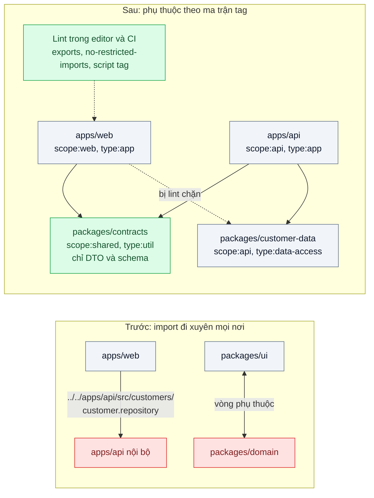
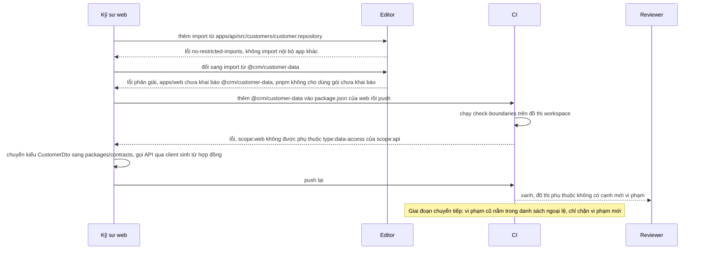

# Enforced Module Boundaries — Frontend import thẳng vào repository của backend vì "cùng repo"

| Scope | Mức độ | Trạng thái | Pattern gốc | Cập nhật |
|---|---|---|---|---|
| 09 · backend / monorepo | 🟡 Trung bình | 📋 Kế hoạch | Enforced Module Boundaries — Nx docs "Enforce module boundaries"; ESLint `no-restricted-imports`; Grzybek, "Modular Monolith: A Primer" | 2026-10-06 |

> **Một câu tóm tắt:** Gắn nhãn cho từng package (loại và phạm vi), khai báo package nào được phụ thuộc vào package nào, chỉ cho import qua cửa công khai của package, và để lint trong CI chặn mọi import vượt ranh giới — biến quy ước kiến trúc thành lỗi build.

## 1. Bài toán thực tế (What)

**Bối cảnh** *(doanh nghiệp giả định, số liệu minh họa)*
Công ty SaaS B2B bán CRM, monorepo pnpm + Turborepo gồm `apps/web` (Next.js), `apps/api` (NestJS), `apps/worker` và 9 package dùng chung. 25 kỹ sư, 3 đội. Vì "cùng repo", import tương đối hay alias TypeScript tới bất kỳ file nào đều chạy được.

**Triệu chứng người kinh doanh nhìn thấy**
- Đội backend đổi tên một cột trong `customer.repository.ts`; trang danh sách khách hàng trên web vỡ trong production vì web đã import thẳng kiểu dữ liệu và một hàm từ file đó.
- Một lần build web bị lỗi bí hiểm vì kéo theo driver PostgreSQL vào bundle trình duyệt; lần khác, đoạn code tham chiếu biến môi trường của server suýt lọt vào bundle công khai.
- Mọi PR đều làm CI chạy gần như toàn bộ repo (bài 03 mất tác dụng), vì đồ thị phụ thuộc đã thành "mọi thứ phụ thuộc mọi thứ".

**Nguyên nhân kỹ thuật**
Ranh giới giữa app và package chỉ tồn tại trong sơ đồ kiến trúc, không có công cụ nào thực thi. Import tương đối kiểu `../../apps/api/src/...` hay alias `paths` trong `tsconfig` đi xuyên qua mọi package, bỏ qua cả khai báo phụ thuộc trong `package.json`. Mỗi lối tắt nhỏ tạo một cạnh phụ thuộc ẩn; cộng lại thành vòng phụ thuộc và rò rỉ code server sang client.

**Ràng buộc**
- Web và API vẫn phải chia sẻ được kiểu dữ liệu của hợp đồng API (DTO, schema), chỉ không được chạm vào nội bộ của nhau.
- Áp dụng dần: không được chặn toàn bộ PR ngay ngày đầu vì có sẵn hàng chục vi phạm.
- Quy tắc phải chạy trong editor (phản hồi sớm) và trong CI (chặn merge).

## 2. Vì sao dùng pattern này (Why)

**Nguyên nhân gốc mà pattern nhắm vào:** ranh giới module không được biểu diễn ở dạng máy kiểm tra được, nên mỗi lối tắt đều "hợp lệ".

**Pattern giải quyết thế nào:** Grzybek mô tả module tốt là module có *giao diện công khai* rõ, giấu chi tiết bên trong và phụ thuộc theo hướng có chủ đích. Nx docs biến điều đó thành quy tắc lint: mỗi dự án mang **tag** (ví dụ `type:app`, `type:feature`, `type:data-access`, `type:util`, `scope:web`, `scope:api`, `scope:shared`), và cấu hình `depConstraints` nói tag nào chỉ được phụ thuộc tag nào; import vi phạm là lỗi ESLint. Với stack pnpm + Turborepo của repo, bài này dựng cùng mô hình bằng ba lớp: (1) **cửa công khai**: trường `exports` trong `package.json` chỉ mở những đường dẫn được phép, Node và bundler từ chối import sâu; pnpm chỉ cho dùng gói đã khai báo; (2) **chặn lối tắt**: ESLint `no-restricted-imports` cấm import tương đối thoát khỏi package và cấm import sâu vào `src/`; bỏ alias `paths` xuyên package; (3) **quy tắc theo tag**: script đọc đồ thị workspace và `tags` của từng package, so với ma trận cho phép. Kiểu dữ liệu dùng chung chuyển vào `packages/contracts`.

**Lựa chọn khác đã cân nhắc**

| Lựa chọn | Giải quyết được gì | Vì sao không chọn (ở bài này) |
|---|---|---|
| Giữ nguyên + tối ưu nhỏ (quy ước trong tài liệu kiến trúc, nhắc khi review) | Có chuẩn để nói | Không chặn được; người review không thấy hết import trong PR lớn |
| Chuyển sang Nx để dùng `@nx/enforce-module-boundaries` | Mô hình tag có sẵn, hoàn chỉnh | Đổi công cụ điều phối của cả repo; để làm phương án tương đương |
| Tách web và API ra hai repo | Ranh giới cứng | Mất thay đổi atomic của bài 01; vẫn cần cách chia sẻ hợp đồng |
| Công cụ phân tích phụ thuộc chuyên dụng (`dependency-cruiser`, `eslint-plugin-boundaries`, cần xác minh) | Quy tắc phong phú, báo cáo đồ thị | Tốt cho repo lớn; bài nền ưu tiên công cụ sẵn có để thấy cơ chế |
| `exports` + `no-restricted-imports` + script tag (chọn) | Đủ ba lớp: cửa công khai, chặn lối tắt, hướng phụ thuộc | Tự duy trì một script nhỏ |

## 3. Thiết kế hệ thống (How)

### 3.1 Kiến trúc trước và sau



### 3.2 Luồng chính



### 3.3 Thành phần và trách nhiệm

| Thành phần | Trách nhiệm | Quyết định thiết kế đáng chú ý |
|---|---|---|
| `tags` trong `package.json` mỗi package | Khai báo loại và phạm vi | Hai trục: `type:*` (app, feature, data-access, util) và `scope:*` (web, api, shared) |
| Ma trận phụ thuộc `boundaries.config.ts` | Tag nào được phụ thuộc tag nào | `scope:web` chỉ tới `scope:web` và `scope:shared`; `type:util` không phụ thuộc gì ngoài `type:util` |
| `exports` trong `package.json` | Cửa công khai của package | Chỉ mở `.` (và vài subpath có chủ đích); không mở `./src/*` |
| ESLint `no-restricted-imports` | Chặn import tương đối thoát package và import sâu | Mẫu cấm `../../apps/*`, `@crm/*/src/*` |
| `scripts/check-boundaries.ts` | So đồ thị workspace với ma trận | Đọc khai báo phụ thuộc của mọi package; danh sách ngoại lệ có hạn chót |
| `packages/contracts` | Kiểu dữ liệu hợp đồng web–API | Sinh từ OpenAPI (`01-frontend-backend-transporter` bài 01) hoặc schema dùng chung; không chứa logic |
| `server-only` trong package data-access | Chặn code server lọt vào bundle client của Next.js | Next.js báo lỗi build khi component client import module có `import 'server-only'` |

### 3.4 Điểm dễ sai khi triển khai
- **Alias `paths` trong `tsconfig` trỏ vào `src` của package khác.** Đi vòng qua `exports` và khai báo phụ thuộc; bỏ alias xuyên package.
- **Chỉ cấm theo tên package.** Import tương đối `../../apps/api/...` không mang tên package, quy tắc theo tên bỏ sót; phải cấm cả đường dẫn thoát khỏi thư mục package.
- **File `index.ts` re-export tất cả.** Cửa công khai thành cửa toang; chỉ export thứ thực sự là API của package.
- **Ngoại lệ không có hạn.** `eslint-disable` tích tụ tới khi quy tắc vô nghĩa; đếm số ngoại lệ trong CI và đặt hạn chót.
- **Chỉ chạy lint trong editor.** Người tắt extension vẫn merge được; CI là nơi chặn.
- **Coi `import type` là vô hại.** Không vào bundle nhưng vẫn là phụ thuộc thiết kế; quyết định rõ có cho phép không.

## 4. Tech stack và tác động (Impact techstack)

| Lớp | Công nghệ chọn | Vì sao chọn | Thay thế tương đương |
|---|---|---|---|
| Monorepo | pnpm 10 workspaces + Turborepo | Stack mặc định scope; pnpm không cho dùng gói chưa khai báo | Nx (có `@nx/enforce-module-boundaries` sẵn); Turborepo có tính năng boundaries thử nghiệm (cần xác minh) |
| Cửa công khai | Trường `exports` của `package.json` | Chuẩn của Node, bundler tôn trọng; chặn import sâu ở mức phân giải module | — |
| Lint | ESLint flat config, `no-restricted-imports` | Quy tắc lõi có sẵn, chạy trong editor và CI | `eslint-plugin-boundaries`, `dependency-cruiser` (cần xác minh) |
| Kiểm tra tag | Script TypeScript strict trên Node 20+ | Đọc đồ thị workspace, so với ma trận; dễ hiểu cho bài nền | Nx project graph |
| App | Next.js (`apps/web`), NestJS (`apps/api`) | Hai phía thường vi phạm ranh giới của nhau nhất | — |
| Đo | `turbo run --summarize`, Next.js bundle analyzer | Kích thước tập affected; module server có trong bundle client không | `madge` cho vòng phụ thuộc (cần xác minh) |

**Thay đổi so với hệ thống hiện tại:** mọi package có `tags` và `exports`; thêm `packages/contracts`; bỏ alias xuyên package; CI có bước kiểm tra ranh giới với danh sách ngoại lệ giảm dần. Đội phải học viết package có giao diện công khai thay vì "import chỗ nào cũng được".

## 5. Kết quả đầu ra và cách đo (Output impact)

| Chỉ số | Trước (minh họa) | Mục tiêu khi thực hành | Cách đo |
|---|---|---|---|
| Số import vi phạm ranh giới | 47 | 0 vi phạm mới; ngoại lệ cũ giảm về 0 trong kế hoạch | Kết quả ESLint + `check-boundaries` trong CI |
| Số vòng phụ thuộc giữa package | 3 | 0 | `check-boundaries` phát hiện chu trình trên đồ thị workspace |
| Module server trong bundle trình duyệt | có (driver PostgreSQL) | 0 | Next.js bundle analyzer; build lỗi nhờ `server-only` |
| Số package bị affected trung bình mỗi PR | 30 / 34 | ≤ 8 | `turbo run build --filter=...[origin/main] --summarize` trên bộ PR mô phỏng của bài 03 |
| Số `eslint-disable` cho quy tắc ranh giới | — | theo dõi, không tăng | `grep` đếm trong CI |

> Số "trước" là minh họa để hình dung bài toán. Số "mục tiêu" chỉ được coi là đạt khi có số đo thật
> ở mục 8 kèm môi trường đo.

**Tác động nghiệp vụ mong đợi:** đội backend đổi chi tiết bên trong mà không làm vỡ trang web của khách; không còn nguy cơ code server lọt ra trình duyệt; CI nhanh trở lại nhờ đồ thị phụ thuộc gọn.

## 6. Đánh đổi và khi KHÔNG nên dùng

**Đánh đổi**
- Thêm thủ tục: muốn dùng thứ gì của package khác phải đưa nó ra cửa công khai hoặc vào `contracts`.
- Ma trận tag và danh sách ngoại lệ là cấu hình phải duy trì; thiết kế tag sai làm quy tắc cản trở thay vì giúp.
- Giai đoạn chuyển tiếp dài nếu repo đã có nhiều vi phạm.

**Không nên dùng khi**
- Monorepo chỉ vài package do một đội làm: review là đủ.
- Ranh giới nghiệp vụ còn đang thay đổi mạnh (sản phẩm giai đoạn tìm hướng): khóa ranh giới sớm làm mọi thay đổi đều phải sửa cấu hình.
- Dùng quy tắc ranh giới thay cho việc chia lại package: nếu cần ngoại lệ ở khắp nơi, cấu trúc package mới là thứ sai.

**Liên quan**
- Đọc trước: [01 — Workspaces & Shared Packages](../01-workspace-sua-shared-lib-phai-mo-12-pr/), [03 — Affected Graph & Remote Cache](../03-affected-graph-ci-chay-40-phut-cho-moi-commit/).
- Cùng chủ đề: [08-05 — Modular Monolith](../../08-backend-monolith/05-modular-monolith-team-15-nguoi-dung-nhau-trong-mot-codebase/) — ranh giới ở mức module trong một app; [01-01 — Contract-First API](../../01-frontend-backend-transporter/01-contract-first-openapi-frontend-goi-sai-ten-truong/) — nguồn của `packages/contracts`; [02 — Code Ownership](../02-codeowners-ai-review-thu-muc-nao/) — ai duyệt thay đổi ở cửa công khai.

## 7. Cơ sở tham khảo

- Nx docs, "Enforce module boundaries" — https://nx.dev/docs — mô hình tag theo loại và phạm vi, `depConstraints`, quy tắc `@nx/enforce-module-boundaries`.
- ESLint docs, "no-restricted-imports" — https://eslint.org/docs/latest/rules/no-restricted-imports — cấm import theo đường dẫn và theo mẫu.
- Node.js docs, "Packages — exports, subpath patterns" — https://nodejs.org/api/packages.html — trường `exports` giới hạn đường dẫn được import từ bên ngoài package.
- Kamil Grzybek, "Modular Monolith: A Primer", 2019 — https://www.kamilgrzybek.com/blog/posts/modular-monolith-primer — module có giao diện công khai, đóng gói và hướng phụ thuộc.
- Next.js docs, "Server and Client Components" (`server-only`) — https://nextjs.org/docs — chặn module chỉ dành cho server khỏi bundle client.
- pnpm docs — https://pnpm.io/ — `node_modules` nghiêm ngặt, không cho dùng gói không khai báo.

## 8. Kế hoạch thực hành

- [ ] Bước 1: dựng monorepo CRM tối giản (web, api, 5 package) và cố ý tạo vi phạm: import tương đối sang `apps/api`, alias `paths` xuyên package, một vòng `ui` ↔ `domain`.
- [ ] Bước 2: đo "trước": đếm vi phạm bằng script thô, số vòng, bundle analyzer của web, số package affected cho bộ PR mô phỏng.
- [ ] Bước 3: thêm `tags` + ma trận, `exports`, quy tắc `no-restricted-imports`, `check-boundaries` với danh sách ngoại lệ; tách `packages/contracts`; thêm `server-only` cho data-access; sửa dần vi phạm.
- [ ] Bước 4: đo "sau" cùng cách; ghi số thật và môi trường vào mục 5.
- [ ] Bước 5: test cho `check-boundaries`: (a) phụ thuộc trái ma trận bị báo lỗi; (b) vòng phụ thuộc bị phát hiện; (c) ngoại lệ quá hạn chót làm CI đỏ; (d) web import data-access làm build Next.js lỗi.

**Cấu trúc code dự kiến**
```text
boundaries.config.ts             # [PATTERN] ma trận tag được phép phụ thuộc
eslint.config.mjs                # [PATTERN] no-restricted-imports cho lối tắt
scripts/
  check-boundaries.ts            # [PATTERN] đồ thị workspace so với ma trận, phát hiện vòng
  boundary-exceptions.json       # ngoại lệ có hạn chót
apps/web/ apps/api/
packages/contracts/              # DTO, schema dùng chung, không logic
packages/customer-data/          # data-access của api, có server-only
test/
  disallowed-dependency-fails.test.ts
  cycle-detected.test.ts
  expired-exception-fails.test.ts
```

**Cách chạy** *(điền khi bắt đầu code)*
```bash
pnpm install
pnpm turbo run lint
pnpm tsx scripts/check-boundaries.ts
```
