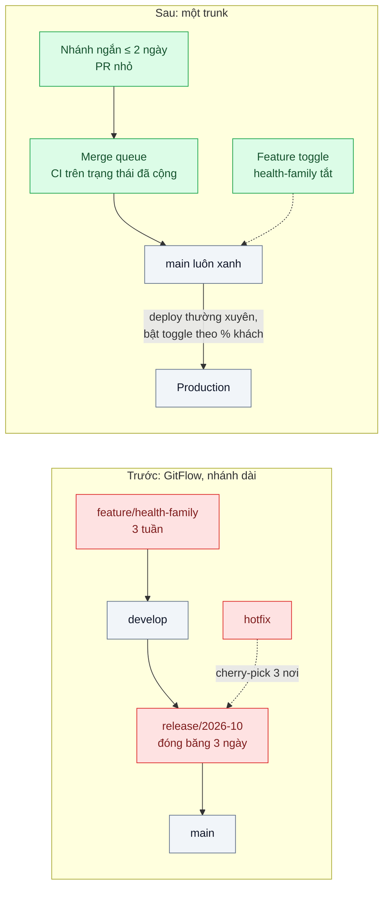
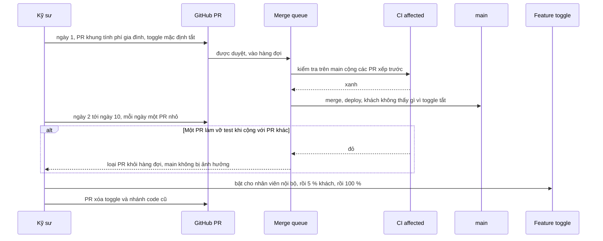

# Trunk-based Development — Nhánh sống 3 tuần, merge xong là nửa ngày sửa conflict

| Scope | Mức độ | Trạng thái | Pattern gốc | Cập nhật |
|---|---|---|---|---|
| 09 · backend / monorepo | 🟡 Trung bình | 📋 Kế hoạch | Trunk-based Development — Paul Hammant, trunkbaseddevelopment.com; *Software Engineering at Google* ch.16; Feature Toggles (Hodgson, 2017) | 2026-10-06 |

> **Một câu tóm tắt:** Mọi người tích hợp vào nhánh chính ít nhất mỗi ngày qua các nhánh rất ngắn, tính năng dở dang được giấu sau feature toggle, và một hàng đợi merge giữ cho nhánh chính luôn xanh — để không còn những đợt merge khổng lồ cuối sprint.

## 1. Bài toán thực tế (What)

**Bối cảnh** *(doanh nghiệp giả định, số liệu minh họa)*
Công ty bảo hiểm số bán bảo hiểm xe và sức khỏe online, monorepo (bài 01) với 40 kỹ sư. Quy trình theo GitFlow: mỗi tính năng một nhánh từ `develop`, sống 2–4 tuần; cuối mỗi chu kỳ hai tuần cắt nhánh `release`, "đóng băng code" 3 ngày để kiểm thử; hotfix phải cherry-pick vào `main`, `develop` và nhánh release đang mở.

**Triệu chứng người kinh doanh nhìn thấy**
- Gói sản phẩm "bảo hiểm sức khỏe gia đình" lỡ ngày ra mắt đã hứa với đối tác ngân hàng vì nhánh tính năng sống 3 tuần, merge vào xong mất nửa ngày sửa conflict và thêm một tuần sửa lỗi tích hợp.
- Ba ngày đóng băng mỗi chu kỳ: kỹ sư gần như ngồi chờ, đội kinh doanh không thể chỉnh nhanh một thông số giá.
- Một hotfix sửa công thức phí bị cherry-pick sót vào nhánh release; lỗi quay lại ở lần phát hành sau, phải hoàn phí cho khoảng 200 hợp đồng.

**Nguyên nhân kỹ thuật**
Thay đổi được giữ riêng ở nhánh dài ngày nên tích hợp bị dồn lại: càng lâu, mã hai bên càng xa nhau, conflict càng lớn và lỗi tương tác giữa các tính năng chỉ lộ ra khi đã merge. Nhiều nhánh sống lâu cũng nghĩa là có nhiều "phiên bản đúng" của code cùng lúc, nên một bản sửa phải được mang thủ công tới từng nơi.

**Ràng buộc**
- Tính năng chưa xong không được hiện cho khách, đặc biệt là thay đổi giá và điều khoản bảo hiểm.
- Nhánh chính phải luôn ở trạng thái phát hành được; không được để một PR lỗi chặn 40 người.
- Thay đổi schema database phải tương thích khi code mới và cũ cùng chạy.

## 2. Vì sao dùng pattern này (Why)

**Nguyên nhân gốc mà pattern nhắm vào:** tích hợp bị trì hoãn — chi phí tích hợp tăng nhanh hơn tuyến tính theo thời gian nhánh sống.

**Pattern giải quyết thế nào:** Paul Hammant định nghĩa Trunk-Based Development là mô hình trong đó mọi người cộng tác trên *một* nhánh chính (trunk), tránh nhánh phát triển dài ngày; ở đội lớn, dùng *short-lived feature branch* chỉ sống vài ngày và được review rồi merge vào trunk, phát hành từ trunk hoặc từ nhánh release cắt từ trunk mà bản sửa luôn vào trunk trước. *Software Engineering at Google* ch.16 mô tả Google phát triển "at head" trên một trunk và coi nhánh phát triển dài là nguồn chi phí cần tránh. Tính năng dở dang được merge nhưng tắt bằng **feature toggle** (Pete Hodgson) hoặc **branch by abstraction** (Fowler). Để trunk luôn xanh khi nhiều PR merge cùng lúc, **merge queue** của GitHub kiểm tra từng PR trên trạng thái *đã cộng* các PR xếp trước nó, nhờ CI nhanh của bài 03.

**Lựa chọn khác đã cân nhắc**

| Lựa chọn | Giải quyết được gì | Vì sao không chọn (ở bài này) |
|---|---|---|
| Giữ nguyên GitFlow + tối ưu nhỏ (rebase nhánh tính năng hằng ngày) | Conflict nhỏ hơn mỗi lần | Tích hợp *thật* với tính năng khác vẫn chỉ xảy ra khi merge; vẫn đóng băng và cherry-pick nhiều nhánh |
| GitHub Flow (nhánh tính năng merge vào `main`, không giới hạn tuổi nhánh) | Đơn giản hơn GitFlow | Không có kỷ luật về tuổi nhánh và toggle thì nhánh vẫn sống 3 tuần |
| Release train cố định, giữ nhánh dài | Lịch phát hành dễ đoán | Không giải quyết tích hợp muộn |
| Trunk-based với nhánh ngắn ≤ 2 ngày + feature toggle + merge queue (chọn) | Tích hợp liên tục, trunk luôn phát hành được, sửa một chỗ | Cần CI nhanh, test tự động tốt và kỷ luật dọn toggle |

## 3. Thiết kế hệ thống (How)

### 3.1 Kiến trúc trước và sau



### 3.2 Luồng chính



### 3.3 Thành phần và trách nhiệm

| Thành phần | Trách nhiệm | Quyết định thiết kế đáng chú ý |
|---|---|---|
| Quy ước nhánh | Nhánh sống tối đa khoảng 2 ngày | Bot cảnh báo PR mở quá 2 ngày; PR lớn tách theo bước |
| Ruleset trên `main` | Bắt buộc PR, review của code owner (bài 02), status check | Không ai push thẳng, kể cả admin |
| Merge queue | Kiểm tra PR trên trạng thái đã cộng | Gộp vài PR một lượt để giảm thời gian chờ; CI chạy theo affected (bài 03) |
| Feature toggle | Giấu tính năng dở dang, bật dần | Mỗi toggle có chủ sở hữu và ngày hết hạn; toggle phát hành khác toggle vận hành (theo Hodgson) |
| Branch by abstraction | Thay thành phần lớn mà không cần nhánh dài | Thêm lớp trừu tượng, chuyển dần nơi gọi, bỏ bản cũ |
| Migration expand/contract | Schema tương thích khi code cũ và mới cùng chạy | Theo `02-backend-database` bài 08 |
| Chính sách "revert trước, sửa sau" | Trunk đỏ được xử lý trong vài phút | Người trực được quyền revert PR làm đỏ trunk |

### 3.4 Điểm dễ sai khi triển khai
- **Gọi là trunk-based nhưng PR vẫn mở một tuần.** Đo tuổi nhánh thật; không đo thì chỉ đổi tên quy trình.
- **Toggle không bao giờ được xóa.** Mỗi toggle là một nhánh code sống mãi; đặt hạn và đưa việc xóa toggle vào định nghĩa hoàn thành.
- **Toggle cho thay đổi schema.** Toggle không bảo vệ được migration phá vỡ tương thích; dùng expand/contract.
- **CI chậm mà vẫn ép merge nhiều lần mỗi ngày.** Hàng đợi merge tắc nghẽn; làm bài 03 trước.
- **Không có quyền revert nhanh.** Trunk đỏ hàng giờ chặn 40 người; thống nhất trước ai được revert.
- **Review chậm.** Nhánh ngắn cần review trong vài giờ; định tuyến đúng người ở bài 02.

## 4. Tech stack và tác động (Impact techstack)

| Lớp | Công nghệ chọn | Vì sao chọn | Thay thế tương đương |
|---|---|---|---|
| Nền tảng Git | GitHub: rulesets, merge queue, required status checks | Có sẵn, kiểm tra PR trên trạng thái đã cộng | GitLab merge trains |
| CI | GitHub Actions + Turborepo affected và remote cache (bài 03) | Thời gian CI đủ ngắn cho nhiều lần merge mỗi ngày | Nx affected |
| Feature toggle | OpenFeature SDK cho Node + nhà cung cấp đơn giản đọc từ PostgreSQL (cần xác minh SDK) | Chuẩn mở, đổi nhà cung cấp được | Unleash, flagd (cần xác minh), bảng cấu hình tự viết |
| App mẫu | NestJS tính phí bảo hiểm, Next.js trang mua | Tính năng có thay đổi giá — trường hợp toggle quan trọng nhất | Fastify |
| Đo | GitHub REST API, script phân tích `git log` | Tuổi nhánh, kích thước PR, thời gian trunk đỏ | — |

**Thay đổi so với hệ thống hiện tại:** bỏ `develop` và nhánh release dài; bật ruleset và merge queue trên `main`; thêm hệ thống feature toggle và quy trình dọn toggle; migration theo expand/contract. Thay đổi lớn nhất là thói quen: chia việc thành PR nhỏ merge mỗi ngày.

## 5. Kết quả đầu ra và cách đo (Output impact)

| Chỉ số | Trước (minh họa) | Mục tiêu khi thực hành | Cách đo |
|---|---|---|---|
| Tuổi nhánh từ commit đầu tới merge | p50 9 ngày, p90 21 ngày | p50 ≤ 1 ngày, p90 ≤ 2 ngày | GitHub REST API: commit đầu của PR so với `merged_at`, trên repo mô phỏng |
| Kích thước PR (dòng thay đổi) | p50 1.200 | p50 ≤ 300 | GitHub REST API `additions + deletions` |
| Thời gian giải quyết conflict khi merge | nửa ngày mỗi tính năng | ≤ 15 phút mỗi PR | Kịch bản mô phỏng: hai tính năng song song theo hai quy trình, ghi thời gian thực tế |
| Tỷ lệ thời gian `main` đỏ | chưa đo | ≤ 2 % | Lịch sử status check trên `main` |
| Thời gian từ merge tới production | tới 2 tuần (chờ release) | ≤ 1 ngày | Timestamp merge so với timestamp deploy |
| Toggle quá hạn chưa xóa | — | 0 | Script đọc danh sách toggle và ngày hết hạn |

> Số "trước" là minh họa để hình dung bài toán. Số "mục tiêu" chỉ được coi là đạt khi có số đo thật
> ở mục 8 kèm môi trường đo.

**Tác động nghiệp vụ mong đợi:** sản phẩm bảo hiểm mới ra đúng hẹn vì tích hợp xảy ra hằng ngày thay vì dồn cuối kỳ; bản sửa công thức phí chỉ cần sửa một chỗ; không còn ba ngày đóng băng.

## 6. Đánh đổi và khi KHÔNG nên dùng

**Đánh đổi**
- Code chứa tính năng dở dang sau toggle: phức tạp hơn, cần test cả hai nhánh toggle.
- Đòi hỏi đầu tư trước: CI nhanh, test tự động đáng tin, review nhanh, hệ thống toggle.
- Kỷ luật đội: chia việc nhỏ, dọn toggle; thiếu kỷ luật thì trunk đỏ thường xuyên.

**Không nên dùng khi**
- Chưa có test tự động đáng tin: merge liên tục vào trunk chỉ đẩy lỗi ra nhanh hơn; xây test trước.
- Dự án mã nguồn mở nhận đóng góp từ người ngoài không tin cậy: mô hình fork + review dài hợp hơn.
- Sản phẩm phải duy trì nhiều phiên bản lớn song song cho khách (phần mềm cài tại chỗ): vẫn cần nhánh bảo trì dài, dù phát triển chính có thể trunk-based.

**Liên quan**
- Đọc trước: [02 — Code Ownership](../02-codeowners-ai-review-thu-muc-nao/), [03 — Affected Graph & Remote Cache](../03-affected-graph-ci-chay-40-phut-cho-moi-commit/).
- Cùng chủ đề: [08-06 — Feature Toggle & Branch by Abstraction](../../08-backend-monolith/06-feature-toggle-branch-by-abstraction-refactor-lon-van-release-hang-tuan/); [02-08 — Expand/Contract](../../02-backend-database/08-expand-contract-doi-ten-cot-100-trieu-dong/); [16-06 — Canary / Blue-Green](../../16-backend-k8s/06-canary-blue-green-argo-rollouts-release-loi-anh-huong-100-phan-tram/).

## 7. Cơ sở tham khảo

- Paul Hammant, *Trunk Based Development* — https://trunkbaseddevelopment.com/ — định nghĩa, biến thể nhánh tính năng ngắn ngày, phát hành từ trunk và nhánh release, các điều kiện tiên quyết.
- Winters, Manshreck, Wright (eds.), *Software Engineering at Google*, O'Reilly, 2020, ch.16 "Version Control and Branch Management" — https://abseil.io/resources/swe-book — phát triển trên một trunk, chi phí của nhánh phát triển dài.
- Pete Hodgson, "Feature Toggles (aka Feature Flags)", martinfowler.com, 2017 — https://martinfowler.com/articles/feature-toggles.html — phân loại toggle và chi phí duy trì.
- Martin Fowler, "BranchByAbstraction", 2014 — https://martinfowler.com/bliki/BranchByAbstraction.html — thay đổi lớn không cần nhánh dài.
- GitHub Docs, "Managing a merge queue" — https://docs.github.com/ — cách merge queue kiểm tra PR trên trạng thái đã cộng.

## 8. Kế hoạch thực hành

- [ ] Bước 1: dựng repo mô phỏng (NestJS tính phí + Next.js trang mua) trên GitHub thử nghiệm; tái hiện GitFlow với hai nhánh tính năng chạm cùng module tính phí trong "3 tuần" commit mô phỏng.
- [ ] Bước 2: đo "trước": merge hai nhánh, ghi số conflict, thời gian giải quyết, lỗi tích hợp phát hiện sau merge.
- [ ] Bước 3: chuyển sang trunk: ruleset, merge queue, CI affected; thêm feature toggle; làm lại hai tính năng bằng chuỗi PR nhỏ sau toggle.
- [ ] Bước 4: đo "sau": tuổi nhánh, kích thước PR, conflict, thời gian `main` đỏ; ghi số thật và môi trường vào mục 5.
- [ ] Bước 5: test: (a) toggle tắt thì khách nhận giá theo công thức cũ; (b) toggle bật cho nhóm nội bộ thì nhận công thức mới; (c) script báo toggle quá hạn; (d) script tuổi nhánh tính đúng trên dữ liệu mẫu.

**Cấu trúc code dự kiến**
```text
apps/pricing-api/
  src/premium/premium.service.ts         # [PATTERN] rẽ nhánh theo toggle
  src/premium/family-plan.calculator.ts  # tính năng mới, merge dần sau toggle
apps/web/
packages/feature-flags/
  src/flags.ts                   # [PATTERN] danh sách toggle, chủ sở hữu, hạn
  src/expired-flags.check.ts
tools/branch-metrics/
  src/branch-age.ts              # tuổi nhánh, kích thước PR từ GitHub REST API
test/
  pricing-respects-toggle.test.ts
  expired-flag-fails-ci.test.ts
.github/workflows/ci.yml         # chạy cả trong merge_group
```

**Cách chạy** *(điền khi bắt đầu code)*
```bash
docker compose up -d
pnpm install && pnpm test
```
