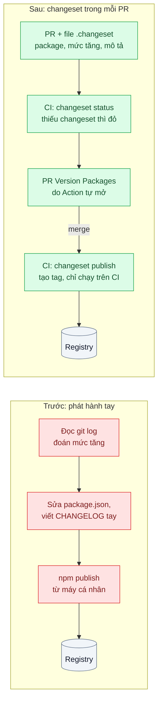
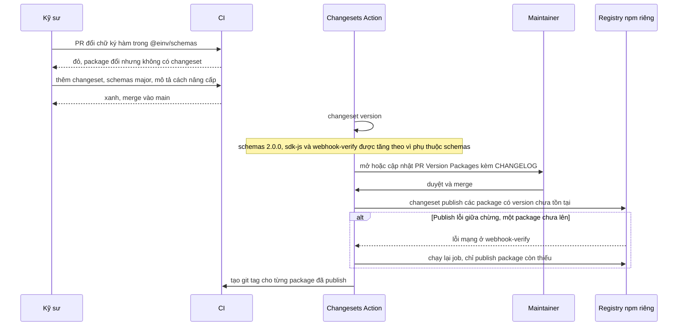

# Independent Versioning (Changesets) — Mỗi lần release phải nhớ tay package nào đổi để tăng version

| Scope | Mức độ | Trạng thái | Pattern gốc | Cập nhật |
|---|---|---|---|---|
| 09 · backend / monorepo | 🔴 Nâng cao | 📋 Kế hoạch | Independent Versioning (Changesets) — Changesets docs; Semantic Versioning 2.0.0 | 2026-10-06 |

> **Một câu tóm tắt:** Mỗi PR mang theo một "changeset" ghi package nào đổi và đổi ở mức nào theo SemVer; công cụ gom các changeset để tự tăng version từng package độc lập, cập nhật package phụ thuộc, viết CHANGELOG và publish từ CI — không ai phải nhớ tay nữa.

## 1. Bài toán thực tế (What)

**Bối cảnh** *(doanh nghiệp giả định, số liệu minh họa)*
Công ty SaaS B2B về hóa đơn điện tử. Trong monorepo (bài 01) có 5 package được *publish* lên registry npm riêng để người ngoài repo dùng: `@einv/sdk-js` (SDK cho khách hàng tích hợp), `@einv/webhook-verify` (kiểm tra chữ ký webhook), `@einv/ui-kit` (dùng bởi 3 repo white-label của đối tác), `@einv/schemas` và `@einv/eslint-config`. `sdk-js` và `webhook-verify` phụ thuộc `schemas`. Phát hành do một kỹ sư làm tay từ máy cá nhân khoảng hai tuần một lần.

**Triệu chứng người kinh doanh nhìn thấy**
- Một thay đổi phá vỡ tương thích trong `sdk-js` được phát hành dưới dạng bản vá (patch); hệ thống của hai khách hàng tự cập nhật theo `^` và ngừng xuất hóa đơn nửa ngày, phải bồi thường theo hợp đồng SLA.
- `schemas` có thêm trường mới nhưng `sdk-js` không được tăng version theo; khách dùng SDK không gửi được trường đó dù tài liệu đã nói có.
- Đối tác white-label hỏi "bản này đổi gì?" — CHANGELOG viết tay, thiếu và trễ; mỗi đợt phát hành mất nửa ngày của một kỹ sư lâu năm.

**Nguyên nhân kỹ thuật**
Thông tin "thay đổi này là gì, ảnh hưởng package nào, có phá vỡ tương thích không" chỉ có lúc viết code, nhưng quyết định version lại được đưa ra hai tuần sau bởi một người đọc lại `git log`. Không có gì buộc ghi lại thông tin đó ở thời điểm PR, không có công cụ tính lan truyền version sang package phụ thuộc, và việc publish từ máy cá nhân không tái lập được.

**Ràng buộc**
- Mỗi package có version riêng: không được tăng version của package không đổi (khách sẽ thấy bản mới "trống").
- Version phải tuân SemVer vì khách dùng dải `^`.
- Chỉ CI được publish, với quyền tối thiểu; publish lỗi giữa chừng phải chạy lại được an toàn.

## 2. Vì sao dùng pattern này (Why)

**Nguyên nhân gốc mà pattern nhắm vào:** ý định phát hành (mức thay đổi, mô tả) không được ghi lại ở nơi và lúc thay đổi xảy ra.

**Pattern giải quyết thế nào:** Semantic Versioning 2.0.0 quy định MAJOR khi thay đổi API không tương thích, MINOR khi thêm chức năng tương thích ngược, PATCH khi sửa lỗi tương thích ngược — đó là hợp đồng với người dùng dải `^`. Changesets biến hợp đồng đó thành quy trình: mỗi PR thêm một file Markdown nhỏ trong `.changeset/` liệt kê package bị đổi, mức tăng và mô tả cho người dùng. Khi phát hành, `changeset version` gom mọi changeset, tăng version **độc lập** cho từng package, cập nhật dải phụ thuộc nội bộ và tăng version các package phụ thuộc khi cần, rồi ghi CHANGELOG. `changeset publish` publish những package có version chưa có trên registry và tạo git tag. GitHub Action của Changesets tự mở PR "Version Packages" để người duyệt xem trước version và CHANGELOG; merge PR đó thì CI publish. pnpm thay giao thức `workspace:` bằng version thật khi publish.

**Lựa chọn khác đã cân nhắc**

| Lựa chọn | Giải quyết được gì | Vì sao không chọn (ở bài này) |
|---|---|---|
| Giữ nguyên + tối ưu nhỏ (checklist phát hành, script publish) | Bớt quên bước | Vẫn đoán mức tăng từ `git log`; vẫn phụ thuộc một người |
| Versioning cố định (mọi package cùng version) | Đơn giản, dễ nói "bản 3.4" | Tăng version cả package không đổi, trái ràng buộc; một breaking change ở `ui-kit` làm `sdk-js` lên major vô cớ |
| semantic-release + Conventional Commits | Suy ra version từ thông điệp commit | Thiết kế quanh một package mỗi repo; monorepo cần thêm plugin (cần xác minh); commit message khó sửa sau khi merge |
| Không publish, chỉ dùng `workspace:*` | Hết bài toán version | Chỉ đúng cho người dùng *trong* repo (bài 01); khách và đối tác ở ngoài |
| Changesets, version độc lập, publish từ CI (chọn) | Ý định ghi ở PR, lan truyền phụ thuộc, CHANGELOG tự động | Kỹ sư phải nhớ thêm changeset; mức tăng vẫn do người chọn |

## 3. Thiết kế hệ thống (How)

### 3.1 Kiến trúc trước và sau



### 3.2 Luồng chính



### 3.3 Thành phần và trách nhiệm

| Thành phần | Trách nhiệm | Quyết định thiết kế đáng chú ý |
|---|---|---|
| `.changeset/config.json` | Cấu hình chung | `baseBranch: main`; `ignore` các app không publish; `access: restricted` cho registry riêng |
| File changeset trong PR | Ghi package, mức tăng, mô tả cho người dùng | Mô tả viết cho khách đọc, có hướng dẫn nâng cấp khi major |
| Bước CI `changeset status` | Bắt PR quên changeset | Chỉ áp cho PR chạm package publish; PR chỉ đổi app nội bộ được bỏ qua |
| Changesets GitHub Action | Mở PR "Version Packages", publish khi merge | Token registry chỉ có quyền publish đúng scope, lưu trong secret CI |
| Package phụ thuộc nội bộ | Lan truyền version | Khai báo `workspace:^` để khi publish thành dải `^x.y.z`; Changesets cập nhật dải và tăng package phụ thuộc |
| Kiểm tra API công khai | Phát hiện thay đổi phá vỡ bị khai sai là patch | So khai báo kiểu `.d.ts` với bản đã publish (công cụ cụ thể cần xác minh) |
| Chế độ pre-release | Bản beta cho đối tác thử | `changeset pre enter beta` sinh version `-beta.N` |

### 3.4 Điểm dễ sai khi triển khai
- **Chọn sai mức tăng.** Changesets tin vào người viết; breaking change khai là patch vẫn lọt — cần review mô tả changeset và kiểm tra API công khai.
- **Nhầm `workspace:*` với `workspace:^`.** Khi publish, pnpm thay `workspace:*` bằng version chính xác, `workspace:^` bằng dải `^`; chọn sai làm khách bị ghim cứng hoặc nhận bản không mong muốn.
- **Publish từ máy cá nhân "một lần thôi".** Phá tính tái lập và lộ token; chỉ CI có token.
- **Quên package `private`.** App nội bộ cũng bị tăng version và sinh CHANGELOG vô nghĩa; cấu hình `ignore` hoặc chế độ cho package private.
- **Thay đổi `peerDependencies`.** Changesets có quy tắc riêng khi peer dependency đổi, có thể đẩy package phụ thuộc lên major (cần xác minh chi tiết); đọc kỹ trước khi khai peer.
- **CHANGELOG viết cho kỹ sư nội bộ.** Khách cần biết "tôi phải làm gì", không cần biết tên PR.

## 4. Tech stack và tác động (Impact techstack)

| Lớp | Công nghệ chọn | Vì sao chọn | Thay thế tương đương |
|---|---|---|---|
| Quản lý version | Changesets (`@changesets/cli`) + `changesets/action` | Version độc lập, lan truyền phụ thuộc nội bộ, CHANGELOG, PR xem trước | semantic-release, Lerna chế độ independent (cần xác minh hiện trạng) |
| Monorepo | pnpm 10 workspaces + Turborepo | Giao thức `workspace:` được thay khi publish; build package trước khi publish bằng `turbo run build` | npm/Yarn workspaces |
| Registry | Verdaccio chạy trong Docker Compose cho thực hành | Registry npm riêng chạy local, thử publish không ảnh hưởng thật | GitHub Packages, registry npm riêng của công ty |
| CI | GitHub Actions | Action của Changesets có sẵn; secret cho token | GitLab CI |
| Ngôn ngữ, test | TypeScript strict, Node 20+, Vitest | Trùng stack repo | — |

**Thay đổi so với hệ thống hiện tại:** thêm thư mục `.changeset`, bước CI kiểm tra, workflow phát hành; thu hồi token publish khỏi máy cá nhân; quy ước viết mô tả changeset cho người dùng. Đội phải học coi mức tăng version là một phần của review, không phải việc của người phát hành.

## 5. Kết quả đầu ra và cách đo (Output impact)

| Chỉ số | Trước (minh họa) | Mục tiêu khi thực hành | Cách đo |
|---|---|---|---|
| Thời gian thao tác tay cho một đợt phát hành | nửa ngày | ≤ 10 phút (duyệt PR Version Packages) | Ghi thời gian trên repo mô phỏng cho 3 đợt phát hành |
| Package phụ thuộc quên tăng version khi dependency đổi | 2 lần mỗi quý | 0 | Script so dải phụ thuộc đã publish với version mới nhất của package nội bộ trên Verdaccio |
| PR chạm package publish mà thiếu changeset được merge | không kiểm | 0 | Bước CI `changeset status`; đếm qua GitHub REST API |
| Package không đổi bị tăng version | — | 0 | So danh sách package đổi trong các PR với danh sách version mới |
| Publish lỗi giữa chừng chạy lại an toàn | không tái lập được | 100 % kịch bản thử | Kịch bản ngắt mạng tới Verdaccio khi publish, chạy lại, kiểm tra không lỗi trùng version |
| Breaking change bị khai là patch trong bộ thử | — | phát hiện 100 % | Bước kiểm tra API công khai trên bộ PR cố ý sai |

> Số "trước" là minh họa để hình dung bài toán. Số "mục tiêu" chỉ được coi là đạt khi có số đo thật
> ở mục 8 kèm môi trường đo.

**Tác động nghiệp vụ mong đợi:** khách và đối tác nhận version đúng nghĩa SemVer kèm CHANGELOG rõ, không còn sự cố "bản vá làm vỡ tích hợp"; phát hành không còn phụ thuộc một người.

## 6. Đánh đổi và khi KHÔNG nên dùng

**Đánh đổi**
- Thêm một bước trong mỗi PR; kỹ sư mới thường quên và bị CI nhắc.
- Mức tăng version vẫn là phán đoán con người; công cụ chỉ bảo đảm nó được ghi lại và áp dụng nhất quán.
- Version độc lập làm câu hỏi "bộ package nào đi với nhau" khó trả lời hơn so với version cố định.

**Không nên dùng khi**
- Package chỉ dùng trong monorepo: `workspace:*` (bài 01) là đủ, version chỉ là nghi thức.
- Một package duy nhất trong repo: semantic-release hoặc `npm version` đơn giản hơn.
- Các package luôn phải đi cùng nhau (một bộ SDK nhiều phần): versioning cố định (cấu hình `fixed` của Changesets) hợp hơn độc lập.

**Liên quan**
- Đọc trước: [01 — Workspaces & Shared Packages](../01-workspace-sua-shared-lib-phai-mo-12-pr/), [03 — Affected Graph & Remote Cache](../03-affected-graph-ci-chay-40-phut-cho-moi-commit/).
- Cùng chủ đề: [01-07 — API Versioning](../../01-frontend-backend-transporter/07-api-versioning-app-cu-van-phai-chay/) — version của API so với version của package; [13-02 — Schema Evolution](../../13-backend-transporter/02-schema-evolution-them-field-lam-sap-consumer-cu/) — tương thích ngược khi thêm trường; [17-07 — Image Tagging, SBOM](../../17-backend-docker/07-image-tagging-sbom-scan-tag-latest-khong-biet-dang-chay-gi/).

## 7. Cơ sở tham khảo

- Changesets docs — https://github.com/changesets/changesets — khái niệm changeset, `changeset version`, `changeset publish`, cấu hình `fixed`/`linked`/`ignore`, chế độ pre-release.
- Changesets GitHub Action — https://github.com/changesets/action — tự mở PR "Version Packages" và publish khi merge.
- Tom Preston-Werner, *Semantic Versioning 2.0.0* — https://semver.org/ — quy tắc MAJOR.MINOR.PATCH và ý nghĩa với dải phụ thuộc.
- pnpm docs, "Workspaces" (Publishing workspace packages) — https://pnpm.io/workspaces — cách `workspace:*`, `workspace:^` được thay khi publish.
- Verdaccio docs — https://verdaccio.org/docs/what-is-verdaccio — registry npm riêng dùng để thực hành publish.

## 8. Kế hoạch thực hành

- [ ] Bước 1: dựng 4 package publish (`schemas`, `sdk-js` phụ thuộc `schemas`, `webhook-verify`, `ui-kit`) trong monorepo bài 01, Verdaccio bằng Docker Compose; script publish tay như hiện trạng.
- [ ] Bước 2: đo "trước": mô phỏng 3 đợt phát hành với 6 PR mỗi đợt (có một breaking change, một thay đổi ở `schemas`); ghi thời gian, lỗi quên tăng phụ thuộc.
- [ ] Bước 3: cài Changesets, `config.json`, bước CI `changeset status`, workflow với `changesets/action` publish vào Verdaccio, kiểm tra API công khai.
- [ ] Bước 4: đo "sau" cùng bộ PR; thêm kịch bản publish lỗi giữa chừng; ghi số thật và môi trường vào mục 5.
- [ ] Bước 5: test: (a) changeset major cho `schemas` làm `sdk-js` được tăng theo và dải phụ thuộc cập nhật; (b) package không đổi giữ nguyên version; (c) chạy lại publish không lỗi và không publish trùng; (d) PR thiếu changeset làm CI đỏ.

**Cấu trúc code dự kiến**
```text
.changeset/
  config.json                    # [PATTERN] baseBranch, ignore, access
.github/workflows/
  release.yml                    # [PATTERN] changesets/action: PR Version Packages, publish
  pr-check.yml                   # changeset status cho PR chạm package publish
packages/
  schemas/ sdk-js/ webhook-verify/ ui-kit/
infra/verdaccio/docker-compose.yml
tools/release-checks/
  src/dependents-up-to-date.ts   # dải phụ thuộc đã publish khớp version nội bộ
  test/dependent-bump-propagates.test.ts
  test/unchanged-package-not-bumped.test.ts
```

**Cách chạy** *(điền khi bắt đầu code)*
```bash
docker compose -f infra/verdaccio/docker-compose.yml up -d
pnpm install && pnpm test
pnpm changeset status
```
