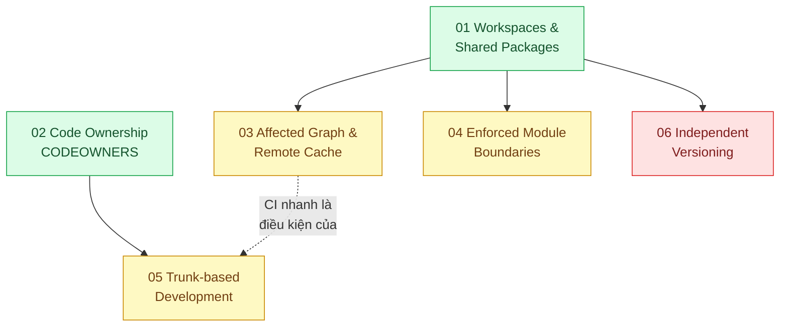

# 09 · Monorepo (`backend / monorepo`)

> **Phạm vi:** Nhiều ứng dụng và thư viện trong một repo (pnpm workspaces + Turborepo/Nx): chia sẻ
> code, CI chỉ chạy phần bị ảnh hưởng, ranh giới module, quy trình nhánh, sở hữu code, phát hành
> package nội bộ. Kiến trúc bên trong một ứng dụng thuộc scope 08.
>
> **Câu hỏi trung tâm:** Nhiều ứng dụng và thư viện trong một repo: chia sẻ code mà CI không chậm
> và ranh giới không vỡ?

## Bản đồ pattern trong scope

## Danh sách bài toán

| # | Bài toán (pattern — triệu chứng) | Mức | Pattern gốc / nguồn | Trạng thái |
|---|---|---|---|---|
| 01 | [Workspaces & Shared Packages — Sửa một hàm trong thư viện chung phải mở 12 PR ở 12 repo](./01-workspace-sua-shared-lib-phai-mo-12-pr/) | 🟢 | pnpm docs "Workspaces"; Potvin & Levenberg, "Why Google Stores Billions of Lines of Code in a Single Repository" (CACM 2016) | 📋 |
| 02 | [Code Ownership & Review Routing — 60 người trong một repo, không biết ai phải review thư mục nào](./02-codeowners-ai-review-thu-muc-nao/) | 🟢 | GitHub Docs "About code owners"; *Software Engineering at Google* (2020) ch.9 Code Review | 📋 |
| 03 | [Affected Graph & Remote Cache — CI chạy 40 phút cho mỗi commit dù chỉ sửa một README](./03-affected-graph-ci-chay-40-phut-cho-moi-commit/) | 🟡 | Turborepo docs "Caching", "Filtering"; Nx docs "Affected" | 📋 |
| 04 | [Enforced Module Boundaries — Frontend import thẳng vào repository của backend vì "cùng repo"](./04-module-boundaries-frontend-import-thang-vao-repository-backend/) | 🟡 | Nx docs "Enforce module boundaries"; ESLint `no-restricted-imports`; Grzybek, Modular Monolith (ranh giới) | 📋 |
| 05 | [Trunk-based Development — Nhánh sống 3 tuần, merge xong là nửa ngày sửa conflict](./05-trunk-based-development-branch-song-3-tuan-merge-hell/) | 🟡 | Paul Hammant, trunkbaseddevelopment.com; *Software Engineering at Google* ch.16; Feature Toggles (scope 08) | 📋 |
| 06 | [Independent Versioning (Changesets) — Mỗi lần release phải nhớ tay package nào đổi để tăng version](./06-versioning-release-xuat-ban-package-noi-bo-theo-changeset/) | 🔴 | Changesets docs; Semantic Versioning 2.0.0 | 📋 |

## Lộ trình đề xuất trong scope

1. **Workspaces** — dựng monorepo tối thiểu (1 app NestJS, 1 app Next.js, 1 package chung).
2. **CODEOWNERS** — rẻ, hiệu quả ngay khi có hơn một team.
3. **Affected graph & cache** — bài quan trọng nhất về chi phí CI.
4. **Module boundaries** — biến quy ước thành lint.
5. **Trunk-based** — quy trình; cần CI nhanh (bài 03) và feature toggle (scope 08 bài 06).
6. **Versioning** — chỉ cần khi publish package ra ngoài monorepo.

## Kiến thức nền cần có trước

- pnpm cơ bản; `package.json` `workspace:*`.
- Git: rebase, merge, nhánh ngắn.
- Đã dùng Turborepo hoặc Nx ở mức chạy lệnh.

## Liên kết với scope khác

- `08-backend-monolith` bài 05 — modular monolith là bài toán ranh giới ở mức code; monorepo là ở mức package.
- `17-backend-docker` bài 02 — layer cache trong Docker cho monorepo (prune, `turbo prune`).
- `16-backend-k8s` bài 08 — GitOps nhận artifact từ CI của monorepo.

## Nguồn tổng quan cho scope

- Potvin & Levenberg, CACM 2016 — https://cacm.acm.org/research/why-google-stores-billions-of-lines-of-code-in-a-single-repository/
- Turborepo docs — https://turborepo.com/docs · Nx docs — https://nx.dev/docs
- Paul Hammant, *Trunk Based Development* — https://trunkbaseddevelopment.com/
