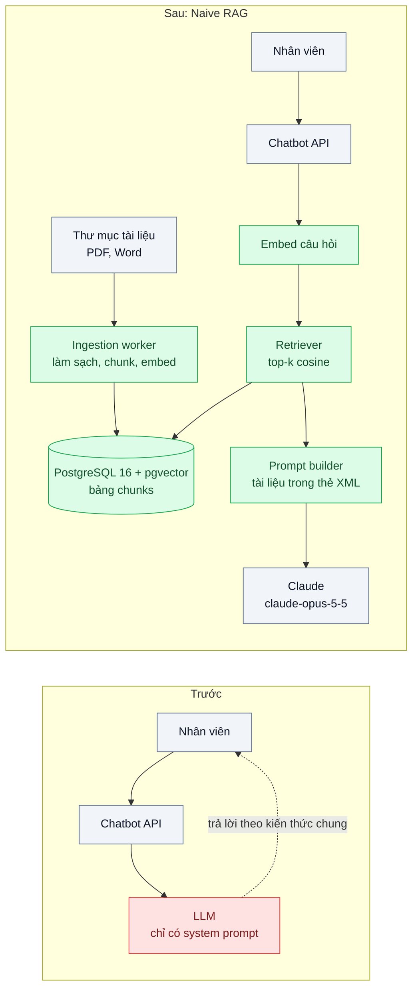
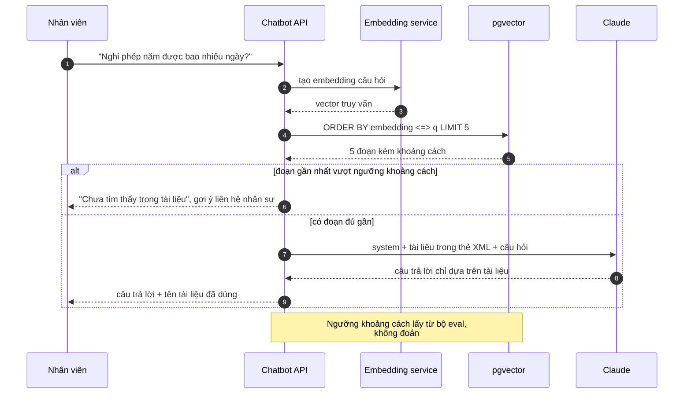

# Naive RAG (retrieve → augment → generate) — Chatbot hỏi nội quy công ty trả lời bịa vì model không có tài liệu

| Scope | Mức độ | Trạng thái | Pattern gốc | Cập nhật |
|---|---|---|---|---|
| 10 · backend / AI RAG | 🟢 Cơ bản | 📋 Kế hoạch | RAG — Lewis et al. (NeurIPS 2020); Naive RAG — Gao et al., RAG Survey (2023) | 2026-10-06 |

> **Một câu tóm tắt:** Trước khi gọi model, tìm vài đoạn tài liệu nội bộ gần nhất với câu hỏi rồi đặt chúng vào prompt kèm chỉ dẫn "chỉ trả lời từ tài liệu, không có thì nói không biết" — để chatbot trả lời bằng nội quy của chính công ty thay vì bằng kiến thức chung.

## 1. Bài toán thực tế (What)

**Bối cảnh** *(doanh nghiệp giả định, số liệu minh họa)*
Chuỗi bán lẻ có 1.200 nhân viên văn phòng và cửa hàng. Phòng nhân sự dựng chatbot nội bộ trên web và Slack bằng cách gọi thẳng LLM với một system prompt "Bạn là trợ lý nhân sự của công ty". Tài liệu nội quy, chính sách phúc lợi, quy trình công tác phí và FAQ IT khoảng 2.500 trang nằm trong thư mục chia sẻ dạng PDF và Word.

**Triệu chứng người kinh doanh nhìn thấy**
- Nhân viên hỏi "nghỉ phép năm được bao nhiêu ngày", chatbot trả lời theo mức chung của luật thay vì mức riêng của công ty; vài người lên kế hoạch nghỉ sai và bị trừ lương.
- Câu hỏi về định mức công tác phí, mẫu đơn, người phê duyệt được trả lời rất tự tin nhưng không khớp quy trình thật.
- Phòng nhân sự vẫn nhận khoảng 40 câu hỏi lặp lại mỗi tuần, cộng thêm việc "đính chính" câu trả lời sai của chatbot.

**Nguyên nhân kỹ thuật**
Model chưa từng thấy tài liệu nội bộ nên điền chỗ trống bằng kiến thức chung, và không có cơ chế nào buộc nó nói "không biết". Đưa nguyên 2.500 trang vào mỗi request thì vượt hoặc gần chạm context window và tốn tiền cho mọi câu hỏi; trong khi một câu hỏi thường chỉ cần một đến ba đoạn.

**Ràng buộc**
- Tài liệu thay đổi vài lần mỗi tháng; câu trả lời phải theo bản mới nhất trong vòng một ngày.
- Chi phí mỗi câu hỏi phải nhỏ để có thể mở cho toàn bộ nhân viên.
- Đây là bài nền: chấp nhận chất lượng truy hồi "vừa đủ" để có baseline, tối ưu ở các bài sau.

## 2. Vì sao dùng pattern này (Why)

**Nguyên nhân gốc mà pattern nhắm vào:** model sinh câu trả lời mà không có tri thức cần thiết trong ngữ cảnh, và không có tín hiệu nào để nó biết khi nào nên từ chối.

**Pattern giải quyết thế nào:** RAG tách bài toán thành hai pha. *Pha nạp (offline)*: đọc tài liệu → làm sạch → cắt thành đoạn (chunk) → tạo embedding cho từng đoạn → lưu vào PostgreSQL với pgvector. *Pha hỏi (online)*: tạo embedding cho câu hỏi → lấy top-k đoạn gần nhất theo cosine → ghép các đoạn vào prompt, bọc trong thẻ XML, kèm chỉ dẫn chỉ dùng thông tin trong thẻ → model sinh câu trả lời. Gao et al. gọi dạng tối thiểu này là *Naive RAG*: một lần truy hồi, không biến đổi câu hỏi, không xếp hạng lại. Nó giải quyết đúng nguyên nhân gốc (đưa tri thức vào ngữ cảnh) và tạo ra baseline đo được cho các bài tối ưu sau.

**Lựa chọn khác đã cân nhắc**

| Lựa chọn | Giải quyết được gì | Vì sao không chọn (ở bài này) |
|---|---|---|
| Giữ nguyên + tối ưu nhỏ: thêm "không biết thì nói không biết" vào system prompt | Giảm một phần câu bịa | Model vẫn không có nội quy nên đa số câu vẫn sai hoặc từ chối; không tạo giá trị |
| Long context: đưa toàn bộ tài liệu vào prompt kèm prompt caching | Không cần pipeline truy hồi, model thấy đủ tài liệu | Hợp lý khi kho nhỏ; với 2.500 trang và kho còn tăng, chi phí và độ trễ mỗi câu cao, cache hết hạn khi ít người hỏi |
| Fine-tune model trên nội quy | Model "thuộc" văn phong và kiến thức | Cập nhật chậm và tốn mỗi lần đổi chính sách, không chỉ ra được nguồn, vẫn có thể bịa |
| Tìm kiếm từ khóa và trả về danh sách tài liệu | Rẻ, dễ làm | Nhân viên phải tự đọc; không trả lời được câu hỏi diễn đạt tự nhiên |
| Naive RAG với pgvector *(chọn)* | Câu trả lời bám tài liệu mới nhất, chi phí theo vài đoạn | Chất lượng phụ thuộc truy hồi; cần bộ eval để biết đúng bao nhiêu |

## 3. Thiết kế hệ thống (How)

### 3.1 Kiến trúc trước và sau



### 3.2 Luồng chính



### 3.3 Thành phần và trách nhiệm

| Thành phần | Trách nhiệm | Quyết định thiết kế đáng chú ý |
|---|---|---|
| Ingestion worker | Đọc PDF/Word, bỏ header/footer lặp, chunk, gọi embedding, upsert theo `doc_id` + hash nội dung | Chạy lại được (idempotent); tài liệu đổi thì xóa chunk cũ của `doc_id` rồi ghi mới trong một transaction |
| Chunker (baseline) | Cắt cố định khoảng 800 token, chồng lấp khoảng 100 token | Cố ý đơn giản; bài 02 thay bằng cắt theo cấu trúc |
| Bảng `chunks` | `id, doc_id, title, content, embedding vector(N), updated_at` | Index HNSW với `vector_cosine_ops` để khớp toán tử `<=>` |
| Retriever | Embed câu hỏi bằng *đúng* model đã dùng khi nạp; lấy top-5 | Trả về cả khoảng cách để áp ngưỡng "không biết" |
| Prompt builder | Đặt tài liệu trước câu hỏi, mỗi đoạn trong thẻ có `title`; chỉ dẫn từ chối khi thiếu thông tin | Tách prompt thành file có version (scope 20 bài 02) |
| Generator | Gọi `claude-opus-5-5` qua `@anthropic-ai/sdk` | Đặt `output_config.effort` thấp cho câu hỏi tra cứu đơn giản; đo lại bằng eval |

### 3.4 Điểm dễ sai khi triển khai
- **Embed câu hỏi và tài liệu bằng hai model hoặc hai cấu hình khác nhau**: khoảng cách vô nghĩa. Lưu tên model embedding cùng mỗi chunk và kiểm tra khi truy vấn.
- **Toán tử không khớp operator class**: index tạo với `vector_cosine_ops` nhưng truy vấn dùng `<->` (L2) thì planner bỏ index và quét tuần tự.
- **Luôn nhét top-k dù không liên quan**: model "bám" vào đoạn sai và bịa có vẻ có nguồn. Cần ngưỡng khoảng cách và nhánh "chưa tìm thấy".
- **PDF bẩn**: số trang, header lặp, bảng vỡ dòng làm embedding nhiễu. Làm sạch trước khi chunk và xem tận mắt 20 chunk ngẫu nhiên.
- **Không có bộ eval ngay từ đầu**: mọi chỉnh sửa sau đó là cảm tính. Làm bài 06 ngay sau bài này.

## 4. Tech stack và tác động (Impact techstack)

| Lớp | Công nghệ chọn | Vì sao chọn | Thay thế tương đương |
|---|---|---|---|
| Ngôn ngữ / runtime | TypeScript strict, Node 20+ | Trùng stack hiện có | — |
| HTTP app | NestJS | Module rõ cho ingestion và query | Fastify |
| Lưu vector | PostgreSQL 16 + pgvector (HNSW, cosine) | Không thêm hệ lưu trữ mới; transaction chung với metadata tài liệu | Qdrant |
| Embedding | Model embedding (ví dụ Voyage AI, hoặc mô hình mở qua Text Embeddings Inference) | Cần hỗ trợ tiếng Việt tốt; sẽ chọn cụ thể khi thực hành bằng bộ eval | Bất kỳ model đa ngôn ngữ nào đạt eval |
| LLM | `@anthropic-ai/sdk`, `claude-opus-5-5` | Model mặc định của repo; theo dõi `usage` để tính chi phí | `claude-sonnet-5-5` nếu eval cho thấy đủ |
| Hạ tầng / test | Docker Compose (Postgres + pgvector), Vitest; thư viện đọc PDF/DOCX chọn khi thực hành (cần xác minh chất lượng với tiếng Việt) | Một lệnh dựng lại được | Tiền xử lý tài liệu bằng công cụ ngoài |

**Thay đổi so với hệ thống hiện tại:** thêm extension pgvector, bảng `chunks`, worker nạp tài liệu chạy định kỳ và một bước truy hồi trước lời gọi LLM. Đội vận hành học cách chạy lại ingestion và đọc log "chưa tìm thấy" để bổ sung tài liệu.

## 5. Kết quả đầu ra và cách đo (Output impact)

| Chỉ số | Trước (minh họa) | Mục tiêu khi thực hành | Cách đo |
|---|---|---|---|
| Tỷ lệ trả lời đúng | 35% | ≥ 70% (baseline cho các bài sau) | Bộ eval 50 câu có đáp án do phòng nhân sự viết, chấm bằng judge `claude-sonnet-5-5` + người kiểm 20% |
| Tỷ lệ bịa với câu ngoài phạm vi | 80% vẫn trả lời | ≤ 10% | 15 câu không có trong tài liệu, đếm câu không từ chối |
| Hit rate@5 (đoạn đúng có trong top 5) | không đo | đo được, ghi baseline | Mỗi câu eval gắn `doc_id` đúng; script so với kết quả retriever |
| p95 độ trễ end-to-end | không đo | dưới 6 giây | Script gửi 50 câu tuần tự, đo thời gian, tính p95 |
| Chi phí mỗi câu hỏi | không đo | thấy được | Tổng `usage` vào/ra × đơn giá, chia số câu |

> Số "trước" là minh họa để hình dung bài toán. Số "mục tiêu" chỉ được coi là đạt khi có số đo thật
> ở mục 8 kèm môi trường đo.

**Tác động nghiệp vụ mong đợi:** nhân viên nhận câu trả lời theo nội quy thật hoặc được chỉ sang nhân sự khi tài liệu không có; phòng nhân sự bớt câu hỏi lặp lại và bớt việc đính chính.

## 6. Đánh đổi và khi KHÔNG nên dùng

**Đánh đổi**
- Thêm một pipeline phải vận hành (nạp, làm sạch, đồng bộ khi tài liệu đổi); chunk cũ còn sót là nguồn sai mới.
- Chất lượng bị chặn bởi truy hồi: đoạn đúng không vào top-k thì model không thể trả lời đúng.
- Thêm độ trễ của bước embed và truy vấn vector trước lời gọi LLM.

**Không nên dùng khi**
- Kho tài liệu nhỏ, vừa trong context window và ít đổi: đưa thẳng vào prompt kèm prompt caching đơn giản hơn (scope 22 bài 01).
- Câu hỏi cần dữ liệu có cấu trúc thay đổi từng phút (tồn kho, số dư): gọi API hoặc tool truy vấn DB, không phải truy hồi văn bản (scope 11 bài 02).

**Liên quan**
- [RAG Evaluation](../06-rag-evaluation-ragas-khong-biet-tra-loi-dung-bao-nhieu-phan-tram/) — làm ngay sau bài này.
- [Chunking Strategies](../02-chunking-cat-giua-dieu-khoan-tra-loi-thieu-nghia/) — bậc tối ưu đầu tiên.
- [Citations & Grounding](../08-citations-grounding-khach-hoi-cau-nay-lay-o-dau/) — chỉ ra câu trả lời lấy từ đâu.
- [pgvector vs Dedicated Vector DB (scope 12)](../../12-backend-database-vector/01-pgvector-vs-vector-db-rieng-da-co-postgres/) — vì sao bắt đầu bằng pgvector.
- [Prompt Caching (scope 22)](../../22-backend-ai-optimizer/01-prompt-caching-system-prompt-20k-token-tra-tien-moi-request/) — phương án long context.

## 7. Cơ sở tham khảo

- Lewis et al., "Retrieval-Augmented Generation for Knowledge-Intensive NLP Tasks", NeurIPS 2020 — định nghĩa gốc của RAG: kết hợp bộ truy hồi với mô hình sinh.
- Gao et al., "Retrieval-Augmented Generation for Large Language Models: A Survey" (2023), arXiv 2312.10997 — phân loại Naive / Advanced / Modular RAG; bài này là dạng Naive.
- pgvector — https://github.com/pgvector/pgvector — kiểu `vector`, toán tử `<=>`, index HNSW và operator class `vector_cosine_ops`.
- Anthropic, "Introducing Contextual Retrieval" (2024) — https://www.anthropic.com/news/contextual-retrieval — gợi ý khi nào kho đủ nhỏ để đưa thẳng vào prompt thay vì dựng RAG.
- Anthropic docs, "Prompt caching" — https://platform.claude.com/docs/en/build-with-claude/prompt-caching — cơ sở cho phương án long context ở bảng lựa chọn.
- Chip Huyen, *AI Engineering* (2025), chương về RAG — kiến trúc retriever + generator và các lỗi thường gặp.

## 8. Kế hoạch thực hành

- [ ] Bước 1: Docker Compose với Postgres 16 + pgvector; bộ tài liệu mẫu khoảng 50 trang nội quy giả định (tự viết, không dùng tài liệu thật); bộ eval 50 câu + 15 câu ngoài phạm vi.
- [ ] Bước 2: đo "trước": gọi model không có tài liệu trên bộ eval, ghi tỷ lệ đúng và tỷ lệ bịa.
- [ ] Bước 3: áp dụng pattern: ingestion (làm sạch, chunk cố định, embed, upsert), retriever top-5 có ngưỡng, prompt builder, generator.
- [ ] Bước 4: đo "sau" trên cùng bộ eval: tỷ lệ đúng, tỷ lệ bịa, hit rate@5, p95, chi phí; ghi vào mục 5 kèm model embedding đã chọn.
- [ ] Bước 5: test Vitest: (a) chạy ingestion hai lần không nhân đôi chunk, (b) sửa tài liệu thì chunk cũ biến mất, (c) câu ngoài phạm vi đi nhánh "chưa tìm thấy", (d) truy vấn dùng index (kiểm tra `EXPLAIN`).

**Cấu trúc code dự kiến**
```text
src/
  ingestion/
    document-loader.ts      # đọc PDF/DOCX, làm sạch
    fixed-size-chunker.ts   # baseline, bài 02 thay thế
    ingest-documents.ts     # upsert theo doc_id + hash
  retrieval/
    embedding-client.ts
    vector-retriever.ts     # top-k + ngưỡng khoảng cách
  generation/
    prompt-builder.ts
    answer-question.ts
test/
  ingest-documents.test.ts
  vector-retriever.test.ts
eval/run-eval.ts            # đọc eval/questions.jsonl
docker-compose.yml          # postgres 16 + pgvector
```

**Cách chạy** *(điền khi bắt đầu code)*
```bash
docker compose up -d
pnpm install && pnpm test
```
