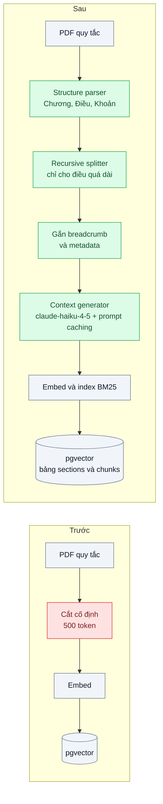
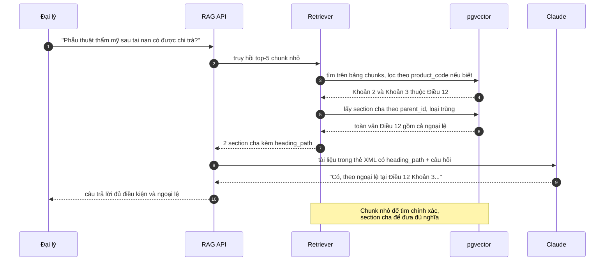

# Chunking Strategies — Chunk cắt ngang giữa điều khoản, câu trả lời thiếu nửa điều kiện

| Scope | Mức độ | Trạng thái | Pattern gốc | Cập nhật |
|---|---|---|---|---|
| 10 · backend / AI RAG | 🟢 Cơ bản | 📋 Kế hoạch | Chunking — Gao et al., RAG Survey (2023); Contextual Retrieval — Anthropic (2024) | 2026-10-06 |

> **Một câu tóm tắt:** Cắt tài liệu theo đúng cấu trúc của nó (chương, điều, khoản), gắn "đường dẫn tiêu đề" và một câu ngữ cảnh vào từng đoạn, rồi khi truy hồi trả về cả điều khoản cha — để model luôn thấy đủ điều kiện và ngoại lệ thay vì một nửa câu.

## 1. Bài toán thực tế (What)

**Bối cảnh** *(doanh nghiệp giả định, số liệu minh họa)*
Công ty bảo hiểm sức khỏe có 3.000 đại lý dùng chatbot tra quy tắc sản phẩm trước khi tư vấn. Kho gồm 120 bộ quy tắc, mỗi bộ 40–80 trang, cấu trúc Chương → Điều → Khoản → Điểm. Pipeline RAG hiện tại (bài 01) cắt cố định 500 token, chồng lấp 50 token.

**Triệu chứng người kinh doanh nhìn thấy**
- Đại lý hỏi "phẫu thuật thẩm mỹ sau tai nạn có được chi trả không", chatbot trả lời "không, thuộc loại trừ" vì đoạn chứa câu "trừ trường hợp phẫu thuật tái tạo sau tai nạn" nằm ở chunk kế tiếp không được truy hồi.
- Câu trả lời liệt kê điều kiện a, b nhưng thiếu c; khách khiếu nại khi bị từ chối bồi thường.
- Chatbot trộn quy tắc của hai sản phẩm vì đoạn "Khoản 3" không cho biết thuộc Điều nào, sản phẩm nào.

**Nguyên nhân kỹ thuật**
Cắt theo số token không biết ranh giới ngữ nghĩa: một điều khoản bị chia đôi, phần ngoại lệ tách khỏi quy tắc. Đoạn mất ngữ cảnh (tên sản phẩm, số điều, phiên bản) nên embedding của "Khoản 3. Trường hợp trên không áp dụng nếu..." gần như giống nhau giữa 120 bộ quy tắc.

**Ràng buộc**
- Không đổi model embedding hay hệ lưu trữ ở bài này; chỉ đổi cách cắt và cách lắp ngữ cảnh.
- Tài liệu là PDF xuất từ Word, tiêu đề có định dạng nhất quán nhưng không hoàn hảo.
- Chi phí nạp lại toàn bộ kho phải ước tính trước và chấp nhận được.

## 2. Vì sao dùng pattern này (Why)

**Nguyên nhân gốc mà pattern nhắm vào:** đơn vị truy hồi (chunk) không trùng đơn vị nghĩa (điều khoản), và chunk bị tách khỏi ngữ cảnh tài liệu.

**Pattern giải quyết thế nào:** kết hợp bốn kỹ thuật, mỗi kỹ thuật đo riêng bằng bộ eval:
1. **Structure-aware chunking**: tách theo tiêu đề (Chương/Điều/Khoản) nhận diện bằng định dạng và regex; điều quá dài mới cắt tiếp bằng recursive splitting (ưu tiên ranh giới đoạn → câu).
2. **Breadcrumb + metadata**: mỗi chunk mang `product_code`, `version`, `heading_path` ("Quy tắc SK-Plus 2025 › Chương III › Điều 12 › Khoản 3") và chuỗi này được đặt đầu nội dung trước khi embed.
3. **Contextual Retrieval**: dùng LLM sinh một đến hai câu mô tả vị trí và ý chính của chunk trong toàn tài liệu, nối vào trước chunk khi embed và khi index BM25 (theo bài viết của Anthropic). Tài liệu gốc được đặt trong phần prompt có `cache_control` để các chunk cùng tài liệu đọc lại từ cache.
4. **Parent-child retrieval**: index chunk nhỏ (khoản) để truy hồi chính xác, nhưng đưa vào prompt cả điều cha để không mất điều kiện và ngoại lệ.

**Lựa chọn khác đã cân nhắc**

| Lựa chọn | Giải quyết được gì | Vì sao không chọn (ở bài này) |
|---|---|---|
| Giữ nguyên + tối ưu nhỏ: tăng chunk lên 1.500 token, chồng lấp 30% | Ít bị cắt ngang hơn | Chunk loãng nhiều ý, embedding kém đặc trưng; tốn token prompt; vẫn cắt ở chỗ bất kỳ |
| Semantic chunking (cắt khi độ tương đồng giữa các câu liền kề giảm) | Cắt theo chuyển ý | Không tôn trọng cấu trúc pháp lý; tốn thêm embedding cho từng câu; khó giải thích vì sao cắt |
| Đưa nguyên bộ quy tắc vào prompt | Không bao giờ cắt ngang | 120 bộ quy tắc không thể đưa hết; phải biết trước sản phẩm nào; chi phí cao |
| Structure-aware + breadcrumb + contextual + parent-child *(chọn)* | Đơn vị truy hồi trùng điều khoản, đoạn mang đủ ngữ cảnh | Parser phụ thuộc định dạng tài liệu; contextual tốn một lời gọi LLM mỗi chunk khi nạp |

## 3. Thiết kế hệ thống (How)

### 3.1 Kiến trúc trước và sau



### 3.2 Luồng chính



### 3.3 Thành phần và trách nhiệm

| Thành phần | Trách nhiệm | Quyết định thiết kế đáng chú ý |
|---|---|---|
| Structure parser | Nhận diện tiêu đề theo định dạng và regex "Chương", "Điều N.", "Khoản", "Điểm" | Tài liệu không nhận diện được thì rơi về recursive splitter và gắn cờ để người xem lại |
| Recursive splitter | Cắt điều dài theo đoạn → câu, giới hạn khoảng 400 token mỗi chunk | Không bao giờ cắt giữa câu |
| Breadcrumb + metadata | `heading_path`, `product_code`, `version`, `effective_date`, `parent_id` | Breadcrumb nằm trong nội dung được embed, metadata dùng để lọc |
| Context generator | Sinh 1–2 câu ngữ cảnh cho mỗi chunk bằng `claude-haiku-4-5` | Toàn văn tài liệu đặt trước, có `cache_control`; theo dõi `usage.cache_read_input_tokens` để chắc cache có tác dụng |
| Bảng `sections` và `chunks` | Section là điều khoản đầy đủ; chunk là đơn vị embed, trỏ về section | Giới hạn tổng token section đưa vào prompt để không phình ngữ cảnh |

### 3.4 Điểm dễ sai khi triển khai
- **Parser quá tin vào định dạng**: một tài liệu đánh số "Điều 5" trong nội dung câu (dẫn chiếu) bị hiểu thành tiêu đề mới. Chỉ coi là tiêu đề khi ở đầu dòng và đúng mẫu định dạng; kiểm tra bằng tập tài liệu mẫu.
- **Parent quá lớn**: một điều 6.000 token đưa nguyên vào prompt làm chi phí tăng vọt. Đặt trần, vượt trần thì chỉ đưa các khoản lân cận chunk trúng.
- **Context generator bịa**: câu ngữ cảnh do LLM sinh có thể sai; chỉ dùng nó để *tìm*, còn nội dung đưa vào prompt trả lời là văn bản gốc.
- **Prompt caching không trúng**: tài liệu thay đổi từng byte (thêm ngày giờ, thứ tự khác) làm cache trượt; giữ tiền tố ổn định, chunk thay đổi đặt sau.
- **Quên nạp lại sau khi đổi chiến lược cắt**: trộn chunk cũ và mới trong cùng bảng. Gắn `chunker_version` và xóa theo version.

## 4. Tech stack và tác động (Impact techstack)

| Lớp | Công nghệ chọn | Vì sao chọn | Thay thế tương đương |
|---|---|---|---|
| Ngôn ngữ / runtime | TypeScript strict, Node 20+ | Trùng stack | — |
| Splitter | Tự viết parser theo cấu trúc + recursive splitter nhỏ | Cấu trúc pháp lý Việt Nam cần regex riêng; tự viết dễ test | Text splitter của LangChain / LlamaIndex |
| Lưu trữ | PostgreSQL 16 + pgvector, hai bảng `sections` / `chunks` | Join parent-child bằng SQL, cùng transaction | Qdrant (payload chứa `parent_id`) |
| Embedding | Model embedding (ví dụ Voyage AI, hoặc mô hình mở qua Text Embeddings Inference) | Giữ nguyên model của bài 01 để chỉ đo tác động của chunking; chọn cụ thể khi thực hành | — |
| Sinh ngữ cảnh | `@anthropic-ai/sdk`, `claude-haiku-4-5`, prompt caching (`cache_control`) | Việc đơn giản, khối lượng lớn; model nhỏ đủ dùng | `claude-sonnet-5-5`; chạy offline bằng Message Batches |
| Trả lời | `claude-opus-5-5` | Model mặc định | — |
| Test | Vitest + bộ tài liệu mẫu có cấu trúc | Kiểm tra ranh giới cắt bằng snapshot | — |

**Thay đổi so với hệ thống hiện tại:** thay chunker, thêm bảng `sections`, thêm bước sinh ngữ cảnh trong ingestion và bước mở rộng sang section cha trong retriever. Phải nạp lại toàn bộ kho một lần; đội nội dung cần giữ định dạng tiêu đề nhất quán khi soạn quy tắc mới.

## 5. Kết quả đầu ra và cách đo (Output impact)

| Chỉ số | Trước (minh họa) | Mục tiêu khi thực hành | Cách đo |
|---|---|---|---|
| Tỷ lệ câu trả lời đủ điều kiện và ngoại lệ | 58% | ≥ 85% | Bộ eval 60 câu có đáp án liệt kê đủ điều kiện; judge `claude-sonnet-5-5` chấm theo rubric, người kiểm 20% |
| Context recall | không đo | ≥ 0,9 | RAGAS context recall trên cùng bộ eval (hoặc tự cài theo định nghĩa trong paper) |
| Tỷ lệ chunk cắt giữa câu hoặc giữa khoản | khoảng 40% | 0% giữa câu, < 5% giữa khoản | Script kiểm ranh giới chunk so với cây tiêu đề do parser sinh |
| Hit rate@5 | baseline bài 01 | không thấp hơn baseline | Script so `section_id` đúng với kết quả truy hồi |
| Token ngữ cảnh trung bình mỗi câu | đo ở bài 01 | tăng không quá 50% | Log `usage.input_tokens` |
| Chi phí nạp toàn kho (sinh ngữ cảnh) | không có | ước tính trước, đo thật | Tổng `usage` của bước contextual × đơn giá, tách phần đọc từ cache |

> Số "trước" là minh họa để hình dung bài toán. Số "mục tiêu" chỉ được coi là đạt khi có số đo thật
> ở mục 8 kèm môi trường đo.

**Tác động nghiệp vụ mong đợi:** đại lý nhận câu trả lời có đủ ngoại lệ nên tư vấn đúng ngay lần đầu; giảm khiếu nại do tư vấn sai quyền lợi.

## 6. Đánh đổi và khi KHÔNG nên dùng

**Đánh đổi**
- Parser gắn chặt với định dạng tài liệu; tài liệu mới có định dạng lạ phải bổ sung luật.
- Contextual Retrieval thêm chi phí và thời gian nạp; mỗi lần đổi chiến lược phải nạp lại.
- Parent-child làm prompt dài hơn; cần trần token.

**Không nên dùng khi**
- Tài liệu ngắn, không có cấu trúc (tin nhắn, ticket một đoạn): mỗi tài liệu là một chunk là đủ.
- Kho nhỏ đưa được nguyên vào prompt: không cần chunk.

**Liên quan**
- [Naive RAG](../01-naive-rag-chatbot-noi-quy-cong-ty-tra-loi-bua/) — pipeline gốc được tối ưu.
- [Hybrid Search](../03-hybrid-search-rrf-ma-san-pham-tim-vector-khong-ra/) — chunk có ngữ cảnh cũng giúp nhánh BM25.
- [Citations & Grounding](../08-citations-grounding-khach-hoi-cau-nay-lay-o-dau/) — ranh giới chunk quyết định độ chính xác trích dẫn.
- [Prompt Caching (scope 22)](../../22-backend-ai-optimizer/01-prompt-caching-system-prompt-20k-token-tra-tien-moi-request/) và [Batch Processing (scope 22)](../../22-backend-ai-optimizer/02-batch-api-phan-loai-1-trieu-ticket-cu/) — giảm chi phí bước sinh ngữ cảnh.

## 7. Cơ sở tham khảo

- Gao et al., "Retrieval-Augmented Generation for Large Language Models: A Survey" (2023), arXiv 2312.10997 — phần tối ưu chunking và metadata trong Advanced RAG.
- Anthropic, "Introducing Contextual Retrieval" (2024) — https://www.anthropic.com/news/contextual-retrieval — kỹ thuật nối ngữ cảnh do LLM sinh vào chunk trước khi embed và index BM25, dùng prompt caching để giảm chi phí.
- LangChain docs (text splitters) — https://python.langchain.com/docs/ — recursive splitting theo danh sách ký tự phân cách; tham khảo cơ chế, không dùng thư viện.
- LlamaIndex docs — https://docs.llamaindex.ai/ — node parser theo cấu trúc và truy hồi parent-child (cần xác minh tên module cụ thể).
- Anthropic docs, "Prompt caching" — https://platform.claude.com/docs/en/build-with-claude/prompt-caching — `cache_control`, tiền tố ổn định, đọc `usage` để kiểm tra cache.

## 8. Kế hoạch thực hành

- [ ] Bước 1: bộ 10 quy tắc bảo hiểm giả định (tự soạn, có Chương/Điều/Khoản, có ngoại lệ nằm cuối điều); bộ eval 60 câu tập trung vào điều kiện và ngoại lệ.
- [ ] Bước 2: đo "trước" với chunker cố định của bài 01: tỷ lệ đủ điều kiện, context recall, tỷ lệ cắt ngang.
- [ ] Bước 3: áp dụng lần lượt structure-aware → breadcrumb → contextual → parent-child; mỗi bước đo lại để biết bước nào đóng góp.
- [ ] Bước 4: ghi bảng so sánh bốn cấu hình vào mục 5, kèm chi phí nạp và token ngữ cảnh.
- [ ] Bước 5: test Vitest: (a) không chunk nào cắt giữa câu, (b) mỗi chunk có `heading_path` và `parent_id`, (c) dẫn chiếu "theo Điều 5" trong câu không tạo tiêu đề mới, (d) truy hồi một khoản trả về section cha không trùng lặp.

**Cấu trúc code dự kiến**
```text
src/
  chunking/
    structure-parser.ts       # cây Chương/Điều/Khoản
    recursive-splitter.ts
    breadcrumb.ts
    context-generator.ts      # claude-haiku-4-5 + cache_control
  retrieval/
    parent-child-retriever.ts
test/
  structure-parser.test.ts
  parent-child-retriever.test.ts
eval/run-eval.ts
docker-compose.yml            # postgres 16 + pgvector
```

**Cách chạy** *(điền khi bắt đầu code)*
```bash
docker compose up -d
pnpm install && pnpm test
```
