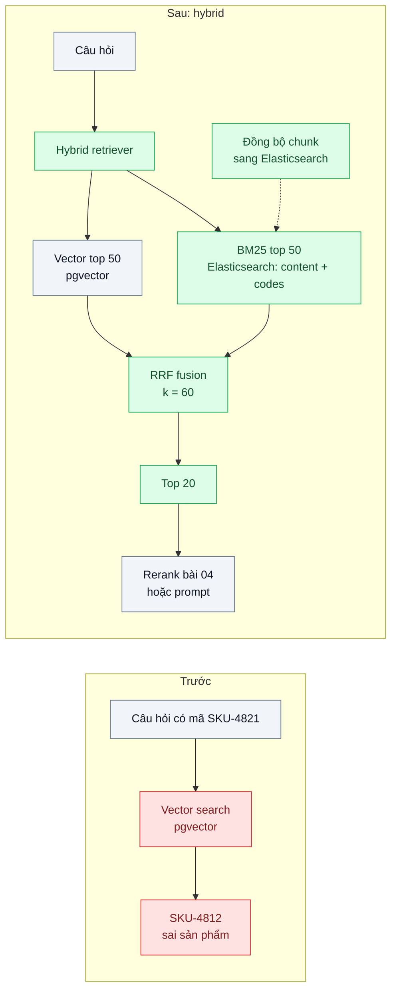
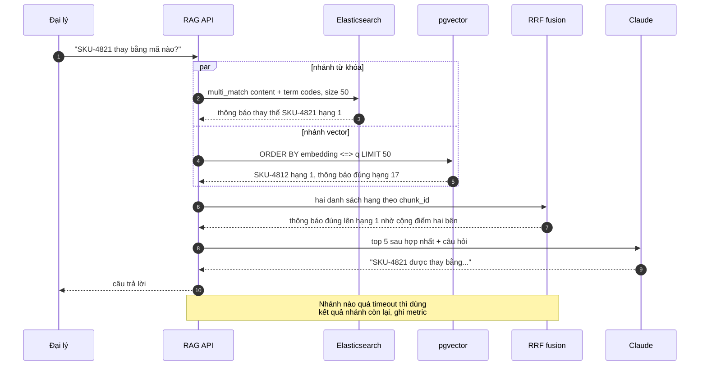

# Hybrid Search (BM25 + vector, RRF) — Hỏi mã sản phẩm "SKU-4821", tìm bằng vector không ra

| Scope | Mức độ | Trạng thái | Pattern gốc | Cập nhật |
|---|---|---|---|---|
| 10 · backend / AI RAG | 🟡 Trung bình | 📋 Kế hoạch | Reciprocal Rank Fusion — Cormack, Clarke, Buettcher (SIGIR 2009); BM25 — Robertson & Zaragoza (2009) | 2026-10-06 |

> **Một câu tóm tắt:** Chạy song song tìm kiếm từ khóa BM25 (khớp chính xác mã, số hiệu) và tìm kiếm vector (khớp ý nghĩa), rồi hợp nhất hai danh sách bằng Reciprocal Rank Fusion — để câu hỏi chứa "SKU-4821" lẫn câu hỏi diễn đạt tự nhiên đều tìm đúng tài liệu.

## 1. Bài toán thực tế (What)

**Bối cảnh** *(doanh nghiệp giả định, số liệu minh họa)*
Nhà phân phối thiết bị điện B2B có 1.500 đại lý dùng chatbot hỗ trợ kỹ thuật. Kho gồm 40.000 tài liệu: datasheet, hướng dẫn lắp đặt, bảng mã lỗi biến tần, thông báo thay thế sản phẩm. RAG hiện tại chỉ dùng vector search trên pgvector.

**Triệu chứng người kinh doanh nhìn thấy**
- Đại lý hỏi "SKU-4821 thay bằng mã nào?", chatbot trả lời về SKU-4812 hoặc một dòng sản phẩm chung chung.
- Câu có mã lỗi "biến tần báo E-07" nhận hướng dẫn cho E-01; đại lý gọi tổng đài, kỹ thuật viên mất thời gian xử lý lại.
- Khoảng 30% câu hỏi có chứa mã sản phẩm, mã lỗi hoặc tên model; nhóm này có tỷ lệ trả lời sai cao nhất.

**Nguyên nhân kỹ thuật**
Embedding biểu diễn *ý nghĩa*; các chuỗi định danh hiếm như "SKU-4821", "E-07" gần như không mang nghĩa nên được đặt gần những chuỗi trông giống (SKU-4812, E-01). Ngược lại, BM25 khớp chính xác token nhưng thua khi đại lý dùng từ khác tài liệu ("aptomat nhảy liên tục" so với "thiết bị ngắt mạch tác động"). Mỗi phương pháp mù ở đúng chỗ phương pháp kia mạnh.

**Ràng buộc**
- Độ trễ truy hồi thêm vào không quá vài chục ms ở p95.
- Không muốn tinh chỉnh trọng số thủ công cho từng loại câu hỏi.
- Đã có Elasticsearch cho trang tìm kiếm sản phẩm; tái dùng được analyzer tiếng Việt (scope 05).

## 2. Vì sao dùng pattern này (Why)

**Nguyên nhân gốc mà pattern nhắm vào:** một bộ truy hồi duy nhất chỉ nắm được một loại tín hiệu (từ vựng hoặc ngữ nghĩa).

**Pattern giải quyết thế nào:** gửi câu hỏi tới hai bộ truy hồi song song — BM25 trên Elasticsearch (trường `content` qua analyzer tiếng Việt, trường `codes` dạng `keyword` giữ nguyên mã) và vector trên pgvector — mỗi bên lấy top 50. Hợp nhất bằng **Reciprocal Rank Fusion**: điểm của tài liệu d là tổng 1 / (k + hạng của d trong từng danh sách), với k là hằng số (paper gốc dùng 60). RRF chỉ dùng *thứ hạng*, nên không phải chuẩn hóa điểm BM25 (không bị chặn) với khoảng cách cosine (0–2). Tài liệu đứng cao ở cả hai danh sách lên đầu; tài liệu chỉ một bên tìm thấy vẫn có mặt. Top 20 sau hợp nhất đi tiếp sang bước rerank (bài 04) hoặc thẳng vào prompt.

**Lựa chọn khác đã cân nhắc**

| Lựa chọn | Giải quyết được gì | Vì sao không chọn (ở bài này) |
|---|---|---|
| Giữ nguyên + tối ưu nhỏ: tăng top-k vector lên 50 đưa vào prompt | Đôi khi tài liệu đúng lọt vào | Không đảm bảo; prompt dài, đắt và nhiễu |
| Chỉ dùng BM25 | Khớp mã tuyệt đối | Mất toàn bộ câu hỏi diễn đạt tự nhiên |
| Tổ hợp tuyến tính điểm (chuẩn hóa min-max rồi cộng với trọng số α) | Điều chỉnh được mức ưu tiên | Phụ thuộc phân phối điểm từng truy vấn; phải tinh chỉnh α và tinh chỉnh lại khi dữ liệu đổi |
| Router: regex phát hiện mã → BM25, còn lại → vector | Đơn giản, rẻ | Giòn với câu lẫn cả mã lẫn mô tả; regex bỏ sót định dạng mã mới |
| Hybrid + RRF *(chọn)* | Bắt cả hai loại tín hiệu, không cần tinh chỉnh trọng số | Thêm một hệ truy hồi phải đồng bộ dữ liệu; thêm độ trễ của nhánh chậm hơn |

## 3. Thiết kế hệ thống (How)

### 3.1 Kiến trúc trước và sau



### 3.2 Luồng chính



### 3.3 Thành phần và trách nhiệm

| Thành phần | Trách nhiệm | Quyết định thiết kế đáng chú ý |
|---|---|---|
| Index Elasticsearch | Trường `content` dùng analyzer tiếng Việt + folding; trường `codes` kiểu `keyword` chứa mã trích bằng regex khi nạp | Mã được chuẩn hóa (bỏ khoảng trắng, viết hoa) cả khi nạp lẫn khi truy vấn |
| Đồng bộ chunk | Mỗi chunk ghi vào pgvector và Elasticsearch cùng `chunk_id` | Nguồn sự thật là PostgreSQL; đồng bộ qua outbox hoặc CDC (scope 05 bài 05) |
| Hybrid retriever | Gọi hai nhánh song song, timeout riêng từng nhánh | Một nhánh lỗi không làm hỏng cả truy vấn |
| RRF fusion | Cộng 1 / (k + rank) theo `chunk_id`, sắp xếp, cắt top 20 | Hàm thuần, dễ test; k là cấu hình, mặc định 60 |
| Eval phân nhóm | Đo riêng nhóm câu có mã, câu tự nhiên, câu hỗn hợp | Cải thiện nhóm này không được làm tụt nhóm kia |

### 3.4 Điểm dễ sai khi triển khai
- **Analyzer băm nát mã**: "SKU-4821" bị tách thành "sku" và "4821", khớp cả SKU-4821-B. Dùng trường `keyword` riêng cho mã, không chỉ dựa vào trường full-text.
- **Hai kho lệch nhau**: tài liệu đã xóa ở PostgreSQL vẫn còn trong Elasticsearch và được trả lời. Hợp nhất theo `chunk_id` rồi kiểm lại tồn tại ở nguồn sự thật, hoặc đồng bộ bằng CDC có giám sát độ trễ.
- **Cộng điểm thô thay vì hạng**: điểm BM25 có thể là 25, khoảng cách cosine là 0,3; cộng trực tiếp làm một nhánh áp đảo. RRF tránh được việc này.
- **Đánh giá bằng trung bình chung**: hybrid có thể tăng nhóm có mã nhưng giảm nhẹ nhóm tự nhiên; phải xem theo nhóm.
- **Nhánh chậm quyết định độ trễ**: đặt timeout và quan sát p95 của từng nhánh.

## 4. Tech stack và tác động (Impact techstack)

| Lớp | Công nghệ chọn | Vì sao chọn | Thay thế tương đương |
|---|---|---|---|
| Ngôn ngữ / runtime | TypeScript strict, Node 20+ | Trùng stack | — |
| Nhánh BM25 | Elasticsearch (analyzer tiếng Việt, trường `keyword` cho mã) | Đã có trong hệ thống; BM25 là thuật toán xếp hạng mặc định | OpenSearch; PostgreSQL full-text search khi kho nhỏ |
| Nhánh vector | PostgreSQL 16 + pgvector | Giữ nguyên từ bài 01 | Qdrant (có truy vấn hybrid tích hợp, cần xác minh theo phiên bản) |
| Hợp nhất | RRF tự cài ở tầng ứng dụng | Thấy rõ cơ chế, không phụ thuộc tính năng hybrid của từng sản phẩm | Retriever RRF tích hợp của Elasticsearch (cần xác minh phiên bản và giấy phép) |
| Embedding | Model embedding (ví dụ Voyage AI, hoặc mô hình mở qua Text Embeddings Inference) | Giữ nguyên để chỉ đo tác động của hybrid; chọn cụ thể khi thực hành | — |
| LLM | `@anthropic-ai/sdk`, `claude-opus-5-5` | Model mặc định | — |
| Hạ tầng / test | Docker Compose (Postgres + pgvector, Elasticsearch), Vitest | Dựng cả hai nhánh bằng một lệnh | — |

**Thay đổi so với hệ thống hiện tại:** thêm index chunk trong Elasticsearch và luồng đồng bộ, thêm hybrid retriever và hàm RRF. Đội vận hành theo dõi thêm độ trễ đồng bộ và sức khỏe cụm Elasticsearch.

## 5. Kết quả đầu ra và cách đo (Output impact)

| Chỉ số | Trước (minh họa) | Mục tiêu khi thực hành | Cách đo |
|---|---|---|---|
| Hit rate@5, nhóm câu có mã | 55% | ≥ 90% | Bộ eval 150 câu chia ba nhóm (mã, tự nhiên, hỗn hợp), mỗi câu gắn `chunk_id` đúng; script so kết quả |
| Hit rate@5, nhóm câu tự nhiên | baseline vector | không thấp hơn baseline | Cùng bộ eval |
| MRR@10 toàn bộ | không đo | tăng so với vector-only | Script tính theo định nghĩa trong IIR chương 8 |
| p95 độ trễ truy hồi | đo ở bài 01 | tăng không quá 40 ms | Script 1.000 truy vấn, đo từng nhánh và tổng |
| Tỷ lệ trả lời đúng end-to-end | đo ở bài 06 | tăng ở nhóm có mã | Chạy bộ eval RAG của bài 06 |
| Độ trễ đồng bộ PostgreSQL → Elasticsearch | không có | p95 dưới 1 phút | Ghi thời điểm ghi nguồn và thời điểm tìm thấy ở Elasticsearch |

> Số "trước" là minh họa để hình dung bài toán. Số "mục tiêu" chỉ được coi là đạt khi có số đo thật
> ở mục 8 kèm môi trường đo.

**Tác động nghiệp vụ mong đợi:** đại lý hỏi bằng mã nhận đúng tài liệu ngay, bớt cuộc gọi tổng đài cho các câu tra mã lỗi và mã thay thế.

## 6. Đánh đổi và khi KHÔNG nên dùng

**Đánh đổi**
- Hai hệ truy hồi phải đồng bộ và vận hành; thêm một nguồn lệch dữ liệu.
- RRF bỏ qua độ lớn của điểm: tài liệu hạng 1 với điểm áp đảo vẫn chỉ được cộng như hạng 1 thông thường.
- Thêm độ trễ của nhánh chậm hơn.

**Không nên dùng khi**
- Câu hỏi gần như không chứa mã, số hiệu, tên riêng: vector search một mình có thể đủ; đo trước khi thêm.
- Kho rất nhỏ: PostgreSQL full-text search + pgvector trong cùng DB đơn giản hơn dựng thêm Elasticsearch.

**Liên quan**
- [Reranking](../04-reranking-top-20-dung-nhung-top-5-sai/) — bước tiếp theo sau hợp nhất.
- [RAG Evaluation](../06-rag-evaluation-ragas-khong-biet-tra-loi-dung-bao-nhieu-phan-tram/) — đo trước khi tối ưu.
- [Inverted Index Full-text Search (scope 05)](../../05-backend-search/01-full-text-vs-like-tim-ao-thun-nam-mat-8-giay/) và [Text Analysis for Vietnamese (scope 05)](../../05-backend-search/02-vietnamese-analyzer-tim-ha-noi-ra-ha-noi/) — nền cho nhánh BM25.
- [CDC-based Index Sync (scope 05)](../../05-backend-search/05-cdc-dong-bo-index-du-lieu-search-lech-db/) — giữ hai kho đồng bộ.

## 7. Cơ sở tham khảo

- Cormack, Clarke, Buettcher, "Reciprocal Rank Fusion outperforms Condorcet and individual Rank Learning Methods", SIGIR 2009 — công thức RRF và hằng số k = 60.
- Robertson & Zaragoza, "The Probabilistic Relevance Framework: BM25 and Beyond" (2009) — cơ sở của nhánh từ khóa.
- Anthropic, "Introducing Contextual Retrieval" (2024) — https://www.anthropic.com/news/contextual-retrieval — kết hợp BM25 với embedding để bắt các khớp chính xác như mã và định danh.
- Elasticsearch docs — https://www.elastic.co/guide/ — analyzer, trường `keyword`, truy vấn `multi_match` và `term`.
- pgvector — https://github.com/pgvector/pgvector — phần hybrid search kết hợp với full-text search của PostgreSQL.
- Manning, Raghavan, Schütze, *Introduction to Information Retrieval* (2008), chương 8 — định nghĩa MRR và precision@k dùng ở mục 5.

## 8. Kế hoạch thực hành

- [ ] Bước 1: Docker Compose với Postgres + pgvector và Elasticsearch; kho 2.000 tài liệu kỹ thuật giả định có mã sản phẩm, mã lỗi; bộ eval 150 câu ba nhóm.
- [ ] Bước 2: đo "trước" vector-only: hit rate@5 theo nhóm, MRR@10, p95.
- [ ] Bước 3: áp dụng pattern: index Elasticsearch (analyzer + `codes`), đồng bộ chunk, hybrid retriever song song có timeout, hàm RRF.
- [ ] Bước 4: đo "sau", thử k = 20, 60, 100 và so với tổ hợp tuyến tính để thấy vì sao chọn RRF; ghi vào mục 5.
- [ ] Bước 5: test Vitest: (a) RRF đưa tài liệu xuất hiện ở cả hai danh sách lên trên, (b) một nhánh timeout vẫn trả kết quả nhánh kia, (c) "sku 4821" và "SKU-4821" chuẩn hóa thành cùng mã, (d) chunk đã xóa ở nguồn không được trả về.

**Cấu trúc code dự kiến**
```text
src/
  retrieval/
    bm25-retriever.ts         # Elasticsearch
    vector-retriever.ts       # pgvector
    hybrid-retriever.ts       # song song + timeout
    reciprocal-rank-fusion.ts
    code-normalizer.ts
  sync/chunk-indexer.ts
test/
  reciprocal-rank-fusion.test.ts
  hybrid-retriever.test.ts
eval/run-retrieval-eval.ts
docker-compose.yml            # postgres + pgvector, elasticsearch
```

**Cách chạy** *(điền khi bắt đầu code)*
```bash
docker compose up -d
pnpm install && pnpm test
```
