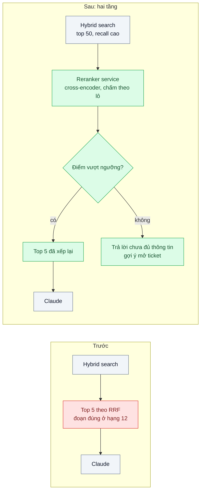
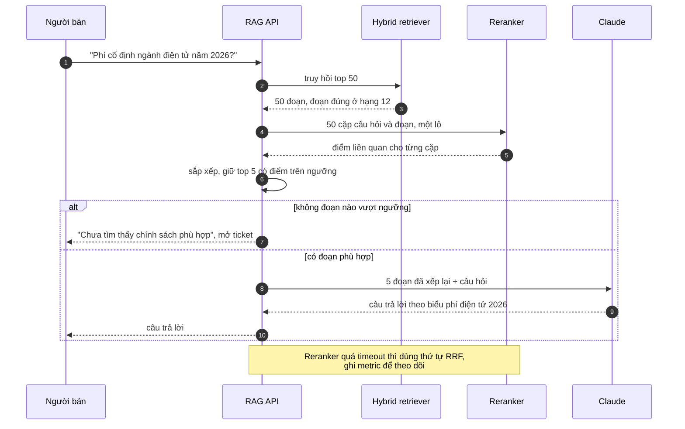

# Reranking (cross-encoder) — Tài liệu đúng có trong top 20 nhưng không lọt top 5 đưa vào prompt

| Scope | Mức độ | Trạng thái | Pattern gốc | Cập nhật |
|---|---|---|---|---|
| 10 · backend / AI RAG | 🟡 Trung bình | 📋 Kế hoạch | Cross-encoder reranking — Nogueira & Cho, "Passage Re-ranking with BERT" (2019) | 2026-10-06 |

> **Một câu tóm tắt:** Truy hồi hai tầng — tầng một lấy rộng 50 ứng viên bằng hybrid search (nhanh, recall cao), tầng hai dùng cross-encoder chấm điểm từng cặp (câu hỏi, đoạn) để chọn đúng 5 đoạn tốt nhất đưa vào prompt — để tài liệu đúng không bị bỏ lại ở hạng 12.

## 1. Bài toán thực tế (What)

**Bối cảnh** *(doanh nghiệp giả định, số liệu minh họa)*
Sàn TMĐT có chatbot hỗ trợ người bán với 15.000 bài trợ giúp và văn bản chính sách (phí, vận chuyển, đổi trả, xử phạt). Pipeline đã có hybrid search (bài 03) và đưa top 5 đoạn vào prompt. Bộ eval (bài 06) cho thấy tài liệu đúng nằm trong top 20 ở 92% câu hỏi nhưng chỉ nằm trong top 5 ở 61% câu hỏi.

**Triệu chứng người kinh doanh nhìn thấy**
- Người bán hỏi phí cố định ngành hàng điện tử, chatbot trả lời bằng biểu phí ngành thời trang hoặc biểu phí của năm trước.
- Đội vận hành thử đưa 20 đoạn vào prompt: chi phí mỗi câu hỏi tăng khoảng 4 lần, câu trả lời dài và lẫn thông tin không liên quan.
- Người bán mất niềm tin, mở ticket hỏi lại nhân viên — đúng việc chatbot được kỳ vọng giảm.

**Nguyên nhân kỹ thuật**
Embedding (bi-encoder) mã hóa câu hỏi và đoạn văn *độc lập* rồi so khoảng cách: nhanh, nhưng không "đọc" câu hỏi khi nhìn đoạn văn, nên không phân biệt được "phí ngành điện tử 2026" với "phí ngành thời trang 2025" vốn có cùng cấu trúc câu. BM25 và RRF cũng chỉ dựa trên khớp từ và thứ hạng. Thứ tự trong top 20 vì vậy thô.

**Ràng buộc**
- Độ trễ thêm cho bước xếp hạng lại dưới 300 ms ở p95.
- Không tăng số đoạn đưa vào prompt (giữ 5) để không tăng chi phí sinh.
- Dữ liệu chính sách không được gửi ra dịch vụ bên thứ ba ngoài nhà cung cấp LLM đã duyệt, trừ khi pháp chế đồng ý.

## 2. Vì sao dùng pattern này (Why)

**Nguyên nhân gốc mà pattern nhắm vào:** bộ truy hồi tầng một đổi độ chính xác lấy tốc độ, nên thứ tự các ứng viên đầu bảng không đáng tin.

**Pattern giải quyết thế nào:** cross-encoder nhận *cặp* (câu hỏi, đoạn) làm một đầu vào và cho ra một điểm liên quan; vì mô hình nhìn cả hai cùng lúc, nó nắm được quan hệ chi tiết (đúng ngành, đúng năm, đúng điều kiện). Cái giá là phải chạy mô hình cho từng cặp, không tính trước được, nên chỉ áp dụng cho tập nhỏ. Thiết kế hai tầng: hybrid lấy 50 ứng viên → cross-encoder chấm 50 cặp theo lô → sắp xếp → giữ top 5 có điểm trên ngưỡng. Nếu không đoạn nào vượt ngưỡng, trả lời "chưa đủ thông tin" thay vì để model đoán.

**Lựa chọn khác đã cân nhắc**

| Lựa chọn | Giải quyết được gì | Vì sao không chọn (ở bài này) |
|---|---|---|
| Giữ nguyên + tối ưu nhỏ: đưa top 20 vào prompt | Tài liệu đúng thường có mặt | Chi phí sinh tăng nhiều lần; đoạn nhiễu làm câu trả lời lẫn thông tin sai |
| Fine-tune model embedding trên dữ liệu chính sách | Tầng một chính xác hơn | Cần dữ liệu cặp có nhãn; phải re-embed toàn bộ kho (scope 12 bài 05) |
| LLM làm reranker (`claude-haiku-4-5` chấm điểm danh sách bằng structured outputs) | Không phải host mô hình; hiểu ngữ cảnh tốt | Độ trễ và chi phí theo token cao hơn cross-encoder cho 50 cặp mỗi câu; giữ làm phương án so sánh |
| Rerank API được quản lý (ví dụ Cohere Rerank) | Không phải vận hành mô hình | Gửi dữ liệu ra bên thứ ba cần pháp chế duyệt |
| Cross-encoder mở tự host *(chọn)* | Chính xác ở đầu bảng, dữ liệu không ra ngoài | Phải vận hành một service suy luận; cần đo độ trễ trên CPU hoặc GPU |

## 3. Thiết kế hệ thống (How)

### 3.1 Kiến trúc trước và sau



### 3.2 Luồng chính



### 3.3 Thành phần và trách nhiệm

| Thành phần | Trách nhiệm | Quyết định thiết kế đáng chú ý |
|---|---|---|
| Hybrid retriever (bài 03) | Lấy 50 ứng viên | Tầng một tối ưu *recall@50*, không phải precision |
| Reranker service | Chạy cross-encoder trên các cặp theo lô, trả điểm | Self-host qua Text Embeddings Inference (hỗ trợ mô hình reranker, cần xác minh mô hình cụ thể) hoặc service Python dùng sentence-transformers |
| Lựa chọn mô hình | Cross-encoder đa ngôn ngữ đạt eval tiếng Việt | Chọn khi thực hành bằng bộ eval, không chọn theo bảng xếp hạng chung |
| Ngưỡng điểm | Loại đoạn không liên quan | Hiệu chỉnh trên bộ eval: chọn ngưỡng giữ recall và tăng tỷ lệ từ chối đúng |
| Fallback | Timeout hoặc lỗi reranker → dùng thứ tự RRF | Không để bước tối ưu làm hỏng cả câu trả lời |

### 3.4 Điểm dễ sai khi triển khai
- **Tầng một quá hẹp**: rerank top 10 không cứu được tài liệu ở hạng 25. Đo recall@N của tầng một để chọn N (thường 30–100), cân với độ trễ rerank.
- **Cắt đoạn quá dài**: cross-encoder có giới hạn độ dài đầu vào; đoạn dài bị cắt mất phần quan trọng. Giữ chunk vừa giới hạn (bài 02) hoặc chấm theo đoạn con rồi lấy điểm cao nhất.
- **So điểm giữa các mô hình hoặc giữa các câu hỏi**: điểm cross-encoder chỉ có nghĩa tương đối; ngưỡng phải hiệu chỉnh lại khi đổi mô hình.
- **Gọi từng cặp một**: 50 lời gọi tuần tự làm độ trễ bùng nổ. Gửi theo lô và đo p95 thực tế.
- **Đánh giá chỉ bằng câu trả lời cuối**: không biết cải thiện đến từ rerank hay từ prompt. Đo thêm hit rate@5 và precision@5 của riêng tầng truy hồi.

## 4. Tech stack và tác động (Impact techstack)

| Lớp | Công nghệ chọn | Vì sao chọn | Thay thế tương đương |
|---|---|---|---|
| Ngôn ngữ / runtime | TypeScript strict, Node 20+ cho API | Trùng stack | — |
| Reranker | Cross-encoder mở, phục vụ qua Hugging Face Text Embeddings Inference | Dữ liệu không ra ngoài; API HTTP đơn giản gọi từ Node | Service Python với sentence-transformers `CrossEncoder`; Cohere Rerank khi pháp chế cho phép |
| Phương án so sánh | `claude-haiku-4-5` chấm điểm danh sách với structured outputs (`output_config.format`) | Đo xem LLM rerank có đáng chi phí không | `claude-sonnet-5-5` |
| Tầng một | Elasticsearch BM25 + PostgreSQL 16 / pgvector, RRF (bài 03) | Giữ nguyên | Qdrant |
| LLM sinh | `@anthropic-ai/sdk`, `claude-opus-5-5` | Model mặc định | — |
| Hạ tầng / test | Docker Compose (thêm container reranker), Vitest | Một lệnh dựng đủ | — |

**Thay đổi so với hệ thống hiện tại:** thêm service reranker (CPU trước, GPU nếu p95 không đạt), tăng top-k tầng một lên 50, thêm ngưỡng và nhánh "chưa đủ thông tin". Đội vận hành theo dõi độ trễ và tỷ lệ fallback của reranker.

## 5. Kết quả đầu ra và cách đo (Output impact)

| Chỉ số | Trước (minh họa) | Mục tiêu khi thực hành | Cách đo |
|---|---|---|---|
| Hit rate@5 | 61% | ≥ 85% | Bộ eval 200 câu gắn `chunk_id` đúng; script so với top 5 sau rerank |
| nDCG@5 | không đo | tăng so với RRF-only | Script tính theo định nghĩa trong IIR chương 8, nhãn mức liên quan 0–2 |
| Context precision | không đo | ≥ 0,8 | RAGAS context precision trên cùng bộ eval |
| p95 độ trễ bước rerank (50 cặp) | không có | dưới 300 ms | Script 500 truy vấn, đo riêng lời gọi reranker |
| Tỷ lệ trả lời đúng end-to-end | đo ở bài 06 | tăng, với số đoạn trong prompt giữ nguyên 5 | Bộ eval RAG của bài 06 |
| Chi phí và độ trễ của phương án LLM rerank | không có | có số để so sánh | Cùng bộ eval, `usage` × đơn giá và p95 |

> Số "trước" là minh họa để hình dung bài toán. Số "mục tiêu" chỉ được coi là đạt khi có số đo thật
> ở mục 8 kèm môi trường đo.

**Tác động nghiệp vụ mong đợi:** người bán nhận đúng chính sách của ngành và năm của mình, giảm ticket hỏi lại mà không tăng chi phí sinh câu trả lời.

## 6. Đánh đổi và khi KHÔNG nên dùng

**Đánh đổi**
- Thêm một service suy luận phải vận hành, có thể cần GPU khi lưu lượng lớn.
- Thêm độ trễ trên đường đi chính; cần fallback.
- Ngưỡng điểm phải hiệu chỉnh lại khi đổi mô hình hoặc khi dữ liệu thay đổi nhiều.

**Không nên dùng khi**
- Hit rate@5 đã gần bằng hit rate@50: tầng một đã xếp tốt, rerank chỉ thêm chi phí.
- Truy hồi tầng một kém ở recall (đoạn đúng không có trong top 50): sửa chunking hoặc hybrid trước, rerank không cứu được.

**Liên quan**
- [Hybrid Search](../03-hybrid-search-rrf-ma-san-pham-tim-vector-khong-ra/) — tầng một.
- [RAG Evaluation](../06-rag-evaluation-ragas-khong-biet-tra-loi-dung-bao-nhieu-phan-tram/) — hit rate, nDCG, context precision.
- [Query Transformation](../05-query-transformation-cau-hoi-mo-ho-hyde-multi-query/) — bước tiếp theo khi câu hỏi mơ hồ.
- [Retrieval Quality Monitoring (scope 24)](../../24-backend-ai-monitoring/05-rag-retrieval-metrics-hit-rate-mrr-tai-lieu-moi-khong-duoc-tim-thay/) — theo dõi chất lượng xếp hạng trong production.

## 7. Cơ sở tham khảo

- Nogueira & Cho, "Passage Re-ranking with BERT" (2019) — dùng mô hình đọc đồng thời câu hỏi và đoạn văn để xếp hạng lại ứng viên của BM25; nền của kiến trúc hai tầng.
- sentence-transformers docs — https://www.sbert.net/ — phân biệt bi-encoder và cross-encoder, cách dùng cross-encoder để rerank.
- Cohere Rerank docs — https://docs.cohere.com/docs/rerank-overview — phương án rerank được quản lý dùng để so sánh.
- Hugging Face Text Embeddings Inference — https://huggingface.co/docs/text-embeddings-inference — phục vụ mô hình embedding và reranker qua HTTP (cần xác minh danh sách mô hình reranker được hỗ trợ).
- Manning, Raghavan, Schütze, *Introduction to Information Retrieval* (2008), chương 8 — precision@k và nDCG dùng ở mục 5.

## 8. Kế hoạch thực hành

- [ ] Bước 1: dùng lại kho và hybrid retriever của bài 03; bổ sung bộ eval 200 câu có nhãn mức liên quan; thêm container reranker vào Docker Compose.
- [ ] Bước 2: đo "trước": hit rate@5, @20, @50, nDCG@5 với thứ tự RRF.
- [ ] Bước 3: áp dụng pattern: client reranker gọi theo lô, sắp xếp, ngưỡng, fallback khi timeout; cài phương án LLM rerank để so sánh.
- [ ] Bước 4: đo "sau" với N = 20, 50, 100 ứng viên; ghi hit rate, nDCG, p95, chi phí vào mục 5 kèm cấu hình máy.
- [ ] Bước 5: test Vitest: (a) đoạn có điểm cao nhất lên đầu, (b) không đoạn nào vượt ngưỡng thì đi nhánh "chưa đủ thông tin", (c) reranker timeout thì dùng thứ tự RRF, (d) 50 cặp được gửi trong một lô.

**Cấu trúc code dự kiến**
```text
src/
  retrieval/
    hybrid-retriever.ts       # từ bài 03
    cross-encoder-client.ts   # gọi TEI theo lô
    llm-reranker.ts           # phương án so sánh, structured outputs
    two-stage-retriever.ts    # ngưỡng + fallback
test/
  two-stage-retriever.test.ts
eval/run-rerank-eval.ts
docker-compose.yml            # postgres + pgvector, elasticsearch, reranker
```

**Cách chạy** *(điền khi bắt đầu code)*
```bash
docker compose up -d
pnpm install && pnpm test
```
