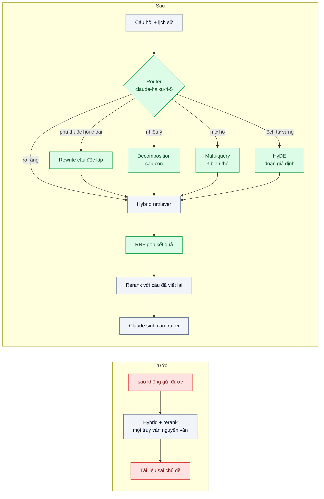
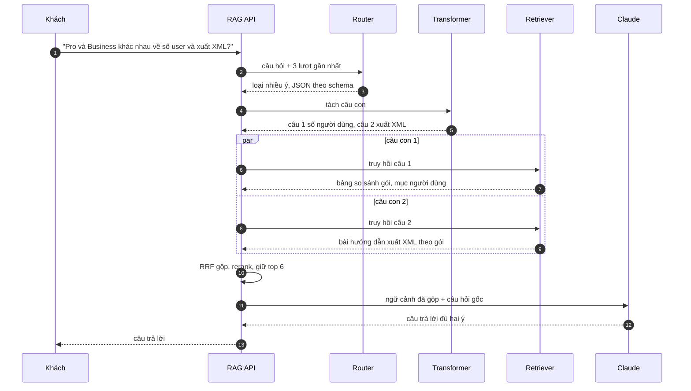

# Query Transformation (HyDE, multi-query, decomposition) — Câu hỏi của khách mơ hồ, một lần tìm không đủ

| Scope | Mức độ | Trạng thái | Pattern gốc | Cập nhật |
|---|---|---|---|---|
| 10 · backend / AI RAG | 🔴 Nâng cao | 📋 Kế hoạch | HyDE — Gao et al., "Precise Zero-Shot Dense Retrieval without Relevance Labels" (2022); Query rewriting — Gao et al., RAG Survey (2023) | 2026-10-06 |

> **Một câu tóm tắt:** Trước khi truy hồi, dùng một model nhỏ phân loại câu hỏi rồi biến đổi nó cho đúng loại — viết lại thành câu độc lập, sinh nhiều cách diễn đạt, sinh "tài liệu giả định" (HyDE) hoặc tách thành câu con — để câu hỏi ngắn, mơ hồ hay nhiều ý vẫn tìm được đúng tài liệu.

## 1. Bài toán thực tế (What)

**Bối cảnh** *(doanh nghiệp giả định, số liệu minh họa)*
Nền tảng SaaS kế toán cho 20.000 doanh nghiệp nhỏ có chatbot hỗ trợ trên trung tâm trợ giúp 8.000 bài. Pipeline đã có chunking theo cấu trúc, hybrid search và rerank (bài 02–04). Câu hỏi được dùng nguyên văn làm truy vấn.

**Triệu chứng người kinh doanh nhìn thấy**
- Khách gõ "sao không gửi được" sau ba lượt trao đổi về hóa đơn điện tử; chatbot tìm "gửi" chung chung và trả lời về gửi email báo cáo.
- Khách hỏi "gói Pro và Business khác nhau về số người dùng và xuất XML thế nào" chỉ nhận được một nửa câu trả lời (về số người dùng).
- Khách dùng từ của mình ("hóa đơn bị treo") trong khi tài liệu viết "hóa đơn ở trạng thái chờ ký"; 25% hội thoại kết thúc bằng "không tìm thấy", khách chuyển sang tổng đài.

**Nguyên nhân kỹ thuật**
Một câu hỏi được biến thành đúng một truy vấn, trong khi: (1) câu phụ thuộc lịch sử hội thoại thiếu chủ ngữ; (2) câu nhiều ý cần nhiều nhóm tài liệu khác nhau; (3) từ vựng của khách lệch từ vựng tài liệu, và câu hỏi ngắn có embedding nằm xa embedding của đoạn văn trả lời dài.

**Ràng buộc**
- Độ trễ thêm không quá khoảng 1,5 giây ở p95; câu hỏi rõ ràng không được chậm hơn.
- Chi phí thêm mỗi câu hỏi phải nhỏ so với lời gọi sinh câu trả lời.
- Biến đổi không được đổi ý định của khách; phải log lại truy vấn đã biến đổi để điều tra.

## 2. Vì sao dùng pattern này (Why)

**Nguyên nhân gốc mà pattern nhắm vào:** khoảng cách giữa cách khách *hỏi* và cách tài liệu *viết*, cộng với việc một câu hỏi có thể cần nhiều lần tìm.

**Pattern giải quyết thế nào:** thêm một bước biến đổi truy vấn có router:
1. **Router** (`claude-haiku-4-5`, đầu ra JSON qua structured outputs) phân loại: rõ ràng / phụ thuộc hội thoại / nhiều ý / mơ hồ về từ vựng.
2. **Rewrite thành câu độc lập** cho câu phụ thuộc hội thoại: "sao không gửi được" → "Vì sao hóa đơn điện tử không gửi được cho khách hàng?".
3. **Decomposition** cho câu nhiều ý: tách thành câu con, truy hồi từng câu, gộp ngữ cảnh.
4. **Multi-query** cho câu mơ hồ: sinh 3 cách diễn đạt, truy hồi song song, hợp nhất bằng RRF (bài 03).
5. **HyDE** khi từ vựng lệch: model sinh một đoạn "trả lời giả định" theo văn phong tài liệu, embed đoạn đó để tìm — khớp trong "không gian tài liệu" thay vì không gian câu hỏi. Đoạn giả định *chỉ dùng để tìm*, không bao giờ đưa cho khách.
Câu rõ ràng đi thẳng, không tốn thêm lời gọi. Kết quả sau đó vẫn qua rerank với *câu hỏi gốc* đã viết lại.

**Lựa chọn khác đã cân nhắc**

| Lựa chọn | Giải quyết được gì | Vì sao không chọn (ở bài này) |
|---|---|---|
| Giữ nguyên + tối ưu nhỏ: hỏi lại khách "ý bạn là gì?" khi không tìm thấy | Không tốn thêm lời gọi model | Trải nghiệm kém; khách thường không diễn đạt lại tốt hơn |
| Luôn áp dụng tất cả biến đổi | Tối đa recall | Tốn 3–5 lời gọi và vài giây cho cả câu đã rõ ràng |
| Agentic RAG (bài 09) | Tự quyết nhiều vòng tìm | Đắt và khó kiểm soát hơn; dành cho câu cần kết quả bước trước để quyết bước sau |
| Query transformation có router *(chọn)* | Biến đổi đúng loại, câu rõ ràng không tốn thêm | Thêm một lời gọi model nhỏ; biến đổi sai có thể làm lệch ý |

## 3. Thiết kế hệ thống (How)

### 3.1 Kiến trúc trước và sau



### 3.2 Luồng chính



### 3.3 Thành phần và trách nhiệm

| Thành phần | Trách nhiệm | Quyết định thiết kế đáng chú ý |
|---|---|---|
| Router | Phân loại câu hỏi, trả JSON hợp lệ | Structured outputs (`output_config.format`) để không phải parse văn bản tự do; ít ví dụ minh họa trong prompt |
| Rewriter | Viết lại câu độc lập từ lịch sử | Giữ nguyên thực thể (mã, tên gói); không thêm giả định mới |
| Decomposer | Tách câu nhiều ý, tối đa 4 câu con | Câu con phải truy hồi độc lập được |
| Multi-query | Sinh 3 cách diễn đạt | Hợp nhất bằng RRF; loại biến thể trùng |
| HyDE | Sinh đoạn trả lời giả định theo văn phong tài liệu | Chỉ embed để tìm; không log ra giao diện khách |

### 3.4 Điểm dễ sai khi triển khai
- **HyDE bịa sai hướng**: đoạn giả định nói về tính năng không tồn tại, kéo truy hồi sang tài liệu sai. Luôn hợp nhất với truy hồi bằng câu gốc, không thay thế hoàn toàn.
- **Biến đổi mọi câu**: tốn chi phí và độ trễ cho 60% câu đã rõ ràng. Router phải có nhánh "đi thẳng" và đo tỷ lệ đi qua từng nhánh.
- **Rerank bằng truy vấn đã biến đổi**: biến thể có thể lệch ý; rerank và sinh câu trả lời bằng câu hỏi gốc (đã viết lại thành câu độc lập).
- **Mất thực thể khi viết lại**: "SKU-4821" bị đổi thành "sản phẩm này". Kiểm tra thực thể trong câu gốc vẫn có trong câu viết lại.
- **Không đo router**: router phân loại sai thì cả nhánh sau vô ích. Có bộ 100 câu gắn nhãn loại để đo riêng.

## 4. Tech stack và tác động (Impact techstack)

| Lớp | Công nghệ chọn | Vì sao chọn | Thay thế tương đương |
|---|---|---|---|
| Ngôn ngữ / runtime | TypeScript strict, Node 20+ | Trùng stack | — |
| Router và biến đổi | `@anthropic-ai/sdk`, `claude-haiku-4-5`, structured outputs (`output_config.format`) | Tác vụ ngắn, cần nhanh và rẻ; JSON đúng schema (kiểm tra model hỗ trợ trên trang docs) | `claude-sonnet-5-5` nếu eval cho thấy Haiku phân loại kém |
| Truy hồi | Elasticsearch BM25 + PostgreSQL 16 / pgvector, RRF, reranker (bài 03–04) | Giữ nguyên | Qdrant |
| Embedding | Model embedding (ví dụ Voyage AI, hoặc mô hình mở qua Text Embeddings Inference) | Dùng chung cho truy vấn, biến thể và đoạn HyDE; chọn cụ thể khi thực hành | — |
| Sinh câu trả lời | `claude-opus-5-5` | Model mặc định | — |
| Test | Vitest với client LLM giả lập cho router | Test logic định tuyến không tốn tiền | — |

**Thay đổi so với hệ thống hiện tại:** thêm bước router và bốn bộ biến đổi trước retriever, bảng `query_transformations` ghi câu gốc, loại và truy vấn sinh ra (dữ liệu cho error analysis ở bài 06). Đội sản phẩm cần xem log định kỳ để phát hiện loại câu hỏi mới.

## 5. Kết quả đầu ra và cách đo (Output impact)

| Chỉ số | Trước (minh họa) | Mục tiêu khi thực hành | Cách đo |
|---|---|---|---|
| Tỷ lệ hội thoại kết thúc bằng "không tìm thấy" | 25% | dưới 10% | Bộ 300 hội thoại mẫu (có lịch sử) chạy lại offline; đếm nhánh "không tìm thấy" |
| Hit rate@5 theo nhóm (phụ thuộc hội thoại, nhiều ý, mơ hồ) | 40% ở các nhóm khó | ≥ 75% mỗi nhóm | Bộ eval có nhãn tài liệu đúng cho từng câu con |
| Hit rate@5 nhóm câu rõ ràng | baseline | không thấp hơn baseline | Cùng bộ eval |
| Độ chính xác router | không có | ≥ 90% | Bộ 100 câu gắn nhãn loại, so với đầu ra router |
| p95 độ trễ thêm | 0 | dưới 1,5 giây, câu rõ ràng không chậm hơn | Script đo từng bước theo span |
| Chi phí thêm mỗi câu hỏi | 0 | nhỏ hơn 20% chi phí sinh câu trả lời | `usage` của các lời gọi biến đổi × đơn giá |

> Số "trước" là minh họa để hình dung bài toán. Số "mục tiêu" chỉ được coi là đạt khi có số đo thật
> ở mục 8 kèm môi trường đo.

**Tác động nghiệp vụ mong đợi:** khách hỏi theo cách tự nhiên của mình vẫn nhận câu trả lời đầy đủ, giảm cuộc gọi tổng đài do chatbot "không tìm thấy".

## 6. Đánh đổi và khi KHÔNG nên dùng

**Đánh đổi**
- Thêm lời gọi model trên đường đi chính: độ trễ và chi phí tăng ở các nhánh biến đổi.
- Biến đổi có thể làm lệch ý; nhiều nhánh làm việc gỡ lỗi khó hơn, cần log và eval riêng cho từng bộ biến đổi.

**Không nên dùng khi**
- Câu hỏi đa phần ngắn, rõ ràng (tra mã, tra giờ mở cửa): router chỉ thêm độ trễ.
- Truy hồi kém do chunking hoặc thiếu tài liệu: biến đổi câu hỏi không bù được tài liệu không tồn tại.

**Liên quan**
- [Hybrid Search](../03-hybrid-search-rrf-ma-san-pham-tim-vector-khong-ra/) và [Reranking](../04-reranking-top-20-dung-nhung-top-5-sai/) — hai bậc trước.
- [Agentic / Self-RAG](../09-agentic-rag-cau-hoi-can-tra-nhieu-vong/) — khi cần nhiều vòng phụ thuộc nhau.
- [Prompt Chaining & Routing (scope 11)](../../11-backend-ai-agent/03-routing-prompt-chaining-mot-prompt-khong-lo-duoc-5-loai-yeu-cau/) — mẫu routing tổng quát.

## 7. Cơ sở tham khảo

- Gao et al., "Precise Zero-Shot Dense Retrieval without Relevance Labels" (HyDE, 2022) — sinh tài liệu giả định rồi embed tài liệu đó để truy hồi.
- Gao et al., "Retrieval-Augmented Generation for Large Language Models: A Survey" (2023), arXiv 2312.10997 — phần tối ưu truy vấn: viết lại, mở rộng, tách câu hỏi.
- Anthropic, "Building effective agents" (2024) — https://www.anthropic.com/engineering/building-effective-agents — workflow routing: phân loại đầu vào rồi chuyển tới nhánh chuyên biệt.
- Anthropic docs, "Structured outputs" — https://platform.claude.com/docs/en/build-with-claude/structured-outputs — `output_config.format` để router trả JSON đúng schema.

## 8. Kế hoạch thực hành

- [ ] Bước 1: dùng lại pipeline bài 04 trên kho trợ giúp giả định; soạn 300 hội thoại mẫu có lịch sử, gắn nhãn loại câu hỏi và tài liệu đúng.
- [ ] Bước 2: đo "trước": tỷ lệ "không tìm thấy", hit rate@5 theo nhóm, p95.
- [ ] Bước 3: áp dụng pattern: router, rewriter, decomposer, multi-query, HyDE; log biến đổi.
- [ ] Bước 4: đo "sau" từng bộ biến đổi bật/tắt riêng (ablation) để biết bộ nào đáng giữ; ghi vào mục 5 kèm chi phí.
- [ ] Bước 5: test Vitest: (a) câu rõ ràng không gọi bộ biến đổi nào, (b) câu viết lại giữ nguyên mã và tên gói, (c) đoạn HyDE không xuất hiện trong câu trả lời gửi khách, (d) câu nhiều ý sinh không quá 4 câu con.

**Cấu trúc code dự kiến**
```text
src/
  query/
    query-router.ts           # claude-haiku-4-5 + output_config.format
    standalone-rewriter.ts
    query-decomposer.ts
    multi-query-generator.ts
    hyde-generator.ts
  retrieval/
    transformed-retriever.ts  # song song + RRF + rerank
test/
  query-router.test.ts
eval/run-transformation-eval.ts
docker-compose.yml
```

**Cách chạy** *(điền khi bắt đầu code)*
```bash
docker compose up -d
pnpm install && pnpm test
```
