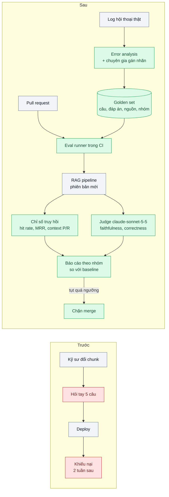
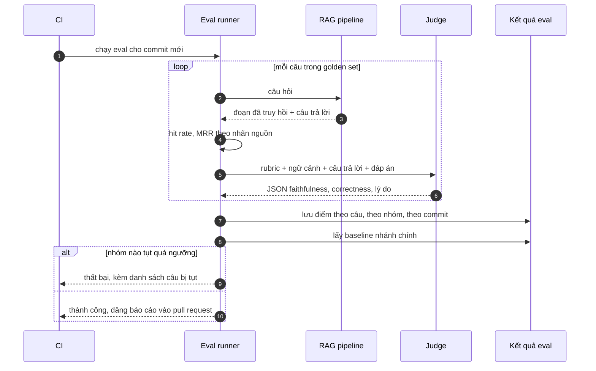

# RAG Evaluation (faithfulness, context precision/recall) — Không ai biết chatbot trả lời đúng bao nhiêu phần trăm

| Scope | Mức độ | Trạng thái | Pattern gốc | Cập nhật |
|---|---|---|---|---|
| 10 · backend / AI RAG | 🟡 Trung bình | 📋 Kế hoạch | RAGAS — Es et al. (2023); Evals — Hamel Husain (2024); IIR ch.8 (precision@k, MRR) | 2026-10-06 |

> **Một câu tóm tắt:** Dựng một bộ câu hỏi có đáp án và tài liệu nguồn, đo riêng chất lượng *truy hồi* (hit rate, context precision/recall) và chất lượng *sinh* (faithfulness, độ đúng) bằng judge đã hiệu chỉnh với người chấm, chạy tự động mỗi khi đổi pipeline — để "chatbot đúng bao nhiêu phần trăm" có câu trả lời bằng số.

## 1. Bài toán thực tế (What)

**Bối cảnh** *(doanh nghiệp giả định, số liệu minh họa)*
Công ty logistics có chatbot nội bộ cho 200 nhân viên chăm sóc khách hàng tra quy trình xử lý khiếu nại, bồi thường hàng hư hỏng, chính sách giao lại. Ba kỹ sư liên tục thử đổi kích thước chunk, model embedding, thêm reranker; mỗi lần "kiểm tra" bằng cách hỏi tay khoảng 5 câu quen thuộc.

**Triệu chứng người kinh doanh nhìn thấy**
- Ban giám đốc hỏi "chatbot đúng bao nhiêu phần trăm, có nên mở cho khách hàng không" — không ai trả lời được bằng số.
- Một lần đổi chunk làm hỏng toàn bộ nhóm câu về hàng dễ vỡ; hai tuần sau mới phát hiện qua khiếu nại khách hàng.
- Các buổi họp tranh luận "bản mới tốt hơn" dựa trên vài ví dụ chọn lọc; quyết định chậm và không ai chắc.

**Nguyên nhân kỹ thuật**
Không có tập kiểm thử đại diện, không có chỉ số tách được lỗi ở *truy hồi* (đoạn đúng không được tìm thấy) với lỗi ở *sinh* (có đoạn đúng nhưng model hiểu sai hoặc bịa thêm). Mọi thay đổi được đánh giá bằng cảm giác trên vài câu dễ.

**Ràng buộc**
- Chuyên gia nghiệp vụ chỉ dành được vài giờ mỗi tuần để gán nhãn.
- Chạy eval phải đủ nhanh để nằm trong CI của pull request (dưới khoảng 30 phút).
- Chi phí mỗi lần chạy eval phải biết trước.

## 2. Vì sao dùng pattern này (Why)

**Nguyên nhân gốc mà pattern nhắm vào:** không có thước đo lặp lại được, nên không biết thay đổi nào cải thiện, thay đổi nào làm hỏng, và hỏng ở tầng nào.

**Pattern giải quyết thế nào:**
1. **Golden set**: 150–200 câu lấy từ log thật và từ chuyên gia, mỗi câu có đáp án tham chiếu, danh sách tài liệu nguồn và nhãn nhóm (dễ, nhiều điều kiện, ngoài phạm vi phải từ chối). Bắt đầu từ *error analysis*: đọc 100 hội thoại thật, phân loại lỗi, rồi mới chọn chỉ số (theo Hamel Husain).
2. **Chỉ số truy hồi** (không cần LLM): hit rate@k, recall@k, MRR so với tài liệu nguồn đã gán nhãn; **context precision / context recall** theo định nghĩa RAGAS.
3. **Chỉ số sinh**: **faithfulness** (mọi khẳng định trong câu trả lời có được ngữ cảnh hỗ trợ không), **answer correctness** so với đáp án tham chiếu, và tỷ lệ từ chối đúng với câu ngoài phạm vi.
4. **LLM-as-judge có hiệu chỉnh**: judge `claude-sonnet-5-5` với rubric rõ ràng và đầu ra JSON (structured outputs); trước khi tin, so judge với 50 câu do người chấm, đo tỷ lệ đồng thuận; biết các thiên lệch đã được ghi nhận (vị trí, độ dài).
5. **Chạy trong CI**: mỗi pull request đổi prompt, chunking, retriever hoặc model đều chạy eval, so với baseline của nhánh chính theo *từng nhóm*, chặn merge nếu tụt quá ngưỡng.

**Lựa chọn khác đã cân nhắc**

| Lựa chọn | Giải quyết được gì | Vì sao không chọn (ở bài này) |
|---|---|---|
| Giữ nguyên + tối ưu nhỏ: viết checklist 10 câu hỏi tay trước mỗi lần deploy | Nhanh, không tốn tiền | Không đại diện, không lặp lại được, không tách truy hồi với sinh |
| Chỉ dùng phản hồi người dùng (thích / không thích) | Phản ánh trải nghiệm thật | Đến sau khi đã deploy; thiên lệch; không biết lỗi ở tầng nào |
| Người chấm toàn bộ mỗi lần thay đổi | Chính xác nhất | Chậm, đắt, không chạy được trong CI |
| Chỉ số truy hồi + chỉ số sinh + judge đã hiệu chỉnh *(chọn)* | Có số theo từng tầng, chạy tự động | Phải đầu tư dựng golden set; judge có sai số cần theo dõi |

## 3. Thiết kế hệ thống (How)

### 3.1 Kiến trúc trước và sau



### 3.2 Luồng chính



### 3.3 Thành phần và trách nhiệm

| Thành phần | Trách nhiệm | Quyết định thiết kế đáng chú ý |
|---|---|---|
| Golden set | Câu hỏi, đáp án tham chiếu, `source_ids`, nhóm, độ khó | File JSONL có version trong Git; thêm câu từ lỗi thật mỗi tuần |
| Retrieval metrics | hit rate@k, recall@k, MRR, context precision/recall | Tính bằng code thuần khi có nhãn nguồn, không tốn lời gọi LLM |
| Judge | Chấm faithfulness và correctness theo rubric, trả JSON | `claude-sonnet-5-5` + structured outputs; prompt judge có version như code |
| Hiệu chỉnh judge | So với 50 câu người chấm, đo tỷ lệ đồng thuận | Chạy lại khi đổi model hoặc rubric của judge |
| Eval runner | Chạy song song có giới hạn, lưu kết quả theo commit | Cache câu trả lời theo hash cấu hình để chạy lại rẻ |

### 3.4 Điểm dễ sai khi triển khai
- **Golden set toàn câu dễ**: điểm cao giả tạo. Lấy câu từ log thật, có tỷ lệ câu khó và câu ngoài phạm vi rõ ràng.
- **Tin judge mà không kiểm**: judge có thể ưu ái câu trả lời dài hoặc câu trả lời do chính model đó sinh ra. Hiệu chỉnh với người chấm và giữ rubric cụ thể từng tiêu chí.
- **Chỉ nhìn trung bình**: tăng 2 điểm chung có thể che một nhóm tụt 20 điểm. Báo cáo và đặt ngưỡng theo nhóm.
- **Rò rỉ golden set vào prompt**: dùng câu eval làm ví dụ few-shot làm điểm vô nghĩa. Tách tập dùng để phát triển và tập kiểm tra.
- **Eval quá đắt để chạy thường xuyên**: chọn tập con nhanh cho mỗi pull request, chạy tập đầy đủ hằng đêm; với lượt chạy không cần kết quả ngay có thể dùng Message Batches.

## 4. Tech stack và tác động (Impact techstack)

| Lớp | Công nghệ chọn | Vì sao chọn | Thay thế tương đương |
|---|---|---|---|
| Ngôn ngữ / runtime | TypeScript strict, Node 20+ | Chạy chung repo với pipeline | — |
| Chỉ số truy hồi | Tự cài bằng TypeScript theo IIR chương 8 | Ngắn, dễ kiểm tra | — |
| Chỉ số RAG | Định nghĩa RAGAS (faithfulness, context precision/recall), tự cài hoặc chạy thư viện RAGAS Python trong container (cần xác minh API phiên bản hiện tại) | Chuẩn chung, so sánh được | DeepEval, Arize Phoenix evals |
| Judge | `@anthropic-ai/sdk`, `claude-sonnet-5-5`, structured outputs (`output_config.format`) | Rẻ hơn model chính, đủ khả năng chấm; JSON đúng schema | `claude-opus-5-5` cho nhóm câu khó |
| Lưu kết quả | PostgreSQL 16, bảng `eval_runs` / `eval_results` | Truy vấn xu hướng theo commit | Langfuse datasets |
| CI và test | GitHub Actions (hoặc CI hiện có) chạy `pnpm eval`; Vitest cho hàm chỉ số | Chặn merge khi tụt; chỉ số sai thì mọi kết luận sai | — |

**Thay đổi so với hệ thống hiện tại:** thêm golden set có version, eval runner, bảng kết quả và một bước CI. Chuyên gia nghiệp vụ tham gia gán nhãn định kỳ; kỹ sư học đọc báo cáo theo nhóm thay vì một con số.

## 5. Kết quả đầu ra và cách đo (Output impact)

| Chỉ số | Trước (minh họa) | Mục tiêu khi thực hành | Cách đo |
|---|---|---|---|
| Thời gian từ thay đổi tới biết chất lượng | khoảng 2 tuần (qua khiếu nại) | dưới 30 phút (trong CI) | Thời gian chạy job eval trên tập con 80 câu |
| Độ đồng thuận judge với người chấm | không đo | ≥ 85% trên từng tiêu chí | 50 câu do hai chuyên gia chấm độc lập, so với judge |
| Độ phủ golden set | 5 câu hỏi tay | ≥ 150 câu, đủ các nhóm đã tìm thấy khi error analysis | Đếm theo nhãn nhóm trong JSONL |
| Số regression bị chặn trước deploy | 0 | ghi nhận được | Đếm pull request bị CI chặn kèm nhóm bị tụt |
| Chi phí mỗi lần chạy eval | không biết | biết trước, dưới ngân sách đặt ra | Tổng `usage` của pipeline và judge × đơn giá |

> Số "trước" là minh họa để hình dung bài toán. Số "mục tiêu" chỉ được coi là đạt khi có số đo thật
> ở mục 8 kèm môi trường đo.

**Tác động nghiệp vụ mong đợi:** ban giám đốc có con số theo từng nhóm câu hỏi để quyết định mở chatbot cho khách; lỗi do thay đổi kỹ thuật bị chặn trước khi tới khách hàng.

## 6. Đánh đổi và khi KHÔNG nên dùng

**Đánh đổi**
- Tốn thời gian chuyên gia để dựng và duy trì golden set; bộ eval cũ dần nếu không bổ sung.
- Judge có sai số và tốn chi phí mỗi lần chạy.
- Ngưỡng chặn quá chặt làm chậm phát triển; quá lỏng thì vô dụng.

**Không nên dùng khi**
- Đang ở giai đoạn thử nghiệm ý tưởng vài ngày: đọc tay 30 hội thoại có giá trị hơn dựng hạ tầng eval.
- Đầu ra có đáp án xác định kiểm được bằng code (trích xuất trường, phân loại): dùng so khớp chính xác, không cần judge.

**Liên quan**
- [Naive RAG](../01-naive-rag-chatbot-noi-quy-cong-ty-tra-loi-bua/) — baseline đầu tiên cần đo.
- [Hybrid Search](../03-hybrid-search-rrf-ma-san-pham-tim-vector-khong-ra/) và [Reranking](../04-reranking-top-20-dung-nhung-top-5-sai/) — các tối ưu dùng bộ eval này để chứng minh.
- [Eval Pipeline & LLM-as-Judge in CI (scope 20)](../../20-backend-ai-framework-system-design/06-llm-as-judge-eval-pipeline-trong-ci-sua-prompt-khong-biet-tot-hon-hay-te-hon/) — hạ tầng eval chung.
- [Golden Dataset from Production Traces (scope 24)](../../24-backend-ai-monitoring/04-golden-dataset-tu-production-regression-test-prompt/) và [Retrieval Quality Monitoring (scope 24)](../../24-backend-ai-monitoring/05-rag-retrieval-metrics-hit-rate-mrr-tai-lieu-moi-khong-duoc-tim-thay/) — nuôi golden set và theo dõi trong production.

## 7. Cơ sở tham khảo

- Es et al., "RAGAS: Automated Evaluation of Retrieval Augmented Generation" (2023) — định nghĩa faithfulness, answer relevance, context precision/recall.
- Hamel Husain, "Your AI Product Needs Evals" (2024) — https://hamel.dev/blog/posts/evals/ — bắt đầu từ error analysis, các tầng eval, đưa eval vào vòng phát triển.
- Manning, Raghavan, Schütze, *Introduction to Information Retrieval* (2008), chương 8 — precision@k, recall, MRR cho chỉ số truy hồi.
- Zheng et al., "Judging LLM-as-a-Judge with MT-Bench and Chatbot Arena", NeurIPS 2023 — thiên lệch của judge (vị trí, độ dài, tự ưu ái) và cách giảm.
- Anthropic docs, "Structured outputs" — https://platform.claude.com/docs/en/build-with-claude/structured-outputs — đầu ra JSON đúng schema cho judge.

## 8. Kế hoạch thực hành

- [ ] Bước 1: đọc và phân loại 100 hội thoại mẫu (giả định) để có danh sách lỗi; soạn golden set 150 câu có đáp án, nguồn, nhóm; tách tập phát triển và tập kiểm tra.
- [ ] Bước 2: đo "trước": chạy pipeline bài 01 qua eval runner, ghi điểm theo nhóm làm baseline.
- [ ] Bước 3: áp dụng pattern: hàm chỉ số truy hồi, judge với rubric và structured outputs, hiệu chỉnh judge với 50 câu người chấm, job CI.
- [ ] Bước 4: cố ý đưa vào một thay đổi xấu (chunk 100 token) để kiểm tra CI chặn đúng nhóm bị tụt; ghi thời gian chạy và chi phí vào mục 5.
- [ ] Bước 5: test Vitest: (a) hit rate và MRR đúng trên ví dụ tính tay, (b) judge trả JSON hợp lệ theo schema, (c) nhóm tụt quá ngưỡng làm runner trả mã lỗi, (d) chạy lại cùng cấu hình dùng cache câu trả lời.

**Cấu trúc code dự kiến**
```text
eval/
  golden-set.jsonl
  run-eval.ts                 # điểm vào cho CI
src/
  evaluation/
    retrieval-metrics.ts      # hit rate, recall, MRR, context P/R
    rag-judge.ts              # claude-sonnet-5-5 + output_config.format
    judge-calibration.ts
    eval-report.ts            # so baseline theo nhóm
test/
  retrieval-metrics.test.ts
docker-compose.yml            # postgres 16 lưu kết quả
```

**Cách chạy** *(điền khi bắt đầu code)*
```bash
docker compose up -d
pnpm install && pnpm test
```
