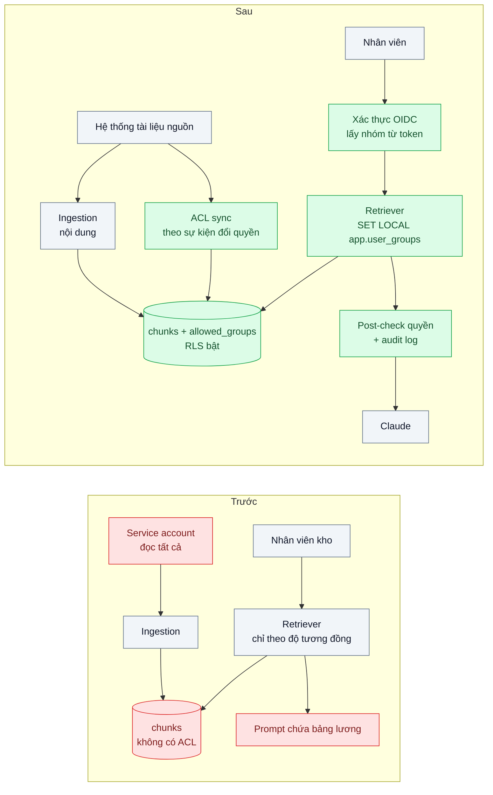
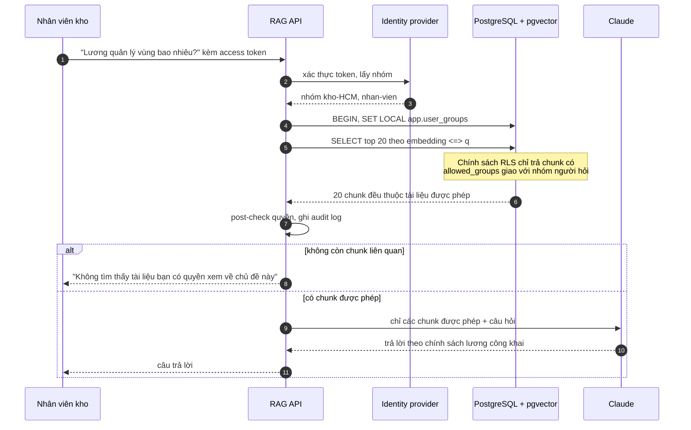

# Document-level Access Control in RAG — Nhân viên hỏi chatbot và nhận được lương của giám đốc

| Scope | Mức độ | Trạng thái | Pattern gốc | Cập nhật |
|---|---|---|---|---|
| 10 · backend / AI RAG | 🟡 Trung bình | 📋 Kế hoạch | OWASP Top 10 for LLM Applications (2025) — LLM02 Sensitive Information Disclosure; PostgreSQL Row Security Policies + pgvector filter | 2026-10-06 |

> **Một câu tóm tắt:** Mang quyền truy cập của tài liệu gốc theo từng chunk vào kho vector và lọc theo danh tính người hỏi *ngay trong truy vấn ở tầng DB* (Row-Level Security), để đoạn văn người hỏi không có quyền xem không bao giờ lọt vào prompt — thay vì dặn model "đừng tiết lộ".

## 1. Bài toán thực tế (What)

**Bối cảnh** *(doanh nghiệp giả định, số liệu minh họa)*
Tập đoàn bán lẻ 3.000 nhân viên triển khai chatbot nội bộ trả lời từ toàn bộ thư mục chia sẻ của nhân sự, tài chính, pháp chế và vận hành. Job nạp dữ liệu đọc thư mục bằng một service account có quyền đọc tất cả, rồi đưa mọi chunk vào chung một bảng pgvector.

**Triệu chứng người kinh doanh nhìn thấy**
- Nhân viên kho hỏi "mức lương quản lý vùng là bao nhiêu", chatbot trích nguyên bảng lương ban giám đốc.
- Biên bản họp về tái cấu trúc phòng ban bị nhân viên đọc được qua chatbot trước ngày công bố.
- Pháp chế yêu cầu tắt chatbot ngay; dự án AI nội bộ bị đóng băng chờ đánh giá rủi ro.

**Nguyên nhân kỹ thuật**
Pipeline nạp làm mất danh sách quyền (ACL) của tài liệu gốc; truy hồi chọn đoạn theo độ tương đồng mà không quan tâm *ai đang hỏi*. Câu "không được tiết lộ thông tin lương" trong system prompt không có tác dụng bảo vệ: dữ liệu đã nằm trong ngữ cảnh thì có thể bị lộ qua cách hỏi vòng hoặc prompt injection.

**Ràng buộc**
- Quyền nguồn là theo nhóm (phòng ban, chi nhánh, cấp quản lý) và có thể chồng chéo; một người thuộc nhiều nhóm.
- Thu hồi quyền ở hệ thống nguồn phải có hiệu lực trong chatbot trong vòng 15 phút.
- Người có quyền vẫn phải tìm được tài liệu của mình với chất lượng như trước.

## 2. Vì sao dùng pattern này (Why)

**Nguyên nhân gốc mà pattern nhắm vào:** quyết định "ai được thấy gì" bị bỏ lại ở hệ thống nguồn; tầng truy hồi và tầng model không biết gì về nó.

**Pattern giải quyết thế nào:**
1. **ACL theo chunk khi nạp**: mỗi chunk lưu `allowed_groups`, `allowed_users`, `classification` lấy từ tài liệu gốc; job đồng bộ quyền chạy theo sự kiện thay đổi (hoặc định kỳ) độc lập với job nạp nội dung.
2. **Danh tính từ token**: API lấy `sub` và danh sách nhóm từ token OIDC đã xác thực, không nhận từ tham số client gửi lên.
3. **Lọc ở tầng DB**: mỗi truy vấn chạy trong transaction có `SET LOCAL app.user_groups = ...`; chính sách Row-Level Security trên bảng `chunks` chỉ cho thấy dòng có `allowed_groups` giao với nhóm của người hỏi. Lọc nằm *trước* khi chọn top-k, nên không có đoạn trái quyền nào ra khỏi DB.
4. **Áp dụng cho mọi nhánh**: nhánh BM25, semantic cache và bộ nhớ hội thoại cũng phải khóa theo quyền.
5. **Phòng thủ nhiều lớp**: kiểm lại quyền của các chunk trước khi ghép prompt; ghi audit log ai đã nhận đoạn nào.

**Lựa chọn khác đã cân nhắc**

| Lựa chọn | Giải quyết được gì | Vì sao không chọn (ở bài này) |
|---|---|---|
| Giữ nguyên + tối ưu nhỏ: thêm "không tiết lộ lương, nhân sự" vào system prompt | Chặn được câu hỏi thẳng | Dữ liệu vẫn nằm trong ngữ cảnh; bị vượt qua bằng hỏi vòng hoặc prompt injection (OWASP LLM01, LLM02) |
| Mỗi phòng ban một index và chatbot riêng | Cách ly rõ ràng | Không khớp quyền chồng chéo; nhân bản dữ liệu; người cần tài liệu liên phòng ban phải dùng nhiều chatbot |
| Loại toàn bộ tài liệu nhạy cảm khỏi kho | An toàn tuyệt đối | Mất giá trị với người có quyền (nhân sự cần tra chính sách lương) |
| Lọc câu trả lời sau khi sinh (output filter) | Bắt một số rò rỉ rõ ràng | Quá muộn: model đã đọc dữ liệu; diễn đạt lại lách qua bộ lọc |
| ACL theo chunk + RLS lọc trước top-k *(chọn)* | Đoạn trái quyền không bao giờ vào prompt | Phải đồng bộ quyền liên tục; lọc làm phức tạp truy vấn vector |

## 3. Thiết kế hệ thống (How)

### 3.1 Kiến trúc trước và sau



### 3.2 Luồng chính



### 3.3 Thành phần và trách nhiệm

| Thành phần | Trách nhiệm | Quyết định thiết kế đáng chú ý |
|---|---|---|
| ACL sync | Đọc quyền của tài liệu từ nguồn, cập nhật `allowed_groups` cho mọi chunk của tài liệu | Chạy độc lập với nạp nội dung; đổi quyền không cần embed lại |
| Chính sách RLS | `USING (allowed_groups && current_setting('app.user_groups')::text[])` trên bảng `chunks` | `FORCE ROW LEVEL SECURITY`; ứng dụng dùng role không phải owner bảng |
| Retriever | Mở transaction, `SET LOCAL`, chạy truy vấn vector | `SET LOCAL` để giá trị không rò sang request khác trên cùng kết nối của pool |
| Post-check + audit | Kiểm lại quyền từng chunk, ghi `user_id`, `chunk_ids`, thời điểm | Lớp phòng thủ thứ hai khi chính sách RLS bị cấu hình sai |
| Nhánh BM25 và cache | Áp cùng bộ lọc nhóm | Cache câu trả lời phải khóa theo tập quyền, không chia sẻ giữa người khác quyền |

### 3.4 Điểm dễ sai khi triển khai
- **`SET` thay vì `SET LOCAL` với connection pool**: nhóm của người trước còn dính trên kết nối, người sau thấy tài liệu của người trước.
- **Ứng dụng kết nối bằng owner của bảng**: owner bỏ qua RLS nếu không bật `FORCE ROW LEVEL SECURITY`; test phải chạy bằng đúng role của ứng dụng.
- **Lọc làm top-k rỗng**: index HNSW lấy ứng viên toàn cục rồi mới lọc, người thuộc nhóm nhỏ nhận rất ít kết quả. Dùng iterative index scan của pgvector hoặc chiến lược lọc ở scope 12 bài 03.
- **Tiết lộ sự tồn tại**: trả lời "có tài liệu nhưng bạn không có quyền" cũng là rò rỉ. Nói "không tìm thấy tài liệu bạn có quyền xem".
- **Quên các bản sao dữ liệu**: log tracing, semantic cache, tóm tắt hội thoại chứa đoạn nhạy cảm. Áp quyền và chính sách lưu trữ cho cả những nơi này.

## 4. Tech stack và tác động (Impact techstack)

| Lớp | Công nghệ chọn | Vì sao chọn | Thay thế tương đương |
|---|---|---|---|
| Ngôn ngữ / runtime | TypeScript strict, Node 20+, NestJS (guard xác thực) | Trùng stack | Fastify |
| Lưu vector + phân quyền | PostgreSQL 16 + pgvector, Row Security Policies, mảng `allowed_groups` có index GIN | Lọc quyền cùng chỗ với truy vấn vector, cưỡng chế ở DB | Qdrant với payload filter bắt buộc ở repository |
| Xác thực và mô hình quyền | OIDC (Keycloak hoặc IdP hiện có); bảng nhóm phẳng | Nhóm lấy từ token đã ký; đủ cho quyền theo phòng ban | SpiceDB / OpenFGA khi quyền theo quan hệ |
| Embedding | Model embedding (ví dụ Voyage AI, hoặc mô hình mở qua Text Embeddings Inference) | Không đổi; chọn cụ thể khi thực hành | — |
| LLM | `@anthropic-ai/sdk`, `claude-opus-5-5` | Model mặc định | — |
| Hạ tầng / test | Docker Compose (Postgres + pgvector, Keycloak), Vitest | Test bằng nhiều persona thật | — |

**Thay đổi so với hệ thống hiện tại:** thêm cột quyền và chính sách RLS, job đồng bộ quyền, guard xác thực, audit log. Đội bảo mật cần quy trình xem audit log và bộ test red-team định kỳ.

## 5. Kết quả đầu ra và cách đo (Output impact)

| Chỉ số | Trước (minh họa) | Mục tiêu khi thực hành | Cách đo |
|---|---|---|---|
| Tỷ lệ câu trả lời chứa thông tin trái quyền | 18% trên bộ red-team | 0 | 200 câu hỏi từ 5 persona quyền khác nhau, mỗi câu gắn nhãn tài liệu được phép; script kiểm `chunk_ids` trả về và judge kiểm câu trả lời |
| Chunk trái quyền vào prompt | không đo | 0 | Post-check đếm vi phạm trên toàn bộ bộ test và log production |
| Hit rate@5 cho người có quyền | baseline không lọc | giảm không quá 2 điểm | Bộ eval bài 06 chạy với persona có quyền |
| Thời gian thu hồi quyền có hiệu lực | không có | dưới 15 phút | Thu hồi nhóm ở nguồn, đo thời điểm truy vấn không còn trả chunk |
| p95 truy hồi có lọc RLS | đo không lọc | tăng không quá 30% | `EXPLAIN ANALYZE` và script 1.000 truy vấn theo từng persona |

> Số "trước" là minh họa để hình dung bài toán. Số "mục tiêu" chỉ được coi là đạt khi có số đo thật
> ở mục 8 kèm môi trường đo.

**Tác động nghiệp vụ mong đợi:** pháp chế có bằng chứng kiểm thử để mở lại chatbot; nhân viên vẫn tra được tài liệu của mình mà không có rủi ro lộ thông tin nhân sự, tài chính.

## 6. Đánh đổi và khi KHÔNG nên dùng

**Đánh đổi**
- Đồng bộ quyền liên tục là một hệ thống mới phải giám sát; lệch quyền là sự cố bảo mật.
- Lọc làm truy vấn vector khó tối ưu hơn, nhất là với nhóm nhỏ.

**Không nên dùng khi**
- Mọi tài liệu trong kho đều công khai cho mọi người dùng (trung tâm trợ giúp công khai): lọc quyền là thừa.
- Quyền phụ thuộc quan hệ sâu (người quản lý của người tạo, chia sẻ lồng nhau): cần hệ thống ReBAC trả về danh sách tài liệu được phép, bộ lọc nhóm phẳng không đủ.

**Liên quan**
- [Filtered Vector Search (scope 12)](../../12-backend-database-vector/03-metadata-filtering-tim-tuong-tu-nhung-chi-trong-tenant-x/) — vì sao lọc có thể làm top-k rỗng.
- [RBAC → ABAC → ReBAC (scope 19)](../../19-backend-frontend-authenticate/06-rbac-abac-rebac-phan-quyen-theo-chi-nhanh-phong-ban/) — mô hình quyền phía trên.
- [Prompt Injection Defense (scope 11)](../../11-backend-ai-agent/05-prompt-injection-khach-nhap-bo-qua-huong-dan-giam-gia-100/) — vì sao không dựa vào prompt.
- [Semantic Cache (scope 22)](../../22-backend-ai-optimizer/05-semantic-cache-10-phan-tram-cau-hoi-lap-lai-nguyen-van/) — cache phải khóa theo quyền.

## 7. Cơ sở tham khảo

- OWASP Top 10 for LLM Applications (2025) — https://genai.owasp.org/ — LLM02 Sensitive Information Disclosure và LLM01 Prompt Injection: vì sao phải kiểm soát dữ liệu trước khi vào ngữ cảnh.
- PostgreSQL docs, "Row Security Policies" — https://www.postgresql.org/docs/ — chính sách `USING`, `FORCE ROW LEVEL SECURITY`, hành vi với owner của bảng.
- pgvector — https://github.com/pgvector/pgvector — lọc kết hợp với index ANN và iterative index scan.
- OWASP API Security Top 10 (2023) — https://owasp.org/API-Security/ — API1 Broken Object Level Authorization: kiểm tra quyền theo từng đối tượng.
- Greshake et al., "Not what you've signed up for: Compromising Real-World LLM-Integrated Applications with Indirect Prompt Injection" (2023) — dữ liệu trong ngữ cảnh có thể bị khai thác, chỉ dặn model là không đủ.

## 8. Kế hoạch thực hành

- [ ] Bước 1: Docker Compose với Postgres + pgvector và Keycloak; kho tài liệu giả định của 4 phòng ban có tài liệu nhạy cảm; 5 persona với nhóm khác nhau; bộ red-team 200 câu.
- [ ] Bước 2: đo "trước" với pipeline không lọc: tỷ lệ rò rỉ theo persona.
- [ ] Bước 3: áp dụng pattern: cột quyền, chính sách RLS, job ACL sync, guard OIDC, retriever với `SET LOCAL`, post-check và audit log.
- [ ] Bước 4: đo "sau": rò rỉ, hit rate cho người có quyền, thời gian thu hồi quyền, p95; ghi vào mục 5.
- [ ] Bước 5: test Vitest: (a) persona kho không nhận chunk của tài liệu lương, (b) hai request liên tiếp trên cùng kết nối pool không dính nhóm của nhau, (c) role ứng dụng không bỏ qua RLS, (d) thu hồi nhóm làm chunk biến mất sau khi ACL sync chạy.

**Cấu trúc code dự kiến**
```text
src/
  auth/oidc-guard.ts
  ingestion/acl-sync.ts
  retrieval/
    permission-aware-retriever.ts   # transaction + SET LOCAL
    permission-post-check.ts
  audit/retrieval-audit-log.ts
db/migrations/002-chunk-acl-and-rls.sql
test/
  permission-aware-retriever.test.ts
  red-team-leakage.test.ts
docker-compose.yml                  # postgres + pgvector, keycloak
```

**Cách chạy** *(điền khi bắt đầu code)*
```bash
docker compose up -d
pnpm install && pnpm test
```
