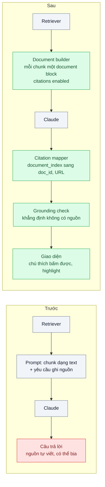
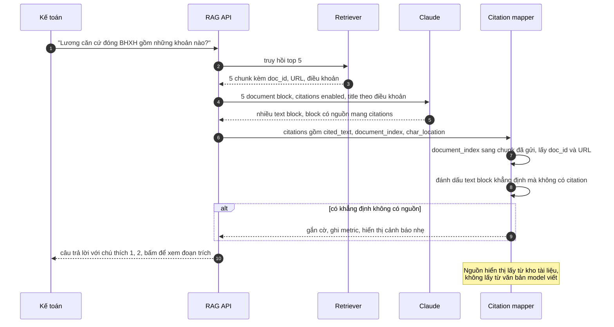

# Citations & Grounding — Khách hỏi "câu này lấy ở đâu?", chatbot không chỉ ra được

| Scope | Mức độ | Trạng thái | Pattern gốc | Cập nhật |
|---|---|---|---|---|
| 10 · backend / AI RAG | 🟡 Trung bình | 📋 Kế hoạch | Citations — Anthropic docs (platform.claude.com); RAG — Lewis et al. (NeurIPS 2020) | 2026-10-06 |

> **Một câu tóm tắt:** Đưa từng đoạn truy hồi vào model dưới dạng document block có bật citations, để mỗi câu trong câu trả lời trả về kèm đoạn trích nguyên văn và vị trí trong tài liệu nguồn do API sinh ra — backend ánh xạ sang đường dẫn tài liệu thật, giao diện hiển thị chú thích bấm được, câu không có nguồn bị đánh dấu.

## 1. Bài toán thực tế (What)

**Bối cảnh** *(doanh nghiệp giả định, số liệu minh họa)*
Nền tảng SaaS nhân sự – tiền lương phục vụ 2.000 doanh nghiệp có chatbot giải đáp cho kế toán và nhân sự về quy định bảo hiểm xã hội, thuế thu nhập cá nhân và cách dùng sản phẩm. Kho gồm văn bản quy phạm đã được đội nội dung biên tập và 3.000 bài hướng dẫn. Prompt hiện tại yêu cầu model "ghi nguồn ở cuối câu trả lời".

**Triệu chứng người kinh doanh nhìn thấy**
- Kế toán hỏi "lương làm căn cứ đóng BHXH gồm những khoản nào", nhận câu trả lời nghe hợp lý nhưng không biết dựa vào văn bản nào nên vẫn gọi tổng đài xác minh.
- Một câu trả lời ghi "theo Điều 168" — điều khoản không tồn tại trong văn bản được trích; khách khiếu nại và đăng lên cộng đồng người dùng.
- Đội nội dung không biết đoạn tài liệu nào dẫn tới câu trả lời sai để sửa.

**Nguyên nhân kỹ thuật**
"Nguồn" do model tự viết ra như mọi đoạn văn bản khác, nên cũng có thể bịa: số điều, tên văn bản, URL. Không có liên kết máy kiểm được giữa từng khẳng định và đoạn nguồn cụ thể; danh sách nguồn chung ở cuối không cho biết câu nào lấy từ đâu.

**Ràng buộc**
- Mỗi khẳng định về quy định phải truy được về đoạn văn bản cụ thể; không có nguồn thì không được trình bày như sự thật.
- Giao diện cần hiển thị đoạn trích nguyên văn khi khách bấm vào chú thích.
- Chi phí và độ trễ tăng thêm phải nhỏ.

## 2. Vì sao dùng pattern này (Why)

**Nguyên nhân gốc mà pattern nhắm vào:** nguồn trích dẫn được *sinh ra* như văn bản thay vì được *gắn* một cách có cấu trúc với đoạn nguồn.

**Pattern giải quyết thế nào:** dùng tính năng citations của Messages API. Mỗi đoạn truy hồi được truyền như một `document` content block (dạng văn bản thuần, hoặc dạng nội dung tùy biến khi muốn kiểm soát độ hạt trích dẫn) có `title` và `citations: {enabled: true}`. Phản hồi được tách thành nhiều text block; block nào dựa trên tài liệu mang mảng `citations`, mỗi phần tử có `cited_text` (đoạn trích nguyên văn), `document_index`, `document_title` và vị trí theo loại: `char_location` cho văn bản thuần, `page_location` cho PDF, `content_block_location` cho nội dung tùy biến. Backend ánh xạ `document_index` về `doc_id`, URL và điều khoản của chunk đã gửi — nguồn hiển thị luôn là tài liệu thật trong kho. Lớp **grounding check** đánh dấu các text block mang khẳng định mà không có citation, và đo faithfulness định kỳ (bài 06).

**Lựa chọn khác đã cân nhắc**

| Lựa chọn | Giải quyết được gì | Vì sao không chọn (ở bài này) |
|---|---|---|
| Giữ nguyên + tối ưu nhỏ: đánh số chunk, yêu cầu model ghi "[2]" sau mỗi câu | Dễ làm, không phụ thuộc tính năng API | Model có thể gán sai số; không có đoạn trích chính xác; phải tự parse và kiểm |
| Hiển thị danh sách top 5 tài liệu đã truy hồi | Có "nguồn" ngay | Không cho biết câu nào lấy từ đâu; tài liệu hiển thị có thể không được dùng |
| Gán nguồn sau khi sinh (so embedding từng câu với từng chunk) | Không phụ thuộc model | Thêm bước, kém chính xác với câu diễn giải; không có đoạn trích nguyên văn đáng tin |
| Citations của API + ánh xạ về tài liệu thật *(chọn)* | Mỗi câu có đoạn trích và vị trí do API trả về | Không dùng chung được với structured outputs trong cùng request; phụ thuộc định dạng phản hồi của nhà cung cấp |

## 3. Thiết kế hệ thống (How)

### 3.1 Kiến trúc trước và sau



### 3.2 Luồng chính



### 3.3 Thành phần và trách nhiệm

| Thành phần | Trách nhiệm | Quyết định thiết kế đáng chú ý |
|---|---|---|
| Document builder | Mỗi chunk thành một `document` block, `title` là tên văn bản + điều khoản, bật citations cho *tất cả* document | Giữ thứ tự document ổn định để `document_index` ánh xạ đúng; giữ mảng chunk đã gửi theo request |
| Chọn loại document | Văn bản thuần cho chunk thường; nội dung tùy biến khi muốn mỗi câu hoặc mỗi khoản là một đơn vị trích dẫn | Chunk theo cấu trúc (bài 02) cho trích dẫn gọn |
| Citation mapper | Ánh xạ `document_index` → `doc_id`, URL, điều khoản; giữ `cited_text` để highlight | Không bao giờ hiển thị URL do model viết |
| Grounding check | Đánh dấu text block mang khẳng định không có citation; câu chào hoặc chuyển ý được bỏ qua | Bắt đầu bằng luật đơn giản, đo bằng judge ở bài 06 |
| Giao diện | Chú thích bấm được, panel đoạn trích, liên kết tới tài liệu gốc | Đoạn trích hiển thị nguyên văn để khách tự kiểm |

### 3.4 Điểm dễ sai khi triển khai
- **Bật citations cho một số document, không bật cho số khác**: API yêu cầu bật cho tất cả hoặc không bật cho document nào trong request.
- **Kết hợp với structured outputs**: citations không dùng chung được với `output_config.format` trong cùng request. Nếu cần JSON, tách thành hai bước hoặc đưa metadata vào phần xử lý sau.
- **Ánh xạ sai index**: sắp xếp lại hoặc lọc chunk sau khi đã gửi làm `document_index` trỏ sai. Lưu đúng mảng đã gửi cùng request.
- **Chunk quá lớn**: đoạn trích dài cả trang không giúp khách kiểm; chunk nhỏ hoặc nội dung tùy biến cho trích dẫn chính xác hơn.
- **Coi có citation là đúng**: citation chứng minh câu *dựa vào* đoạn nào, không chứng minh model hiểu đúng. Vẫn đo faithfulness và độ chính xác trích dẫn.

## 4. Tech stack và tác động (Impact techstack)

| Lớp | Công nghệ chọn | Vì sao chọn | Thay thế tương đương |
|---|---|---|---|
| Ngôn ngữ / runtime | TypeScript strict, Node 20+, NestJS | Trùng stack | Fastify |
| LLM | `@anthropic-ai/sdk`, `claude-opus-5-5`, document block với citations | Đoạn trích và vị trí do API trả về theo cấu trúc | Đánh số chunk và tự parse (phương án dự phòng) |
| Tối ưu chi phí | Prompt caching (`cache_control`) cho phần system và tài liệu lặp lại | Tài liệu phổ biến được hỏi nhiều lần | — |
| Truy hồi | PostgreSQL 16 + pgvector, chunk theo cấu trúc (bài 02) | Giữ `doc_id`, URL, điều khoản theo chunk | Qdrant |
| Embedding | Model embedding (ví dụ Voyage AI, hoặc mô hình mở qua Text Embeddings Inference) | Không đổi; chọn cụ thể khi thực hành | — |
| Đánh giá | Judge `claude-sonnet-5-5` kiểm tra đoạn trích có hỗ trợ câu không | Đo độ chính xác trích dẫn | — |
| Frontend | Next.js, component chú thích + panel đoạn trích | Hiển thị và highlight | — |
| Test | Vitest với phản hồi API mẫu có citations | Test mapper không tốn tiền | — |

**Thay đổi so với hệ thống hiện tại:** đổi cách lắp prompt (document block thay vì text), thêm citation mapper và grounding check ở backend, thêm component chú thích ở frontend. Đội nội dung dùng log citation để biết đoạn nào được dùng nhiều và đoạn nào gây trả lời sai.

## 5. Kết quả đầu ra và cách đo (Output impact)

| Chỉ số | Trước (minh họa) | Mục tiêu khi thực hành | Cách đo |
|---|---|---|---|
| Citation coverage (tỷ lệ text block mang khẳng định có citation) | 0% có cấu trúc | ≥ 95% | Script đếm trên bộ eval 100 câu |
| Độ chính xác trích dẫn (đoạn trích thực sự hỗ trợ câu) | không đo | ≥ 90% | Judge `claude-sonnet-5-5` chấm từng cặp câu và `cited_text`, người kiểm 20% |
| Tỷ lệ nguồn không tồn tại trong kho | 7% câu trả lời | 0 | Script kiểm mọi nguồn hiển thị đều ánh xạ được về `doc_id` có thật |
| Faithfulness | đo ở bài 06 | không thấp hơn trước | RAGAS faithfulness trên cùng bộ eval |
| Độ trễ và token đầu ra thêm | baseline | tăng không quá 15% | So `usage` và p95 trước, sau trên cùng bộ câu |
| Cuộc gọi tổng đài để xác minh câu trả lời chatbot | 120 mỗi tuần | có số theo dõi | Tag ticket "xác minh chatbot" trong hệ thống hỗ trợ |

> Số "trước" là minh họa để hình dung bài toán. Số "mục tiêu" chỉ được coi là đạt khi có số đo thật
> ở mục 8 kèm môi trường đo.

**Tác động nghiệp vụ mong đợi:** khách tự kiểm được câu trả lời bằng đoạn văn bản gốc, giảm cuộc gọi xác minh; không còn nguồn bịa gây khủng hoảng niềm tin.

## 6. Đánh đổi và khi KHÔNG nên dùng

**Đánh đổi**
- Phụ thuộc định dạng phản hồi của tính năng citations; đổi nhà cung cấp phải làm lại mapper.
- Không dùng chung với structured outputs trong cùng request.
- Giao diện phức tạp hơn; câu trả lời bị tách thành nhiều block cần ghép khi stream.

**Không nên dùng khi**
- Câu trả lời là sáng tạo hoặc tổng hợp không dựa trên tài liệu (viết email mẫu): citation không có ý nghĩa.
- Đầu ra phải là JSON để máy xử lý tiếp: dùng structured outputs và lưu `chunk_ids` đã dùng theo cách khác.

**Liên quan**
- [Naive RAG](../01-naive-rag-chatbot-noi-quy-cong-ty-tra-loi-bua/) — pipeline được bổ sung trích dẫn.
- [Chunking Strategies](../02-chunking-cat-giua-dieu-khoan-tra-loi-thieu-nghia/) — ranh giới chunk quyết định đoạn trích gọn hay dài.
- [RAG Evaluation](../06-rag-evaluation-ragas-khong-biet-tra-loi-dung-bao-nhieu-phan-tram/) — faithfulness và độ chính xác trích dẫn.
- [Structured Output (scope 20)](../../20-backend-ai-framework-system-design/03-structured-output-parse-json-tu-text-fail-5-phan-tram/) — khi nào chọn JSON thay vì citations.
- [Online Quality Monitoring (scope 24)](../../24-backend-ai-monitoring/03-quality-monitoring-llm-judge-sampling-chat-luong-tut-dan-khong-ai-thay/) — theo dõi coverage trong production.

## 7. Cơ sở tham khảo

- Anthropic docs, "Citations" — https://platform.claude.com/docs/en/build-with-claude/citations — document block với `citations: {enabled: true}`, các trường `cited_text`, `document_index`, `document_title`, các loại vị trí `char_location`, `page_location`, `content_block_location`, giới hạn khi kết hợp với tính năng khác.
- Anthropic docs, "Prompt caching" — https://platform.claude.com/docs/en/build-with-claude/prompt-caching — cache tài liệu lặp lại giữa các request.
- Lewis et al., "Retrieval-Augmented Generation for Knowledge-Intensive NLP Tasks", NeurIPS 2020 — RAG giúp câu trả lời có xuất xứ kiểm được, nền của grounding.
- Es et al., "RAGAS" (2023) — faithfulness dùng để đo mức bám nguồn ngoài việc có citation.

## 8. Kế hoạch thực hành

- [ ] Bước 1: dùng lại pipeline bài 02 với kho văn bản giả định (quy định nội bộ tự soạn có Điều, Khoản); bộ eval 100 câu có nguồn đúng.
- [ ] Bước 2: đo "trước" với cách "yêu cầu ghi nguồn": tỷ lệ nguồn không tồn tại, độ chính xác nguồn.
- [ ] Bước 3: áp dụng pattern: document builder, gọi API có citations, citation mapper, grounding check, component chú thích.
- [ ] Bước 4: đo "sau": coverage, độ chính xác trích dẫn, nguồn không tồn tại, faithfulness, độ trễ; so văn bản thuần với nội dung tùy biến; ghi vào mục 5.
- [ ] Bước 5: test Vitest: (a) `document_index` ánh xạ đúng chunk đã gửi kể cả khi retriever trả chunk trùng, (b) mọi URL hiển thị lấy từ kho, (c) block khẳng định không có citation bị gắn cờ, (d) request không bao giờ có cả citations và `output_config.format`.

**Cấu trúc code dự kiến**
```text
src/
  generation/
    document-block-builder.ts
    cited-answer.ts           # gọi Messages API, đọc text block + citations
  citations/
    citation-mapper.ts        # document_index sang doc_id, URL
    grounding-check.ts
web/components/citation-footnote.tsx
test/
  citation-mapper.test.ts
  grounding-check.test.ts
eval/run-citation-eval.ts
docker-compose.yml
```

**Cách chạy** *(điền khi bắt đầu code)*
```bash
docker compose up -d
pnpm install && pnpm test
```
