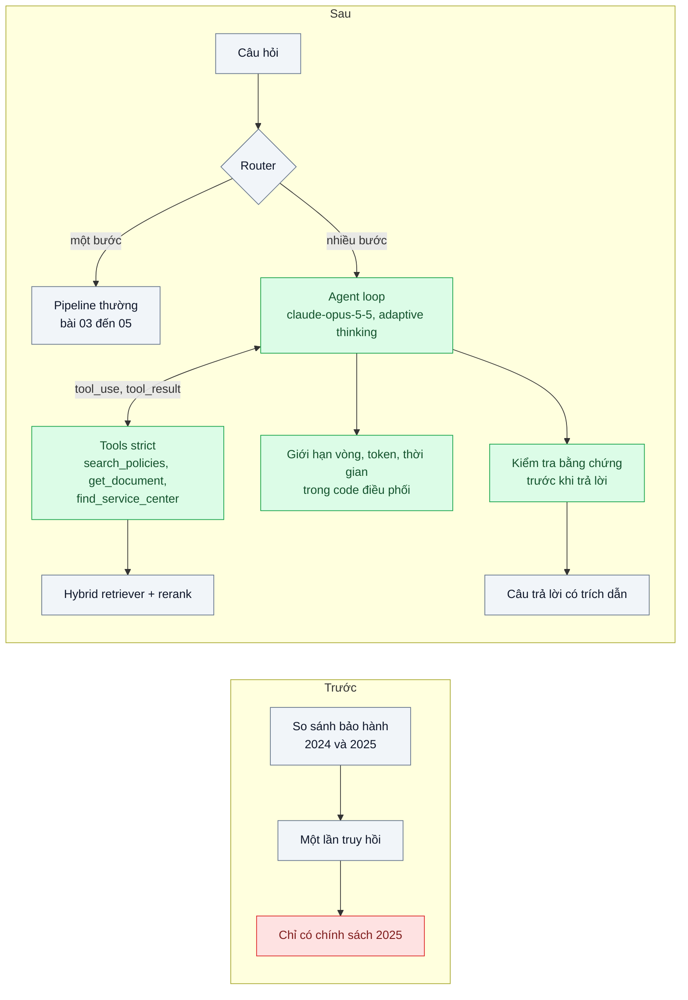
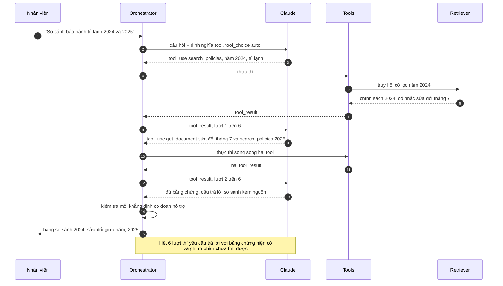

# Agentic / Self-RAG (multi-hop) — Câu hỏi "so sánh chính sách bảo hành 2024 và 2025" cần tra nhiều vòng

| Scope | Mức độ | Trạng thái | Pattern gốc | Cập nhật |
|---|---|---|---|---|
| 10 · backend / AI RAG | 🔴 Nâng cao | 📋 Kế hoạch | Self-RAG — Asai et al. (2023); Agents — Anthropic, "Building effective agents" (2024); ReAct — Yao et al. (2022) | 2026-10-06 |

> **Một câu tóm tắt:** Thay vì truy hồi đúng một lần, cấp cho model công cụ tìm kiếm tài liệu và để nó tự quyết truy vấn tiếp theo dựa trên kết quả vừa đọc, tự đánh giá bằng chứng đã đủ chưa, trong giới hạn số vòng và ngân sách — chỉ cho những câu hỏi thật sự cần nhiều bước.

## 1. Bài toán thực tế (What)

**Bối cảnh** *(doanh nghiệp giả định, số liệu minh họa)*
Chuỗi điện máy 150 cửa hàng có chatbot cho nhân viên bán hàng và chăm sóc khách hàng. Kho gồm chính sách bảo hành theo năm và ngành hàng, thông báo sửa đổi giữa năm, danh sách trung tâm bảo hành, bảng mã lỗi. Pipeline hiện tại: biến đổi câu hỏi, hybrid search, rerank, một lần truy hồi (bài 03–05).

**Triệu chứng người kinh doanh nhìn thấy**
- "So sánh bảo hành tủ lạnh 2024 và 2025" chỉ nhận được nội dung chính sách 2025; câu so sánh sai hoặc thiếu.
- "Khách mua máy giặt tháng 3/2024, lỗi bo mạch, còn bảo hành không và mang tới đâu?" cần biết chính sách áp dụng theo ngày mua, xem có thông báo sửa đổi không, rồi tra trung tâm bảo hành theo tỉnh — chatbot trả lời một phần.
- Khoảng 15% câu hỏi thuộc loại nhiều bước; nhân viên mất trung bình 10 phút tra tay, khách chờ tại quầy.

**Nguyên nhân kỹ thuật**
Một lần truy hồi chỉ tìm được tài liệu gần nhất với *toàn bộ* câu hỏi. Câu hỏi multi-hop cần kết quả bước 1 (chính sách nào áp dụng cho ngày mua) để biết phải tìm gì ở bước 2 (sửa đổi của chính sách đó) — không thể biết trước các truy vấn như decomposition cố định ở bài 05.

**Ràng buộc**
- Câu hỏi một bước (đa số) không được chậm hơn hay đắt hơn hiện tại.
- Mỗi câu nhiều bước có trần số vòng, thời gian và chi phí; vượt trần phải trả lời phần đã chắc và nói rõ phần chưa tìm được.
- Mọi bước truy hồi phải có trace để điều tra.

## 2. Vì sao dùng pattern này (Why)

**Nguyên nhân gốc mà pattern nhắm vào:** số lần và nội dung truy hồi bị cố định trước, trong khi câu hỏi multi-hop chỉ biết bước tiếp theo sau khi đọc kết quả bước trước.

**Pattern giải quyết thế nào:**
1. **Router** (bài 05) giữ câu một bước ở pipeline thường; chỉ câu được phân loại "nhiều bước" vào agent — theo nguyên tắc của Anthropic: dùng workflow đơn giản khi đủ, chỉ dùng agent khi cần.
2. **Agent loop kiểu ReAct**: `claude-opus-5-5` với adaptive thinking nhận các tool `search_policies(query, year?, category?)`, `get_document(doc_id)`, `find_service_center(province, category)`; định nghĩa tool có `strict: true` để tham số luôn đúng schema. Model gọi tool, đọc kết quả, quyết định gọi tiếp hay trả lời.
3. **Tự đánh giá bằng chứng** (ý tưởng của Self-RAG): sau mỗi lượt, model được yêu cầu nhận xét đoạn vừa đọc có liên quan không và còn thiếu gì; trước khi trả lời, một bước kiểm tra xác nhận mỗi khẳng định có đoạn hỗ trợ. Self-RAG gốc *huấn luyện* model sinh token phản tư; bài này chỉ mô phỏng ý tưởng bằng prompt và bước kiểm tra, không huấn luyện.
4. **Giới hạn cứng** ở code điều phối: tối đa 6 lượt tool, trần token, timeout tổng; vượt trần thì yêu cầu model trả lời với bằng chứng hiện có và ghi rõ phần thiếu.
5. **Câu trả lời có trích dẫn** (bài 08) để nhân viên kiểm được.

**Lựa chọn khác đã cân nhắc**

| Lựa chọn | Giải quyết được gì | Vì sao không chọn (ở bài này) |
|---|---|---|
| Giữ nguyên + tối ưu nhỏ: tăng top-k lên 30 | Đôi khi có đủ tài liệu hai năm | Nhiễu, đắt; không giải quyết bước phụ thuộc kết quả bước trước |
| Query decomposition cố định (bài 05) | Đủ khi các câu con biết trước | Không xử lý được bước 2 phụ thuộc kết quả bước 1 |
| GraphRAG (đồ thị tri thức + tóm tắt cộng đồng) | Mạnh với câu hỏi tổng hợp toàn kho | Chi phí dựng đồ thị lớn; để làm hướng mở |
| Agentic RAG có router và giới hạn *(chọn)* | Truy hồi thích ứng theo kết quả, chỉ cho câu cần | Chậm và đắt hơn cho mỗi câu đi vào agent; khó dự đoán hơn workflow |

## 3. Thiết kế hệ thống (How)

### 3.1 Kiến trúc trước và sau



### 3.2 Luồng chính



### 3.3 Thành phần và trách nhiệm

| Thành phần | Trách nhiệm | Quyết định thiết kế đáng chú ý |
|---|---|---|
| Định nghĩa tool | Tên, mô tả rõ khi nào dùng, schema tham số, `strict: true` | Ít tool, mỗi tool một việc; mô tả viết như hướng dẫn cho người mới |
| Orchestrator | Vòng lặp gọi API, thực thi tool, trả *tất cả* `tool_result` trong một message, đếm lượt | Giới hạn nằm ở code, không chỉ trong prompt |
| Bước kiểm tra bằng chứng | Xác nhận khẳng định có đoạn hỗ trợ; thiếu thì nói rõ | Có thể dùng `claude-sonnet-5-5` để rẻ hơn |
| Trace | Lưu từng lượt: tool, tham số, kết quả rút gọn, token (OpenTelemetry span hoặc Langfuse) | Dữ liệu điều tra, tạo eval case, đếm tỷ lệ chạm trần |

### 3.4 Điểm dễ sai khi triển khai
- **Ép model gọi tool bằng `tool_choice` dạng `any` hoặc `tool`**: với `claude-opus-5-5` các dạng này trả lỗi 400. Dùng `auto`, hướng dẫn trong prompt và `strict: true` cho tham số.
- **Vòng lặp vô tận hoặc lặp lại truy vấn cũ**: luôn có trần lượt ở code, và đưa danh sách truy vấn đã chạy vào ngữ cảnh.
- **Tool trả quá nhiều văn bản**: mỗi lượt đổ 20 đoạn đầy đủ làm ngữ cảnh phình nhanh. Trả đoạn rút gọn, để model gọi `get_document` khi cần chi tiết.
- **Đưa mọi câu vào agent**: chi phí và độ trễ tăng cho 85% câu không cần. Router và đo tỷ lệ đi vào agent.
- **Tách `tool_result` ra nhiều message** khi model gọi song song: trả tất cả trong một message; tool lỗi trả `is_error: true` thay vì bỏ qua.

## 4. Tech stack và tác động (Impact techstack)

| Lớp | Công nghệ chọn | Vì sao chọn | Thay thế tương đương |
|---|---|---|---|
| Ngôn ngữ / runtime | TypeScript strict, Node 20+, NestJS | Trùng stack | Fastify |
| Agent | `@anthropic-ai/sdk`, `claude-opus-5-5`, adaptive thinking (`thinking: {type: "adaptive"}`), effort (`output_config.effort`) chỉnh theo eval | Model mạnh nhất cho suy luận nhiều bước; effort để cân chi phí | Tool runner của SDK thay cho vòng lặp tự viết |
| Tool | Tool use với `strict: true` | Tham số luôn hợp lệ, không phải tự sửa JSON | — |
| Truy hồi | Hybrid + rerank trên PostgreSQL 16 / pgvector và Elasticsearch (bài 03–04) | Tái dùng làm backend của tool | Qdrant |
| Test | Vitest với client LLM giả lập kịch bản tool_use | Test vòng lặp và giới hạn không tốn tiền | — |

**Thay đổi so với hệ thống hiện tại:** thêm orchestrator, ba tool bọc retriever và dịch vụ tra trung tâm bảo hành, nhãn "nhiều bước" ở router, trace từng lượt. Đội vận hành theo dõi thêm số lượt trung bình và tỷ lệ chạm trần.

## 5. Kết quả đầu ra và cách đo (Output impact)

| Chỉ số | Trước (minh họa) | Mục tiêu khi thực hành | Cách đo |
|---|---|---|---|
| Tỷ lệ đúng câu nhiều bước | 45% | ≥ 80% | Bộ 80 câu multi-hop có đáp án và danh sách tài liệu cần đọc; judge `claude-sonnet-5-5` + người kiểm 20% |
| Tỷ lệ đúng câu một bước | baseline | không thấp hơn | Bộ eval bài 06 chạy qua router |
| Số lượt tool trung bình, p95 và tỷ lệ chạm trần | 1 | trung bình dưới 3, chạm trần dưới 5% | Đếm từ trace |
| p95 độ trễ câu nhiều bước | không có | dưới 25 giây | Script chạy bộ 80 câu, đo end-to-end |
| Chi phí mỗi câu nhiều bước | không có | biết và nằm trong ngân sách | Tổng `usage` mọi lượt × đơn giá |
| Độ ổn định khi chạy lặp | không đo | đo pass^k với k = 4 | Chạy mỗi câu 4 lần, tính tỷ lệ đúng cả 4 lần |

> Số "trước" là minh họa để hình dung bài toán. Số "mục tiêu" chỉ được coi là đạt khi có số đo thật
> ở mục 8 kèm môi trường đo.

**Tác động nghiệp vụ mong đợi:** nhân viên trả lời được câu hỏi bảo hành phức tạp ngay tại quầy với nguồn kèm theo, giảm thời gian khách chờ và giảm tư vấn sai về quyền lợi bảo hành.

## 6. Đánh đổi và khi KHÔNG nên dùng

**Đánh đổi**
- Chi phí và độ trễ mỗi câu đi vào agent cao hơn nhiều so với pipeline một lần.
- Hành vi khó dự đoán hơn; cùng câu hỏi có thể đi đường khác nhau giữa các lần chạy.
- Thêm bề mặt rủi ro: nội dung tài liệu có thể chứa chỉ dẫn độc hại tác động lên quyết định gọi tool (prompt injection gián tiếp).

**Không nên dùng khi**
- Câu hỏi đa phần một bước hoặc các bước biết trước: decomposition cố định (bài 05) rẻ và dễ kiểm soát hơn.
- Cần độ trễ dưới vài giây cho mọi câu: agent nhiều lượt không phù hợp.

**Liên quan**
- [Query Transformation](../05-query-transformation-cau-hoi-mo-ho-hyde-multi-query/) — router và decomposition cố định.
- [Citations & Grounding](../08-citations-grounding-khach-hoi-cau-nay-lay-o-dau/) — trích dẫn cho câu trả lời của agent.
- [Workflow vs Agent (scope 11)](../../11-backend-ai-agent/01-workflow-vs-agent-khi-nao-can-agent/) — khi nào cần agent.
- [Tool Design & Tool Search (scope 20)](../../20-backend-ai-framework-system-design/09-tool-design-for-agents-30-tool-agent-chon-sai/) — thiết kế tool.
- [Agent Evaluation (scope 11)](../../11-backend-ai-agent/09-agent-evaluation-tau-bench-agent-dung-80-lan-dau-chay-8-lan-khong/) — đo pass^k.

## 7. Cơ sở tham khảo

- Asai et al., "Self-RAG: Learning to Retrieve, Generate, and Critique through Self-Reflection" (2023) — truy hồi theo nhu cầu và tự đánh giá đoạn truy hồi, câu trả lời.
- Yao et al., "ReAct: Synergizing Reasoning and Acting in Language Models" (2022) — xen kẽ suy luận và hành động gọi công cụ, nền của vòng lặp agent.
- Anthropic, "Building effective agents" (2024) — https://www.anthropic.com/engineering/building-effective-agents — phân biệt workflow và agent, nguyên tắc chọn cách đơn giản nhất đủ dùng.
- Anthropic docs, "Tool use" — https://platform.claude.com/docs/en/agents-and-tools/tool-use/overview — định nghĩa tool, `strict`, trả `tool_result` cho lời gọi song song; adaptive thinking và effort tại trang build-with-claude tương ứng.
- Edge et al., "From Local to Global: A Graph RAG Approach to Query-Focused Summarization", Microsoft (2024) — hướng mở cho câu hỏi tổng hợp toàn kho.

## 8. Kế hoạch thực hành

- [ ] Bước 1: kho chính sách bảo hành giả định 3 năm, có thông báo sửa đổi giữa năm và danh sách trung tâm bảo hành; bộ 80 câu multi-hop + 50 câu một bước.
- [ ] Bước 2: đo "trước" với pipeline bài 05: tỷ lệ đúng từng nhóm, độ trễ.
- [ ] Bước 3: áp dụng pattern: ba tool `strict`, orchestrator có trần lượt, bước kiểm tra bằng chứng, nhãn router, trace.
- [ ] Bước 4: đo "sau" với effort `low`, `medium`, `high`; ghi tỷ lệ đúng, số lượt, p95, chi phí, pass^4 vào mục 5.
- [ ] Bước 5: test Vitest: (a) câu một bước không vào agent, (b) chạm trần 6 lượt thì trả lời phần đã có và nêu phần thiếu, (c) hai `tool_use` song song nhận hai `tool_result` trong một message, (d) tool lỗi trả `is_error: true` và vòng lặp tiếp tục.

**Cấu trúc code dự kiến**
```text
src/
  agent/
    rag-orchestrator.ts       # vòng lặp, trần lượt, tool_choice auto
    tools/
      search-policies.ts
      get-document.ts
      find-service-center.ts
    evidence-verifier.ts
test/
  rag-orchestrator.test.ts
eval/run-multihop-eval.ts
docker-compose.yml
```

**Cách chạy** *(điền khi bắt đầu code)*
```bash
docker compose up -d
pnpm install && pnpm test
```
