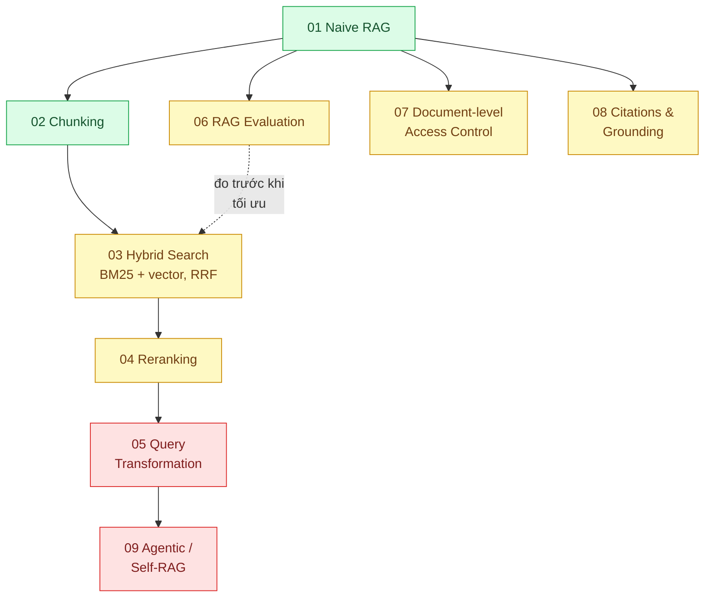

# 10 · AI — RAG (`backend / AI RAG`)

> **Phạm vi:** Để model ngôn ngữ trả lời từ tài liệu của doanh nghiệp: cắt tài liệu, truy hồi
> (từ khóa + vector), xếp hạng lại, biến đổi câu hỏi, đánh giá, phân quyền tài liệu, dẫn nguồn,
> truy hồi nhiều vòng. Chỉ số vector thuộc scope 12; agent tổng quát thuộc scope 11; giám sát
> production thuộc scope 24.
>
> **Câu hỏi trung tâm:** Để model trả lời từ tài liệu của doanh nghiệp một cách đúng, có dẫn nguồn,
> đúng quyền, và đo được?

## Bản đồ pattern trong scope

## Danh sách bài toán

| # | Bài toán (pattern — triệu chứng) | Mức | Pattern gốc / nguồn | Trạng thái |
|---|---|---|---|---|
| 01 | [Naive RAG (retrieve → augment → generate) — Chatbot hỏi nội quy công ty trả lời bịa vì model không có tài liệu](./01-naive-rag-chatbot-noi-quy-cong-ty-tra-loi-bua/) | 🟢 | Lewis et al., "Retrieval-Augmented Generation for Knowledge-Intensive NLP Tasks" (NeurIPS 2020); Gao et al., RAG Survey (2023) | 📋 |
| 02 | [Chunking Strategies — Chunk cắt ngang giữa điều khoản, câu trả lời thiếu nửa điều kiện](./02-chunking-cat-giua-dieu-khoan-tra-loi-thieu-nghia/) | 🟢 | Gao et al., RAG Survey (2023) §chunking; Anthropic, "Introducing Contextual Retrieval" (2024); LlamaIndex / LangChain docs (text splitters) | 📋 |
| 03 | [Hybrid Search (BM25 + vector, RRF) — Hỏi mã sản phẩm "SKU-4821", tìm bằng vector không ra](./03-hybrid-search-rrf-ma-san-pham-tim-vector-khong-ra/) | 🟡 | Cormack, Clarke, Buettcher, "Reciprocal Rank Fusion" (SIGIR 2009); Anthropic "Contextual Retrieval" (BM25 + embeddings); Elasticsearch / Qdrant docs hybrid search | 📋 |
| 04 | [Reranking (cross-encoder) — Tài liệu đúng có trong top 20 nhưng không lọt top 5 đưa vào prompt](./04-reranking-top-20-dung-nhung-top-5-sai/) | 🟡 | Nogueira & Cho, "Passage Re-ranking with BERT" (2019); Cohere Rerank docs; sentence-transformers cross-encoder docs | 📋 |
| 05 | [Query Transformation (HyDE, multi-query, decomposition) — Câu hỏi của khách mơ hồ, một lần tìm không đủ](./05-query-transformation-cau-hoi-mo-ho-hyde-multi-query/) | 🔴 | Gao et al., "Precise Zero-Shot Dense Retrieval without Relevance Labels" (HyDE, 2022); Gao et al., RAG Survey (query rewriting) | 📋 |
| 06 | [RAG Evaluation (faithfulness, context precision/recall) — Không ai biết chatbot trả lời đúng bao nhiêu phần trăm](./06-rag-evaluation-ragas-khong-biet-tra-loi-dung-bao-nhieu-phan-tram/) | 🟡 | Es et al., "RAGAS" (2023); Hamel Husain, "Your AI Product Needs Evals" (2024); IIR ch.8 (precision@k, MRR) | 📋 |
| 07 | [Document-level Access Control in RAG — Nhân viên hỏi chatbot và nhận được lương của giám đốc](./07-access-control-rag-nhan-vien-hoi-duoc-luong-cua-sep/) | 🟡 | OWASP Top 10 for LLM Applications (2025) — LLM02 Sensitive Information Disclosure; Qdrant / pgvector docs (metadata filter, RLS) | 📋 |
| 08 | [Citations & Grounding — Khách hỏi "câu này lấy ở đâu?", chatbot không chỉ ra được](./08-citations-grounding-khach-hoi-cau-nay-lay-o-dau/) | 🟡 | Anthropic docs "Citations" (platform.claude.com); Lewis et al. (2020) | 📋 |
| 09 | [Agentic / Self-RAG (multi-hop) — Câu hỏi "so sánh chính sách bảo hành 2024 và 2025" cần tra nhiều vòng](./09-agentic-rag-cau-hoi-can-tra-nhieu-vong/) | 🔴 | Asai et al., "Self-RAG" (2023); Anthropic, "Building effective agents" (2024); Edge et al., GraphRAG (2024) — hướng mở | 📋 |

## Lộ trình đề xuất trong scope

1. **Naive RAG** — dựng pipeline tối thiểu với pgvector; chấp nhận kết quả xấu để có baseline.
2. **RAG evaluation** (bài 06) — làm **ngay sau** bài 01, trước mọi tối ưu: không có thước đo thì
   mọi cải tiến sau chỉ là cảm giác.
3. **Chunking → Hybrid → Reranking** — ba bậc tối ưu truy hồi, mỗi bậc đo lại bằng bộ eval.
4. **Access control, Citations** — hai bài về *tin cậy*; cần có trước khi đưa cho người dùng thật.
5. **Query transformation → Agentic RAG** — khi câu hỏi phức tạp hơn một lần truy hồi.

## Kiến thức nền cần có trước

- Embedding và cosine similarity ở mức trực giác; pgvector cơ bản (scope 12 bài 01).
- Gọi Anthropic API với tool use / structured output (scope 20 bài 03).
- BM25 (scope 05 bài 01).

## Liên kết với scope khác

- `12-backend-database-vector` — index và filter cho vector.
- `05-backend-search` — BM25, analyzer tiếng Việt cho nhánh từ khóa của hybrid search.
- `20-backend-ai-framework-system-design` — model gateway, structured output, eval trong CI.
- `24-backend-ai-monitoring` bài 05 — theo dõi chất lượng truy hồi trong production.
- `22-backend-ai-optimizer` bài 01 — prompt caching cho ngữ cảnh tài liệu lớn.

## Nguồn tổng quan cho scope

- Gao et al., "Retrieval-Augmented Generation for Large Language Models: A Survey" (2023), arXiv 2312.10997.
- Anthropic, "Introducing Contextual Retrieval" (2024) — https://www.anthropic.com/news/contextual-retrieval
- Chip Huyen, *AI Engineering* (2025), chương về RAG và agents.
