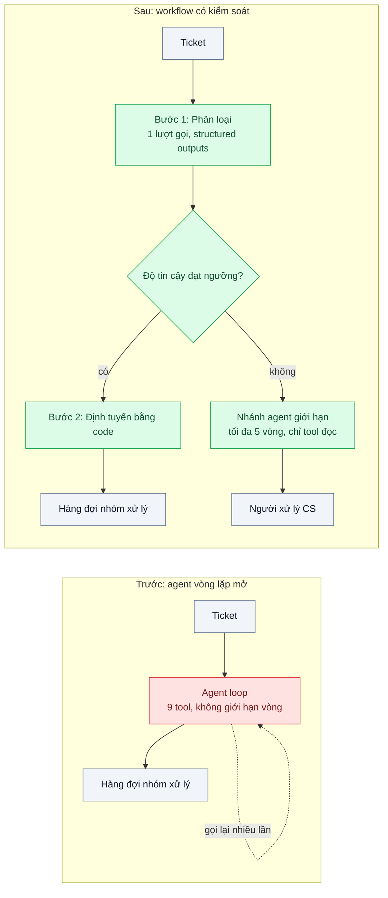
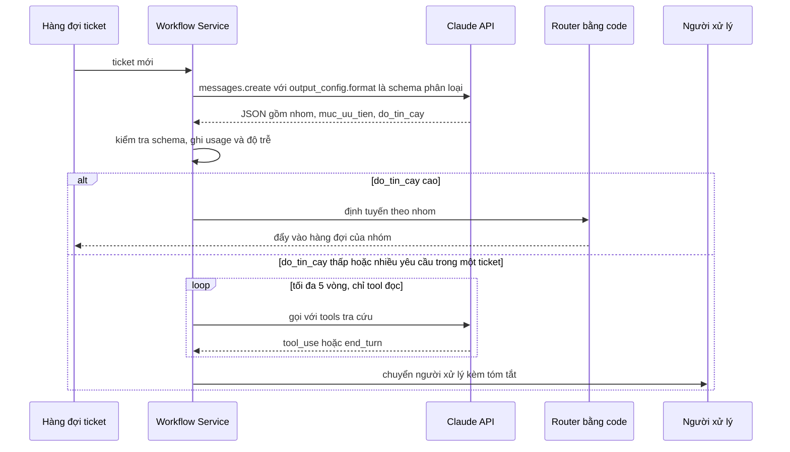

# Workflow vs Agent — Tự động hóa phân loại ticket: cần "agent" hay chỉ cần một chuỗi prompt có kiểm soát?

| Scope | Mức độ | Trạng thái | Pattern gốc | Cập nhật |
|---|---|---|---|---|
| 11 · backend / AI Agent | 🟢 Cơ bản | 📋 Kế hoạch | Workflow vs Agent — Anthropic, "Building effective agents" (2024) | 2026-10-06 |

> **Một câu tóm tắt:** Thay "agent" tự chọn tool trong vòng lặp mở bằng một workflow có bước cố định (phân loại → kiểm tra → định tuyến), chỉ rẽ sang nhánh agent có giới hạn ở ca mơ hồ, để chi phí, độ trễ và lỗi đoán trước được.

## 1. Bài toán thực tế (What)

**Bối cảnh** *(doanh nghiệp giả định, số liệu minh họa)*
Công ty SaaS B2B cung cấp phần mềm quản lý nhân sự, nhận khoảng 4.000 ticket hỗ trợ mỗi ngày qua email và form web. Đội CS 25 người phân loại tay theo 12 nhóm (lỗi đăng nhập, hóa đơn, yêu cầu tính năng...) rồi chuyển cho đúng nhóm xử lý. Đội kỹ thuật dựng một "agent" trên Anthropic SDK: một system prompt dài, 9 tool (tra khách hàng, tra hóa đơn, tìm tài liệu, tạo ticket Jira, gửi email...), cho model tự quyết gọi gì cho đến khi "xong".

**Triệu chứng người kinh doanh nhìn thấy**
- Hóa đơn API tháng đầu gấp 3 lần dự toán: trung vị 11 lượt gọi model cho một ticket, có ticket chạy 40 vòng rồi dừng vì hết `max_tokens`.
- Cùng một ticket chạy hai lần cho ra hai nhóm khác nhau; đội CS mất lòng tin và quay lại phân loại tay.
- Khi sai không ai giải thích được vì sao: log là một chuỗi 11 lượt gọi với tool khác nhau mỗi lần.
- Độ trễ p95 là 38 giây, trong khi phân loại tay mất 20 giây.

**Nguyên nhân kỹ thuật**
Bài toán phân loại ticket có các bước *biết trước*: đọc ticket, gán nhóm, trích vài trường (mã khách, mức ưu tiên), đẩy vào hàng đợi đúng nhóm. Agent lại được thiết kế cho bài toán *không biết trước số bước*. Dùng agent cho việc có đường đi cố định nghĩa là trả tiền để model "khám phá lại" đường đi đó ở mỗi ticket, và mỗi lần khám phá có thể khác nhau.

**Ràng buộc**
- Mỗi ticket phải có kết quả trong 10 giây; chi phí mục tiêu trên một ticket là ngưỡng cố định (đặt khi đo).
- Ticket mơ hồ (khoảng 10%, minh họa) vẫn phải được xử lý tốt, không bỏ sót.
- Kết quả phải *tái lập được*: cùng ticket, cùng phiên bản prompt → cùng nhóm.
- Mọi hành động có side effect (tạo Jira, gửi email) phải truy được và kiểm soát được.

## 2. Vì sao dùng pattern này (Why)

**Nguyên nhân gốc mà pattern nhắm vào:** Nhầm giữa hai lớp hệ thống mà Anthropic phân biệt trong "Building effective agents": *workflow* (LLM và tool được điều phối theo đường mã định sẵn) và *agent* (LLM tự điều khiển quá trình và cách dùng tool). Chọn agent khi đường đi đã biết là trả giá bằng chi phí, độ trễ và tính khó đoán mà không nhận lại gì.

**Pattern giải quyết thế nào:** Đặt câu hỏi "có cần agent không" trước khi viết code. Với phân loại ticket, câu trả lời là workflow: bước 1 gọi model đúng một lần với structured outputs (`output_config.format`) để trả JSON gồm nhóm, mức ưu tiên, mã khách và độ tin cậy; bước 2 là code thuần kiểm tra schema và ngưỡng tin cậy; bước 3 định tuyến vào hàng đợi bằng bảng cấu hình. Chỉ khi độ tin cậy thấp hoặc ticket chứa nhiều yêu cầu, workflow mới rẽ sang nhánh "agent có giới hạn" (tối đa 5 vòng, chỉ tool đọc, đầu ra luôn qua người). Nhờ vậy phần lớn ticket đi qua đúng một lượt gọi model, kết quả có schema cố định, log có cùng hình dạng.

**Lựa chọn khác đã cân nhắc**

| Lựa chọn | Giải quyết được gì | Vì sao không chọn (ở bài này) |
|---|---|---|
| Giữ nguyên + tối ưu nhỏ (giới hạn vòng lặp, prompt chặt hơn, model nhỏ hơn) | Bớt phần nào chi phí và vòng lặp vô tận | Vẫn không tái lập được; mỗi ticket vẫn trả tiền cho việc "tìm đường"; log vẫn khó đọc |
| Bộ phân loại ML truyền thống (fine-tune encoder) | Rẻ, nhanh, tái lập hoàn toàn | Cần dữ liệu gán nhãn lớn, khó trích trường tự do, khó thêm nhóm mới; là bước sau khi đã có dữ liệu từ workflow |
| Rule-based (từ khóa, regex) | Không tốn API, dễ hiểu | Độ chính xác thấp với ngôn ngữ tự nhiên Việt–Anh lẫn lộn; bảo trì rule tốn người |
| **Workflow có kiểm soát + nhánh agent giới hạn (chọn)** | Một lượt gọi cho ca thường, agent chỉ cho ca khó, kết quả có schema | Cần thiết kế rõ điểm rẽ nhánh và có bộ eval để chỉnh ngưỡng |

## 3. Thiết kế hệ thống (How)

### 3.1 Kiến trúc trước và sau



### 3.2 Luồng chính



### 3.3 Thành phần và trách nhiệm

| Thành phần | Trách nhiệm | Quyết định thiết kế đáng chú ý |
|---|---|---|
| Workflow Service (NestJS) | Điều phối các bước theo mã; giữ số lượt gọi model cố định cho ca thường | Mỗi bước là một hàm thuần có input/output rõ, test được không cần model |
| Bước phân loại | Một lượt gọi `claude-opus-5-5` (so sánh thêm `claude-sonnet-5-5` qua eval) với structured outputs | Schema có trường `do_tin_cay` và `ly_do` để rẽ nhánh và debug |
| Router bằng code | Ánh xạ nhóm → hàng đợi; áp rule nghiệp vụ (khách VIP, SLA) | Không để model quyết việc mà bảng cấu hình làm được |
| Nhánh agent giới hạn | Xử lý ca mơ hồ với tool chỉ đọc, giới hạn vòng lặp | Dùng Tool Runner của SDK; không có tool ghi; kết quả luôn qua người |
| Bộ eval | 200 ticket gán nhãn tay, chạy trước mỗi lần đổi prompt | Là điều kiện để chỉnh ngưỡng tin cậy, không chỉnh "bằng cảm giác" |

### 3.4 Điểm dễ sai khi triển khai
- Để model tự quyết việc code làm được (định tuyến, kiểm tra SLA): tốn token và không tái lập. Quy tắc: *code trước, model sau*.
- Lấy độ tin cậy do model tự khai làm chân lý: phải hiệu chỉnh ngưỡng bằng bộ eval, không lấy mặc định 0.8.
- Nhánh agent không giới hạn vòng lặp hoặc có tool ghi: chính là hệ cũ quay lại. Giới hạn vòng, chỉ tool đọc, đầu ra qua người.
- Không kiểm `stop_reason` trước khi parse: `max_tokens` cho JSON cắt ngang, `refusal` có thể không khớp schema.
- Chèn ngày giờ, ID ticket vào đầu system prompt làm mất prompt caching; đặt phần động ở cuối messages.

## 4. Tech stack và tác động (Impact techstack)

| Lớp | Công nghệ chọn | Vì sao chọn | Thay thế tương đương |
|---|---|---|---|
| Ngôn ngữ / runtime | TypeScript strict, Node 20+ | Trùng stack sản phẩm; schema JSON và kiểu dữ liệu đồng bộ qua Zod | Python + Pydantic |
| HTTP / điều phối | NestJS | Module hóa từng bước workflow, dễ inject bộ eval và logger | Fastify thuần; Temporal nếu cần durable execution |
| Model | Anthropic SDK TypeScript `@anthropic-ai/sdk`; `claude-opus-5-5` cho phân loại, so sánh `claude-sonnet-5-5` | Structured outputs qua `output_config.format` cho JSON đúng schema; `usage` để đo chi phí | Provider khác qua Model Gateway (scope 20) |
| Hàng đợi | PostgreSQL 16 + PGMQ | Đã có trong stack, đủ cho 4.000 ticket/ngày | Redis Streams, BullMQ |
| Eval & test | Vitest + bộ 200 ticket gán nhãn | Chạy trong CI, so độ chính xác giữa hai phiên bản prompt | promptfoo |
| Hạ tầng dev | Docker Compose (PostgreSQL) | Tái hiện trên máy cá nhân | — |

**Thay đổi so với hệ thống hiện tại:** Bỏ vòng lặp agent cho ca thường; thêm bước phân loại có schema, router bằng code, bộ eval và ngưỡng tin cậy. Đội vận hành học cách đọc log có cùng hình dạng (một lượt gọi + một quyết định) và thói quen chạy eval trước khi đổi prompt.

## 5. Kết quả đầu ra và cách đo (Output impact)

| Chỉ số | Trước (minh họa) | Mục tiêu khi thực hành | Cách đo |
|---|---|---|---|
| Lượt gọi model / ticket (trung vị) | 11 | 1 cho ít nhất 85% ticket | Đếm request trong log Workflow Service, nhóm theo ticket |
| Token vào + ra / ticket | ~45k | Thấp hơn rõ, ghi số thật | Cộng `usage.input_tokens` + `usage.output_tokens` từ response |
| Độ chính xác phân loại | 71% | ≥ 90% trên bộ eval 200 ticket | Vitest chạy bộ eval, so nhãn model với nhãn tay, in confusion matrix |
| Tính tái lập | 2 lần chạy khác nhau ~30% | Cùng nhóm ≥ 98% khi chạy lại 5 lần | Script chạy mỗi ticket 5 lần, đếm số nhóm khác nhau |
| p95 độ trễ | 38 giây | < 10 giây | Histogram thời gian từ nhận ticket đến quyết định, đo trong service |
| Tỉ lệ chuyển người | không đo | 8–12%, ghi số thật | Đếm nhánh "độ tin cậy thấp" trên tổng ticket |

> Số "trước" là minh họa để hình dung bài toán. Số "mục tiêu" chỉ được coi là đạt khi có số đo thật
> ở mục 8 kèm môi trường đo.

**Tác động nghiệp vụ mong đợi:** Chi phí AI cho một ticket đoán trước được và nằm trong ngân sách; đội CS tin kết quả vì nó ổn định; khi sai chỉ ra được bước nào sai để sửa prompt hoặc rule.

## 6. Đánh đổi và khi KHÔNG nên dùng

**Đánh đổi**
- Workflow cứng hơn: thêm loại ticket mới phải đổi schema và chạy lại eval, không chỉ "bảo agent".
- Phải duy trì bộ eval có nhãn tay; không có nó, ngưỡng tin cậy chỉ là con số đoán.
- Nhánh agent giới hạn vẫn tồn tại nên vẫn phải giám sát chi phí ở nhánh này.

**Không nên dùng khi**
- Bài toán thật sự không biết trước số bước và đường đi (điều tra sự cố, nghiên cứu nhiều nguồn): đó là lúc cần agent thật (xem bài 08).
- Khối lượng quá nhỏ (vài chục ticket/ngày): công thiết kế workflow lớn hơn tiền tiết kiệm; một lượt gọi đơn giản là đủ.
- Chưa có cách đo chất lượng: đổi từ agent sang workflow mà không có eval thì không biết mình được hay mất gì.

**Liên quan**
- [02 — Tool Use](../02-tool-use-agent-tra-cuu-don-hang-trong-db-noi-bo/) — cách viết tool cho nhánh agent giới hạn.
- [03 — Prompt Chaining & Routing](../03-routing-prompt-chaining-mot-prompt-khong-lo-duoc-5-loai-yeu-cau/) — tách prompt theo từng nhóm sau khi đã phân loại.
- [09 — Agent Evaluation](../09-agent-evaluation-tau-bench-agent-dung-80-lan-dau-chay-8-lan-khong/) — đo tính tái lập bằng pass^k.
- Scope 20 (`../../20-backend-ai-framework-system-design/`) — structured outputs và eval trong CI.

## 7. Cơ sở tham khảo

- Anthropic, "Building effective agents", 2024-12 — https://www.anthropic.com/engineering/building-effective-agents — phân biệt workflow và agent; khuyên bắt đầu từ giải pháp đơn giản nhất, chỉ thêm độ phức tạp khi đo được lợi ích.
- Anthropic docs, "Tool use overview" — https://platform.claude.com/docs/en/agents-and-tools/tool-use/overview — vòng lặp tool use và các giá trị `stop_reason` dùng cho nhánh agent giới hạn.
- Anthropic docs, "Structured outputs" — https://platform.claude.com/docs/en/build-with-claude/structured-outputs — `output_config.format` để bước phân loại trả JSON đúng schema.
- Hamel Husain, "Your AI Product Needs Evals", 2024 — https://hamel.dev/blog/posts/evals/ — cách dựng bộ eval có nhãn để chỉnh ngưỡng tin cậy thay vì đoán.

## 8. Kế hoạch thực hành

- [ ] Bước 1: Dựng PostgreSQL + PGMQ bằng Docker Compose; tạo 200 ticket mẫu có nhãn tay (12 nhóm) làm bộ eval; viết "agent cũ" tối giản (Tool Runner, 9 tool giả, không giới hạn vòng) để tái hiện triệu chứng.
- [ ] Bước 2: Đo "trước": chạy 200 ticket qua agent cũ, ghi lượt gọi, token từ `usage`, độ chính xác, độ lệch khi chạy lại 5 lần.
- [ ] Bước 3: Áp dụng pattern: bước phân loại với structured outputs, router bằng code, nhánh agent giới hạn 5 vòng chỉ tool đọc; ngưỡng tin cậy ban đầu lấy từ phân phối trên bộ eval.
- [ ] Bước 4: Đo "sau" trên cùng bộ 200 ticket, ghi vào mục 5 kèm môi trường (model, ngày, phiên bản prompt).
- [ ] Bước 5: Viết test Vitest chứng minh: ca thường đúng một lượt gọi; ca mơ hồ không vượt 5 vòng và không gọi tool ghi; JSON sai schema bị từ chối.

**Cấu trúc code dự kiến**
```text
src/
  workflow/classify.step.ts       # một lượt gọi, output_config.format
  workflow/route.step.ts          # ánh xạ nhóm → hàng đợi bằng bảng cấu hình
  workflow/bounded-agent.step.ts  # nhánh agent giới hạn vòng, chỉ tool đọc
  tools/read-only/*.ts            # tool tra khách, hóa đơn, tài liệu
  legacy/open-loop-agent.ts       # "agent cũ" để đo trước
  eval/run-eval.ts                # chạy bộ 200 ticket, in confusion matrix
test/
  classify.step.test.ts
  bounded-agent.step.test.ts
docker-compose.yml
```

**Cách chạy** *(điền khi bắt đầu code)*
```bash
docker compose up -d
pnpm install && pnpm test
pnpm eval   # chạy bộ 200 ticket, in độ chính xác và token
```
