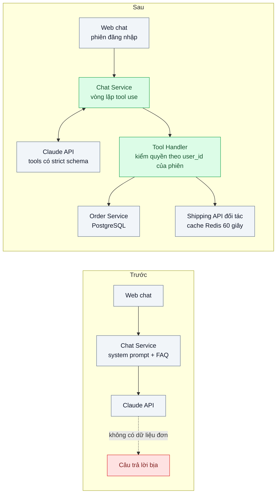
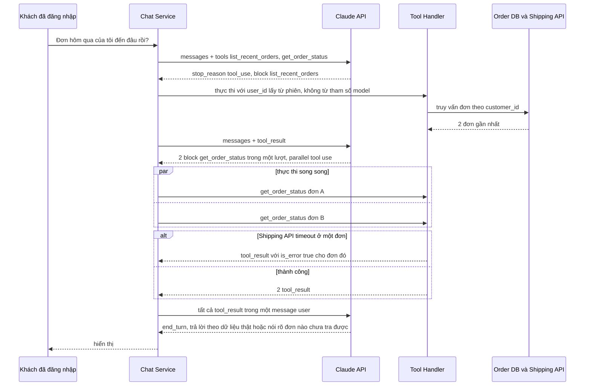

# Tool Use / Function Calling — Agent chăm sóc khách hàng phải tra được trạng thái đơn trong DB nội bộ

| Scope | Mức độ | Trạng thái | Pattern gốc | Cập nhật |
|---|---|---|---|---|
| 11 · backend / AI Agent | 🟢 Cơ bản | 📋 Kế hoạch | Tool Use / Function Calling — Anthropic docs "Tool use"; Yao et al., "ReAct" (2022); Schick et al., "Toolformer" (2023) | 2026-10-06 |

> **Một câu tóm tắt:** Cho model *yêu cầu dữ liệu qua hàm có schema* thay vì đoán, với vòng lặp tool use do harness kiểm soát và quyền truy cập gắn với người dùng đang chat, không gắn với nội dung model sinh ra.

## 1. Bài toán thực tế (What)

**Bối cảnh** *(doanh nghiệp giả định, số liệu minh họa)*
Sàn TMĐT tầm trung, 300.000 đơn/tháng, có chatbot CS chạy trên LLM đọc một đoạn FAQ trong system prompt. Câu hỏi phổ biến nhất (khoảng 40% hội thoại) là "đơn của tôi đến đâu rồi", nhưng chatbot không truy cập được hệ thống đơn hàng: dữ liệu đơn nằm trong PostgreSQL của Order Service, trạng thái vận chuyển lấy qua API đối tác giao hàng.

**Triệu chứng người kinh doanh nhìn thấy**
- Chatbot trả lời chắc nịch "đơn của bạn đang được giao, dự kiến mai nhận" dù đơn đã hủy; khách khiếu nại lên hotline, có ca lên mạng xã hội.
- 60% hội thoại về đơn hàng kết thúc bằng "vui lòng liên hệ hotline", tức chatbot không bớt được tải cho tổng đài.
- Thử nghiệm nối chatbot với DB bằng cách để model viết SQL: một lần model đưa câu lệnh xóa bảng vào câu trả lời; may mắn chưa được chạy.

**Nguyên nhân kỹ thuật**
Model sinh văn bản dựa trên ngữ cảnh; khi ngữ cảnh không có dữ liệu đơn, nó vẫn tạo ra câu trả lời *có dạng* hợp lý. Cách sửa không phải là prompt "đừng bịa", mà là cho model một kênh có cấu trúc để *yêu cầu* dữ liệu: tool use. Model trả về block `tool_use` với tên hàm và tham số JSON đúng schema; harness (code của ta) thực thi, kiểm quyền, rồi trả `tool_result`; model đọc dữ liệu thật và trả lời. Điểm mấu chốt: model không chạy gì cả, mọi truy cập DB đi qua hàm ta viết.

**Ràng buộc**
- Khách chỉ được xem đơn của chính mình; quyền xác định từ phiên đăng nhập, không từ nội dung chat.
- Tool chỉ đọc; hành động ghi (hủy đơn, hoàn tiền) thuộc bài 04 với bước duyệt.
- Mỗi lượt trả lời dưới 6 giây p95; không gọi API đối tác giao hàng quá 1 lần/đơn/phút.
- Tool trả lỗi (đơn không tồn tại, API đối tác timeout) phải thành câu trả lời trung thực, không thành câu đoán.

## 2. Vì sao dùng pattern này (Why)

**Nguyên nhân gốc mà pattern nhắm vào:** Mô hình ngôn ngữ không có cách *lấy* dữ liệu runtime ngoài những gì trong ngữ cảnh; thiếu kênh đó, nó điền chỗ trống bằng văn bản khả dĩ. Tool use biến "điền chỗ trống" thành "yêu cầu có cấu trúc" mà code kiểm soát được.

**Pattern giải quyết thế nào:** Khai báo tool với `name`, `description` nói rõ *khi nào* gọi, và `input_schema` dạng JSON Schema; bật `strict: true` (kèm `additionalProperties: false` và `required`) để tham số luôn đúng schema. Vòng lặp: gửi messages + tools → nhận `stop_reason: "tool_use"` → thực thi từng block `tool_use` (một lượt có thể chứa nhiều block: parallel tool use) → trả *toàn bộ* `tool_result` trong một message user → lặp đến `end_turn`. Tool Runner của SDK (`client.beta.messages.toolRunner` với `betaZodTool`) làm vòng lặp này thay ta; harness vẫn chèn kiểm quyền và ghi log trong hàm `run` của từng tool. Ý tưởng "suy luận xen kẽ với hành động" đến từ ReAct; "model tự quyết khi nào gọi API ngoài" đến từ Toolformer.

**Lựa chọn khác đã cân nhắc**

| Lựa chọn | Giải quyết được gì | Vì sao không chọn (ở bài này) |
|---|---|---|
| Giữ nguyên + tối ưu nhỏ (prompt "không bịa", mở rộng FAQ) | Bớt vài câu bịa lộ liễu | Không có dữ liệu thì không có câu trả lời đúng; bịa chỉ bớt lộ |
| Nhúng sẵn dữ liệu đơn vào prompt khi khách đăng nhập | Không cần vòng lặp tool | Tốn token cho dữ liệu không dùng; đơn đổi trạng thái giữa hội thoại thì cũ; không mở rộng được cho 20 loại dữ liệu |
| Model viết SQL, harness chạy | Linh hoạt nhất | Bề mặt tấn công lớn, khó kiểm quyền theo hàng, khó giải thích; chỉ chấp nhận trong sandbox chỉ đọc có allowlist |
| RAG trên tài liệu đơn hàng | Tốt cho tài liệu tĩnh | Trạng thái đơn là dữ liệu giao dịch đổi liên tục, cần truy vấn chính xác theo khóa, không phải tìm theo ngữ nghĩa (RAG thuộc scope 10) |
| **Tool use có schema, chỉ đọc, kiểm quyền ở harness (chọn)** | Dữ liệu thật, quyền đúng người, log được từng lời gọi | Phải viết và bảo trì tool; cần eval để đo tỉ lệ gọi đúng |

## 3. Thiết kế hệ thống (How)

### 3.1 Kiến trúc trước và sau



### 3.2 Luồng chính



### 3.3 Thành phần và trách nhiệm

| Thành phần | Trách nhiệm | Quyết định thiết kế đáng chú ý |
|---|---|---|
| Chat Service (NestJS) | Giữ lịch sử hội thoại, chạy vòng lặp tool use, ghi `usage` | Dùng Tool Runner của SDK; mỗi tool là một `betaZodTool` có hàm `run` nhận thêm ngữ cảnh phiên |
| Định nghĩa tool | `list_recent_orders`, `get_order_status`, `get_return_policy` với `strict: true` | `description` nói rõ *khi nào* gọi và *không* gọi; tham số không có `customer_id` |
| Tool Handler | Kiểm quyền theo `user_id` của phiên, gọi DB/API, chuẩn hóa lỗi thành `is_error: true` | Mọi truy vấn có `WHERE customer_id = :user_id`; giới hạn số dòng trả về để tiết kiệm token |
| Cache Redis | Giữ kết quả Shipping API 60 giây theo mã đơn | Tôn trọng giới hạn gọi đối tác; TTL ngắn vì trạng thái đổi nhanh |
| Bộ eval | 100 câu hỏi có đáp án đối chiếu DB | Đo tỉ lệ gọi đúng tool, đúng tham số, và tỉ lệ câu trả lời khớp DB |

### 3.4 Điểm dễ sai khi triển khai
- Để model truyền `customer_id` làm tham số rồi tin nó: lỗi phân quyền theo đối tượng (OWASP API1). Định danh lấy từ phiên, tool không có tham số này.
- Trả `tool_result` rải ra nhiều message user: model dần bỏ parallel tool use. Gom tất cả vào một message theo đúng `tool_use_id`.
- Ném exception khi tool lỗi làm vỡ vòng lặp: trả `tool_result` với `is_error: true` để model có cơ hội nói "chưa tra được".
- Mô tả tool chỉ nói "lấy đơn" mà không nói khi nào dùng: model gọi thừa hoặc thiếu. Viết theo hướng dẫn "Writing effective tools for agents".
- Trên `claude-opus-5-5`, ép gọi tool bằng `tool_choice` kiểu `any`/`tool` bị trả 400; dùng `auto`, nêu kỳ vọng trong prompt và giữ `strict: true`.
- Chạy tool khi `stop_reason` là `max_tokens` hoặc `refusal`: input có thể cắt ngang; kiểm `stop_reason` trước, và luôn `JSON.parse` input thay vì so khớp chuỗi.

## 4. Tech stack và tác động (Impact techstack)

| Lớp | Công nghệ chọn | Vì sao chọn | Thay thế tương đương |
|---|---|---|---|
| Ngôn ngữ / runtime | TypeScript strict, Node 20+ | Zod schema sinh `input_schema` và kiểm kiểu tham số tool | Python + Pydantic |
| HTTP app | NestJS | Guard lấy `user_id` từ phiên và đưa vào ngữ cảnh tool | Fastify |
| Model & SDK | `@anthropic-ai/sdk`, Tool Runner (`betaZodTool`, `toolRunner`), `claude-opus-5-5`; so sánh `claude-sonnet-5-5` | Vòng lặp tool use có sẵn; `strict: true` bảo đảm tham số đúng schema; parallel tool use mặc định | Vòng lặp tự viết với `messages.create` |
| Dữ liệu | PostgreSQL 16 (Order Service), Redis 7 (cache Shipping API) | Có sẵn trong stack; Redis TTL 60 giây cho giới hạn gọi đối tác | Memcached |
| Test & eval | Vitest; bộ 100 câu đối chiếu DB | Test tool handler không cần model; eval chạy định kỳ | promptfoo |
| Hạ tầng dev | Docker Compose (PostgreSQL, Redis, mock Shipping API) | Tái hiện timeout của đối tác bằng mock | — |

**Thay đổi so với hệ thống hiện tại:** Thêm vòng lặp tool use và lớp Tool Handler có kiểm quyền; Order Service không đổi schema. Đội vận hành học đọc log tool call (tên tool, tham số, thời gian, lỗi) và theo dõi chi phí qua `usage`.

## 5. Kết quả đầu ra và cách đo (Output impact)

| Chỉ số | Trước (minh họa) | Mục tiêu khi thực hành | Cách đo |
|---|---|---|---|
| Tỉ lệ câu trả lời khớp DB về trạng thái đơn | 35% | ≥ 95% trên bộ eval 100 câu | Script so sánh trạng thái trong câu trả lời với DB sandbox tại thời điểm hỏi |
| Tỉ lệ tool call đúng (đúng tool, tham số hợp lệ) | không có tool | ≥ 95% | Đếm trong log Tool Handler: tool mong đợi theo kịch bản so với tool thực gọi |
| Tỉ lệ chuyển hotline | 60% | < 20% | Đếm câu trả lời chứa chỉ dẫn hotline trên tổng hội thoại về đơn |
| p95 độ trễ một lượt | 4 giây | < 6 giây kể cả 2 vòng tool | Histogram trong Chat Service, tách thời gian model và thời gian tool |
| Token / hội thoại | ~6k | Ghi số thật, theo dõi xu hướng | Cộng `usage` qua các vòng của cùng hội thoại |
| Số lần vượt giới hạn gọi Shipping API | không đo | 0 | Bộ đếm Redis theo mã đơn/phút, test với mock API |

> Số "trước" là minh họa để hình dung bài toán. Số "mục tiêu" chỉ được coi là đạt khi có số đo thật
> ở mục 8 kèm môi trường đo.

**Tác động nghiệp vụ mong đợi:** Khách nhận câu trả lời đúng về đơn của mình trong vài giây; tổng đài bớt cuộc gọi lặp lại; mọi lượt tra cứu đều có log để đối soát khiếu nại.

## 6. Đánh đổi và khi KHÔNG nên dùng

**Đánh đổi**
- Thêm độ trễ và token cho mỗi vòng tool; hội thoại cần 2–3 vòng sẽ chậm hơn một lượt gọi thuần.
- Phải bảo trì định nghĩa tool song song với API nội bộ; đổi API mà quên đổi mô tả tool là lỗi âm thầm.
- Chất lượng phụ thuộc mô tả tool và bộ eval, hai thứ không có trong bất kỳ framework nào.

**Không nên dùng khi**
- Dữ liệu cần là tĩnh và nhỏ (chính sách đổi trả 500 chữ): đưa thẳng vào system prompt kèm prompt caching rẻ hơn.
- Hành động có side effect không đảo ngược mà chưa có bước duyệt: xem bài 04 trước.
- Cần tìm theo ngữ nghĩa trên tài liệu dài: đó là RAG (scope 10), tool use chỉ là lớp gọi.

**Liên quan**
- [01 — Workflow vs Agent](../01-workflow-vs-agent-khi-nao-can-agent/) — quyết định có cần vòng lặp agent không trước khi thêm tool.
- [04 — Human-in-the-loop](../04-human-in-the-loop-agent-tu-gui-email-hoan-tien-cho-khach/) — khi tool bắt đầu ghi dữ liệu.
- [05 — Prompt Injection Defense](../05-prompt-injection-khach-nhap-bo-qua-huong-dan-giam-gia-100/) — dữ liệu từ tool là dữ liệu, không phải lệnh.
- [06 — MCP](../06-mcp-ket-noi-agent-voi-crm-erp-theo-chuan/) — chuẩn hóa tool khi có nhiều hệ thống nội bộ.
- Scope 19 (`../../19-backend-frontend-authenticate/`) — định danh người dùng cho tool.

## 7. Cơ sở tham khảo

- Anthropic docs, "Tool use overview" — https://platform.claude.com/docs/en/agents-and-tools/tool-use/overview — định nghĩa tool, `strict`, parallel tool use, `tool_result` và `is_error`, các `stop_reason`.
- Anthropic, "Writing effective tools for agents — with agents", 2025-09 — https://www.anthropic.com/engineering/writing-tools-for-agents — cách viết mô tả tool để model gọi đúng lúc, trả kết quả gọn để tiết kiệm token.
- Yao et al., "ReAct: Synergizing Reasoning and Acting in Language Models", 2022 — nền tảng của vòng lặp suy luận xen kẽ hành động mà tool use hiện thực.
- Schick et al., "Toolformer: Language Models Can Teach Themselves to Use Tools", 2023 — model tự quyết khi nào gọi API ngoài; lý do tool cần mô tả rõ điều kiện gọi.
- OWASP API Security Top 10 (2023), API1 Broken Object Level Authorization — https://owasp.org/API-Security/ — lý do định danh lấy từ phiên, không từ tham số model.

## 8. Kế hoạch thực hành

- [ ] Bước 1: Docker Compose với PostgreSQL (bảng orders, 50 khách, 300 đơn seed), Redis, mock Shipping API có thể bật timeout; chatbot "cũ" chỉ có FAQ để tái hiện câu trả lời bịa.
- [ ] Bước 2: Đo "trước" trên bộ 100 câu hỏi: tỉ lệ khớp DB, tỉ lệ chuyển hotline, p95.
- [ ] Bước 3: Áp dụng pattern: 3 tool `betaZodTool` với `strict: true`, Tool Handler kiểm quyền theo phiên, cache Redis, Tool Runner.
- [ ] Bước 4: Đo "sau" cùng bộ 100 câu, ghi vào mục 5 kèm môi trường (model, ngày, phiên bản tool).
- [ ] Bước 5: Test Vitest chứng minh: không truy vấn được đơn của khách khác dù prompt yêu cầu; nhiều `tool_use` trong một lượt được trả về trong một message; timeout đối tác thành `is_error` và câu trả lời nói rõ chưa tra được.

**Cấu trúc code dự kiến**
```text
src/
  chat/chat.service.ts          # vòng lặp tool use bằng Tool Runner
  tools/list-recent-orders.ts   # betaZodTool, strict
  tools/get-order-status.ts
  tools/get-return-policy.ts
  tools/tool-context.ts         # user_id từ phiên đưa vào hàm run
  infra/shipping-client.ts      # gọi đối tác + cache Redis 60 giây
  eval/run-eval.ts              # 100 câu, so với DB
test/
  tools.test.ts
  chat.loop.test.ts
docker-compose.yml
```

**Cách chạy** *(điền khi bắt đầu code)*
```bash
docker compose up -d
pnpm install && pnpm test
pnpm eval
```
