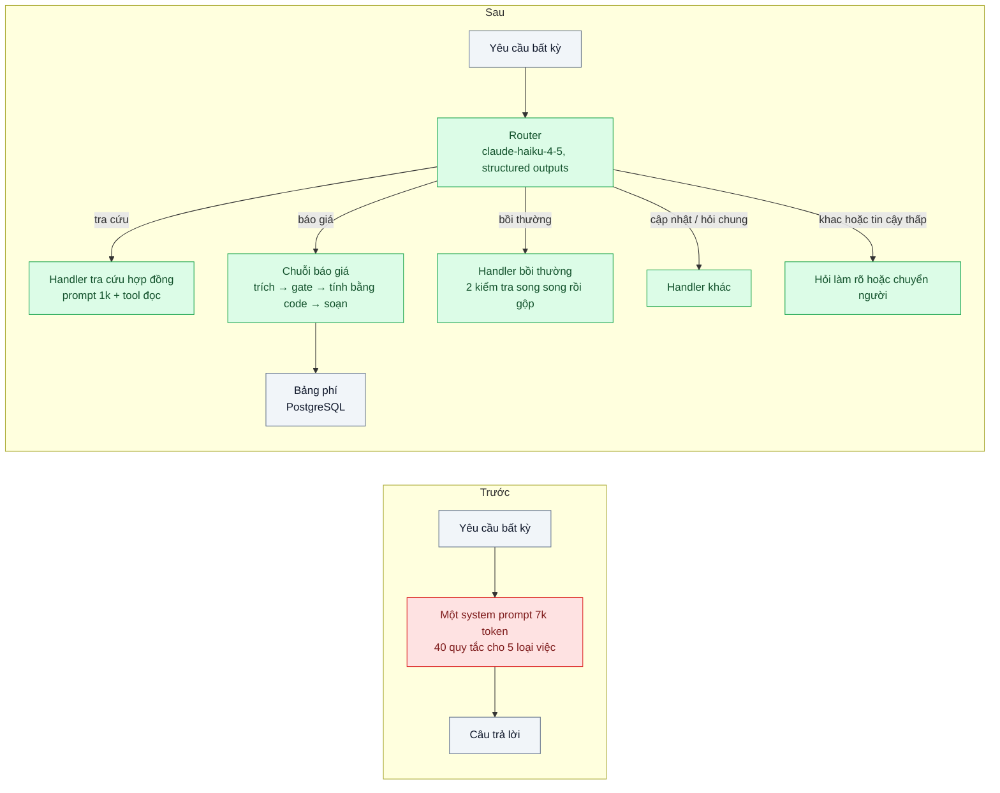
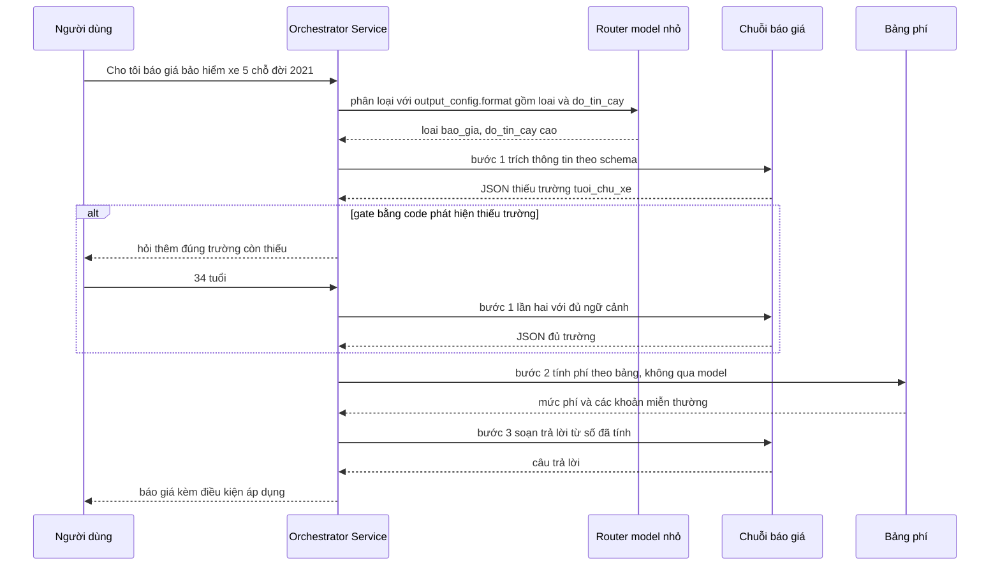

# Prompt Chaining & Routing — Một prompt khổng lồ lo 5 loại yêu cầu, sửa loại này hỏng loại kia

| Scope | Mức độ | Trạng thái | Pattern gốc | Cập nhật |
|---|---|---|---|---|
| 11 · backend / AI Agent | 🟢 Cơ bản | 📋 Kế hoạch | Prompt Chaining, Routing, Parallelization (workflows) — Anthropic, "Building effective agents" (2024) | 2026-10-06 |

> **Một câu tóm tắt:** Tách một system prompt "lo tất cả" thành một router nhỏ phân loại yêu cầu và các prompt chuyên biệt nối thành chuỗi có kiểm tra giữa bước, để mỗi loại yêu cầu được sửa, đo và phát hành độc lập.

## 1. Bài toán thực tế (What)

**Bối cảnh** *(doanh nghiệp giả định, số liệu minh họa)*
Công ty bảo hiểm phi nhân thọ có trợ lý số cho đại lý và khách hàng, xử lý 5 loại yêu cầu: tra cứu hợp đồng, báo giá sơ bộ, hướng dẫn bồi thường, cập nhật thông tin, hỏi chung về sản phẩm. Toàn bộ quy tắc nằm trong một system prompt 7.000 token với 40 điều "nếu... thì...", kèm 12 ví dụ. Khoảng 2.500 yêu cầu/ngày.

**Triệu chứng người kinh doanh nhìn thấy**
- Sửa quy tắc báo giá cho sản phẩm mới, tuần sau phát hiện tỉ lệ trả lời đúng của hướng dẫn bồi thường tụt từ 88% xuống 74%; không ai liên hệ được hai việc với nhau.
- Mỗi lần đổi prompt phải "test tay" cả 5 loại, một đợt phát hành mất 3 tuần; đội kinh doanh chờ.
- Hóa đơn API cao vì mọi câu hỏi "giờ làm việc của chi nhánh" cũng kéo theo 7.000 token quy tắc.
- Câu trả lời báo giá thiếu trường (chưa hỏi tuổi người được bảo hiểm) nhưng vẫn đưa ra con số.

**Nguyên nhân kỹ thuật**
Một prompt phục vụ 5 nhiệm vụ là 5 bộ quy tắc cạnh tranh sự chú ý của model trong cùng một ngữ cảnh; thêm điều cho nhiệm vụ A đổi phân phối hành vi của nhiệm vụ B. Không có ranh giới nên không có đơn vị để đo, để sửa, để phát hành riêng. Việc báo giá vốn là chuỗi nhiều bước (thu thập thông tin → tính theo bảng phí → soạn trả lời) lại bị ép vào một lượt gọi, nên bước kiểm tra "đủ dữ liệu chưa" không tồn tại.

**Ràng buộc**
- Không đổi giao diện chat; người dùng vẫn gõ tự nhiên, không chọn menu.
- Bảng phí là nguồn sự thật, con số báo giá phải do code tính, model chỉ soạn lời.
- Độ trễ p95 không vượt 8 giây dù đi qua nhiều bước.
- Mỗi loại yêu cầu phải có bộ eval riêng và có thể phát hành riêng.

## 2. Vì sao dùng pattern này (Why)

**Nguyên nhân gốc mà pattern nhắm vào:** Thiếu ranh giới giữa các nhiệm vụ trong cùng một ngữ cảnh. Routing dựng ranh giới đó bằng một bước phân loại; prompt chaining dựng ranh giới giữa các bước của một nhiệm vụ nhiều bước.

**Pattern giải quyết thế nào:** Bước đầu là *router*: một lượt gọi model nhỏ (`claude-haiku-4-5`) với structured outputs trả về đúng một trong 5 loại (hoặc `khac`) kèm độ tin cậy. Mỗi loại có *handler* riêng với system prompt ngắn (1.000–1.500 token), bộ eval riêng và phiên bản riêng. Handler báo giá là *chuỗi*: bước 1 trích thông tin có schema → *gate* bằng code kiểm tra đủ trường chưa, thiếu thì hỏi lại → bước 2 code tính phí theo bảng → bước 3 model soạn câu trả lời từ con số đã tính. Handler bồi thường dùng *parallelization* dạng sectioning: kiểm tra giấy tờ và kiểm tra điều khoản chạy song song rồi gộp. Vì mỗi route có prompt cố định, prompt caching (`cache_control`) đạt hiệu quả cao và mỗi request chỉ mang quy tắc của đúng loại đó.

**Lựa chọn khác đã cân nhắc**

| Lựa chọn | Giải quyết được gì | Vì sao không chọn (ở bài này) |
|---|---|---|
| Giữ nguyên + tối ưu nhỏ (sắp lại prompt, thêm tiêu đề từng phần, thêm ví dụ) | Dễ làm, không đổi kiến trúc | Vẫn một ngữ cảnh chung; vẫn không đo và phát hành riêng được; token/request không đổi |
| Một agent với 5 tool "chuyên gia" tự chọn | Model tự định tuyến | Tốn thêm vòng lặp cho việc code quyết được; định tuyến ngầm, khó eval; xem bài 01 |
| Người dùng tự chọn loại yêu cầu bằng menu | Không cần router | Đổi trải nghiệm; người dùng chọn sai hoặc yêu cầu lẫn nhiều loại |
| Fine-tune một model cho cả 5 việc | Có thể gọn hơn | Chi phí dữ liệu và vận hành cao; đổi quy tắc nghiệp vụ phải huấn luyện lại |
| **Router + handler chuyên biệt + chaining có gate (chọn)** | Ranh giới rõ, đo và sửa độc lập, token theo đúng việc | Thêm một lượt gọi router và độ phức tạp điều phối |

## 3. Thiết kế hệ thống (How)

### 3.1 Kiến trúc trước và sau



### 3.2 Luồng chính



### 3.3 Thành phần và trách nhiệm

| Thành phần | Trách nhiệm | Quyết định thiết kế đáng chú ý |
|---|---|---|
| Router | Gán một trong 5 loại hoặc `khac`, kèm độ tin cậy | Model nhỏ, prompt ngắn, enum trong schema; ngưỡng tin cậy hiệu chỉnh bằng bộ eval |
| Orchestrator Service (NestJS) | Chọn handler, chạy chuỗi, giữ trạng thái hội thoại | Mỗi handler là module độc lập với phiên bản prompt riêng |
| Handler / chuỗi | Thực hiện đúng một loại việc với prompt ngắn, cố định | Prompt đặt trong repo kèm bộ eval; `cache_control` trên system prompt |
| Gate bằng code | Kiểm tra đủ trường, đúng miền giá trị, trước khi sang bước sau | Thiếu thì hỏi lại đúng trường, không để model tự "đoán cho đủ" |
| Bộ tính phí | Tính theo bảng phí trong PostgreSQL | Con số không bao giờ do model sinh; test như code nghiệp vụ thường |
| Bộ eval theo route | 5 bộ câu hỏi có đáp án, chạy khi đổi prompt của route đó | Phát hành route A không cần test lại route B bằng tay |

### 3.4 Điểm dễ sai khi triển khai
- Router quá tham vọng: cố trích luôn thông tin nghiệp vụ. Router chỉ phân loại; trích xuất để handler làm.
- Không có nhánh `khac`/tin cậy thấp: yêu cầu lạ bị ép vào loại gần nhất và trả lời sai tự tin.
- Gate để model tự kiểm: "nếu thiếu thì hỏi" trong prompt không đáng tin bằng vài dòng code kiểm tra schema.
- Prompt mỗi route vẫn dài vì copy toàn bộ quy tắc cũ "cho chắc": đo token/request để ép ngắn lại.
- Chèn ngữ cảnh động (tên khách, ngày) vào đầu system prompt làm mất cache; để ở message hoặc cuối prefix.
- Chuỗi dài làm p95 tăng: đo từng bước, dùng model nhỏ cho bước trích, giữ model lớn cho bước soạn.

## 4. Tech stack và tác động (Impact techstack)

| Lớp | Công nghệ chọn | Vì sao chọn | Thay thế tương đương |
|---|---|---|---|
| Ngôn ngữ / runtime | TypeScript strict, Node 20+ | Schema Zod dùng chung cho router, gate và handler | Python + Pydantic |
| HTTP app | NestJS | Mỗi handler là module có provider riêng, dễ bật/tắt theo phiên bản | Fastify |
| Model | `@anthropic-ai/sdk`; router và bước trích dùng `claude-haiku-4-5`; bước soạn dùng `claude-opus-5-5` hoặc `claude-sonnet-5-5` theo eval | Structured outputs (`output_config.format`) cho router và bước trích; prompt caching (`cache_control`) trên system prompt từng route | Model Gateway (scope 20) khi cần đa provider |
| Dữ liệu | PostgreSQL 16 (bảng phí, hợp đồng), Redis 7 (trạng thái hội thoại) | Bảng phí là nguồn sự thật; Redis giữ trạng thái chuỗi giữa các lượt | — |
| Eval & test | Vitest, 5 bộ eval theo route, 250 câu cho router | Chạy trong CI theo route bị đổi | promptfoo |
| Hạ tầng dev | Docker Compose | — | — |

**Thay đổi so với hệ thống hiện tại:** Thêm router và lớp orchestrator; prompt tách thành 5 file có phiên bản; thêm gate và bộ tính phí bằng code. Đội vận hành học cách phát hành theo route và đọc confusion matrix của router.

## 5. Kết quả đầu ra và cách đo (Output impact)

| Chỉ số | Trước (minh họa) | Mục tiêu khi thực hành | Cách đo |
|---|---|---|---|
| Độ chính xác router | không có | ≥ 95% trên 250 câu gán nhãn | Vitest chạy router, in confusion matrix 6 lớp (5 loại + `khac`) |
| Hồi quy chéo khi sửa một route | 88% → 74% ở route khác | 0 route khác thay đổi quá sai số đo | Chạy 5 bộ eval trước/sau khi sửa một route, so từng route |
| Token đầu vào / request | ~7.500 | ≤ 2.500 trung vị | `usage.input_tokens` theo route, kèm `cache_read_input_tokens` |
| Tỉ lệ báo giá thiếu trường mà vẫn ra số | 15% | 0% | Test gate với kịch bản thiếu từng trường; đếm trong log |
| p95 độ trễ | 5 giây | ≤ 8 giây cho chuỗi 3 bước | Histogram theo bước trong Orchestrator |
| Thời gian phát hành một thay đổi quy tắc | 3 tuần | ≤ 2 ngày | Ghi ngày yêu cầu và ngày phát hành của 5 thay đổi liên tiếp |

> Số "trước" là minh họa để hình dung bài toán. Số "mục tiêu" chỉ được coi là đạt khi có số đo thật
> ở mục 8 kèm môi trường đo.

**Tác động nghiệp vụ mong đợi:** Đội sản phẩm bảo hiểm đổi quy tắc một dòng nghiệp vụ mà không lo hỏng dòng khác; chi phí theo đúng độ phức tạp của câu hỏi; báo giá không bao giờ ra số khi thiếu dữ liệu.

## 6. Đánh đổi và khi KHÔNG nên dùng

**Đánh đổi**
- Thêm một lượt gọi router cho mọi yêu cầu (dù rẻ) và thêm một lớp điều phối phải bảo trì.
- Yêu cầu lẫn nhiều loại trong một câu cần xử lý riêng (tách câu hoặc chuyển người).
- Chuỗi dài hơn làm độ trễ tăng; phải đo từng bước để biết bước nào đáng tối ưu.

**Không nên dùng khi**
- Chỉ có một hoặc hai loại yêu cầu gần nhau: một prompt tốt là đủ, router là thừa.
- Các loại yêu cầu không phân biệt được rõ ở đầu vào (phải hỏi thêm mới biết): router sẽ sai nhiều; cân nhắc hỏi làm rõ trước hoặc dùng agent (bài 01).
- Nhiệm vụ không chia được thành bước có đầu ra kiểm tra được: chaining không có gate thì chỉ là tốn thêm lượt gọi.

**Liên quan**
- [01 — Workflow vs Agent](../01-workflow-vs-agent-khi-nao-can-agent/) — routing là một dạng workflow; đọc trước để quyết không dùng agent.
- [02 — Tool Use](../02-tool-use-agent-tra-cuu-don-hang-trong-db-noi-bo/) — handler tra cứu hợp đồng dùng tool đọc.
- [08 — Orchestrator-Workers](../08-orchestrator-workers-agent-nghien-cuu-thi-truong-nhieu-nguon/) — khi số bước không biết trước, router tĩnh không đủ.
- Scope 20 (`../../20-backend-ai-framework-system-design/`) — prompt as code, eval trong CI, prompt caching.

## 7. Cơ sở tham khảo

- Anthropic, "Building effective agents", 2024-12 — https://www.anthropic.com/engineering/building-effective-agents — mô tả ba workflow dùng ở bài: prompt chaining (có gate giữa bước), routing (phân loại rồi chuyển handler chuyên biệt), parallelization (sectioning).
- Anthropic docs, "Structured outputs" — https://platform.claude.com/docs/en/build-with-claude/structured-outputs — `output_config.format` cho router và bước trích thông tin.
- Anthropic docs, "Prompt caching" — https://platform.claude.com/docs/en/build-with-claude/prompt-caching — `cache_control`, cách đọc `cache_read_input_tokens` để xác nhận prompt từng route được cache.
- Anthropic docs, "Models overview" — https://platform.claude.com/docs/en/about-claude/models/overview — chọn `claude-haiku-4-5` cho router và `claude-opus-5-5` cho bước soạn.

## 8. Kế hoạch thực hành

- [ ] Bước 1: Dựng PostgreSQL (bảng phí, 100 hợp đồng mẫu) bằng Docker Compose; viết "prompt khổng lồ" 7k token và 5 bộ eval (50 câu/loại) + 250 câu cho router.
- [ ] Bước 2: Đo "trước": chạy 5 bộ eval qua prompt khổng lồ; sửa một quy tắc báo giá rồi chạy lại để ghi hồi quy chéo; ghi token/request.
- [ ] Bước 3: Áp dụng pattern: router với structured outputs; 5 handler với prompt riêng; chuỗi báo giá có gate và bộ tính phí bằng code; parallel cho bồi thường; `cache_control` trên system prompt mỗi route.
- [ ] Bước 4: Đo "sau": độ chính xác router, 5 bộ eval, token/request, p95 theo bước; lặp lại thí nghiệm "sửa một route" để chứng minh không hồi quy chéo.
- [ ] Bước 5: Test Vitest: gate từ chối khi thiếu trường; con số báo giá bằng đúng bảng phí; router trả `khac` cho câu ngoài phạm vi.

**Cấu trúc code dự kiến**
```text
src/
  router/router.ts                 # claude-haiku-4-5, output_config.format
  orchestrator/orchestrator.ts     # chọn handler, chạy chuỗi, trạng thái
  handlers/quote/extract.step.ts   # bước 1 trích, schema Zod
  handlers/quote/gate.ts           # kiểm tra đủ trường bằng code
  handlers/quote/price.ts          # tính phí từ bảng, không gọi model
  handlers/quote/compose.step.ts   # bước 3 soạn trả lời
  handlers/claim/*.ts              # 2 kiểm tra song song + gộp
  prompts/<route>/v1.md            # prompt có phiên bản theo route
  eval/<route>.eval.ts
test/
docker-compose.yml
```

**Cách chạy** *(điền khi bắt đầu code)*
```bash
docker compose up -d
pnpm install && pnpm test
pnpm eval --route quote
```
