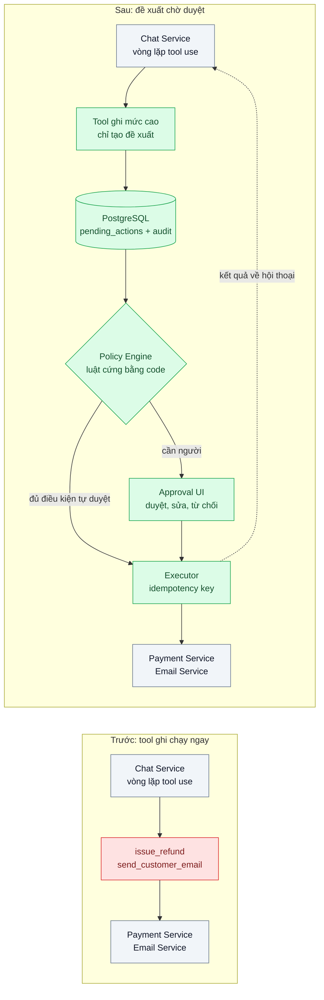
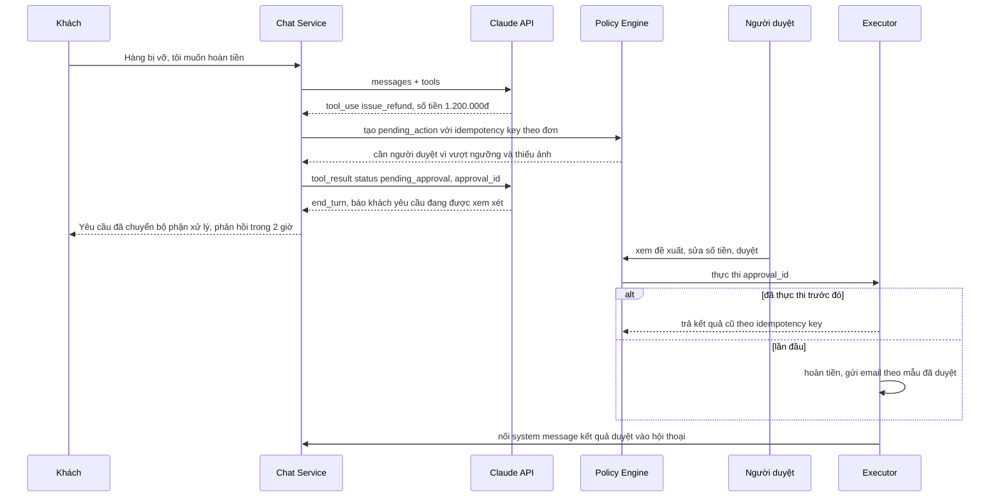

# Human-in-the-loop Approval — Agent tự gửi email xác nhận hoàn tiền mà không ai duyệt

| Scope | Mức độ | Trạng thái | Pattern gốc | Cập nhật |
|---|---|---|---|---|
| 11 · backend / AI Agent | 🟡 Trung bình | 📋 Kế hoạch | Human-in-the-loop Approval — Anthropic, "Building effective agents" (2024, checkpoints); OWASP LLM Top 10 (2025) — LLM06 Excessive Agency; LangGraph docs "Human-in-the-loop" | 2026-10-06 |

> **Một câu tóm tắt:** Tách tool của agent theo mức rủi ro; tool không đảo ngược được (hoàn tiền, gửi email cam kết) không chạy ngay mà sinh ra một *đề xuất hành động* chờ người duyệt, được thực thi idempotent sau khi duyệt và báo kết quả lại cho agent.

## 1. Bài toán thực tế (What)

**Bối cảnh** *(doanh nghiệp giả định, số liệu minh họa)*
Sàn TMĐT tầm trung có agent chăm sóc khách hàng chạy trên NestJS và Anthropic SDK, xử lý khoảng 9.000 hội thoại/ngày. Sau bài 02, agent tra được đơn hàng; đội sản phẩm thêm tiếp hai tool ghi: `issue_refund` (gọi Payment Service hoàn tiền) và `send_customer_email` (gửi email từ địa chỉ chính thức của sàn). Mục tiêu là "khép vòng" khiếu nại mà không cần nhân viên.

**Triệu chứng người kinh doanh nhìn thấy**
- Trong tuần đầu, agent hoàn 37 đơn (minh họa), trong đó 6 đơn khách chỉ *nói* là hàng hỏng, không có ảnh; tổng 18 triệu đồng không thu hồi được.
- Agent gửi email "Chúng tôi xác nhận hoàn 100% và tặng voucher 500.000đ" — voucher không tồn tại trong chính sách; khách chụp màn hình đòi thực hiện.
- Một lần mạng chập chờn, vòng lặp chạy lại và gọi `issue_refund` hai lần cho cùng đơn.
- Đội tài chính yêu cầu tắt toàn bộ tính năng vì không ai biết agent đã cam kết gì với ai.

**Nguyên nhân kỹ thuật**
Agent được trao quyền hành động vượt quá điều cần thiết (OWASP gọi là *Excessive Agency*): tool có side effect không đảo ngược được chạy ngay khi model quyết định, không có điểm dừng để con người kiểm tra. Model có thể đúng phần lớn thời gian, nhưng với hành động tốn tiền hoặc tạo cam kết pháp lý, "phần lớn" là không đủ. Thêm vào đó, tool ghi không có idempotency key nên lặp vòng là lặp tiền.

**Ràng buộc**
- Khách không phải chờ trong hội thoại: agent trả lời ngay "yêu cầu đang được xem xét" và thông báo kết quả sau.
- Hoàn tiền dưới ngưỡng nhỏ, đủ điều kiện theo luật cứng (đơn đã hủy, chưa giao) được tự động; mọi trường hợp khác phải có người duyệt trong giờ làm việc, SLA 2 giờ.
- Mọi đề xuất, quyết định duyệt và thực thi phải có audit log truy được tới hội thoại gốc.
- Không thực thi trùng dù vòng lặp, worker hay người duyệt bấm hai lần.

## 2. Vì sao dùng pattern này (Why)

**Nguyên nhân gốc mà pattern nhắm vào:** Quyết định *có hành động không* và quyền *thực thi hành động* đang nằm cùng một chỗ là model. "Building effective agents" khuyến nghị agent có điểm dừng (checkpoint) để con người phản hồi, đặc biệt trước bước có rủi ro; OWASP LLM06 khuyến nghị tối thiểu hóa quyền và yêu cầu người phê duyệt cho hành động tác động lớn.

**Pattern giải quyết thế nào:** Phân loại tool thành ba mức: *đọc* (chạy ngay), *ghi đảo ngược được* (chạy ngay, có log), *không đảo ngược được* (chỉ tạo đề xuất). Với mức thứ ba, hàm `run` của tool không gọi Payment Service mà ghi một bản ghi `pending_action` (loại, tham số, lý do model đưa ra, bản nháp email, idempotency key) rồi trả `tool_result` dạng `{status: "pending_approval", approval_id}`. Vòng lặp tool use vẫn đóng đúng quy tắc (mọi `tool_use` có `tool_result`), agent báo khách rằng yêu cầu đang chờ duyệt. Một *Policy Engine* bằng code quyết định đề xuất nào được tự duyệt theo luật cứng, đề xuất nào vào hàng đợi người duyệt. Người duyệt xem đề xuất, sửa số tiền hoặc nội dung email, duyệt hay từ chối. *Executor* thực thi với idempotency key, ghi kết quả, và nối một mid-conversation system message vào hội thoại để lần sau khách quay lại agent biết kết quả. Model không bao giờ là bên cuối cùng bấm nút.

**Lựa chọn khác đã cân nhắc**

| Lựa chọn | Giải quyết được gì | Vì sao không chọn (ở bài này) |
|---|---|---|
| Giữ nguyên + tối ưu nhỏ (prompt "hãy hỏi lại khách trước khi hoàn tiền", giới hạn số tiền trong prompt) | Bớt vài ca lộ liễu | Xác nhận do model tự làm vẫn là model quyết định; prompt có thể bị thao túng (bài 05) |
| Bỏ hẳn tool ghi, agent chỉ tạo ticket cho nhân viên làm tay | An toàn tuyệt đối | Mất phần tự động cho ca đơn giản; nhân viên phải đọc lại hội thoại để hiểu yêu cầu |
| Tự thực thi rồi kiểm tra sau (post-hoc audit) | Không chậm khách | Tiền đã đi, email đã gửi; kiểm tra sau chỉ phát hiện, không ngăn được |
| Dùng `interrupt` của LangGraph | Có sẵn cơ chế dừng/tiếp tục đồ thị | Phải chuyển cả harness sang LangGraph; bài này giữ Tool Runner của SDK và tự lưu trạng thái trong PostgreSQL |
| **Đề xuất hành động + Policy Engine + hàng đợi duyệt + Executor idempotent (chọn)** | Ngăn hành động sai trước khi xảy ra, tự động phần an toàn, có audit | Thêm độ trễ cho ca cần duyệt; cần UI duyệt và người trực |

## 3. Thiết kế hệ thống (How)

### 3.1 Kiến trúc trước và sau



### 3.2 Luồng chính



### 3.3 Thành phần và trách nhiệm

| Thành phần | Trách nhiệm | Quyết định thiết kế đáng chú ý |
|---|---|---|
| Danh mục tool theo mức rủi ro | Gắn mỗi tool một mức `read` / `reversible` / `irreversible` | Mức do đội sản phẩm và tài chính quyết, khai báo trong code, không để model tự chọn |
| Tool ghi mức cao | Ghi `pending_action`, trả `tool_result` trạng thái chờ | Schema `strict: true`; tham số định danh khách lấy từ phiên như bài 02 |
| Policy Engine | Áp luật cứng: ngưỡng tiền, trạng thái đơn, lịch sử hoàn tiền của khách | Code thuần, có unit test; model không có quyền bỏ qua |
| Approval UI | Hiện đề xuất, lý do model nêu, trích hội thoại, cho sửa và duyệt | Người duyệt sửa được số tiền và nội dung; lưu cả bản gốc và bản sửa để làm dữ liệu eval |
| Executor | Thực thi sau duyệt, idempotent, ghi audit | Idempotency key = loại hành động + mã đơn; khóa hàng bằng `SELECT ... FOR UPDATE` |
| Báo kết quả về hội thoại | Nối mid-conversation system message (role `system` trong `messages`) mô tả quyết định | Không sửa system prompt gốc để giữ prompt cache; kênh của hệ thống, không phải lời khách |

### 3.4 Điểm dễ sai khi triển khai
- Giữ vòng lặp chờ người duyệt trong cùng request HTTP: request treo hàng giờ. Trả `tool_result` trạng thái chờ ngay, phần thực thi chạy bất đồng bộ.
- Bỏ `tool_result` cho `tool_use` đang chờ duyệt: lượt gọi API kế tiếp bị lỗi vì thiếu kết quả cho `tool_use_id`.
- Cho Policy Engine đọc "lý do" model viết để quyết định tự duyệt: lý do là văn bản do model sinh, có thể bị khách thao túng. Chỉ dựa vào dữ liệu hệ thống (trạng thái đơn, số tiền).
- Người duyệt bị ngập yêu cầu nên bấm duyệt hàng loạt: theo dõi tỉ lệ cần duyệt, thời gian duyệt mỗi đề xuất, nâng ngưỡng tự duyệt dựa trên số đo chứ không dựa trên cảm giác.
- Executor không idempotent: worker retry hoặc bấm duyệt hai lần là hoàn tiền hai lần (xem bài Idempotency Key ở scope 01).

## 4. Tech stack và tác động (Impact techstack)

| Lớp | Công nghệ chọn | Vì sao chọn | Thay thế tương đương |
|---|---|---|---|
| Ngôn ngữ / runtime | TypeScript strict, Node 20+ | Kiểu hóa trạng thái đề xuất (`pending` / `approved` / `rejected` / `executed`) | Python |
| HTTP app | NestJS | Module riêng cho approval, guard phân quyền người duyệt | Fastify |
| Model & SDK | `@anthropic-ai/sdk`, Tool Runner (`betaZodTool`) với `strict: true`; `claude-opus-5-5` | Chặn ở hàm `run` của tool; mid-conversation system message để báo kết quả mà không phá cache | Vòng lặp tự viết với `messages.create` |
| Lưu trạng thái | PostgreSQL 16 (`pending_actions`, `audit_log`) | Transaction + khóa hàng cho Executor; truy vấn audit dễ | — |
| Hàng đợi thực thi | PGMQ (hoặc BullMQ) | Thực thi sau duyệt bất đồng bộ, có retry | Kafka, SQS |
| Approval UI | Next.js trang nội bộ | Nhanh dựng, dùng chung đăng nhập nội bộ | Retool nội bộ |

**Thay đổi so với hệ thống hiện tại:** Thêm bảng `pending_actions`, Policy Engine, Approval UI, Executor; sửa tool ghi để chỉ tạo đề xuất. Đội CS có thêm vai trò người duyệt và ca trực; đội tài chính sở hữu bảng luật tự duyệt.

## 5. Kết quả đầu ra và cách đo (Output impact)

| Chỉ số | Trước (minh họa) | Mục tiêu khi thực hành | Cách đo |
|---|---|---|---|
| Hành động không đảo ngược thực thi mà không qua duyệt hoặc luật tự duyệt | 100% | 0 | Truy vấn `audit_log`: hành động `executed` không có `approved_by` hoặc `auto_rule_id` |
| Hoàn tiền trùng cho cùng đơn | có xảy ra | 0 | Test Vitest bắn hai lần duyệt và hai lần retry worker; đếm giao dịch ở Payment mock |
| Số lần cần duyệt / 100 hội thoại | không đo | ghi số thật, theo dõi xu hướng | Đếm `pending_actions` theo trạng thái chia số hội thoại |
| Tỉ lệ đề xuất bị sửa hoặc từ chối | không đo | ghi số thật làm dữ liệu eval | So sánh tham số gốc và tham số sau duyệt trong `pending_actions` |
| Thời gian chờ duyệt p50 / p95 | không có | p95 < 2 giờ trong giờ làm việc | Hiệu `approved_at - created_at` |
| Cam kết ngoài chính sách trong email gửi khách | 4 ca/tuần | 0 | Bộ 50 kịch bản eval có khách đòi voucher; kiểm email đầu ra so với danh mục chính sách |

> Số "trước" là minh họa để hình dung bài toán. Số "mục tiêu" chỉ được coi là đạt khi có số đo thật
> ở mục 8 kèm môi trường đo.

**Tác động nghiệp vụ mong đợi:** Giữ được phần tự động cho ca an toàn, chặn mất tiền và cam kết sai trước khi xảy ra, và cho tài chính một audit log trả lời được "ai đã duyệt khoản này".

## 6. Đánh đổi và khi KHÔNG nên dùng

**Đánh đổi**
- Ca cần duyệt chậm hơn; nếu tỉ lệ cần duyệt quá cao, người duyệt trở thành nút cổ chai và bắt đầu duyệt cho có.
- Thêm trạng thái bất đồng bộ (đề xuất, hàng đợi, thông báo) phải vận hành và giám sát.

**Không nên dùng khi**
- Agent chỉ có tool đọc: không có gì để duyệt, thêm hàng đợi là thừa.
- Hành động đảo ngược được và rẻ (gắn nhãn ticket, lưu nháp): log + hoàn tác là đủ.
- Khối lượng lớn đến mức không thể có người duyệt: đó là tín hiệu nên thu hẹp quyền của agent hoặc chuyển thành workflow có luật cứng, không phải bỏ bước duyệt.

**Liên quan**
- [02 — Tool Use](../02-tool-use-agent-tra-cuu-don-hang-trong-db-noi-bo/) — nền tảng vòng lặp tool use và kiểm quyền theo phiên.
- [05 — Prompt Injection Defense](../05-prompt-injection-khach-nhap-bo-qua-huong-dan-giam-gia-100/) — vì sao không tin "lý do" model đưa ra.
- [07 — Agent Memory](../07-agent-memory-khach-quay-lai-agent-quen-het/) — agent nhớ kết quả duyệt khi khách quay lại.
- [Idempotency Key (scope 01)](../../01-frontend-backend-transporter/03-idempotency-key-bam-thanh-toan-hai-lan/) — Executor không thực thi trùng.

## 7. Cơ sở tham khảo

- Anthropic, "Building effective agents", 2024-12 — https://www.anthropic.com/engineering/building-effective-agents — agent nên có checkpoint để con người phản hồi; thử nghiệm trong sandbox và đặt điểm dừng.
- OWASP Top 10 for LLM Applications (2025), LLM06 Excessive Agency — https://genai.owasp.org/ — tối thiểu hóa chức năng và quyền của tool, yêu cầu người phê duyệt cho hành động tác động lớn.
- LangGraph docs, "Human-in-the-loop" — https://langchain-ai.github.io/langgraph/ — mô hình dừng đồ thị chờ người rồi tiếp tục; dùng để so sánh với cách tự lưu trạng thái (cần xác minh đường dẫn trang con).
- Anthropic docs, "Tool use overview" — https://platform.claude.com/docs/en/agents-and-tools/tool-use/overview — quy tắc mọi `tool_use` phải có `tool_result`, `strict`, `is_error`.
- Anthropic docs, "Prompt caching" — https://platform.claude.com/docs/en/build-with-claude/prompt-caching — mid-conversation system messages để nối chỉ dẫn của hệ thống mà không sửa phần đầu đã cache.

## 8. Kế hoạch thực hành

- [ ] Bước 1: Docker Compose với PostgreSQL và Payment/Email mock; agent "cũ" có `issue_refund` chạy ngay; bộ 50 kịch bản (khách đòi hoàn tiền không bằng chứng, đòi voucher, mạng chập chờn gây retry).
- [ ] Bước 2: Đo "trước": số hành động thực thi không duyệt, số hoàn tiền trùng, số cam kết ngoài chính sách.
- [ ] Bước 3: Áp dụng pattern: phân mức tool, `pending_actions`, Policy Engine, Approval UI tối giản, Executor idempotent qua PGMQ, báo kết quả bằng mid-conversation system message.
- [ ] Bước 4: Đo "sau" cùng 50 kịch bản; ghi vào mục 5 kèm model, ngày, phiên bản luật.
- [ ] Bước 5: Test Vitest chứng minh: tool mức cao không gọi Payment; duyệt hai lần chỉ hoàn một lần; Policy Engine không tự duyệt khi số tiền vượt ngưỡng dù "lý do" nói gì.

**Cấu trúc code dự kiến**
```text
src/
  chat/chat.service.ts            # Tool Runner, nối system message kết quả duyệt
  tools/risk-catalog.ts           # mức rủi ro của từng tool
  tools/issue-refund.tool.ts      # chỉ tạo pending_action
  approval/policy-engine.ts       # luật tự duyệt bằng code
  approval/approval.controller.ts # API cho Approval UI
  approval/action-executor.ts     # thực thi idempotent
test/
  policy-engine.test.ts
  action-executor.test.ts
docker-compose.yml
```

**Cách chạy** *(điền khi bắt đầu code)*
```bash
docker compose up -d
pnpm install && pnpm test
```
