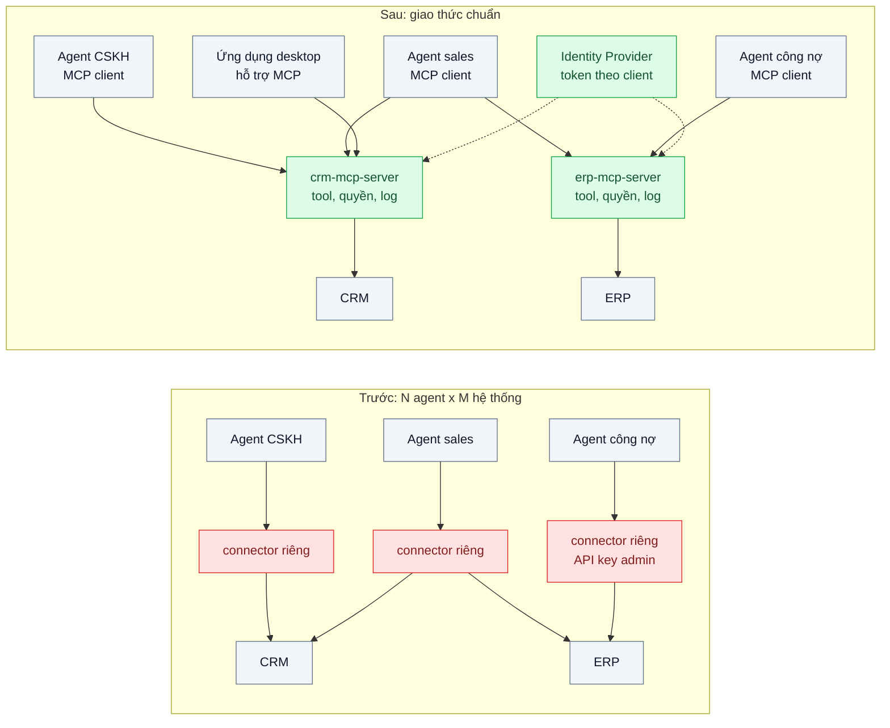
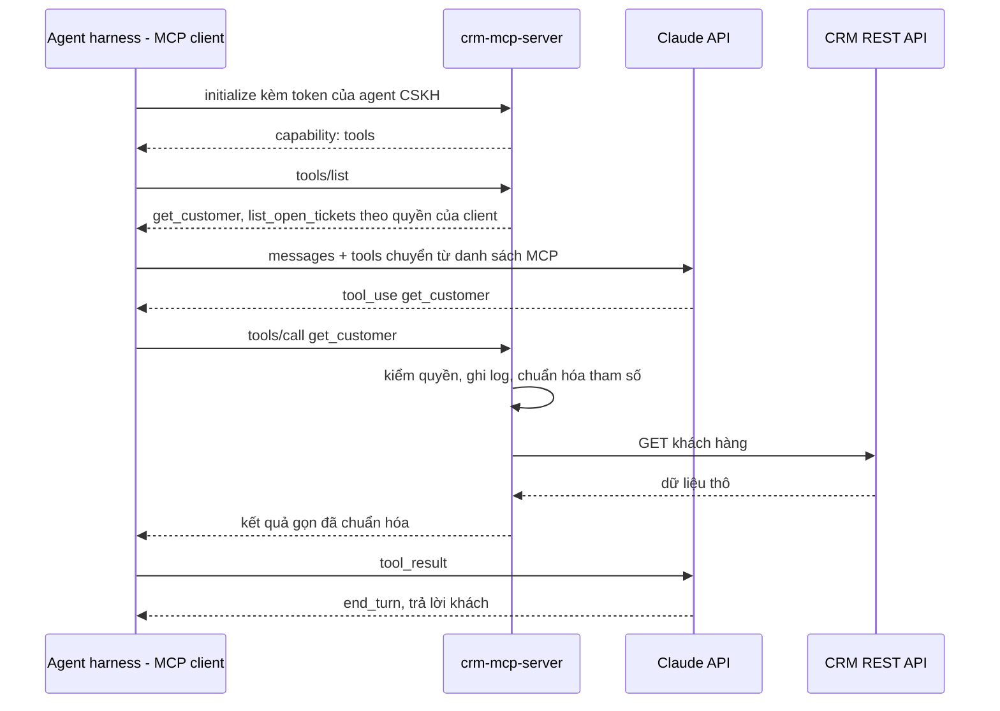

# MCP (Model Context Protocol) — Mỗi agent tự viết connector CRM/ERP riêng, không tái dùng được

| Scope | Mức độ | Trạng thái | Pattern gốc | Cập nhật |
|---|---|---|---|---|
| 11 · backend / AI Agent | 🟡 Trung bình | 📋 Kế hoạch | Model Context Protocol — MCP specification (modelcontextprotocol.io); Anthropic docs "MCP connector" | 2026-10-06 |

> **Một câu tóm tắt:** Đóng gói mỗi hệ thống nội bộ (CRM, ERP) thành một MCP server có tool, quyền và log thống nhất; mọi agent kết nối qua cùng một giao thức chuẩn thay vì mỗi agent tự viết connector riêng.

## 1. Bài toán thực tế (What)

**Bối cảnh** *(doanh nghiệp giả định, số liệu minh họa)*
Doanh nghiệp phân phối B2B thiết bị văn phòng, 400 nhân viên, dùng một CRM (khách hàng, cơ hội bán hàng) và một ERP (tồn kho, đơn bán, công nợ), cả hai có REST API. Trong 9 tháng, bốn đội lần lượt dựng bốn agent: chăm sóc khách hàng, trợ lý sales, nhắc công nợ, và trợ lý nội bộ trả lời nhân viên. Mỗi đội tự viết hàm gọi CRM/ERP trong code agent của mình.

**Triệu chứng người kinh doanh nhìn thấy**
- Có ba phiên bản "tra khách hàng" trả về dữ liệu khác nhau; trợ lý sales báo công nợ 0đ trong khi agent công nợ báo nợ quá hạn 45 ngày.
- CRM đổi API phân trang, bốn đội phải sửa bốn chỗ; agent công nợ hỏng 3 ngày mới có người phát hiện.
- Dựng agent thứ năm (báo giá) dự kiến mất 3 tuần, phần lớn là viết lại connector đã có ở nơi khác.
- Kiểm toán nội bộ phát hiện cả bốn agent dùng chung API key quyền admin của ERP.

**Nguyên nhân kỹ thuật**
Connector là chi tiết triển khai nằm *bên trong* từng agent: định nghĩa tool, mô tả, cách xác thực và cách chuẩn hóa dữ liệu bị nhân bản N lần và lệch nhau theo thời gian. Không có ranh giới chung giữa "agent" và "hệ thống nó dùng", nên không có nơi nào đặt quyền tối thiểu, log và kiểm thử một lần cho tất cả.

**Ràng buộc**
- CRM và ERP nằm trong mạng nội bộ; không mở trực tiếp ra Internet.
- Mỗi agent chỉ có quyền đúng việc của nó (agent CSKH không đọc công nợ chi tiết, agent công nợ không sửa cơ hội bán hàng).
- Không viết lại bốn agent cùng lúc; chuyển dần từng agent.
- Một số nhân viên muốn dùng cùng các tool này từ ứng dụng desktop có hỗ trợ MCP mà không cần đội kỹ thuật viết thêm.

## 2. Vì sao dùng pattern này (Why)

**Nguyên nhân gốc mà pattern nhắm vào:** Thiếu một hợp đồng chuẩn giữa ứng dụng AI và nguồn dữ liệu/công cụ, nên mỗi cặp "agent × hệ thống" là một tích hợp riêng (N × M connector).

**Pattern giải quyết thế nào:** MCP định nghĩa giao thức client–server dựa trên JSON-RPC 2.0: *server* công bố các *tool* (hàm có JSON Schema), *resource* (dữ liệu đọc được) và *prompt*; *client* nằm trong ứng dụng host (agent) khởi tạo phiên (`initialize`, thương lượng capability), liệt kê (`tools/list`) và gọi (`tools/call`). Transport chuẩn là stdio (chạy cục bộ) và Streamable HTTP (chạy từ xa); spec có phần Authorization cho transport HTTP dựa trên OAuth. Ta viết **một** `crm-mcp-server` và **một** `erp-mcp-server`; mỗi server sở hữu mô tả tool, chuẩn hóa dữ liệu, kiểm quyền theo danh tính client và log. Agent chỉ còn là MCP client: harness nối tới server, chuyển danh sách tool MCP thành tool của Messages API, và chuyển `tool_use` thành `tools/call`. Với server được phép đưa ra ngoài (có xác thực), Anthropic còn có MCP connector: khai báo `mcp_servers` kèm tool `mcp_toolset` để API gọi thẳng server mà không cần harness tự làm vòng lặp.

**Lựa chọn khác đã cân nhắc**

| Lựa chọn | Giải quyết được gì | Vì sao không chọn (ở bài này) |
|---|---|---|
| Giữ nguyên + tối ưu nhỏ (gom connector thành một package npm nội bộ) | Hết trùng code trong các agent TypeScript | Mỗi agent vẫn giữ API key và kiểm quyền riêng; không dùng được từ ứng dụng desktop hay agent viết bằng ngôn ngữ khác |
| Sinh tool tự động từ OpenAPI của CRM/ERP | Nhanh có hàng trăm tool | Tool thô theo endpoint, mô tả kém, quá nhiều tool làm agent chọn sai (scope 20 bài 09) |
| Đặt một API Gateway nội bộ trước CRM/ERP | Xác thực, quota tập trung | Giải quyết lớp HTTP, không chuẩn hóa định nghĩa tool cho model; có thể dùng *kèm* MCP server |
| **MCP server cho mỗi hệ thống, agent là MCP client (chọn)** | Một nơi định nghĩa tool, quyền, log; dùng lại cho mọi client hỗ trợ MCP | Thêm một tiến trình và một bước mạng mỗi lần gọi tool; phải theo dõi phiên bản spec |

## 3. Thiết kế hệ thống (How)

### 3.1 Kiến trúc trước và sau



### 3.2 Luồng chính



### 3.3 Thành phần và trách nhiệm

| Thành phần | Trách nhiệm | Quyết định thiết kế đáng chú ý |
|---|---|---|
| `crm-mcp-server`, `erp-mcp-server` | Công bố tool theo nghiệp vụ, kiểm quyền, chuẩn hóa dữ liệu, log | Tool theo *tác vụ* (`get_customer_summary`) thay vì theo endpoint; danh sách tool lọc theo quyền của client |
| Transport | Streamable HTTP trong mạng nội bộ cho agent server-side; stdio cho thử nghiệm cục bộ | Cùng một server code, đổi transport bằng cấu hình |
| Xác thực client | Mỗi agent một danh tính, token ngắn hạn từ Identity Provider | Không còn API key admin dùng chung; theo phần Authorization của spec cho HTTP |
| Harness của agent | Kết nối MCP, chuyển tool MCP thành tool Messages API, chuyển `tool_use` thành `tools/call` | Cache `tools/list` theo phiên; bật `strict: true` khi schema đáp ứng yêu cầu |
| MCP connector (tùy chọn) | Cho API gọi thẳng server qua `mcp_servers` + `mcp_toolset` | Chỉ áp dụng cho server được phép truy cập từ Internet, có xác thực; server nội bộ dùng harness |
| Bộ test hợp đồng | Gọi từng tool qua MCP client thật với CRM/ERP sandbox | Phát hiện CRM đổi API trước khi agent hỏng |

### 3.4 Điểm dễ sai khi triển khai
- Bê nguyên mọi endpoint REST thành tool: agent ngập trong 80 tool, chọn sai; thiết kế tool theo tác vụ và giữ ít tool (scope 20 bài 09).
- Server dùng một credential quyền cao cho mọi client: MCP chỉ dời chỗ vấn đề. Quyền phải theo danh tính client (và người dùng cuối khi có).
- Coi kết quả tool từ MCP server là "đáng tin": dữ liệu CRM có thể chứa văn bản do khách nhập; vẫn là dữ liệu, không phải lệnh (bài 05).
- Mở server nội bộ ra Internet chỉ để dùng MCP connector: nếu không có xác thực và kiểm quyền chặt, đó là lỗ hổng mới.
- Trả kết quả thô hàng nghìn dòng: tốn token và làm loãng ngữ cảnh; phân trang và tóm gọn ở server.

## 4. Tech stack và tác động (Impact techstack)

| Lớp | Công nghệ chọn | Vì sao chọn | Thay thế tương đương |
|---|---|---|---|
| Ngôn ngữ / runtime | TypeScript strict, Node 20+ | Cùng stack với agent hiện có | Python (MCP có SDK chính thức) |
| MCP server/client | MCP TypeScript SDK `@modelcontextprotocol/sdk` (cần xác minh API cụ thể) | SDK chính thức của dự án MCP, có cả server và client | Tự hiện thực JSON-RPC theo spec |
| HTTP | Fastify bọc transport Streamable HTTP | Server nhỏ, không cần cả NestJS | NestJS |
| Model & SDK | `@anthropic-ai/sdk`, `claude-opus-5-5`; MCP connector cho server công khai | Harness kiểm soát tool nội bộ; connector giảm code cho server công khai | — |
| Xác thực | Keycloak cấp token cho từng agent (client credentials) | Danh tính riêng mỗi agent, thu hồi được | Auth0, Identity Provider sẵn có |
| Log | Pino JSON log, gắn `client_id`, `tool`, `duration_ms` | Một nơi đếm tool call cho mọi agent | OpenTelemetry |
| Test | Vitest + CRM/ERP mock trong Docker Compose | Test hợp đồng tool không cần model | — |

**Thay đổi so với hệ thống hiện tại:** Thêm hai MCP server và cấu hình Identity Provider; sửa từng agent để bỏ connector riêng, dùng MCP client. Đội tích hợp sở hữu hai server; đội agent chỉ sở hữu prompt và luồng.

## 5. Kết quả đầu ra và cách đo (Output impact)

| Chỉ số | Trước (minh họa) | Mục tiêu khi thực hành | Cách đo |
|---|---|---|---|
| Số bản hiện thực "tra khách hàng" | 3 | 1 | Đếm định nghĩa tool trùng nghĩa trong repo |
| Số chỗ phải sửa khi CRM đổi API | 4 | 1 | Diễn tập: đổi mock CRM, đếm file cần sửa để test hợp đồng xanh lại |
| Thời gian nối agent mới với CRM/ERP | 3 tuần | ghi số thật, kỳ vọng vài ngày | Đo khi dựng agent báo giá mẫu |
| Agent dùng credential quyền admin | 4/4 | 0 | Rà cấu hình; test gọi tool ngoài quyền phải bị từ chối |
| Tỉ lệ tool call đúng trên bộ eval 100 câu | ghi số thật | không thấp hơn trước khi chuyển | Runner eval so tool và tham số mong đợi với log server |
| Độ trễ thêm mỗi tool call do bước MCP, p95 | 0 | < 50 ms trong mạng nội bộ | Log `duration_ms` ở harness trừ thời gian ở server |

> Số "trước" là minh họa để hình dung bài toán. Số "mục tiêu" chỉ được coi là đạt khi có số đo thật
> ở mục 8 kèm môi trường đo.

**Tác động nghiệp vụ mong đợi:** Dữ liệu khách hàng nhất quán giữa các agent, agent mới ra nhanh hơn, và kiểm toán có một nơi để xem ai đã đọc dữ liệu gì.

## 6. Đánh đổi và khi KHÔNG nên dùng

**Đánh đổi**
- Thêm tiến trình phải vận hành và một bước mạng mỗi lần gọi tool.
- Giao thức còn đang phát triển; phải theo dõi phiên bản spec và SDK.
- Thiết kế tool "trung lập" cho nhiều agent khó hơn viết tool cho đúng một agent.

**Không nên dùng khi**
- Chỉ có một agent và một hệ thống, cùng một repo TypeScript: một module dùng chung đơn giản hơn.
- Tool là logic thuần trong ứng dụng (tính phí vận chuyển), không phải hệ thống ngoài: định nghĩa tool trực tiếp là đủ.
- Đội chưa có nơi quản lý danh tính dịch vụ: làm phần xác thực trước, nếu không MCP server chỉ là một proxy quyền admin.

**Liên quan**
- [02 — Tool Use](../02-tool-use-agent-tra-cuu-don-hang-trong-db-noi-bo/) — vòng lặp tool use mà MCP client cắm vào.
- [05 — Prompt Injection Defense](../05-prompt-injection-khach-nhap-bo-qua-huong-dan-giam-gia-100/) — dữ liệu từ MCP server vẫn là dữ liệu.
- [Tool Design & Tool Search (scope 20)](../../20-backend-ai-framework-system-design/09-tool-design-for-agents-30-tool-agent-chon-sai/) — thiết kế tool để agent chọn đúng.
- [Machine-to-Machine Auth (scope 19)](../../19-backend-frontend-authenticate/10-api-key-service-to-service-client-credentials-mtls/) — danh tính cho từng agent.

## 7. Cơ sở tham khảo

- Model Context Protocol specification — https://modelcontextprotocol.io/ — kiến trúc host/client/server, JSON-RPC 2.0, lifecycle `initialize`, primitive tool/resource/prompt, transport stdio và Streamable HTTP, phần Authorization.
- Anthropic docs, "MCP connector" — https://platform.claude.com/docs/en/managed-agents/mcp-connector — khai báo MCP server từ xa cho agent và cách cấp credential; tham số `mcp_servers` + `mcp_toolset` của Messages API (cần xác minh trang con mô tả biến thể Messages API).
- Anthropic docs, "Tool use overview" — https://platform.claude.com/docs/en/agents-and-tools/tool-use/overview — định dạng tool mà harness chuyển đổi từ danh sách MCP.
- Anthropic, "Writing effective tools for agents — with agents", 2025-09 — https://www.anthropic.com/engineering/writing-tools-for-agents — thiết kế tool theo tác vụ, trả kết quả gọn; áp dụng cho tool của MCP server.

## 8. Kế hoạch thực hành

- [ ] Bước 1: Docker Compose với CRM mock và ERP mock (REST), Keycloak; hai agent "cũ" có connector riêng lệch nhau để tái hiện dữ liệu mâu thuẫn.
- [ ] Bước 2: Đo "trước": số bản tool trùng, số file phải sửa khi đổi API mock, tỉ lệ tool call đúng trên 100 câu.
- [ ] Bước 3: Áp dụng pattern: `crm-mcp-server` và `erp-mcp-server` (Streamable HTTP), lọc tool theo quyền client, chuyển hai agent sang MCP client.
- [ ] Bước 4: Đo "sau" cùng bộ câu và cùng diễn tập đổi API; ghi vào mục 5 kèm phiên bản spec/SDK.
- [ ] Bước 5: Test Vitest chứng minh: client CSKH không thấy và không gọi được tool công nợ; đổi API mock chỉ cần sửa server; kết quả tool được phân trang.

**Cấu trúc code dự kiến**
```text
src/
  servers/crm-mcp-server.ts      # tool CRM, lọc theo quyền
  servers/erp-mcp-server.ts
  servers/auth.ts                # xác thực token client
  agents/mcp-tool-bridge.ts      # MCP tool -> tool Messages API
  agents/support-agent.ts
test/
  crm-server.contract.test.ts
  tool-permissions.test.ts
docker-compose.yml
```

**Cách chạy** *(điền khi bắt đầu code)*
```bash
docker compose up -d
pnpm install && pnpm test
```
